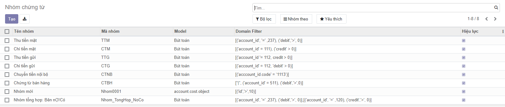
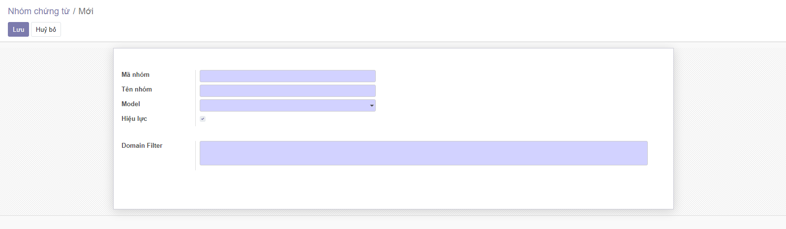
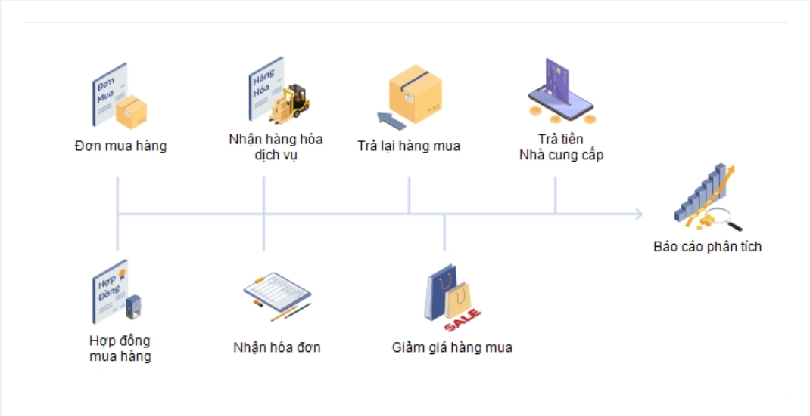
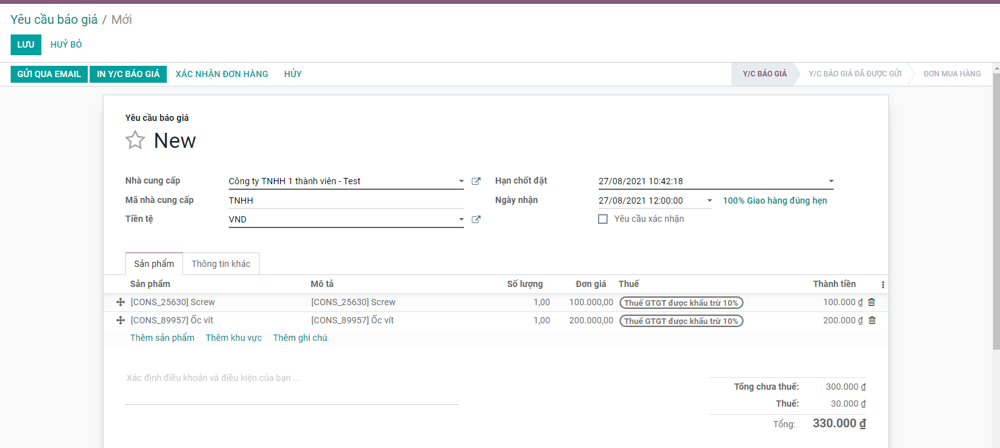
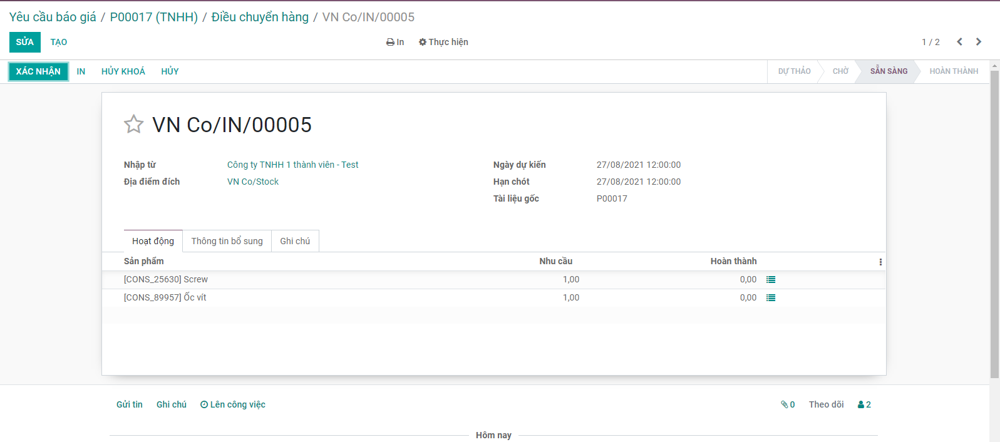
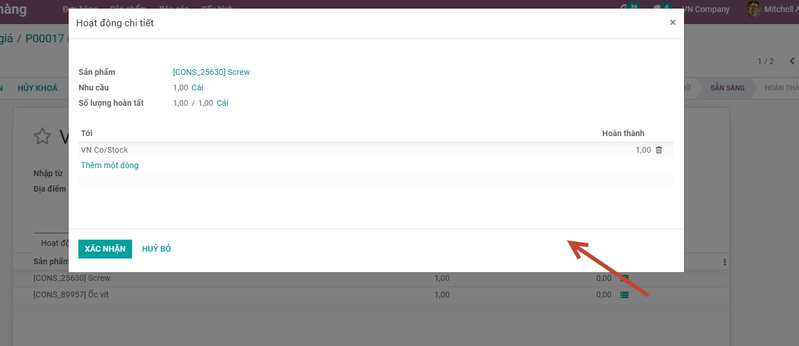
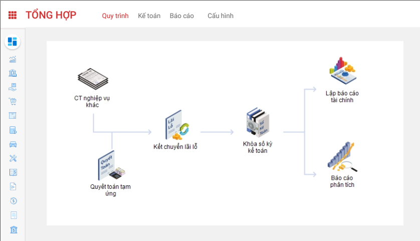

# 1	TỔNG QUAN HỆ THỐNG vESS
## 1.1	Giới thiệu tổng quan về hệ thống vESS
<em>
[Mô tả tổng quan về hệ thống vESS, giá trị mang lại]
</em>

Cung cấp các giải pháp quản lý doanh nghiệp trên nhiều lĩnh vực: Kế toán; Bán hàng; Mua hàng, Nhân sự..Người dùng chỉ cần sử dụng một tài khoản duy nhất để truy cập và sử dụng toàn bộ các phần mềm trên hệ thống. Doanh nghiệp có thể dễ dàng hơn trong việc thu thập, lưu trữ, quản lý thông tin, dữ liệu, hỗ trợ trong quá trình đưa quyết định chiến lược và đánh giá hiệu quả kinh doanh.Việc  này giúp doanh nghiệp tiết kiệm tối đa nguồn lực, kiểm soát hiệu quả các hoạt động kinh doanh của doanh nghiệp…

Những lợi ích hệ thống vESS mang lại cho Doanh nghiệp:
- Thông tin tích hợp
- Hiệu quả chi phí
- Khả năng mở rộng…

## 1.2	Mô hình tổng thể
<em>
[Hình chụp mô hình tổng thể]
</em>

## 1.3	Giới thiệu tổng quan các phân hệ
<em>
[Mô tả khái quát chức năng, nhiệm vụ của các phân hệ trong hệ thống vESS]
</em>

Kế toán: Là phần mềm kế toán dành cho các doanh nghiệp vừa và nhỏ, đáp ứng được các chế độ kế toán doanh nghiệp …
# 2	ĐĂNG KÝ VÀ CÀI ĐẶT SỬ DỤNG HỆ THỐNG vESS
<em>
[Mô tả các bước đăng ký và cài đặt hệ thống vESS]
</em>

* Hướng dẫn đăng ký sử dụng dịch vụ từ portal
* Các gói sản phẩm 
* Hướng dẫn nâng cấp người dùng trial 
*  Hướng dẫn chấm dứt dịch vụ
*  Hỗ trợ người dùng: Mô tả về các kênh chăm sóc khách hàng, giải đáp hỗ trợ nghiệp vụ/kỹ thuật <add được chat/bot>

# 3	HƯỚNG DẪN SỬ DỤNG CÁC CHỨC NĂNG  - KẾ TOÁN
## 3.1	Giới thiệu về phân hệ Kế toán
<em>
[Giới thiệu chung về Phân hệ kế toán, đưa ra mô hình full]
</em>

Là nơi tập hợp tất cả dữ liệu tài chính từ mọi bộ phận trong Công ty. Phân hệ Kế toán sẽ xử lý tổng thể việc quản trị kế toán (sổ cái, các khoản phải thu, phải trả), mua hàng, và thanh toán.Cung cấp bức tranh toàn cảnh về tài chính doanh nghiệp. Hỗ trợ lập tài chính hiệu quả

<em>[Hình ảnh]</em>

 
## 3.2	Thiết lập và khai báo ban đầu
<em>
[Mô tả các thiết lập cần có cho lần sử dụng đầu tiên để khởi tạo các thông tin về Chế độ kế toán, Cơ cấu tổ chức, Tài khoản]
</em>

## 3.3	Các thuật ngữ và từ viết tắt
<em>
[Diễn giải thuật ngữ và mô tả từ viết tắt]
</em>

		
		
		
		
		

## <em>3.4	Hướng dẫn sử dụng chức năng</em>
### <em>3.4.1	Khai báo danh mục</em>
#### <em>3.4.1.1	Đơn vị, phòng ban</em>
#### <em>3.4.1.2	Tài khoản</em>
#### <em>3.4.1.3	Đối tượng</em>
#### <em>3.4.1.4	Danh mục khác </em>
#### <em>3.4.1.4.1	Nhóm chứng từ</em>
Chức năng này cho phép người dùng khai báo Nhóm chứng từ sử dụng trên hệ thống
Các bước thực hiện
1. Vào phân hệ <strong>Tổng hợp</strong>, chọn <strong> Nhóm chứng từ</strong>, nhấn <strong>Tạo </strong> (Hoặc vào theo chức năng tại phần Tìm kiếm)
 
2. Khai báo các thông tin chi tiết của Nhóm chứng từ 
 

*	 Mã nhóm: Không trùng với Mã đã khai báo

*	Tên nhóm: Thông tin để quản lý

*	 Model: quyết định việc lấy dữ liệu bút toán tại các phần hành

*	Domain filter: Điều kiện để lọc dữ liệu, áp dụng cho phần Đánh CTGS

3. Nhấn nút Lưu

<strong><ins>Lưu ý:</ins></strong>

<em>
[Có thông tin Lưu ý gì khi thực hiện Chức năng phải ghi lại, tương tự phần Chức năng nghiệp vụ bên dưới]
</em>

### <em>3.4.2	Mua hàng</em>
#### <em>3.4.2.1	Quy trình nghiệp vụ</em>
<em>
[Mô tả nghiệp vụ tổng quát và quy trình thực hiện]
</em>

Quản lý toàn bộ quy trình Mua hàng: Từ yêu cầu gửi báo giá đến Đơn hàng, Hóa đơn mua hàng và Hóa đơn trả hàng

##### Quy trình nghiệp vụ
<em>
[Hình luồng quy trình nghiệp vụ của Module]
</em>

 
##### Các luồng quy trình

<em>
[Liệt kê đầy đủ các luồng quy trình nghiệp vụ có trong phân hệ Mua hàng,, có link đến Phần Hướng dẫn chi tiết]
</em>

*	Lập yêu cầu báo giá gửi Nhà cung cấp. Chi tiết nghiệp vụ tại đây

*	Lập Đơn mua hàng gửi Nhà cung cấp. Chi tiết nghiệp vụ tại đây

*	Mua hàng trong nước về nhập kho. Chi tiết nghiệp vụ tại đây

*	Mua hàng hóa nhập khẩu về nhập kho. Chi tiết nghiệp vụ tại đây
#### <em>3.4.2.2	Yêu cầu báo giá</em>

[Mô tả nghiệp vụ và video hướng dẫn sử dụng các luồng nghiệp vụ của chức năng]

##### 3.4.2.2.1	Mô tả nghiệp vụ
##### Mô tả nghiệp vụ
<em>
[Mô tả nghiệp vụ trong phần Chức năng]
</em>

Khi đơn vị có nhu cầu mua hàng, lập yêu cầu mua hàng thì quy trình thực hiện như sau:
1. Trưởng bộ phận có nhu cầu mua hàng trình Giám đốc đề nghị mua hàng kèm với đề xuất về nhà cung cấp (nếu có.
2. Ban giám đốc duyệt đề nghị mua hàng và chuyển lại cho bộ phận mua hàng; kế toán mua hàng.
3. Bộ phận mua hàng đàm phán giá cả với nhà cung cấp và đề xuất lựa chọn nhà cung cấp tới ban giám đốc.
4. Kế toán mua hàng kiểm tra lại giá cả, thông tin nhà cung cấp để tư vấn thêm cho giám đốc về lựa chọn nhà cung cấp
5. Ban giám đốc phê duyệt về kế hoạch mua hàng
6. Bộ phận Mua hàng thực hiện Lập yêu cầu báo giá và gửi thông tin đến Nhà cung cấp

##### Luồng chức năng chính
<em>
[Mô tả lần lượt các luồng tính năng chính trên Chức năng, nhưng không liệt kê theo hướng Tao, sửa, xóa mà Theo Nghiệp vụ chức năng trên Chức năng đang mô tả]
</em>

* Lập yêu cầu báo giá gửi Nhà cung cấp. Chi tiết nghiệp vụ tại đây

*	Xác nhận Đơn hàng từ Nhà cung cấp. Chi tiết nghiệp vụ tại đây
##### Xem video hướng dẫn
<em>
[Xây dựng video hướng dẫn trên phần mềm, gồm đủ các luồng chức năng được mô tả bên dưới]
</em>

##### <em>3.4.2.2.2	Lập yêu cầu báo giá gửi Nhà cung cấp

[Mô tả lần lượt các luồng tính năng chính trên Chức năng, nhưng không liệt kê theo hướng Tao, sửa, xóa mà Theo Nghiệp vụ chức năng trên Chức năng đang mô tả

VD: Phần chức năng Yêu cầu báo giá:: Có các chức năng trên giao diện về: Tạo; Sửa, In Yêu cầu, Gửi Email, Nhận hàng…

Phần Nghiệp vụ của Yêu cầu báo giá  phân tách thành các nghiệp vụ (không phải rập khuân theo action của Button)

•	Lập yêu cầu báo giá gửi Nhà cung cấp (trong phần này có mô tả tính năng In YC báo giá và Gửi Email)

•	Xác nhận Đơn hàng từ Nhà cung cấp

Tại mỗi Luồng nghiệp vụ sau khi mô tả bước thức hiện có Nội dung Lưu ý cho mỗi Nghiệp vụ, thường là Luồng sau của Nghiệp vụ đang mô tả hoặc diễn giải các lưu ý khi khai báo thông tin
Luồng sau: Sau khi Xác nhận Đơn hàng từ Nhà cung cấp, có thể tạo được luôn luồng Nghiệp vụ Tạo hóa đơn, khi mô có link liên kết đến Nghiệp vụ Tạo hóa đơn

Diễn giải các lưu ý: Sau khi Xác nhận đơn hàng từ Nhà cung cấp, chương trình sẽ tự động tạo ra Phiếu nhập kho trên chức năng Quản lý phiếu nhập
]
</em>
##### Lập yêu cầu báo giá
* Khi Ban GĐ/Quản lý phê duyệt kế hoạch mua hàng; bộ phận mua hàng thực hiện lập Yêu cầu báo giá gửi cho Nhà cung cấp

<strong>Đối tượng thực hiện :</strong> Nhân viên bộ phận mua hàng 

<em>[Bước 1 : Mô tả bước vào đến màn hình chức năng và có Hình chụp giao diện khi thực hiện]
</em>
1. Vào phân hệ <strong>Mua hàng </strong>, Chọn <strong>Yêu cầu báo giá</strong> (Hoặc thực hiện <strong>Tìm kiếm</strong> trực tiếp chức năng trên ô tìm kiếm chung của hệ thống)
 
<em>[Bước 2: Mô tả việc khai báo thông tin trên Giao diện, theo hướng diễn giải, không theo hướng click thao tác trên giao diện. Với mỗi trường khi chọn/nhập: ảnh hưởng đến luồng đi hay ràng buộc của Dữ liệu phải chỉ rõ thông tin

Như: Khi chọn một trường dữ liệu sẽ ảnh hưởng đến phần khai báo thêm 1 thông tin nào đó/ hoặc Tab dữ liệu liên quan; phải mô tả rõ

VD : Chọn <strong> Nhận kèm hóa đơn trong </strong>trường hợp hóa đơn về trước hàng về sau, hoặc nhận hàng và hóa đơn cùng lúc. => Khi đó, cần khai báo thêm thông tin hóa đơn trên <strong>tab Hóa đơn </strong>và thông tin thuế GTGT trên tab <strong>Thuế</strong>]
</em>

2. Khai báo các thông tin chi tiết của Yêu cầu báo giá:

•	Chọn thông tin Nhà cung cấp

•	Chọn tiền tệ giao dịch trong Đơn hàng

•	Khai báo thông tin về Hạn chốt, Ngày nhận

•	Khai báo thông tin về Sản phẩm đặt từ Nhà Cung cấp

	o	Chọn các sản phẩm yêu cầu báo giá từ nhà cung cấp

	o	Nhập thông tin Số lượng, Đơn giá, Chiết khấu và mức Thuế đối với từng Sản phẩm

	o	Với nội dung cần Lưu ý đối với Yêu cầu báo giá, thực hiện Thêm ghi chú => Thông tin nội dung sẽ được in trên file gửi nhà Cung cấp
3. Nhấn <strong> Lưu</strong>

4. Thực hiện In yêu cầu báo giá: kiểm tra thông tin dữ liệu trên mẫu yêu cầu báo giá và tùy chỉnh thông tin Mẫu yêu cầu

5. Thực hiện Gửi Email đến nhà cung cấp sau khi hoàn thành Yêu cầu báo giá

##### <em>3.4.2.2.3	Xác nhận Đơn hàng từ Nhà cung cấp</em>
##### Xác nhận Đơn hàng

*    Các đơn hàng được Nhà cung cấp trả hàng theo Yêu cầu báo giá đã gửi, bộ phận mua hàng/kho thực hiện xác nhận về kho của công ty

<strong>Đối tượng thực hiện :</strong> Nhân viên bộ phận mua hàng 

1. Vào phân hệ <strong> Mua hàng</strong>, trên<strong> Danh sách Yêu cầu báo giá</strong>, tìm thông tin Yêu cầu đã được Nhà cung cấp xác nhận và thực hiện trả 
 
2. Thực hiện xác nhận thông tin Số lượng sản phẩm mà Nhà cung cấp bàn giao
*   Trường hợp Nhà cung cấp trả hàng theo đúng Yêu cầu báo giá: Thực hiện Xác nhận thông tin toàn bộ Đơn hàng mà không cần xác nhận từng Sản phẩm nhận được
*	Trường hợp Nhà cung cấp trả hàng còn thiếu/thừa so với Yêu cầu: Khi đó người dùng cần Vào từng sản phẩm để xác nhận theo đúng số lượng thực tế nhận về
 
3. Nhấn nút <strong> Xác nhận</strong>

<strong><ins>Lưu ý:</ins></strong>

*	Sau khi thực hiện Xác nhận đơn hàng, chương trình tự động tạo ra một Phiếu nhập kho bên Phân hệ Quản lý kho
#### <em>3.4.2.3	Hóa đơn mua hàng</em>
<em>[Mô tả nghiệp vụ và video hướng dẫn sử dụng các luồng nghiệp vụ của chức năng]
</em>
##### <em>3.4.2.3.1	Mô tả nghiệp vụ</em>
<strong>Mô tả nghiệp vụ</strong>

<em>
[Mô tả nghiệp vụ trong phần Chức năng]
</em>

<strong>Luồng chức năng chính</strong>

<em>
[Mô tả lần lượt các luồng tính năng chính trên Chức năng, nhưng không liệt kê theo hướng Tao, sửa, xóa mà Theo Nghiệp vụ chức năng trên Chức năng đang mô tả]
</em>

<strong>Xem video hướng dẫn</strong>

<em>
[Xây dựng video hướng dẫn trên phần mềm, gồm đủ các luồng chức năng được mô tả bên dưới]
</em>

##### <em>3.4.2.3.2	Mua hàng trong nước về nhập kho</em>

##### <em>3.4.2.3.3	Mua hàng hóa nhập khẩu về nhập kho</em>

### <em>3.4.3	Kế toán tổng hợp</em>

#### <em>3.4.3.1	Quy trình nghiệp vụ</em>

<em>[Mô tả thông tin chung]</em>

Kế toán tổng hợp được sử dụng để cập nhật các phiếu kế toán tổng quát, các bút toán điều chỉnh, phân bổ, đánh giá, kết chuyển cuối kỳ; thực hiện lên sổ sách kế toán và báo cáo tài chính theo quy định.

<strong>Quy trình nghiệp vụ</strong>

<em>
[Hình luồng quy trình nghiệp vụ của Module]
 </em>

<strong>
Các luồng quy trình
</strong>

<em>
[Liệt kê các luồng quy trình nghiệp vụ có trong Module, có link đến Phần Hướng dẫn chi tiết]
</em>

*	Lập chứng từ ghi sổ đơn lẻ. Chi tiết nghiệp vụ tại đây
*	Lập chứng từ ghi sổ đồng loạt. Chi tiết nghiệp vụ tại đây

#### <em>3.4.3.2	Chứng từ ghi sổ</em>

##### <em>3.4.3.2.1	Mô tả nghiệp vụ</em>

Thực hiện tạo và cập nhật số CTGS các bút toán của kế toán có đăng ký nhận số CTGS

##### <em>3.4.3.2.2	Lập chứng từ ghi sổ đơn lẻ</em>
##### <em>3.4.3.2.3	Lập chứng từ ghi sổ đồng loạt</em>

### <em>3.4.4	Quản lý tiền</em>
### <em>3.4.5	Quản lý kho</em>

## 3.5	Lịch sử phát triển sản phẩm

