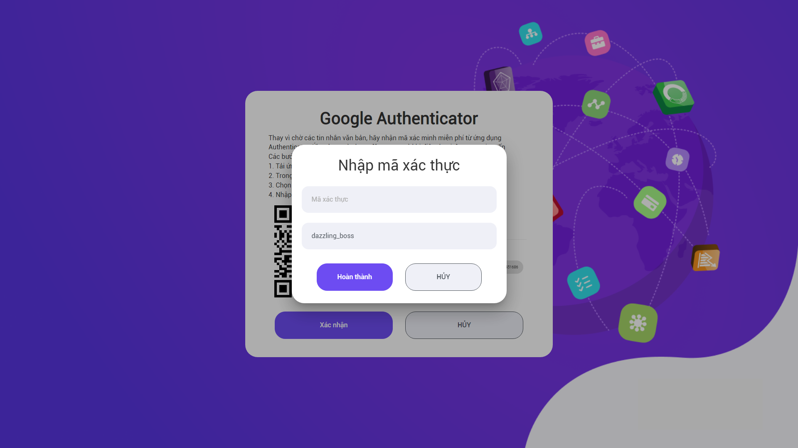

### Quy trình nghiệp vụ

Đăng nhập bằng G+ là tính năng hỗ trợ người dùng đăng nhập hệ thống bằng tài khoản gmail qua xác thực G+, giảm thiểu thời gian nhập user/password trên màn hình đăng nhập truyền thống.

#### Quy trình

**Các luồng quy trình Phê duyệt trên Web**

* Đăng nhập bằng G+. Chi tiết nghiệp vụ <u>[tại đây](#ang-nhap-bang-g)</u>.

#### Mô tả nghiệp vụ

Người dùng có nhu cầu đăng nhập nhanh hơn mà không cần nhập user/password nhiều lần, có thể thực hiện đăng nhập bằng G+ qua quy trình đơn giản như sau:

1. Người dùng nhấn chọn đăng nhập bằng G+.

2. Thực hiện xác thực qua Google Authenticator để sử dụng chức năng.

**Luồng chức năng chính**

* Đăng nhập bằng G+. Chi tiết nghiệp vụ <u>[tại đây](#ang-nhap-bang-g)</u>.

### Đăng nhập bằng G+

**Đối tượng thực hiện:** Người dùng

1. Vào màn hình **Đăng nhập**. Nhấn chọn 
    
    

2. Sau khi nhấn chọn đăng nhập bằng G+, màn hình hiển thị cho phép người dùng chọn gmail để đăng nhập hệ thống. 
    
    
    
    * Nếu chưa có gmail trên trình duyệt, người dùng sẽ cần đăng nhập gmail để sử dụng tiếp chức năng.
    
    

    * Khi đã chọn/ nhập gmail có tài khoản trên hệ thống, màn hình hiển thị cho phép người dùng quét mã QR để xác thực qua Google Authenticator:
    
    
    
    * Người dùng vào ứng dụng Google Authenticator trên mobile, quét mã bằng tài khoản gmail tương ứng vừa đăng nhập.
    
    * Sau khi có quét mã, tiếp tục nhấn Xác nhận, màn hình hiển thị cho cho phép nhập mã:
    
    
    
    * Người dùng nhập mã và nhấn Hoàn thành
   
    > **Lưu ý:** **Bước 2** chỉ áp dụng đối với người mới sử dụng tính năng đăng nhập bằng G+ **lần đầu tiên**. Từ lần thứ 2 trở đi, người dùng sẽ được **bỏ qua** bước này. Sau khi nhấn chọn đăng nhập G+ màn hình sẽ hiển thị luôn bước thứ 3: **Xác thực 2 bước**.

3. Xác thực 2 bước:
    
    * Người dùng tiếp tục nhập mã đã được gửi về Google Authenticator trên mobile
    
    
    
    * Nhấn Đăng nhập

4. Chọn thời lượng ghi nhớ đăng nhập G+
    
    * Khi đã xác thực đúng mã Google Authenticator, hệ thống tiến hành cho phép người dùng lựa chọn thời gian lưu đăng nhập:
    
    
    
    * Màn hinh hiểu thị mặc định **Vĩnh viễn**. Người dùng có thể thay đổi thời gian bằng nhiều lựa chọn khác:
    
    
    
    * Thời gian lưu đăng nhập bằng G+ sẽ tương ứng với thời gian người dùng lựa chọn:
        
        * Nếu chọn **Vĩnh viễn**: Hệ thống ghi nhớ mã xác thực của người dùng và khi người dùng đăng nhập bằng G+ lần sau, hệ thống sẽ được đăng nhập không cần nhập mã xác thực.
        
        * Nếu chọn mức độ thời gian khác nhau (Giờ, phút,...), thì khi hết thời gian, người dùng đăng nhập bằng G+ sẽ cần nhập mã xác thực lại lần sau.
    
    * **Lưu ý:** Nếu người dùng nhấn Bỏ qua, người dùng sẽ luôn phải xác thực bằng 2 bước (từ bước 3).
    
5. Nhấn **Tiếp tục**, người dùng sẽ đăng nhập hệ thống thành công.