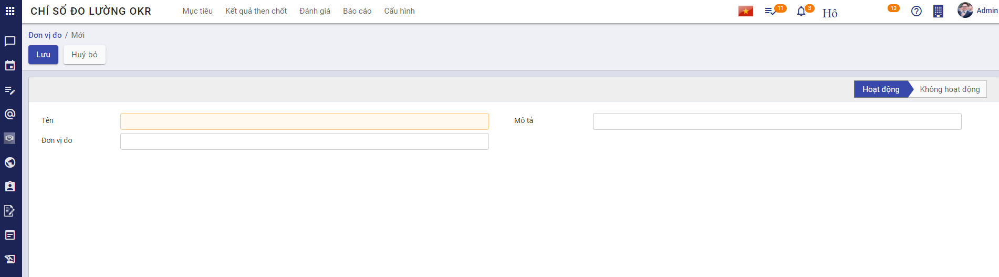
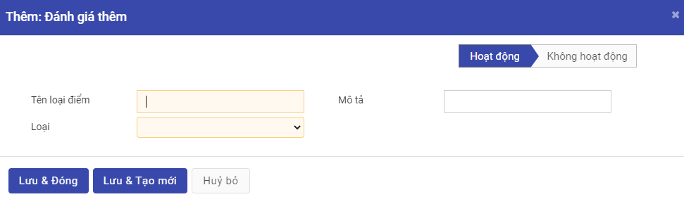
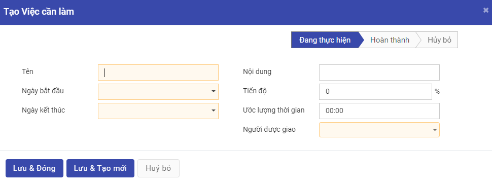
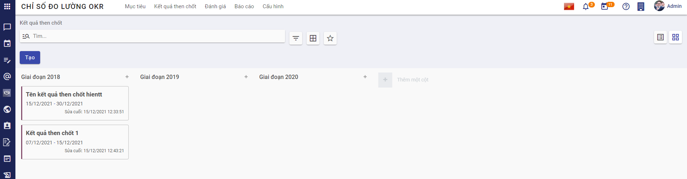
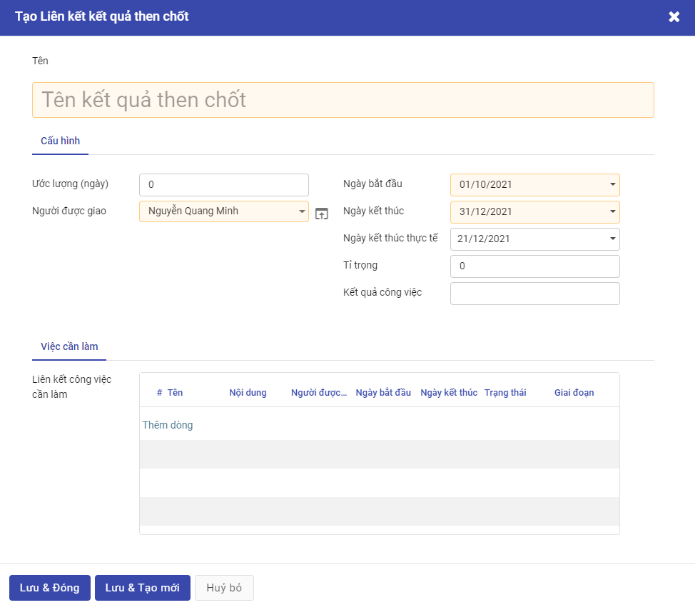

# Quy trình nghiệp vụ

OKRs cho phép thiết lập các tiêu chí đánh giá kết quả thực hiện mục tiêu trong một khuôn khổ thiết lập mục tiêu và theo dõi kết quả thực hiện mục tiêu, đảm bảo đi đúng hướng và xác định điểm ưu tiên rõ ràng, chính xác theo một nhịp điệu chung

**Quy trình**

**Các luồng quy trình**

* Cấu hình. Chi tiết nghiệp vụ <u>[tại đây](#cau-hinh)</u>

* Mục tiêu. Chi tiết nghiệp vụ <u>[tại đây](#muc-tieu)</u>.

* Kết quả then chốt. Chi tiết nghiệp vụ <u>[tại đây](#ket-qua-then-chot)</u>

* Đánh giá. Chi tiết nghiệp vụ <u>[tại đây](#anh-gia)</u>

* Báo cáo. Chi tiết nghiệp vụ <u>[tại đây](#bao-cao)</u>

**Mô tả nghiệp vụ**

1. Hệ thống OKR có tính liên kết và phân cấp từ công ty, sau đó chuyển xuống các bộ phận, các nhóm và cuối cùng là từng cá nhân.
2. Quản trị hệ thống cần thiết lập **Cấu hình** trước khi tạo **Mục tiêu** bao gồm "Chu kì, Đơn vị đo, Loại điểm đánh giá, Giai đoạn của mục tiêu, Giai đoạn của kết quả then chốt"
3. Người sử dụng có thể tạo và kiểm soát **Mục tiêu** của mình. **Mục tiêu** là điều hướng tới, điều mong muốn đạt được trong tương lai
4. Sau khi chốt **Mục tiêu**, người sử dụng sẽ xác định **Kết quả then chốt** cần đạt được để hoàn thành "Mục tiêu" đó
5. Quản lý/Trưởng phòng có thể kiểm soát được mức độ hoàn thiện **Mục tiêu** của cấp dưới, nhìn nhận được vấn đề nhanh chóng và chính xác
7. Người sử dụng có thể thực hiện phản hồi ngang hàng hoặc phản hồi chéo về "Mục tiêu" của nhau
8. Cấp quản lý có hệ thống chấm điểm, đánh giá - ghi nhận nỗ lực của các cấp dưới

**Luồng chức năng chính**

* Đơn vị đo. Chi tiết nghiệp vụ <u>[tại đây](#on-vi-do)</u>

* Loại điểm đánh giá. Chi tiết nghiệp vụ <u>[tại đây](#loai-iem-anh-gia)</u>

* Chu kỳ. Chi tiết nghiệp vụ <u>[tại đây](#chu-ky)</u>

* Trạng thái thực hiện của mục tiêu. Chi tiết nghiệp vụ <u>[tại đây](#trang-thai-thuc-hien-cua-muc-tieu)</u>

* Trạng thái của kết quả then chốt. Chi tiết nghiệp vụ <u>[tại đây](#trang-thai-cua-ket-qua-then-chot)</u>

* Gắn thẻ. Chi tiết nghiệp vụ <u>[tại đây](#gan-the)</u>

* Mục tiêu. Chi tiết nghiệp vụ <u>[tại đây](#muc-tieu)</u>.

* Kết quả then chốt. Chi tiết nghiệp vụ <u>[tại đây](#ket-qua-then-chot)</u>

* Đánh giá. Chi tiết nghiệp vụ <u>[tại đây](#anh-gia)</u>

* Báo cáo. Chi tiết nghiệp vụ <u>[tại đây](#bao-cao)</u>

**Video hướng dẫn**

## **Cấu hình**

### **Đơn vị đo**

**Đơn vị đo** thể hiện cách đo lường chỉ số OKRs, là cơ sở để thiết lập các mức chỉ tiêu

**Đối tượng thực hiện**: Người sử dụng là Quản trị hệ thống và vai trò Tổ chức lao động

**Các bước thực hiện:**

1. Vào chức năng **Chỉ số đo lường OKR**, chọn **Cấu hình** **->** **Đơn vị đo**

    
    
2. Kích nút **Tạo**
3. Nhập thông tin tạo **Đơn vị đo**

    
    
    * **Tên:** nhập tên đơn vị đo mới cho "Cấu hình Đơn vị đo"
    * **Mô tả:** nhập mô tả cho "Cấu hình Đơn vị đo"
    * **Đơn vị đo:** nhập "Đơn vị đo"
   
  4.  Kích **Lưu:** thông tin về **Đơn vị đo** được lưu lại   
  5.  Kích **Huỷ bỏ** để hủy thao tác thêm mới **Đơn vị đo**
  

### **Loại điểm đánh giá** 

**Loại điểm đánh giá** là thang điểm đánh giá "Mục tiêu"

**Đối tượng thực hiện**: Người sử dụng là Quản trị hệ thống

1. Vào chức năng Chỉ số đo lường OKR, chọn **Cấu hình** **->** **Loại điểm đánh giá**

   
2. Kích nút **Tạo**  
3. Nhập thông tin tạo **Loại điểm đánh giá**

   
     * **Tên:** nhập tên cho "Loại điểm đánh giá"
     
     * **Mô tả:** nhập mô tả cho "Loại điểm đánh giá"
     
     * **Loại:** chọn loại điểm đánh giá là "Chọn" hoặc "Đầu vào"
     
     * Nếu người dùng chọn loại điểm đánh giá là **Chọn**, loại điểm đánh giá sẽ do người dùng cấu hình các giá trị đánh giá
        
     
     * Nếu người dùng chọn loại điểm đánh giá là **Đầu vào**, thì loại điểm đánh giá sẽ là do người dùng tự nhập
        
        
  4.  Kích **Lưu:** thông tin về "Loại điểm đánh giá được lưu lại"    
  5.  Kích **Huỷ bỏ** để huỷ thao tác thêm mới "Loại điểm đánh giá"
  
### **Chu kì**
**Chu kì** là một khoảng thời gian của một "Mục tiêu", sẽ có các Mục tiêu lặp lại qua các chu kì. Trong suốt chu kì, người sử dụng sẽ liên tục đo lường và theo dõi kết quả "Mục tiêu" của mình, đồng thời có sự trao đổi thường xuyên với quản lý

**Đối tượng thực hiện**: Người sử dụng là Quản trị hệ thống và vai trò Tổ chức lao động

**Các bước thực hiện:**

1. Vào chức năng **Chỉ số đo lường OKR**, chọn **Cấu hình** **->** **Chu kì**

    
  2. Kích nút **Tạo**
  3. Nhập thông tin tạo "Chu kì"
  
  
  
  * **Tên:** nhập tên chu kì mới cho "Cấu hình chu kì"
  * **Loại chu kì:** nhập loại chu kì mới cho "Cấu hình Chu kì"
  * **Mô tả:** nhập mô tả cho "Cấu hình Chu kì"
  * **Loại điểm đánh giá:** chọn loại điểm đánh giá phù hợp với "Chu kì"
  * **Ngày bắt đầu:** bắt đầu "Chu kì" giao nhiệm vụ
  * **Ngày kết thúc:** kết thúc "Chu kì" giao nhiệm vụ
  * **Ngày bắt đầu đánh giá:** chọn ngày bắt đầu đánh giá "Chu kì"
  * **Ngày kết thúc đánh giá:** chọn ngày kết thúc đánh giá "Chu kì"
  * **Chu kì trước:** tích chọn hoặc không chọn phù hợp với "Chu kì" mong muốn
  * **Chu kì mặc định:** tích chọn hoặc không chọn phù hợp với "Chu kì" mong muốn
  * **Đánh giá thêm:** Kích vào "Thêm một dòng"
  
  
  
  * Kích chọn vào thang điểm đánh giá mong muốn, sau đó nhấn "Chọn", hệ thống sẽ cập nhật dữ liệu đã đánh giá thêm vào **Chu kì**
  
  * Kích chọn "Tạo" để tạo thang điểm đánh giá thêm. Người dùng có thể đánh giá CBNV các nội dung khác ngoài **Mục tiêu** như "Tuân thủ địa điểm làm việc","Tuân thủ nội quy lao động", "Xếp hạng Ki",...
  
  
  
  3. Kích **Lưu:** thông tin về **Chu kì** được lưu lại
  4. Kích **Huỷ bỏ** để hủy thao tác thêm mới **Chu kì**
    
        **Lưu ý:** Nếu đến cuối chu kì bạn chấm điểm phân loại có một số chu kì chưa đạt được, hãy đánh giá lại chúng và nếu cần - bổ sung lại vào chu kì tiếp theo

### **Trạng thái thực hiện của mục tiêu** 
  
**Trạng thái thực hiện của mục tiêu** là trạng thái thực hiện của "Mục tiêu", để hiểu rõ hơn về quá trình hoạt động của "Mục tiêu", theo dõi tiến độ về "Mục tiêu" đó

**Đối tượng thực hiện:** Người sử dụng là Quản trị hệ thống

**Các bước thực hiện:**

1. Vào chức năng **Chỉ số đo lường OKR**, chọn **Cấu hình** **->** **Trạng thái thực hiện của mục tiêu**

   
    
2. Kích nút **Tạo**
3. Nhập thông tin tạo **Trạng thái thực hiện của mục tiêu**

   
   
   * **Tên trạng thái:** nhập tên giai đoạn cho "Cấu hình Trạng thái thực hiện của mục tiêuu"
   * **Trạng thái:** chọn giai đoạn phù hợp với "Cấu hình Trạng thái thực hiện của mục tiêu"
   * **Màu:** chọn màu phù hợp với "Trạng thái thực hiện của mục tiêu"
    
  3.  Kích **Lưu:** thông tin về **Trạng thái thực hiện của mục tiêu** được lưu lại     
  4.  Kích **Huỷ bỏ:** để hủy thao tác thêm mới **Trạng thái thực hiện của mục tiêu**
  

### **Trạng thái thực hiện của kết quả then chốt**

**Trạng thái thực hiện của kết quả then chốt** là trạng thái thực hiện của "Kết quả then chốt", để hiểu rõ hơn về quá trình hoạt động cũng như theo dõi tiến độ của "Kết quả then chốt" đó

**Đối tượng thực hiện**: Người sử dụng là Quản trị hệ thống

**Các bước thực hiện:**

1. Vào chức năng **Chỉ số đo lường OKR**, chọn **Cấu hình** **->** **Trạng thái thực hiện của kết quả then chốt**

    
2. Kích nút **Tạo**
3. Nhập thông tin tạo "Trạng thái thực hiện của kết quả then chốt"

   
   
   * **Tên trạng thái:** nhập tên trạng thái cho cấu hình "Trạng thái thực hiện của kết quả then chốt"
   * **Trạng thái:** chọn trạng thái phù hợp với cấu hình "Trạng thái thực hiện của kết quả then chốt"
   * **Màu:** chọn màu phù hợp với cấu hình "Trạng thái thực hiện của kết quả then chốt"
4.  Kích **Lưu:** thông tin về **Cấu hình/Trạng thái thực hiện của kết quả then chốt** được lưu lại      
5.  Kích **Huỷ bỏ:** để huỷ thao tác thêm mới **Cấu hình/Trạng thái thực hiện của kết quả then chốt**
  

### **Gắn thẻ**

**Đối tượng thực hiện:** Người sử dụng là Quản trị hệ thống

**Các bước thực hiện:**

1. Vào chức năng **Chỉ số đo lường OKR**, chọn **Cấu hình** **->** **Gắn thẻ**

    
    
2. Kích nút **Tạo**
3. Nhập thông tin tạo **Gắn thẻ**

    
    
    * **Tên:** nhập tên gắn thẻ cho "Cấu hình/gắn thẻ"
    * **Màu:** chọn màu phù hợp cho "Cấu hình/gắn thẻ"
    
4.  Kích **Lưu:** thông tin về "Gắn thẻ" được lưu lại
5.  Kích **Huỷ bỏ** để hủy thao tác thêm mới **Gắn thẻ**

## **Mục tiêu**

**Mục tiêu** CBQL và CBNV thiết lập và quản lý các "Mục tiêu" sẽ thực hiện trong kì giao nhiệm vụ

**Đối tượng thực hiện:** Quản lý, Nhân viên

1. Vào chức năng **Chỉ số đo lường OKR**, hệ thống hiển thị màn hình danh sách "Mục tiêu" ở dạng "list"

    
2. Người sử dụng chọn xem danh sách **Mục tiêu** theo dạng "kanban"
    
    
    **Lưu ý**: Tại danh sách **Mục tiêu** dạng "kanban", người dùng có thể thêm mới nhanh một "Mục tiêu" bằng cách nhấn vào biểu tượng dấu **+** tại cột giai đoạn tương ứng hoặc thêm giai đoạn của "Mục tiêu" tại "Cấu hình/Giai đoạn của mục tiêu"
   
   
    
3. Kích nút **Tạo**
4. Nhập thông tin tạo mới cho **Mục tiêu**    

    
    
    * **Tên mục tiêu:** nhập tên mục tiêu cho "Mục tiêu"
    * **Tab <Thông tin chi tiết>**
        * **Phương pháp đo:** nhập phương pháp đo của "Mục tiêu"
        * **Đơn vị đo:** chọn đơn vị (Được lấy từ Cấu hình/Đơn vị đo)
        * **Tỉ trọng:** nhập tỉ trọng của "Mục tiêu"
        * **Tối thiểu:** nhập giá trị tối thiểu của "Mục tiêu"
        * **Mong đợi:** nhập giá trị mong đợi của "Mục tiêu"
        * **Thách thức:** nhập giá trị thách thức của "Mục tiêu"
        * **Chu kì:** chọn chu kì (Được lấy từ Cấu hình/Chu kì)
        * **Mục tiêu liên kết:** chọn mục tiêu liên kết (Được lấy từ các Mục tiêu trước)
        * **Loại mục tiêu:** chọn loại mục tiêu cho "Mục tiêu"
        * **Người giao việc:** chọn người giao việc cho "Mục tiêu"
        * **Người được giao:** chọn người được giao cho "Mục tiêu"
        * **Ngày bắt đầu:** chọn ngày bắt đầu cho "Mục tiêu"
        * **Ngày kết thúc:** chọn ngày kết thúc cho "Mục tiêu"
        * **Ngày kết thúc thực tế:** chọn ngày kết thúc thực tế cho "Mục tiêu"
    * **Tab <Kết quả then chốt>:** 
        * Người dùng có thể tạo "Kết quả then chốt" trực tiếp tại chức năng "Kết quả then chốt"
        * Người dùng tạo "Kết quả then chốt" từ giao diện thiết lập "Mục tiêu"
    
         
         
        * **Tên kết quả then chốt**
        * **Tab <Cấu hình>:**
        
            * **Ước lượng:** nhập thời gian theo giá trị ngày của "Liên kết kết quả then chốt"
            * **Người được giao:** chọn người được giao cho "Liên kết kết quả then chốt"
            * **Ngày bắt đầu:** chọn ngày bắt đầu cho "Liên kết kết quả then chốt"
            * **Ngày kết thúc:** chọn ngày kết thúc cho "Liên kết kết quả then chốt"
            * **Ngày kết thúc thực tế:** chọn ngày kết thúc thực tế cho "Liên kết kết quả then chốt"
            * **Tỉ trọng:** nhập tỉ trọng của "Liên kết kết quả then chốt"
            * **Kết quả công việc:** nhập kết quả công việc của "Liên kết kết quả then chốt"
        * **Tab <Việc cần làm>:** người dùng kích vào "Thêm dòng"
        
            
            
            * **Tên:** nhập tên của liên kết công việc cần làm
            * **Ngày bắt đầu:** chọn ngày bắt đầu
            * **Ngày kết thúc:** chọn ngày kết thúc
            * **Nội dung:** nhập nội dung
            * **Tiến độ:** nhập tiến độ 
            * **Ước lượng thời gian:** nhập ước lượng thời gian thực hiện
            * **Người được giao:** chọn người được giao

5. Kích **Lưu:** thông tin về "Mục tiêu" được lưu lại
      
6. Người dùng thực hiện **Theo dõi** mục tiêu, **Thêm người theo dõi** hoặc **Thêm kênh theo dõi**. 
    
7. Người dùng tạo **Ghi chú** và **Gửi tin** đến người dùng cũng đang theo dõi thông tin của "Mục tiêu" đó
8. Kích **Huỷ bỏ** để huỷ thao tác thêm mới **Mục tiêu**    

## **Kết quả then chốt**

**Kết quả then chốt** là yếu tố đo lường được, giúp xác định và thúc đẩy "Mục tiêu" về phía trước, dùng để đánh giá xem ta đã đạt được "Mục tiêu" mà mình đề ra hay chưa

**Đối tượng thực hiện:** Quản trị hệ thống, Quản lý, Nhân viên, Người theo dõi, Vai trò của tổ chức lao động

1. Vào chức năng **Chỉ số đo lường OKR**, chọn **Kết quả then chốt**, hệ thống hiển thị màn hình danh sách "Kết quả then chốt" ở dạng "list"

    
   
2. Người sử dụng chọn xem danh sách **Kết quả then chốt** theo dạng "kanban"

    
    
    **Lưu ý**: Tại danh sách **Kết quả then chốt** dạng "kanban", người dùng có thể thêm mới nhanh một "Kết quả then chốt" bằng cách nhấn vào biểu tượng dấu **+** tại cột giai đoạn tương ứng hoặc thêm giai đoạn của "Kết quả then chốt" tại "Cấu hình/Giai đoạn của kết quả then chốt"
    
3. Kích nút **Tạo**
4. Nhập thông tin tạo mới cho **Kết quả then chốt**    

    
    
    * **Tên kết quả then chốt:** nhập tên "Kết quả then chốt"
    * **Tab <Cấu hình>**
        * **Mục tiêu:** chọn mục tiêu (Được lấy từ Mục tiêu đã tạo)
        * **Ước lượng:** nhập thời gian ước lượng cho "Kết quả then chốt"
        * **Người được giao:** chọn người được giao của "Kết quả then chốt"
        * **Ngày bắt đầu:** chọn ngày bắt đầu của "Kết quả then chốt"
        * **Ngày kết thúc:** chọn ngày kết thúc của "Kết quả then chốt"
        * **Ngày kết thúc thực tế:** chọn ngày kết thúc thực tế của "Kết quả then chốt"
        * **Tỉ trọng:** nhập tỉ trọng cho "Kết quả then chốt"
        * **Kết quả công việc:** nhập kết quả công việc cho "Kết quả then chốt"
   
    * **Tab <Việc cần làm>:** người dùng kích vào "Thêm dòng"
    
        
         
        * **Tên:** nhập tên của liên kết công việc cần làm
            * **Ngày bắt đầu:** chọn ngày bắt đầu
            * **Ngày kết thúc:** chọn ngày kết thúc
            * **Nội dung:** nhập nội dung
            * **Tiến độ:** nhập tiến độ 
            * **Ước lượng thời gian:** nhập ước lượng thời gian thực hiện
            * **Người được giao:** chọn người được giao
        

    * **Tab <Công việc liên kết>:** người dùng kích vào "Thêm một dòng"
        
        
            
        * **Tiêu đề nhiệm vụ:** nhập tiêu đề nhiệm vụ của công việc liên kết
        * **Dự án:** chọn dự án
        * **Đã phân công cho:** chọn người phân công
        * **Ngày bắt đầu:** chọn ngày bắt đầu
        * **Nỗ lực thực hiện:** nhập thời gian thực hiện theo số giờ 
        * **Hạn chót:** chọn ngày hạn chót
        * **Độ ưu tiên:** chọn độ ưu tiên
        * **Từ khoá:** chọn từ khoá
        * **Ngày phân công:** chọn ngày phân công
        * **Cập nhật giai đoạn lần cuối:** chọn cập nhật giai đoạn lần cuối
        * **Sử dụng ảnh bìa:** tích hoặc không tích chọn "Sử dụng ảnh bìa"
        
        * **Tab <Việc cần làm>:** người dùng kích vào "Thêm một dòng" để thêm công việc cần làm cho nhiệm vụ công việc liên kết
        * **Tab <Mô tả>:** người dùng nhập mô tả "Công việc liên kết"    

5. Kích **Lưu:** thông tin về "Kết quả then chốt" được lưu lại
      
6. Người dùng thực hiện **Theo dõi** mục tiêu, **Thêm người theo dõi** hoặc **Thêm kênh theo dõi**. 
    
7. Người dùng tạo **Ghi chú** và **Gửi tin** đến người dùng cũng đang theo dõi thông tin của mục tiêu đó
8. Kích **Huỷ bỏ** để huỷ thao tác thêm mới **Kết quả then chốt**    

## **Đánh giá**

**Đánh giá** là chỉ số đánh giá thực hiện công việc, là công cụ đo lường, đánh giá hiệu quả công việc được thể hiện qua số liệu, tỷ lệ, chỉ tiêu định lượng, nhằm phản ánh hiệu quả hoạt động của các tổ chức hoặc bộ phân chức năng hay cá nhân

**Đối tượng thực hiện:** Người sử dụng hệ thống bao gồm: Quản trị hệ thống, Trưởng phòng, Phó phòng, Quản lý, Nhân viên, Người theo dõi, Vai trò của tổ chức lao động

**Các bước thực hiện:**

1. Vào chức năng **Chỉ số đo lường OKR**, chọn **Đánh giá**

    

    **Lưu ý:** Tại màn hình **Đánh giá** người sử dụng có thể thực hiện đánh giá kết quả "Mục tiêu" của nhân viên bất kỳ bằng cách nhấn vào button dấu **+** .
    
    
2. Người sử dụng thực hiện chọn nhân viên bất kỳ để xem "chi tiết mục tiêu" của nhân viên đó

    

    * Người sử dụng có thể thêm **Kết quả then chốt**, bằng cách nhấn vào **Thêm dòng**
 
        
        
        * **Tên kết quả then chốt:** nhập tên "Kết quả then chốt"
        * **Tab <Cấu hình>**
        
            * **Ước lượng:** nhập số ngày ước lượng
            * **Người được giao:** chọn người được giao
            * **Ngày bắt đầu:** chọn ngày bắt đầu
            * **Ngày kết thúc:** chọn ngày kết thúc
            * **Ngày kết thúc thực tế:** chọn ngày kết thúc thực tế
            * **Tỉ trọng:** nhập tỉ trọng
            * **Kết quả công việc:** nhập kết quả then chốt
            * **Tab <Việc cần làm>**
            
                
        
                * **Tên:** nhập tên "Việc cần làm"
                * **Ngày bắt đầu:** chọn ngày bắt đầu "Việc cần làm"
                * **Ngày kết thúc:** chọn ngày kết thúc "Việc cần làm"
                * **Nội dung:** nhập nội dung "Việc cần làm"
                * **Tiến độ:** nhập tiến độ "Việc cần làm"
                * **Ước lượng thời gian:** nhập ước lượng thời gian "Việc cần làm"
                * **Người được giao:** chọn người được giao "Việc cần làm"
                
    **Lưu ý:** Người sử dụng chỉ được đánh giá khi tỉ trọng của các "Mục tiêu" đạt 100 và trong thời gian đánh giá (Trong thời gian đánh giá được tạo ở "Cấu hình/Chu kì")

  3.  Kích **Lưu:** thông tin **Đánh giá** được lưu lại

## **Báo cáo**

**Đối tượng thực hiện:** Người sử dụng là Quản trị hệ thống hoặc Quản lý

**Các bước thực hiện:**

1. Vào chức năng **Chỉ số đo lường OKR**, chọn **Báo cáo**

* **Chu kì:** chọn "Chu kì"
* **Phòng ban:** chọn "Phòng ban"
* Kích vào **Xuất** để xuất "Báo cáo giao nhiệm vụ chi tiết"

 
2. Tại chức năng **Chỉ số đo lường OKR**, người sử dụng thực hiện chọn **Báo cáo/Đánh giá công việc chi tiết** theo "Chu kỳ" và "Phòng ban" để xuất báo cáo Đánh giá công việc chi tiết 

    
 
    * **Chu kì:** chọn "Chu kì"
    * **Phòng ban:** chọn "Phòng ban"
    * Kích vào **Xuất** để xuất "Báo cáo đánh giá nhiệm vụ chi tiết"
    
    
    
    
    