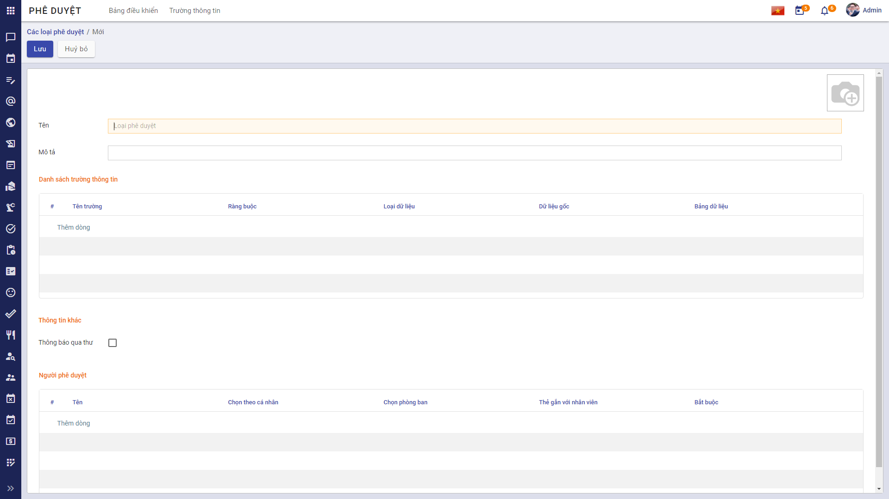
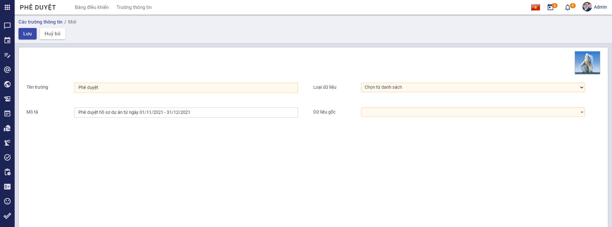
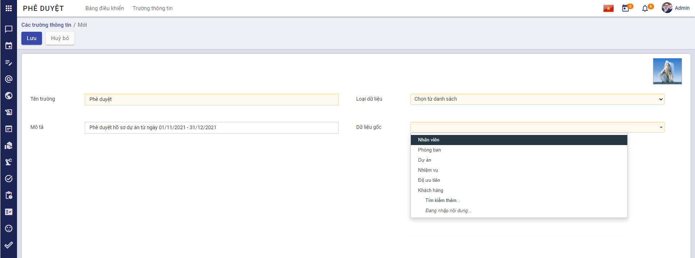
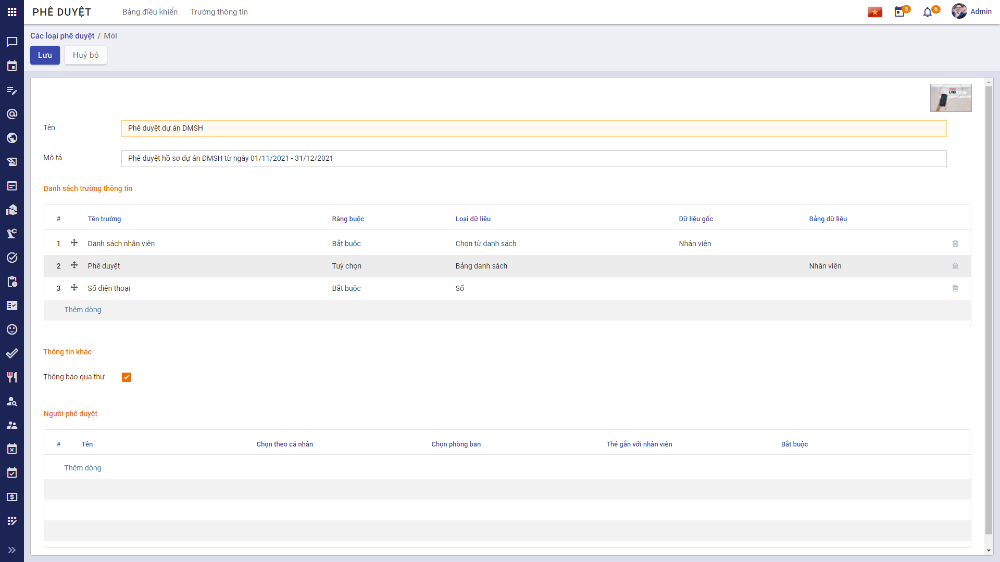
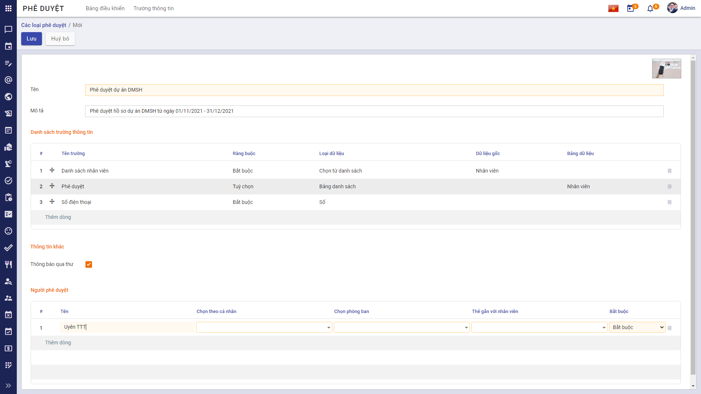

### Quy trình nghiệp vụ

Chức năng **Phê duyệt** hỗ trợ người dùng có thể tạo và gửi phê duyệt các nhiệm vụ, yêu cầu của cán bộ nhân viên đến người có thẩm quyền quyết định một cách dễ dàng. Giúp doanh nghiệp quản lý và nắm bắt đầy đủ các thông tin nhiệm vụ, đồng thời có thể giải quyết các vấn đề trong công việc một cách hiệu quả nhất.

Quy trình Phê duyệt bao gồm 2 phần:

1. **Phê duyệt trên Website**: Quản trị viên thiết lập trường thông tin và tạo các loại phê duyệt. Chi tiết nghiệp vụ <u>[tại đây](https://guide.vess.store/digitalworkplace/Addon-PheDuyet-Web/)</u>.

2. **Phê duyệt trên Mobile**: Cá nhân tạo yêu cầu phê duyệt và các yêu cầu được phê duyệt bởi người được chọn. Chi tiết nghiệp vụ <u>[tại đây](https://guide.vess.store/digitalworkplace/Addon-phe-duyet/)</u>.

#### Quy trình

**Các luồng quy trình Phê duyệt trên Web**

* Tạo Trường thông tin. Chi tiết nghiệp vụ <u>[tại đây](#tao-truong-thong-tin)</u>.

* Tạo Loại phê duyệt. Chi tiết nghiệp vụ <u>[tai đây](#tao-loai-phe-duyet)</u>.

#### Mô tả nghiệp vụ

Khi có nhu cầu thực hiện phê duyệt công việc, người dùng thực hiện các bước theo quy trình sau:

1. Quản trị viên tạo trường thông tin.

2. Sau khi đã có các trường thông tin, quản trị viên vào tạo loại phê duyệt bao gồm các trường thông tin đã tạo và phù hợp với yêu cầu phê duyệt.

3. Người dùng có nhu cầu tạo các yêu cầu phê duyệt sẽ tạo các phê duyệt thuộc loại phê duyệt đã có trên hệ thống.

4. Tiếp theo, người dùng thực hiện gửi phê duyệt.

5. Người được chọn phê duyệt sẽ vào thực hiện phê duyệt các yêu cầu vừa được gửi.

**Luồng chức năng chính**

* Thiết lập Trường thông tin. Chi tiết nghiệp vụ <u>[tại đây](#thiet-lap-truong-thong-tin)</u>.

* Thiết lập thông tin cho Loại phê duyệt. Chi tiết nghiệp vụ <u>[tại đây](#thiet-lap-thong-tin-cho-loai-phe-duyet)</u>.

### Tạo Trường thông tin

**Đối tượng thực hiện:** Quản trị viên

1. Vào phân hệ **Phê duyệt**: Chọn menu **Trường thông tin**
    
    

2. Nhấn **Tạo**:
    
    

#### Thiết lập Trường thông tin

1. Nhập thông tin: **Tên trường**, **Mô tả**, chọn **Ảnh đại diện**.
    
    

2. Chọn **Loại dữ liệu** cho trường thông tin:
    
* Nếu Loại dữ liệu là **Nhập từ bàn phím**, **Số**, **Ngày tháng**: Người dùng không cần nhập thêm trường dữ liệu.
    
* Nếu Loại dữ liệu là **Chọn từ danh sách** hoặc **Bảng danh sách**: Người dùng cần chọn thêm dữ liệu:
    
    * Chọn **Chọn từ danh sách**: Người dùng chọn thêm **Dữ liệu gốc**
    
    
    
    * Chọn **Bảng danh sách**: Người dùng chọn thêm **Bảng dữ liệu**
    
    

**Lưu ý:**

 1. Đối với **Dữ liệu gốc**, người dùng có thể chọn dữ liệu có sẵn:
    
    

    hoặc tạo thêm Dữ liệu gốc theo các bước:
    
    
    
    Bước 1: Sau khi chọn hoặc tạo mới, màn hình sẽ hiển thị **Danh sách** của Dữ liệu gốc:
    
    
    
    Bước 2: Nhấn chọn **Thêm dòng** và nhập dữ liệu:
    
    
    
    hoặc có thể tạo danh sách dữ liệu gốc trực tiếp bằng cách: Nhấn chọn  tại **Dữ liệu gốc** vừa chọn.
    
    Màn hình sẽ hiển thị:
    
    
    
    Người dùng có thể nhập thông tin cho **Dữ liệu gốc** vừa chọn.
    
    
    
    Sau khi tạo thông tin, nếu chọn Dữ liệu gốc có sẵn **Danh sách**, màn hình chính sẽ hiển thị danh sách dữ liệu đã nhập:
    
    

2. Đối với **Bảng dữ liệu**, người dùng cũng có thể chọn dữ liệu có sẵn hoặc tạo mới theo các bước làm tương tự với **Dữ liệu gốc**:
    
    

3. Bước cuối cùng để tạo trường thông tin: Nhấn **Lưu**

### Tạo Loại phê duyệt

Sau khi đã có các trường thông tin cần thiết, Quản trị viên thực hiện tạo các loại phê duyệt.

**Đối tượng thực hiện:** Quản trị viên

1. Vào phân hệ **Phê duyệt**: Thao tác tại menu **Bảng điều khiển**
    
    

2. Nhấn **Tạo**:
    
    

#### Thiết lập thông tin cho Loại phê duyệt
    
1. Nhập thông tin cho loại phê duyệt: **Tên**, **Mô tả**, chọn **Ảnh đại diện**.
    
    
    
2. Chọn dữ liệu tại vùng Danh sách trường thông tin: 

    * Nhấn chọn **Thêm dòng**:
    
    
    
    * Chọn **Tên trường, Ràng buộc**:
    
    
    
    * **Lưu ý 1:** 
    
        Khi chọn **Ràng buộc**:
        
        * Nếu chọn **Bắt buộc**: Khi tạo phê duyệt, người dùng bắt buộc phải nhập thông tin này.
        
        * Nếu chọn **Tùy chọn**: Khi tạo phê duyệt, người dùng không bắt buộc phải nhập thông tin này.
        
        * Nếu chọn **Không hiển thị**: Khi tạo phê duyệt, màn hình sẽ không hiển thị trường này.
    
    * **Lưu ý 2:**
    
        * Người dùng có thể giữ chuột tại icon Kéo thả (cạnh cột #) và thực hiện kéo - thả để sắp xếp lại thứ tự các trường thông tin cho phù hợp với phê duyệt.
        
        * Sau khi kéo - thả, thứ tự trường thông tin sẽ tự động sắp xếp lại.
    
3. Tích chọn **Thông báo qua thư**
    
    

    * Nếu tích chọn **Thông báo qua thư**, hệ thống sẽ tự động gửi email tới người phê duyệt hoặc khi yêu cầu của người tạo được phê duyệt/ từ chối.
    
    * Nếu không muốn gửi email thông báo đến người phê duyệt hoặc người tạo yêu cầu, người dùng có thể bỏ qua bước này.

4. Chọn người phê duyệt

* Tại vùng **Người phê duyệt**: Nhấn chọn **Thêm dòng**
    
    
    
    * Nhập thông tin Tên:
    
    
    
    * Chọn thông tin cho người phê duyệt. Chỉ được phép chọn 1 trong 3 thông tin: **Chọn theo cá nhân**, hoặc **Chọn phòng ban**, hoặc **Thẻ gắn với nhân viên**:
    
    * Tương ứng với từng dòng sẽ chọn tính **Bắt buộc** cho từng người phê duyệt:
    
    
    
    * **Lưu ý:** 
    
        * Người dùng có thể giữ chuột tại icon Kéo thả (cạnh cột #) và thực hiện kéo - thả để sắp xếp lại thứ tự của người phê duyệt. 
    
5. Nhấn **Lưu** để lưu lại Loại phê duyệt.