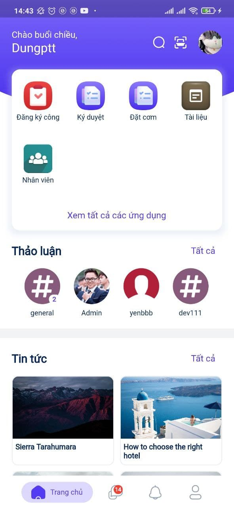

### Quy trình nghiệp vụ

Đăng nhập bằng QR code là tính năng hỗ trợ khách hàng đăng nhập nhanh vào hệ thống trên website. Người dùng không cần nhập user/password trên màn hình đăng nhập website. Thay vào đó, người dùng sử dụng app trên Mobile, quét mã QR bằng tài khoản đã được đăng nhập để thực hiện xem, cập nhật thông tin cá nhân, xem thông báo, tin tức và các nội dung khác.

#### Quy trình

**Các luồng quy trình**

* Đăng nhập bằng QR code. Chi tiết nghiệp vụ <u>[tại đây](#ang-nhap-bang-qr-code)</u>.

#### Mô tả nghiệp vụ

Khi người sử dụng muốn đăng nhập vào hệ thống bằng QR code thì quy trình thực hiện như sau:

1. Tại màn hình đăng nhập, người dùng chọn chức năng đăng nhập bằng mã QR

2. Thực hiện quét QR code để đăng nhập hoặc xem Hướng dẫn quét mã QR

**Luồng chức năng chính**

* Đăng nhập bằng QR code. Chi tiết nghiệp vụ <u>[tại đây](#ang-nhap-bang-qr-code)</u>.

**Video hướng dẫn**

### Đăng nhập bằng QR code

Người dùng đăng nhập nhanh vào hệ thống bằng QR code

**Đối tượng thực hiện:** Người dùng

Điều kiện trước: Người dùng đã đăng nhập trên app

1. Tại màn hình đăng nhập

    

2. Người dùng chọn chức năng đăng nhập bằng mã QR bằng cách nhấn vào biểu tượng . Màn hình sẽ hiển thị mã QR

    

3. Sau đó, người dùng truy cập vào app trên điện thoại di động:
    
    * Tại màn hình Trang chủ, chọn biểu tượng :
    
    
    
    * **Lưu ý**:
        
        * **Điều kiện quét mã:** Thiết bị của người dùng phải được đăng ký trên hệ thống trước đó
        
        * Hệ thống sẽ thực hiện đối chiếu với mã đã được quy định sẵn cho từng người dùng. Nếu mã khớp đăng nhập thành công trên máy tính.
        
        * Nếu mã QR không đúng, hệ thống ở lại trang đăng nhập với mã QR và người dùng sẽ thực hiện lại việc quét mã QR.
    
4. Trường hợp người dùng có nhu cầu xem hướng dẫn trước khi thực hiện đăng nhập với mã QR, tại màn hình đăng nhập bằng QR Code, người dùng nhấn **Xem hướng dẫn** để di chuyển đến trang hướng dẫn quét mã QR.