# Quy trình nghiệp vụ

Cho phép người dùng quản lý các chủ đề, bài viết và tương tác với bài viết cũng như giữa các thành viên trong đơn vị.

**Quy trình**

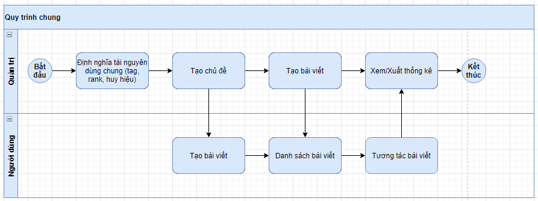

**Các luồng quy trình**

* Thiết lập tài nguyên dùng chung. Chi tiết nghiệp vụ <u>[tại đây](#thiet-lap-tai-nguyen-dung-chung)</u>.

* Tạo chủ đề. Chi tiết nghiệp vụ <u>[tại đây](#tao-chu-đe)</u>.

* Tạo bài viết. Chi tiết nghiệp vụ <u>[tại đây](#tao-bai-viet)</u>.

* Xem danh sách bài viết. Chi tiết nghiệp vụ <u>[tại đây](#xem-danh-sach-bai-viet)</u>.

* Tương tác bài viết. Chi tiết nghiệp vụ <u>[tại đây](#tuong-tac-bai-viet)</u>.

* Xem/Xuất thống kê. Chi tiết nghiệp vụ <u>[tại đây](#xem-xuat-thong-ke)</u>.

**Mô tả nghiệp vụ**

Khi người sử dụng muốn quản lý hoạt động của mạng xã hội thì quy trình thực hiện như sau:

1. Tại phân hệ **Trang web**, quản trị hệ thống thiết lập các tài nguyên dùng chung của phân hệ trang web bao gồm:
   
    * Thẻ dùng chung.
    
    * Rank (xếp hạng người dùng): Định nghĩa điều kiện để người dùng có thể chuyển hạng.
    
    * Huy hiệu: Định nghĩa các huy hiệu và quà tặng tương ứng, phân quyền sử dụng huy hiệu theo từng chủ đề hoặc tất cả.
    
    * Lý do đóng bài đăng: Định nghĩa các lý do đóng bài đăng.
    
2. Quản trị hệ thống lập mới các chủ đề trên mạng xã hội. Khi đó, người dùng truy cập mạng xã hội có thể lập mới bài viết hoặc tra cứu, theo dõi, tương tác theo các chủ đề này. Ngoài ra, quản trị hệ thống có thể thực hiện đóng chủ đề.

3. Quản trị hệ thống hoặc người dùng có thể tạo mới bài viết theo chủ đề. Với bài viết của chính mình, người dùng có thể thực hiện các thao tác: hiệu chỉnh, xóa hoặc đóng bài viết.

4. Khi người dùng truy cập mạng xã hội, hệ thống hiển thị danh sách bài viết theo độ ưu tiên: Chủ đề yêu thích, theo thời gian tạo, theo độ tương tác…

5. Người dùng có thể tương tác với các bài viết trên danh sách: trả lời, bình luận, theo dõi, cộng điểm, trừ điểm, gán cờ cho bài viết, báo cáo bài viết, báo cáo câu trả lời.

6. Quản trị hoặc người dùng có thể xem một số thống kê nhanh như số lượt xem bài viết, số bài viết trong chủ đề, số câu trả lời, huy hiệu, thẻ…

**Luồng chức năng chính**

* Thiết lập tài nguyên dùng chung. Chi tiết nghiệp vụ <u>[tại đây](#thiet-lap-tai-nguyen-dung-chung)</u>.

* Lập chủ đề. Chi tiết nghiệp vụ <u>[tại đây](#tao-chu-đe)</u>.

* Tạo bài viết. Chi tiết nghiệp vụ <u>[tại đây](#tao-bai-viet)</u>.

* Quản trị tạo bài viết. Chi tiết nghiệp vụ <u>[tại đây](#quan-tri-tao-bai-viet)</u>.

* Xem danh sách bài viết. Chi tiết nghiệp vụ <u>[tại đây](#xem-danh-sach-bai-viet)</u>.

* Tương tác bài viết. Chi tiết nghiệp vụ <u>[tại đây](#tuong-tac-bai-viet)</u>.

* Nhân viên. Chi tiết nghiệp vụ <u>[tại đây](#nhan-vien)</u>.

* Thẻ. Chi tiết nghiệp vụ <u>[tại đây](#the)</u>.

* Xem/Xuất thống kê. Chi tiết nghiệp vụ <u>[tại đây](#xem-xuat-thong-ke)</u>.

**Video hướng dẫn**

## **Trang web**

### **Thiết lập tài nguyên dùng chung**

Người sử dụng thực hiện thiết lập các tài nguyên dùng chung của phân hệ trang web gồm:

* Thẻ dùng chung

* Rank (xếp hạng người dùng): Định nghĩa điều kiện để người dùng có thể chuyển hạng.

* Huy hiệu: Định nghĩa các huy hiệu và quà tặng tương ứng, phân quyền sử dụng huy hiệu theo từng chủ đề hoặc tất cả.

* Lý do đóng bài đăng: Định nghĩa các lý do đóng bài đăng.

**Đối tượng thực hiện:** Quản trị hệ thống

**Thiết lập thẻ dùng chung**

Người sử dụng tạo mới thẻ cho từng chủ đề và cũng có thể tạo chủ đề khi tạo thẻ.

1. Tại phân hệ **Trang web**, người sử dụng thực hiện thiết lập thẻ bằng cách chọn **Cấu hình/ Mạng xã hội/ Thẻ**.

    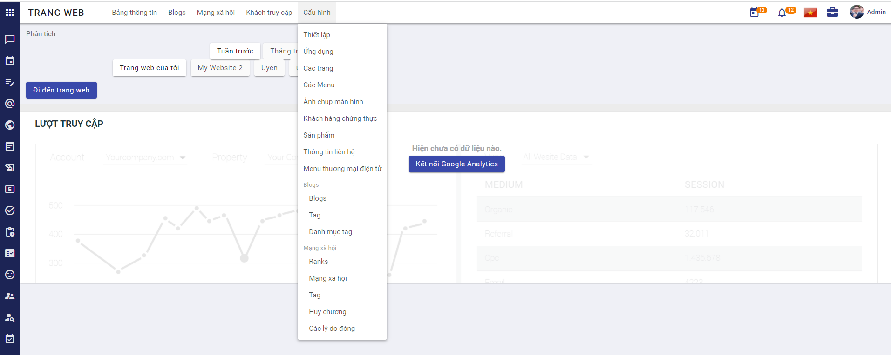

2. Chọn Tạo **Thẻ**

    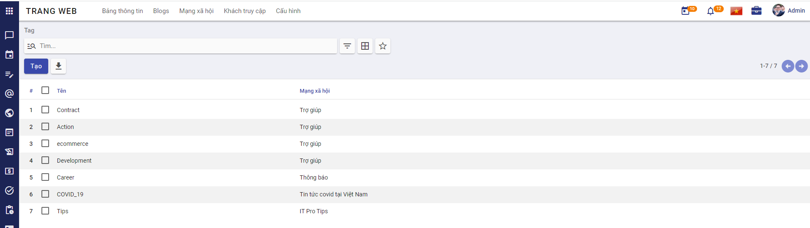
    
3. Khai báo thông tin chung của **Thẻ**

     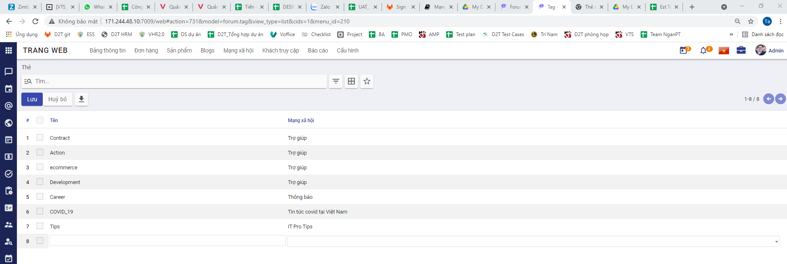
     
  * Khai báo tên thẻ
  
  * Khai báo tên chủ đề: Khi tiến hành nhập tên chủ đề, sẽ xuất hiện guilde line gợi ý các chủ đề có sẵn, nếu như nhập tên chủ đề chưa có sẵn, hệ thống hiển thị Tạo, khi người dùng chọn "Tạo" sẽ tạo một chủ đề mới.
  
  * Người dùng nhấn **Lưu** để tạo thẻ.

**Thiết lập rank**

Người sử dụng tạo mới rank (điều kiện xếp hạng thành viên).

1. Tại phân hệ **Trang web**, người sử dụng thực hiện thiết lập rank bằng cách chọn **Cấu hình/ Mạng xã hội/ Ranks**.

    

2. Chọn Tạo **Ranks**

    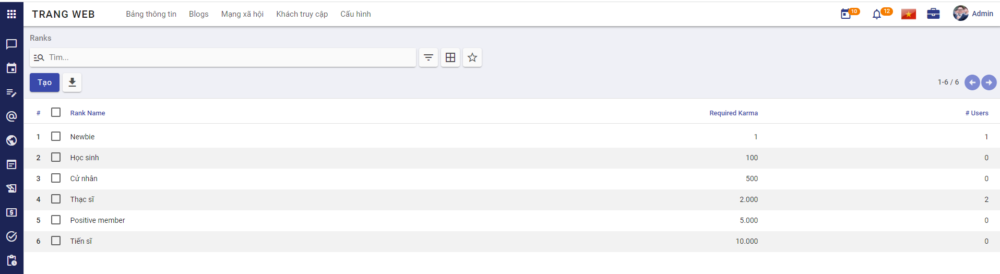
    
3. Khai báo thông tin chung của **Ranks**

     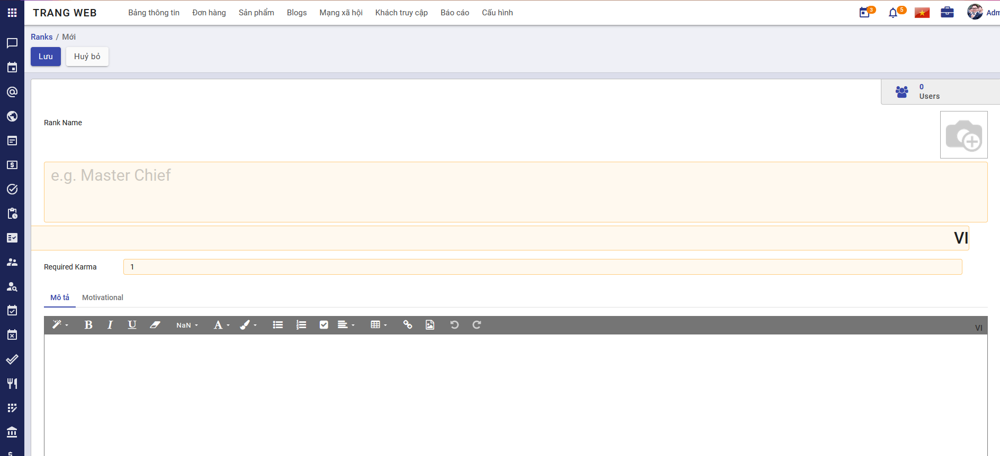
     
  * Người dùng nhấn **Lưu** để tạo rank.

**Thiết lập huy hiệu**

Người sử dụng tạo mới huy hiệu và trao huy hiệu cho thành viên

1. Tại phân hệ **Trang web**, người sử dụng thực hiện thiết lập huy hiệu bằng cách chọn **Cấu hình/ Mạng xã hội/ Huy chương**.

    
    
2. Chọn Tạo **Huy hiệu**

    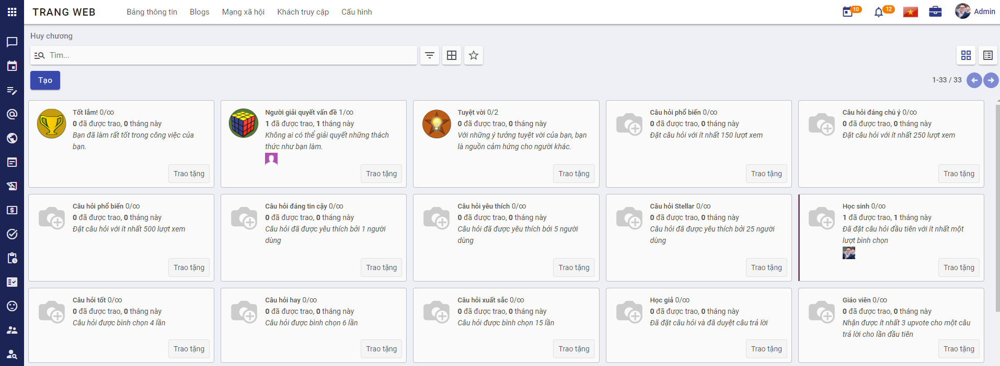
    
3. Khai báo thông tin chung của **Huy hiệu**

     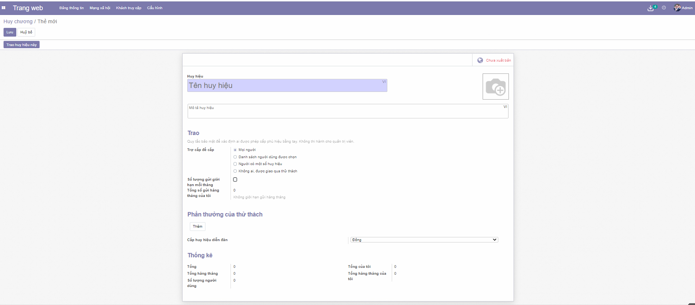
     
  * Khai báo trao:
  
    * Chọn Trợ cấp để cấp: có thể chọn Mọi người, Danh sách người dùng được chọn, Người có một số huy hiệu, Không ai, được giao qua thử thách
    
    * Chọn Số lượng gửi giới hạn mỗi tháng: khi chọn số lượng gửi giới hạn mỗi tháng thì cần khai báo Số giới hạn, Tổng số gửi hàng tháng của tôi.
    
  * Khai báo Phần thưởng của thử thách:
  
    * Chọn thêm phần thưởng cho thử thách
    
    * Chọn Cấp huy hiệu diễn đàn: Đồng, Bạc, Vàng
    
  * Khai báo các thông tin cần thiết khác. 
    
  * Người dùng nhấn **Lưu** để tạo huy hiệu hoặc nhấn **Trao huy hiệu này** để tạo và trao huy hiệu này cho thành viên khác.

4. Sau khi tạo thành công huy hiệu, người dùng có thể tặng huy hiệu đó cho các thành viên khác.

    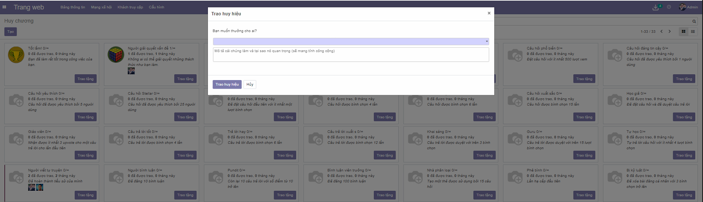
    
  * Chọn thành viên muốn tặng.
  
  * Khai báo mô tả lý do muốn trao tặng.
  
  * Nhấn **Trao huy hiệu** để thực hiện trao huy hiệu cho thành viên đã chọn.

**Thiết lập lý do đóng bài đăng**

1. Tại phân hệ **Trang web**, người sử dụng thực hiện thiết lập lý do đóng bài đăng bằng cách chọn Cấu hình/ Mạng xã hội/ Các lý do đóng.

    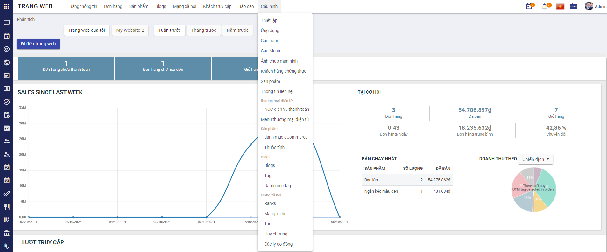

2. Chọn Tạo **Lý do đóng bài đăng**

3. Khai báo thông tin chung của **Lý do đóng bài đăng**   

    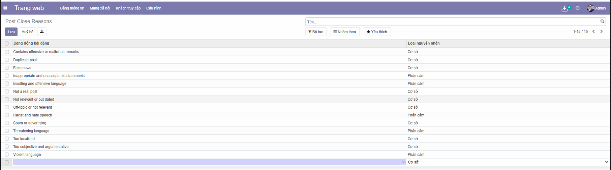
    
    * Khai báo tên Đang đóng bài đăng.
    
    * Chọn Loại nguyên nhân.
    
    * Người sử dụng nhấn **Lưu** để tạo lý do đóng bài đăng.
    
4. Khi người sử dụng muốn đóng bài viết có thể chọn lý do đóng bài đăng đã tạo. 

### **Tạo chủ đề**

Người sử dụng thực hiện tạo các chủ đề cho mạng xã hội.

**Đối tượng thực hiện:** Quản trị hệ thống

1. Tại phân hệ **Trang web**, người sử dụng thực hiện tạo chủ đề bằng cách chọn **Cấu hình/ Mạng xã hội/ Chủ đề**.

    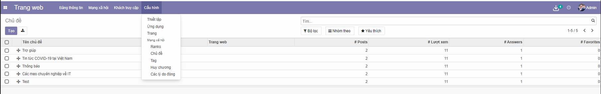

2. Chọn tạo **Chủ đề**  

    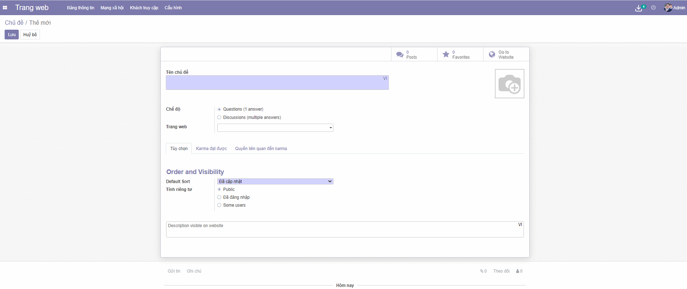

3. Khai báo thông tin chung của **Chủ đề**

    
    
    * Khai báo Tên chủ đề
    
    * Chọn Ảnh chủ đề
    
    * Chọn thông tin chế độ
    
    * Chọn thông tin trang web
    
    * Khai báo Tùy chọn

    * Khai báo Karma đạt được
    
    * Khai báo Quyền liên quan đến Karma
    
4. Người dùng nhấn **Lưu** để tạo mới chủ đề.

5. Sau khi tạo thành công chủ đề, khi người dùng tạo bài viết có thể chọn chủ đề đã tạo.

### **Quản trị tạo bài viết**

Người sử dụng thực hiện tạo các bài viết cho mạng xã hội.

**Đối tượng thực hiện:** Quản trị hệ thống

1. Tại phân hệ **Trang web**, người sử dụng thực hiện tạo bài viết bằng cách chọn **Mạng xã hội/ Bài viết**.

    

2. Chọn tạo **Bài viết**
   
    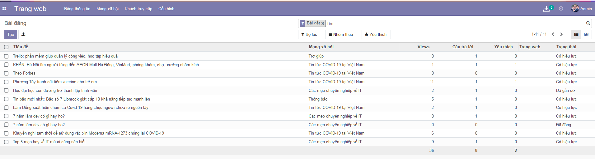
  
3. Khai báo thông tin chung của **Bài viết**
   
    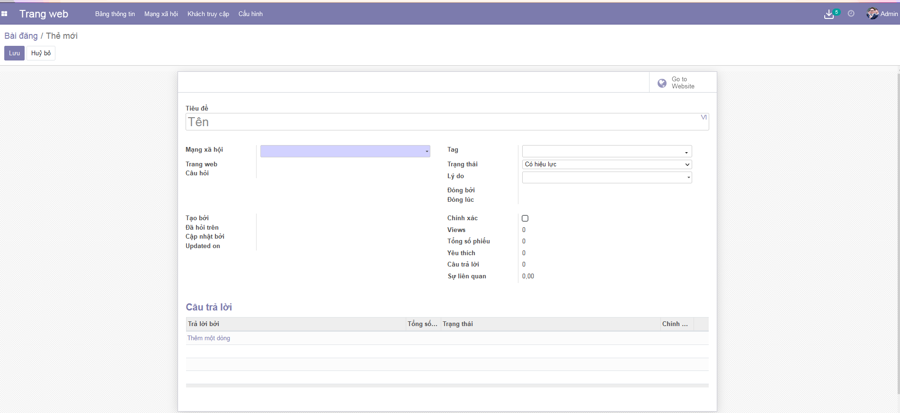
    
    * Khai báo thông tin tiêu đề bài viết.
    
    * Chọn chủ đề  
    
    * Khai báo thẻ: có thể chọn thẻ đã có hoặc nhập tạo một thẻ mới.
    
    * Chọn trạng thái bài viết.
    
    * Chọn Lý do.  
    
4. Người dùng nhấn **Lưu** để tạo mới bài viết.

## **Mạng xã hội**

### **Xem danh sách bài viết**

Cho phép người dùng xem danh sách các bài viết, tra cứu bài viết theo tiêu chí tìm kiếm như sau:
    
* Bài viết hot nhất (nhiều tương tác nhất)

* Mới nhất

* Tra cứu bài viết theo chủ đề.

* Tra cứu bài viết theo tiêu đề hoặc nội dung bài viết.

**Đối tượng thực hiện:** Người dùng hệ thống

1. Người dùng truye cập vào trang web, chọn menu **Mạng xã hội**.

    

    * Nếu là lần đầu tiên truy cập vào mạng xã hội, thì sẽ hiển thị màn hình danh sách chủ đề.
    
        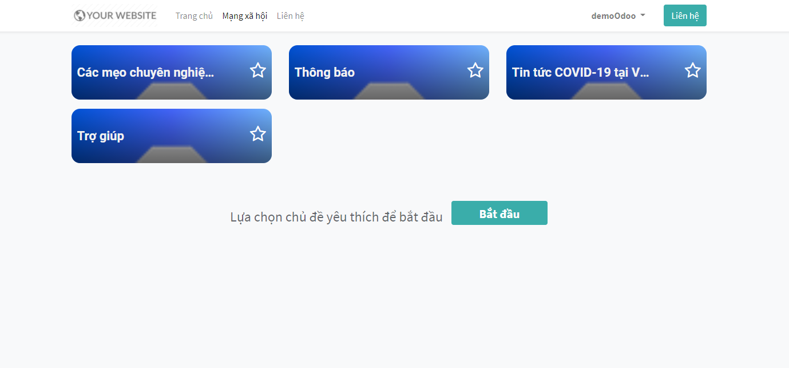
        
        * Người sử dụng chọn chủ đề, nhấn **Bắt đầu** để di chuyển đến danh sách các bài viết trong mạng xã hội.
    
    * Từ lần truy cập tiếp theo, khi người dùng chọn menu **Mạng xã hội** sẽ di chuyển đến danh sách các bài viết trong mạng xã hội.
    
        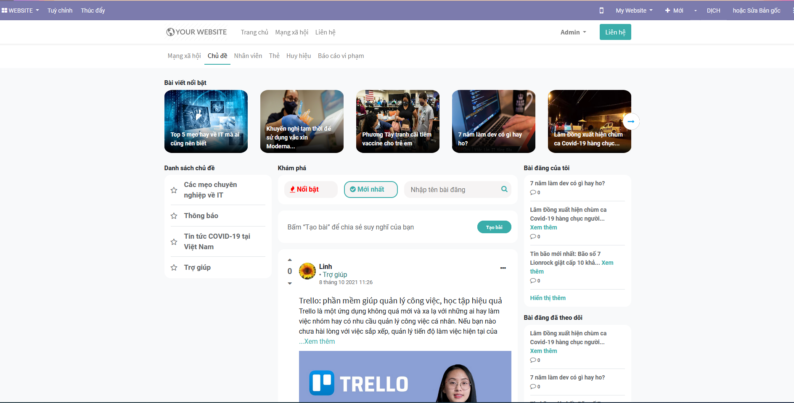

2. Người dùng thực hiện tra cứu bài viết bằng cách:
   
    
    
    * Người dùng đang quan tâm tới chủ đề nào thì sẽ chọn chủ đề bài viết ở **Danh sách chủ đề** ở bên trái, sau khi chọn chủ đề thì vùng danh sách bài viết sẽ chỉ hiển thị những bài viết thuộc chủ đề mà người dùng chọn.
    
    * Người dùng muốn xem các bài viết nổi bật thì sẽ chọn **Nổi bật**. Khi đó vùng danh sách sẽ hiển thị những bài viết nổi bật nhất (tức có độ tương tác nhiều nhất) trong vòng 90 ngày. Bài viết nào có độ tương tác cao nhất thì hiển thị lên trên.
    
    * Người dùng muốn xem các bài viết mới nhất thì chọn **Mới nhất**. Khi đó vùng danh sách bài viết sẽ hiển thị các bài viết mới nhất lên trên rồi đến các bài viết cũ hơn. 
    * Người dùng muốn tra cứu bài viết theo tên bài viết, nội dung bài viết thì sẽ nhập nội dung muốn tra cứu và nhấn enter. Khi đó vùng danh sách bài viết sẽ hiển thị những bài viết có tiêu đề hoặc nội dung chứa nội dung mà người dùng tìm kiếm.
    
    
### **Tạo bài viết**

Cho phép người dùng tạo bài viết trên mạng xã hội. Người dùng có thể tạo bài viết văn bản thông thường hoặc bài viết có ảnh, video cũng như bài viết có gắn thẻ liên kết tới bài viết hoặc trang web khác.

**Đối tượng thực hiện:** Người dùng hệ thống

1. Trên danh sách bài viết, người dùng chọn **Tạo bài** để thực hiện đăng bài viết trên mạng xã hội.

    
    
2. Khai báo thông tin chung cho bài viết
   
    
    
    * Chọn chủ đề
    
    * Khai báo tiêu đề bài viết
    
    * Khai báo Mô tả: 
      
        * Để đăng bài là văn bản thường người dùng nhập chữ vào đây và có thể định dạng cho nội dung của bài viết như: chữ đậm, nghiêng, căn lề ...
        
        * Để đăng ảnh người dùng có thể kéo ảnh vào đây hoặc chọn biểu tượng ảnh sẽ mở ra màn hình chọn media. Tại đây người dùng chọn **Hình ảnh**, chọn nút **Tải lên một hình ảnh** và chọn ảnh từ máy tính cá nhân để đăng tải ảnh vào bài viết.
        
            
            
        * Để đăng video người dùng chọn biểu tượng ảnh sẽ mở ra màn hình chọn media, người dùng chọn **Video** và khai báo mã url của video muốn đăng.
          
            >Lưu ý: Người dùng không thể đăng trực tiếp video từ máy tính cá nhân vào bài viết mà ở đây chỉ cho phép nhúng video từ một website khác. 
            
            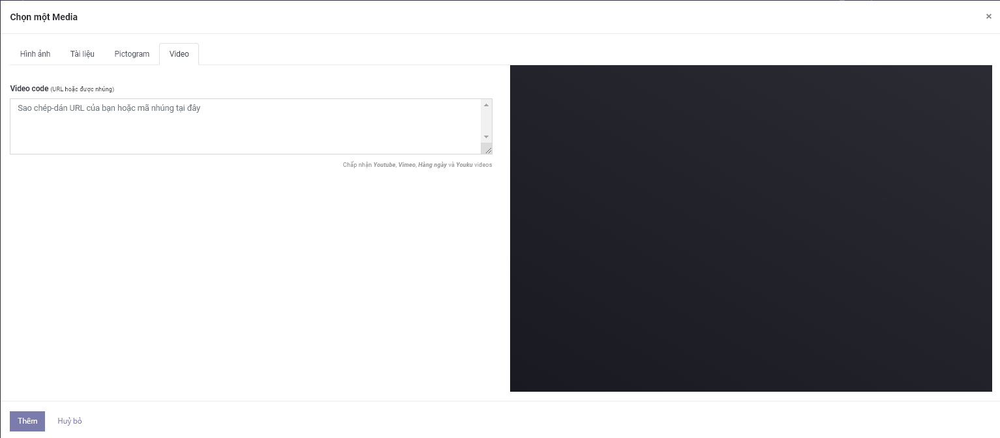
            
        * Để đăng một tập tin tài liệu như file word, excel, pdf...lên bài viết, người dùng chọn biểu tượng ảnh sẽ mở ra màn hình chọn media. Tại đây người dùng chọn **Tài liệu**, chọn nút **Tải lên 1 tài liệu** và chọn file tài liệu từ máy tính cá nhân để đăng tải file vào bài viết. Sau khi đăng bài thành công, các thành viên khác có thể xem bài viết và tải file tài liệu.
          
            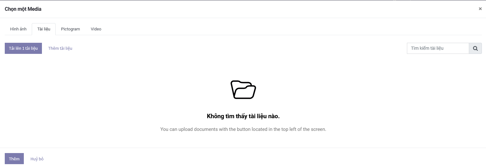
        
        * Để đăng bài viết có liên kết tới bài viết khác hay trang web khác, người dùng sao chép link liên kết của bài viết cần chia sẻ và dán vào đây.
    
    * Khai báo thẻ
    
        * Khi tiến hành nhập tên **Thẻ**, sẽ xuất hiện guilde line gợi ý các thẻ có sẵn, nếu như nhập tên thẻ chưa có sẵn, hệ thống hiển thị line New, khi người dùng chọn "New" sẽ tạo một thẻ mới.
        
    * Người dùng nhấn **Đăng bài** để tạo bài viết

### **Tương tác bài viết**

Cho phép người dùng tương tác với bài viết như: Xem chi tiết bài viết, Yêu thích, theo dõi, trả lời, phản hồi cầu trả lời, cộng hoặc trừ điểm bài viết, cộng hoặc trừ điểm câu trả lời, báo cáo vi phạm bài việt, báo cáo vi phạm câu trả lời.

1. Tại một bài viết trên danh sách, người dùng chọn xem thêm (với bài viết có nội dung dài) để xem chi tiết nội dung bài viết. Ngoài ra người dùng cũng có thể chọn bài viết tại vùng **Bài viết nổi bật**, **Bài đăng của tôi**, **Bài đăng đã theo dỗi**, **Bài đăng mới** để xem chi tiết bài viết.

    
    
    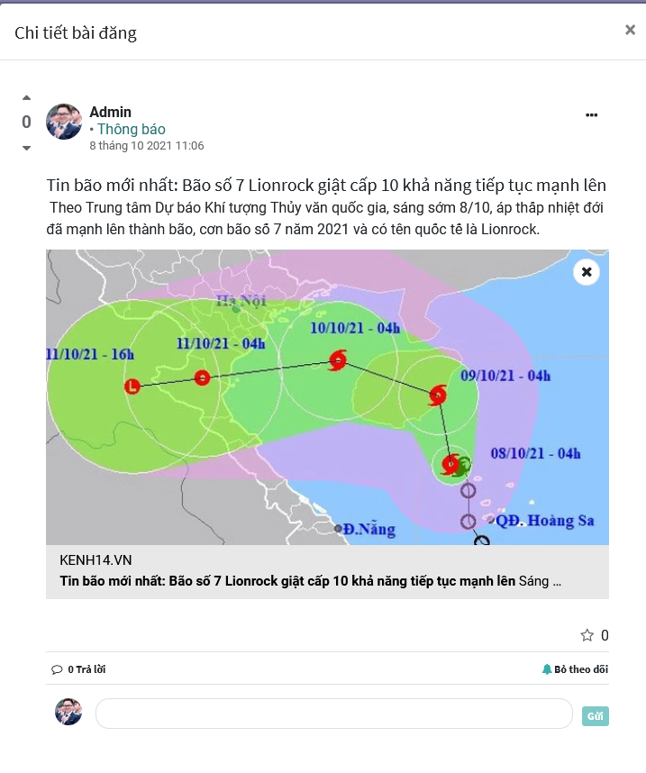
    
2. Người dùng có thể báo cáo bài viết bị vi phạm bằng cách chọn vào ... ở phía bên phải của bài viết, chọn **Báo cáo vi phạm**. 

    
    
    * Người dùng báo cáo câu trả lời vi phạm bằng cách chọn ... ở bên phải câu trả lời, chọn **Báo cáo vi phạm**.
    
    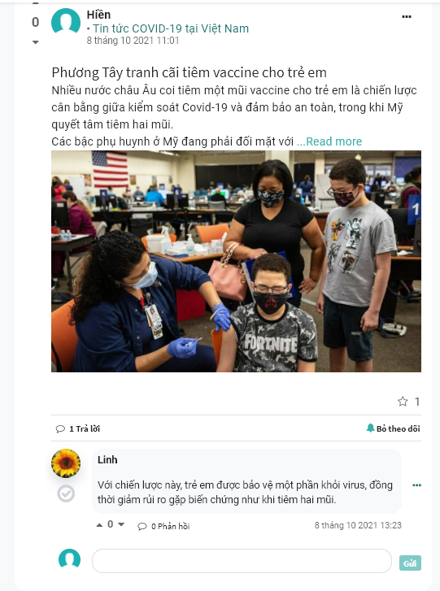
    
    * Sau khi báo cáo vi phạm, admin của mạng xã hội sẽ nhìn thấy các bài viết, câu trả lời bị vi phạm và xem xét có đúng là vi phạm hay không. Nếu bài viết hoặc câu trả lời là vi phạm thì admin có thể thực hiện xóa bài viết khỏi mạng xã hội. Khi đó người dùng sẽ không nhìn thấy bài viết đó nữa.
    
        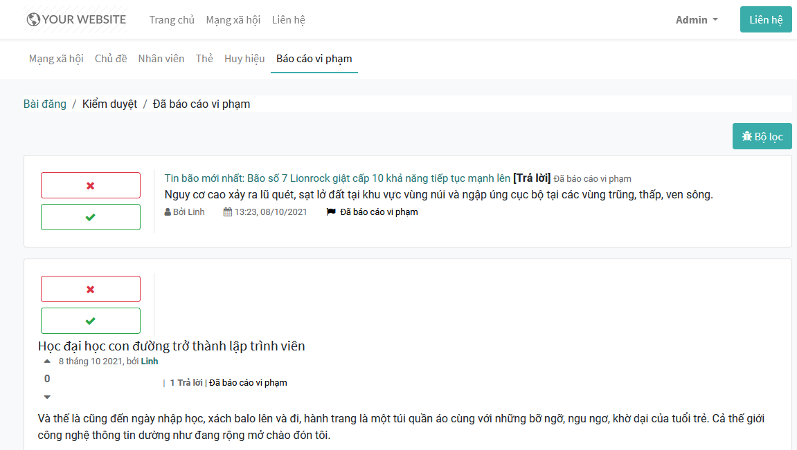
    
3. Người dùng có thể nhập câu trả lời cho bài viết ở cuối bài viết trên danh sách hoặc khi vào xem chi tiết một bài viết.
   
    

4. Người dùng có thể phản hồi lại câu trả lời cho bất kỳ câu trả lời nào của bài viết trên mạng xã hội.

5. Khi muốn theo dõi bài viết, người dùng chọn theo dõi. Sau khi theo dõi bài viết, thì khi có bất kỳ tương tác nào với bài viết người đùng đã theo dõi sẽ hiển thị thông báo cho người dùng biết.

6. Người dùng chọn yêu thích khi yêu thích bài viết bất kỳ.

7. Với bài viết hoặc câu trả người dùng thấy hữu ích thì có thể cộng thêm 1 điểm cho bài viết/ câu trả lời bằng cách chọn vào mũi tên lên ở phía góc trái bài viết/ câu trả lời. Ngược lại với bài viết không chính xác hay không hữu ích người dùng có thể trừ 1 điểm bằng cách chọn mũi tên xuống ở góc trái bài viết/ câu trả lời.

    >Lưu ý: Người dùng chỉ có thể cộng điểm hoặc trừ điểm đối với bài viết, câu trả lời của thành viên khác, không được phép cộng/ trừ điểm cho bài viết/ câu trả lời của chính mình.

### **Nhân viên**

Chức năng này cho phép người dùng xem thông tin các cá nhân khác trên mạng xã hội. Ngoài ra, người dùng có thể trực tiếp mở màn hình chat với từng cá nhân bằng cách nhấn vào ảnh đại diện.

**Đối tượng thực hiện:** Người dùng hệ thống

1. Người dùng ruy cập trang web, chọn **Mạng xã hội/ Nhân viên** để xem danh sách tất cả người dùng.

    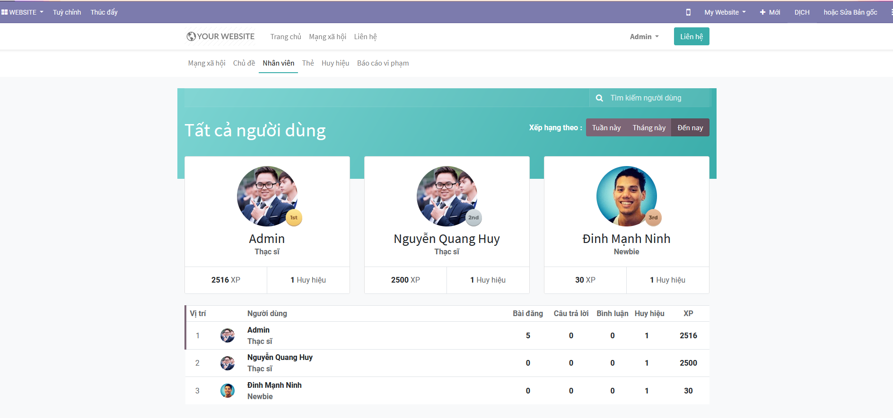
    
2. Người dùng có thể tìm kiếm các thành viên khác bằng cách nhập vào ô tìm kiếm người dùng và nhấn enter, hệ thống sẽ hiển thị những người dùng có tên chưa chuỗi nhập.

3. Người dùng muốn xem bảng xếp hạng thành viên theo tuần này thì sẽ chọn **Tuần này**, khi đó hệ thống sẽ sắp xếp hiển thị người dùng theo số điểm đạt được trong tuần.

4. Người dùng muốn xem bảng xếp hạng thành viên theo tháng này thì sẽ chọn **Tháng này**, khi đó hệ thống sẽ sắp xếp hiển thị người dùng theo số điểm đạt được trong tháng.

5. Người dùng muốn xem bảng xếp hạng thành viên theo từ trước đến nay thì sẽ chọn **Đến nay**, khi đó hệ thống sẽ sắp xếp hiển thị người dùng theo số điểm đạt được.
   

### **Thẻ**

Chức năng này cho phép người dùng theo dõi tất cả các thẻ đã sử dụng trong các bài đăng, trên hệ thống (không phân biệt người tạo thẻ). Ngoài ra, người dùng có thể đăng ký nhận tin hoặc truy cập trực tiếp các bài viết đã sử dụng thẻ từ menu này.

1. Người dùng truy cập trang web, chọn **Mạng xã hội/ Thẻ** để xem danh sách tất cả các thẻ sử dụng trong hệ thống.

    

2. Người dùng chọn vào 1 thẻ và chọn Xem bài viết để xem các bài viết có gán với thẻ đã chọn. 

    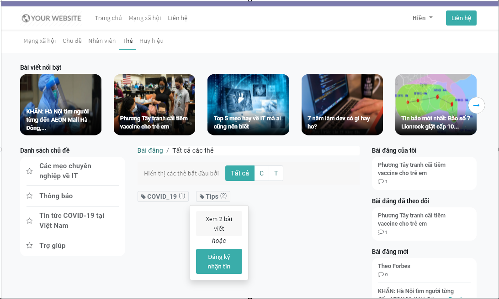

## **Xem xuất thống kê**

Cho phép Quản trị hệ thống xem được chi tiết các bài viết, xem thống kê lượt xem, số câu trả lời, số yêu thích của mỗi bài viết hoặc chủ đề.

**Đối tượng thực hiện:** Quản trị hệ thống 

### **Xem xuất thống kê theo bài viết**

1. Vào phân hệ **Trang web**, chọn **Mạng xã hội/ Bài viết**

    
    
2. Người dùng thực hiện quản lý danh sách bài viết mà các thành viên đã đăng.

    
    
3. Nhấn **Xuất toàn bộ** để xuất toàn bộ danh sách bài viết.

### **Xem xuất thống kê theo chủ đề**

1. Vào phân hệ **Trang web**, chọn **Cấu hình/ Mạng xã hội/ Chủ đề**

    
    
2. Người dùng thực hiện xem thống kê số lượt xem, số bài đăng, số câu trả lời, số yêu thích theo từng chủ đề.

    
    
3. Nhấn **Xuất toàn bộ** để xuất toàn bộ danh sách chủ đề.

 