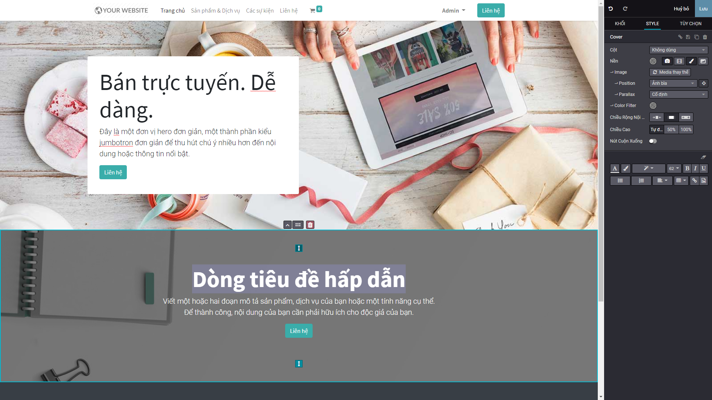
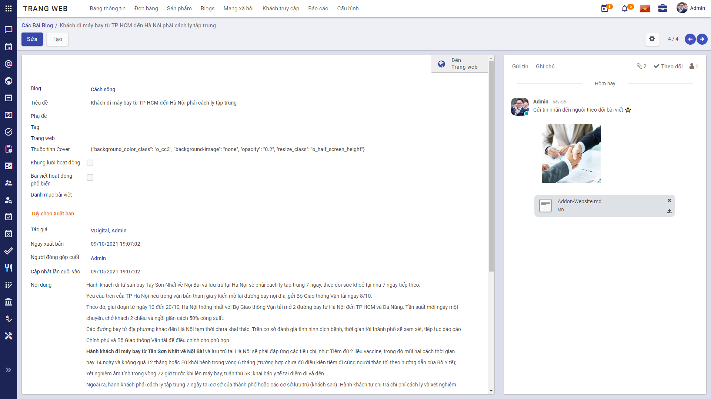
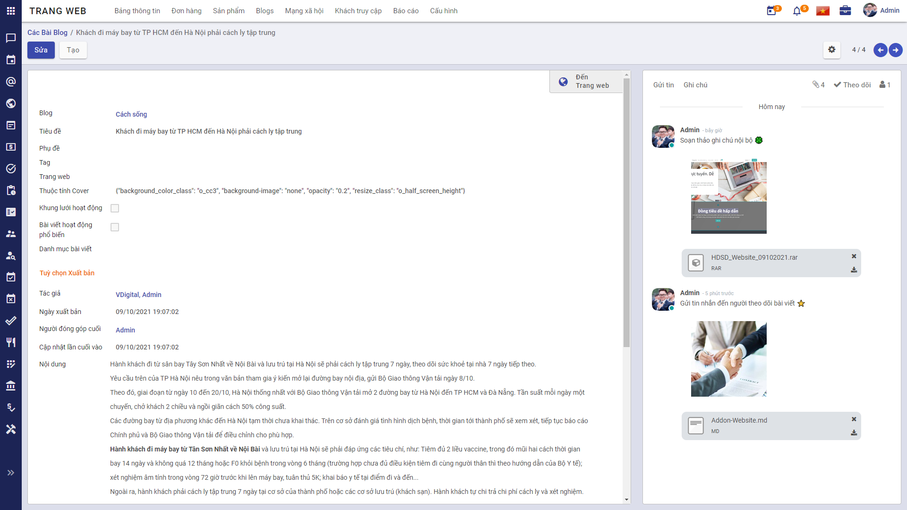
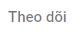
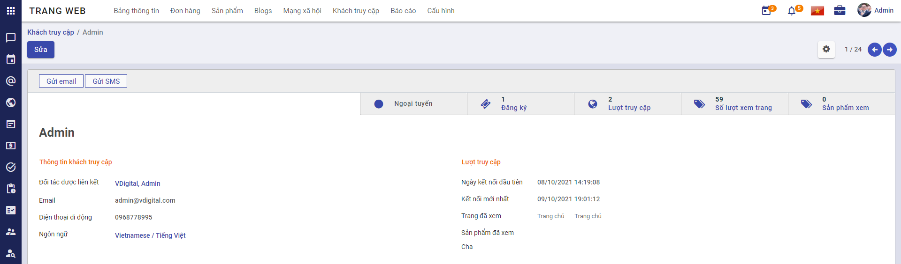
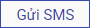

# Quy trình nghiệp vụ

Quản lý toàn bộ quá trình tạo dựng trang Web: Từ thiết lập chủ đề trang Web, Cấu hình quản lý truy cập, phân tích thông tin. Đồng thời, cho phép người dùng Viết bài, Đăng bài, Xem bài viết trên trang Web và quản lý lượng Khách truy cập website.

**Quy trình**

**Các luồng quy trình**

* Thiết lập, cài đặt trang Web. Chi tiết nghiệp vụ <u>[tai đây](#thiet-lap-trang-web)</u>.
    
* Viết bài, Đăng bài và Xem bài viết. Chi tiết nghiệp vụ <u>[tại đây](#viet-bai-ang-bai-va-xem-bai-viet)</u>.

* Quản lý Khách truy cập trang Web. Chi tiết nghiệp vụ <u>[tại đây](#theo-doi-luong-khach-truy-cap-trang-web)</u>.

## **Thiết lập trang Web**

Quản trị viên thiết lập trang chủ, tạo dựng bộ khung ban đầu để hình thành nên trang Web.

**Đối tượng thực hiện:** Quản trị viên

**Mô tả nghiệp vụ**

Khi có nhu cầu tạo dựng một trang Web, Quản trị viên thiết lập, tạo dựng bố cục và cấu hình trang Web.

**Luồng chức năng chính**

* Chọn chủ đề cho trang Web. Chi tiết nghiệp vụ <u>[tại đây](#chon-chu-e-cho-trang-web)</u>.

* Thiết lập giao diện trang Web. Chi tiết nghiệp vụ <u>[tại đây](#thiet-lap-giao-dien-trang-chu)</u>.

* Thiết lập menu. Chi tiết nghiệp vụ <u>[tại đây](#thiet-lap-menu)</u>.

### **Chọn chủ đề cho trang Web**

1. Vào phân hệ **Trang Web**. Chọn **Cấu hình** và **Thiết lập**. 
    
    * Nhấn **Chọn một chủ đề**:
    
    
    
2. Tiến hành chọn chủ đề phù hợp cho Website:
    
    * Chọn vào chủ đề thích hợp và nhấn chọn **Dùng chủ đề này**
    
    * Đợi ít phút để Website áp dụng chủ đề đã chọn lên hệ thống
    
    * Sau khi hoàn thành cài đặt chủ đề sẽ hiển thị giao diện của trang chủ:  
    
    

### **Thiết lập giao diện Trang chủ**

1. Kéo - thả các Khối nội dung phù hợp
    
    * Tiến hành xây dựng trang web thông qua thao tác **kéo – thả** các khối Snippet được thiết kế sẵn cho từng mục đích.
        
        * Người dùng thực hiện chỉnh sửa theo các Khối đã có trên giao diện.
        
        * Đối với giao diện này, người dùng chỉ cần thao tác đơn gian, kéo phần cài đặt vào vị trí cần lắp ghép.
    
    
    
2. Nhấn vào từng mục vừa kéo - thả để thay đổi nội dung phù hợp:
    
    * Thực hiện thay đổi nội dung phù hợp với thông tin của trang Web
    
    * Thay đổi thông số phù hợp tại thanh menu bên phải
    
    * Nhấn  để điều chỉnh kích thước của khối kéo - thả
    
    * Nhấn  để chuyển vị trí lên trên, hoặc xuống dưới của các khối
    
    * Nhấn  để kéo - thả khối đến vị trí xa hơn
    
    * Nhấn  để bỏ khối đã chọn
    
    
    
    * Nhấn **Media thay thế** (hoặc nhấn đúp vào Ảnh) nếu cần thay đổi hình ảnh, tài liệu khác với định dạng có sẵn.
    
        * Với phần Ảnh, có thể thay thế bằng Ảnh, Tài liệu, Biểu tượng, Video.
    
        * Với phần thông tin không có Ảnh, chỉ có thể thay thế bằng Ảnh
        
    
    
    

    * Khi thay đổi Media:
        
        * Có thể chọn tệp có sẵn đã được tải lên trước đó trên Website: Chọn 1 trong các tệp đã hiển thị trên màn hình.
    
        * Chọn  để tải mới tệp từ máy tính cá nhân
    
        * Chọn  để thêm tệp trực tiếp từ đường link URL
        
        * Sau khi chọn tệp xong thì nhấn **Thêm** để lưu thay đổi
    
    * Đối với nút button: Nhấn đúp vào nút button trên màn hình:
    
        * Nhập thông tin **URL or Email** để hiển thị đến link khi nhấn nút button
        
        * Chọn **Loại** cho nút button
        
        * Chọn **Mở trong cửa số mới** nếu muốn khi nhấn vào nút button sẽ hiển thị sang tab trình duyệt mới
        
        * Xem trước giao diện nút button tại **Preview**
        
        * Nhấn **Lưu** để lưu lại thay đổi cho nút button
    
    
    
4. Lưu cấu hình
    
    * Sau khi thực hiện kéo thả các Khối nội dung và các Cấu trúc bổ sung trên trang web:
        
        * Chọn **Lưu**
    
    * Người dùng đã hoàn thành quy trình xây dựng giao diện Website.

### **Thiết lập menu**

1. Vào phân hệ **Trang Web** 
    
    
    
2. Chọn **Cấu hình** trang web. Chọn **Các Menu**
    
    
    
3. Chọn trang web cấu hình menu
    
    * Tại cột Menu Hoạt động: Tích chọn menu mong muốn hiển thị trên trang Web
    
    * Tại cột Parent Menu: Chọn Top Menu for Website
    
    
    
4. Chỉnh sửa đường dẫn URL tương ứng với các menu đã chọn

    * Tích chọn cột Menu hoạt động để lựa chọn mên hiển thị lên trang Web. Những menu không được tích sẽ ẩn đi.

## **Viết bài, Đăng bài và Xem bài viết**

**Mô tả nghiệp vụ**

- [x] Sau khi đã có giao diện hoàn chỉnh, người dùng có thể vào viết bài, đăng bài trên Website.

- [x] Các bài viết tạo dựng thành blog và người dùng có thể vào xem bài viết đã được đăng tải trên Website.

**Luồng chức năng chính**

* Viết bài và Đăng bài. Chi tiết nghiệp vụ <u>[tại đây](#viet-bai-va-ang-bai)</u>.

* Xem chi tiết bài viết trên Website. Chi tiết nghiệp vụ <u>[tại đây](#xem-bai-viet-tren-trang-web)</u>.

### **Viết bài và Đăng bài**

Người dùng sẽ viết bài và đăng bài, tạo dựng nội dung cho trang Web.

**Đối tượng thực hiện:** Quản trị viên, Người dùng

1. Vào phân hệ **Trang web**. Chọn **Blog**

    * Chọn **Tạo**
    
    

2. Nhập thông tin và nội dung cho bài viết:
    
    
    
3. Nhấn **Lưu**

4. Nhấn chọn  để xem nội dung bài viết vừa tạo.
    
    
    
5. Mở cài đặt Đã đăng để thực hiện Đăng bài viết (Chuyển từ  sang ).
    
    
    
Sau khi Lưu, có thể **Gửi tin nhắn, Tạo ghi chú, hoặc Theo dõi bài viết** để có thể tăng độ tương tác với người dùng:

6. Gửi tin nhắn đến người theo dõi bài viết
    
    * Về lại **Trang Web**. Chọn **Blog**. Nhấn chọn vào bài viết muốn Gửi tin
    
    * Nhấn **Gửi tin**
    
    
    
    * Nhập thông tin gửi tin
        
        * Chọn **icon Đính kèm** để đăng kèm tập đính kèm hoặc ảnh tư liệu
        
        * Chọn **icon Emoji** để kèm thêm emoji cho lời nhắn
        
        * Chọn **icon Mở rộng** để soạn thảo tin trên trình soạn thảo đầy đủ
    
    * Nhấn chọn  để hoàn thành gửi tin nhắn lên bài viết
    
    
    
7. Tạo ghi chú
    
    * Chọn **Ghi chú**
    
    
    
    * Nhập thông tin gửi tin
        
        * Chọn **icon Đính kèm** để đăng kèm tập đính kèm hoặc ảnh tư liệu
        
        * Chọn **icon Emoji** để kèm thêm emoji cho lời nhắn
        
        * Chọn **icon Mở rộng** để soạn thảo tin trên trình soạn thảo đầy đủ
        
    

    * Nhấn chọn  hoàn thành đăng tải ghi chú cho bài viết
    
8. Theo dõi bài viết
    
    * Nhấn chọn  để nhận tin nhắn tương tác từ bài viết

    

### **Xem bài viết trên trang Web**

Sau khi đăng bài viết, người dùng có thể vào xem lại nội dung đã đăng tải.

**Đối tượng thực hiện:** Quản trị viên, Người dùng

1. Vào giao diện trang Web. Chọn menu **Blog**.
    
    
    
2. Chọn bài viết để xem chi tiết nội dung đã được đăng tải.
    
    

## **Theo dõi lượng Khách truy cập trang Web**

**Mô tả:**

Để quản lý tốt, Quản trị viên sẽ vào theo dõi Lượt xem lượng Khách truy cập trang Web để phát triển Website đúng hướng, nắm bắt số lượng khách truy cập trên Website sẽ thực hiện theo dõi lưu lượng khách hàng truy cập Website.

**Luồng chức năng chính**

* Theo dõi Khách truy cập. Chi tiết nghiệp vụ <u>[tại đây](#theo-doi-khach-truy-cap)</u>

* Theo dõi Lượt xem trang Web. Chi tiết nghiệp vụ <u>[tại đây](#theo-doi-luot-xem-trang-web)</u>.

**Đối tượng thực hiện:** Quản trị viên

### **Theo dõi Khách truy cập**

1. Vào phân hệ **Trang Web**. Chọn **Khách truy cập**:
    
    

    * Tại đây, quản trị viên theo dõi được số lượng, tên khách hàng và thời gian khách hàng truy cập website để có thể đưa ra định hướng phát triển Web.
    
    * Cho phép Quản trị viên có thể kết nối với khách hàng qua việc Gửi email, hoặc Gửi tin nhắn SMS. Các bước làm như sau:

2. Tại danh sách **Khách truy cập**, nhấn chọn tên khách hàng:
    
    
    
3. Lựa chọn phương thức kết nối:
    
    * Gửi email:
        
        * Nhấn chọn nút 
        
        * Nhập thông tin email. 
        
        * Nhấn  để hoàn thành Gửi email.
        
    
    
    * Gửi SMS: 
        
        * Nhấn chọn nút 
        
        * Nhập thông tin SMS. 
        
        * Nhấn  để hoàn thành Gửi tin nhắn SMS.

    

**Lưu ý:**

1. Nếu người dùng đã có email và số điện thoại: Quản trị viên có thể chọn phương thức kết nối.

2. Nếu người dùng chưa có định danh email hoặc chưa có số điện thoại: Quản trị viên có thể kết nối qua đối tác được liên kết:

    * Nhấn chọn tên khách hàng chưa xác định danh tính
    
    
    
    * Nhấn chọn 
    
    * Chọn **Đối tác được liên kết**
    
    
    
    * Nhấn **Lưu**
    
    * Sau khi lưu tên đối tác được liên kết, Quản trị viên có thể gửi kết nối thông qua email, SMS đã chọn.
    
    

3. Với những khách hàng đã có sẵn thông tin email hoặc số điện thoại, quản trị viên có thể chọn gửi SMS hoặc email ngay tại màn hình danh sách Khách truy cập. 
    
    * Nhấn  để gửi tin nhắn chọn 
    
    * Nhấn  để gửi email cho khách hàng:
    
    

### **Theo dõi Lượt xem trang Web**

1. Vào phân hệ **Trang Web**. Chọn **Khách truy cập**
    
    * Chọn **Lượt xem**:
    
    
    
    * Danh sách lượt xem giúp Quản trị viên có thể theo dõi được số lượng, tên khách hàng và thời gian khách hàng truy cập website để có thể đưa ra định hướng phát triển Web.

2. Chọn  để xuất báo cáo danh sách lượt người dùng xem trang web.