# Quy trình nghiệp vụ
Cho phép người dùng thiết lập các thông tin như danh sách nhà cung cấp, danh sách các món ăn, quản lý các thông tin về tài khoản, đơn hàng. Đưa ra các cảnh báo nhắc nhở người dùng nhằm hỗ trợ người dùng trong việc nạp tiền vào tài khoản và đặt bữa ăn hàng ngày.

**Quy trình**

**Các luồng quy trình**

* Cấu hình. Chi tiết nghiệp vụ <u>[tại đây](#cau-hinh)</u>.

* Đặt món. Chi tiết nghiệp vụ <u>[tại đây](#at-mon)</u>.

* Chuyển tiền. Chi tiết nghiệp vụ <u>[tại đây](#chuyen-tien)</u>.

* Báo cáo. Chi tiết nghiệp vụ <u>[tại đây](#bao-cao)</u>.

**Mô tả nghiệp vụ**

Khi người sử dụng muốn quản lý thông tin bữa ăn thì quy trình thực hiện như sau:

1. Quản trị thực hiện việc thiết lập thực đơn gồm các thông tin: Nhà cung cấp, sản phẩm và thấu chi 

2. Thiết lập các cảnh báo, nhắc nhở người dùng 

3. Người dùng thực hiện đặt món 

4. Quản trị viên tạo xác nhận chuyển tiền cho người dùng để nạp tiền đặt bữa ăn.

5. Người dùng và Quản trị viên thực hiện thống kê lịch sử đặt hàng, các giao dịch trong tài khoản và thông tin đơn hàng của các nhà công cấp.

**Luồng chức năng chính**

* Thiết lập thực đơn. Chi tiết nghiệp vụ <u>[tại đây](#thiet-lap-thuc-on)</u>.

* Thiết lập cảnh báo. Chi tiết nghiệp vụ <u>[tại đây](#thiet-lap-canh-bao)</u>.

* Đặt món. Chi tiết nghiệp vụ <u>[tại đây](#at-mon)</u>.

* Chuyển tiền. Chi tiết nghiệp vụ <u>[tại đây](#chuyen-tien)</u>.

* Xem lịch sử cá nhân. Chi tiết nghiệp vụ <u>[tại đây](#xem-lich-su-ca-nha)</u>.

* Kiểm soát thông tin. Chi tiết nghiệp vụ <u>[tại đây](#kiem-soat-thong-tin)</u>.

**Video hướng dẫn**

## **Cấu hình**

### **Thiết lập thực đơn**

Người sử dụng là Quản trị viên sẽ thiết lập các thông tin về **Nhà cung cấp**, **Sản phẩm**, **Thấu chi** để phục vụ cho việc đặt bữa ăn của người dùng.

**Đối tượng thực hiện:** Quản trị hệ thống

1. Quản trị hệ thống sẽ thực hiện bổ sung thông tin về nhà cung cấp sản phẩm phục vụ bữa ăn như sau:
   
    * Vào chức năng **Bữa ăn**, chọn **Cấu hình/Nhà cung cấp**, chọn thêm nhà cung cấp mới
    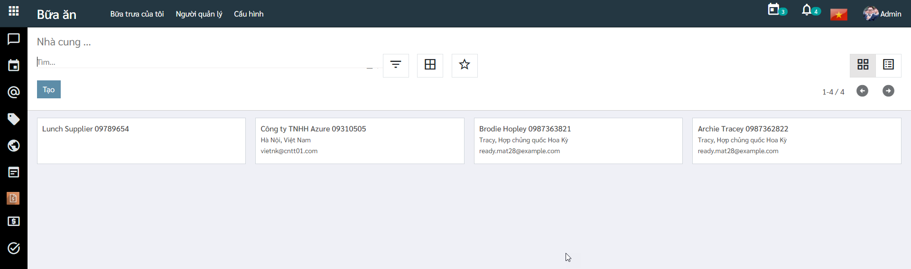
    
    * Nhập thông tin chi tiết cho Nhà cung cấp
    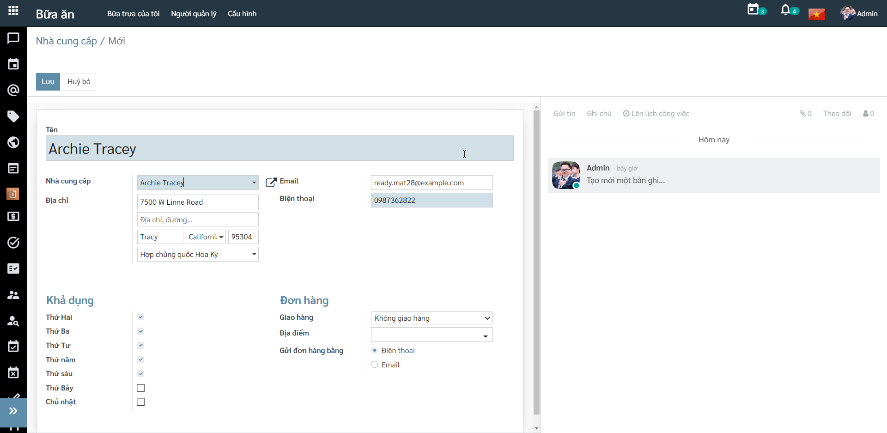
      
        * Khi chọn thông tin Khả dụng: với các ngày không được chọn, người dùng sẽ không thể đặt món ăn của nhà cung cấp đó
        
        * Khai báo thông tin Địa điểm: Thông tin Địa điểm mà người dùng chọn có thể được thêm mới trực tiếp tại đây hoặc vào chức năng **Cấu hình/Địa điểm** để thêm mới địa điểm
      
    * Nhấn **Lưu** để lưu lại thông tin nhà cung cấp
      
    * Người dùng thực hiện **Theo dõi** nhà cung cấp, **Thêm người theo dõi** hoặc **Thêm kênh theo dõi**. 
    
    * Người dùng tạo **Ghi chú** và **Gửi tin** đến người dùng cũng đang theo dõi thông tin của nhà cung cấp đó
    
    * Người dùng thực hiện **Lên lịch công việc** 
    
2. Sau khi đã có thông tin các nhà cung cấp, người Quản trị sẽ thực hiện bổ sung thông tin các sản phẩm sẽ nhập từ nhà cung cấp vừa chọn 

    * Vào chức năng **Bữa ăn**, chọn **Cấu hình/Sản phẩm**, chọn thêm mới sản phẩm 
    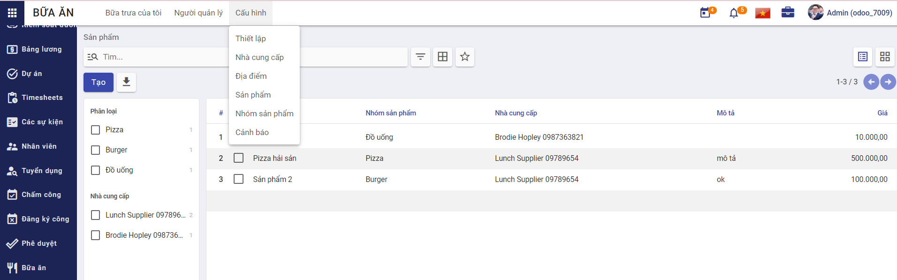
    
    * Khai báo thông tin chi tiết của Sản phẩm
      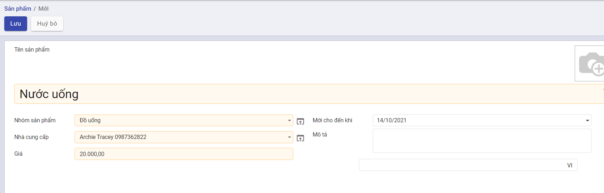
        * **Ghi chú:** Thông tin Nhóm sản phẩm mà người dùng chọn có thể được thêm mới trực tiếp tại đây hoặc vào chức năng **Cấu hình/Nhóm sản phẩm** để thêm mới nhóm
      
    * Nhấn **Lưu** để lưu lại thông tin sản phẩm 
    
3. Quản trị thiết lập thông tin thấu chi để giới hạn việc người dùng khi đặt bữa ăn vượt quá mức chi tối đa cho phép

    * Vào chức năng **Bữa ăn**, chọn **Cấu hình/Thiết lập**
    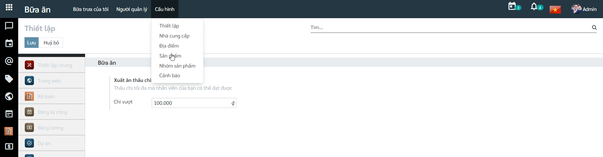
    
    * Khai báo thông tin Chi vượt 
      
        * **Ghi chú:** Sau khi viết lập thông tin thấu chi thì khi đặt món, nếu người dùng nợ quá thấu chi tối đa có thể đạt được thì sẽ không được phép đặt món.

### **Thiết lập cảnh báo**

Người sử dụng là Quản trị viên sẽ thiết lập các thông tin cảnh báo nhắc nhở người dùng 

**Đối tượng thực hiện:** Quản trị hệ thống

1. Người dùng vào chức năng **Bữa ăn**, chọn **Cấu hình/Cảnh bảo**, tạo một cảnh báo mới 
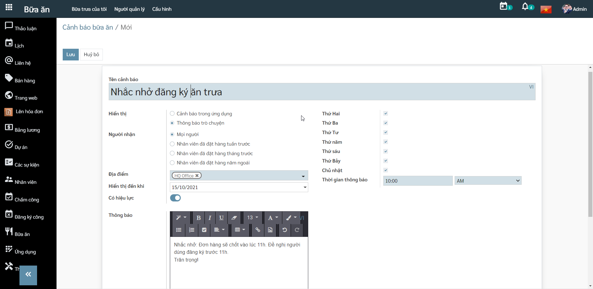

2. Khai báo các thông tin chi tiết của cảnh báo
   
    * Với thông tin Hiển thị là Thông báo trò chuyện, người dùng sẽ khai báo thêm thông tin Người nhận và Thời gian thông báo
    
3. Nhấn **Lưu** để thiết lập việc gửi thông báo đến người dùng theo thời gian đã đặt

## **Đặt món**

Người dùng thực hiện đặt món ăn và Quản trị sẽ xác nhận đơn đặt của người dùng.

**Đối tượng thực hiện:** Người dùng hệ thống

1. Người dùng thực hiện đặt món:
   
    * Vào chức năng **Bữa trưa của tôi/Đơn mới**
    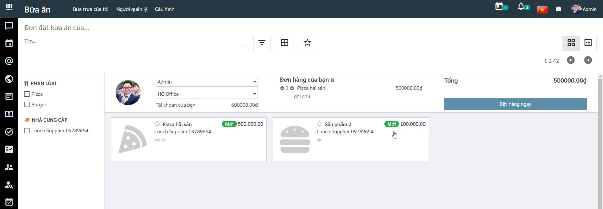
    
    * Chọn món cần đặt
    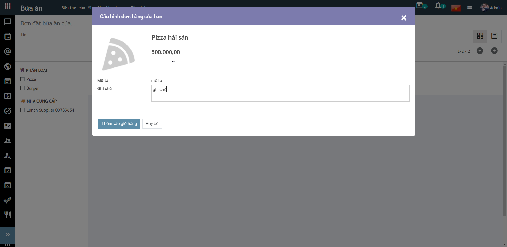
    
    * Món đã thêm vào giỏ hàng, nhấn **Đặt hàng ngay** để tạo đơn
    
    * **Lưu ý:** Khi thêm món vào giỏ hàng, tài khoản của người dùng phải lớn hơn số tiền của món hoặc tổng tài khoản của người và mức thấu chi tối đa phải lớn hơn giá trị của món. Nếu không sẽ không cho phép đặt món.

2. Sau khi người dùng đặt hàng xong, Quản trị sẽ thực hiện xác nhận đơn:
   
    * Vào chức năng **Người quản lý/Đặt món hôm nay** hoặc vào chức năng **Người quản lý/Kiểm soát nhà cung cấp** nhấn **Xác nhận** để xác nhận đơn đặt của người dùng
    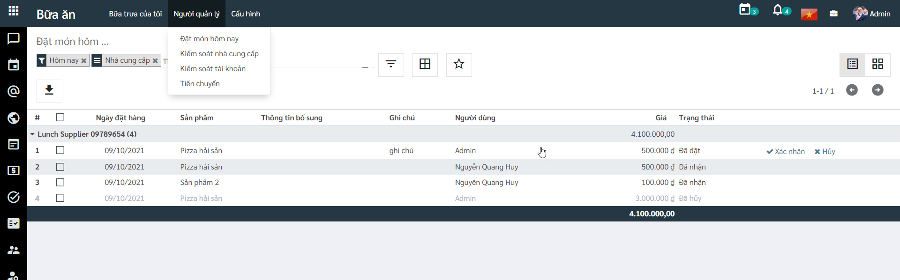

## **Chuyển tiền**

Quản trị viên tạo xác nhận chuyển tiền cho người dùng để nạp tiền đặt bữa ăn.

**Đối tượng thực hiện:** Người dùng hệ thống

1. Người Quản trị sẽ vào **Người quản lý/Chuyển tiền** thêm một bản ghi tiền cho người dùng
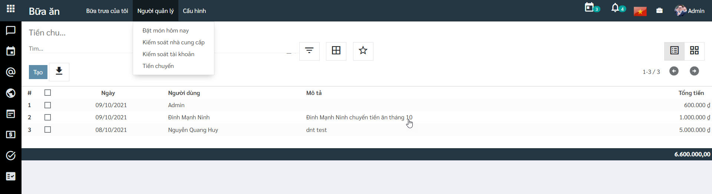

3. Nhập thông tin chi tiết cho Chuyển tiền
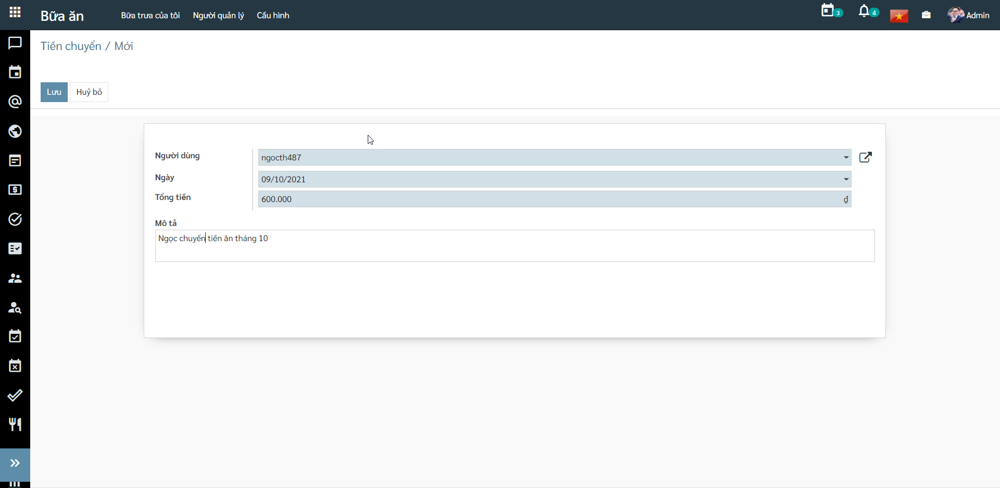

4. Nhấn **Lưu** để thêm thông tin tài khoản của người dùng.

## **Báo cáo**

### **Xem lịch sử cá nhân**

Người dùng thực hiện đặt món ăn hoặc chuyển tiền sẽ thực hiện xem lại lịch sử đặt hàng và tài khoản của cá nhân. 

**Đối tượng thực hiện:** Người dùng hệ thống

1. Người dùng kiểm tra lại lịch sử đặt hàng của mình bằng cách vào **Bữa trưa của tôi/Lịch sử đặt hàng của tôi**
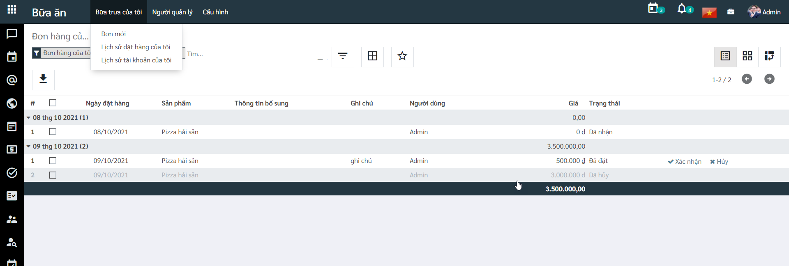

2. Người dùng thống kê số tiền đã chuyển vào và mức chi tiêu cá nhân bằng cách vào **Bữa trưa của tôi/Lịch sử tài khoản của tôi**
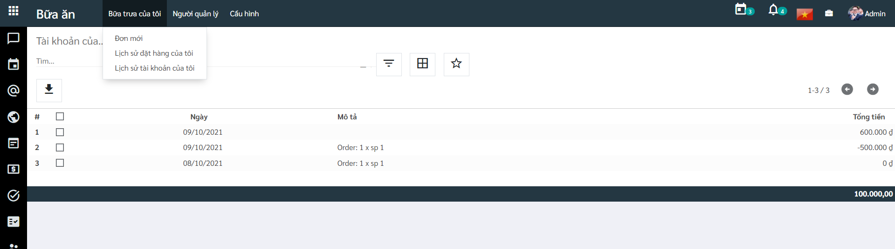

### **Kiểm soát thông tin**

Người dùng là Quản trị viên sẽ thực hiện việc theo dõi thông tin nhà cung cấp và thông tin tài khoản của người dùng khác. 

**Đối tượng thực hiện:** Quản trị hệ thống

1. Quản trị viên thống kê danh sách nhà cung cấp và các đơn hàng của nhà cũng cấp đó. Vào chức năng **Người quản lý/Kiểm soát nhà cung cấp**, nhấn vào nhà cung cấp muốn xem để hiển thị toàn bộ danh sách đơn đặt hàng của nhà cung cấp đó 
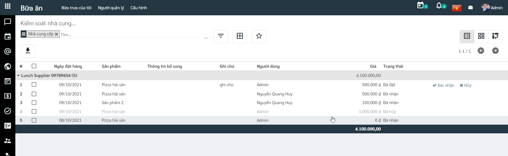

2. Quản trị viên thống kê danh sách người dùng và thông tin chuyển tiền, đặt hàng của người dùng. Vào chức năng **Người quản lý/Kiểm soát tài khoản**, nhấn vào tên người dùng muốn xem để hiển thị toàn bộ danh sách lịch sử giao dịch của người dùng đó 
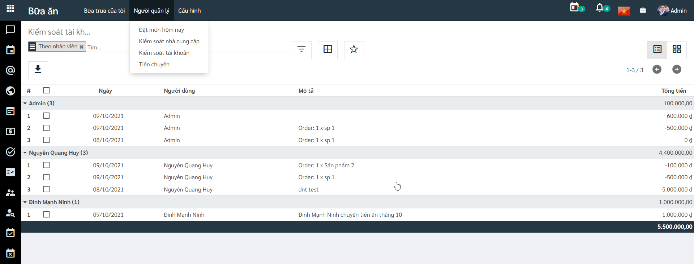
