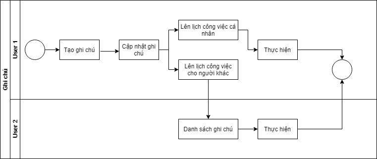
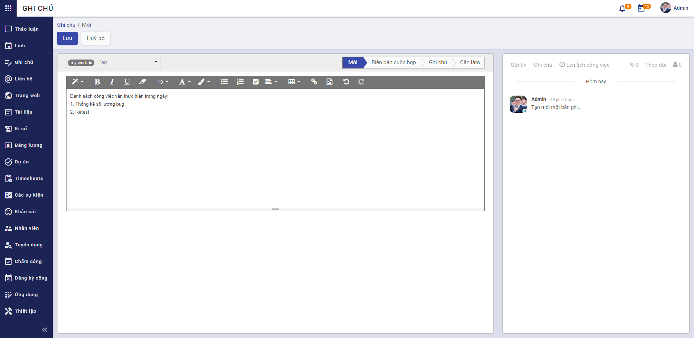
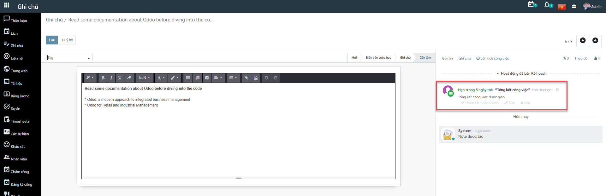

### Quy trình nghiệp vụ
Cho phép người dùng sắp xếp công việc với các ghi chú, giúp tăng năng suất của người dùng từ các nhiệm vụ cá nhân đến biên bản cuộc họp hợp tác, bằng cách cung cấp các công cụ phù hợp để ưu tiên từng công việc, chia sẻ ý tưởng và cộng tác trên các tài liệu.

#### Quy trình

**Các luồng quy trình**
* Ghi chú. Chi tiết nghiệp vụ <u>[tại đây](#ghi-chú)</u>.

#### Mô tả nghiệp vụ

Khi người sử dụng muốn quản lý ghi chú thì quy trình thực hiện như sau:
1. Tại chức năng **Ghi chú**, người dùng sẽ phân loại ghi chú theo các giai đoạn mặc định: Mới, Biên bản cuộc họp, Ghi chú, Cần làm. Có thể tạo thêm danh sách khác.
2. Người sử dụng tạo mới ghi chú.
3. Lên lịch công việc cho bản thân hoặc người dùng khác thông qua ghi chú.

**Luồng chức năng chính**
* Quản lý ghi chú. Chi tiết nghiệp vụ <u>[tại đây](#quản-lý-ghi-chú)</u>.

**Video hướng dẫn**

### Ghi chú

#### Quản lý ghi chú 

Người dùng hệ thống quản lý danh sách ghi chú bằng cách tạo các ghi chú công việc mới, sắp sếp các ghi chú theo các giai đoạn từ khi bắt đầu đến khi kết thúc và lên lịch, phân công thành viên thực hiện công việc.

**Đối tượng thực hiện:** Người dùng hệ thống

1. Vào chức năng **Ghi chú**, người sử dụng thực hiện phân loại ghi chú theo giai đoạn bằng cách di chuyển ghi chú tới giai đoạn bất kì (Hoặc thực hiện **Tìm kiếm** trực tiếp chức năng trên ô tìm kiếm chung của hệ thống)

2. Nhấn **Thêm một cột** để tạo một giai đoạn riêng
3. Người dùng thêm **Ghi chú** 

4. Khai báo thông tin chi tiết cho ghi chú: 
* Khai báo thông tin Tag
* Chọn Giai đoạn
* Khai báo Nội dung ghi chú
5. Nhấn **Lưu**
6. Sau khi ghi chú được lưu lại, người dùng thực hiện **Theo dõi** ghi chú, **Thêm người theo dõi** hoặc **Thêm kênh theo dõi** ghi chú. 
7. Người dùng sẽ thực hiện tạo **Ghi chú** và **Gửi tin** đến người dùng cũng đang theo dõi ghi chú
8. Người sử dụng thực hiện **Lên lịch công việc** cho ghi chú
* Chọn thông tin Kiểu hoạt động
* Khai báo thông tin Tổng kết 
* Chọn thông tin Ngày đến hạn
* Chọn thông tin Phân công cho
    * Người được chọn phân công phải là người đang theo dõi ghi chú 
* Khai báo thông tin Mô tả 
* Nhấn **Ấn định thời gian** để thực hiện giao việc cho nhân sự được chọn 
* Nhân sự hoàn thành công việc được giao sẽ đánh dấu công việc là **Hoàn tất hoàn thành**

* **Ghi chú:** Người dùng có thể **Lên lịch công việc** bằng cách: vào chức năng **Ghi chú**, nhấn **View activity** và nhấn **+** tại các dòng Kiểu hoạt động tương ứng
