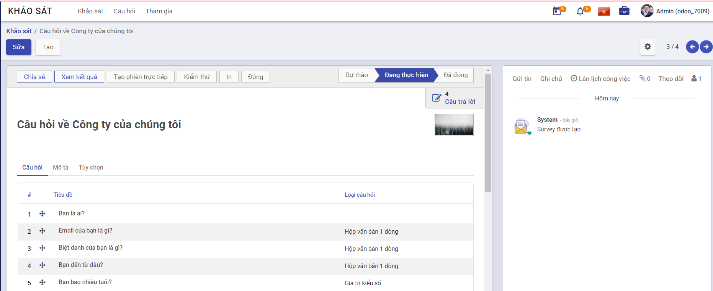

### Quy trình nghiệp vụ
Cho phép người dùng quản lý khảo sát, kết quả nhằm thu nhập thông tin, nhân định và đánh giá thực trạng của vấn đề.

#### Quy trình

**Các luồng quy trình**

* Quản lý khảo sát. Chi tiết nghiệp vụ <u>[tại đây](#quan-ly-khao-sat)</u>.
    
* Tham gia trả lời khảo sát. Chi tiết nghiệp vụ <u>[tại đây](#tra-loi-khao-sat)</u>.
    
* Quản lý tham gia khảo sát. Chi tiết nghiệp vụ <u>[tại đây](#quan-ly-tham-gia-khao-sat)</u>.

#### Mô tả nghiệp vụ

Khi người sử dụng muốn quản lý khảo sát thì quy trình thực hiện như sau:

1. Tại phân hệ **Khảo sát**, người dùng sẽ phân loại khảo sát theo trạng thái Dự thảo, Đang thực hiện, Đang đóng. Có thể tạo thêm danh sách khác.

2. Người sử dụng tạo mới tạo cuộc khảo sát bao gồm các câu hỏi khảo sát và cấu hình bộ câu hỏi khảo sát.

3. Sau khi Khảo sát được tạo, người dùng sẽ gửi email đến danh sách thành viên cần khảo sát.

4. Các thành viên tham gia trả lời khảo sát.

5. Kết thúc khảo sát, người tạo khảo sát sẽ xem được kết quả khảo sát (Báo cáo kết quả khảo sát theo từng câu hỏi khảo sát).

**Luồng chức năng chính**

* Quản lý khảo sát. Chi tiết nghiệp vụ <u>[tại đây](#quan-ly-khao-sat)</u>.

* Chia sẻ khảo sát. Chi tiết nghiệp vụ <u>[tại đây](#chia-se-khao-sat)</u>.

* Trả lời khảo sát. Chi tiết nghiệp vụ <u>[tại đây](#tra-loi-khao-sat)</u>.

* Xem kết quả khảo sát. Chi tiết nghiệp vụ <u>[tại đây](#xem-ket-qua-khao-sat)</u>.

**Video hướng dẫn**

### Khảo sát

#### Quản lý khảo sát

Người sử dụng thực hiện phân loại khảo sát và tạo mới tạo cuộc khảo sát bao gồm các câu hỏi khảo sát, cấu hình bộ câu hỏi khảo sát.

**Đối tượng thực hiện:** Quản trị hệ thống

1. Vào phân hệ **Khảo sát**, người sử dụng thực hiện phân loại khảo sát bằng cách di chuyển khảo sát tới danh sách bất kì (Hoặc thực hiện **Tìm kiếm** trực tiếp chức năng trên ô tìm kiếm chung của hệ thống)

2. Chọn tạo **Khảo sát** 

3. Khai báo thông tin chung của **Khảo sát** 

    * Chọn Ảnh khảo sát
    
    * Khai báo thông tin Tiêu đề khảo sát

4. Khai báo thông tin chi tiết của Câu hỏi (Khảo sát)

    * Khai báo thông tin Tên đầu mục 
    
    * Khai báo thông tin Câu hỏi thuộc khảo sát
    
        * Khai báo thông tin Câu hỏi 
        
        * Chọn thông tin Loại câu hỏi
        
        * Khai báo thông tin chi tiết của Câu trả lời với Loại câu hỏi là Hộp văn bản một dòng người dùng cần khai báo thêm thông tin: 
        
            * Chọn thông tin Dữ liệu phải là một Email hợp lệ: nếu chọn người dùng sẽ khai báo thêm thông tin Lưu dưới dạng email người dùng
            
            * Chọn thông tin Lưu làm biệt hiệu của người dùng 
            
            * Chọn thông tin Xác nhận: khi chọn Xác nhận, người dùng khai báo thêm các thông tin Độ dài văn bản tối thiểu, Độ dài văn bản tối đa và Thông điệp báo lỗi xác nhận 
            
        * Khai báo thông tin chi tiết của Câu trả lời với Loại câu hỏi là Giá trị kiểu số 
        
            * Lưu ý với Loại câu hỏi là Giá trị kiểu số, người dùng sẽ khai báo thêm thông tin Xác nhận, Câu trả lời chính xác, Đã cho điểm, Điểm
            
            * Lưu ý khi chọn Xác nhận, người dùng sẽ khai báo thêm thông tin Giá trị tối thiểu, Giá trị tối đa và Thông điệp báo lỗi xác nhận
            
        * Khai báo thông tin chi tiết của Câu trả lời với Loại câu hỏi là Ngày
        
            * Lưu ý với Loại câu hỏi là Ngày, người dùng sẽ khai báo thêm thông tin Xác nhận, Câu trả lời chính xác, Đã cho điểm, Điểm
            
            * Lưu ý khi chọn Xác nhận, người dùng sẽ khai báo thêm thông tin Ngày nhỏ nhất, Ngày lớn nhất và Thông điệp báo lỗi xác nhận 
            
        * Khai báo thông tin chi tiết của Câu trả lời với Loại câu hỏi là Ngày giờ
        
            * Lưu ý với Loại câu hỏi là Ngày giờ, người dùng sẽ khai báo thêm thông tin Xác nhận, Câu trả lời chính xác, Đã cho điểm, Điểm
            
            * Lưu ý khi chọn Xác nhận, người dùng sẽ khai báo thêm thông tin Ngày giờ tối thiểu, Ngày giờ tối đa và Thông điệp báo lỗi xác nhận
            
        * Khai báo thông tin chi tiết của Câu trả lời với Loại câu hỏi là Câu hỏi lựa chọn: một câu trả lời duy nhất và Câu hỏi lựa chọn: cho phép nhiều câu trả lời, người dùng sẽ khai báo thêm thông tin Các lựa chọn, Là một câu trả lời đúng và Số điểm cho lựa chọn này
        
            * Với Loại câu hỏi là Ma trận, người dùng sẽ khai báo thêm thông tin Câu trả lời và Hàng ma trận
            
            * Với Loại câu hỏi là Đánh giá, người dùng sẽ khai báo thêm thông tin Câu trả lời
            
        * Khai báo thông tin chi tiết của Mô tả
        
        * Khai báo thông tin chi tiết của Tùy chọn 
        
            * Chọn thông tin Câu trả lời bắt buộc, người dùng sẽ khai báo thêm thông tin Thông báo lỗi
            
            * Chọn thông tin Hiển thị có điều kiện, người dùng sẽ khai báo thêm thông tin Câu hỏi kích hoạt
            
            * Chọn thông tin Giới hạn thời gian cho câu hỏi, người dùng sẽ khai báo thêm thông tin thời gian giới hạn (giây)
            
            * Lưu ý với Loại câu hỏi là Ma trận người dùng sẽ khai báo thêm các thông tin:
            
                * Chọn thông tin Kiểu ma trận
                
                * Chọn thông tin Hiển thị trường bình luận, người dùng sẽ khai báo thêm thông tin Lời bình 
                
            * Lưu ý với Loại câu hỏi là Câu hỏi lựa chọn: một câu trả lời duy nhất hoặc Câu hỏi lựa chọn: cho phép nhiều câu trả lời người dùng sẽ khai báo thêm các thông tin: 
            
                * Khai báo thông tin Số cột
                
                * Chọn thông tin Hình ảnh về câu trả lời
                
                * Chọn thông tin Hiển thị trường bình luận, người dùng sẽ khai báo thêm thông tin Lời bình và chọn thông tin Trường bình luận là một lựa chọn cho câu trả lời 
            
        * Người dùng nhấn **Lưu** câu hỏi đã được cấu hình câu trả lời

5. Khai báo thông tin chi tiết của Mô tả (Khảo sát)

6. Khai báo thông tin chi tiết của Tùy chọn (Khảo sát)

    * Khai báo thông tin Câu hỏi gồm: 
    
        * Chọn thông tin Bố cục của khảo sát
        
            * Lưu ý đối với Bố cục khảo sát là Một trang cho mỗi phần hoặc Một trang cho mỗi câu hỏi, người dùng sẽ khai báo thêm thông tin Nút quay lại 
            
        * Chọn thông tin Chế độ tiến triển
        
        * Chọn thông tin Giới hạn thời gian khảo sát: khi chọn giới hạn thời gian, người dùng sẽ khai báo thêm Thời gian giới hạn (phút)
        
        * Chọn thông tin Lựa chọn
        
    * Khai báo thông tin Ứng của viên 
    
        * Chọn thông tin Chế độ truy cập 
        
        * Chọn thông tin Yêu cầu đăng nhập 
        
        * Lưu ý khi chọn Chế độ truy cập là Chỉ người được mời hoặc chọn Yêu cầu đăng nhập, người sử dụng sẽ khai báo thêm thông tin Giới hạn nỗ lực
        
        * Lưu ý khi chọn thông tin Giới hạn nỗ lực, người sử dụng sẽ khai báo thêm thông tin Lần thử (Số lần người dùng được tham gia thử khảo sát)
        
    * Khai báo thông tin Chấm điểm 
    
        * Chọn thông tin Chấm điểm là Không chấm điểm, Chấm điểm với câu trả lời ở cuối hoặc Chấm điểm mà không có câu trả lời ở cuối
        
        * Lưu ý đối với thông tin Chấm điểm là Chấm điểm với câu trả lời ở cuối hoặc Chấm điểm mà không có câu trả lời ở cuối, người sử dụng sẽ khai báo thêm thông tin Thành công % để quy định số phần trăm được tính là đạt yêu cầu cho cuộc khảo sát và thông tin Là một chứng nhận để thiết lập khảo sát có cấp chứng chỉ hay không 
        
        * Lưu ý nếu Là một chứng nhận, người dùng sẽ khai báo thêm các thông tin: 
        
            * Chọn thông tin Mẫu mail để thực hiện gửi mail cho người dùng
            
            * Chọn thông tin Mẫu giấy chứng nhận
            
            * Chọn thông tin Trao huy hiệu tới người tham gia khảo sát
            
               * Lưu ý chọn thông tin Trao huy hiệu tới người tham gia khảo sát, người dùng sẽ khai báo thêm thông tin Huy hiệu chứng nhận
               
    * Khai báo thông tin Phiên trực tiếp 
    
        * Chọn thông tin Thưởng cho các câu trả lời nhanh
        
7. Nhấn **Lưu** khảo sát

8. Sau khi khảo sát được lưu lại, người dùng thực hiện **Theo dõi** khảo sát, **Thêm người theo dõi** hoặc **Thêm kênh theo dõi** khảo sát. Sau đó người dùng sẽ thực hiện tạo **Ghi chú** và **Gửi tin** đến người dùng cũng đang theo dõi khảo sát

9. Người sử dụng thực hiện **Lên lịch công việc** cho khảo sát 

#### Chia sẻ khảo sát

Cho phép người dùng chia sẻ khảo sát đã tạo 

**Đối tượng thực hiện:** Quản trị hệ thống

1. Vào phân hệ **Khảo sát** (Hoặc thực hiện **Tìm kiếm** trực tiếp chức năng trên ô tìm kiếm chung của hệ thống)

2. Chọn **Khảo sát/Chia sẻ** 

3. Khai báo thông tin chi tiết của Chia sẻ

    * Khai báo thông tin Người nhận
    
    * Khai báo thông tin Chủ đề 
    
    * Khai báo thông tin Mô tả 
    
    * Chọn Tệp đính kèm 
    
    * Khai báo thông tin Thười hạn trả lời
    
    * Chọn thông tin Sử dụng mẫu: Mail mời khảo sát hoặc Mail gửi chứng nhận
    
4. Người dùng nhấn **Gửi**

#### Trả lời khảo sát

Người dùng sẽ nhận được email thông báo tham gia khảo sát. Thực hiện trả lời khảo sát theo các thông tin đã được gửi

**Đối tượng thực hiện:** Người dùng

1. Vào email cá nhân. Thực hiện chọn **Bắt đầu chứng nhận**

2. Thực hiện trả lời các câu hỏi của khảo sát

#### Xem kết quả khảo sát

Cho phép người dùng xem kết quả khảo sát (Báo cáo kết quả khảo sát theo từng câu hỏi khảo sát)

**Đối tượng thực hiện:** Quản trị hệ thống

1. Vào phân hệ **Khảo sát** (Hoặc thực hiện **Tìm kiếm** trực tiếp chức năng trên ô tìm kiếm chung của hệ thống)

2. Chọn **Khảo sát/Xem kết quả** 

3. Người dùng xem kết quả khảo sát dưới dạng biểu đồ tròn thể hiện tỉ lệ khảo sát đã đạt và tỉ lệ khảo sát đã bỏ lỡ

### Quản lý tham gia khảo sát

Cho phép Quản trị hệ thống xem được chi tiết các thành viên đã tham gia trả lời khảo sát của từng khảo sát

**Đối tượng thực hiện:** Quản trị hệ thống 

1. Vào phân hệ **Khảo sát**, chọn **Tham gia** (Hoặc thực hiện **Tìm kiếm** trực tiếp chức năng trên ô tìm kiếm chung của hệ thống)

2. Người dùng thực hiện quản lý danh sách người dùng đã tham gia khảo sát 

3. Nhấn **Xuất toàn bộ** để xuất toàn bộ danh sách tham gia khảo sát

