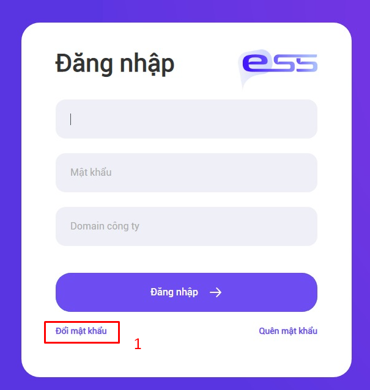
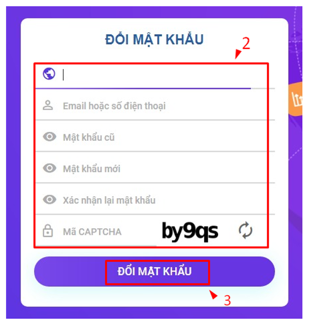
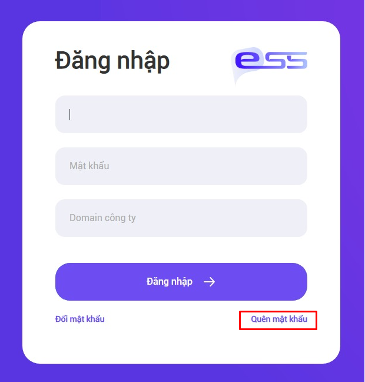
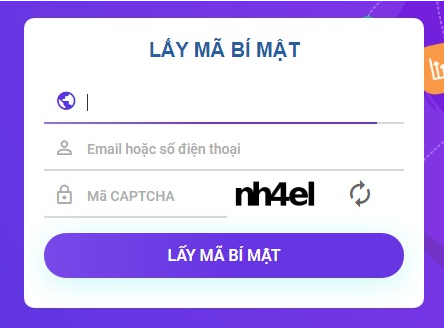
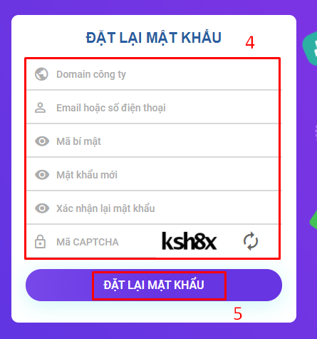
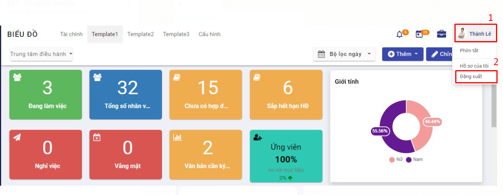

### Quy trình nghiệp vụ

Cho phép người dùng thực hiện đăng nhập vào hệ thống, đăng xuất khỏi hệ thống, thay đổi mật khẩu, đặt lại mật khẩu.

#### Quy trình

**Các luồng quy trình**

* Đổi mật khẩu. Chi tiết nghiệp vụ <u>[tại đây](#doi-mat-khau)</u>.

* Quên mật khẩu. Chi tiết nghiệp vụ <u>[tại đây](#quen-mat-khau)</u>.

* Đăng nhập. Chi tiết nghiệp vụ <u>[tại đây](#dang-nhap)</u>.

* Đăng xuất. Chi tiết nghiệp vụ <u>[tại đây](#dang-xuat)</u>.

#### Mô tả nghiệp vụ

Khi người sử dụng muốn đăng nhập vào hệ thống thì quy trình thực hiện như sau:

1. Nếu người dùng muốn đổi mật khẩu thì thực hiện đổi mật khẩu và đăng nhập với mật khẩu mới.

2. Nếu người dùng quên mật khẩu thì thực hiện lấy lại mật khẩu sau đó đặt lại mật khẩu và đăng nhập với mật khẩu mới.

3. Người dùng thực hiện đăng nhập bằng email hoặc số điện thoại của người dùng.

4. Người dùng muốn truy xuất khỏi hệ thống thì thực hiện đăng xuất.

**Luồng chức năng chính**

* Đổi mật khẩu. Chi tiết nghiệp vụ <u>[tại đây](#doi-mat-khau)</u>.

* Quên mật khẩu. Chi tiết nghiệp vụ <u>[tại đây](#quen-mat-khau)</u>.

* Đăng nhập. Chi tiết nghiệp vụ <u>[tại đây](#dang-nhap)</u>.

* Đăng xuất. Chi tiết nghiệp vụ <u>[tại đây](#dang-xuat)</u>.

**Video hướng dẫn**

### Đăng nhập, đăng xuất

 > *<u>Chú ý</u>*: 
 > - Tại các bước thực hiện dưới đây, khi người dùng truy cập từ hệ thống VESS thì sẽ không có trường Domain công ty, nếu truy cập trực tiếp từ hệ thống xác thực người dùng thì sẽ có trường Domain công ty và bắt buộc nhập. Giá trị nhập vào Domain công ty chính là giá trị URL của hệ thống cần truy cập vào và loại bỏ chuỗi http://.
 >
 > - Ví dụ: URL của hệ thống cần truy cập là http://vess.store thì Domain công ty là: vess.store
 
#### Đổi mật khẩu

Người sử dụng thực hiện đổi mật khẩu khác với 5 mật khẩu cũ gần đây nhất.

1. Tại màn hình login, chọn vào link **Đổi mật khẩu**

    

2. Nhập tất cả các thông tin hợp lệ ở màn hình Đổi mật khẩu

3. Bấm chọn **ĐỔI MẬT KHẨU** button

    

> *<u>Quy tắc đặt mật khẩu mới</u>*:
>
> - Mật khẩu mới phải đủ mạnh, phải ít nhất 8 ký tự, bao gồm: chữ hoa, chữ thường, số, ký tự đặc biệt.
>
> - Mật khẩu mới không được giống mật khẩu cũ.
>
> - Mật khẩu mới không được bao gồm thông tin cá nhân: ngày, tháng, năm sinh, mã nhân viên, tên đăng nhập, họ tên đầy đủ, họ, tên, tên đệm (cả có dấu và không giấu), cellphone, telephone, chứng minh thư.
>
> - Không được bắt đầu bằng "123", "963", "852", "741", "789", "147", "258", "369", "abc", "456".
>
> - Không bao gồm các từ sau "qwerty", "password", "passw0rd", "abc123", "iloveyou", "viettel@123", "admin@123", "123qwea@", "abc123", "abc@123", "password@123", "qwerty@123", "vtt@2014", "123@123", "123123", "696969".

Thực hiện thay đổi mật khẩu thành công.

#### Quên mật khẩu

   Khi bị quên mật khẩu, người dùng thực hiện lấy lại mật khẩu bằng cách thực hiện chức năng quên mật khẩu, sau khi có mã bí mật gửi vào email hoặc sms người dùng sẽ truy cập vào đường dẫn được gửi trong mail / sms để truy cập vào màn hình đặt lại mật khẩu. Người dùng thực hiện đặt lại mật khẩu khác với 5 mật khẩu cũ gần đây nhất.

1. Tại màn hình login, chọn link **Quên mật khẩu**

    

2. Nhập đầy đủ thông tin các trường ở màn hình Lấy mã bí mật 

3. Nhấn chọn **LẤY MÃ BÍ MẬT**

    

    Hệ thống sẽ gửi tin nhắn chứa mã bí mật vào email và điện thoại của người dùng. Dùng mã bí mật này để thực hiện thay đổi mật khẩu ở các bước tiếp theo

4. Nhập đầy đủ thông tin các trường ở màn hình Đặt lại mật khẩu 

    > *<u>Chú ý</u>*: Mã bí mật là mã lấy được ở **Bước 3**
    
5. Nhấn chọn **ĐẶT LẠI MẬT KHẨU**
    
    

Thực hiện quên mật khẩu thành công

#### Đăng nhập

1. Nhập đầy đủ thông tin Domain công ty (nếu có), Tên đăng nhập, Mật khẩu theo thông tin đã đăng ký trên hệ thống VESS

2. Nhấn chọn **ĐĂNG NHẬP** button

    

Thực hiện đăng nhập thành công

#### Đăng xuất
Khi người dùng đang truy cập hệ thống VESS mà muốn đăng xuất ra khỏi hệ thống thì sẽ thực hiện chức năng đăng xuất.
1. Tại góc phải phía trên, nhân chọn vào ảnh đại diện hoặc tên của người dùng
2. Nhấn chọn **Đăng xuất**

    
    
Thực hiện đăng xuất thành công