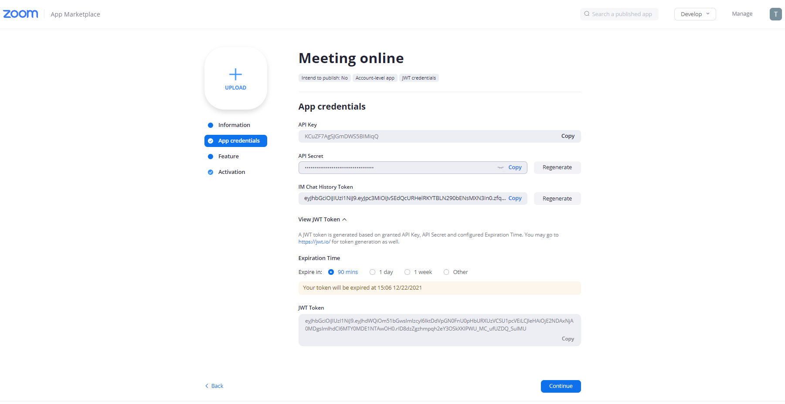
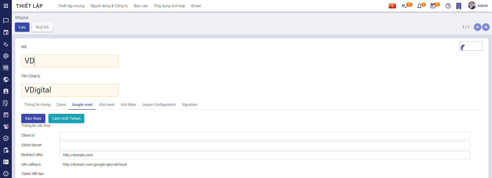
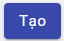

# Quy trình nghiệp vụ 
Hỗ trợ công tác quản lý các cuộc họp, cho phép người dùng thêm mới cuộc họp, tổ chức meeting online vào một khung giờ thuận tiện. Gửi email thông báo, nhắc nhở để xác nhận các thành viên tham gia cuộc họp và đảm bảo rằng những người tham gia sẽ không quên lịch hẹn. Cho phép họ thêm cuộc họp vào lịch theo thời gian thực khi một sự kiện được tạo. 

**Quy trình**

**Các luồng quy trình**

* Quản lý cuộc họp. Chi tiết nghiệp vụ <u>[tại đây](#quan-ly-cuoc-hop)</u>.

* Tham gia cuộc họp. Chi tiết nghiệp vụ <u>[tại đây](#tham-gia-cuoc-hop)</u>.

**Mô tả nghiệp vụ**

Khi người sử dụng muốn quản lý và tham gia cuộc họp thì quy trình thực hiện như sau:

1. Người dùng truy cập vào hệ thống chọn chức năng **Thiết lập/Người dùng và công ty/Công ty** và chọn tạo cuộc họp zoom hoặc google meet bằng mã Application ID và Client secret 

2. Sau khi cài đặt cuộc họp, người dùng vào chức năng Lịch, người dùng tạo cuộc họp zoom hoặc google meet và gửi thông báo tới người tham gia

3. Người tham gia khi truy cập vào hệ thống sẽ nhận thông báo mời tham dự và các thông tin để tham dự cuộc họp. Người tham gia xác nhận thông báo

4. Người dùng tham gia cuộc họp

**Luồng chức năng chính**

* Thiết lập cuộc họp zoom. Chi tiết nghiệp vụ <u>[tại đây](#thiet-lap-cuoc-hop-zoom)</u>.

* Thiết lập cuộc họp google meet. Chi tiết nghiệp vụ <u>[tại đây](#thiet-lap-cuoc-hop-google-meet)</u>.

* Tạo cuộc họp. Chi tiết nghiệp vụ <u>[tại đây](#tao-cuoc-hop)</u>.

* Tham gia cuộc họp. Chi tiết nghiệp vụ <u>[tại đây](#tham-gia-cuoc-hop)</u>.

**Video hướng dẫn**

## **Quản lý cuộc họp**

### **Thiết lập cuộc họp zoom**

Quản trị hệ thống sẽ thực hiện đăng ký thông tin, cấu hình phòng họp zoom trên trang web bên ngoài hệ thống và trên hệ thống vESS trước khi tạo mới một phòng họp trực tuyến.

**Đối tượng thực hiện:** Quản trị hệ thống

**Điều kiện trước:** Quản trị hệ thống phải cấu hình phòng họp zoom ngoài hệ thống trước 

1. Người dùng truy cập vào trang web [https://marketplace.zoom.us/](https://marketplace.zoom.us/). Chọn **Develop/Build App**

    

2. Tại màn hình **Choose your app type** chọn JWT

    

3. Người dùng khai báo thông tin **App Name** và nhấn  để tiếp tục khai báo thông tin

    

4. Tiếp tục khai báo hợp lệ các thông tin bắt buộc khác

    

5. Sau khi khai báo thành công, nhấn  để lấy thông tin **API Key**, **API Secret** và **Expiration Time**

    

6. Tiếp tục nhấn  để kích hoạt ứng dụng trên website

7. Sau khi lấy được thông tin **API Key**, **API Secret** và **Expiration Time** ở bước 5, Quản trị hệ thống truy cập hệ thống, vào chức năng **Thiết lập/Người dùng và công ty/Công ty**. Hệ thống sẽ hiển thị danh sách công ty, người dùng chọn 1 công ty để xem chi tiết các thông tin của công ty được chọn. Tại màn hình thông tin chi tiết, quản trị chọn tạo cuộc họp zoom

    

8. Người dùng khai báo các thông tin chi tiết của cuộc họp bằng thông tin lấy được từ app trên web zoom đã tạo (Bước 5):

    * Khai báo thông tin **API Key** là **API Key**
    
    * Khai báo thông tin **API Secret** là **API Secret**
    
    * Khai báo thông tin **Token hết hạn** là **Expiration Time**

9. Nhấn **Lấy token**, hệ thống sẽ tạo link URL zoom và password

10. Nhấn **Kiểm tra kết nối** để kiểm tra kết nối cuộc họp zoom thành công hay chưa

### **Thiết lập cuộc họp google meet**

Quản trị hệ thống sẽ thực hiện đăng ký thông tin, cấu hình phòng họp google meet trên trang web bên ngoài hệ thống và trên hệ thống vESS trước khi tạo mới một phòng họp trực tuyến.

**Đối tượng thực hiện:** Quản trị hệ thống

**Điều kiện trước:** Quản trị hệ thống phải cấu hình phòng họp google meet ngoài hệ thống trước 

1. Người dùng truy cập vào trang web [https://console.cloud.google.com/](https://console.cloud.google.com/). Chọn **APIs & Services/ OAuth consent screen**

    

2. Nếu người dùng chưa có bất kỳ dự án nào, hệ thống sẽ hiển thị màn hình như ảnh dưới đây. Người dùng nhấn  để tạo một dự án mới

    

3. Khai báo các thông tin hợp lệ và nhấn  để thêm mới dự án

    

4. Sau khi thêm dự án thành công, hệ thống chuyển người dùng đến màn hình tiếp theo. Tại đây, người dùng chọn **User Type** là **External** và nhấn  để chuyển đến màn hình **Edit app registration**

5. Khai báo các thông tin bắt buộc (Các thông tin không bắt buộc có thể bỏ qua)

    

6. Nhấn , người dùng sẽ được chuyển đến màn hình **Scopes**. Trong màn hình **Scopes** ko cần thiết, người dùng có thể bỏ qua và chuyển sang bước tiếp theo là **Test users**

7. Trong màn hình **Test users** người dùng nhấn vào  hệ thống hiển thị lên form và người dùng điền email của mình vào form đó. Nhấn  để thêm email

    

8. Nhấn  để hoàn tất đăng ký thông tin ứng dụng

9. Tại menu bên trái, chọn **Credentials**, hệ thống chuyển đến màn hình **Credentials** tương ứng. Người dùng nhấn  và chọn **OAuth Client ID**

    

10. Tại màn hình **Create OAuth client ID**, người dùng chọn **Application type** là **Web Application** và khai báo các thông tin: 

    

    * Khai báo tên ứng dụng. 
    
    * Khai báo thông tin **Authorized redirect URIs** bằng cách nhấn , hệ thống hiển thị thêm thông tin **URIs** 
    
        * **Ghi chú:** Người dùng phải khai báo thông tin **URIs** là thông tin **URI callback** trên hệ thống **vESS**
        
        * Cách lấy thông tin **URI callback** như sau: 
        
            * Quản trị hệ thống truy cập hệ thống **vESS**, vào chức năng **Thiết lập/Người dùng và công ty/Công ty**. 
            
            * Tại danh sách công ty, người dùng chọn 1 công ty để xem chi tiết các thông tin của công ty đó. Quản trị chọn **Google meet**, khai báo thông tin **Redirect URIs** (Thông tin **Redirect URIs** được lấy trên thanh URL mà người dùng đang truy cập)
            
            * Sau khi khai báo thông tin **Redirect URIs**, hệ thống sẽ tự động tạo thông tin **URI callback**
    
    

11. Sau khi khai báo hợp lệ, nhấn  để tạo **OAuth client ID** thành công và lấy được thông tin **Your Client ID** và **Your Client Secret**

    

12. Quản trị hệ thống truy cập hệ thống **vESS**, vào chức năng **Thiết lập/Người dùng và công ty/Công ty**. Tại danh sách công ty, người dùng chọn 1 công ty để xem chi tiết các thông tin của công ty đó. Quản trị chọn **Google meet** và khai báo các thông tin:

    * Khai báo thông tin **Client Id** là thông tin **Your Client ID** (Lấy được ở bước 11)
    
    * Khai báo thông tin **Client Secret** là thông tin **Your Client Secret** (Lấy được ở bước 11)
    
    

13. Người dùng quay lại web:

    * Tại menu bên trái, chọn **Library**
    
    
    
    * Màn hình **API Library** hiển thị, người dùng tìm kiếm với từ khóa **"calendar API"** và chọn **"Google Calendar API"**
    
    
    
    * Nhấn **Enable** chức năng 
    
    

14. Sau khi kích hoạt chức năng **Calendar API** trên web, người dùng truy cập lại hệ thống vESS (để tiếp tục thực hiện tiếp bước 12). Nhấn **Lưu**, hoặc nhấn **Làm mới token**

15. Nhấn **Xác thực** để chuyển đến màn hình xác thực. Chọn đúng email đã đăng ký trên trang web để cài đặt thành công

    

### **Tạo cuộc họp**

Quản trị hệ thống sẽ thực hiện tạo mới một phòng họp trực tuyến qua zoom hoặc google meet, thêm người tham gia cuộc họp và gửi email thông báo, nhắc nhở đến những người tham gia.

**Đối tượng thực hiện:** Quản trị hệ thống

**Điều kiện trước:** Quản trị hệ thống phải cấu hình phòng họp zoom hoặc google meet trên hệ thống trước 

1. Quản trị hệ thống có thể tạo cuộc họp trự tuyến theo 2 cách: 

    * Cách 1: Vào chức năng **Thảo luận**, nhấn biểu tượng , hệ thống sẽ hiển thị màn hình cho phép khai báo thông tin cuộc họp
    
    
    
    * Cách 2: Vào chức năng **Lịch**:
    
        * Ở dạng **View calendar**, người dùng sẽ chọn ngày và thời gian muốn diễn ra cuộc họp trên lịch, hệ thống sẽ hiển thị màn hình cho phép khai báo thông tin cuộc họp
        
    
        * Ở dạng **View list**, người dùng nhấn , hệ thống sẽ hiển thị màn hình cho phép khai báo thông tin cuộc họp
    
    

2. Màn hình tạo cuộc họp:

    
    
    * Chọn loại là **Cuộc họp trực tuyến**
    
        * Khi chọn loại là **Cuộc họp trực tuyến**, người dùng sẽ chọn cuộc họp đó sử dụng **Zoom** hay **Google meet**
    
        * **Ghi chú:** Khi tạo cuộc họp trực tuyến từ chức năng **Lịch**, người dùng sẽ phải chọn loại **Cuộc họp**, **Sự kiện cá nhân** hoặc **cuộc họp trực tuyến**. Còn khi tạo cuộc họp trực tuyến từ chức năng **Thảo luận**, người dùng sẽ không phải chọn mà mặc định sẽ là **Cuộc họp trực tuyến**
        
    * Khai báo các thông tin **Người tham dự**, **Người phụ trách**, **Người chuẩn bị**
    
        * Dữ liệu lấy từ **Nhân viên**
        
        * **Ghi chú:** Khi tạo cuộc họp trực tuyến từ chức năng **Thảo luận**, người dùng sẽ không phải khai báo thông tin này. **Người tham dự** cuộc họp trực tuyến sẽ là thành viên của kênh thảo luận.
        
    * Khai báo thông tin **Chi tiết cuộc gặp**
        
        * Khai báo thông tin ***Bắt đầu vào*** phải lớn hơn thời gian hiện tại 
        
        * Khai báo thông tin ***Thời lượng*** phải lớn hơn 00:00 giờ
        
        * Khai báo thông tin ***Nhắc nhở***. Người dùng có thể cấu hình trực tiếp thời gian gửi thông báo nhắc nhở người tham dự cuộc họp dưới dạng ***Thông báo***, ***Email*** hoặc ***SMS***
        
        * Khai báo thông tin ***Địa điểm***. Dữ liệu ***Địa điểm*** lấy từ **Lịch/Phòng họp**
        
        * **Lưu ý:** Với cuộc hợp trực tuyến, không thể chọn thời lượng diễn ra cuộc họp là ***Cả ngày***
    
    * Khai báo thông tin **Tùy chọn**
    
        * Khai báo thông tin ***Lặp lại*** cuộc họp theo ngày, tuần, tháng hoặc theo năm
    
3. Nhấn **Gửi mail cuộc họp trực tuyến**, hệ thống sẽ tiến hành gửi mail mời tham dự cuộc họp tới người tham dự

4. Nhấn **Lưu** để tạo cuộc họp thành công 

    * **Ghi chú:** Khi tạo mới thành công cuộc họp từ chức năng **Thảo luận**, trong kênh thảo luận sẽ hiển thị các thông tin của cuộc họp gồm: **Chủ đề, Thời gian, Thời lượng, Link tham dự cuộc họp, Mật khẩu (Đối với cuộc họp là zoom)**
    
## **Tham gia cuộc họp**

Sau khi Quản trị tạo cuộc họp trực tuyến và gửi thư mời tới người tham dự, người tham dự sẽ xem thông báo, xác nhận và tham gia cuộc họp.

**Đối tượng thực hiện:** Người dùng hệ thống

1. Người tham dự sẽ nhận được email mời tham dự cuộc họp, thực hiện xác nhận tham gia hoặc không tham gia cuộc họp. Hoặc người dùng sẽ truy cập vào hệ thống và nhận được thông báo về cuộc họp mà người dùng được mời, Người dùng nhấn vào thông báo để lấy link tham gia cuộc họp

2. Người dùng click vào link để tham gia, hoặc lấy thêm **Mật khẩu** trong trường hợp cuộc họp sử dụng zoom