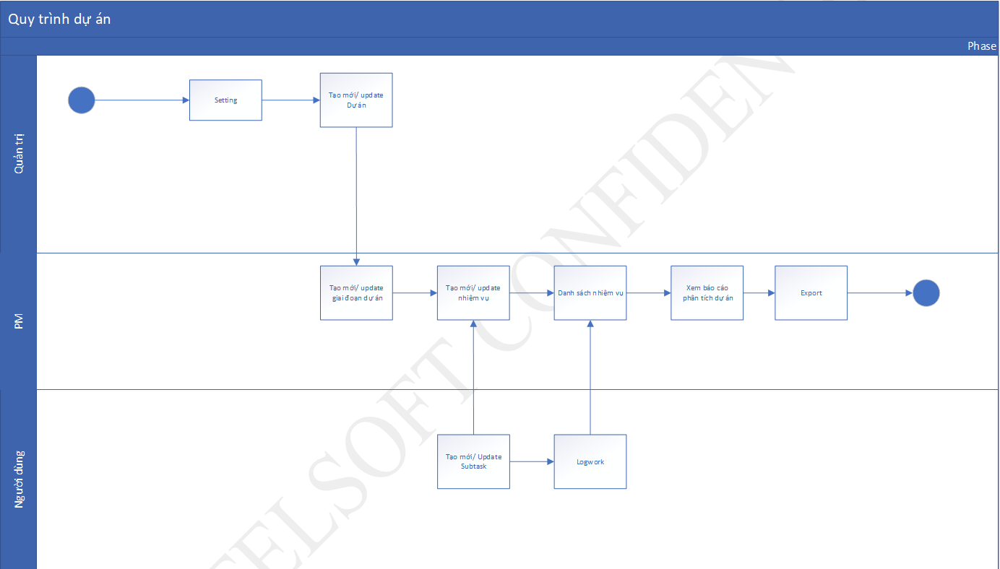
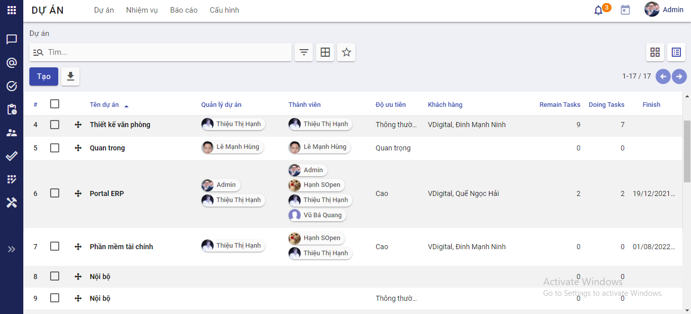
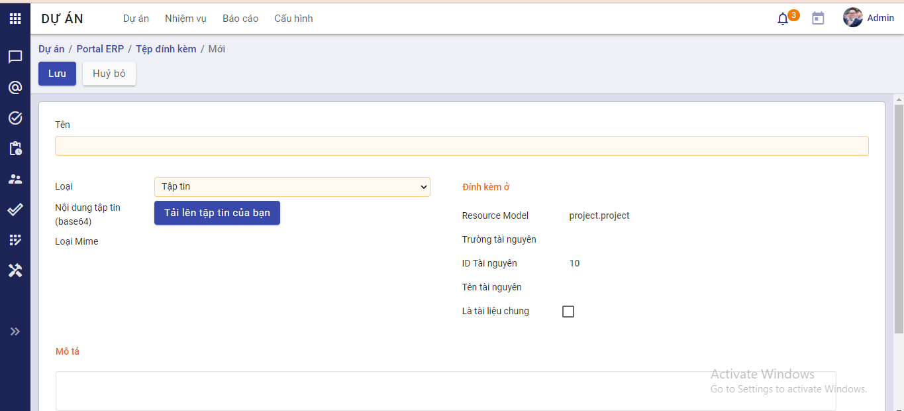
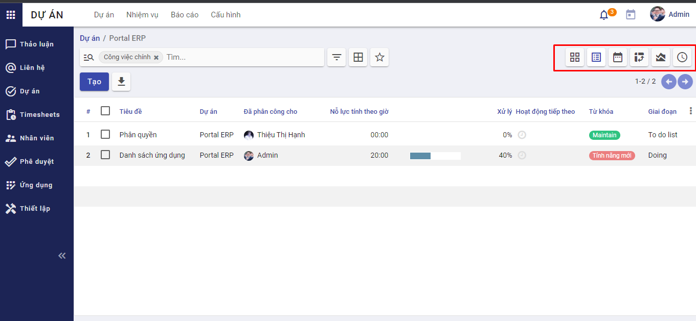
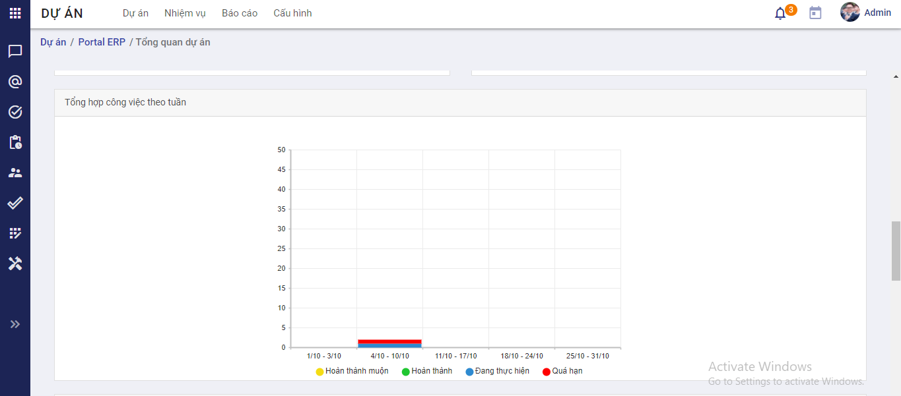
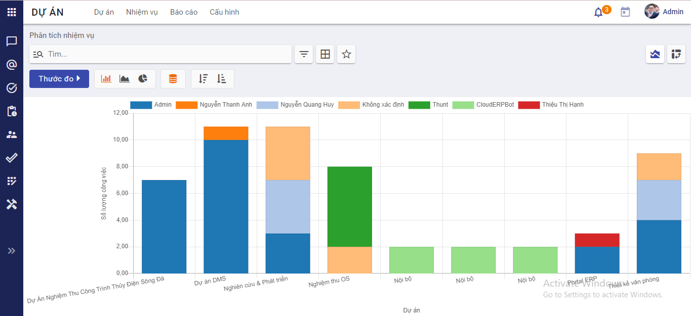
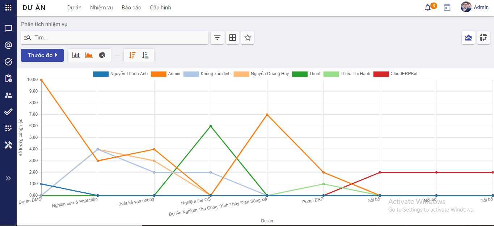

### Quy trình nghiệp vụ

Là ứng dụng quản lý dự án và các chức năng liên quan đến dự án, cung cấp bức tranh toàn cảnh về hoạt động của mỗi dự án, tăng cường hỗ trợ quản lý hiệu quả.

Thực hiện quản lý: Thông tin dự án, công việc trong dự án, tài liệu dự án, các báo cáo và các chức năng tích hợp như: Quản lý nhân viên, Thảo luận, Timesheet...

#### Quy trình

**Các luồng quy trình**

* Quản lý dự án
* Quản lý tài liệu dự án
* Quản lý công việc trong dự án
* Báo cáo

#### Mô tả nghiệp vụ

Khi người sử dụng muốn quản lý dự án thì quy trình thực hiện như sau:

1. Tại ứng dụng **Dự án**, người dùng sẽ thực hiện tạo mới dự án: thêm thành viên, quản trị dự án, tính nỗ lực thực hiện dự án, hạn chót...
2. Sau khi tạo mới dự án: người dùng sẽ thực hiện tạo các giai đoạn trong dự án (tùy vào mô hình dự án cần thực hiện ví dụ: Agile Scrum; Waterfall,...)
3. Người dùng tiếp tục tạo các công việc, nhiệm vụ trong từng giai đoạn
4. Các thành viên được gán làm theo từng công việc sẽ vào cập nhật trạng thái công việc mình làm
5. Xem chi tiết các Báo cáo

**Luồng chức năng chính**

* Quản lý Dự án. Chi tiết nghiệp vụ <u>[tại đây](#quan-ly-du-an)</u>.
* Quản lý tài liệu dự án. Chi tiết nghiệp vụ <u>[tại đây](#quan-ly-tai-lieu-du-an)</u>.
* Quản lý công việc trong dự án. Chi tiết nghiệp vụ <u>[tại đây](#nhiem-vu)</u>.
* Báo cáo. Chi tiết nghiệp vụ <u>[tại đây](#bao-cao)</u>.

**Video hướng dẫn**

### Quản lý dự án

#### Danh sách dự án

Cho phép người dùng xem danh sách Dự án của hệ thống theo định dạng Kanban hoặc Danh sách

Tại màn hình này người dùng có thể thực hiện xem, tìm kiếm dự án mong muốn, và thực hiện 1 số thao tác khác như: Chia sẻ, Cấu hình webhook, Lưu trữ, Sửa, Xóa, Báo cáo, Chọn màu đặc trưng cho dự án

**Đối tượng thực hiện:**

*  Quản trị hệ thống có thể: xem, tạo, chỉnh sửa tất cả các dự án trên hệ thống
*  Quản lý dự án có thể: xem, chỉnh sửa những dự án được phân quyền làm quản lý
*  Người dùng (thành viên dự án) có thể: xem những dự án được phân quyền làm thành viên

**Các bước thực hiện:**

1. Đăng nhập thành công vào hệ thống 

2. Chọn Ứng dụng "**Dự án**", hiển thị màn hình Danh sách dự án

   

   
Danh sách dự án dạng Kanban

   

   
Danh sách dự án dạng bảng

3. Người dùng thực hiện tìm kiếm dự án mong muốn bằng cách:

   * Nhập Tên dự án vào ô "Tìm"
      * Tìm kiếm bằng Bộ lọc hoặc Nhóm
      * Tìm kiếm theo bộ lọc Yêu thích

4. Người dùng thực hiện import dự án mới bằng cách: Nhấn biểu tượng yêu thích, chọn "Thêm bản ghi"

      

   Nhấn "**Nạp tập tin**" chọn tập tin muốn import và làm theo hướng dẫn

5. Ngoài ra, người dùng có thể chọn màu đặc trưng cho dự án

   * Chọn Thao tác 

   * Chọn màu đặc trưng cho dự án: Nhấn vào màu mong muốn
      

#### Tạo mới dự án

Người sử dụng thực hiện tạo mới dự án bao gồm các thông tin về Tên dự án, Loại dự án, Quản lý , Thành viên tham gia, Nỗ lực thực hiện, Hạn chót,...

**Đối tượng thực hiện**: Quản trị hệ thống

**Các bước thực hiện**

1. Vào ứng dụng **"Dự án"**, hiển thị màn hình danh sách dự án
      
   
2. Nhấn **Tạo** dự án

 

3. Khai báo Thông tin chung của **Dự án**

   * Khai báo Tên dự án

      *  Khai báo Nhãn công việc trong dự án. Nhãn này sau khi được khai báo sẽ hiển thị bên ngoài thẻ dự án trong giao diện Kanban để mô tả về trạng thái hoàn thành công việc

4. Khai báo thiết lập

   * Khai báo các thông tin cần thiết

   * Chọn Phân loại dự án: Dự án nội bộ/ Dự án làm việc với khách hàng
     * Nếu chọn "Dự án làm việc với khách hàng" người dùng sẽ khai báo thêm thông tin **Khách hàng** bao gồm Tên khách hàng, số điện thoại và email khách hàng
     * Nếu chọn "Dự án nội bộ" sẽ không hiển thị thông tin khách hàng để chọn

   * Chọn nhóm người dùng: Đây là nhóm người dùng được thiết lập trong hệ thống. Chọn nhóm nào thì toàn bộ người dùng thuộc nhóm sẽ là thành viên của dự án

   * Chọn Thành viên dự án: lựa chọn thành viên từ danh sách người dùng trong hệ thống

   * Chọn Phòng ban: Chọn Phòng ban nào thì tất cả nhân viên được gán thông tin người dùng thuộc phòng ban đó sẽ là thành viên của dự án

   * Chọn Ngày bắt đầu: phải nhỏ hơn hoặc bằng Ngày hết hạn

   * Chọn Ngày hết hạn: phải lớn hơn hoặc bằng Ngày bắt đầu

   * Khai báo nỗ lực thực hiện (giờ)

   * Chọn ảnh nền cho dự án: Ảnh được chọn sẽ là ảnh nền cho màn hình "**Nhiệm vụ**"

   * Chọn cấu hình:
     * Webhook: Người dùng chọn sẽ mở tính năng Webhook đối với dự án hiện tại bên ngoài trình đơn thao tác khi xem dự án ở dạng Kanban
     * Timesheets: Người dùng chọn sẽ thực hiện được chức năng Timesheets
     * Nhiệm vụ con: Người dùng chọn, dự án sẽ thực hiện được chức năng thêm nhiệm vụ con
     * Công việc định kỳ: Người dùng chọn thì các công việc trong dự án sẽ được bổ sung tính năng tạo lịch nhắc lại
   
   *  Danh sách Thành viên dự án: Là tổng hợp các thành viên: Quản lý dự án, Nhóm người dùng, Thành viên dự án, thành viên thuộc Phòng ban đã được chọn
   
5. Khai báo Mô tả

   Người dùng có thể khai báo thêm mô tả cho dự án

6. Nhấn **Lưu** dự án

7. Sau khi Dự án được lưu lại, người dùng thực hiện theo dõi dự án, thêm người theo dõi dự án và có thể thực hiện:

   * Cập nhật thông tin dự án

   * Thêm/Sửa/Xóa Nhiệm vụ 

   * Thêm/Xóa tài liệu

   * Chia sẻ tài liệu dự án

     ...

   Các thành viên trong dự án sẽ nhận được mail mời tham gia dự án như sau:

   

### Quản lý tài liệu dự án

Chức năng này cho phép người dùng thêm/ xóa tài liệu dự án

**Đối tượng thực hiện:** Quản trị hệ thống, quản lý dự án được phân quyền

**Các bước thực hiện:** 

1. Mở màn hình Cập nhật thông tin dự án

2. Chọn thẻ Tài liệu => Hiển thị màn hình danh sách tài liệu của dự án
      

3. Nhấn **Tạo** => Hiển thị màn hình Tạo tài liệu
      
      
4. Khai báo các thông tin sau:

   * Tên file
   * Loại file: Tập tin/Liên kết
     * Nếu chọn Loại file là "Tập tin" thì thực hiện tải lên file
     * Nếu chọn Loại file là "Liên kết" thì thực hiện nhập URL

5. Thực hiện **Lưu** => Thêm thành công tệp đính kèm

6. Người dùng có thể xóa tài liệu đã được thêm vào

### Nhiệm vụ 

#### Danh sách nhiệm vụ

Cho phép người dùng xem danh sách nhiệm vụ đã tạo của dự án

**Đối tượng thực hiện**: Quản trị hệ thống, quản lý dự án và người tham gia dự án

**Các bước thực hiện:**

1. Tại màn hình danh sách dự án dạng kanban, chọn dự án muốn xem danh sách công việc. Sau khi chọn dự án muốn xem, màn hình hiển thị danh sách chi tiết công việc của dự án đó theo dạng **kanban**, người sử dụng có thể phân loại công việc bằng cách di chuyển công việc tới một giai đoạn bất kì trong dự án.

   

Hoặc có thể chọn hiển thị danh sách công việc theo dạng **Danh sách**: 

   

Ngoài ra, có thể xem danh sách công việc hiển thị theo dạng **Lịch**, **Trục **, **Đồ thị**, **Hoạt động** bằng cách chọn biểu tượng tương ứng ở phía trên - góc phải màn hình.  

   

#### Quản lý giai đoạn

Chức năng này cho phép người dùng Tạo/ Sửa giai đoạn trong dự án

**Đối tượng thực hiện**: Quản trị hệ thống, Quản lý dự án

**Các bước thực hiện:**

1. Mở màn hình Nhiệm vụ dự án

      

2. Tạo giai đoạn bằng 2 cách:
   * Thêm cột: Nhập tên cột => Nhấn **Thêm**
   
   * Tạo bằng Mẫu giai đoạn: Chọn mẫu ví dụ như: 
   
     * Phát triển phần mềm
     * Agile Scrum
     * Tiếp thị số
     * Phản hồi khách hàng
     * Hoàn thành công việc (GTD)
     * Tư vấn
     * Nghiên cứu dự án
     * Thiết kế lại trang web
     * In áo thun
     * Thiết kế
   
      => Thực hiện nhấn "**Sử dụng cái này cho Kanban của tôi**"

      

3. Với các giai đoạn, người dùng có thể **Sửa** các thông tin: 

*  Tên Giai đoạn
    * Lưu ý: Tên giai đoạn là bắt buộc, không được để trống
* Chọn loại giai đoạn: Đóng Kanban, Kết thúc, Hủy bỏ. Người sử dụng có thể chọn thêm hơn một Loại giai đoạn. 

    * Đóng kanban: Trên danh sách công việc hiển thị theo dạng Kanban, giai đoạn chọn đóng Kanban sẽ được thu gọn lại
    * Kết thúc: Giai đoạn chọn kết thúc thì toàn bộ công việc trong giai đoạn chọn được coi là kết thúc
    * Hủy bỏ: Giai đoạn chọn hủy bỏ thì toàn bộ công việc trong giai đoạn chọn được coi là hủy
* Chọn trạng thái cho giai đoạn: người sử dụng có thể chọn trạng thái cho từng giai đoạn thông qua việc chọn màu sắc và khai báo chú thích cho từng phân loại màu. Hiện tại, hệ thống đang để mặc định:

    * Màu xám: Trạng thái công việc đang làm 
    * Màu đỏ: Trạng thái công việc đã khóa
    * Màu Xanh: Trạng thái công việc hoàn thành 

* Khai báo/sửa thông tin mô tả chi tiết cho từng giai đoạn

#### Tạo công việc

Chức năng này cho phép người dùng tạo công việc cho dự án

**Đối tượng thực hiện:** Quản trị hệ thống, quản lý dự án và người tham gia dự án

**Các bước thực hiện:**

1. Tại màn hình danh sách dự án, chọn dự án muốn tạo công việc.

2. Nhấn **Tạo**

      

3. Người dùng khai báo các thông tin: 

* Khai báo Tên công việc.

    * Lưu ý: **Tên công việc** là bắt buộc, người dùng không được để trống

* Chọn công việc chính

* Khai báo nhiệm vụ con: Người dùng chọn nhiệm vụ con, hệ thống điều hướng đến màn hình khai báo chi tiết công việc con. Trong đó có các thông tin bắt buộc:
    * Tên công việc con
    * Người thực hiện
    * Ngày bắt đầu
    * Ngày kết thúc
  
* Chọn mức độ ưu tiên

* Chọn ngày bắt đầu 
    * Lưu ý: **Chọn ngày bắt đầu** là bắt buộc, người sử dụng chọn ngày bắt đầu phải nhỏ hơn hoặc bằng Hạn chót

* Chọn hạn chót
   * Lưu ý: **Chọn hạn chót** là bắt buộc, người sử dụng chọn hạn chót phải lớn hơn hoặc bằng ngày bắt đầu 

* Khai báo các thông tin cần thiết

* Chọn Lặp lại: Nếu người dùng chọn sẽ hiển thị tab “Nhắc lại” bên cạnh bảng chấm công

* Khai báo việc cần làm

    * Người sử dụng mô tả các việc cần làm và chọn trạng thái cho từng việc. Các trạng thái bao gồm: Hoàn thành/Đang thực hiện/Đã thực hiện/Đã hủy 

* Khai báo Timesheet

    * Chọn **Thêm một dòng**

    * Khai báo các thông tin cần thiết

    * Nhấn **Lưu & Đóng** hoặc **Lưu & Tạo mới**

* Chọn nhắc lại: Hiển thị tab khi này khi người dùng chọn **Lặp lại** ở tab chung

3. Nhấn **Lưu** công việc

   

4. Sau khi lưu công việc, người dùng có thể thực hiện các tính năng sau:

   * Sửa/ xóa công việc

   * Xem hoạt động của dự án

   * Thảo luận

Với tính năng Thảo luận, tại đây người dùng có thể:

* Tìm kiếm nội dung thảo luận bằng cách nhập vào nội dung ô "tìm" và enter

* Xem **Hộp thư đến**

* Xem nội dung thảo luận **Được gắn sao**

* Xem **Lịch sử**

* Tìm kiếm hoặc Tạo các kênh thảo luận bằng cách: Nhấn vào biểu tượng dấu + tại mục "**CÁC KÊNH**"

    * Mỗi kênh có thể có một hoặc nhiều thành viên
    * Có thể cài đặt 
       * Tính riêng tư: Mọi người/Chỉ người được mời/Nhóm người dùng được chọn
       * Nhóm có thẩm quyền: Thành viên của nhóm sẽ được tự động thêm vào danh sách người theo dõi. Lưu ý rằng họ có thể tự thay đổi việc theo dõi này một cách thủ công khi cần thiết

    * Có thể: Lưu trữ, Nhân bản hoặc kênh Thảo luận
    * Thực hiện nhắn tin, gửi tệp đính kèm đến kênh thảo luận

* Tìm kiếm hoặc bắt đầu cuộc trò chuyện mới bằng cách: Nhấn vào biểu tượng dấu + tại mục "**TIN NHẮN TRỰC TIẾP**"

    * Có thể thay đổi biệt danh cho người nhận tin nhắn bằng cách nhấn vào biểu tượng cài đặt và nhập biệt danh mới
    * Có thể bỏ ghim cuộc hội thoại bằng cách nhấn vào biểu tượng x
    * Thực hiện nhắn tin, gửi tệp đính kèm đến người nhận

### Báo cáo

#### Báo cáo theo dự án

Chức năng này được sử dụng để thống kê hiện trạng công việc theo từng dự án gồm:

* Số lượng công việc, mục tiêu, thành viên và thời lượng của dự án

* Báo cáo công việc: Biểu đồ thống kê theo trạng thái; Công việc không đúng hạn; Thành viên xuất sắc trong dự án

* Quá trình thực hiện theo ngày – tuần

* Trạng thái công việc của cá nhân, công việc tồn đọng và cảnh báo hạn xử lý

**Các bước thực hiện:**

1. Tại màn hình nhiệm vụ, nhấn chọn xem **Tổng quan dự án**

Hiển thị màn hình  **Tổng quan dự án**

Bao gồm các biểu đồ thống kê sau:

   * Thống kê công việc
   * Thống kê thành viên
   * Thống kê thời lượng
   * Báo cáo trạng thái công việc
   * Công việc không đúng hạn
   * Thành viên xuất sắc
   * Tổng hợp công việc theo tuần
   * Báo cáo công việc tuần
   * Thành viên còn nhiều việc nhất
   * Thành viên hoàn thành muộn nhất
   * Báo cáo thời gian làm việc
   * Thống kê dự án

#### Báo cáo tổng hợp

Chức năng này được sử dụng để thống kê hiện trạng tất cả các dự án gồm:

* Số dự án đang hoạt động

* Nhân sự tham gia từng dự án

* Nỗ lực của từng cá nhân theo từng dự án

**Các bước thực hiện**:

1. Mở ứng dụng **Dự án**

2. Chọn Menu **"Báo cáo"**

   => Hiển thị màn hình Báo cáo tổng hợp

   

Biểu đồ cột

   

Biểu đồ đường

   

Biểu đồ tròn

### Cấu hình Webhook

#### Tạo cấu hình

Chức năng cho phép người dùng tạo mới cấu hình Webhook

**Đối tượng thực hiện**: Quản trị hệ thống, Quản lý dự án

**Các bước thực hiện:**

1. Mở menu "Dự án"
2. Tại 1 dự án, chọn Thao tác - **"Cấu hình Webhook"**

      

Điều hướng đến màn hình Danh sách cấu hình Webhook của dự án được chọn

   

3. Nhấn **Tạo**, hiển thị màn hình Tạo mới webhook

4. Người dùng khai báo các thông tin sau:

  * Khai báo Tên dự án: bắt buộc

  * Chọn giai đoạn của dự án

  * Nhập URL: bắt buộc

  * Nhập Authentication Token

5. Nhấn **Lưu** 

6. Sau khi lưu Webhook thành công, người dùng có thể sửa/ xóa webhook

