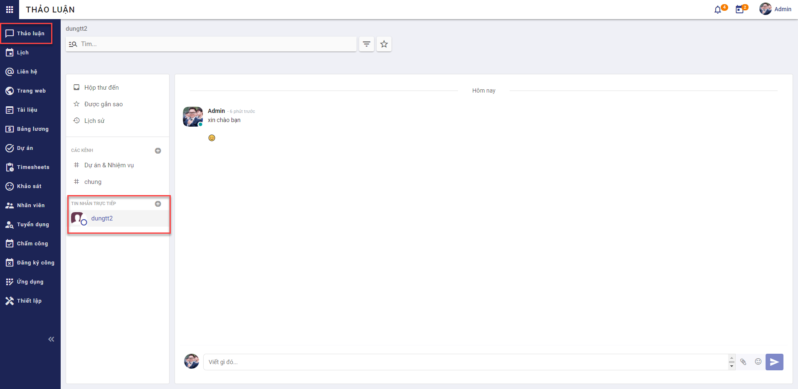

## Thảo luận

### Quy trình nghiệp vụ
Cho phép người dùng quản lý các kênh thảo luận của mình, tham gia thảo luận trong các kênh hoặc thảo luận trực tiếp với người dùng khác

**Quy trình nghiệp vụ**

**Các luồng quy trình**
* Quản lý kênh thảo luận. Chi tiết nghiệp vụ <a href="/" style="font-style: "><u>tại đây</u></a>.
* Gia nhập/Nghỉ gia nhập kênh thảo luận. Chi tiết nghiệp vụ <a href="/" style="font-style: "><u>tại đây</u></a>.
* Tham gia thảo luận. Chi tiết nghiệp vụ <a href="/" style="font-style: "><u>tại đây</u></a>.

[comment]: <> (comment cụm chức năng 1 cho chức năng tại MH Thêm, sửa kênh)
### Quản lý kênh thảo luận

#### Mô tả nghiệp vụ

Khi người sử dụng có nhu cầu quản lý kênh thảo luận thì quy trình thực hiện như sau:

1. Người sử dụng tạo mới kênh thảo luận bao gồm một hoặc nhiều nhóm người dùng, người dùng trong một bộ phận vào kênh để trao đổi, gửi tin nhắn trong kênh thảo luận.

2. Người sử dụng thêm người dùng khác gia nhập các kênh thảo luận công cộng hoặc riêng tư để trao đổi thông tin.

**Luồng chức năng chính**
* Quản lý kênh thảo luận. Chi tiết nghiệp vụ <a href="/" style="font-style: "><u>tại đây</u></a>.

**Video hướng dẫn**

#### Quản lý kênh thảo luận

**Quản lý kênh thảo luận**
* Người dùng tạo kênh thảo luận và thêm các thành viên vào kênh thảo luận.

**Đối tượng thực hiện:** Người sử dụng 

1. Vào phân hệ **Thảo luận/Các kênh**

2. Chọn **Kênh công cộng** (Hoặc thực hiện **Tìm kiếm** trực tiếp chức năng trên ô tìm kiếm chung của hệ thống)

3. Khai báo các thông tin chi tiết của Kênh thảo luận
* Khai báo thông tin về Tên kênh thảo luận
* Khai báo thông tin Mô tả về các chủ đề được thảo luận trong nhóm
* Chọn thông tin Gửi thông điệp bằng email 
    * Cho phép người dùng trong kênh thảo luận gửi thông điệp có định dạng email, bao gồm: chủ đề và nội dung thông điệp
    * Với nội dung này, khi chọn Gửi thông điệp bằng email sẽ yêu cần người dùng Kiểm duyệt kênh hay không 
* Chọn thông tin Kiểm duyệt kênh này
    * Người dùng cần khai báo thêm thông tin Người kiểm duyệt tại tab Điều dộ
    * Lưu ý khi chọn Kiểm duyệt kênh này, thì nội dung trao đổi trong kênh sẽ cần phải được kiểm duyệt bởi Người kiểm duyệt trước khi các thành viên trong kênh thấy nội dung đó
* Khai báo thông tin về Tính riêng tư của kênh thảo luận
    * Chọn tính riêng tư của kênh là Mọi người, Chỉ người được mời hoặc Nhóm người dùng được mời
    * Lưu ý đối với Tính riêng tư là **Mọi người** thì kênh thảo luận sẽ là kênh công khai và tất cả người dùng đều có thể nhìn thấy kênh thảo luận này. Trường hợp Tính riêng tư là **Chỉ người được mời** hoặc **Nhóm người dùng được chọn** thì kênh thảo luận sẽ là kênh thảo luận riêng tư và chỉ người được mời tham gia hoặc người thuộc nhóm người dùng được chọn mới có thể nhìn thấy kênh thảo luận tại màn hình
    * Với trường hợp Tính riêng tư là **Nhóm người dùng được mời**, người sử dụng cần phải khai báo thêm thông tin Nhóm có thẩm quyền
    * Chọn Nhóm đăng ký tự động thành viên của nhóm sẽ tự động được thêm vào danh sách người theo dõi kênh, có thể nhìn thấy kênh thảo luận tại danh sách kênh thảo luận cá nhân
    * Chọn Bộ phận đăng ký tự động các thành viên trong bộ phận sẽ tự động được đăng ký là thành viên của kênh thảo luận
* Khai báo thông tin về Các thành viên của kênh thảo luận
    * Chọn Người nhận sẽ được nhận thông báo về các hoạt động thảo luận trong nhóm từ danh sách người dùng của hệ thống 
    * Thông tin Email tự động lấy tương ứng với người nhận
* Khai báo thông tin Điều độ
    * Chọn Người kiểm duyệt là thành viên nằm trong Nhóm có thẩm quyền đã chọn ở tab Tính riêng tư
    * Lưu ý khi chọn Thông báo tự động, người dùng phải khai báo thêm thông tin Thông báo tin nhắn
    * Lưu ý khi chọn Gửi hướng dẫn cho người đăng ký mới, người dùng phải khai báo thêm thông tin nội dung Hướng dẫn
4.	Nhấn **Lưu**
5. Người dùng thực hiện Lưu trữ Kênh thảo luận

[comment]: <> (comment cụm chức năng 2 cho chức năng Gia nhập/hủy gia nhập ở MH danh sách)
### Gia nhập/Nghỉ gia nhập kênh thảo luận

#### Mô tả nghiệp vụ

Khi người sử dụng có nhu cầu gia nhập/nghỉ gia nhập một kênh thảo luận thì quy trình thực hiện như sau:

1. Người dùng gia nhập các kênh thảo luận công cộng hoặc riêng tư để trao đổi thông tin với một/nhiều nhóm người dùng hoặc một/nhiều bộ phận cụ thể.

2. Người dùng bỏ gia nhập các kênh thảo luận công cộng hoặc riêng tư khi muốn ngừng nhận thông báo hoặc ngừng trao đổi thông tin với một/nhiều nhóm người dùng hoặc một/nhiều bộ phận cụ thể.

**Luồng chức năng chính**
* Gia nhập/Nghỉ gia nhập kênh thảo luận. Chi tiết nghiệp vụ <a href="/" style="font-style: "><u>tại đây</u></a>.

**Video hướng dẫn**

#### Gia nhập/Nghỉ gia nhập kênh thảo luận

**Gia nhập/Nghỉ gia nhập kênh thảo luận**
* Sau khi người dùng gia nhập kênh thảo luận, người dùng có thể tham gia các hoạt động trong kênh như nhắn tin trao đổi, nhận thông báo về các nội dung trao đổi trong kênh. Người dùng sẽ ngừng gia nhập các kênh thảo luận khi không muốn nhận thông báo hay trao đổi thảo luận.

**Đối tượng thực hiện:** Người sử dụng 

1. Vào phân hệ **Thảo luận/Các kênh**

2. Trên **Kênh công cộng**, thực hiện Gia nhập với kênh thảo luận mà người sử dụng chưa là một thành viên của kênh

3. Nếu đang là thành viên của kênh thảo luận và không muốn nhận thông báo hay trao đổi thảo luận trong kênh, người sử dụng có thể thực hiện Nghỉ gia nhập

4. Sau khi Nghỉ gia nhập kênh thảo luận, người sử dụng vẫn có thể Gia nhập lại kênh và thực hiện tham gia thảo luận bình thường

[comment]: <> (comment cụm chức năng 3 cho chức năng trong MH thảo luận)
### Tham gia thảo luận

#### Mô tả nghiệp vụ

Khi người sử dụng có tham gia thảo luận một kênh thảo luận thì quy trình thực hiện như sau:

1. Người dùng nhắn tin trực tiếp trong kênh để trao đổi với công ty, nhóm người, bộ phận hoặc một người dùng cụ thể

2. Người sử dụng có vai trò quản trị trong kênh thực hiện kiểm duyệt tin nhắn được phép hiển thị trong kênh thảo luận hay không.

3. Người sử dụng gắn sao cho tin nhắn/thư điện tử quan trọng và xem lại tin nhắn/thư điện tử mà người dùng gắn sao.

**Luồng chức năng chính**
* Tham gia thảo luận. Chi tiết nghiệp vụ <a href="/" style="font-style: "><u>tại đây</u></a>.
* Trao đổi trực tiếp. Chi tiết nghiệp vụ <a href="/" style="font-style: "><u>tại đây</u></a>.

**Video hướng dẫn**

#### Tham gia thảo luận
* Người dùng là thành viên trong kênh thảo luận sẽ được phép nhắn tin trao đổi trong kênh thảo luận, đánh dấu các tin quan trọng, mời người dùng khác gia nhập kênh thảo luận.
* Quản trị của kênh thảo luận có quyền kiểm duyệt các nội dung trong kênh.
* Xem lại các nội dung quan trọng, nội dung cần phê duyệt, tin nhắn đến, lịch sử hoạt động.

Luồng trước: 
* Người sử dụng phải là người lập kênh thảo luận hoặc là một thành viên thuộc kênh thảo luận
* Kênh thảo luận phải là một kênh được kiểm duyệt thì mới có thể thực hiện thao tác kiểm duyệt
* Người sử dụng phải là một trong số những người kiểm duyệt của kênh mới có thể thực hiện phê duyệt nội dung trao đổi 

Diễn giải các lưu ý: 
* Người sử dụng phải là người lập kênh thảo luận hoặc là một thành viên thuộc kênh thảo luận khi đó người sử dụng mới có thể thực hiện nhắn tin trao đổi trong kênh thảo luận, đánh dấu các tin quan trọng trong kênh.
* Khi kênh thảo luận là một kênh được kiểm duyệt thì sau khi được Người kiểm duyệt phê duyệt, các thành viên mới có thể nhìn thấy nội dung trao đổi trong kênh 

**Tham gia thảo luận**
* Người dùng là thành viên trong kênh thảo luận sẽ được phép nhắn tin trao đổi trong kênh thảo luận, đánh dấu các tin quan trọng. Các nội dung trao đổi phải qua kiểm duyệt của quản trị viên (nếu có).

**Đối tượng thực hiện:** Người sử dụng 

1. Vào phân hệ **Thảo luận**, chọn kênh thảo luận cần trao đổi (Hoặc thực hiện **Tìm kiếm** trực tiếp chức năng trên ô tìm kiếm chung của hệ thống)

2. Người sử dụng khai báo thông tin chủ đề của tin nhắn 
* Chủ đề chỉ được khai báo với kênh thảo luận được phép Gửi thông điệp bằng email
3. Người sử dụng khai báo nội dung tin nhắn để gửi trong kênh thảo luận
* Nội dung tin nhắn có thể tag thành viên bất kỳ trong kênh thảo luận bằng cách thêm "@" vào nội dung và chọn tên thành viên trong kênh được gợi ý, có thể thêm đính kèm hoặc thêm nhãn dán vào nội dung tin nhắn bằng cách chọn **Thêm đính kèm**, **Nhãn dán**
4. Người sử dụng chọn tin nhắn quan trọng cần đánh dấu
5. Với kênh thảo luận càn kiểm duyệt, người dùng là Người kiểm duyệt sẽ chọn Chấp thuận, Từ chối, Hủy, Luôn luôn cho phép hoặc Cấm nội dung đang chờ duyệt
**
<u>Lưu ý:</u>
** 
* Khi chọn **Chấp nhận** tin nhắn của thành viên, tin nhắn được chấp nhận sẽ hiển thị trên kênh thảo luận và các thành viên trong kênh sẽ nhìn thấy tin nhắn này.
* Khi chọn **Từ chối**, Người kiểm duyệt sẽ phải khai báo lý do từ chối tin nhắn của thành viên. Lý do từ chối sẽ được gửi đến thành viên và mọi thành viên trong kênh thảo luận sẽ không nhìn thấy tin nhắn bị từ chối 
* Khi chọn **Hủy**, mọi thành viên trong kênh thảo luận sẽ không nhìn thấy tin nhắn đã bị hủy
* Khi chọn **Luôn luôn cho phép** với tin nhắn đang chờ duyệt của một thành viên bất kỳ, tin nhắn đó của thành viên sẽ được duyệt và các thành viên trong kênh sẽ nhìn thấy nội dung tin nhắn. Những tin nhắn sau đó của thành viên này sẽ trực tiếp hiển thị trên kênh thảo luận mà không cần phải kiểm duyệt
* Khi chọn **Cấm** tin nhắn đang chờ duyệt của một thành viên bất kỳ, tin nhắn đó của thành viên sẽ bị hủy và các thành viên trong kênh sẽ không nhìn thấy nội dung tin nhắn. Những tin nhắn sau đó của thành viên này sẽ không được hiển thị trên kênh thảo luận
6. Người sử dụng nhấn **Gửi** tin nhắn 
7. Người sử dụng **Mời** thêm một hoặc nhiều người dùng chưa phải là thành viên của kênh thảo luận tham gia vào hoạt động trao đổi của kênh
8. Tại phân hệ **Thảo luận**, người sử dụng chọn **Hộp thư đến**. Người dùng sẽ nhìn thấy và xử lý toàn bộ thư điện tử được gửi đến
9. Tại phân hệ **Thảo luận**, người sử dụng chọn **Được gắn sao**. Người dùng sẽ nhìn thấy toàn bộ các tin nhắn/thư điện tử mà người dùng gắn sao tại các kênh thảo luận
10. Tại phân hệ **Thảo luận**, người sử dụng chọn **Lịch sử** để xem lịch sử hoạt động của các người dùng thảo luận trong kênh thảo luận do người dùng tạo ra, hoặc kênh thảo luận mà người dùng là Người kiểm duyệt
11. Tại phân hệ **Thảo luận**, người sử dụng chọn **Kiểm duyệt** để xem và thực hiện phê duyệt các tin nhắn trong các kênh thảo luận mà mà người dùng là Người kiểm duyệt

#### Trao đổi trực tiếp 

**Trao đổi trực tiếp**
* Người dùng có thể nhắn tin trực tiếp cho một người dùng cụ thể.

**Đối tượng thực hiện:** Người sử dụng 

1. Vào phân hệ **Thảo luận/Nhắn tin trực tiếp**

2. Người sử dụng khai báo nội dung tin nhắn để gửi trong Nhắn tin trực tiếp
* Nội dung tin nhắn có thể thêm đính kèm hoặc thêm nhãn dán vào nội dung tin nhắn bằng cách chọn **Thêm đính kèm**, **Nhãn dán**
3. Người sử dụng chọn tin nhắn quan trọng cần đánh dấu
4. Người sử dụng nhấn **Gửi** tin nhắn 