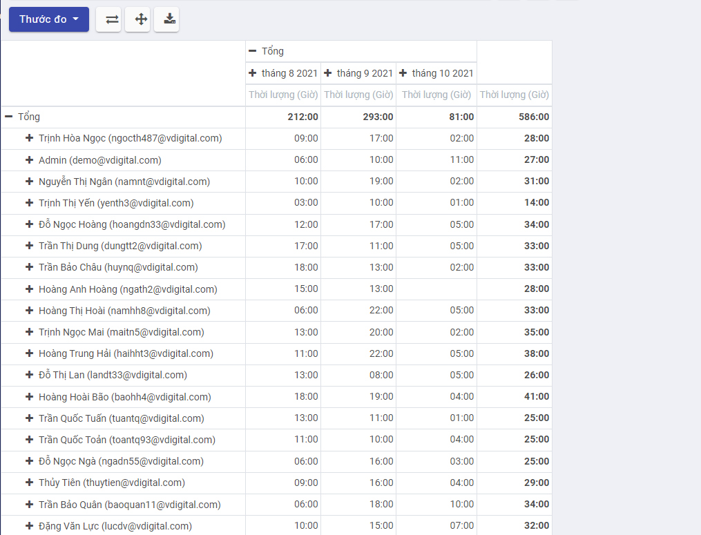
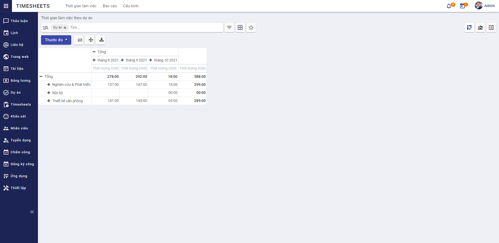

# Quy trình nghiệp vụ
Cho phép người dùng quản lý thực hiện lập vào theo dõi thời gian biểu cá nhân hoặc của nhóm trên từng dự án hoặc nhiệm vụ và theo dõi tất cả các tài nguyên được phân bổ cho dự án.

**Quy trình**

**Các luồng quy trình**

* Quản lý thời gian biểu. Chi tiết nghiệp vụ <u>[tại đây](#quan-ly-thoi-gian-bieu)</u>.

* Báo cáo thời gian biểu. Chi tiết nghiệp vụ <u>[tại đây](#bao-cao-thoi-gian-bieu)</u>.

* Quản lý cấu hình thời gian biểu. Chi tiết nghiệp vụ <u>[tại đây](#quan-ly-cau-hinh-thoi-gian-bieu)</u>.

**Mô tả nghiệp vụ**

Khi người sử dụng muốn quản lý thời gian biểu thì quy trình thực hiện như sau:

1. Tại **Thời gian làm việc**, người sử dụng ghi lại thời gian thực hiện cho từng nhiệm vụ của cá nhân theo ngày tương ứng. 

2. Người sử dụng theo dõi và quản lý danh sách các công việc cá nhân hoặc của người dùng khác trên hệ thống tại **Thời gian làm việc**, **Tất cả thời gian làm việc**.

3. Người sử dụng thực hiện việc báo cáo theo Nhân viên, Dự án hoặc Công việc để quản lý và theo dõi thời gian biểu theo điều kiện được chọn

4. Tại **Cấu hình**, người sử dụng thực hiện cấu hình đơn vị tính thời gian cho thời gian biểu

**Luồng chức năng chính**

* Thời gian biểu của tôi. Chi tiết nghiệp vụ <u>[tại đây](#thoi-gian-bieu-cua-toi)</u>.

* Tất cả thời gian biểu. Chi tiết nghiệp vụ <u>[tại đây](#tat-ca-thoi-gian-bieu)</u>.

* Báo cáo theo nhân viên. Chi tiết nghiệp vụ <u>[tại đây](#bao-cao-theo-nhan-vien)</u>.

* Báo cáo theo dự án. Chi tiết nghiệp vụ <u>[tại đây](#bao-cao-theo-du-an)</u>.

* Báo cáo theo công việc. Chi tiết nghiệp vụ <u>[tại đây](#bao-cao-theo-cong-viec)</u>.

* Quản lý cấu hình thời gian biểu. Chi tiết nghiệp vụ <u>[tại đây](#quan-ly-cau-hinh-thoi-gian-bieu)</u>.

**Video hướng dẫn**

## **Quản lý thời gian biểu**

### **Thời gian biểu của tôi**

Người sử dụng ghi lại thời gian thực hiện cho từng nhiệm vụ của cá nhân theo ngày tương ứng. Sau đó thực hiện theo dõi và quản lý danh sách các công việc cá nhân.

**Đối tượng thực hiện:** Người sử dụng hệ thống

1. Vào chức năng **Timesheets**, chọn **Thời gian làm việc** (Hoặc thực hiện **Tìm kiếm** trực tiếp chức năng trên ô tìm kiếm chung của hệ thống)

    * Với **Thời gian làm việc**, người dùng hệ thống sẽ chỉ nhìn thấy danh sách công việc cá nhân.
    
    * **Ghi chú**: Người dùng có thể quản lý Thời gian biểu tại chức năng **Dự án**, chọn **Dự án/Task**. Chọn **Nhiệm vụ** thuộc dự án, nhấn **Timesheet/Thêm một dòng**
    
2. Khai báo các thông tin chi tiết của **Thời gian làm việc:**

    * Chọn thông tin Dự án
    
        * Danh sách dự án để lựa chọn sẽ được người quản lý thêm ở chức năng Dự án
    * Chọn thông tin Công việc đã tạo trước đó hoặc người dùng có thể tự tạo thêm công việc
    
    * Chọn thông tin Ước tính còn lại là Điều chỉnh tự động, Sử dụng ước tính hiện có, Đặt thành hoặc Giảm bằng
    
        * **Lưu ý** khi chọn Ước tính còn lại là Đặt thành hoặc Giảm bằng, người dùng phải khai báo thêm thông tin Thời gian còn lại
        
        * Với Ước tính còn lại là Điều chỉnh tự động thì Thời gian còn lại của công việc sẽ bằng Thời gian ước lượng để hoàn thành công việc trừ đi Thời gian đã thực hiện
        
        * Với ước tính còn lại là Không đặt ước tính, Thời gian còn lại của công việc giữ nguyên không đổi
        
        * Với Ước tính còn lại là Đặt thành, Thời gian còn lại của công việc sẽ bằng thời gian được khai báo tại Thời gian còn lại
        
        * Với Ước tính còn lại là Giảm bằng, Thời gian còn lại sẽ bằng thông tin khai báo tại Thời gian còn lại trừ đi Thời gian đã thực hiện 
        

3. Nhấn **Lưu**

4. Người sử dụng thực hiện **Xuất** toàn bộ danh sách hoặc một số thời gian biểu cá nhân cần thiết để theo dõi

### **Tất cả thời gian biểu**

Người sử dụng thực hiện theo dõi và quản lý danh sách tất cả thời gian biểu của người dùng trên hệ thống.

**Đối tượng thực hiện:** Người sử dụng là Quản trị hệ thống hoặc Quản lý

1. Vào chức năng **Timesheets**, chọn **Tất cả thời gian làm việc** (Hoặc thực hiện **Tìm kiếm** trực tiếp chức năng trên ô tìm kiếm chung của hệ thống)

    * Khi người dùng đăng nhập là Quản trị hệ thống, người dùng sẽ nhìn thấy toàn bộ danh sách thời gian biểu của toàn bộ người dùng trong hệ thống. Trường hợp người dùng đăng nhập là Quản lý sẽ chỉ nhìn thấy danh sách thời gian biểu của những người dùng thuộc quyền quản lý.
    
2. Quản trị hệ thống hoặc Quản lý khai báo các thông tin chi tiết cần thay đổi của **Tất cả thời gian làm việc:**

* Chọn thông tin Ước tính còn lại là Điều chỉnh tự động, Sử dụng ước tính hiện có, Đặt thành hoặc Giảm bằng

    * **Lưu ý** khi chọn Ước tính còn lại là Đặt thành hoặc Giảm bằng, người dùng phải khai báo thêm thông tin Thời gian còn lại
    
    * Với Ước tính còn lại là Điều chỉnh tự động thì Thời gian còn lại của công việc sẽ bằng Thời gian ước lượng để hoàn thành công việc trừ đi Thời gian đã thực hiện
    
    * Với ước tính còn lại là Không đặt ước tính, Thời gian còn lại của công việc giữ nguyên không đổi
    
    * Với Ước tính còn lại là Đặt thành, Thời gian còn lại của công việc sẽ bằng thời gian được khai báo tại Thời gian còn lại
    
    * Với Ước tính còn lại là Giảm bằng, Thời gian còn lại sẽ bằng thông tin khai báo tại Thời gian còn lại trừ đi Thời gian đã thực hiện 
    
3. Nhấn **Lưu**

4. Quản trị hệ thống hoặc Quản lý thực hiện **Xuất** toàn bộ danh sách hoặc một số thời gian biểu cần thiết để theo dõi

## **Báo cáo thời gian biểu**

### **Báo cáo theo nhân viên**

Người sử dụng thực hiện Báo cáo theo nhân viên để quản lý và theo dõi hiệu suất làm việc của nhân viên trong từng tháng 

**Đối tượng thực hiện:** Người sử dụng là Quản trị hệ thống hoặc Quản lý

1. Vào chức năng **Timesheets**, chọn **Báo cáo theo nhân viên** (Hoặc thực hiện **Tìm kiếm** trực tiếp chức năng trên ô tìm kiếm chung của hệ thống)

2. Người dùng thực hiện thay đổi dữ liệu cần thống kê theo nhu cầu (nếu có)

    * Chọn **- Tổng** để loại bỏ điều kiện thống kê hiện tại theo hàng hoặc cột
    
    
    
    * Chọn **+ Tổng** để tạo mới điều kiện thống kê báo cáo theo hàng hoặc cột
    
    
    
3. Người dùng chọn **View graph** để xem báo cáo dưới dạng biểu đồ

4. Thực hiện **Xuất toàn bộ** báo cáo theo nhân viên

### **Báo cáo theo dự án**

Người sử dụng thực hiện Báo cáo theo dự án để quản lý và theo dõi hiệu suất, thời gian sử dụng để thực hiện dự án

**Đối tượng thực hiện:** Người sử dụng là Quản trị hệ thống hoặc Quản lý

1. Vào chức năng **Timesheets**, chọn **Báo cáo theo dự án** (Hoặc thực hiện **Tìm kiếm** trực tiếp chức năng trên ô tìm kiếm chung của hệ thống)

2. Người dùng thực hiện thay đổi dữ liệu cần thống kê theo nhu cầu (nếu có)

    * Chọn **- Tổng** để loại bỏ điều kiện thống kê hiện tại theo hàng hoặc cột
    
    
    
    * Chọn **+ Tổng** để tạo mới điều kiện thống kê báo cáo theo hàng hoặc cột
    
    

3. Người dùng chọn **View graph** để xem báo cáo dưới dạng biểu đồ

4. Thực hiện **Xuất toàn bộ** báo cáo theo dự án

### **Báo cáo theo công việc**

Người sử dụng thực hiện Báo cáo theo công việc để quản lý và theo dõi hiệu suất, thời gian sử dụng để thực hiện công việc

**Đối tượng thực hiện:** Người sử dụng là Quản trị hệ thống hoặc Quản lý

1. Vào chức năng **Timesheets**, chọn **Báo cáo theo công việc** (Hoặc thực hiện **Tìm kiếm** trực tiếp chức năng trên ô tìm kiếm chung của hệ thống)

2. Người dùng thực hiện thay đổi dữ liệu cần thống kê theo nhu cầu (nếu có)

    * Chọn **- Tổng** để loại bỏ điều kiện thống kê hiện tại theo hàng hoặc cột
    
    
    
    * Chọn **+ Tổng** để tạo mới điều kiện thống kê báo cáo theo hàng hoặc cột
    
    

3. Người dùng chọn **View graph** để xem báo cáo dưới dạng biểu đồ

4. Thực hiện **Xuất toàn bộ** báo cáo theo công việc

## **Quản lý cấu hình thời gian biểu**

Người sử dụng thực hiện **Cấu hình** đơn vị tính thời gian cho thời gian biểu là Giờ hoặc Ngày 

Luồng sau: Sau khi lưu cấu hình đơn vị tính, đơn vị được cấu hình sẽ hiển thị tại **Thời gian làm việc**, **Tất cả thời gian làm việc** và **Báo cáo**

**Đối tượng thực hiện:** Người sử dụng là Quản trị hệ thống

1. Vào chức năng **Timesheets**, chọn **Cấu hình** (Hoặc thực hiện **Tìm kiếm** trực tiếp chức năng trên ô tìm kiếm chung của hệ thống)

2. Chọn Đơn vị tính là Ngày hoặc Giờ

    * Mặc định Thời lượng sẽ có Đơn vị tính là Giờ
    
    * Với đơn vị tính là Giờ, tại **Thời gian làm việc**, **Tất cả thời gian làm việc** và **Báo cáo** hiển thị Thời lượng theo đơn vị là Giờ 
    
    * Với đơn vị tính là Ngày, tại **Thời gian làm việc**, **Tất cả thời gian làm việc** và **Báo cáo** hiển thị Thời lượng theo đơn vị là Ngày. Khi đó Thời lượng (Ngày) sẽ bằng Thời lượng (Giờ)/24
    
3. Nhấn **Lưu** để lưu thông tin cấu hình

