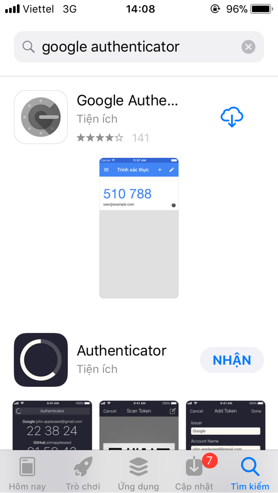
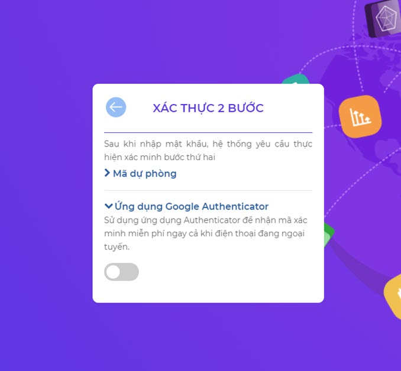

# Tổng quan

**Xác thực 2 bước là gì??**

**Xác thực 2 bước**: 2FA (2-factor authentication) là một phương thức bảo mật tài khoản, tăng tầng xác thực khi thực hiện đăng nhập. Thông thường người dùng chỉ cần nhập tên đăng nhập và mật khẩu để đăng nhập, nhưng với xác thực 2 bước sau khi điền đúng thông tin đăng nhập, người dùng thực hiện thêm thao tác để vượt qua lớp bảo mật thứ 2 thì mới có thể đăng nhập thành công hoàn toàn hệ thống.

Có 3 hình thức 2FA thường được sử dụng đăng nhập tài khoản gồm:

- Mã dài hạn người dùng đã có (chẳng hạn như mã PIN, mật khẩu hay một mẫu pattern)
- Mã ngắn hạn sau khi đăng nhập mới được gửi tới người dùng (chẳng hạn như mã ngẫu nhiên gửi đến qua SMS, ứng dụng điện thoại,..)
- Các đặc điểm sinh trắc học (dấu vân tay, giọng nói, đồng tử mắt,…)

Với hệ thống SSO sử dụng xác thực 2 bước bằng cách sau khi người dùng điền đúng thông tin đăng nhập thì cung cấp cho người dùng mã xác thực ngắn hạn dự phòng hoặc qua ứng dụng Google Authentication để người dùng vượt qua lớp bảo mật an toàn thứ 2.

**Tại sao người dùng nên dùng bảo mật 2 lớp?**

Xác minh 2 bước là cách tốt nhất để bảo vệ người dùng khỏi những kẻ có ý đồ xấu, ngay cả khi những kẻ đó có thông tin đăng nhập chính xác của người dùng.

Việc bảo mật cho tài khoản càng quan trọng hơn khi hiện nay các dịch vụ trên mạng liên kết với nhau rất chặt chẽ. Ví dụ như bạn hoàn toàn có thể lấy được mật khẩu Facebook của một người nào đó nếu biết tài khoản Gmail của họ, hoặc có thể dễ dàng tháo iCloud ra khỏi iPhone nếu tài khoản iCloud đó đang được đăng nhập trong ứng dụng mail trên iPhone đó,vv..vv.. Chưa kể chúng ta thường dùng Gmail làm email khôi phục cho những dịch vụ khác.

Bước bảo mật lần hai sẽ khiến các hacker sẽ không thể giả mạo người dùng truy cập trái phép. Chính vì vậy mà các bước xác nhận lần hai ngày càng trở nên quan trọng hơn, và ngày càng có nhiều hệ thống sử dụng bảo mật 2 lớp, nhất là cho người dùng làm việc ở xa, qua các hệ thống đám mây.

# Quy trình nghiệp vụ

**Quy trình**

**Các luồng quy trình**

* Đăng nhập vào hệ thống. Chi tiết nghiệp vụ <u>[tại đây](#cach-kich-hoat-ang-nhap-2-buoc)</u>.
* Kích hoạt xác thực 2 bước.Chi tiết nghiệp vụ <u>[tại đây](#cach-kich-hoat-ang-nhap-2-buoc)</u>.
* Đăng nhập sau khi bật xác thực 2 bước.Chi tiết nghiệp vụ <u>[tại đây](#5-huong-dan-ang-nhap-sau-khi-kich-hoat-xac-thuc-2-lan)</u>.

**Mô tả nghiệp vụ**

1. Người dùng thực hiện đăng nhập vào hệ thống.

2. Người dùng chọn chức năng Xác thực 2 bước.

3. Bật phương thức lấy mã xác thực 2 bước: Mã dự phòng hoặc Ứng dụng Google Authenticator. 

4. Thực hiện đăng nhập sau khi xác thực 2 bước.

**Luồng chức năng chính**

* Kích hoạt đăng nhập 2 bước. Chi tiết nghiệp vụ <u>[tại đây](#kich-hoat-ang-nhap-2-buoc)</u>.

* Lấy mã dự phòng. Chi tiết nghiệp vụ <u>[tại đây](#huong-dan-lay-ma-du-phong)</u>.

* Cài đặt và lấy mã ứng dụng Google Authenticator. Chi tiết nghiệp vụ <u>[tại đây](#huong-dan-cai-at-va-lay-ma-ung-dung-google-authenticator)</u>.

* Đăng nhập sau khi kích hoạt Xác thực 2 bước. Chi tiết nghiệp vụ <u>[tại đây](#huong-dan-ang-nhap-sau-khi-kich-hoat-xac-thuc-2-buoc)</u>.

* Tắt xác thực 2 bước. Chi tiết nghiệp vụ <u>[tại đây](#huong-dan-tat-xac-thuc-2-buoc)</u>.

**Video hướng dẫn**

## **Xác thực 2 bước**

### **Kích hoạt đăng nhập 2 bước**

**Bước 1**: Tại màn hình đăng nhập, người dùng điền đúng và đủ thông tin Tài khoản, Mật khẩu, Domain công ty.

**Bước 2**: Nhấn **Đăng nhập**. 

**Bước 3**: Chọn **Xác thực 2 bước**

    
**Bước 4**: Nhấn chọn **TIẾP THEO**

**Bước 5**: Nhập lại mật khẩu để xác minh, nhấn chọn nút ***ĐĂNG NHẬP***

**Bước 6**: Bật phương thức lấy mã xác thực bất kì, sau khi bật cũng tương ứng với việc người dùng kích hoạt đăng nhập 2 bước thành công.

Có 2 phương thức để lấy mã xác thực:

- Mã dự phòng.

- Ứng dụng Google Authenticator

Sau khi lấy mã xác thực thành công, người dùng có thể sử dụng mã xác thực đó cho lần đăng nhập sau theo phương thức xác thực 2 bước.

Chi tiết xem thêm ở mục [Hướng dẫn đăng nhập sau khi kích hoạt Xác thực 2 lần](#huong-dan-ang-nhap-sau-khi-kich-hoat-xac-thuc-2-lan)

### **Hướng dẫn lấy mã dự phòng**

Với Xác thực 2 bước theo Mã dự phòng, người dùng lấy và sử dụng theo trình tự sau.

**Bước 1**: Từ màn hình Xác thực 2 bước, nhấn **Mã dự phòng**

**Bước 2**: Kéo toogle sang bên phải để bật phương thức theo mã dự phòng

**Bước 3**: Hệ thống hiển thị 5 mã dự phòng cho người dùng, người dùng ghi nhớ 5 mã này. Như vậy, Mã xác thực dự phòng được lấy thành công.

Vào lần đăng nhập tiếp theo, người dùng sẽ đăng nhập bằng phương thức xác nhận 2 lần với mã xác thực dự phòng đã lấy được.

Chi tiết xem thêm ở mục [Hướng dẫn đăng nhập sau khi kích hoạt Xác thực 2 lần](#huong-dan-ang-nhap-sau-khi-kich-hoat-xac-thuc-2-lan)

### **Hướng dẫn cài đặt và lấy mã ứng dụng Google Authenticator**

Với Xác thực 2 bước theo ứng dụng Google Authenticator, người dùng cần cài đặt ứng dụng Google Authenticator, lấy mã xác thực và sử dụng theo trình tự dưới đây.

**Cài đặt ứng dụng Google Authenticator trên thiết bị thông minh**: 

Trên thiết bị thông minh (Smart phone, iphone, ipad,...), cài đặt ứng dụng Google Authenticator. 

- Đối với thiết bị Hệ điều hành IOS: Vào App Store, tìm kiếm với từ khóa Google Authenticator và tải ứng dụng Google Authenticator về máy.

- Đối với thiết bị Hệ điều hành Android: Vào Google Play, tương tự tìm kiếm với từ khóa Google Authenticator và tải ứng dụng  Google Authenticator về máy

    Biểu tượng của ứng dụng như sau:

    

    Sau đó cài đặt cho phép ứng dụng kết nối với máy ảnh của thiết bị để có thể quét mã QR code.

**Lấy mã xác thực, đăng nhập hệ thống**

**Bước 1**: Từ màn hình Xác thực 2 bước, nhấn chọn **Ứng dụng Google Authenticator**

**Bước 2**: Kéo toogle sang bên phải để bật phương thức theo Ứng dụng Google Authenticator

**Bước 3**: Hệ thống hiển thị Mã QR code, mã code thủ công

Với ứng dụng Google Authenticator, có 2 cách để lấy mã Xác nhận

- Quét mã QR code

- Nhập khóa thiết lập

**Bước 4**: Mở ứng dụng Google Authenticator nhấn **Bắt đầu**

**Bước 5**: Tại đây có 2 lựa chọn cho người dùng để lấy mã, từng lựa chọn được hướng dẫn thực hiện lần lượt như sau:

<u>*Cách 1*</u>: Lấy mã Xác nhận bằng cách quét mã QR code

***Bước 5.1***: Tại màn hình lựa chọn cách xác nhận, nhấn Quét mã QR. Để thực hiện, đảm bảo máy ảnh của thiết bị sử dụng tốt.

**Bước 5.2:** Dùng phần mềm Google Authenticator trên thiết bị thông minh để quét mã QR hiển thị trên màn hình hệ thống SSO. 

<u>*Cách 2*</u>: Lấy mã xác nhận bằng cách nhập mã Googe Authenticator thủ công

**Bước 5.1**:Tại màn hình lựa chọn cách xác nhận, Nhấn ***Nhập khóa thiết bị***

**Bước 5.2:** Dùng phần mềm Google Authenticator trên thiết bị thông minh để nhập mã thủ công (ngay dưới mã QR code hiển thị trên màn hình hệ thống SSO), nhập thông tin đầy đủ, nhấn nút ***Thêm***. 

Sau khi thực hiện 1 trong 2 cách lấy mã xác thực. Ngay sau đó, trên thiết bị thông minh hiển thị 1 mã số

**Bước 6**: Người dùng nhập mã số ứng dụng vừa hiển thị vào ô phía dưới mã QR code

**Bước 7**:  Nhấn **XÁC THỰC MÃ**. 

**Bước 8**: Ngay sau đó trên thiết bị thông minh hiển thị một dãy số khác, đó chính là mã xác nhận bảo mật lần 2 qua phương thức ứng dụng Google Authenticator. Lần đăng nhập sau, người dùng điền mã xác thực đó để có thể đăng nhập thành công.

Vào lần đăng nhập tiếp theo, người dùng sẽ đăng nhập bằng phương thức xác nhận 2 lần với mã xác thực đã lấy được.

Chi tiết xem thêm ở mục [Hướng dẫn đăng nhập sau khi kích hoạt Xác thực 2 lần](#huong-dan-ang-nhap-sau-khi-kich-hoat-xac-thuc-2-lan)

### **Hướng dẫn đăng nhập sau khi kích hoạt Xác thực 2 bước**

**Bước 1**: Tại màn hình đăng nhập, người dùng điền đúng và đủ thông tin Tài khoản, Mật khẩu, Domain công ty.

**Bước 2**: Nhấn **Đăng nhập**. 

**Bước 3:** Người dùng điền mã xác thực lấy được theo các phương thức đã kích hoạt bên trên (Mã dự phòng hoặc Ứng dụng Google Authenticator)

**Bước 4**: Nhấn **ĐĂNG NHẬP**

Như vậy, người dùng đã Đăng nhập thành công và có thể sử dụng hệ thống.

> *<u>Chú ý</u>*: Mỗi lần kích hoạt lấy mã xác thực, ứng dụng cấp cho người dùng 1 mã xác thực trong khoảng thời gian quy định. Khi người dùng đăng nhập, sử dụng mã xác nhận hiện thời trên ứng dụng để đăng nhập hệ thống.

### **Hướng dẫn tắt Xác thực 2 bước**
**Bước 1**: Tại màn hình đăng nhập, người dùng điền đúng và đủ thông tin Tài khoản, Mật khẩu, Domain công ty.

**Bước 2**: Nhấn **Đăng nhập**. 

**Bước 3**: Chọn **Xác thực 2 bước**

**Bước 4**: Nhấn chọn **TIẾP THEO**

**Bước 5**: Nhập lại mật khẩu để xác minh. 

**Bước 6**: Nhấn chọn **ĐĂNG NHẬP**

**Bước 7**: Kéo toogle sang bên trái của option tương ứng để tắt xác thực 2 bước

