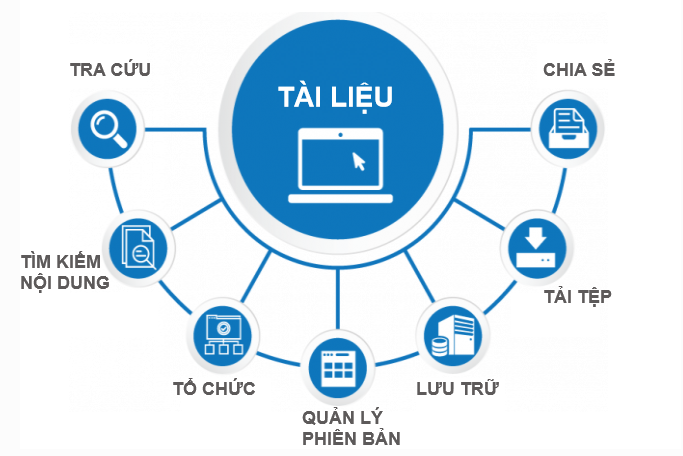
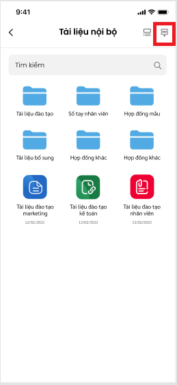
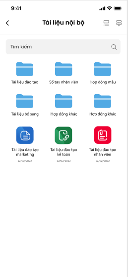
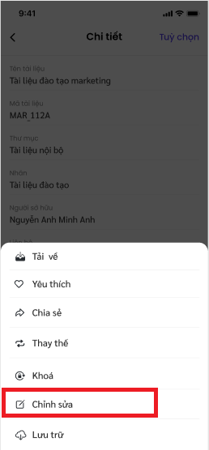

# Quy trình nghiệp vụ

Chức năng **Quản lý tài liệu** hỗ trợ người dùng có thể tạo và dễ dàng xem các tài liệu được chia sẻ từ người dùng khác ngay trên ứng dụng điện thoại vESS. Giúp doanh nghiệp, cá nhân lưu trữ tài liệu trong suốt quá trình phát triển doanh nghiệp.

## Quy trình

## Các luồng chính
  * Thêm mới tài liệu. Chi tiết nghiệp vụ tại <u>[tai đây](#them-moi-tai-lieu)</u>
  * Xem chi tiết tài liệu. Chi tiết nghiệp vụ tại <u>[tai đây](#xem-chi-tiet-tai-lieu)</u>
  * Chỉnh sửa tài liệu. Chi tiết nghiệp vụ tại <u>[tai đây](#chinh-sua-tai-lieu)</u>
  * Chia sẻ tài liệu. Chi tiết nghiệp vụ tại <u>[tai đây](#chia-se-tai-lieu)</u>
  * Thay thế tài liệu. Chi tiết nghiệp vụ tại <u>[tai đây](#Thay-the-tai-lieu)</u>
  * Khóa/mở khóa tài liệu. Chi tiết nghiệp vụ <u>[tai đây](#khoa-mo-khoa-tai-lieu)</u>
  * Yêu thích/bỏ yêu thích tài liệu. Chi tiết nghiệp vụ tại <u>[tai đây](#yeu-thic-bo-yeu-thich-tai-lieu)</u>
  * Lưu trữ tài liệu. Chi tiết nghiệp vụ tại <u>[tai đây](#luu-tru-tai-lieu)</u>

## Xem danh sách tài liệu

Người dùng thực hiện xem tài liệu

**Đối tượng thực hiện:** Người dùng có quyền sử dụng phân hệ **Tài liệu**

1. Người dùng truy cập vào ứng dụng vESS, chọn phân hệ **Tài liệu**. Lúc này giao diện đang hiển thị tại trang **Home**

2. Người dùng chọn loại danh sách tài liệu muốn xem tại bảng danh sách.

*Ghi chú: Người dùng muốn xem tất cả danh sách tài liệu gần đây, chọn   giao diện sẽ hiển thị **Danh sách tài liệu gần đây.*** 

## Xem danh sách thư mục

Người dùng thực hiện xem các thư mục mà mình đã tạo hoặc có quyền truy cập. 

**Đối tượng thực hiện:** Người dùng có quyền sử dụng phân hệ **Tài liệu**. Người dùng có quyền truy cập thư mục. 

1. Người dùng truy cập vào ứng dụng, chọn phân hệ **Tài liệu.**

2. Người dùng truy cập trang **Thư mục**

3. Hệ thống hiển thị các thư mục mà người dùng được cấp quyền xem/truy cập. 

### Sắp xếp hiển thị tài liệu

Người dùng sắp xếp cách hiển các thư mục, tài liệu để dễ dàng xem thông tài liệu. 

**Đối tượng thực hiện:** Người dùng có quyền sử dụng phân hệ **Tài liệu**. Người dùng có quyền truy cập thư mục. 

1.  Người dùng truy cập vào ứng dụng, chọn phân hệ **Tài liệu** -> **Danh sách thư mục con của thư mục cha**

2. Tại danh sách tương ứng, Người dùng chọn 

3. Người dùng chọn loại sắp xếp mà mình mong muốn
- Theo ngày tạo
- Theo tên
- Theo loại tài liệu

### Tìm kiếm tài liệu

Người dùng thực hiện tìm kiếm tài liệu theo tên hoặc mã tài liệu. 

**Đối tượng thực hiện:** Người dùng có quyền sử dụng phân hệ **Tài liệu** 

1. Người dùng chọn vào ô tìm kiếm để mở giao diện tìm kiếm 

2. Người dùng nhập từ khoá tìm kiếm theo tên tài liệu hoặc mã tài liệu

3. Người dùng chọn  **OK**  để thực hiện việc tìm kiếm. Sau khi hệ thống hiển thị danh sách tài liệu liên quan đến từ khoá, người dùng chọn vào tên tài liệu cần tìm để đến màn hình xem chi tiết.

 *Để xóa ký tự đã nhập, người dùng chọn **(X)*** 

*Để đóng giao diện tìm kiếm, người dùng chọn **(Huỷ)***

### Xem danh sách thư mục con của thư mục cha

 Người dùng xem danh sách các thư mục con, tài liệu thuộc thư mục cha

 **Đối tượng thực hiện:** Người dùng có quyền sử dụng phân hệ **Tài liệu**. Người dùng có quyền truy cập thư mục. 

1. Người dùng truy cập vào ứng dụng, chọn phân hệ **Tài liệu.**

2. Người dùng truy cập trang **Thư mục**

3. Tại danh sách thư mục, người dùng chọn thư mục mà mình muốn xem.

4. Giao diện hiển thị danh sách các thư mục con, tài liệu con của thư mục cha

## Thêm mới tài liệu 

### Thêm mới tài liệu đính kèm
Người dùng tạo mới tài liệu loại đính kèm

**Đối tượng thực hiện:** Người dùng có quyền sử dụng phân hệ **Tài liệu**. 

1. Người dùng chọn   tại màn hình trang chủ **Tài liệu**

2. Khi ứng dụng mở ra giao diện thêm mới, tại vùng **Thông tin khác** chọn loại T**ài liệu đính kèm** 

3.  Nhập thông tin tên tài liệu (bắt buộc)

4.  Nhập thông tin mã tài liệu (bắt buộc)

5. Chọn thư mục chứa tài liệu (bắt buộc)

6.  Chọn nhãn dán cho tài liệu (nếu có)

7. Chọn Người sở hữu tài liệu, nếu không mặc định sẽ là người dùng đang tạo tài liệu

8.  Chọn Liên hệ

9. Chọn Ngày ban hành, Ngày hiệu lực và Ngày hết hiệu lực

10.  Nhập mô tả cho tài liệu nếu có

11. Tải ảnh đại diện cho tài liệu nếu có

12. Tải tệp đính kèm (bắt buộc)

13. Tải tệp phụ lục nếu có

14. Người dùng chọn Thêm để lưu lại thông tin tài liệu vừa tạo

### Thêm mới tài liệu văn bản

Người dùng thêm mới tài liệu loại văn bản

**Đối tượng thực hiện:** Người dùng có quyền sử dụng phân hệ **Tài liệu**. Người dùng có quyền truy cập thư mục. 

1. NSD chọn  tại màn hình trang chủ *Tài liệu*

2.  Khi ứng dụng mở ra giao diện thêm mới, tại vùng **Thông tin khác** chọn loại **Tài liệu văn bản** 

3.  Nhập thông tin tên tài liệu (bắt buộc)

4. Nhập thông tin mã tài liệu (bắt buộc)

5. Chọn thư mục chứa tài liệu (bắt buộc)

6. Chọn nhãn dán cho tài liệu (nếu có)

7.  Chọn Người sở hữu tài liệu, nếu không mặc định sẽ là người dùng đang tạo tài liệu

8. Chọn Liên hệ

9. Chọn Ngày ban hành, Ngày hiệu lực và Ngày hết hiệu lực

10.  Nhập mô tả cho tài liệu (bắt buộc)

11. Tải ảnh đại diện cho tài liệu (nếu có)

12. Người dùng chọn **Thêm** để lưu lại thông tin tài liệu vừa tạo

### Thêm mới tài liệu liên kết

Người dùng thêm mới tài liệu loại liên kết

**Đối tượng thực hiện:** Người dùng có quyền sử dụng phân hệ **Tài liệu**. Người dùng có quyền truy cập thư mục. 

1. Người dùng chọn  tại màn hình trang chủ **Tài liệu**

2. Khi ứng dụng mở ra giao diện thêm mới, tại vùng **Thông tin khác** chọn loại **Tài liệu liên kết** 

3.  Nhập thông tin tên tài liệu (bắt buộc)

4. Nhập thông tin mã tài liệu (bắt buộc)

5. Chọn thư mục chứa tài liệu (bắt buộc)

6. Chọn nhãn dán cho tài liệu (nếu có)

7. Chọn Người sở hữu tài liệu, nếu không mặc định sẽ là người dùng đang tạo tài liệu

8. Chọn Liên hệ

9. Chọn Ngày ban hành, Ngày hiệu lực và Ngày hết hiệu lực

10. Nhập URL cần đúng định dạng

11. Nhập mô tả cho tài liệu nếu có

12. Tải ảnh đại diện cho tài liệu (nếu có)

13. Người dùng chọn **Thêm** để lưu lại thông tin tài liệu vừa tạo

## Xem chi tiết tài liệu

Người dùng xem chi tiết tài liệu

**Đối tượng thực hiện:** Người dùng có quyền sử dụng phân hệ **Tài liệu**. Người dùng có quyền truy cập thư mục. 

1. Người dùng truy cập danh sách tài liệu/ danh sách thư mục/ danh sách tài liệu con của thư mục cha

2. Người dùng chọn tại vùng tài liệu muốn xem chi tiết.

## Chỉnh sửa tài liệu
Người dùng chỉnh sửa các nội dung của tài liệu 

**Đối tượng thực hiện:** Người dùng có quyền sử dụng phân hệ **Tài liệu**. Người dùng có quyền sửa tài liệu 

1. Người dùng truy cập danh sách tài liệu, danh sách thư mục- tài liệu con của thư mục cha

2. Người dùng chọn tại vùng tài liệu để xem chi tiết

3. Tại chi tiết tài liệu, người dùng chọn **“Tùy chọn”** 

4. Tại giao diện hiển thị, Người dùng chọn  để thực hiện chỉnh sửa tài liệu 

5. Tại giao diện chỉnh sửa tài liệu, người dùng thay đổi thông tin rồi chọn **“Lưu”** để lưu thông tin chỉnh sửa. Để hủy quá trình sửa thông tin tài liệu, người dùng chọn  

## Chia sẻ tài liệu

Người dùng chia sẻ tài liệu cho người dùng khác. 

**Đối tượng thực hiện:** Người dùng có quyền sử dụng phân hệ **Tài liệu**. Người dùng có quyền chia sẻ tài liệu

1. Người dùng truy cập danh sách tài liệu, danh sách thư mục- tài liệu con của thư mục cha

2. Người dùng chọn tại vùng tài liệu muốn chia sẻ để hiển thị chi tiết tài liệu

3. Tại chi tiết tài liệu, người dùng chọn **“Tùy chọn”** 

4. Tại giao diện hiển thị, người dùng chọn  

5. Tại giao diện chia sẻ tài liệu, người dùng chọn ngày hết hiệu lực chia sẻ và chọn người nhận chia sẻ. Sau đó chọn  **“Xong”** để lưu lại quá trình chia sẻ tài liệu. Để hủy quá trình chia sẻ  tài liệu, người dùng chọn  

## Thay thế tài liệu

Người dùng thay thế tài liệu cho một tài liệu đã tạo trước đó, tài liệu sắp hết hiệu lực hoặc tài liệu cần thay thế phiên bản cao hơn. 

**Đối tượng thực hiện:** Người dùng có quyền sử dụng phân hệ **Tài liệu**. Áp dụng thay thế cho loại tài liệu là **Văn bản** và **Tệp đính kèm**

1. Người dùng truy cập danh sách tài liệu, danh sách thư mục- tài liệu con của thư mục cha

2. Người dùng chọn tại một vùng của tài liệu cần thay thế để hiển thị giao diện xem chi tiết

3. Tại chi tiết tài liệu, người dùng chọn **“Tùy chọn”** 

4. Tại giao diện tùy chọn, người dùng chọn  để thực hiện **Thay thế tài liệu** 

5. Tại giao diện thay thế tài liệu, người dùng nhập thông tin của tài liệu mới, sau đó chọn **“Lưu”** để lưu lại quá trình thay thế tài liệu. Để hủy quá trình thay thế tài liệu, người dùng chọn  

## Mở/Khóa tài liệu

Người dùng thực hiện thao tác khóa/mở khóa tài liệu

**Đối tượng thực hiện:** Người dùng có quyền sử dụng phân hệ **Tài liệu**. Người dùng có quyền mở/khóa tài liệu

1. Người dùng truy cập danh sách tài liệu, danh sách thư mục- tài liệu con của thư mục cha

2. Người dùng chọn tại vùng tài liệu muốn khóa/mở khóa để hiển thị chi tiết tài liệu

3. Tại chi tiết tài liệu, người dùng chọn **“Tùy chọn”** (tương tự các thao tác trên)

4.  Tại giao diện  tùy chọn, người dùng  để thực hiện Khóa tài liệu.

*Nếu tài liệu đang ở trạng thái đang khóa và người dùng muốn mở khóa tài liệu thì NSD chọn  để mở khóa tài liêu.*

## Yêu thích/Bỏ yêu thích tài liệu

Người dùng thực hiện thao tác yêu thích/bỏ yêu thích tài liệu. 

**Đối tượng thực hiện:** Người dùng có quyền sử dụng phân hệ **Tài liệu**.

1. Người dùng truy cập danh sách tài liệu, danh sách thư mục- tài liệu con của thư mục cha

2. Người dùng chọn tại vùng tài liệu để hiển thị chi tiết tài liệu 

3. Tại chi tiết tài liệu, người dùng chọn **“Tùy chọn”** (tương tự các thao tác trên)

4. Người dùng chọn  để thực hiện yêu thích tài liệu.

*Nếu tài liệu đang ở trạng thái yêu thích và người dùng muốn bỏ yêu thích tài liệu thì người dùng chọn   để bỏ yêu thích.* 

## Lưu trữ tài liệu

Người dùng thực hiện thao tác lưu trữ tài liệu. 

**Đối tượng thực hiện:** Người dùng có quyền sử dụng phân hệ **Tài liệu**.

1.  Người dùng truy cập danh sách tài liệu, danh sách thư mục- tài liệu con của thư mục cha

2.  NSD chọn tại vùng tài liệu để hiển thị giao diện chi tiết tài liệu

3. Tại chi tiết tài liệu, người dùng chọn **“Tùy chọn”** (tương tự các thao tác trên)

4. Tại giao diện tùy chọn, người dùng chọn  để thực hiện lưu trũ tài liệu. Lúc này tài liệu sẽ được chuyển sang **Danh sách tài liệu lưu trữ**
Để hủy lưu trữ tài liệu, xem chi tiết tại  <u>[tai đây](#Danh-sach-tai-lieu-luu-tru)</u>

### Danh sách tài liệu lưu trữ

Người dùng xem được danh sách các tài liệu đã được đánh dấu lưu trữ trước đó và các tài liệu đã hết hiệu lực được tự động chuyển vào danh sách này. 

**Đối tượng thực hiện:** Người dùng có quyền sử dụng phân hệ **Tài liệu**.

1. Người dùng truy cập vào ứng dụng , phân hệ **Tài liệu**

2. Người dùng chọn trang **"Thư mục"**

3. Người dùng có thể thực hiện tìm kiếm tài liệu theo tên/mã tài liệu tại ô tìm kiếm 

4. Người dùng chọn vào vùng thông tin tên tài liệu để mở xem chi tiết thông tin tài liệu. 

*Để hủy lưu trữ tài liệu, Tại giao diện chi tiết tài liệu lưu trữ, NSD chọn **"Tùy chọn"**. Lúc này tại giao diện hiển thị, người dùng chọn  để hủy lưu trữ tài liệu*

