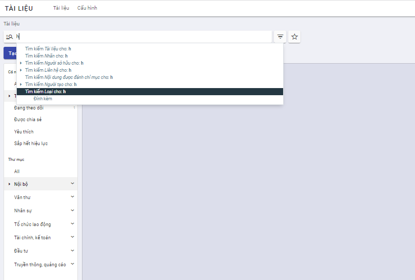
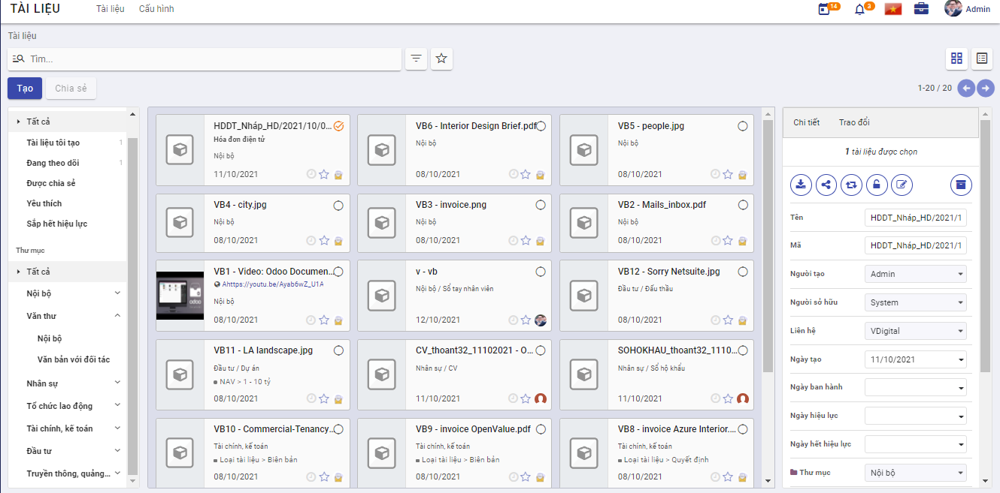
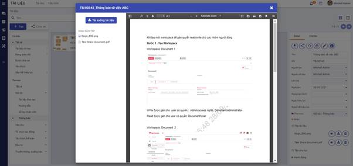
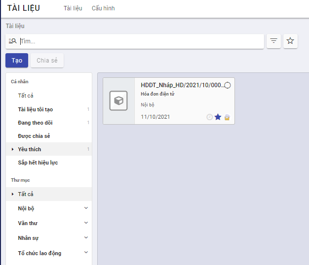
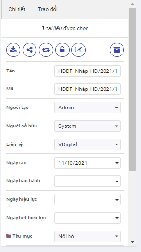

##  Quản lý tài liệu

### Tạo mới tài liệu 

Chức năng này cho phép người dùng tạo mới tài liệu trên ứng dụng. 

**Đối tượng thực hiện :** Người dùng được phân quyền

**Các bước thực hiện**

1. Vào **Tài liệu** > kích nút **Tạo**
2.  Khai báo thông tin tài liệu

​	***Lưu ý***

- **Tên và mã tài liệu** là bắt buộc phải nhập
- **Thư mục**: Chọn thư mục lưu trữ tài liệu từ danh sách thư mục mà người dùng có quyền ghi. 

- **Nhãn**: Chọn nhãn gắn với tài liệu từ danh sách các nhãn thuộc thư mục được chọn và thư mục cha (nếu có) của nó. 

- **Phiên bản thay thế**: Khi tài liệu được đẩy mới lên hệ thống để thay thế cho một hoặc nhiều tài liệu đã có trước đó.  Khi thay thế, tài liệu bị thay thế sẽ được cập nhật ngày hết hiệu lực chính là ngày trước ngày hiệu lực tài liệu mới. 

- **Loại tài liệu**: hệ thống hỗ trợ lưu trữ các loại tài liệu sau

  - **Đính kèm:** áp dụng với các tài liệu cần đính kèm tệp lên hệ thống.  Khi đó, người dùng bắt buộc phải đính kèm ít nhất 1 tệp tài liệu tại trường Tệp tài liệu. Hệ thống hỗ trợ đính kèm các tệp có định dạng doc, docx, xlsx, xls, ppt, pdf, định dạng ảnh, video, tệp nén raz, zip ... 

     

  - **Liên kết**: áp dụng với các tài liệu được lưu trữ là các liên kết. Khi chọn loại này, người dùng cần nhập liên kết tại trường URL. 

    

  - **Văn bản:** Nội dung cần lưu trữ dạng văn bản sẽ được người dùng nhập luôn tại trường Mô tả. 

    

3. Kích nút **Lưu** để lưu lại tài liệu trên hệ thống. 

### Tra cứu tài liệu

Khi có nhu cầu xem một tài liệu nào đó trên danh sách, người dùng có thể tìm nhanh được tài liệu đó bằng cách sử dụng chức năng tìm kiếm theo tiêu chí khác nhau như tên, mã ... 

**Đối tượng thực hiện :** Người dùng được phân quyền

**Các bước thực hiện**

1. Vào **Tài liệu** 

2.  Kích chọn hoặc không thư mục lưu trữ tại cây thư mục

3. Nhập nội dung tìm kiếm vào ô Tìm và thực hiện tìm kiếm

   

Hiển thị danh sách tài liệu thỏa mãn  tiêu chí tìm kiếm dưới dạng kanban hoặc danh sách. Các thông tin hiển thị gồm: 

- Mã _ Tên tài liệu
- Thư mục lưu trữ
- Nhãn nếu có
- Ngày tạo 
- Người tạo

***Lưu ý***: 

- Cây thư mục chỉ hiển thị các thư mục mà người dùng có quyền ghi/đọc
- Người dùng chỉ có thể tìm kiếm được các tài liệu có quyền đọc / ghi

###  Xem thông tin chi tiết tài liệu

Cho phép người dùng xem được thông tin chi tiết thuộc tính của tài liệu và xem trước nội dung tệp tin ngay trên hệ thống với một số định dạng như pdf, ảnh ...

**Đối tượng thực hiện**: Người dùng được phân quyền 

**Các bước thực hiện**

1. Vào **Tài liệu** > Tìm kiếm một tài liệu cần xem

2. Kích chọn tài liệu: hiển thị thông tin chi tiết tài liệu

   ​	

   ​	

   ​		***Lưu ý***:  

   - Hiển thị các thông tin chi tiết tài liệu tại khung màn hình bên phải. 

   - Danh sách các tệp tin và tệp phụ lục (nếu có). Tại vùng danh sách này, cho phép người dùng xem/ tải từng tệp. 

   - Lịch sử các phiên bản (nếu có): danh sách hiển thị sắp xếp theo phiên bản giảm dần. 

   - Các nút hoạt động thực hiện với tài liệu 
     - Tải tài liệu: cho phép tải tài liệu về máy cá nhân. 
     - Chia sẻ: hiển thị khi người dùng có quyền đọc/ghi với tài liệu
     - Thay thế: chức năng nâng phiên bản tài liệu, chỉ hiển thị khi người dùng có quyền ghi với tài liệu
     - Khóa/ mở khóa: chỉ hiển thị khi người dùng là người tạo tài liệu. 
     - Cập nhật: chỉ hiển thị khi  người dùng có quyền ghi với tài liệu và  đang mở khóa
     - Lưu trữ: Đưa tài liệu vào khu vực lưu trữ riêng, không thấy trên danh sách tài liệu. 
     
   - tab Trao đổi: hiển thị các lịch sử trao đổi, bình luận về tài liệu và cho phép người dùng bình luận về tài liệu. 

     

3. Kích vào vùng ảnh đại diện tài liệu để mở màn hình xem trước các tệp thuộc tài liệu hoặc mở liên kết cho phép. 

***Lưu ý***:

- Danh sách tệp của tài liệu hiển thị theo thứ tự các tệp và phụ lục
- Với định dạng hỗ trợ xem trước (pdf, doc, mp4, jpg, png, xls, xlsx, ppt, txt ...): hiển thị được nội dung tệp ngay trên hệ thống. 
- Với định dạng không hỗ trợ xem trước thì hiển thị thông báo lỗi.
- Kích nút **Tải xuống tài liệu** để tải toàn bộ các tệp của tài liệu về máy cá nhân. 

### Đánh dấu yêu thích tài liệu

Khi thấy tài liệu hay hoặc tài liệu cần lưu ý, người dùng có thể đánh dấu lại tài liệu để có thể nhanh chóng tìm thấy trong lần đọc sau.

**Đối tượng thực hiện**: người dùng được phân quyền 

**Các bước thực hiện**

1. Vào **Tài liệu** > tìm kiếm tài liệu

   

2. Tích dấu sao  để đánh dấu yêu thích/ bỏ yêu thích với tài liệu

   ***Lưu ý***

   - Tài liệu được đánh dấu yêu thích sẽ được xem nhanh bằng cách kích vào mục Tài liệu yêu thích 

     

### Nâng phiên bản tài liệu

Cho phép thay thế/ nâng cấp tài liệu bởi phiên bản mới khi phiên bản cũ đã hết hiệu lực hoặc cần thay thế. 

**Đối tượng thực hiện**: người dùng được phân quyền ghi

**Các bước thực hiện**

1. Vào **Tài liệu** > tìm kiếm tài liệu

2. Kích chọn tài liệu để mở màn hình xem thông tin chi tiết

   

3. Kích nút Thay thế : hiển thị màn hình nhập thông tin chi tài liệu mới

   ​	

4. Khai báo tài liệu mới và kích **Lưu**

   ***Lưu ý**

   - Tài liệu bị thay thế sẽ có ngày hết hiệu lực chính là ngày liền trước ngày bắt đầu hiệu lực cho tài liệu mới (nếu có thông tin ngày bắt đầu hiệu lực của tài liệu mới) hoặc ngày liền trước ngày hiện tại (nếu tài liệu mới không có thông tin ngày bắt đầu hiệu lực)

### Thay đổi thư mục chứa tài liệu

Cho phép người dùng di chuyển tài liệu từ thư mục này sang thư mục khác

**Đối tượng thực hiện**: người dùng được phân quyền ghi

**Các bước thực hiện**

1. Vào **Tài liệu** > tìm kiếm tài liệu

2. Tích chọn tài liệu để hiển thị màn hình xem chi tiết

3. Tại trường Thư mục: chọn lại thư mục chứa tài liệu

    

 Lưu ý: 

- Chỉ di chuyển được tài liệu sang thư mục mà người dùng có quyền ghi 

### Thêm hoặc bớt nhãn gán cho tài liệu

Cho phép người dùng thêm/ bớt nhãn gán cho tài liệu. 

**Đối tượng thực hiện**: người dùng được phân quyền

**Các bước thực hiện**

Để thêm/bớt nhãn gán cho tài liệu có 2 cách: 

**Cách 1:** 

1. Vào **Tài liệu** > tìm kiếm tài liệu
2. Tích chọn tài liệu để hiển thị màn hình xem chi tiết
3. Tại trường nhãn: 
   - Kích icon x tương ứng để xóa nhãn đã gán
   - Nhập hoặc chọn mới nhãn từ danh sách nhãn để gán nhãn mới 

**Cách 2:** 

1. Vào **Tài liệu** > tìm kiếm tài liệu

2. Tích chọn tài liệu để hiển thị màn hình xem chi tiết 

3. Kích nút Cập nhật  

4. Tại màn hình cập nhật, thay đổi thông tin nhãn gán cho tài liệu và kích **Lưu lại**

   

### Chia sẻ tài liệu

Chức năng này cho phép người dùng chia sẻ tài liệu cho người dùng khác. 

**Đối tượng thực hiện**: người dùng được phân quyền đọc/ghi

**Các bước thực hiện**

1. Vào **Tài liệu** > tìm kiếm và tích chọn 1 hoặc nhiều tài liệu muốn chia sẻ

2. Kích nút **Chia sẻ**  

3. Khai báo thông tin chia sẻ tài liệu

   - Người nhận: nhập danh sách người sẽ được chia sẻ tài liệu

   - Ngày hết hiệu lực: chọn thời gian sẽ hết hiệu lực chia sẻ tài liệu

   - Liên kết: hệ thống sinh ra một liên kết khi thực hiện chia sẻ tài liệu, cho phép người dùng sao chép và gửi liên kết tài liệu cho người khác. Tuy nhiên, chỉ người được chia sẻ mới có thể xem được tài liệu. 

     

4.  Kích **Chia sẻ**

   **Lưu ý**

   - Người dùng được chia sẻ tài liệu nhận được thông báo từ hệ thống
   - Danh sách tài liệu được chia sẻ với người dùng được lọc nhanh bằng cách kích vào mục **Tài liệu được chia sẻ** 
   - Quyền của người dùng với tài liệu căn cứ theo quyền với thư mục chứa tài liệu được chia sẻ. 
     - Nếu với thư mục chứa, người dùng không được phân quyền đọc/ghi: mặc định với tài liệu được chia sẻ có quyền đọc
     - Nếu thư mục chứa, người dùng có quyền ghi: thì với tài liệu được chia sẻ cũng có quyền ghi

### Bình luận, trao đổi tài liệu

Cho phép người dùng có thể đưa ra các bình luận, đánh giá về nội dung tài liệu

**Đối tượng thực hiện**: người dùng được phân quyền đọc/ghi

**Các bước thực hiện**

1. Vào **Tài liệu** > tìm kiếm tài liệu
2. Tích chọn tài liệu để hiển thị màn hình xem chi tiết
3. kích chọn tab **Trao đổi** > mục **Gửi tin**

- Người dùng nhập nội dung ý kiến của cá nhân về tài liệu 
- Xem được các bình luận của người khác về tài liệu 
- Người dùng có thể đính kèm thêm các tệp tài liệu khác để tham khảo bằng cách kích vào nút **Thêm tệp đính kèm**

### Quản lý các chia sẻ của người dùng

Cho phép người dùng quản lý, theo dõi các chia sẻ mình đã thực hiện. 

**Đối tượng thực hiện**: người dùng 

**Các bước thực hiện**

1. Vào **Cấu hình** >  chọn **Chia sẻ và email**

   Hiển thị toàn bộ các liên kết được người dùng chia sẻ và trạng thái hiện tại còn hiệu lực hay hết hiệu lực. 

   

2. kích chọn 1 bản ghi chia sẻ trên danh sách để xem chi tiết thông tin chia sẻ và sao chép lại liên kết

   ​	

### Thông báo cho người nhận tài liệu chia sẻ

Chức năng này cho phép người dùng xem thông báo khi được chia sẻ tài liệu

**Các bước thực hiện**

1. Kích icon Thông báo -> hiển thị danh sách các thông       

                

- Hệ thống sẽ hiển thị: Tên chức năng, nội dung chia sẻ

