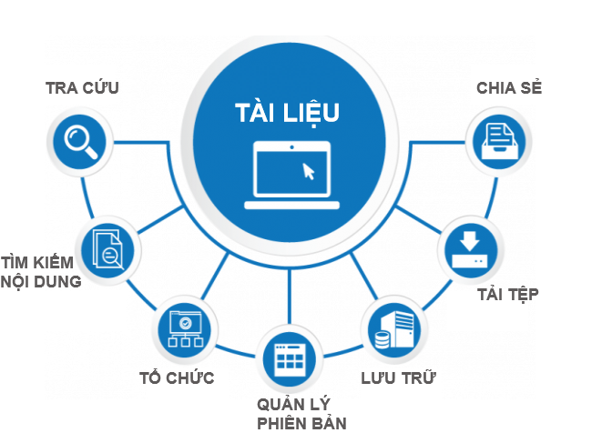

## Giới thiệu về ứng dụng Tài liệu

Ứng dụng Tài liệu trên hệ thống cung cấp công cụ cho phép lưu trữ và quản lý các văn bản, hồ sơ, tài liệu nội bộ của doanh nghiệp tập trung trực tuyến, phục vụ mục đích tìm kiếm, truy xuất và khai thác một cách nhanh chóng, dễ dàng hơn, mọi lúc, mọi nơi.  Tại đây, mọi người cũng có thể dễ dàng trao đổi, đưa ý kiến thảo luận và chia sẻ thông tin. 

Ứng dụng Tài liệu là công cụ cho phép: 

- Lưu trữ tài liệu theo các dạng văn bản, hình ảnh, video ...
- Tổ chức tài liệu khoa học cấp thư mục và gán nhãn cho tài liệu
- Tìm kiếm tài liệu nhanh chóng, dễ dàng theo nhiều tiêu chí hoặc theo nội dung tài liệu
- Phân quyền đọc/ ghi tài liệu để đảm bảo yếu tố bảo mật thông tin doanh nghiệp
- Chia sẻ tài liệu cho người khác khi cần thiết. 
- Bình luận, trao đổi về tài liệu 

