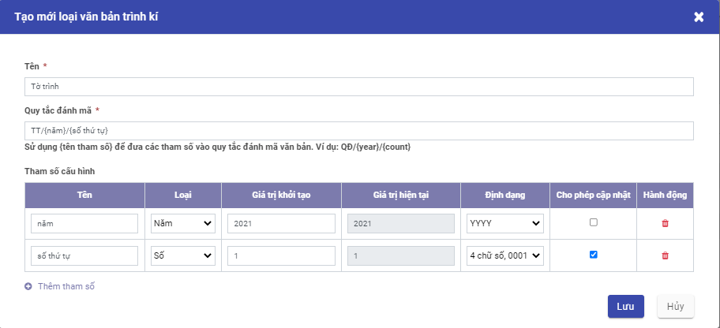

## Thiết lập và khai báo dữ liệu ban đầu

Việc thiết lập và khai báo ban đầu được thực hiện khi lần đầu cài đặt ứng dụng, giúp khởi tạo dữ liệu và bắt đầu cho việc thực hiện các nghiệp vụ ký số. 

### **Tải plugin chứng thư số để sử dụng usb-token** 

Để USB token để ký số, người dùng cần phải tải plugin [tại đây](https://drive.google.com/file/d/1AhSJmYcurxkwipzxEM4T4HcHi5yKH80Q/view) về máy để chạy mỗi khi thực hiện ký. Trước khi thực hiện ký số với usb token, cần phải chạy tệp plugin này. 

### Loại văn bản trình ký

Cho phép khai báo và quản lý thông tin về các loại văn bản  trên hệ thống, các quy tắc tự sinh số văn bản khi được ban hành. 

**Đối tượng thực hiện: Quản trị hệ thống (Admin)**

**Các bước thực hiện:** 

1. Vào **Cấu hình** > chọn **Loại tài liệu trình ký**

​	

- Hiển thị danh sách các loại văn bản trình ký được khai báo trên hệ thống.
- Thông tin hiển thị: Tên, Mã văn bản

2.  Để khai báo loại văn bản mới, người dùng kích nút **Tạo**. Trên màn hình tạo mới, khai báo các thông tin chi tiết của **Loại văn bản trình ký**

- Nhập Tên loại văn bản trình ký

- Nhập Quy tắc đánh mã: Nhập quy tắc sẽ đánh số văn bản để hệ thống tự sinh số văn bản khi được ban hành tự động. Quy tắc sinh mã có sử dụng các tham số được định nghĩa ở danh sách tham số cấu hình ở bên dưới theo cấu trúc khai báo {tên tham số}. 

  Ví dụ: Một tờ trình có số văn bản khi ban hành được hệ thống tự sinh theo quy tắc sinh mã: **TT/{năm}/{số thứ tự}** , khi khai báo sẽ thực hiện như sau: 

     - Nhập vào trường Quy tắc đánh mã: **TT/{năm}/{số thứ tự}**, trong đó **năm** và **số thứ tự** là các tham số tự sinh cần khai báo ở phần danh sách tham số cấu hình bên dưới. 

     - Tại phần Tham số cấu hình, kích nút **Thêm tham số** để cấu hình cho từng tham số

       -  Trường Tên: nhập tên tham số phải duy nhất trong danh sách tham số

       - Kiểu: chọn kiểu dữ liệu tương ứng với tham số, ví dụ **số thứ tự** thì chọn kiểu số. Hệ thống đang hỗ trợ một số kiểu như số, ngày, tháng, năm, văn bản.   
       - Giá trị khởi tạo:  Nhập giá trị khởi tạo để bắt đầu tính quy tắc,  ví dụ số thứ tự với giá trị khởi tạo là 1 thì khi sinh số văn bản sẽ tính từ 1 và tăng dần lên.

       - Ô tích / bỏ tích **Cho phép cập nhật**: nếu được tích chọn thì khi ban hành văn bản người dùng có thể thay đổi giá trị ứng với tham số này.  

         

### Vai trò ký

Cho phép khai báo và quản lý thông tin về các vai trò khi ký của người dùng  trên ứng dụng. 

**Đối tượng thực hiện: Quản trị hệ thống (Admin)**

**Các bước thực hiện:** 

1.  Người dùng chọn **Cấu hình** >Kích chọn **Vai trò kí**

- Hiển thị danh sách các vai trò ký được khai báo trên hệ thống.
- Thông tin hiển thị: Tên vai trò và lựa chọn Có người xem xét 

2. Click **Tạo** để khai báo các thông tin vai trò ngay trên danh sách: 

- Tên: nhập tên vai trò
- Tích chọn Có người xem xét:  
  - Tích tùy chọn này với các vai trò cần phải qua người văn thư, thư ký xét duyệt trước khi gửi tới người ký 
  - Không tích với các trường hợp không cần qua bộ phần xét duyệt trước.

3. Kích**Lưu**

### Tài khoản ký

Cho phép khai báo và quản lý thông tin về các tài khoản được thực hiện ký  trên hệ thống.

**Đối tượng thực hiện: **

·     **Người quản trị hệ thống:** khai báo các tài khoản ký cho người dùng

·     **Người dùng: ** Chỉ xem thông tin tài khoản của mình và có quyền chỉnh sửa ảnh chân ký và thông tin ký CA 

**Các bước thực hiện:** 

1. Chọn **Cấu hình** > Kích**Tài khoản kí**

- Hiển thị danh sách các tài khoản ký đã khai báo trên hệ thống.
- Các thông tin hiển thị: Tên tài khoản, email, số điện thoại, có ký số, vai trò...

2. Để khai báo tài khoản ký mới, kích nút **Tạo**:

   ​	

- Nhập **Tài khoản kí**: Nhập @ tìm kiếm và chọn người dùng để tạo tài khoản kí. Mỗi người dùng tồn tại duy nhất trong danh sách tài khoản kí. 

  **Chú ý**: Điều kiện để cấu hình tài khoản ký cho một người là người đó phải có tài khoản sử dụng trên hệ thống. Trường hợp chưa có tài khoản thì cần liên hệ quản trị được tạo người dùng trước. 

- Chọn **vai trò**: Mỗi người dùng có thể có một hoặc kiêm nhiệm nhiều vai trò. 

- Chọn **Người xem xét**: với vai trò yêu cầu có người xem xét thì bắt buộc phải cấu hình người xem xét từ danh sách người dùng. 

- **Có ký điện tử?**: Nếu tích chọn thì người dùng có thể sử dụng chữ ký số, ngược lại thì chỉ ký duyệt thông thường. 

- Tab **Ảnh chân ký**: Người dùng tải lên hệ thống ảnh chữ ký mộc dùng cho cá nhân để thêm vào văn bản sau khi ký duyệt (nếu yêu cầu). Mỗi tài khoản ký có thể cấu hình tối đa 3 loại chữ ký.  Kích thước ảnh chân ký phải thỏa mãn tỷ lệ 3:2, chiều rộng ảnh thuộc khoảng 200 px - 279px . Ngày hiệu lực mặc định là ngày tải ảnh chân ký tương ứng lên hệ thống. 

- Tab **Chứng thư số**: Cấu hình chứng thư số để xác thực khi người dùng ký duyệt các văn bản. Chứng thư số cần phải được cấu hình trước khi thực hiện ký số để xác thực người ký. 

  

  Để lấy serial chứng thư số cần thực hiện các bước sau: 

  - Bước 1: Tải plugin ký số [tại đây](https://drive.google.com/file/d/1AhSJmYcurxkwipzxEM4T4HcHi5yKH80Q/view?usp=sharing) về máy tính cá nhân và kích chạy tệp vừa tải về
  - Bước 2: Cắm usb token chứa chứng thư số vào máy tính 
  - Bước 3: kích nút **Tải chứng thư số**  -> lựa chọn chứng thư số còn hiệu lực. 

3. Click **Lưu**

### Lưu mẫu trình ký văn bản

Chức năng cho phép mỗi người dùng tạo và quản lý những mẫu trình ký thường xuyên sử dụng. 

**Các bước để tạo mẫu trình ký**

Có 2 cách để tạo mẫu trình ký

**<u>Cách 1</u>:** 

1. Vào **Cấu hình** > chọn **Mẫu tài khoản kí**

- Hiển thị danh sách tất cả mẫu tài khoản kí đã tạo trong hệ thống
- Các chức năng có trong màn hình danh sách bao gồm: Tạo mới, chỉnh sửa, xóa, xuất danh sách mẫu tài khoản kí
- Nhập thông tin muốn tìm kiếm vào thanh tìm kiếm

2. Click **Tạo** > Khai báo thông tin tạo mới mẫu tài khoản kí

- Nhập tên mẫu danh sách ký

- Chọn phạm vi 

- Nhập tên và chọn Tài khoản kí

3. Click **Lưu**

4. Thực hiện yêu cầu tạo mới Mẫu kí: Kiểm tra thông tin dữ liệu trên màn hình và tùy chính thông tin Tạo mới

**<u>Cách 2</u>:**  Tạo mẫu trình ký nhanh trong khi tạo văn bản trình ký 

