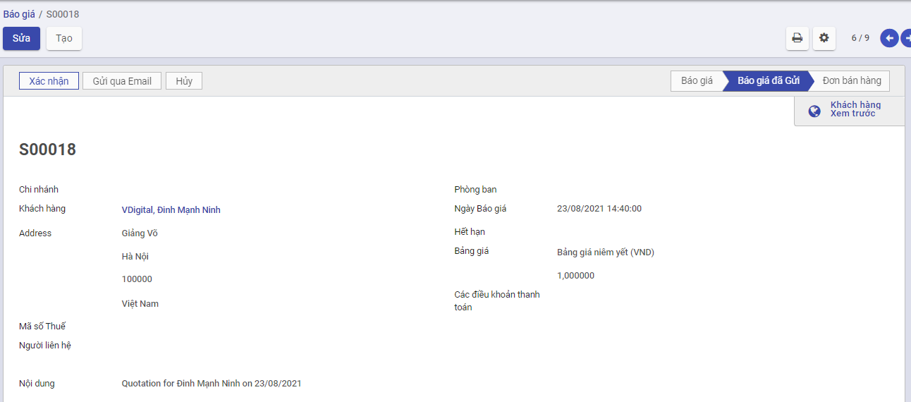
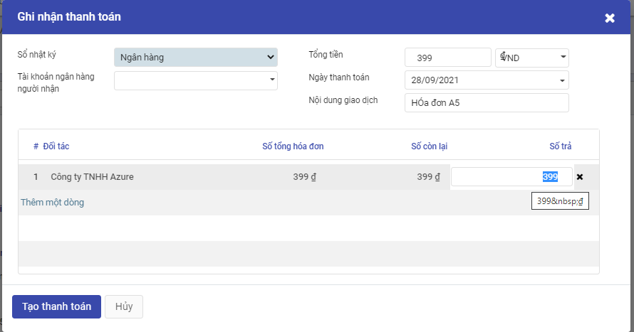

### **Bán hàng**

#### *Quy trình nghiệp vụ*

*[Mô tả thông tin chung]*

Quy trình bán hàng là một loạt các bước cần thực hiện để thúc đẩy hoạt động bán hàng tại doanh nghiệp.Việc xây dựng quy trình bán hàng trên hệ thống sẽ giúp nhân viên kinh doanh, quản lý bán hàng và ban lãnh đạo doanh nghiệp xác định được các cơ hội bán hàng và tỷ lệ thành công của các cơ hội đó từ đó xác định được các chiến lược kinh doanh phù hợp để đạt được doanh thu lớn nhất. Quy trình sẽ bao gồm các chức năng: Từ yêu cầu báo giá đến đơn bán hàng, hóa đơn bán hàng, hóa đơn giảm giá/trả hàng

**Quy trình nghiệp vụ**

*[Hình luồng quy trình nghiệp vụ của Module]*

**Các luồng quy trình**

*[Liệt kê các luồng quy trình nghiệp vụ có trong phân hệ Bán hàng, có link đến Phần Hướng dẫn chi tiết]*

·     Lập yêu cầu báo giá gửi khách hàng. Chi tiết nghiệp vụ **[tại đây](#Lập yêu cầu báo giá)**

·     Lập đơn bán hàng gửi khách hàng. Chi tiết nghiệp vụ **[tại đây](#Lập đơn bán hàng)**

·     Lập hợp đồng bán hàng. Chi tiết nghiệp vụ [**tại đây**](#Hợp đồng bán hàng)

·     Lập hóa đơn bán hàng gửi khách hàng. Chi tiết nghiệp vụ **tại đây**

·     Lập hóa đơn giảm giá/trả hàng gửi khách hàng. Chi tiết nghiệp vụ **tại đây**

#### *Yêu cầu báo giá*

##### Mô tả nghiệp vụ

**Nghiệp vụ**

1. Nhân viên kinh doanh tìm kiếm khách hàng thông qua khách hàng tiềm năng, khách hàng cũ, đối tác, nhà phân phối
2. Nhân viên kinh doanh sẽ tiếp thị, giới thiệu sản phẩm dịch vụ để chào hàng
3. Đối với những khách hàng có nhu cầu mua sản phẩm/dịch vụ, nhân viên kinh doanh sẽ tiến hành:

- Lập báo giá
- Gửi báo giá cho khách hàng

**Hướng dẫn trên phần mềm**

Phần mềm hỗ trợ nhân viên kinh doanh lập và gửi báo giá cho nhân viên kinh doanh theo các bước sau:

Bước 1: Lập báo giá. Chi tiết nghiệp vụ [tại đây](#Lập báo giá)

Bước 2: Gửi báo giá cho khách hàng. Chi tiết nghiệp vụ [tại đây](#Thực hiện gửi báo giá cho khách hàng)

**Xem video hướng dẫn**

*[Xây dựng video hướng dẫn trên phần mềm, gồm đủ các luồng chức năng được mô tả bên dưới]*

##### Lập báo giá

Nhân viên kinh doanh tiến hành lập báo giá sản phẩm/dịch vụ cho khách hàng có nhu cầu

Đối tượng thực hiện: Nhân viên kinh doanh

1. Vào phân hệ **Bán hàng**, Chọn **Đơn bán hàng**, chọn **Báo giá** (Hoặc thực hiện **Tìm kiếm** trực tiếp chức năng trên ô tìm kiếm chung của hệ thống)

2. Khai báo các thông tin chi tiết trên báo giá

·     Chọn thông tin khách hàng

·     Chọn tiền tệ giao dịch trong Đơn hàng

·     Khai báo thông tin về Ngày báo giá, hiệu lực đến

·     Khai báo thông tin về Sản phẩm/dịch vụ : 

​			Chọn các sản phẩm yêu cầu báo giá cho khách hàng

​			Nhập thông tin Số lượng, Đơn giá, Chiết khấu và mức Thuế đối với từng Sản phẩm

​			Khi thực hiện Thêm ghi chú --> Thông tin nội dung sẽ được in trên file gửi khách hàng

3. Nhấn **Lưu**

##### **Thực hiện gửi báo giá cho khách hàng**

1. Sau khi đã có tài liệu báo giá để gửi khách hàng, Thực hiện In yêu cầu báo giá: kiểm tra thông tin dữ liệu trên mẫu yêu cầu báo giá và tùy chỉnh thông tin Mẫu yêu cầu

2. Thực hiện Gửi Email đến nhà cung cấp sau khi hoàn thành  báo giá, có thể tùy chỉnh thông tin mẫu gửi báo giá theo yêu cầu

   

##### Xác nhận đơn bán hàng

1. Vào phân hệ **Bán hàng**, trên danh sách **Báo giá**, tìm thông tin các báo giá đã gửi cho khách hàng 

   

2. Nhấn nút **Xác nhận**

Sau khi thực hiện Xác nhận đơn hàng, chương trình tự động tạo ra một Phiếu xuất kho bên Phân hệ Quản lý kho. Nhân viên có thể theo dõi tình trạng giao hàng của sản phẩm trên phiếu xuất kho đã sinh ra

**<u>Lưu ý:</u>**

Báo giá được thực hiện Xác nhận đơn hàng: Sẽ không được hiển thị trên Danh sách Báo giá

#### Lập đơn bán hàng

##### Mô tả nghiệp vụ

Đơn bán hàng được thực hiện sau luồng Gửi báo giá cho khách hàng được hoàn thành

Khi có nhu cầu mua sản phẩm, khách hàng sẽ liên hệ với nhân viên kinh doanh để đặt hàng. Khi đó nhân viên kinh doanh sẽ tiếp nhận yêu cầu của khách hàng, thực hiện tạo đơn bán hàng. Tại đơn bán hàng, nhân viên có thể theo dõi hàng xuất kho và tình trạng xuất hóa đơn cho khách hàng

##### Lập đơn bán hàng

Đối tượng thực hiện: Nhân viên kinh doanh

1. Vào phân hệ **Bán hàng**, Chọn nhóm **Đơn bán hàng** , chọn chức năng **Đơn bán hàng** (Hoặc thực hiện **Tìm kiếm** trực tiếp chức năng trên ô tìm kiếm chung của hệ thống)

   Danh sách đơn bán hàng sẽ hiển thị các báo giá đã được khách hàng phản hồi có nhu cầu mua sản phẩm và xác nhận tạo đơn bán hàng

   

2. Thực hiện chọn Đơn bán hàng cần thực hiện. Tại Đơn bán hàng: 
   - Nhân viên phụ trách có thể thực hiện sửa thông tin về Ngày đặt hàng hay Thông tin về sản phẩm
   - Mục Điều khoản thanh toán: Nếu có thỏa thuận về điều kiện thanh toán với nhà cung cấp thực hiện chọn thông tin Điều khoản đã được khai báo trên Danh mục **Điều khoản thanh toán** . Trường hợp đã thiết lập điều khoản thanh toán cho từng khách hàng tại danh mục **Khách hàng** thì chương trình sẽ tự động hiển thị sẵn thông tin này theo nhà cung cấp được chọn

##### Theo dõi giao hàng

Sau khi có đơn hàng, sản phẩm sẽ được giao cho khách hàng. Nhân viên kế toán kho thực hiện xác nhận số lượng sản phẩm bàn giao theo đơn hàng 

Nhân viên kinh doanh có thể theo dõi tình trạng giao hàng của sản phẩm qua phiếu xuất kho đã được tạo khi xác nhận đơn hàng

1. Chọn **Giao hàng**, thực hiện nhập số lượng hàng đã hoàn thành giao cho khách hàng 

- Nếu Số lượng xuất kho đủ theo Số lượng của Đơn bánhàng: Thực hiện nhấn **Xác nhận** để xác nhận toàn bộ Đơn hàng

- Nếu Số lượng xuất kho Chưa đủ theo Số lượng của Đơn mua hàng: Thực hiện nhập số lượng theo thực tế.

  

2. Nhấn **Xác nhận** để hoàn thành xuất hàng giao cho khách hàng

#### Hợp đồng bán hàng

##### Mô tả nghiệp vụ

Đối với trường hợp bán hàng có giá trị lớn, sau khi tiếp nhận được yêu cầu mua hàng của khách hàng, nhân viên kinh doan tiến hành lập hợp đồng bán hàng  theo đơn hàng, theo dõi thanh toán và thanh lý hợp đồng

##### Hợp đồng bán

#### Hóa đơn bán hàng

##### Mô tả nghiệp vụ

Sau khi ký được hợp đồng bán hàng với khách hàng và thực hiện giao hàng thành công, kế toán thực hiện kiểm tra dữ liệu và lập hóa đơn bán hàng, đồng thời thực hiện và theo dõi việc thanh toán của hóa đơn

Sau khi kế toán phê duyệt và cấp hóa đơn, nhân viên kinh doanh sẽ nhận lấy hóa đơn từ phòng kế toán và gửi cho khách hàng

##### Lập hóa đơn bán hàng từ đơn bán hàng

Đối tượng thực hiện: Nhân viên kế toán

1. Vào phân hệ **Bán hàng**, Chọn **Đơn bán hàng** đã hoàn thành Giaohàng cho khách hàng và Nhấn **Tạo hóa đơn**

   

2. Trên thông tin Hóa đơn, kế toán thực hiện chọn loại hóa đơn thanh toán dựa trên số tiền khách hành thanh toán

   - Hóa đơn thông thường: Hệ thống tạo 1 hóa đơn với số lượng, số tiền tương ứng với đơn bán hàng

   - Tiền đặt cọc (Theo phần trăm): Hệ thống tạo 1 hóa đơn với số tiền thanh toán theo tỷ lệ phần trăm với số tiền bên đơn bán hàng

   - Tiền đặt cọc (Số tiền cố định): Hệ thống tạo 1 hóa đơn với số tiền thanh toán bằng số tiền đã nhập sẵn trên giao diện

     

3. Trên thông tin Hóa đơn bán hàng, Nhân viên kế toán thực hiện nhập các dữ liệu về:

   - Hóa đơn: Ngày hóa đơn, Mẫu số, Ký hiệu hóa đơn và Số hóa đơn

   - Chọn và nhập thông tin về Thuế và Chiết khấu tương ứng của Đơn hàng

     

4. Thông tin dữ liệu hạch toán:

   - Căn cứ thông tin Thuế đầu ra đã lựa chọn cùng với thông tin Chiết khấu, Đơn giá, Số lượng của Đơn hàng, hệ thống thực hiện mặc định thông tin các bút toán tương ứng

   

5. Nhân viên Kế toán thực hiện nhấn **Xác nhận** 

##### Lập hóa đơn bán hàng không từ đơn bán hàng

Đối tượng thực hiện: Nhân viên kế toán

1. Vào phân hệ **Bán hàng**, Chọn **Hóa đơn** , chọn **Hóa đơn bán hàng** (Hoặc thực hiện **Tìm kiếm** trực tiếp chức năng trên ô tìm kiếm chung của hệ thống)

   

   

   

2. Trên thông tin Hóa đơn bán hàng, Nhân viên kế toán thực hiện nhập các dữ liệu về:

   - Hóa đơn: Loại bán hàng, khách hàng, Ngày hóa đơn, Mẫu số, Ký hiệu hóa đơn ,Số hóa đơn, hạn thanh toán
   - Chọn và nhập thông tin về sản phẩm, số lượng, giá thành bán,Thuế và Chiết khấu của sản phẩm cần lập hóa đơn

3. Nhân viên Kế toán thực hiện nhấn **Lưu** 

4. Thông tin dữ liệu hạch toán:

   - Căn cứ thông tin Thuế  đã lựa chọn cùng với thông tin Chiết khấu, Đơn giá, Số lượng đã nhập bên chi tiết hóa đơn, hệ thống thực hiện mặc định thông tin các bút toán tương ứng

   

   5. Nhân viên Kế toán thực hiện nhấn **Xác nhận** 

Ghi nhận thanh toán

Kế toán thực hiện ghi nhận và theo dõi việc thanh toán của hóa đơn sau khi xác nhận xuất hóa đơn thành công

Đối tượng thực hiện: Nhân viên kế toán

1. Vào phân hệ **Bán hàng**, chọn **Hóa đơn**, chọn **Hóa đơn bán hàng**. Trên danh sách hóa đơn bán hàng, kế toán tìm tới các xóa đơn đã được ghi sổ

2. Nhấn nút **Ghi nhận thanh toán**. Kế toán nhập và sửa thông tin Tài khoản ngân hàng người nhận, khách hàng, ngày hóa đơn, số tiền khách hàng đã trả

Hệ thống sinh phiếu thu tiền  để thu tiền khách hàng đã thực hiện trả

