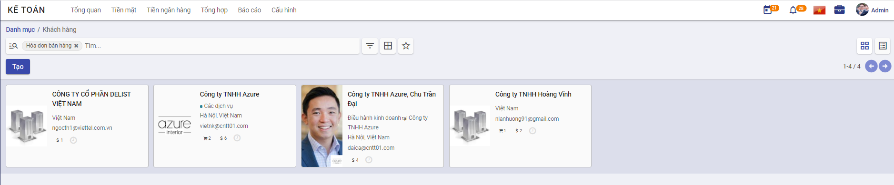
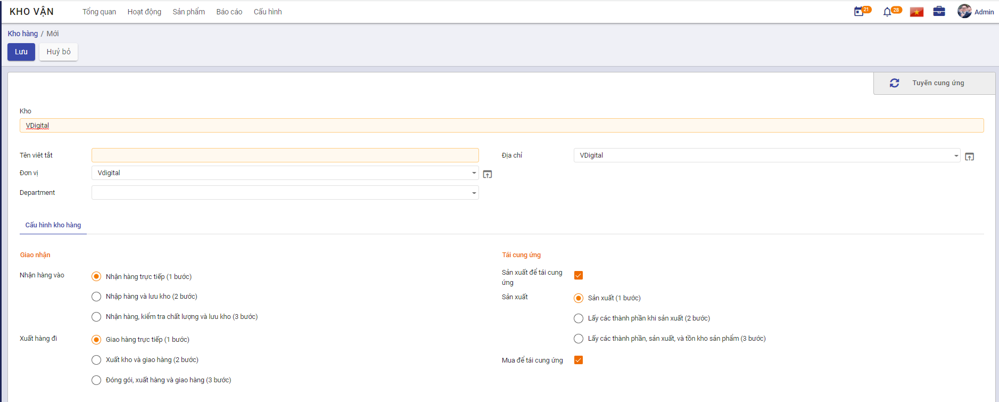
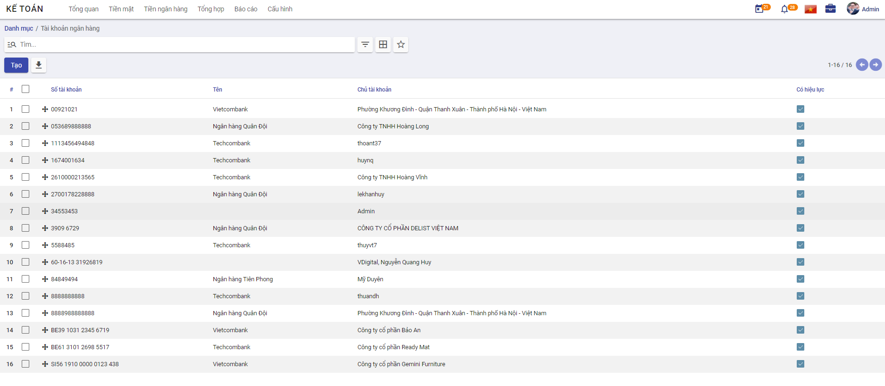
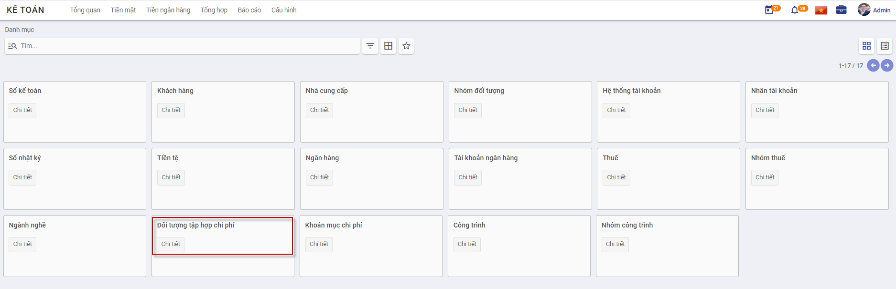
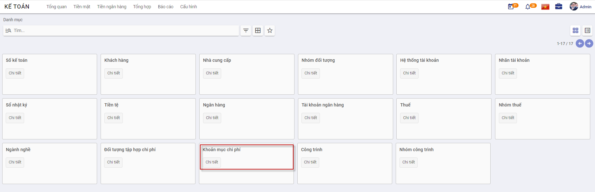
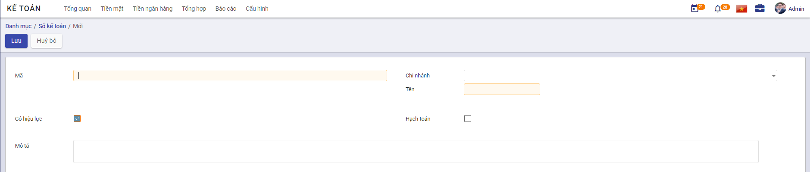

**Khai báo danh mục**

Thực hiện hướng dẫn về các Danh mục cần khai báo trên ứng dựng Kế toán. Việc khai báo các Danh mục có thể được thực hiện tại bất kỳ thời điểm nào tùy thuộc người sử dụng: có thể trước thời điểm nhập chứng từ hay thực hiện được ngay tại thời điểm nhập chứng từ.

#### **Đối tượng**

##### **Nhóm đối tượng**

**Mục đích**

Quản lý thông tin về các nhóm đối tượng khác nhau, phục vụ cho việc quản lý danh sách khách hàng và nhà cung cấp của doanh nghiệp.

Chức năng Danh mục **Nhóm đối tượng** được quản lý tập trung tại phần **Danh mục**

**Các bước thực hiện**

1. Vào phân hệ **Kế toán**; chọn chức năng **Danh mục**: chọn **Nhóm đối tượng** và nhấn nút **Chi tiết**

Thông tin **Danh mục Nhóm đối tượng** được hiển thị để người dùng khai báo

2. Để khai báo thêm Nhóm người dùng, người dùng nhấn nút **Tạo**Trên màn hình **Nhóm người dùng** và thực hiện Khai báo các thông tin: 

- Mã nhóm: Không trùng với Mã đã khai báo 
- Tên nhóm: Thông tin để quản lý

3. Nhấn nút **Lưu**

##### **Khách hàng**

**Mục đích**

Chức năng này cho phép người dùng khai báo các Khách hàng của Công ty. Thực hiện Quản lý danh sách các khách hàng, phục vụ cho việc lập và hạch toán các chứng từ kế toán liên quan đến hoạt động bán hàng, hóa đơn.

Chức năng Danh mục **Khách hàng** được quản lý tập trung tại phần **Danh mục** của Phân hệ **Kế toán**

**Các bước thực hiện**

1. Vào phân hệ **Kế toán**; chọn chức năng **Cấu hình\Danh mục**: chọn **Khách hàng** và nhấn nút **Chi tiết**

Thông tin **Danh mục Khách hàng** được hiển thị để người dùng khai báo

2. Để khai báo thêm thông tin Khách hàng, người dùng nhấn nút **Tạo**Trên màn hình **Khách hàng** và thực hiện Khai báo các thông tin: 

- Lựa chọn Đối tượng Khách hàng là **Cá nhân** hay **Công ty** ; Hai đối tượng sẽ có bổ sung thêm 1 số thông tin tương ứng.
- Ngoài thông tin chung: Danh mục Khách hàng cũng quản lý thông tin về: Cách thức liên lạc, thông tin khi có phát sinh Giao dịch bán hàng và Mua hàng, Hóa đơn

- Nội dung khai báo tại **Lên hóa đơn**: 
  - Thông tin **Ngân hàng và Số tài khoản**: Doanh nghiệp có giao dịch Mua hàng/Bán hàng với Khách hàng và thực hiện Thanh toán: thông tin Số tài khoản đã khai báo sẽ được hiển thị để Kế toán thực hiện chọn và Thanh toán

3. Nhấn nút **Lưu**

**Lưu ý:**

- Tại Danh mục Khách hàng: có thể theo dõi được các Giao dịch về Mua hoặc Bán đã thực hiện với từng Khách hàng, cũng như Công nợ giữa Doanh nghiệp và Khách hàng
- Khi nhấn vào các Đầu mục theo dõi, hệ thống tự động Truy vết các Giao dịch gắn đã thực hiện với Khách hàng

##### **Nhà cung cấp**

**Mục đích**

Quản lý danh sách các nhà cung cấp, phục vụ cho việc lập và hạch toán các chứng từ kế toán liên quan đến hoạt động mua hàng hoá, dịch vụ.

**Các bước thực hiện**

1. Vào phân hệ **Kế toán**; chọn chức năng **Danh mục**: chọn **Nhà cung cấp** và nhấn nút **Chi tiết**

Thông tin **Nhà cung cấp** được hiển thị để người dùng khai báo

2. Để khai báo thêm thông tin Nhà cung cấp, người dùng nhấn nút **Tạo**Trên màn hình **Nhà cung cấp** và thực hiện Khai báo các thông tin: 

- Lựa chọn Đối tượng Nhà cung cấ là **Cá nhân** hay **Công ty** ; Hai đối tượng sẽ có bổ sung thêm 1 số thông tin tương ứng.
- Ngoài thông tin chung: Danh mục Nhà cung cấp cũng quản lý thông tin về: Cách thức liên lạc, thông tin khi có phát sinh Giao dịch bán hàng và Mua hàng, Hóa đơn

- Nội dung khai báo tại **Lên hóa đơn**: 
  - Thông tin **Ngân hàng và Số tài khoản**: Doanh nghiệp có giao dịch Mua hàng với Nhà cung cấp và thực hiện Thanh toán: thông tin Số tài khoản đã khai báo sẽ được hiển thị để Kế toán thực hiện chọn và Thanh toán

3. Nhấn nút **Lưu**

**Lưu ý:**

- Tại Danh mục Nhà cung cấp: có thể theo dõi được các Giao dịch về Mua hàng hóa dịch vụ đã thực hiện với từng Nhà cung cấp, cũng như Công nợ giữa Doanh nghiệp và Nhà cung cấp
- Khi nhấn vào các Đầu mục theo dõi, hệ thống tự động Truy vết các Giao dịch gắn đã thực hiện với Khách hàng

#### Hàng hóa vật tư

##### **Nhóm sản phẩm**

**Mục đích**

Hệ thống đã thiết lập sẵn danh sách một số danh mục nhóm vật tư, hàng hoá, phục vụ cho việc quản lý vật tư, hàng hoá của doanh nghiệp. Tuy nhiên, Kế toán của Doanh nghiệp vẫn có thể bổ sung, sửa đổi lại nhóm vật tư, hàng hoá sao cho phù hợp với nhu cầu quản lý thực tế tại doanh nghiệp.

Chức năng Danh mục **Nhóm sản phẩm** được quản lý tập trung tại phần **Danh mục**

**Các bước thực hiện**

1. Vào phân hệ **Mua hàng**; chọn chức năng **Cấu hình\Danh mục**: chọn **Nhóm sản phẩm** và nhấn nút **Chi tiết**

Thông tin **Nhóm sản phẩm** được hiển thị để người dùng khai báo

2. Để khai báo thêm Nhóm người dùng, người dùng nhấn nút **Tạo**Trên màn hình **Nhóm sản phẩm** và thực hiện Khai báo các thông tin: 

3. Nhấn nút **Lưu**

**Lưu ý:**

- Nhấn **Sửa**: Nếu muốn thay đổi thông tin Nhóm sản phẩm đã khai báo
- Với các Nhóm sản phẩm không có nhu cầu theo dõi tiếp, sử dụng chức năng **Sửa** và Bỏ chọn **'Có hiệu lực'**

##### **Kho**

**Mục đích**

Quản lý danh sách các kho vật tư, hàng hoá, phục vụ cho công tác khai báo vật tư, hàng hoá trong doanh nghiệp.

Chức năng Danh mục **Kho** được quản lý tập trung tại phần **Danh mục** của Phân hệ **Kho vận**

**Các bước thực hiện**

1. Vào phân hệ **Kho vận**; chọn chức năng **Cấu hình**: chọn **Kho hàng** 

2. Để khai báo thêm **Kho hàng**, người dùng nhấn nút **Tạo**Trên màn hình **Kho hàng** và thực hiện Khai báo các thông tin: 

3. Nhấn nút **Lưu**

**Lưu ý:**

- Nhấn **Sửa**: Nếu muốn thay đổi thông tin Nhóm sản phẩm đã khai báo

#### **Kế toán**

##### **Hệ thống tài khoản**

##### **Tiền tệ**

#### **Ngân hàng**

##### **Ngân hàng**

**Mục đích**

Hệ thống đã thiết lập sẵn danh sách các ngân hàng thường được các doanh nghiệp lựa chọn. Tuy nhiên, Kế toán của Doanh nghiệp vẫn có thể bổ sung, sửa đổi hoặc xóa bỏ các ngân hàng đã có sao cho phù hợp với yêu cầu quản lý thực tế của doanh nghiệp.

Chức năng Danh mục **Ngân hàng** được quản lý tập trung tại phần **Danh mục**

**Các bước thực hiện**

1. Vào phân hệ **Kế toán**; chọn chức năng **Danh mục**: chọn **Ngân hàng** và nhấn nút **Chi tiết**

Thông tin **Ngân hàng** được hiển thị để người dùng khai báo

2. Để khai báo thêm Nhóm người dùng, người dùng nhấn nút **Tạo** trên màn hình **Ngân hàng** và thực hiện Khai báo các thông tin: 

- Mã Ngân hàng: Không trùng với Mã đã khai báo 
- Tên Ngân hàng: Thông tin để quản lý
- Địa chỉ Ngân hàng
- Đánh dấu Sổ quỹ hay Sổ tiền mặt

3. Nhấn nút **Lưu**

**Lưu ý:**

- Nhấn **Sửa**: Nếu muốn thay đổi thông tin Ngân hàng đã khai báo
- Với các ngân hàng không có nhu cầu theo dõi tiếp, sử dụng chức năng **Sửa** và Bỏ chọn **'Có hiệu lực'**

##### **Tài khoản ngân hàng**

**Mục đích**

Quản lý danh sách các tài khoản ngân hàng, phục vụ cho việc lập và hạch toán các chứng từ kế toán liên quan đến tiền gửi ngân hàng..

Chức năng Danh mục **Tài khoản ngân hàng** được quản lý tập trung tại phần **Danh mục**

**Các bước thực hiện**

1. Vào phân hệ **Kế toán**; chọn chức năng **Cấu hình\Danh mục**: chọn **Tài khoản ngân hàng** và nhấn nút **Chi tiết**

Thông tin **Tài khoản ngân hàng** được hiển thị để người dùng khai báo

2. Để khai báo thêm Nhóm người dùng, người dùng nhấn nút **Tạo**Trên màn hình **Tài khoản ngân hàng** và thực hiện Khai báo các thông tin: 

- Số tài khoản và Ngân hàng của Tài khoản
- Thông tin Loại tài khoản ngân hàng

3. Nhấn nút **Lưu**

**Lưu ý:**

- Nhấn **Sửa**: Nếu muốn thay đổi thông tin Tài khoản Ngân hàng đã khai báo
- Với các Tài khoản ngân hàng không có nhu cầu theo dõi tiếp, sử dụng chức năng **Sửa** và Bỏ chọn **'Có hiệu lực'**

#### **Thuế**

*[Các chức năng liên quan đến quản lý về Thuế]*

##### **Nhóm thuế**

##### **Thuế**

#### **Chi phí**

##### **Đối tượng tập hợp chi phí**

**Mục đích**

Quản lý danh sách đối tượng tập hợp chi phí, phục vụ cho công tác tập hợp chi phí sản xuất và tính giá thành..

Chức năng Danh mục **Đối tượng tập hợp chi phí** được quản lý tập trung tại phần **Danh mục** của Phân hệ **Kế toán**

**Các bước thực hiện**

1. Vào phân hệ **Kế toán**; chọn chức năng **Cấu hình\Danh mục**: chọn **Đối tượng tập hợp chi phí** và nhấn nút **Chi tiết**

Thông tin **Đối tượng tập hợp chi phí** được hiển thị để người dùng khai báo

2. Để khai báo thêm Đối tượng tập hợp chi phí, người dùng nhấn nút **Tạo** trên màn hình **Đối tượng tập hợp chi phí** và thực hiện Khai báo các thông tin: 

3. Nhấn nút **Lưu**

**Lưu ý:**

- Nhấn **Sửa**: Nếu muốn thay đổi thông tin Đối tượng tập hợp chi phí đã khai báo
- Với các Đối tượng tập hợp chi phí không có nhu cầu theo dõi tiếp, sử dụng chức năng **Sửa** và Bỏ chọn **'Có hiệu lực'**

##### **Khoản mục chi phí**

**Mục đích**

Quản lý các khoản mục chi phí phục vụ cho công tác tập hợp chi phí sản xuất và tính giá thành theo Thông tư 133, đồng thời phục vụ cho việc xem báo cáo thống kê theo khoản mục chi phí.

Chức năng Danh mục **Khoản mục chi phí** được quản lý tập trung tại phần **Danh mục** của Phân hệ **Kế toán**

**Các bước thực hiện**

1. Vào phân hệ **Kế toán**; chọn chức năng **Cấu hình\Danh mục**: chọn **Khoản mục chi phí** và nhấn nút **Chi tiết**

Thông tin **Khoản mục chi phí** được hiển thị để người dùng khai báo

2. Để khai báo thêm Khoản mục chi phí, người dùng nhấn nút **Tạo** trên màn hình **Khoản mục chi phí** và thực hiện Khai báo các thông tin: 

3. Nhấn nút **Lưu**

**Lưu ý:**

- Nhấn **Sửa**: Nếu muốn thay đổi thông tin Khoản mục chi phí phí đã khai báo
- Với các Khoản mục chi phí không có nhu cầu theo dõi tiếp, sử dụng chức năng **Sửa** và Bỏ chọn **'Có hiệu lực'**

#### **Chứng từ, sổ sách**

##### **Sổ kế toán**

**Mục đích**

Được tạo ra trong trường hợp Doanh nghiệp cần quản lý dữ liệu hạch toán trên nhiều Sổ

Tại mỗi chức năng liên quan đến Nghiệp vụ vào sổ hệ thống sẽ có thông tin để Người dùng chọn. Khi dữ liệu đã được gắn vào từng Sổ kế toán riêng biệt, Kế toán doanh nghiệp có thể quản trị được dữ liệu theo từng Sổ.

Chức năng Danh mục **Sổ kế toán** được quản lý tập trung tại phần **Danh mục**

**Các bước thực hiện**

1. Vào phân hệ **Kế toán**; chọn chức năng **Danh mục**: chọn **Sổ kế toán** và nhấn nút **Chi tiết**

Thông tin **Danh mục Sổ kế toán** được hiển thị để người dùng khai báo

2. Để khai báo thêm Sổ, người dùng nhấn nút **Tạo**Trên màn hình **Sổ kế toán** và thực hiện Khai báo các thông tin: 

- Mã sổ: Không trùng với Mã đã khai báo 
- Chi nhánh: Khai báo áp dụng nhiều Sổ cho chi nhánh cụ thể, hoặc để trống để áp dụng khai báo cho toàn Công ty
- Tên sổ: Thông tin để quản lý

3. Nhấn nút **Lưu**

##### **Nhóm chứng từ**

**Mục đích**

Chức năng này cho phép người dùng khai báo Nhóm chứng từ sử dụng trên hệ thống

**Các bước thực hiện**

1. Vào phân hệ **Kế toán**, vào Menu **Danh mục\Cấu hình\Nhóm chứng từ**, nhấn ***Chi tiết***

2. Khai báo các thông tin chi tiết của Nhóm chứng từ 

- Mã nhóm: Không trùng với Mã đã khai báo 
- Tên nhóm: Thông tin để quản lý
- Model: quyết định việc lấy dữ liệu bút toán tại các phần hành
- Domain filter: Điều kiện để lọc dữ liệu, áp dụng cho phần Đánh CTGS

3. Nhấn nút **Lưu**

#### **Cơ cấu tổ chức**

*[Các chức năng liên quan đến quản lý Đơn vị, phòng ban]*

##### **Công ty**

##### **Đơn vị**
