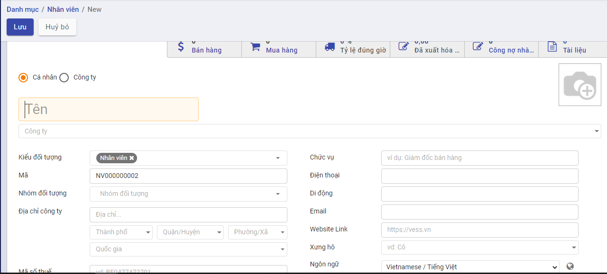
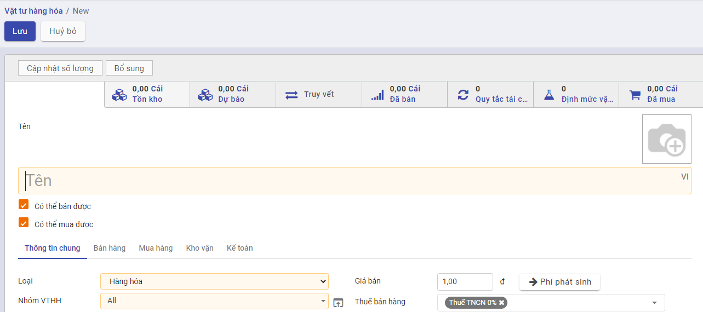
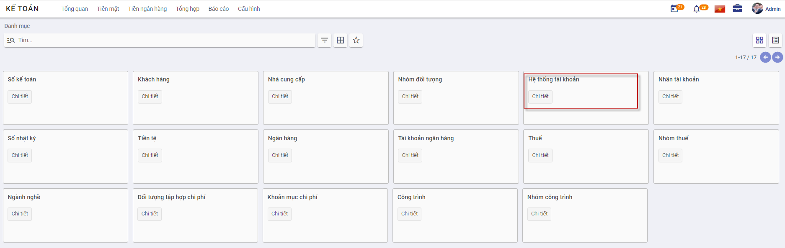
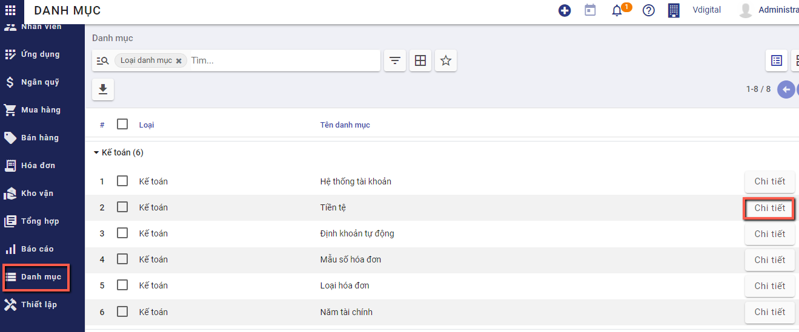

# **Khai báo danh mục**

Thực hiện hướng dẫn về các Danh mục cần khai báo trên ứng dựng Kế toán. Việc khai báo các Danh mục có thể được thực hiện tại bất kỳ thời điểm nào tùy thuộc người sử dụng: có thể trước thời điểm nhập chứng từ hay thực hiện được ngay tại thời điểm nhập chứng từ.

## ***Đối tượng***

### **Nhóm đối tượng**

**Mục đích**

Quản lý thông tin về các nhóm đối tượng khác nhau, phục vụ cho việc quản lý danh sách khách hàng và nhà cung cấp của doanh nghiệp.

Chức năng Danh mục **Nhóm đối tượng** được quản lý tập trung tại phần **Danh mục**

**Các bước thực hiện**

1. Vào **Danh mục**: chọn **Nhóm đối tượng** và nhấn nút **Chi tiết**

Thông tin **Danh mục Nhóm đối tượng** được hiển thị để người dùng khai báo

2. Để khai báo thêm Nhóm người dùng, người dùng nhấn nút **Tạo**Trên màn hình **Nhóm người dùng** và thực hiện Khai báo các thông tin: 

- Mã nhóm: Không trùng với Mã đã khai báo 
- Tên nhóm: Thông tin để quản lý

3. Nhấn nút **Lưu**

### **Khách hàng**

**Mục đích**

Chức năng này cho phép người dùng khai báo các Khách hàng của Công ty. Thực hiện Quản lý danh sách các khách hàng, phục vụ cho việc lập và hạch toán các chứng từ kế toán liên quan đến hoạt động bán hàng, hóa đơn.

Chức năng Danh mục **Khách hàng** được quản lý tập trung tại phần **Danh mục** của Phân hệ **Kế toán**

**Xem video hướng dẫn**

<iframe
    width="920"
    height="450"
    frameborder="0"
    allow="autoplay; encrypted-media; clipboard-write; gyroscope; picture-in-picture "
    allowfullscreen
    title="Khách hàng" 
    src="https://www.youtube.com/embed/8Vc3XBoIIdU"
></iframe>

**Hướng dẫn trên phần mềm**

**Bước 1**: Vào Danh mục/Đối tượng/Khách hàng. Nhấn **Chi tiết** để vào danh mục

**Bước 2**: Nhấn nút **tạo ** để thực hiên thêm mới khách hàng 

Bước 3: Nhập đủ thông tin cần thiết:

- Nếu khách hàng là một cá nhân thực hiện chọn **Cá nhân** nếu khách hàng là một công ty, thực hiện chọn **Công ty**

- Nhập tên khách hàng hoặc tên công ty

- Chọn công ty nếu khách hàng  thuộc một công ty bên ngoài

- Chọn kiểu đối tượng bổ sung nếu khách hàng đó vừa là khách hàng hoặc vừa là nhà cung cấp

- Nhập địa chỉ, mã số thuế. Nếu chọn **Công ty** thì địa chỉ và mã số thuế  mặc định bằng  địa chỉ, mã số thuế của công ty đã chọn

- Nhập thông tin chức vụ, số điện thoại, số di động , email, website, xưng hô

- Thay đổi ảnh đại diện của khách hàng bằng cách nhấn nút  và lựa chọn ảnh đại diện mong muốn

- Có thể bổ sung thêm địa chỉ liên lạc của khách hàng bằng cách vào nhóm **Các liên lạc & địa chỉ**, thêm mới địa chỉ

  

Một cửa sổ mới hiện ra, nhập đủ thông tin địa chỉ và chọn **Lưu**

- Nội dung khai báo tại **Lên hóa đơn**: 
  - Thông tin **Ngân hàng và Số tài khoản**: Doanh nghiệp có giao dịch Mua hàng/Bán hàng với Khách hàng và thực hiện Thanh toán: thông tin Số tài khoản đã khai báo sẽ được hiển thị để Kế toán thực hiện chọn và Thanh toán

**Bước 3**: Nhấn nút **Lưu** để lưu lại thông tin nhân viên đã nhập

Sau khi lưu thành công, trên mỗi một khách hàng, người dùng có thể theo dõi được một số thông tin đi kèm như:

Số đơn bán hàng, đơn mua hàng được tạo

Thông tin giao hàng

Số hóa đơn đã xuất

Công nợ nhà cung cấp

Tài  liệu đính kèm

Khi nhấn vào các Đầu mục theo dõi, hệ thống tự động Truy vết các Giao dịch gắn đã thực hiện với Khách hàng

**Lưu ý**:

- Để sửa lại thông tin khách hàng đã khai báo, sử dụng chức năng **Sửa** trên thanh công cụ.

- Khách hàng đã được sử dụng tại các chứng từ kế toán khác sẽ không được xóa

### **Nhà cung cấp**

**Mục đích**

Quản lý danh sách các nhà cung cấp, phục vụ cho việc lập và hạch toán các chứng từ kế toán liên quan đến hoạt động mua hàng hoá, dịch vụ.

**Xem video hướng dẫn**

<iframe
    width="920"
    height="450"
    frameborder="0"
    allow="autoplay; encrypted-media; clipboard-write; gyroscope; picture-in-picture "
    allowfullscreen
    title="Nhà cung cấp" 
    src="https://www.youtube.com/embed/wp4FJTTlTus"
></iframe>

**Hướng dẫn trên phần mềm**

- **Bước 1**: Vào Danh mục/Đối tượng/Nhà cung cấp. Nhấn **Chi tiết** để vào danh mục

  

  **Bước 2**: Nhấn nút **tạo ** để thực hiên thêm mới nhà cung cấp

  

  Bước 3: Nhập đủ thông tin cần thiết:

  

  - Nếu nhà cung cấp là một cá nhân thực hiện chọn **Cá nhân** nếu khách hàng là một công ty, thực hiện chọn **Công ty**

  - Nhập tên nhà cung cấp hoặc tên công ty

  - Chọn công ty nếu nhà cung cấp  thuộc một công ty bên ngoài

  - Chọn kiểu đối tượng bổ sung nếu nhà cung cấp đó vừa là khách hàng hoặc vừa là nhà cung cấp

  - Nhập địa chỉ, mã số thuế. Nếu chọn **Công ty** thì địa chỉ và mã số thuế  mặc định bằng  địa chỉ, mã số thuế của công ty đã chọn

  - Nhập thông tin chức vụ, số điện thoại, số di động , email, website, xưng hô

  - Thay đổi ảnh đại diện của nhà cung cấp bằng cách nhấn nút  và lựa chọn ảnh đại diện mong muốn

  - Có thể bổ sung thêm địa chỉ liên lạc của nhà cung cấp bằng cách vào nhóm **Các liên lạc & địa chỉ**, thêm mới địa chỉ

    

  Một cửa sổ mới hiện ra, nhập đủ thông tin địa chỉ và chọn **Lưu**

  

  - Nội dung khai báo tại **Lên hóa đơn**: 
    - Thông tin **Ngân hàng và Số tài khoản**: Doanh nghiệp có giao dịch Mua hàng/Bán hàng với Khách hàng và thực hiện Thanh toán: thông tin Số tài khoản đã khai báo sẽ được hiển thị để Kế toán thực hiện chọn và Thanh toán

  

  **Bước 3**: Nhấn nút **Lưu** để lưu lại thông tin nhân viên đã nhập

  Sau khi lưu thành công, trên mỗi một khách hàng, người dùng có thể theo dõi được một số thông tin đi kèm như:

  Số đơn bán hàng, đơn mua hàng được tạo

  Thông tin giao hàng

  Số hóa đơn đã xuất

  Công nợ nhà cung cấp

  Tài  liệu đính kèm

  Khi nhấn vào các Đầu mục theo dõi, hệ thống tự động Truy vết các Giao dịch gắn đã thực hiện với Nhà cung cấp

  

  **Lưu ý**:

  - Để sửa lại thông tin nhà cung cấp đã khai báo, sử dụng chức năng **Sửa** trên thanh công cụ.

  - Nhà cung cấp đã được sử dụng tại các chứng từ kế toán khác sẽ không được xóa

### Nhân viên

Danh mục nhân viên quản lý thông tin về các nhóm đối tượng khác nhau, phục vụ cho việc quản lý danh sách nhân viên của doanh nghiệp

**Xem video hướng dẫn**

<iframe
    width="920"
    height="450"
    frameborder="0"
    allow="autoplay; encrypted-media; clipboard-write; gyroscope; picture-in-picture "
    allowfullscreen
    title="Nhân viên" 
    src="https://www.youtube.com/embed/1xq8AI3ppo4"
></iframe>

**Hướng dẫn trên phần mềm**

**Bước 1**: Vào Danh mục/Đối tượng/Nhân viên. Nhấn **Chi tiết** để vào danh mục

**Bước 2**: Nhấn nút **tạo ** để thực hiên thêm mới nhân viên 

Bước 3: Nhập đủ thông tin cần thiết:

- Nhập tên nhân viên

- Chọn công ty nếu nhân viên thuộc công ty ngoài

- Chọn kiểu đối tượng nếu nhân viên đó vừa là khách hàng hoặc vừa là nhà cung cấp

- Nhập địa chỉ, mã số thuế. Nếu chọn **Công ty** thì địa chỉ và mã số thuế  mặc định bằng  địa chỉ, mã số thuế của công ty đã chọn

- Nhập thông tin chức vụ, số điện thoại, số di động , email, website, xưng hô

- Thay đổi ảnh đại diện của nhân viên bằng cách nhấn nút  và lựa chọn ảnh đại diện mong muốn

- Có thể bổ sung thêm địa chỉ liên lạc của nhân viên bằng cách vào nhóm **Các liên lạc & địa chỉ**, thêm mới địa chỉ

  

Một cửa sổ mới hiện ra, nhập đủ thông tin địa chỉ và chọn **Lưu**

- Nội dung khai báo tại **Lên hóa đơn**: 
  - Thông tin **Ngân hàng và Số tài khoản**: Doanh nghiệp có giao dịch Mua hàng/Bán hàng với Khách hàng và thực hiện Thanh toán: thông tin Số tài khoản đã khai báo sẽ được hiển thị để Kế toán thực hiện chọn và Thanh toán

**Bước 3**: Nhấn nút **Lưu** để lưu lại thông tin nhân viên đã nhập

Sau khi lưu thành công, trên mỗi một khách hàng, người dùng có thể theo dõi được một số thông tin đi kèm như:

Số đơn bán hàng, đơn mua hàng được tạo

Thông tin giao hàng

Số hóa đơn đã xuất

Công nợ nhà cung cấp

Tài  liệu đính kèm

Khi nhấn vào các Đầu mục theo dõi, hệ thống tự động Truy vết các Giao dịch gắn đã thực hiện với Nhân viên

**Lưu ý**:

- Để sửa lại thông tin nhân viên đã khai báo, sử dụng chức năng **Sửa** trên thanh công cụ.

- Nhân viên đã được sử dụng tại các chứng từ kế toán khác sẽ không được xóa

## *Hàng hóa vật tư*

Nhóm **danh mục** **hàng hóa vật tư** cho phép người dùng:

- Thiết lập các đơn vị tính, phục vụ cho việc khai báo vật tư hàng hoá
- Thiết lập các nhóm phục vụ cho công tác quản lý vật tư, hàng hoá
- Quản lý các kho vật tư, hàng hoá của đơn vị
- Quản lý danh sách vật tư, hàng hoá, công cụ dụng cụ của đơn vị

### **Nhóm VTHH**

**Mục đích**

Hệ thống đã thiết lập sẵn danh sách một số danh mục nhóm vật tư, hàng hoá, phục vụ cho việc quản lý vật tư, hàng hoá của doanh nghiệp. Tuy nhiên, Kế toán của Doanh nghiệp vẫn có thể bổ sung, sửa đổi lại nhóm vật tư, hàng hoá sao cho phù hợp với nhu cầu quản lý thực tế tại doanh nghiệp.

Chức năng Danh mục **Nhóm Vật tư hàng hóa** được quản lý tập trung tại phần **Danh mục**

**Các bước thực hiện**

1. Vào Danh mục: chọn **Nhóm VTHH** và nhấn nút **Chi tiết**

Thông tin **Nhóm VTHH** được hiển thị để người dùng khai báo

2. Để khai báo thêm Nhóm người dùng, người dùng nhấn nút **Tạo**Trên màn hình **Nhóm VTHH** và thực hiện Khai báo các thông tin: 

3. Nhấn nút **Lưu**

**Lưu ý:**

- Nhấn **Sửa**: Nếu muốn thay đổi thông tin Nhóm sản phẩm đã khai báo
- Với các Nhóm sản phẩm không có nhu cầu theo dõi tiếp, sử dụng chức năng **Sửa** và Bỏ chọn **'Có hiệu lực'**

### **Vật tư hàng hóa**

Danh mục vật tư, hàng hoá cho phép quản lý toàn bộ vật tư, hàng hoá, thành phẩm, dịch vụ của doanh nghiệp, phục vụ cho việc lập và hạch toán các chứng từ liên quan đến hoạt động mua, bán hàng hoá, nhập xuất kho vật tư, hàng hoá, CCDC

**Xem video hướng dẫn**

<iframe
    width="920"
    height="450"
    frameborder="0"
    allow="autoplay; encrypted-media; clipboard-write; gyroscope; picture-in-picture "
    allowfullscreen
    title="Vật tư hàng hóa" 
    src="https://www.youtube.com/embed/iP95ifOOT7s"
></iframe>

**Hướng dẫn trên phần mềm**

#### Khai báo vật tư, hàng hóa thông thường

**Bước 1**: Vào Danh mục/Hàng hóa vật tư/Vật tư hàng hóa. Nhấn **Chi tiết** để vào danh mục

**Bước 2**: Tại màn hình danh sách, Nhấn nút **tạo ** để thực hiên thêm mới hàng hóa

**Bước 3**: Khai báo các thông tin chi tiết về vật tư, hàng hoá => với các thông tin có màu hồng,  phần mềm sẽ bắt buộc phải khai báo.

- Nhập **tên** hàng hóa đang sử dụng

- Chọn **loại hàng hóa** theo yêu cầu, có thể là hàng hóa, công cụ dụng cụ, nguyên vật liệu, thành phẩm

- Chọn **nhóm vật tư hàng hóa**. Tùy thuộc vào tính chất hàng hóa để chọn nhóm VTHH phù hợp. Thông tin nhóm VTHH sẽ ảnh hưởng đến cách hạch toán lên bút toán

​	Nếu hàng đang nhập thuộc loại hàng hóa, thành phẩm thì chọn nhóm VTHH là hàng hóa. 

​	Nếu hàng đang nhập thuộc loại nguyên vật liệu thì chọn nhóm VTHH là nguyên vật liệu.

- Chọn **ngành nghề kinh doanh** phù hợp với hàng hóa đang nhập. Sau khi chọn, phần mềm tự động hiển thị loại thuế áp dụng cho hàng hóa

- Nhập thông tin **giá bán, giá vốn** nếu có. Thông tin này sẽ được hiển thị tại đơn bán hàng, đơn mua hàng khi người dùng chọn tới sản phẩm có chứa giá bán, giá vốn. 

  Lưu ý: Giá vốn sẽ được thay đổi tùy theo cách thức xuất - nhập kho đang được sử dụng tại nhóm VTHH

- Chọn **đơn vị tính** phù hợp với hàng hóa đang nhập

**Bước 4:** Nhấn **Lưu** để lưu lại thông tin

#### Khai báo các mặt hàng dịch vụ

Áp dụng với những hàng hoá không có nhu cầu quản lý số lượng tồn trên kho, nhưng vẫn phát sinh hoạt động mua, bán (VD: chi phí mua hàng, chi phí vận chuyển, chi phí hải quan...)

Khi đó, kế toán sẽ thực hiện khai báo tương tự như với VTHH thông thường ở trên nhưng khác biệt ở thông tin sau:

- **Loại** hàng hóa là Dịch vụ.

- **Nhóm VTHH** là chi phí hoặc dịch vụ

#### Khai báo tồn hàng đầu kỳ

Sau khi tạo mới được hàng hóa vật tư, người dùng có thể khai báo số lượng mặt hàng tồn đầu kỳ hiện có ngoài thực tế

**Bước 1:** Vào danh mục hàng hóa vật tư, thực hiện tìm kiếm hàng hóa cần khai báo đầu kỳ

**Bước 2:** Xem chi tiết hàng hóa

Nhấn nút **cập nhật số lượng**, cửa sổ "Cập nhật số lượng" được hiển thị. Nhấn nút **tạo** mới

Người dùng thực hiện chọn **kho**, nhập **số lượng thực tế** cho khớp với số liệu còn tồn ngoài thực tế, nhấn Lưu

### **Kho hàng** 

**Mục đích**

Quản lý danh sách các kho vật tư, hàng hoá, phục vụ cho công tác khai báo vật tư, hàng hoá trong doanh nghiệp.

Chức năng Danh mục **Kho hàng** được quản lý tập trung tại phần **Danh mục** của Phân hệ **Kho vận**

**Các bước thực hiện**

1. Vào phân hệ **Kho vận**; chọn chức năng **Cấu hình**: chọn **Kho hàng** 

2. Để khai báo thêm **Kho hàng**, người dùng nhấn nút **Tạo**Trên màn hình **Kho hàng** và thực hiện Khai báo các thông tin: 

3. Nhấn nút **Lưu**

**Lưu ý:**

Nhấn **Sửa**: Nếu muốn thay đổi thông tin kho hàng đã khai báo

Sau khi kho hàng được tạo thành công, hệ thống tự động tạo  vị trí kho và các kiểu nhập xuất hàng hóa tương ứng với kho đó

### Kho

**Mục đích**

Quản lý danh sách các địa điểm kho vật tư, hàng hoá, phục vụ cho công tác khai báo vật tư, hàng hoá trong doanh nghiệp.

Chức năng Danh mục **Kho** được quản lý tập trung tại phần **Danh mục** của Phân hệ **Kho vận**

Kho có thể được tạo mặc định khi người dùng khai báo kho hàng mới tại **Danh mục/Kho hàng**

**Các bước thực hiện**

1. Vào phân hệ **Kho vận**; chọn chức năng **Cấu hình**: chọn **Kho** hoặc vào **Danh mục/hàng hóa vật tư/Kho**

2. Để khai báo thêm **Kho**, người dùng nhấn nút **Tạo**Trên màn hình **Kho** và thực hiện Khai báo các thông tin: 

   Tên địa điểm kho

   Đơn vị của kho

   Chọn loại địa điểm kho

3. Nhấn nút **Lưu**

**Lưu ý:**

Nhấn **Sửa**: Nếu muốn thay đổi thông tin kho hàng đã khai báo

### Kiểu giao nhận

**Mục đích**

Quản lý danh sách các loại hình nhập/xuất hàng hóa,vật tư phục vụ cho việc quản lý, kiểm kê hàng trong kho.

Chức năng Danh mục **Kiểu giao nhận** được quản lý tập trung tại phần **Danh mục** của Phân hệ **Kho vận**

Kiểu giao nhận có thể được tạo mặc định khi người dùng khai báo kho hàng mới tại **Danh mục/Kho hàng** hoặc người dùng tự thêm mới

**Các bước thực hiện**

1. Vào phân hệ **Kho vận**; chọn chức năng **Cấu hình**: chọn **Kiểu giao nhận**  hoặc vào **Danh mục/hàng hóa vật tư/Loại hoạt động**

2. Để khai báo thêm **Kiểu giao nhận**, người dùng nhấn nút **Tạo**Trên màn hình  và thực hiện Khai báo các thông tin: 

   Kiểu hoạt động: Nhập tên kiểu nhập.xuất

   Đơn vị:  Đơn vị của kiểu hoạt động sẽ dùng

   Mã: Mã của loại nhập/xuất

   Loại hoạt động: Chọn loại Nhập hoặc loại Xuất

   Loại nhập/xuất: Chi tiết hình thức nhập hoặc xuất

   Tài khoản nợ: Chọn tài khoản hạch toán

   Tài khoản có: Chọn tài khoản hạch toán

   Điểm đi mặc định: Kho sẽ xuất hàng đi

   Điểm đích mặc định: Kho hàng sẽ nhập vào

   

3. Nhấn nút **Lưu**

**Lưu ý:**

Nhấn **Sửa**: Nếu muốn thay đổi thông tin kho hàng đã khai báo

### Quy tắc sắp xếp

**Các bước thực hiện**

1. Vào phân hệ **Kho vận**; chọn chức năng **Cấu hình**: chọn **Quy tắc sắp xếp**  

2. Để khai báo thêm **Quy tắc sắp xếp**, người dùng nhấn nút **Tạo**Trên màn hình  và thực hiện Khai báo các thông tin:

3. Nhấn nút **Lưu**

### Quy tắc tái cung ứng

**Các bước thực hiện**

1. Vào phân hệ **Kho vận**; chọn chức năng **Cấu hình**: chọn **Quy tắc tái cung ứng**  

2. Để khai báo thêm **Quy tắc tái cung ứng**, người dùng nhấn nút **Tạo**Trên màn hình  và thực hiện Khai báo các thông tin:

3. Nhấn nút **Lưu**

### Nhóm đơn vị

**Các bước thực hiện**

1. Vào phân hệ **Kho vận**; chọn chức năng **Cấu hình**: chọn **Nhóm đơn vị**  

2. Để khai báo thêm **Nhóm đơn vị**, người dùng nhấn nút **Tạo**Trên màn hình  và thực hiện Khai báo các thông tin:

3. Nhấn nút **Lưu**

### Đơn vị

**Các bước thực hiện**

1. Vào phân hệ **Kho vận**; chọn chức năng **Cấu hình**: chọn **Đơn vị**  

2. Để khai báo thêm **Đơn vị**, người dùng nhấn nút **Tạo**Trên màn hình  và thực hiện Khai báo các thông tin:

3. Nhấn nút **Lưu**

## ***Kế toán***

### **Hệ thống tài khoản**

**Mục đích**

Quản lý toàn bộ thông tin Tài khoản của Doanh nghiệp sử dụng hệ thống Kế toán.

Hệ thống đã thiết lập sẵn hệ thống tài khoản theo đúng chế độ kế toán đã được chọn khi Cài đặt và chọn Chế độ kế toán tại thời điểm đầu. Kế toán doanh nghiệp vẫn có thể bổ sung, sửa đổi hoặc xóa bỏ các tài khoản đã có để phù hợp với yêu cầu quản lý thực tế của doanh nghiệp. 

Chức năng Danh mục **Hệ thống tài khoản** được quản lý tập trung tại phần **Danh mục** của phân hệ **Kế toán**

**Các bước thực hiện**

1. Vào Danh mục: chọn **Hệ thống tài khoản** và nhấn nút **Chi tiết**

Thông tin **Hệ thống tài khoản** được hiển thị để người dùng khai báo

2. Để khai báo thêm Nhóm người dùng, người dùng nhấn nút **Tạo** trên màn hình **Hệ thống tài khoản** và thực hiện Khai báo các thông tin: 

- Sau khai báo về Mã và Tên tài khoản; người dùng thực hiện Thiết lập thông tin cho tài khoản đã khai
- Việc thiết lập sẽ liên quan đến toàn bộ luồng dữ liệu hạch toán về sau của 1 tài khoản

3. Nhấn nút **Lưu**

**Lưu ý:**

- Nhấn **Sửa**: Nếu muốn thay đổi thông tin Tài khoản đã khai báo
- Với các Tài khoản không có nhu cầu theo dõi tiếp, sử dụng chức năng **Sửa** và Bỏ chọn **'Có hiệu lực'**

### **Tiền tệ**

**Mục đích**

Quản lý toàn bộ thông tin Tiền tệ của Doanh nghiệp sử dụng hệ thống Kế toán.

Hệ thống đã thiết lập sẵn các Loại Tiền tệ trên thị trường. Muốn sử dụng Loại tiền nào thì Kế toán vào chuyển trạng thái Hiệu lực và khai báo thông tin Tỷ giá cho Loại tiền theo đúng thực tế.

Chức năng Danh mục **Tiền tệ** được quản lý tập trung tại phần **Danh mục** của phân hệ **Kế toán**

**Các bước thực hiện**

1. Vào Danh mục: chọn **Tiền tệ** và nhấn nút **Chi tiết**

Thông tin **Tiền tệ** được hiển thị để người dùng khai báo

2. Để đưa vào hoạt động Loại tiền tệ đã có, người dùng chọn thông tin Tiền tệ đó và nhấn nút **Sửa** trên màn hình **Tiền tệ** và thực hiện Cập nhật các thông tin: 

3. Nhấn nút **Lưu**

**Lưu ý:**

- Với các Tiền tệ không có nhu cầu theo dõi tiếp, sử dụng chức năng **Sửa** và Bỏ chọn **'Có hiệu lực'**

### Mẫu số hóa đơn

**Bước 1**: Vào Danh mục/Kế toán/Mẫu số hóa đơn. Nhấn **Chi tiết** để vào danh mục

**Bước 2**: Tại màn hình danh sách, Nhấn nút **tạo ** để thực hiên thêm mới mẫu số

**Bước 3**: Khai báo các thông tin chi tiết về mẫu số hóa đơn

- Nhập đơn vị
- Chọn loại hóa đơn cần sử dụng
- Nhập mẫu số hóa đơn, ký hiệu hóa đơn theo yêu cầu

**Bước 4:** Nhấn **Lưu** để lưu lại thông tin

## ***Ngân hàng***

### **Ngân hàng**

**Mục đích**

Hệ thống đã thiết lập sẵn danh sách các ngân hàng thường được các doanh nghiệp lựa chọn. Tuy nhiên, Kế toán của Doanh nghiệp vẫn có thể bổ sung, sửa đổi hoặc xóa bỏ các ngân hàng đã có sao cho phù hợp với yêu cầu quản lý thực tế của doanh nghiệp.

Chức năng Danh mục **Ngân hàng** được quản lý tập trung tại phần **Danh mục**

**Các bước thực hiện**

1. Vào  **Danh mục**: chọn **Ngân hàng** và nhấn nút **Chi tiết**

Thông tin **Ngân hàng** được hiển thị để người dùng khai báo

2. Để khai báo thêm Nhóm người dùng, người dùng nhấn nút **Tạo** trên màn hình **Ngân hàng** và thực hiện Khai báo các thông tin: 

- Mã Ngân hàng: Không trùng với Mã đã khai báo 
- Tên Ngân hàng: Thông tin để quản lý
- Địa chỉ Ngân hàng
- Đánh dấu Sổ quỹ hay Sổ tiền mặt

3. Nhấn nút **Lưu**

**Lưu ý:**

- Nhấn **Sửa**: Nếu muốn thay đổi thông tin Ngân hàng đã khai báo
- Với các ngân hàng không có nhu cầu theo dõi tiếp, sử dụng chức năng **Sửa** và Bỏ chọn **'Có hiệu lực'**

### **Tài khoản ngân hàng**

**Mục đích**

Quản lý danh sách các tài khoản ngân hàng, phục vụ cho việc lập và hạch toán các chứng từ kế toán liên quan đến tiền gửi ngân hàng..

Chức năng Danh mục **Tài khoản ngân hàng** được quản lý tập trung tại phần **Danh mục**

**Các bước thực hiện**

1. Vào Danh mục: chọn **Tài khoản ngân hàng** và nhấn nút **Chi tiết**

Thông tin **Tài khoản ngân hàng** được hiển thị để người dùng khai báo

2. Để khai báo thêm Nhóm người dùng, người dùng nhấn nút **Tạo**Trên màn hình **Tài khoản ngân hàng** và thực hiện Khai báo các thông tin: 

- Số tài khoản và Ngân hàng của Tài khoản
- Thông tin Loại tài khoản ngân hàng

3. Nhấn nút **Lưu**

**Lưu ý:**

- Nhấn **Sửa**: Nếu muốn thay đổi thông tin Tài khoản Ngân hàng đã khai báo
- Với các Tài khoản ngân hàng không có nhu cầu theo dõi tiếp, sử dụng chức năng **Sửa** và Bỏ chọn **'Có hiệu lực'**

## ***Thuế***

*[Các chức năng liên quan đến quản lý về Thuế]*

### **Nhóm thuế**

### **Thuế**

## ***Chi phí***

### **Đối tượng tập hợp chi phí**

**Mục đích**

Quản lý danh sách đối tượng tập hợp chi phí, phục vụ cho công tác tập hợp chi phí sản xuất và tính giá thành..

Chức năng Danh mục **Đối tượng tập hợp chi phí** được quản lý tập trung tại phần **Danh mục** của Phân hệ **Kế toán**

**Các bước thực hiện**

1. Vào Danh mục: chọn **Đối tượng tập hợp chi phí** và nhấn nút **Chi tiết**

Thông tin **Đối tượng tập hợp chi phí** được hiển thị để người dùng khai báo

2. Để khai báo thêm Đối tượng tập hợp chi phí, người dùng nhấn nút **Tạo** trên màn hình **Đối tượng tập hợp chi phí** và thực hiện Khai báo các thông tin: 

3. Nhấn nút **Lưu**

**Lưu ý:**

- Nhấn **Sửa**: Nếu muốn thay đổi thông tin Đối tượng tập hợp chi phí đã khai báo
- Với các Đối tượng tập hợp chi phí không có nhu cầu theo dõi tiếp, sử dụng chức năng **Sửa** và Bỏ chọn **'Có hiệu lực'**

### **Khoản mục chi phí**

**Mục đích**

Quản lý các khoản mục chi phí phục vụ cho công tác tập hợp chi phí sản xuất và tính giá thành theo Thông tư 133, đồng thời phục vụ cho việc xem báo cáo thống kê theo khoản mục chi phí.

Chức năng Danh mục **Khoản mục chi phí** được quản lý tập trung tại phần **Danh mục** của Phân hệ **Kế toán**

**Các bước thực hiện**

1. Vào Danh mục: chọn **Khoản mục chi phí** và nhấn nút **Chi tiết**

Thông tin **Khoản mục chi phí** được hiển thị để người dùng khai báo

2. Để khai báo thêm Khoản mục chi phí, người dùng nhấn nút **Tạo** trên màn hình **Khoản mục chi phí** và thực hiện Khai báo các thông tin: 

3. Nhấn nút **Lưu**

**Lưu ý:**

- Nhấn **Sửa**: Nếu muốn thay đổi thông tin Khoản mục chi phí phí đã khai báo
- Với các Khoản mục chi phí không có nhu cầu theo dõi tiếp, sử dụng chức năng **Sửa** và Bỏ chọn **'Có hiệu lực'**

## ***Chứng từ, sổ sách***

### **Sổ kế toán**

**Mục đích**

Được tạo ra trong trường hợp Doanh nghiệp cần quản lý dữ liệu hạch toán trên nhiều Sổ

Tại mỗi chức năng liên quan đến Nghiệp vụ vào sổ hệ thống sẽ có thông tin để Người dùng chọn. Khi dữ liệu đã được gắn vào từng Sổ kế toán riêng biệt, Kế toán doanh nghiệp có thể quản trị được dữ liệu theo từng Sổ.

Chức năng Danh mục **Sổ kế toán** được quản lý tập trung tại phần **Danh mục**

**Các bước thực hiện**

1. Vào **Danh mục**: chọn **Sổ kế toán** và nhấn nút **Chi tiết**

Thông tin **Danh mục Sổ kế toán** được hiển thị để người dùng khai báo

2. Để khai báo thêm Sổ, người dùng nhấn nút **Tạo**Trên màn hình **Sổ kế toán** và thực hiện Khai báo các thông tin: 

- Mã sổ: Không trùng với Mã đã khai báo 
- Chi nhánh: Khai báo áp dụng nhiều Sổ cho chi nhánh cụ thể, hoặc để trống để áp dụng khai báo cho toàn Công ty
- Tên sổ: Thông tin để quản lý

3. Nhấn nút **Lưu**

### **Nhóm chứng từ**

**Mục đích**

Chức năng này cho phép người dùng khai báo Nhóm chứng từ sử dụng trên hệ thống

**Các bước thực hiện**

1. Vào **Danh mục\Nhóm chứng từ**, nhấn ***Chi tiết***

2. Khai báo các thông tin chi tiết của Nhóm chứng từ 

- Mã nhóm: Không trùng với Mã đã khai báo 
- Tên nhóm: Thông tin để quản lý
- Model: quyết định việc lấy dữ liệu bút toán tại các phần hành
- Domain filter: Điều kiện để lọc dữ liệu, áp dụng cho phần Đánh CTGS

3. Nhấn nút **Lưu**
