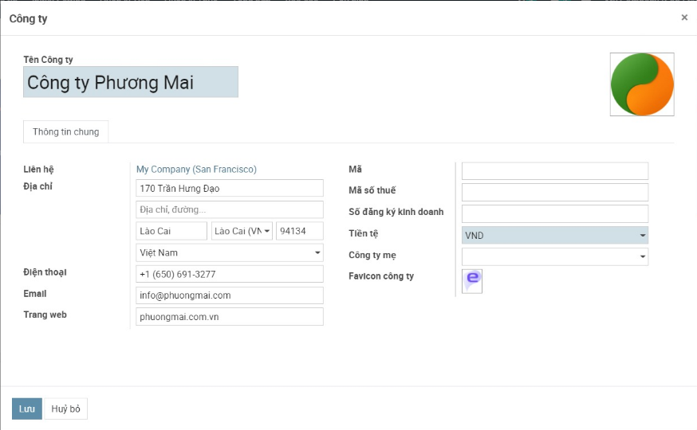

**Thiết lập và khai báo ban đầu**

Việc thiết lập và khai báo ban đầu được thực hiện khi lần đầu cài đặt hệ thống, giúp khởi tạo dữ liệu và bắt đầu cho việc thực hiện các nghiệp vụ kế toán

# **Thiết lập ban đầu**

Việc thiết lập ban đầu được thực hiện ngay tại thời điểm cài đặt xong Phân hệ kế toán: Đây là điều kiện cần có và bắt buộc để bắt đầu thực hiện các nghiệp vụ trên phân hệ Kế toán

- Dựa theo quy mô, đặc điểm kinh doanh và yêu cầu quản lý, Doanh nghiệp thực hiện lựa chọn Thông tư kế toán phù hợp.
- Lựa chọn Đồng tiền hạch toán áp dụng cho Doanh nghiệp; Kỳ kế toán; Phương pháp tính giá xuất kho và phương pháp thuế GTGT

Sau khi khai báo thiết lập ban đầu được Hoàn thành: hệ thống tài khoản và các chế độ kế toán cũng như biểu mẫu kế toán liên quan sẽ được áp dụng theo Thông tư và các thiết lập đã được lựa chọn 

# **Khai báo ban đầu**

Việc khai báo ban đầu được thực hiện tại thời điểm khai báo xong Thiết lập ban đầu hoặc trong quá trình thực hiện các nghiệp vụ kế toán, người dùng có thể bổ sung khai báo.

Các thông tin khai báo gồm 5 mục:

## **Thông tin công ty**

Khai báo dữ liệu về Công ty với đầy đủ thông tin về Tên, Địa chỉ, MST, email liên hệ, Trang web. 

## **Khai báo danh mục**

Hiển thị các danh mục cơ bản để người dùng có thể khai báo thông tin trước khi bắt đầu thực hiện nghiệp vụ kế toán

Việc khai báo này có thể thực hiện tại bất kỳ thời điểm nào: trước khi tiến hành Nhập hay ngay tại Thời điểm đang nhập Chứng từ

Để phục vụ cho việc cập nhập số dư ban đầu của dữ liệu kế toán, Người dùng nên khai báo trước một số một số Danh mục về Đối tượng, Nhân viên, Hàng hóa, Nhà cung cấp...

## **Cấu hình kế toán**

Hiển thị lại Chế độ kế toán đã chọn và khai báo bổ sung thêm thông tin mặc định áp dụng cho phần hành kế toán liên quan đến thuế

*[Bổ sung hình ảnh]*

## **Hệ thống tài khoản**

Hiển thị thông tin Hệ thống tài khoản theo Thông tư đã lựa chọn, có thể Chỉnh sửa, thay đổi để phù hợp với chế độ kế toán tại Doanh nghiệp

## **Nhập số dư ban đầu**

Người dùng nhập các thông tin số dư ban đầu cho các tài khoản 

Số dư ban đầu được lưu trữ độc lập giữa hai hệ thống **Sổ quản trị** và **Sổ tài chính**.

