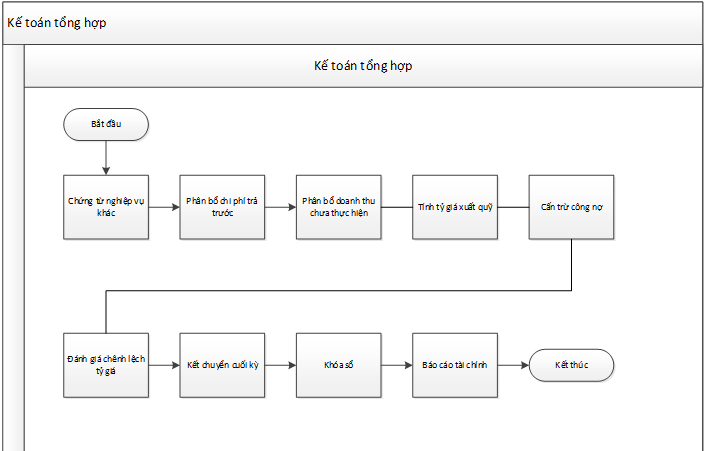
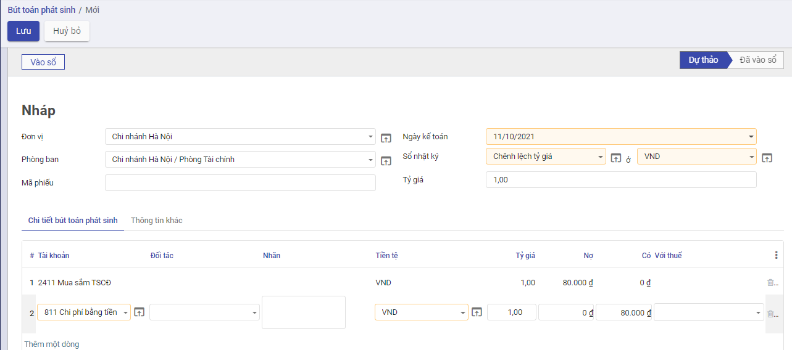
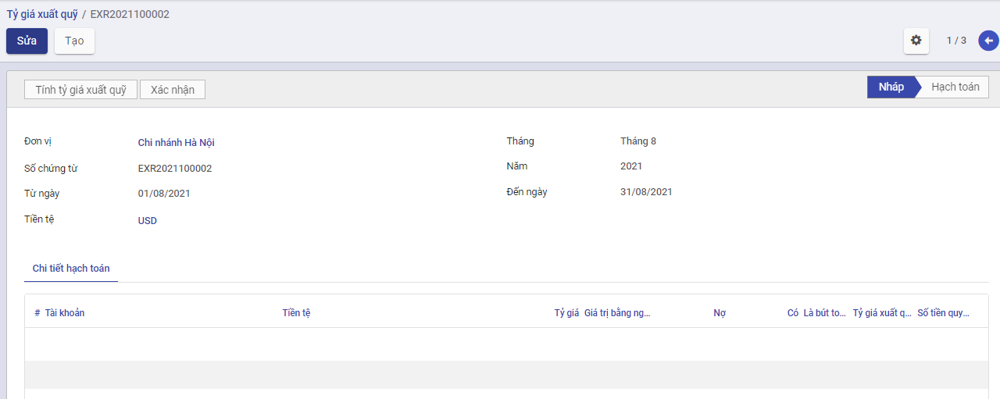
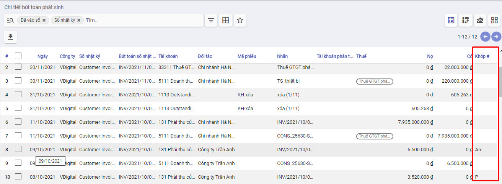
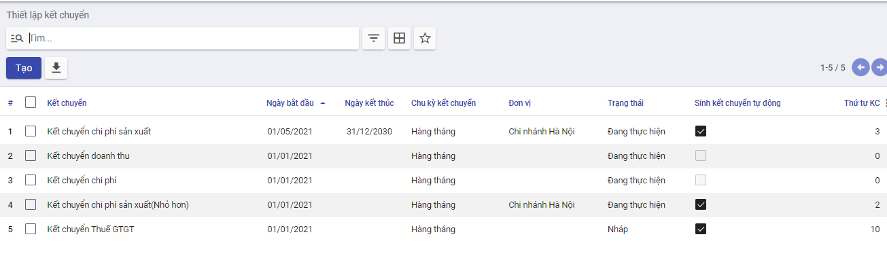
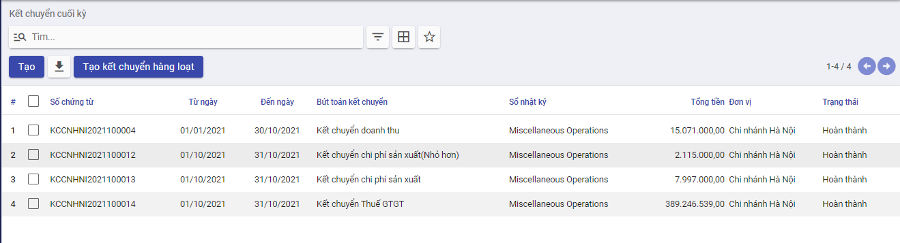

# *Quy trình nghiệp vụ*

**Quy trình nghiệp vụ**

Kế toán tổng hợp được sử dụng để  lưu trữ và phản ánh tổng quát dữ liệu kế toán của doanh nghiệp trên các hệ thống tài khoản, sổ kế toán và báo cáo tài chính theo các chỉ tiêu giá trị của doanh nghiệp, cập nhật các phiếu kế toán tổng quát, các bút toán điều chỉnh, phân bổ, đánh giá, kết chuyển cuối kỳ; thực hiện lên sổ sách kế toán và báo cáo tài chính theo quy định.

Quy trình kế toán tổng hợp bao gồm:

- Nhân viên kế toán tổng hợp thu thập số thông tin, chứng từ kế toán và các số liệu kế toán thông qua các nghiệp vụ kinh thế phát sinh thực tế  và xử lý những thông tin này
- Theo dõi, quản lý các quản công nợ của doanh nghiệp và xử lý công nợ
- Ghi chép các nghiệp vụ phát sinh và tài khoản và vào sổ sách kế toán của DN
- Đến cuối kỳ, kế toán tổng hợp sẽ thao tác gọi là “khóa sổ” và thực hiện lập báo cáo tài chính cuối kỳ cho doanh nghiệp

**Các luồng quy trình**

·     Lập chứng từ nghiệp vụ khác. Chi tiết nghiệp vụ **[tại đây](Chứng từ nghiệp vụ khác)**

·     Phân bổ chi phí trả trước. Chi tiết nghiệp vụ **[tại đây](Phân bổ chi phí trả trước)**

·     Phân bổ doanh thu chưa thực hiện. Chi tiết nghiệp vụ **[tại đây](Phân bổ doanh thu chưa thực hiện)**

·     Tính tỷ giá xuất quỹ. Chi tiết nghiệp vụ **[tại đây](Tính tỷ giá xuất quỹ)**

·     Cấn trừ công nợ. Chi tiết nghiệp vụ **[tại đây](Cấn trừ công nợ)**

·     Đánh giá chênh lệch tỷ giá. Chi tiết nghiệp vụ **[tại đây](Đánh giá tài khoản gốc ngoại tệ)**

·     Kết chuyển cuối kỳ. Chi tiết nghiệp vụ **[tại đây](Kết chuyển cuối kỳ)**

·     Khóa sổ. Chi tiết nghiệp vụ **[tại đây](Khóa sổ)**

## *Chứng từ nghiệp vụ khác*

### Mô tả nghiệp vụ

**Nghiệp vụ**

Chức năng cho phép kế toán hạch toán bút toán thủ công đối với những nghiệp vụ khác nằm ngoài luồng nghiệp vụ tự động của hệ thống

**Xem video hướng dẫn**

*[Xây dựng video hướng dẫn trên phần mềm, gồm đủ các luồng chức năng được mô tả bên dưới]*

### **Hướng dẫn trên phần mềm**

Đối tượng thực hiện: Kế toán tổng hợp

Bước 1: Vào phân hệ **Kế toán**, Chọn **Tổng hợp**, chọn **Danh sách bút toán** (Hoặc thực hiện **Tìm kiếm** trực tiếp chức năng trên ô tìm kiếm chung của hệ thống)

Bước 2: Nhấn thêm mới, thực hiện khai báo các thông tin của chứng từ nghiệp vụ khác

Nhập các thông tin chung của bút toán: Đơn vị, phòng ban, ngày hạch toán, sổ nhật ký

Tại tab **Chi tiết bút toán phát sinh**: Nhập các bút toán tương ứng với nghiệp vụ kinh tế phát sinh.

Bước 3: Nhấn **Lưu lại. ** Chọn **Vào sổ** để ghi nhận đã hạch toán

Bước 4 : Có thể in được chứng từ kế toán phản ánh nội dung nghiệp vụ kinh tế phát sinh bằng cách nhấn **In** và chọn mẫu chứng từ cần in.

## *Phân bổ chi phí trả trước*

### Mô tả nghiệp vụ

Chức năng **Phân bổ chi phí trả trước** được sử dụng trong các trường hợp sau:

- Doanh nghiệp có nhiều đơn vị muốn tập hợp được chi phí, xác định được lãi lỗ thực tế cho từng đơn vị.
- Doanh nghiệp muốn tập hợp được chi phí, xác định được lãi lỗ thực tế cho từng công trình/đơn hàng/hợp đồng.
- Doanh nghiệp hoạt động trong nhiều lĩnh vực sản xuất kinh doanh cần phân tách, hoặc các lĩnh vực chịu thuế TNDN khác nhau muốn tập hợp được chi phí, xác định được lãi lỗ thực tế cho từng lĩnh vực kinh doanh.

**Xem video hướng dẫn**

*[Xây dựng video hướng dẫn trên phần mềm, gồm đủ các luồng chức năng được mô tả bên dưới]*

### Hướng dẫn trên phần mềm

[Mô tả cụ thể các thao tác thực hiện]

## *Phân bổ doanh thu chưa thực hiện*

### Mô tả nghiệp vụ

**Xem video hướng dẫn**

*[Xây dựng video hướng dẫn trên phần mềm, gồm đủ các luồng chức năng được mô tả bên dưới]*

### Hướng dẫn trên phần mềm

[Mô tả cụ thể các thao tác thực hiện]

## *Tính tỷ giá xuất quỹ*

### Mô tả nghiệp vụ

**Nghiệp vụ**

Tính tỷ giá xuất quỹ cho phép tính tỷ giá xuất quỹ cho các chứng từ chi bằng ngoại tệ, giúp xác định tỷ giá xuất quỹ và xử lý chênh lệch giữa tỷ giá xuất quỹ và tỷ giá trên chứng từ gốc.

Việc tính tỷ giá xuất quỹ được thực hiện theo một trong hai trường hợp dưới đây:

- Tính tỷ giá xuất quỹ theo phương pháp bình quân tức thời: Mỗi lần thực hiện chi ngoại tệ bằng tiền mặt, tiền gửi, chương trình sẽ tự động xác định tỷ giá xuất quỹ trên chứng từ chi tiền khi áp dụng phương pháp này. Nếu như có phát sinh sửa chữa, thêm, bớt hoặc xóa các khoản thu, chi ngoại tệ,làm ảnh hưởng đến tỷ giá xuất quỹ, trên các chứng từ chi ngoại tệ đã lập,  kế toán sẽ thực hiện chức năng **Tính tỷ giá xuất quỹ**, để chương trình tự động tính lại tỷ giá xuất quỹ cho các chứng từ gốc.
- Tính tỷ giá xuất quỹ theo phương pháp bình quân cuối kỳ: Mỗi lần thực hiện chi ngoại tệ, chương trình sẽ không tự động xác định tỷ giá xuất quỹ trên chứng từ chi tiền khi áp dụng phương pháp này. Vào cuối kỳ, kế toán cần thực hiện chức năng **Tính tỷ giá xuất quỹ**, để xử lý chênh lệch giữa tỷ giá xuất quỹ và tỷ giá dùng để hạch toán.

**Xem video hướng dẫn**

*[Xây dựng video hướng dẫn trên phần mềm, gồm đủ các luồng chức năng được mô tả bên dưới]*

### Hướng dẫn trên phần mềm

#### Cấu hình phương pháp tính tỷ giá xuất quỹ

Tình tỷ giá xuất quỹ có 2 phương pháp thực hiện. Người dùng vào lựa chọn phương pháp sử dụng bằng cách vào phân hệ **Kế toán** , chọn **Cấu hình**, chọn **Thiết lập**. Tìm đến nhóm **Tiền tệ**, lựa chọn cho phép hệ thống **tính tỷ giá xuất quỹ** và chọn **Phương pháp tính tỷ giá**

Việc tính tỷ giá xuất quỹ được thực hiện theo một trong hai trường hợp dưới đây:

#### Tính tỷ giá xuất quỹ 

Đối tượng thực hiện: Kế toán tổng hợp

Bước 1: Vào phân hệ **Kế toán**, Chọn **Tổng hợp**, chọn **Tỷ giá xuất quỹ** (Hoặc thực hiện **Tìm kiếm** trực tiếp chức năng trên ô tìm kiếm chung của hệ thống)

Bước 2: Thêm mới, nhập tháng,năm, tiền tệ cần thực hiện tính tỷ giá, nhấn lưu

Bước 3: Nhấn **Tính tỷ giá xuất quỹ** . Chương trình sẽ tự động cập nhật tỷ giá xuất quỹ mới và số tiền chênh lệch vào các chứng từ chi ngoại tệ đã lập. 

## *Cấn trừ công nợ*

### Mô tả nghiệp vụ

Chức năng thực hiện đối trừ chứng từ công nợ với chứng từ thanh toán và bù trừ công nợ phải thu/phải trả để quản lý những khoản thừa/thiếu phải thu/phải trả theo đối tượng hoặc thực hiện  bù trừ công nợ phải thu và công nợ phải trả của một đối tượng (khách hàng, nhà cung cấp, nhân viên) vừa là khách hàng, vừa là nhà cung cấp

**Xem video hướng dẫn**

*[Xây dựng video hướng dẫn trên phần mềm, gồm đủ các luồng chức năng được mô tả bên dưới]*

### Hướng dẫn trên phần mềm

Đối tượng thực hiện: Kế toán tổng hợp

#### Đối trừ chứng từ

Bước 1: Vào phân hệ **Kế toán**, Chọn nhóm **Tổng hợp** , chọn chức năng **Cấn trừ công nợ** (Hoặc thực hiện **Tìm kiếm** trực tiếp chức năng trên ô tìm kiếm chung của hệ thống)

Bước 2: Lựa chọn loại chứng từ = **Đối trừ chứng từ**, đối tác, tài khoản, tiền tệ => Chương trình sẽ tự động liệt kê các chứng từ thanh toán và chứng từ công nợ thoả mãn điều kiện đã chọn

Bước 3: Chọn các chứng từ thanh toán được đối trừ cho các chứng từ công nợ bằng cách click button **Cấn trừ**.Hệ thống sẽ đẩy thông tin số tiền cấn trừ còn lại sang tab khác. Người dùng sẽ thực hiện tạo bút toán thủ công để xóa số chênh lệch trên tab **Khác** hoặc thực hiện cấn trừ theo số nhỏ hơn và phần chênh lệch sẽ được mở để cấn trừ lần sau

Bước 4: Nhấn **Cấn trừ**.

***Lưu ý:** Khi thực hiện đối trừ công nợ cho loại tiền ngoại tệ, nếu có phát sinh chênh lệch tỷ giá giữa chứng từ thanh toán và chứng từ công nợ, sau khi nhấn chọn **Cấn trừ**, chương trình sẽ tự động sinh ra chứng từ xử lý chênh lệch tỷ giá.*

#### Bù trừ công nợ

Bước 1: Vào phân hệ **Kế toán**, Chọn nhóm **Tổng hợp** , chọn chức năng **Cấn trừ công nợ** (Hoặc thực hiện **Tìm kiếm** trực tiếp chức năng trên ô tìm kiếm chung của hệ thống)

Bước 2: Lựa chọn loại chứng từ = **Bù trừ công nợ**, đối tác,tiền tệ, tài khoản, bù trừ với tài khoản => Chương trình sẽ tự động liệt kê các chứng từ thanh toán và chứng từ công nợ thoả mãn điều kiện đã chọn

Bước 3: Chọn các chứng từ thanh toán được bùtrừ cho các chứng từ công nợ bằng cách click button **Cấn trừ**.Hệ thống sẽ đẩy thông tin số tiền bù trừ còn lại sang tab khác. Người dùng sẽ thực hiện tạo bút toán thủ công để xóa số chênh lệch trên tab **Khác** hoặc thực hiện bù trừ theo số nhỏ hơn và phần chênh lệch sẽ được mở để cấn trừ lần sau

Bước 4: Nhấn **Cấn trừ**.Chương trình sẽ tự động sinh ra chứng từ bù trừ công nợ

***Lưu ý:** Khi thực hiện bù trừ công nợ cho loại tiền ngoại tệ, nếu có phát sinh chênh lệch tỷ giá giữa chứng từ thanh toán và chứng từ công nợ, sau khi nhấn chọn **Cấn trừ**, chương trình sẽ tự động sinh ra chứng từ xử lý chênh lệch tỷ giá.*

#### Bỏ chứng từ Cấn trừ công nợ

Áp dụng trong trường hợp thực hiện đối trừ sai giữa chứng từ thanh toán với chứng từ công nợ của khách hàng.

Bước 1: Vào phân hệ **Kế toán**, Chọn nhóm **Tổng hợp** , chọn chức năng **Chi tiết bút toán** (Hoặc thực hiện **Tìm kiếm** trực tiếp chức năng trên ô tìm kiếm chung của hệ thống)

Bước 2: Thực hiện tìm kiếm bút toán cần bỏ cấn trừ (Các bút toán có cấn trừ là bút toán có thông tin cột **Khớp**)

Bước 3: Chọn bút toán cần bỏ cấn trừ, nhấn tiện ích, chọn **Chưa đối soát**

## *Đánh giá tài khoản gốc ngoại tệ*

### Quy trình nghiệp vụ

*[Mô tả thông tin chung]*

 Thực hiện đánh giá lại các khoản tiền ngoại tệ theo tỷ giá hối đoái do Ngân hàng Nhà nước Việt Nam công bố ở thời điểm cuối kỳ kế toán.

**Quy trình nghiệp vụ**

*[Hình luồng quy trình nghiệp vụ của Module]*

**Các luồng quy trình**

·     Lập chứng từ **Đánh giá tài khoản gốc ngoại tệ**. Chi tiết nghiệp vụ **tại đây**

### Hướng dẫn trên phần mềm

Bước 1: Vào phân hệ **kế toán** ==> Module **Tổng hợp** ==> **Đánh giá Tài khoản gốc ngoại tệ** ==> Nhấn button "**Tạo**"

Bước 2: Chọn loại ngoại tệ và mốc thời gian đánh giá lại.

Bước 3: Khai báo tỷ giá sử dụng để đánh giá lại tài khoản ngoại tệ, cụ thể:

- Với đơn vị áp dụng chế độ kế toán theo TT200:
  - Khai báo **Tỷ giá mua**: để đánh giá lại các khoản mục tiền tệ có gốc ngoại tệ được phân loại là **Tài sản**.
  - Khai báo **Tỷ giá bán**: để đánh giá lại các khoản mục tiền tệ có gốc ngoại tệ được phân loại là **Nợ phải trả**.

- Với đơn vị áp dụng chế độ kế toán theo TT133:
  - Tại mục **Theo tỷ giá**: khai báo tỷ giá chuyển khoản trung bình cuối kỳ của ngân hàng thương mại nơi đơn vị thường xuyên có giao dịch.

Bước 4: Chọn tài khoản xử lý lãi/lỗ chênh lệch tỷ giá.
Bước 5: Tại tab **Số dư ngoại tệ**: Hiển thị danh sách các tài khoản có số dư ngoại tệ theo loại ngoại tệ và mốc thời gian đánh giá lại đã thiết lập.

- Tích chọn các tài khoản muốn đánh giá lại: Chương trình sẽ tự động tính ra chênh lệch đánh giá lại tài khoản ngoại tệ.

Bước 6: Tại tab **Chứng từ công nợ và thanh toán**: Hiển thị danh sách các chứng từ công nợ bằng ngoại tệ còn nợ và chứng từ thanh toán bằng ngoại tệ chưa được đối trừ hết.

Bước 7: Nhấn **Tính chênh lệch**, chương trình tự động sinh ra chứng từ **Xử lý chênh lệch tỷ giá từ đánh giá lại tài khoản ngoại tệ**.

Bước 8: Nhấn **xác nhận** để thực hiện hạch toán vào sổ

**Lưu ý**: Phần mềm đã ngầm định TK xử lý lãi chênh lệch tỷ giá là TK 515 và TK xử lý lỗ chênh lệch tỷ giá là TK 635, kế toán có thể chọn lại TK xử lý lãi, lỗ chênh lệch tỷ giá là TK 413 nếu đánh giá lại ngoại tệ cuối năm.

## *Kết chuyển cuối kỳ*

### Mô tả nghiệp vụ

Chức năng kết chuyển cuối kỳ cho phép lập chứng từ kết chuyển cuối kỳ để xác định kết quả hoạt động sản xuất kinh doanh như: kết chuyển doanh thu, kết chuyển chi phí và kết chuyển lãi lỗ.

Nghiệp vụ **Kết chuyển cuối kỳ** được thực hiện trên phần mềm thông qua các bước:

- Khai báo các cặp tài khoản kết chuyển cuối kỳ
- Thực hiện kết chuyển lãi/lỗ kinh doanh cuối kỳ

**Xem video hướng dẫn**

*[Xây dựng video hướng dẫn trên phần mềm, gồm đủ các luồng chức năng được mô tả bên dưới]*

### Hướng dẫn trên phần mềm

#### Cấu hình kết chuyển cuối kỳ

Đối tượng thực hiện: Kế toán tổng hợp

Bước 1: Vào phân hệ **Kế toán**, Chọn nhóm **Cấu hình** , chọn chức năng **Thiết lập kết chuyển** (Hoặc thực hiện **Tìm kiếm** trực tiếp chức năng trên ô tìm kiếm chung của hệ thống)

Bước 2: Nhấn **Tạo mới**, nhập đủ các thông tin:

- Cột **Thứ tự kết chuyển**: thể hiện thứ tự thực hiện của bút toán kết chuyển.
- Cột **Kết chuyển từ** và **Kết chuyển đến**: thể hiện kết chuyển số dư từ tài khoản nào đến tài khoản nào.
- Cột Bên kết chuyển: thể hiện bên lấy số dư khi kết chuyển. Cụ thể:
  - **Nợ**: Chỉ lấy số dư Nợ cuối kỳ để kết chuyển.
  - **Có**: Chỉ lấy số dư Có cuối kỳ để kết chuyển.
  - **Hai bên**: Bên nào có số dư sẽ kết chuyển bên đó.

Bước 3: Nhấn **Lưu** để lưu lại thông tin thiết lập

#### Kết chuyển cuối kỳ

Đối tượng thực hiện: Kế toán tổng hợp

**Kết chuyển theo từng bút toán kết chuyển**

Bước 1: Vào phân hệ **Kế toán**, Chọn nhóm **Tổng hợp** , chọn chức năng **Kết chuyển cuối kỳ** (Hoặc thực hiện **Tìm kiếm** trực tiếp chức năng trên ô tìm kiếm chung của hệ thống)

Bước 2: Nhấn **Tạo mới**, nhập các thông tin cần thiết: Đơn vị, sổ nhật ký, chọn bút toán kết chuyển, ngày hạch toán, từ ngày, đến ngày. Nhấn **Tính kết chuyển** => Hệ thống sinh và hạch toán bản ghi kết chuyển (đến ngày thực hiện) theo bút toán kết chuyển đã chọn

**Kết chuyển hàng loạt**

Bước 1: Vào phân hệ **Kế toán**, Chọn nhóm **Tổng hợp** , chọn chức năng **Kết chuyển cuối kỳ** (Hoặc thực hiện **Tìm kiếm** trực tiếp chức năng trên ô tìm kiếm chung của hệ thống)

Bước 2: Chọn **Tạo kết chuyển hàng loạt**, hệ thống tự động hiển thị diễn giải và các bút toán kết chuyển theo thiết lập tài khoản kết chuyển

Bước 3: Nhấn **Đồng ý**,  Hệ thống sinh và hạch toán bản ghi kết chuyển (đến ngày thực hiện) theo bút toán kết chuyển đã chọn

## *Khóa sổ*

### Mô tả nghiệp vụ

Chức năng khóa sổ giúp khóa sổ kỳ kế toán sau khi chốt số liệu để không làm thay đổi số liệu đã chốt. Đồng thời, có thể bỏ khóa sổ kỳ kế toán để điều chỉnh lại dữ liệu khi cần.

**Xem video hướng dẫn**

*[Xây dựng video hướng dẫn trên phần mềm, gồm đủ các luồng chức năng được mô tả bên dưới]*

### Hướng dẫn trên phần mềm

[Mô tả cụ thể các thao tác thực hiện]
