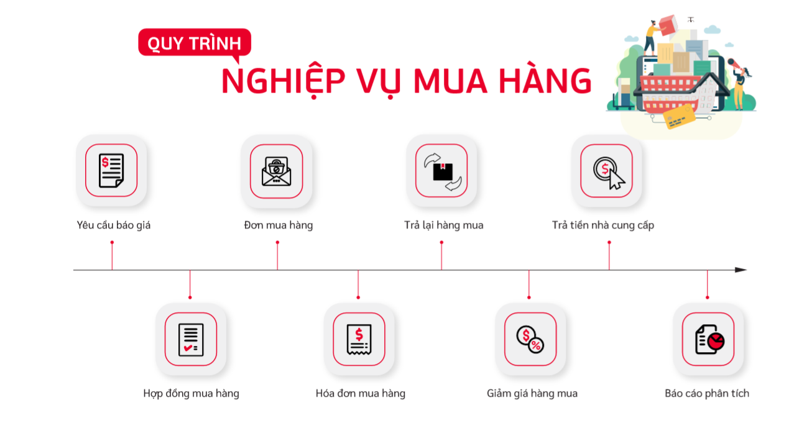
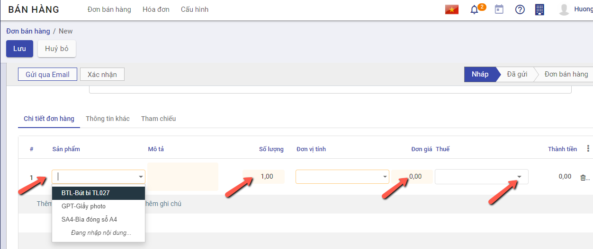
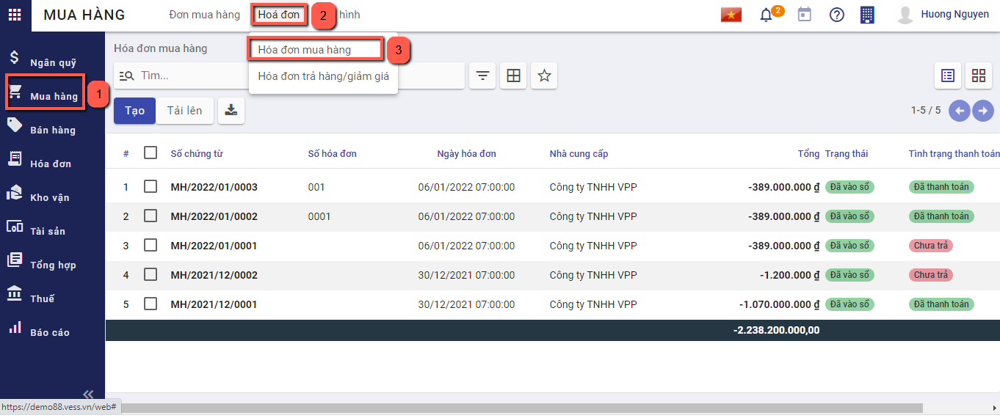
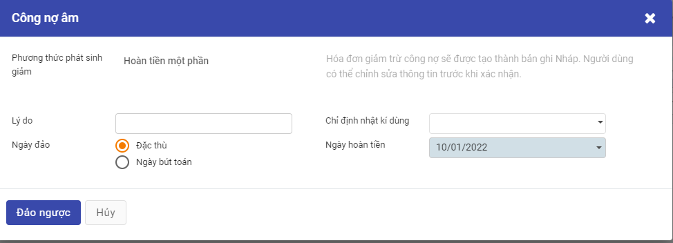
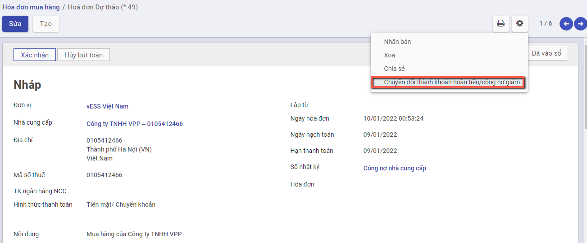

# **Quy trình nghiệp vụ**

Quản lý toàn bộ quy trình Mua hàng: Từ yêu cầu gửi báo giá đến Đơn hàng, Hóa đơn mua hàng và Hóa đơn trả hàng. Đồng thời theo dõi thanh toán hóa đơn và cấn trừ công nợ với nhà cung cấp, lên báo cáo mua hàng và báo cáo kế toán liên quan.

**Quy trình**

**Các luồng quy trình**

·     Lập yêu cầu báo giá gửi Nhà cung cấp. Chi tiết nghiệp vụ **[tại đây](#Lập yêu cầu báo giá gửi Nhà cung cấp)**

·     Lập Hợp đồng mua hàng. Chi tiết nghiệp vụ **[tại đây](#Lập Hợp đồng mua hàng)**

·     Lập Đơn mua hàng gửi Nhà cung cấp. Chi tiết nghiệp vụ [**tại đây**](#_Xác_nhận_Đơn)

·     Mua hàng trong nước về nhập kho. Chi tiết nghiệp vụ [**tại đây**](#_Mua_hàng_trong)

·     Mua hàng hóa nhập khẩu về nhập kho. Chi tiết nghiệp vụ [**tại đây**](#_Mua_hàng_hóa)

## **Yêu cầu báo giá**

### **Mô tả nghiệp vụ**

Khi đơn vị có nhu cầu mua hàng, lập yêu cầu mua hàng thì quy trình thực hiện như sau:

- Trưởng bộ phận có nhu cầu mua hàng trình Giám đốc đề nghị mua hàng kèm với đề xuất về nhà cung cấp (nếu có.
- Ban giám đốc duyệt đề nghị mua hàng và chuyển lại cho bộ phận mua hàng; kế toán mua hàng.
- Bộ phận mua hàng đàm phán giá cả với nhà cung cấp và đề xuất lựa chọn nhà cung cấp tới Ban giám đốc.
- Kế toán mua hàng kiểm tra lại giá cả, thông tin nhà cung cấp để tư vấn thêm cho giám đốc về lựa chọn nhà cung cấp
- Ban giám đốc phê duyệt về kế hoạch mua hàng
- Bộ phận Mua hàng thực hiện Lập yêu cầu báo giá và gửi thông tin đến Nhà cung cấp

**Luồng chức năng chính**

·     Lập yêu cầu báo giá gửi Nhà cung cấp. Chi tiết nghiệp vụ **[tại đây](#Lập yêu cầu báo giá gửi Nhà cung cấp)**

·     Xác nhận Đơn hàng từ Nhà cung cấp. Chi tiết nghiệp vụ [**tại đây**](#Xác nhận Đơn hàng từ Nhà cung cấp)

**Xem video hướng dẫn**

*[Xây dựng video hướng dẫn trên phần mềm, gồm đủ các luồng chức năng được mô tả bên dưới]*

### **Lập yêu cầu báo giá gửi Nhà cung cấp**

**Lập yêu cầu báo giá**

·     Khi Ban GĐ/Quản lý phê duyệt kế hoạch mua hàng; bộ phận mua hàng thực hiện lập Yêu cầu báo giá gửi cho Nhà cung cấp. Theo dõi phản hồi của nhà cung cấp về yêu cầu báo giá.

**Đối tượng thực hiện :** Nhân viên bộ phận mua hàng 

**Bước 1:** Vào phân hệ **Mua hàng**, Chọn **Yêu cầu báo giá** (Hoặc thực hiện **Tìm kiếm** trực tiếp chức năng trên ô tìm kiếm chung của hệ thống)

**Bước 2:** Khai báo các thông tin chi tiết của **Yêu cầu báo giá:**

- Chọn thông tin Nhà cung cấp

- Chọn tiền tệ giao dịch trong Đơn hàng

- Khai báo thông tin về Hạn chốt, Ngày nhận

- Khai báo thông tin về Sản phẩm đặt từ Nhà Cung cấp: 
  - Chọn các sản phẩm yêu cầu báo giá từ nhà cung cấp
  - Nhập thông tin Số lượng, Đơn giá, Chiết khấu và mức Thuế đối với từng Sản phẩm
  - Với nội dung cần Lưu ý đối với Yêu cầu báo giá, thực hiện Thêm ghi chú è Thông tin nội dung sẽ được in trên file gửi nhà Cung cấp

**Bước 3**: Nhấn **Lưu**

**Bước 4**: Thực hiện In yêu cầu báo giá: kiểm tra thông tin dữ liệu trên mẫu yêu cầu báo giá và tùy chỉnh thông tin Mẫu yêu cầu

**Bước 5**: Thực hiện Gửi Email đến nhà cung cấp sau khi hoàn thành Yêu cầu báo giá

### **Xác nhận Đơn hàng từ Nhà cung cấp**

**Xác nhận Đơn hàng**

·     Các đơn hàng được Nhà cung cấp trả hàng theo Yêu cầu báo giá đã gửi, bộ phận mua hàng/kho thực hiện xác nhận về kho của công ty

**Đối tượng thực hiện :** Nhân viên bộ phận mua hàng

**Bước 1**: Vào phân hệ **Mua hàng**, trên **Danh sách Yêu cầu báo giá**, tìm thông tin Yêu cầu đã được Nhà cung cấp xác nhận và thực hiện trả 

**Bước 2**: Thực hiện xác nhận thông tin Số lượng sản phẩm mà Nhà cung cấp bàn giao

·     Trường hợp Nhà cung cấp trả hàng theo đúng Yêu cầu báo giá: Thực hiện Xác nhận thông tin toàn bộ Đơn hàng mà không cần xác nhận từng Sản phẩm nhận được

·     Trường hợp Nhà cung cấp trả hàng còn thiếu/thừa so với Yêu cầu: Khi đó người dùng cần Vào từng sản phẩm để xác nhận theo đúng số lượng thực tế nhận về

**Bước 3**: Nhấn nút **Xác nhận**

**<u>Lưu ý:</u>**

- Sau khi thực hiện Xác nhận đơn hàng, chương trình tự động tạo ra một Phiếu nhập kho bên Phân hệ Quản lý kho
- Yêu cầu báo giá được thực hiện Xác nhận đơn hàng: Sẽ không được hiển thị trên Danh sách Yêu cầu báo giá.

## **Hợp đồng mua hàng**

### **Mô tả nghiệp vụ**

Hợp đồng mua hàng được thực hiện sau luồng Yêu cầu báo giá gửi nhà cung cấp được hoàn thành:

- Ban giám đốc phê duyệt về kế hoạch mua hàng; phê duyệt Nhà cung cấp mua hàng cùng với Hàng hóa, số lượng, đơn giá cho đợt mua
- Bộ phận mua hàng thực hiện Lập hợp đồng mua hàng theo Đơn mua đã gửi và đã được phê duyệt theo các điều khoản về Giá, chiết khấu của các mặt hàng đã thỏa thuận với bên Nhà cung cấ
- Nhà cung cấp thực hiện cung cấp hàng hóa, dịch vụ cho đơn vị theo các điều khoản trên hợp đồng. Bộ phận mua hàng chuyển lại hợp đồng cho kế toán theo dõi, đồng thời làm các đề nghị thanh toán để thanh toán tiền hàng cho nhà cung cấp.
- Kế toán làm thủ tục nhập hàng, đồng thời theo dõi tình hình cung cấp hàng theo hợp đồng, tình hình thanh toán tiền và nhận các hóa đơn mua vào. Từ đó lập các báo cáo liên quan như Báo cáo tình hình thực hiện và công nợ hợp đồng.
- Bộ phận mua hàng lập phụ lục hợp đồng xin phê duyệt bổ sung theo các trình tự trên nếu có phát sinh các yêu cầu khác với hợp đồng chính và trong thời gian hợp đồng chính còn hiệu lực.
- Sau khi hai bên đã hoàn tất nghĩa vụ hợp đồng, bộ phận mua hàng lập thanh lý hợp đồng để bên mua và bên bán ký

**Luồng chức năng chính**

·     Lập Hợp đồng mua hàng. Chi tiết nghiệp vụ **[tại đây](#Đơn mua hàng từ yêu cầu báo giá)**

·     Quản lý Hợp đồng mua. Chi tiết nghiệp vụ [**tại đây**](#Đơn mua hàng từ Lệnh sản xuất)

**Xem video hướng dẫn**

*[Xây dựng video hướng dẫn trên phần mềm, gồm đủ các luồng chức năng được mô tả bên dưới]*

### **Lập Hợp đồng mua hàng**

**Hợp đồng mua hàng**

·     Hợp đồng mua hàng được lập để theo dõi tình hình cung cấp hàng, tình hình thanh toán cho Nhà cung cấp

**Đối tượng thực hiện :** Nhân viên bộ phận mua hàng và Kế toán thanh toán

**Bước 1**: Vào phân hệ **Mua hàng**, Chọn **Hợp đồng mua hàng** (Hoặc thực hiện **Tìm kiếm** trực tiếp chức năng trên ô tìm kiếm chung của hệ thống)

**Bước 2:** Tại phần **Thông tin chung** của Hợp đồng

- Mục **Nhà cung cấp**: Chọn thông tin Nhà cung cấp và Tiền tệ trong giao dịch mua hàng cùng với các điều khoản về Ngày ký, Đơn vị thực hiện

- Mục **Giá trị hợp đồng**: Tự khai báo hoặc chương trình sẽ tự động lấy lên theo Tổng tiền thanh toán của các mặt hàng tại mục **Danh sách hàng hóa**.

  **Lưu ý:**

  - *Với các hợp đồng đã được thanh lý (có trạng thái **Đã thanh lý**), nếu giá trị khi thanh lý khác với giá trị của hợp đồng, Kế toán sẽ thực hiện sửa hợp đồng mua để cập nhật lại **Giá trị thanh lý**.*
  - *Tích chọn **Là hợp hợp đồng phát sinh trước khi sử dụng phần mềm**, nếu vẫn có nhu cầu quản lý các hợp đồng này. => Khi đó, Kế toán sẽ khai báo thêm thông tin về **Giá trị đã thực hiện** và **Số đã trả**.* 

- Mục **Danh sách hàng hóa**: Khai báo thông tin chi tiết của hàng hóa, dịch vụ mua

**Bước 3:** Nhấn **Lưu**

**Lưu ý:**

- Để nhập nhanh Hợp đồng: Kế toán thực hiện chọn **Đơn đặt hàng**: Khi đó thông tin về Nhà cung cấp và Danh sách hàng hóa được lấy mặc định theo Đơn đặt hàng

### **Quản lý hợp đồng mua**

**Quản lý Hợp đồng mua hàng**

·     Kế toán theo dõi và cập nhật thông tin Trạng thái của Hợp đồng, đồng thời theo dõi tình hình cung cấp hàng theo hợp đồng, tình hình thanh toán tiền và nhận các hóa đơn mua vào

**Đối tượng thực hiện :** Kế toán thanh toán

**Bước 1:** Vào phân hệ **Mua hàng**, Chọn **Hợp đồng mua hàng** (Hoặc thực hiện **Tìm kiếm** trực tiếp chức năng trên ô tìm kiếm chung của hệ thống)

**Bước 2:** Tại phần Xem thông tin của Hợp đồng

- Thực hiện cập nhật trạng thái thực của Hợp đồng theo từng đơn hàng: Chưa thực hiện, Đang thực hiện, Thanh lý hoặc Huỷ bỏ
- Theo dõi các thông tin về Tổng thu/Tổng chi tương ứng của Hợp đồng; Xem chi tiết theo từng giao dịch

## ***Đơn mua hàng***

### **Mô tả nghiệp vụ**

Khi đơn vị có nhu cầu mua hàng, lập yêu cầu mua hàng thì quy trình thực hiện như sau:

- Sau khi lựa chọn và chốt giá cả với Nhà cung cấp được lựa chọn: người mua hàng thực hiện lập đơn mua hàng theo thỏa thuận với nhà cung cấp để chốt lại hàng hóa, số lượng, giá cả, hạn thanh toán, hạn giao hàng, địa điểm giao hàng....
- Sau khi lập xong đơn hàng, người mua chuyển đơn mua hàng cho nhà cung cấp để nhà cung cấp kiểm tra, ký đơn mua hàng.Người mua thực hiện xác nhận đơn hàng và lưu trữ chứng từ.
- Đơn mua hàng có thể được lập mới từ đầu hoặc được lập từ: đơn bán hàng

**Luồng chức năng chính**

·     Lập đơn mua hàng gửi Nhà cung cấp. Chi tiết nghiệp vụ **[tại đây](#lap-on-mua-hang-gui-nha-cung-cap)**

·     Xác nhận Đơn hàng từ Nhà cung cấp. Chi tiết nghiệp vụ [**tại đây**](#xac-nhan-on-hang-tu-nha-cung-cap)

**Xem video hướng dẫn**

<iframe
    width="920"
    height="450"
    frameborder="0"
    allow="autoplay; encrypted-media; clipboard-write; gyroscope; picture-in-picture "
    allowfullscreen
    title="Lập đơn mua hàng" 
    src="https://www.youtube.com/embed/PQZuqDdgwxo"
></iframe>

### Hướng dẫn trên phần mềm

#### **Lập đơn mua hàng gửi Nhà cung cấp**

**Đối tượng thực hiện :** Nhân viên bộ phận mua hàng 

**Bước 1:** Vào phân hệ **Mua hàng**, Chọn **Đơn mua hàng** 

Hoặc thực hiện **Tìm kiếm** trực tiếp chức năng trên ô tìm kiếm chung của hệ thống

**Bước 2:** Nhấn nút **Tạo** trên chức năng để thực hiện thêm một đơn hàng mới. Khai báo các thông tin chi tiết trên đơn mua hàng. Lưu ý: Các ô màu hồng là những thông tin cần bắt buộc nhập

- Chọn đơn vị cần mua hàng. 

- Chọn thông tin Nhà cung cấp. Nếu chưa có nhà cung cấp thì có thể nhập bổ sung thêm bằng cách nhập tên nhà cung cấp và chọn tạo mới 

  

  hoặc vào đường dẫn **Danh mục/Nhà cung cấp** và thực hiện thêm mới

  

- Khai báo thông tin về Hạn đặt hàng, Ngày đơn hàng, nội dung chi tiết đơn hàng

- Khai báo thêm thông tin về Sản phẩm/dịch vụ tại chi tiết đơn hàng bằng cách nhấn chọn thêm sản phẩm

- 

  - Chọn các sản phẩm yêu cầu báo giá từ nhà cung cấp
  - Nhập thông tin Số lượng, Đơn giá, Chiết khấu và mức Thuế đối với từng Sản phẩm
  - 
  - Khi thực hiện Thêm ghi chú --> Thông tin nội dung sẽ được in trên file gửi nhà cung cấp

**Bước 3**: Nhấn **Lưu**

#### Thực hiện gửi đơn hàng cho nhà cung cấp

**Bước 1**: Sau khi đã có đơn hàng để gửi khách hàng, Thực hiện **In** đơn hàng bằng cách chọn chức năng In

**Bước 2:** Thực hiện **Gửi qua Email** đến nhà cung cấp sau khi hoàn thành  đơn hàng, có thể tùy chỉnh thông tin mẫu gửi báo giá theo yêu cầu

#### **Xác nhận Đơn hàng từ Nhà cung cấp**

Tại đơn hàng đã tạo, sau khi đã thỏa thuận được báo giá với nhà cung cấp và nhà cung cấp trả hàng theo đúng yêu cầu, người mua hàng nhấn nút **Xác nhận** để hoàn thành đơn hàng

Nếu không còn nhu cầu mua hàng, người bán nhấn **Hủy** hoặc thực hiện xóa đơn hàng đã tạo

Sau khi có đơn hàng, sản phẩm sẽ được nhận từ nhà cung cấp và nhập vào kho

## *Nhập kho đơn mua hàng*

### Mô tả nghiệp vụ

Sau khi thực hiện Xác nhận đơn hàng, chương trình tự động sinh ra một phiếu nhập kho. Người dùng có thể theo dõi tình trạng nhận hàng của sản phẩm trên phiếu nhập kho đã sinh ra và xác nhận số lượng sản phẩm bàn giao theo đơn hàng 

**Xem video hướng dẫn**

<iframe
    width="920"
    height="450"
    frameborder="0"
    allow="autoplay; encrypted-media; clipboard-write; gyroscope; picture-in-picture "
    allowfullscreen
    title="Nhập kho đơn mua hàng" 
    src="https://www.youtube.com/embed/3fjLKbsF_-M"
></iframe>

### **Hướng dẫn trên phần mềm**

**Bước 1**: Chọn **Nhân hàng** hoặc nhấn nút **Nhận sản phẩm**, hệ thống chuyển sang chức năng phiếu nhập kho. 

**Bước 2**: Thực hiện nhập số lượng hàng đã hoàn thành nhận từ nhà cung cấp

- Nếu Số lượng nhận về kho đủ theo Số lượng của Đơn mua hàng: Thực hiện nhấn **Xác nhận** để xác nhận toàn bộ Đơn hàng

  

- Nếu Số lượng nhập kho Chưa đủ theo Số lượng của Đơn mua hàng: Thực hiện nhập số lượng theo thực tế bằng cách nhấn **Sửa**, vào nhóm **Vật tư, hàng hóa chi tiết**, nhập số lương **hoàn thành**, sau đó nhấn **Lưu**

  

Nhấn **Xác nhận** để hoàn thành nhập hàng về kho

Khi đó có 2 hướng thực hiện :

- Nếu chọn **Tạo phần dở dang**: Với Số lượng còn thiếu, hệ thống tạo sẵn 1 chứng từ Phiếu nhập kho, để Khi nhập kho với Số lượng còn lại, bộ phận Kho tiếp tục vào Phiếu nhập kho (đã tạo phần dở dang) để thực hiện Xác nhận Số lượng nhập kho còn lại.
- Nếu chọn **Không tạo phần dở dang**: Khi đó hệ thống Tách Số lượng nhu cầu ban đầu Bằng đúng Số lượng thực nhập, còn Số lượng chênh chưa nhận được thì Số lượng hoàn thành = 0

Như vậy **Phiếu nhập kho** đã **Hoàn thành** .

## ***Hóa đơn mua hàng***

### **Mô tả nghiệp vụ**

- Sau khi nhập hàng về kho đẩy đủ, người mua hàng hạch toán chi phí và kê khai hóa đơn đầu vào.
- Trường hợp nhân viên mua hàng thanh toán ngay (bằng tiền mặt hoặc chuyển khoản) cho nhà cung cấp sau khi nhận được hàng, khi về đến doanh nghiệp sẽ thực hiện các thủ tục để thanh toán với Kế toán
- Trường hợp còn nợ nhà cung cấp, sau khi nhận được chứng từ của nhân viên mua hàng, kế toán mua hàng hạch toán công nợ với nhà cung cấp

### Hướng dẫn trên phần mềm

Người dùng có thể lập hóa đơn mua hàng theo hai cách khác nhau

Cách 1:Lập hóa đơn mua hàng từ đơn mua hàng. Chi tiết nghiệp vụ **[tại đây](#Lap-hoa-don-mua-hang-tu-don-mua-hang)**

Cách 2: Lập hóa đơn mua hàng không từ đơn mua hàng. Chi tiết nghiệp vụ **[tại đây](#Lap-hoa-don-mua-hang-khong-tu-don-mua-hang)**

#### Lập hóa đơn mua hàng từ đơn mua hàng

**Tạo hóa đơn**

·     Sau khi hàng hóa được nhận từ Nhà cung cấp, Kế toán mua hàng căn cứ vào hóa đơn chứng từ của Nhà cung cấp để thực hiện Tạo hóa đơn mua hàng

**Xem video hướng dẫn**

<iframe
    width="920"
    height="450"
    frameborder="0"
    allow="autoplay; encrypted-media; clipboard-write; gyroscope; picture-in-picture "
    allowfullscreen
    title="Lập hóa đơn mua hàng từ đơn mua hàng" 
    src="https://www.youtube.com/embed/USlVH_htOJM"
></iframe>

**Đối tượng thực hiện :** Nhân viên kế toán

**Bước 1:**Vào phân hệ **Mua hàng**, Chọn **Đơn mua hàng** đã hoàn thành Nhận hàng từ Nhà cung cấp và Nhấn **Tạo hóa đơn** 

**Bước 2:** Trên thông tin Hóa đơn mua hàng, Nhân viên kế toán thực hiện nhập các dữ liệu về:

- Hóa đơn: Ngày hóa đơn, Mẫu số, Ký hiệu hóa đơn và Số hóa đơn

  

- Chọn và nhập thông tin về Thuế và Chiết khấu tương ứng của Đơn hàng

  

**Bước 3: **Nếu hóa đơn có nhu cầu liên kết với chứng từ khác để theo dõi, vào mục Tham chiếu, thêm chứng từ tham chiếu và thực hiện tìm kiếm chứng từ

**Bước 4:** Nhân viên thực hiện nhấn **Xác nhận** 

**Lưu ý:** Để nhìn lại tình trạng hóa đơn của đơn bán hàng, người dùng có thể vào chức năng đơn bán hàng, nhấn chọn **Hóa đơn** tại góc phải màn hình 

#### Lập hóa đơn mua hàng không từ đơn mua hàng

**Xem video hướng dẫn**

<iframe
    width="920"
    height="450"
    frameborder="0"
    allow="autoplay; encrypted-media; clipboard-write; gyroscope; picture-in-picture "
    allowfullscreen
    title="Hóa đơn mua hàng" 
    src="https://www.youtube.com/embed/J849TChjEqk"
></iframe>

Đối tượng thực hiện: Người bán hàng

**Bước 1**: Vào phân hệ **Mua hàng**, Chọn **Hóa đơn** , chọn **Hóa đơn mua hàng** 

Hoặc thực hiện **Tìm kiếm** trực tiếp chức năng trên ô tìm kiếm chung của hệ thống

**Bước 2**: Nhấn nút **tạo**  để thêm hóa đơn. Có hai lựa chọn để tạo hóa đơn: Hóa đơn hàng hóa và Hóa đơn dịch vụ. 

Hóa đơn hàng hóa sẽ thực hiện thanh toán cho các sản phẩm là hàng hóa, thành phẩm, nguyên vật liệu

Hóa đơn dịch vụ sẽ thực hiện thanh toán cho các sản phẩm là chi phí, dịch vụ

Trên thông tin Hóa đơn mua hàng, Nhân viên kế toán thực hiện nhập các dữ liệu về:

- Chọn thông tin ***nhà cung cấp***. Nếu chưa có nhà cung cấp thì có thể nhập bổ sung thêm bằng cách nhập tên khách hàng và chọn tạo mới 

hoặc vào đường dẫn **Danh mục/Nhà cung cấp** và thực hiện thêm mới

- Nhập bổ sung thông tin gồm: Ngày hóa đơn, Mẫu số, Ký hiệu hóa đơn ,Số hóa đơn, hạn thanh toán

  

- Chọn và nhập thông tin về sản phẩm, số lượng, giá thành bán,Thuế và Chiết khấu của sản phẩm cần lập hóa đơn

  

**Bước 3**: Nhân viên Kế toán thực hiện nhấn **Lưu** . Hệ thống lưu thông tin chi tiết hóa đơn đã nhập và tự động sinh ra các chi tiết bút toán phát sinh

Thông tin dữ liệu bút toán phát sinh:

- Căn cứ thông tin Thuế  đã lựa chọn cùng với thông tin Chiết khấu, Đơn giá, Số lượng đã nhập bên chi tiết hóa đơn, hệ thống thực hiện mặc định thông tin các bút toán tương ứng

**Bước 4**: Nhân viên Kế toán thực hiện nhấn **Xác nhận** để hoàn thành xuất hóa đơn mua hàng

Sau khi xác nhận hóa đơn, hệ thống sẽ sinh dữ liệu vào chức năng "Thanh toán cho nhà cung cấp", người dùng kiểm tra thông tin sẽ thanh toán bằng cách vào **Ngân quỹ/Tiền mặt/Thanh toán cho nhà cung cấp** hoặc **Ngân quỹ/Tiền gửi/Thanh toán cho nhà cung cấp** để kiểm tra lại số tiền sẽ được thanh toán

## ***Thanh toán cho Nhà cung cấp***

### **Mô tả nghiệp vụ**

·     Sau khi thực hiện Nhận hàng từ Nhà cung cấp, đơn vị thực hiện kiểm tra thông tin đơn hàng và tiến hành Thanh toán cho Nhà cung cấp.

·     Việc thanh toán có thể ghi nhận thực hiện nhiều lần.

**Đối tượng thực hiện :** Nhân viên kế toán

**Xem video hướng dẫn**

<iframe
    width="920"
    height="450"
    frameborder="0"
    allow="autoplay; encrypted-media; clipboard-write; gyroscope; picture-in-picture "
    allowfullscreen
    title="Ghi nhận thanh toán từ hóa đơn mua hàng" 
    src="https://www.youtube.com/embed/IwOX-1i2rPQ"
></iframe>

### Hướng dẫn trên phần mềm

**Bước 1:** Vào phân hệ **Mua hàng**, Chọn **Hóa đơn mua hàng** đã hoàn thành **Vào sổ** 

**Bước 2**: Chọn hóa đơn cần thanh toán, Nhấn nút **Ghi nhận thanh toán**. 

Tại màn hình **Ghi nhận thanh toán** kế toán thanh toán thực hiện:

- Chọn Phương thức thanh toán, nếu thanh toán chuyển khoản thì thông tin Tài khoản được hiển thị mặc định theo Tài khoản của Nhà cung cấp đã được khai báo tại Danh mục **Nhà cung cấp**

- Nhập thông tin về Số tiền thanh toán, Ngày thanh toán của hóa đơn cho Đơn hàng

**Bước 3**: Nhấn **Tạo thanh toán**, hệ thống sinh phiếu chi tiền  để thu tiền khách hàng đã thực hiện trả

Trường hợp nếu số tiền chi thanh toán  vượt quá số tiền còn tồn thì phần mềm sẽ báo lỗi 'Số tiền chi vượt quá số dư tài khoản'

Để kiểm tra lại phiếu chi tiền, người dùng có thể tìm phiếu chi bằng cách:

Nếu Tại thông tin **Ghi nhận thanh toán**, **Sổ nhật ký** được chọn là **tiền mặt** thì người dùng vào chức năng **Ngân quỹ/Tiền mặt/Phiếu chi**. 

Nếu Tại thông tin **Ghi nhận thanh toán**, **Sổ nhật ký** được chọn là **tiền gửi** thì người dùng vào chức năng **Ngân quỹ/Tiền gửi/Báo nợ**. 

Người dùng có thể tìm thấy phiếu chi tiền dựa trên ngày thanh toán, đối tác thanh toán, tổng tiền, nội dung giao dịch

## ***Hóa đơn giảm giá/trả lại hàng mua***

### **Mô tả nghiệp vụ**

Khi phát hiện hàng mua về không đúng quy cách, chất lượng như đã thỏa thuận ban đầu.... thì đơn vị thực hiện trả lại hàng:

- Đơn vị và nhà cung cấp sẽ thỏa thuận với nhau và lập biên bản về việc trả lại hàng.
- Sau khi thống nhất với Nhà cung cấp, Nhân viên kế toán thực hiện Luồng trả hàng Ngay tại Đơn mua hàng tương ứng
- Thông tin Kho hàng và Hóa đơn trả hàng sẽ được tạo tại thời điểm thực hiện Trả hàng

Cách 1: Người mua hàng lập hóa đơn giảm giá hàng đã mua để giao cho nhà cung cấp và ghi sổ kế toán.Chi tiết nghiệp vụ **[tại đây](#tao-hoa-on-giam-gia-hang)**

Cách 2: Người mua hàng chuyển đổi hóa đơn bán hàng thành khoản hoàn tiền/công nợ giảm. Chi tiết nghiệp vụ **[tại đây](#chuyen-oi-thanh-khoan-hoan-tiencong-no-giam)**

**Xem video hướng dẫn**

<iframe
    width="920"
    height="450"
    frameborder="0"
    allow="autoplay; encrypted-media; clipboard-write; gyroscope; picture-in-picture "
    allowfullscreen
    title="Hóa đơn giảm giá" 
    src="https://www.youtube.com/embed/oAUNf6wCvxI"
></iframe>

### Hướng dẫn trên phần mềm

#### **Tạo hóa đơn giảm giá hàng**

·     Sau khi hoàn thành việc thỏa thuận với Nhà cung cấp về các mặt hàng không đảm bảo, kế toán thực hiện Lập Hóa đơn giảm giá/trả lại hàng cho Nhà cung cấp

**Đối tượng thực hiện :** Nhân viên kế toán

**Bước 1:** Vào phân hệ **Mua hàng**, Chọn **Hóa đơn mua hàng** đã hoàn thành Nhận hàng từ Nhà cung cấp. Trên danh sách hóa đơn mua hàng, kế toán tìm tới các hóa đơn đã được ghi sổ, nhấn chọn **Tạo HĐ giảm giá**

**Bước 2**: Nhập Lý do tạo hóa đơn, Nhấn **Đảo ngược**

Hệ thống tự sinh hóa đơn giảm giá với thông tin tương ứng với hóa đơn bán hàng. 

Trên hóa đơn giảm giá được sinh ra, kế toán khai báo  các thông tin trên chứng từ giảm giá hàng bán như: số lượng hàng được giảm, giá trị giảm

Nhấn **xác nhận** để ghi sổ thông tin hóa đơn. 

Sau đó, người dùng sẽ **xuất hóa đơn** để gửi lại cho khách hàng và **ghi nhận lại thanh toán**

#### Chuyển đổi thành khoản hoàn tiền/công nợ giảm

Bước 1: Vào phân hệ **Mua hàng**, chọn **Hóa đơn**, chọn **Hóa đơn mua hàng**. Trên danh sách hóa đơn mua hàng, kế toán tìm tới hóa đơn có nhu cầu hoàn hàng, nhấn chọn tiện ích/chuyển đổi thành khoản hoàn tiền/công nợ giảm

Hệ thống chuyển đổi từ hóa đơn mua hàng thành hóa đơn giảm giá/trả hàng, các thông tin được giữ nguyên

