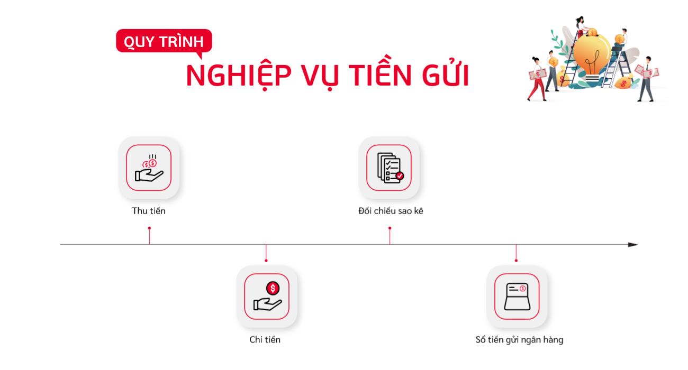
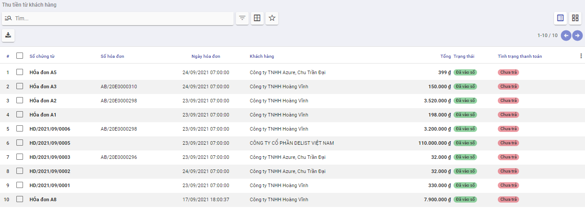
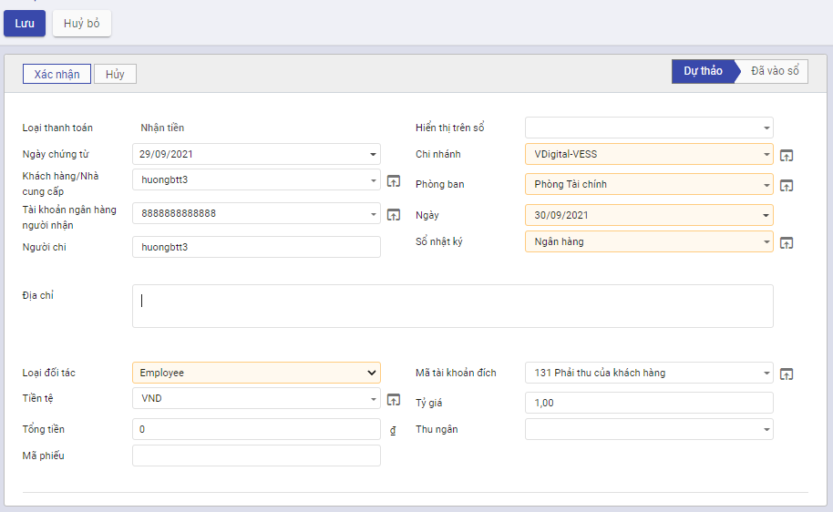
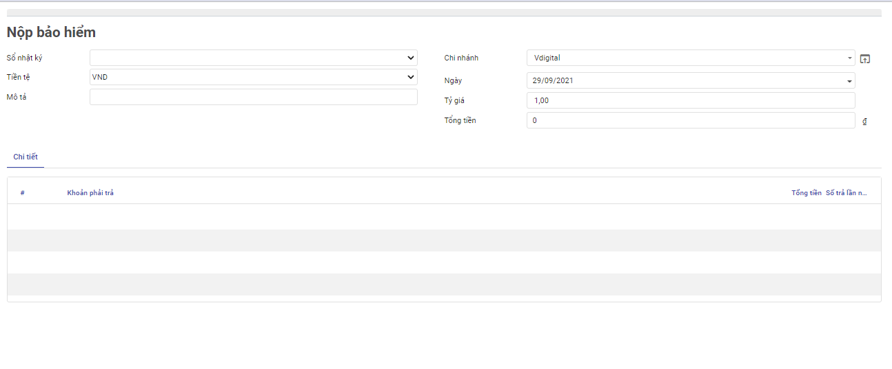

# Quy trình nghiệp vụ

Kế toán được sử dụng để  :

- Quản lý tình hình thu, chi, tồn tiền mặt
- Hỗ trợ phiếu in theo mẫu TT133, 200 của BTC
- Lên các báo cáo sổ quỹ tiền mặt, báo cáo kế toán

Quy trình nghiệp vụ

**Các luồng quy trình**

*[Liệt kê các luồng quy trình nghiệp vụ có trong Module, có link đến Phần Hướng dẫn chi tiết]*

·     Lập chứng từ Phiếu thu tiền ngân hàng. Chi tiết nghiệp vụ [Báo Nợ]()

·     Lập chứng từ Phiếu chi tiền ngân hàng. Chi tiết nghiệp vụ [Báo có]()

# Báo Nợ

## Khách hàng ứng trước tiền mua hàng bằng tiền gửi ngân hàng

### Mô tả nghiệp vụ

Căn cứ vào hợp đồng bán hàng, đơn đặt hàng hoặc thỏa thuận giữa 2 bên khách hàng chuyển tiền ứng trước tiền mua hàng bằng tiền gửi ngân hàng, khi đó quy trình thực hiện như sau:

- Khách hàng thực hiện chuyển tiền ứng trước qua ngân hàng.

- Ngân hàng phục vụ khách hàng sẽ chuyển tiền tới Ngân hàng đơn vị thụ hưởng, Ngân hàng căn cứ vào số tiền nhận được từ phía khách hàng chuyển khoản, lập giấy báo Có để báo cho đơn vị tiền đã về tài khoản của công ty.

- Hàng ngày, Kế toán thanh toán sẽ ra ngân hàng để lấy sổ phụ ngân hàng (bảng sao kê các giao dịch, giấy báo Nợ, giấy báo Có) hoặc xem trực tiếp thông tin trên Internet.

- Căn cứ vào giấy báo Có, Kế toán thanh toán hạch toán ghi nhận công nợ của khách hàng. Đồng thời, ghi sổ tiền gửi ngân hàng.

**Xem video hướng dẫn**

*[Xây dựng video hướng dẫn trên phần mềm, gồm đủ các luồng chức năng được mô tả bên dưới]*

### Hướng dẫn trên phần mềm

1. Vào phân hệ **Kế toán**, Chọn **Tiền ngân hàng**, Chọn **Báo có** (Hoặc thực hiện **Tìm kiếm** trực tiếp chức năng trên ô tìm kiếm chung của hệ thống), Nhấn **Tạo**

2. Khai báo các thông tin của **Báo có**

- Tại mục **Khách hàng/Nhà cung cấp**: Chọn khách hàng ứng tiền trước
- Tại mục **Tài khoản ngân hàng người nhận**: Chọn tài khoản nhận tiền

- Tại mục **Loại đối tác** (Tab chung): Chọn **Thu khác**
- Nếu có nhu cầu theo dõi công nợ khách hàng theo nhân viên kinh doanh phụ trách, tại mục **Thu ngân** chọn nhân viên tương ứng.

3. Nhấn **Lưu**
4. Nhấn **Xác nhận**

Lưu ý: Muốn chuyển trạng thái từ Hoàn thành về Nháp thì Nhấn **Đưa về dự thảo**

## Khách hàng trả nợ bằng tiền gửi Ngân hàng

### Mô tả nghiệp vụ

Khi khách hàng chuyển khoản hoặc mang tiền nộp vào tài khoản ngân hàng của công ty để trả nợ tiền hàng, quy trình qua các bước sau:

- Khách hàng lập Ủy nhiệm chi/lệnh chi chuyển tiền trả cho đơn vị qua ngân hàng.

- Ngân hàng phục vụ khách hàng thực hiện chuyển tiền sang Ngân hàng đơn vị thụ hưởng, Ngân hàng đơn vị thụ hưởng sẽ căn cứ vào số tiền chuyển khoản nhận được, lập giấy báo Có để xác nhận tiền đã về tài khoản của công ty.

- Hàng ngày, Kế toán thanh toán sẽ ra ngân hàng để lấy sổ phụ ngân hàng (bảng sao kê các giao dịch, giấy báo Nợ, giấy báo Có) hoặc do ngân hàng gửi trước file mềm cho đơn vị hoặc Kế toán tra cứu trực tiếp trên Internet.

- Căn cứ vào giấy báo Có, Kế toán thanh toán hạch toán ghi giảm công nợ cho khách hàng, đồng thời ghi sổ tiền gửi ngân hàng.

**Xem video hướng dẫn**

*[Xây dựng video hướng dẫn trên phần mềm, gồm đủ các luồng chức năng được mô tả bên dưới]*

### Hướng dẫn trên phần mềm

1. Vào phân hệ **Kế toán**, Chọn **Tiền ngân hàng**, Chọn **Thu tiền từ khách hàng** (Hoặc thực hiện **Tìm kiếm** trực tiếp chức năng trên ô tìm kiếm chung của hệ thống)

2. Các thao tác tại  **Thu tiền từ khách hàng**

- Tại mục **Tìm kiếm**: Tìm kiếm khách hàng trả nợ.
- Tại mục **Danh sách hóa đơn**: Chọn hóa đơn khách hàng thanh toán

3. Khai báo thông tin tại Ghi nhận thanh toán

- Tại mục sổ nhật ký: Chọn Ngân hàng
- Tại mục Ngày thanh toán: Chọn Ngày khách hàng trả nợ
- Tại mục số trả: Nhập số tiền trả nợ lần này nếu KH không trả hết tiền trên hóa đơn

4. Nhấn Tạo thanh toán
5. Thực hiện khai báo các thông tin còn thiếu trên Báo có
6. Nhấn **Lưu**
7. Nhấn xác nhận

Lưu ý: Muốn chuyển trạng thái từ Hoàn thành về Nháp thì Nhấn **Đưa về dự thảo**

## Thu tiền trả nợ của nhiều khách hàng bằng tiền mặt

### Mô tả nghiệp vụ

Khi khách hàng chuyển khoản hoặc mang tiền nộp vào tài khoản ngân hàng của công ty để trả nợ tiền hàng, quy trình qua các bước sau:

- Khách hàng lập Ủy nhiệm chi/lệnh chi chuyển tiền trả cho đơn vị qua ngân hàng.

- Ngân hàng phục vụ khách hàng thực hiện chuyển tiền sang Ngân hàng đơn vị thụ hưởng, Ngân hàng đơn vị thụ hưởng sẽ căn cứ vào số tiền chuyển khoản nhận được, lập giấy báo Có để xác nhận tiền đã về tài khoản của công ty.

- Hàng ngày, Kế toán thanh toán sẽ ra ngân hàng để lấy sổ phụ ngân hàng (bảng sao kê các giao dịch, giấy báo Nợ, giấy báo Có) hoặc do ngân hàng gửi trước file mềm cho đơn vị hoặc Kế toán tra cứu trực tiếp trên Internet.

- Căn cứ vào giấy báo Có, Kế toán thanh toán hạch toán ghi giảm công nợ cho khách hàng, đồng thời ghi sổ tiền gửi ngân hàng.

**Xem video hướng dẫn**

*[Xây dựng video hướng dẫn trên phần mềm, gồm đủ các luồng chức năng được mô tả bên dưới]*

### Hướng dẫn trên phần mềm

1. Vào phân hệ **Kế toán**, Chọn **Tiền ngân hàng**, Chọn **Thu tiền từ khách hàng** (Hoặc thực hiện **Tìm kiếm** trực tiếp chức năng trên ô tìm kiếm chung của hệ thống)

2. Tích chọn chứng từ khách hàng thanh toán tiền nợ

2. Nhấn **Ghi nhận thanh toán**
3. Tại mục Sổ nhật ký: Chọn **Ngân hàng**
4. Trường hợp số tiền khách hàng thanh toán nhỏ hơn số nợ thực tế trên chứng từ, cần nhập lại số tiền khách hàng trả nợ vào cột **Số trả**. 
5. Nhấn **Tạo Thanh toán** để tạo **Báo có**

6. Tại **Báo có** thực hiện Khai báo bổ sung thông tin
7. Nhấn **Lưu**
8. Nhấn **Xác nhận** để vào sổ

## Thu lãi đầu tư tài chính

### Mô tả nghiệp vụ

Khi phát sinh các nghiệp vụ thu lãi từ hoạt động đầu tư tài chính thông qua tài khoản ngân hàng, thường phát sinh các hoạt động sau:

- Ngân hàng sẽ căn cứ vào số tiền lãi được chuyển khoản vào tài khoản của công ty để lập giấy báo Có xác nhận tiền đã về tài khoản.

- Hàng ngày, Kế toán thanh toán sẽ ra ngân hàng để lấy sổ phụ ngân hàng (bảng sao kê các giao dịch, giấy báo Nợ, giấy báo Có).

- Căn cứ vào giấy báo Có, Kế toán thanh toán hạch toán ghi nhận tiền lãi từ hoạt động đầu tư tài chính vào sổ kế toán, đồng thời ghi sổ tiền gửi ngân hàng.

**Xem video hướng dẫn**

*[Xây dựng video hướng dẫn trên phần mềm, gồm đủ các luồng chức năng được mô tả bên dưới]*

### Hướng dẫn trên phần mềm

1. Vào phân hệ **Kế toán**, Chọn **Tiền ngân hàng**, Chọn **Báo có** (Hoặc thực hiện **Tìm kiếm** trực tiếp chức năng trên ô tìm kiếm chung của hệ thống), Nhấn **Tạo**

2. Khai báo thông tin **Báo có**

- Tại mục **Khách hàng/Nhà cung cấp**: Chọn Người nhận tiền
- Tại mục **Tài khoản ngân hàng**: Chọn Tài khoản nhận tiền
- Tại mục **Loại đối tác**: Chọn Khác
- Tại mục **Mã tài khoản đích**: Chọn tài khoản hạch toán Có

3. Nhấn **Ghi nhận thanh toán** để sinh sang Phiếu thu tiền mặt

3. Nhấn **Lưu**

6. Nhấn **Xác nhận**

## Nhận tiền vay bằng tiền gửi

### Mô tả nghiệp vụ

Khi phát sinh các nghiệp vụ nhận tiền vay thông qua tài khoản ngân hàng, thường phát sinh các hoạt động sau:

- Ngân hàng sẽ căn cứ vào số tiền vay được chuyển khoản vào tài khoản của công ty để lập giấy báo Có xác nhận tiền đã về tài khoản.

- Hàng ngày, Kế toán thanh toán sẽ ra ngân hàng để lấy sổ phụ ngân hàng (bảng sao kê các giao dịch, giấy báo Nợ, giấy báo Có).

- Căn cứ vào giấy báo Có, Kế toán thanh toán hạch toán ghi nhận khoản vay vào sổ kế toán, đồng thời ghi sổ tiền gửi ngân hàng.

**Xem video hướng dẫn**

*[Xây dựng video hướng dẫn trên phần mềm, gồm đủ các luồng chức năng được mô tả bên dưới]*

### Hướng dẫn trên phần mềm

1. Vào phân hệ **Kế toán**, Chọn **Tiền ngân hàng**, Chọn **Báo có** (Hoặc thực hiện **Tìm kiếm** trực tiếp chức năng trên ô tìm kiếm chung của hệ thống), Nhấn **Tạo**

2. Khai báo các thông tin tại **Báo có**

- Tại mục Khách hàng/Nhà cung cấp: Chọn chủ Tài khoản nhận tiền
- Tại mục Tài khoản ngân hàng người nhận: Chọn Tài khoản nhận tiền

- Tại mục Loại đối tác: Chọn **Khác**
- Tại mục số tiền: Nhập số tiền vay

3. Nhấn **Lưu**
4. Nhấn **Xác nhận**

## Thu khác Hoàn ứng sau khi quyết toán tạm ứng nhân viên

### Mô tả nghiệp vụ

Nhân viên tạm ứng đi công tác về hoặc hoàn thành công việc được giao sẽ chuẩn bị đủ các hoá đơn, chứng từ liên quan và thực hiện quyết toán tạm ứng. Số tiền tạm ứng chi không hết sẽ phải nộp trả lại. Quy trình quyết toán tạm ứng được thực hiện như sau:

- Nhân viên làm Đề nghị thanh toán tạm ứng kèm theo hóa đơn, chứng từ liên quan và chuyển cho Kế toán thanh toán.

- Kế toán thanh toán kiểm tra và xác nhận các khoản chi tiêu đúng mục đích, quy định của công ty, có giấy tờ, hóa đơn hợp lý chứng minh thì sẽ chuyển cho Kế toán trưởng. Trường hợp nhân viên chưa có đủ giấy tờ chứng từ chứng minh hoặc sai quy định thì chuyển nhân viên làm lại.

- Kế toán trưởng và Giám đốc ký duyệt thanh quyết toán tạm ứng và chuyển lại cho Kế toán thanh toán.

- Kế toán thanh toán hạch toán chứng từ quyết toán tạm ứng. Nếu số tiền tạm ứng lớn hơn số tiền đã chi, Kế toán thanh toán báo cho nhân viên số tiền chi không hết phải nộp lại cho công ty.

- Nhân viên không có tiền mặt, sẽ thực hiện chuyển tiền ngân hàng để nộp lại số tiền thừa cho công ty.

- Khi tiền về tới Ngân hàng của công ty, Ngân hàng lập giấy báo Có để xác nhận tiền đã về tài khoản của công ty và báo cho công ty.

- Căn cứ vào giấy báo Có, Kế toán thanh toán hạch toán ghi giảm công nợ của nhân viên, đồng thời ghi sổ tiền gửi ngân hàng.

**Xem video hướng dẫn**

*[Xây dựng video hướng dẫn trên phần mềm, gồm đủ các luồng chức năng được mô tả bên dưới]*

### Hướng dẫn trên phần mềm

1. Vào phân hệ **Kế toán**, Chọn **Tiền ngân hàng**, Chọn **Báo có** (Hoặc thực hiện **Tìm kiếm** trực tiếp chức năng trên ô tìm kiếm chung của hệ thống), Nhấn **Tạo**

2. Khai báo các thông tin tại **Phiếu thu**

- Tại mục Khách hàng/Nhà cung cấp: Chọn nhân viên làm hoàn ứng

- Tại mục **Loại đối tác**: chọn **Nhân viên**

3. Nhấn **Lưu**
4.  Nhấn **Xác nhận**

## Hoàn thuế GTGT bằng tiền gửi Ngân hàng

### Mô tả nghiệp vụ

Trường hợp công ty đủ điều kiện xin xét hoàn thuế GTGT, sẽ phát sinh các hoạt động sau:

- Lập hồ sơ đề nghị hoàn thuế và gửi lên cơ quan thuế quản lý trực tiếp.

- Nếu hồ sơ được phê duyệt, cơ quan thuế sẽ gửi quyết định hoàn thuế cho công ty và kho bạc Nhà nước đồng cấp.

- Kho bạc thực hiện chuyển khoản tiền hoàn thuế vào tài khoản ngân hàng của công ty.

- Ngân hàng sẽ căn cứ vào số tiền chuyển khoản từ kho bạc, lập giấy báo Có để xác nhận tiền đã về tài khoản của công ty.

- Hàng ngày, Kế toán thanh toán sẽ ra ngân hàng để lấy sổ phụ ngân hàng (bảng sao kê các giao dịch, giấy báo Nợ, giấy báo Có).

- Căn cứ vào giấy báo Có, Kế toán thanh toán hạch toán ghi nhận số tiền thuế GTGT được hoàn, đồng thời ghi sổ tiền gửi ngân hàng.

### Hướng dẫn trên phần mềm

1. Vào phân hệ **Kế toán**, Chọn **Tiền ngân hàng**, Chọn **Báo có** (Hoặc thực hiện **Tìm kiếm** trực tiếp chức năng trên ô tìm kiếm chung của hệ thống), Nhấn **Tạo**

2. Khai báo các thông tin **Báo có**

- Tại mục **Khách hàng/Nhà cung cấp**: Chọn đối tượng nhận tiền
- Tại mục **Tài khoản ngân hàng người nhận:** Chọn Tài khoản ngân hàng nhận tiền
- Tại mục **Loại đối tác**: Chọn **Khác**

3. Nhấn **Lưu**
4. Nhấn **Xác nhận**

## Thu Khác bằng tiền gửi Ngân hàng

### Mô tả nghiệp vụ

Khi phát sinh các nghiệp vụ thu khác bằng tiền gửi ngân hàng, thường phát sinh các hoạt động sau:

- Ngân hàng sẽ căn cứ vào số tiền được nộp hoặc chuyển khoản vào tài khoản của công ty để lập giấy báo Có xác nhận tiền đã về tài khoản.

- Hàng ngày, Kế toán thanh toán sẽ ra ngân hàng để lấy sổ phụ ngân hàng (bảng sao kê các giao dịch, giấy báo Nợ, giấy báo Có).

1. Căn cứ vào giấy báo Có, Kế toán thanh toán hạch toán, đồng thời ghi sổ tiền gửi ngân hàng.

### Hướng dẫn trên phần mềm

1. Vào phân hệ **Kế toán**, Chọn **Tiền ngân hàng**, Chọn **Báo có** (Hoặc thực hiện **Tìm kiếm** trực tiếp chức năng trên ô tìm kiếm chung của hệ thống), Nhấn **Tạo**

2. Khai báo các thông tin **Báo có**

- Tại mục **Khách hàng/Nhà cung cấp**: Chọn đối tượng nhận tiền
- Tại mục **Tài khoản ngân hàng người nhận:** Chọn Tài khoản ngân hàng nhận tiền
- Tại mục **Loại đối tác**: Chọn **Khác**
- Nếu có nhu cầu theo dõi các khoản thu chi tiết theo nhân viên, tại mục **Nhân viên thu** chọn nhân viên tương ứng.

3. Nhấn **Lưu**
4. Nhấn **Xác nhận**

# Báo Nợ

## Trả trước tiền hàng cho nhà cung cấp bằng tiền gửi Ngân hàng

### Mô tả nghiệp vụ

Trường hợp công ty ứng trước tiền mua hàng cho nhà cung cấp, khi đó quy trình thực hiện như sau:

- Căn cứ vào hợp đồng mua hàng hoặc theo thỏa thuận với NCC, nhân viên mua hàng làm đề nghị thanh toán yêu cầu chuyển trả tiền ứng trước cho nhà cung cấp.

- Kế toán thanh toán lập Séc hoặc Ủy nhiệm chi/Lệnh chi tiền, sau đó chuyển cho Kế toán trưởng và Giám đốc ký duyệt.

- Ngân hàng căn cứ vào Ủy nhiệm chi của công ty sẽ chuyển tiền vào tài khoản của nhà cung cấp, đồng thời lập giấy báo Nợ.

- Căn cứ vào giấy báo Nợ của ngân hàng, Kế toán thanh toán sẽ hạch toán, đồng thời ghi sổ tiền gửi ngân hàng.

​       => Nếu trường hợp trả bằng Séc thì nhân viên đề nghị chi tiền sẽ nhận Séc để chuyển cho nhà cung cấp.

### Hướng dẫn trên phần mềm

1. Vào phân hệ **Kế toán**, Chọn **Tiền Ngân hàng**, Chọn **Báo Nợ** (Hoặc thực hiện **Tìm kiếm** trực tiếp chức năng trên ô tìm kiếm chung của hệ thống), Nhấn **Tạo**

2. Khai báo các thông tin tại **Báo Nợ**

- Tại mục **Loại đối tác**: Chọn **Nhà cung cấp**
- Tại mục **Khách hàng/Nhà cung cấp**: Chọn nhà cung cấp muốn trả trước tiền
- Tại mục **Tài khoản ngân hàng người nhận**: Chọn tài khoản của nhà cung cấp muốn trả trước tiền

- Nếu muốn theo dõi công nợ nhà cung cấp chi tiết theo nhân viên mua hàng, tại mục **Thu ngân** chọn nhân viên mua hàng tương ứng.

3. Nhấn **Lưu**
4. Nhấn **Xác nhận**

## Trả nợ cho nhà cung cấp bằng tiền ngân hàng

### Mô tả nghiệp vụ

Khi công ty chuyển khoản trả nợ cho nhà cung cấp, quy trình thực hiện như sau:

- Căn cứ vào yêu cầu của nhân viên đi mua hàng/cấp trên hoặc do nhà cung cấp đến đòi nợ, Kế toán thanh toán sẽ lập Ủy nhiệm chi/Séc chuyển khoản/Lệnh chi/Séc tiền mặt.

- Chuyển Ủy nhiệm chi cho Kế toán trưởng và Giám đốc ký duyệt.

- Ngân hàng căn cứ vào Ủy nhiệm chi của công ty sẽ chuyển tiền vào tài khoản của nhà cung cấp, đồng thời lập giấy báo Nợ.

- Căn cứ vào giấy báo Nợ của ngân hàng, Kế toán thanh toán sẽ hạch toán, đồng thời ghi sổ tiền gửi ngân hàng.

### Hướng dẫn trên phần mềm

1. Tại phân hệ Kế toán, Chọn Tiền Ngân hàng, Chọn Thanh toán cho nhà cung cấp (Hoặc thực hiện tìm kiếm trức tiếp chức năng trên ô tìm kiếm chung của hệ thống)

2. Tích chọn chứng từ khách hàng thanh toán tiền nợ

3. Nhấn **Ghi nhận thanh toán**

4. Tại mục Sổ nhật ký: Chọn **Ngân hàng**

1. Trường hợp số tiền khách hàng thanh toán nhỏ hơn số nợ thực tế trên chứng từ, cần nhập lại số tiền khách hàng trả nợ vào cột **Số trả**. 
2. Nhấn **Tạo Thanh toán** để tạo **Báo Nợ**

## Tạm ứng cho nhân viên thông qua chuyển khoản ngân hàng

### Mô tả nghiệp vụ

Nhân viên nhận được nhiệm vụ phân công của lãnh đạo doanh nghiệp như đi công tác, đi mua hàng… sẽ chuẩn bị giấy đề nghị tạm ứng và thực hiện công việc tạm ứng. Quy trình tạm ứng được thực hiện như sau:

- Nhân viên làm đề nghị tạm ứng kèm theo quyết định cử đi công tác, đi mua hàng hóa và dự trù chi phí chuyển cho phụ trách bộ phận.

- Phụ trách bộ phận căn cứ vào quyết định của lãnh đạo doanh nghiệp, dự trù kinh phí kiểm tra đầy đủ và hợp lý sẽ ký vào giấy đề nghị tạm ứng.

- Giấy đề nghị tạm ứng và toàn bộ hồ sơ liên quan được chuyển cho Kế toán trưởng và Giám đốc ký duyệt.

- Sau khi được ký duyệt giấy đề nghị tạm ứng được chuyển cho Kế toán thanh toán để lập Ủy nhiệm chi, sau đó chuyển cho Kế toán trưởng và Giám đốc ký duyệt.

- Ngân hàng căn cứ vào Ủy nhiệm chi của công ty sẽ chuyển tiền vào tài khoản của nhân viên, đồng thời lập giấy báo Nợ.

- Căn cứ vào giấy báo Nợ của ngân hàng, Kế toán thanh toán sẽ hạch toán, đồng thời ghi sổ tiền gửi ngân hàng.

### Hướng dẫn trên phần mềm

1. Vào phân hệ **Kế toán**, Chọn **Tiền ngân hàng**, Chọn **Báo nợ** (Hoặc thực hiện **Tìm kiếm** trực tiếp chức năng trên ô tìm kiếm chung của hệ thống), Nhấn **Tạo**

2. Khai báo các thông tin cho **Báo nợ**

- Tại mục **Khách hàng/Nhà cung cấp**: Chọn nhân viên tạm ứng
- Tại **Loại đối tác**: Chọn **Nhân viên**

3. Nhấn **Lưu**
4. Nhấn **Xác nhận**

## Chi bổ sung tiền tạm ứng thiếu bằng tiền Ngân hàng cho nhân viên sau khi thực hiện quyết toán tạm ứng

### Mô tả nghiệp vụ

Nhân viên tạm ứng đi công tác về hoặc hoàn thành công việc được giao sẽ chuẩn bị đủ các hoá đơn, chứng từ liên quan và thực hiện quyết toán tạm ứng. Số tiền tạm ứng chi không đủ sẽ được đơn vị chi bổ sung thêm. Quy trình quyết toán tạm ứng được thực hiện như sau:

- Nhân viên làm Đề nghị thanh toán tạm ứng kèm theo hóa đơn, chứng từ liên quan và chuyển cho Kế toán thanh toán.

- Kế toán thanh toán kiểm tra và xác nhận các khoản chi tiêu đúng mục đích, quy định của công ty, có giấy tờ, hóa đơn hợp lý chứng minh thì sẽ chuyển cho Kế toán trưởng. Trường hợp nhân viên chưa có đủ giấy tờ chứng từ chứng minh hoặc sai quy định thì chuyển nhân viên làm lại.

- Kế toán trưởng và Giám đốc ký duyệt thanh quyết toán tạm ứng và chuyển lại cho Kế toán thanh toán.

- Kế toán thanh toán hạch toán chứng từ quyết toán tạm ứng. Trường hợp số thực chi vượt quá số tạm ứng thì Kế toán thanh toán lập Ủy nhiệm chi, sau đó chuyển cho Kế toán trưởng và Giám đốc ký duyệt.

- Ngân hàng căn cứ vào Ủy nhiệm chi của công ty sẽ chuyển tiền vào tài khoản của nhân viên, đồng thời lập giấy báo Nợ.

- Căn cứ vào giấy báo Nợ của ngân hàng, Kế toán thanh toán sẽ hạch toán, đồng thời ghi sổ tiền gửi ngân hàng.

### Hướng dẫn trên phần mềm

1. Vào phân hệ **Kế toán**, Chọn **Tiền ngân hàng**, Chọn **Báo nợ** (Hoặc thực hiện **Tìm kiếm** trực tiếp chức năng trên ô tìm kiếm chung của hệ thống), Nhấn **Tạo**

2. Khai báo các thông tin cho **Báo nợ**

- Tại mục **Khách hàng/Nhà cung cấp**: Chọn nhân viên tạm ứng
- Tại **Loại đối tác**: Chọn **Nhân viên**

3. Nhấn **Lưu**
4. Nhấn **Xác nhận**

## Thanh toán tiền gửi ngân hàng trong trường hợp nhân viên mua hàng không tạm ứng trước

### Mô tả nghiệp vụ

Nhân viên nhận được nhiệm vụ phân công của lãnh đạo doanh nghiệp như đi công tác, đi mua hàng… mà không thực hiện tạm ứng chi phí trước, khi hoàn thành sẽ làm các thủ tục thanh toán tiền theo quy trình sau:

- Nhân viên làm Đề nghị thanh toán kèm theo hóa đơn, chứng từ liên quan và chuyển cho Kế toán thanh toán.

- Kế toán thanh toán kiểm tra và xác nhận các khoản chi tiêu đúng mục đích, quy định của công ty, có giấy tờ, hóa đơn hợp lý chứng minh thì sẽ chuyển cho Kế toán trưởng. Trường hợp nhân viên chưa có đủ giấy tờ chứng từ chứng minh hoặc sai quy định thì chuyển nhân viên làm lại.

- Kế toán trưởng và Giám đốc ký duyệt thanh toán và chuyển lại cho Kế toán thanh toán.

- Kế toán thanh toán hạch toán chứng từ thanh toán cho nhân viên. Nếu số tiền thanh toán được thanh toán bằng tiền gửi, Kế toán thanh toán thực hiện lập lập Ủy nhiệm chi, sau đó chuyển cho Kế toán trưởng và Giám đốc ký duyệt.

- Ngân hàng căn cứ vào Ủy nhiệm chi của công ty sẽ chuyển tiền vào tài khoản của nhân viên, đồng thời lập giấy báo Nợ.

- Căn cứ vào giấy báo Nợ của ngân hàng, Kế toán thanh toán sẽ hạch toán, đồng thời ghi sổ tiền gửi ngân hàng. 

### Hướng dẫn trên phần mềm

Vào phân hệ **Kế toán**, Chọn **Tiền ngân hàng**, Chọn **Báo nợ** (Hoặc thực hiện **Tìm kiếm** trực tiếp chức năng trên ô tìm kiếm chung của hệ thống), Nhấn **Tạo**

2. Khai báo các trường của **Báo nợ**

- Tại mục **Loại đối tác** : Chọn **Khác**
- Tại mục **Mã tài khoản đích:** Chọn Tài khoản sẽ hạch toán Có

3. Nhấn **Lưu**
4. Nhấn **Xác nhận**

## Nộp thuế GTGT hàng nhập khẩu bằng tiền ngân hàng

### Mô tả nghiệp vụ

Khi công ty mua hàng hóa nhập khẩu thực hiện kê khai tờ khai hải quan và xác định số thuế nhập khẩu, thuế TTĐB, thuế BVMT, thuế GTGT hàng nhập khẩu đối với hàng nhập khẩu, khi tiến hành nộp thuế bằng tiền gửi, thực hiện như sau:

- Căn cứ vào số thuế nhập khẩu, thuế TTĐB (nếu có), thuế BVMT (nếu có), thuế GTGT phải nộp do cơ quan Hải Quan xác định, nhân viên chịu trách nhiệm mua hàng nhập khẩu làm đề nghị chuyển khoản nộp thuế hàng nhập khẩu.

- Kế toán thanh toán lập Giấy nộp tiền vào ngân sách, sau đó chuyển cho Kế toán trưởng và Giám đốc ký duyệt.

- Ngân hàng căn cứ vào Giấy nộp tiền vào Ngân sách của công ty sẽ chuyển tiền vào tài khoản của cơ quan Thuế và lập giấy báo Nợ để báo lại cho đơn vị lệnh thành công.

- Căn cứ vào Giấy báo Nợ của Ngân hàng, Kế toán thanh toán sẽ ghi sổ kế toán tiền gửi ngân hàng.

- Kế toán thuế kê khai hoá đơn nhập khẩu lên bảng kê thuế GTGT mua vào. 

### Hướng dẫn trên phần mềm

1. Vào phân hệ **Kế toán**,Chọn **Tiền ngân hàng**,Chọn **Nộp Thuế** (Hoặc thực hiện Tìm kiếm trực tiếp chức năng trên ô tìm kiếm chung của hệ thống)

2. Khai báo các thông tin **Nộp Thuế**

- Tại mục **Loại thuế**: chọn **Thuế GTGT hàng nhập khẩu**
- Tại **Tab chi tiết**: chọn các khoản Thuế phải nộp
- Nhấn **Ghi nhận thanh toán**

3. Tại Báo Nợ khai báo các thông tin tại bản ghi được sinh từ chức năng **Nộp thuế**

- Tại mục **Mã tài khoản đích** : Chọn tài khoản hạch toán Có

4. Nhấn **Lưu**
5. Nhấn **Xác nhận**

## Nộp các loại thuế khác (Ngân hàng)

### Mô tả nghiệp vụ

Khi công ty phát sinh các nghiệp vụ nộp: thuế GTGT, thuế TNDN, thuế TNCN, thuế tiêu thụ đặc biệt... thường phát sinh các hoạt động sau:

- Sau khi lập tờ khai thuế gửi cơ quan thuế hoặc xác định số thuế phải nộp hàng kỳ chuyển Kế toán trưởng/Giám đốc ký duyệt, Kế toán thuế lập đề nghị thanh toán bằng chuyển khoản để nộp thuế.

- Kế toán trưởng và Giám đốc xem xét và phê duyệt đề nghị thanh toán và chuyển Kế toán thanh toán.

- Kế toán thanh toán căn cứ vào đề nghị thanh toán, lập chứng từ nộp thuế điện tử chuyển tiền từ tài khoản đã đăng ký vào Kho bạc Nhà nước hoặc lập giấy nộp tiền vào ngân sách nhà nước và chuyển ngân hàng.

- Sau khi ngân hàng thực hiện chuyển khoản cho kho bạc nhà nước thì lập giấy báo Nợ báo lại cho đơn vị.

- Kế toán thanh toán căn cứ vào giấy báo Nợ của ngân hàng để ghi sổ kế toán.

### Hướng dẫn trên phần mềm

1. Vào phân hệ **Kế toán**,Chọn **Ngân hàng**,Chọn **Nộp Thuế** (Hoặc thực hiện Tìm kiếm trực tiếp chức năng trên ô tìm kiếm chung của hệ thống)

2. Khai báo các thông tin **Nộp Thuế**

- Tại mục **Loại thuế**: chọn **Thuế khác**
- Tại mục **Ngày nộp Thuế**: Khai báo ngày thực hiện nộp thuế. Chương trình sẽ lấy lên danh sách các khoản thuế phải nộp tính đến ngày nộp thuế.
- Tại **Tab chi tiết**: chọn các khoản Thuế phải nộp
- Nhấn **Ghi nhận thanh toán**

3. Tại **Báo nợ** khai báo các thông tin tại bản ghi được sinh từ chức năng **Nộp thuế**

- Tại mục **Mã tài khoản đích** : Chọn tài khoản hạch toán Có

4. Nhấn **Lưu**
5. Nhấn **Xác nhận**

Lưu ý : Trường hợp số thuế thực nộp nhỏ hơn số thuế phải nộp, cần nhập lại số tiền thuế thực nộp vào cột **Số trả lần này**.

## Chi khác bằng tiền ngân hàng

### Mô tả nghiệp vụ

Khi phát sinh các nghiệp vụ chi khác bằng tiền gửi ngân hàng, thường phát sinh các hoạt động sau:

- Kế toán thanh toán sẽ lập Séc/Ủy nhiệm chi.

- Chuyển Séc/Ủy nhiệm chi cho Kế toán trưởng và Giám đốc ký duyệt.

- Ngân hàng căn cứ vào Séc/Ủy nhiệm chi của công ty sẽ chuyển tiền vào tài khoản của các đối tượng phát sinh, đồng thời lập giấy báo Nợ

- Căn cứ vào giấy báo Nợ của ngân hàng, kế toán thanh toán sẽ hạch toán, đồng thời ghi sổ tiền gửi ngân hàng.

### Hướng dẫn trên phần mềm

Vào phân hệ **Kế toán**, Chọn **Tiền ngân hàng**, Chọn **Báo Nợ** (Hoặc thực hiện **Tìm kiếm** trực tiếp chức năng trên ô tìm kiếm chung của hệ thống), Nhấn **Tạo**

2. Khai báo các thông tin **Báo nợ**

- Với các tài khoản theo dõi chi tiết theo: khách hàng, nhà cung cấp, nhân viên, tại mục **Đối tượng**, chọn đối tượng tương ứng với tài khoản hạch toán.
- Tại mục **Loại đối tác** : Chọn **Khác**
- Nếu có nhu cầu theo dõi các khoản chi chi tiết theo nhân viên, tại mục **Thu ngân** chọn nhân viên tương ứng.

3. Nhấn **Lưu**
4. Nhấn **Xác nhận**

## Nộp bảo hiểm

### Mô tả nghiệp vụ

Khi công ty phát sinh các nghiệp vụ nộp bảo hiểm cho nhân viên, thường phát sinh các hoạt động sau:

- Căn cứ vào Bảng lương của nhân viên, nhân viên chịu trách nhiệp nộp bảo hiểm sẽ lập yêu cầu chi tiền ngân hàng để nộp bảo hiểm.

- Kế toán thanh toán lập Phiếu chi, sau đó chuyển cho Kế toán trưởng và Giám đốc ký duyệt.

- Thủ quỹ căn cứ vào Phiếu chi đã được duyệt thực hiện xuất quỹ tiền mặt và ghi sổ quỹ

- Kế toán thanh toán căn cứ vào Phiếu chi có chữ ký của thủ quỹ và người nhận tiền để ghi sổ kế toán tiền ngân hàng

- Sau khi nộp bảo hiểm xong, nhân viên đi nộp thuế sẽ giao lại cho kế toán thanh toán giấy xác nhận nộp bảo hiểm của cơ quan bảo hiểm.

### Hướng dẫn trên phần mềm

Nghiệp vụ “Nộp bảo hiểm bằng tiền mặt” chỉ thực hiện được khi trên phần mềm đã phát sinh các chứng từ hạch toán chi phí BHXH, BHYT, BHTN, KPCĐ. 

1. Vào phân hệ **Kế toán**,Chọn **Nộp bảo hiểm** (Hoặc thực hiện Tìm kiếm** trực tiếp chức năng trên ô tìm kiếm chung của hệ thống)

2. Khai báo các thông tin Nộp bảo hiểm

- Tại mục **Sổ nhật ký**: Chọn Tiền ngân hàng
- Tại mục **Ngày**: Nhập ngày nộp Bảo hiểm
- Tích chọn các khoản bảo hiểm phải nộp và nhấn **Nộp bảo hiểm** => Phần mềm tự động sinh ra chứng từ **Phiếu chi nộp tiền bảo hiểm**.

​      <Hình ảnh bổ sung >

3. Kiểm tra chứng từ **Báo nợ** và nhập bổ sung thông tin nếu cần
4. Nhấn **Lưu**
5. Nhấn **Xác nhận**
