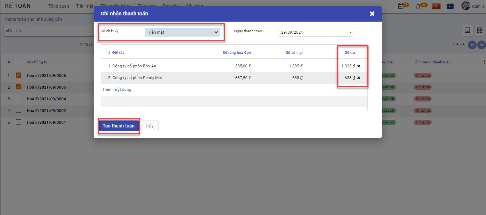
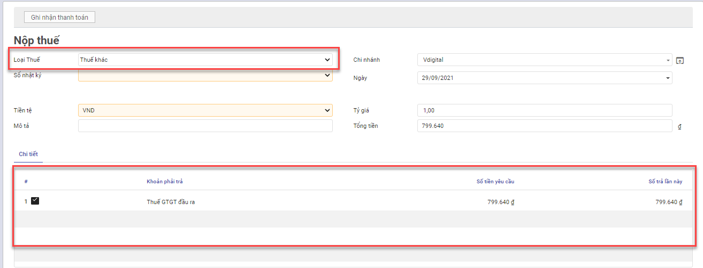
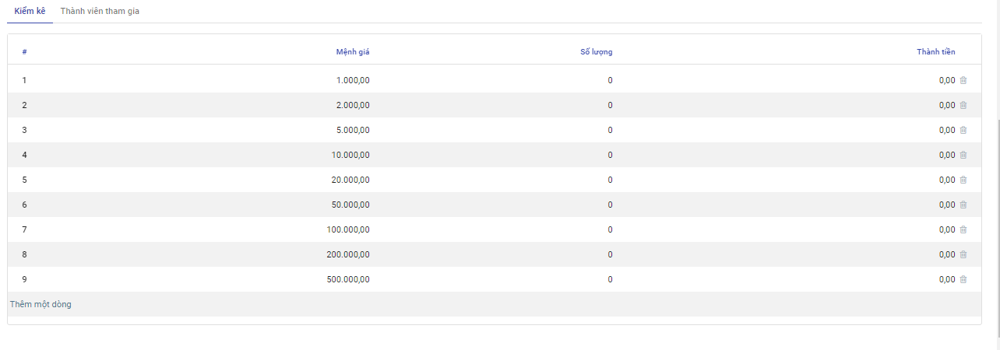

# Quy trình nghiệp vụ

Kế toán được sử dụng để  :

- Quản lý tình hình thu, chi, tồn tiền mặt
- Hỗ trợ phiếu in theo mẫu TT133, 200 của BTC
- Lên các báo cáo sổ quỹ tiền mặt, báo cáo kế toán

Quy trình nghiệp vụ

**Các luồng quy trình**

*[Liệt kê các luồng quy trình nghiệp vụ có trong Module, có link đến Phần Hướng dẫn chi tiết]*

·     Lập chứng từ Phiếu thu tiền mặt. Chi tiết nghiệp vụ [Phiếu thu tiền mặt]()

·     Lập chứng từ Phiếu chi tiền mặt. Chi tiết nghiệp vụ [Phiếu chi tiền mặt]()

## Phiếu thu tiền mặt

### Rút tiền gửi ngân hàng về nhập quỹ tiền mặt

#### Mô tả nghiệp vụ

Định kỳ hàng ngày, hàng tuần,... căn cứ vào nhu cầu chi tiền trong ngày hoặc đột xuất cần chi tiền mà quỹ không còn đủ tiền thì sẽ rút tiền từ ngân hàng về nhập quỹ để phục vụ cho việc chi tiêu. Tại doanh nghiệp, nghiệp vụ này sẽ thực hiện qua các bước sau:

- Kế toán thanh toán hoặc Kế toán ngân hàng viết séc tiền mặt.

- Kế toán chuyển cho Kế toán trưởng, Giám đốc ký và đóng dấu.

- Kế toán thanh toán, Kế toán ngân hàng hoặc Thủ quỹ sẽ mang séc đi rút tiền mặt tại ngân hàng về nhập quỹ tiền mặt của công ty.

- Kế toán thanh toán sẽ lập Phiếu thu, chuyển cho Kế toán trưởng, Giám đốc ký và chuyển lại cho Thủ quỹ làm căn cứ thu tiền.

- Kế toán thanh toán căn cứ vào Phiếu thu có đầy đủ chữ ký để ghi sổ kể toán tiền mặt.

- Thủ quỹ sẽ căn cứ vào Phiếu thu để thu tiền; người nộp và Thủ quỹ ký vào phiếu thu, Thủ quỹ chuyển lại 1 liên cho Kế toán thanh toán, Thủ quỹ lưu 1 liên và đồng thời ghi sổ quỹ

**Xem video hướng dẫn**

<iframe
    width="920"
    height="450"
    frameborder="0"
    allow="autoplay; encrypted-media; clipboard-write; gyroscope; picture-in-picture "
    allowfullscreen
    title="Module Ngân quỹ - Thu tiền mặt" 
    src="https://www.youtube.com/embed/3nqQMly5KGY"
></iframe>

#### Hướng dẫn trên phần mềm

1. Vào phân hệ **Kế toán**, Chọn **Tiền mặt**, Chọn **Phiếu thu tiền mặt** (Hoặc thực hiện **Tìm kiếm** trực tiếp chức năng trên ô tìm kiếm chung của hệ thống), Nhấn **Tạo**

2. Khai báo các thông tin của **Phiếu thu**

- Tại mục **Loại đối tác** (Tab chung): Chọn **Nội bộ**
- Tại cột **TK ngân hàng** (Tab bút toán): Chọn tài khoản rút tiền

3. Nhấn **Lưu**
4. Nhấn **xác nhận**

Lưu ý: Muốn chuyển trạng thái từ Hoàn thành về Nháp thì Nhấn **Đưa về dự thảo**

### Khách hàng ứng trước tiền mua hàng bằng tiền mặt

#### Mô tả nghiệp vụ

Trường hợp khách hàng ứng trước tiền mua hàng bằng tiền mặt (có thể do nhân viên đi thu hoặc có thể khách hàng tự đem đến ứng trước), sẽ phát sinh các hoạt động sau:

- Khi nhận được tiền ứng trước của khách hàng, nhân viên sẽ yêu cầu Kế toán thanh toán lập Phiếu thu.

- Kế toán chuyển cho Kế toán trưởng và Giám đốc ký duyệt.

- Thủ quỹ sẽ căn cứ vào Phiếu thu để thu tiền mặt, đồng thời ghi sổ quỹ.

- Thủ quỹ chuyển cho Kế toán 1 liên và khách hàng 1 liên phiếu thu.

- Kế toán thanh toán căn cứ vào Phiếu thu có đủ chữ ký để ghi số kể toán tiền mặt và lưu tại phòng kế toán.

**Xem video hướng dẫn**

<iframe
    width="920"
    height="450"
    frameborder="0"
    allow="autoplay; encrypted-media; clipboard-write; gyroscope; picture-in-picture "
    allowfullscreen
    title="Module Ngân quỹ - Thu tiền từ khách hàng bằng tiền mặt" 
    src="https://www.youtube.com/embed/6WTwBVg52ag"
></iframe>

#### Hướng dẫn trên phần mềm

1. Vào phân hệ **Kế toán**, Chọn **Tiền mặt**, Chọn **Phiếu thu tiền mặt** (Hoặc thực hiện **Tìm kiếm** trực tiếp chức năng trên ô tìm kiếm chung của hệ thống), Nhấn **Tạo**

2. Khai báo các thông tin của **Phiếu thu**

- Tại mục **Khách hàng/Nhà cung cấp**: Chọn khách hàng ứng trước tiền.
- Tại mục **Loại đối tác**: Chọn **Khách hàng**.
- Nếu có nhu cầu theo dõi công nợ khách hàng theo nhân viên kinh doanh phụ trách, tại mục **Thu ngân**, chọn nhân viên thu ngân tương ứng.

3. Nhấn **Lưu**
4. Nhấn **xác nhận**

Lưu ý: Muốn chuyển trạng thái từ Hoàn thành về Nháp thì Nhấn **Đưa về dự thảo**

### Khách hàng trả nợ bằng tiền mặt

#### Mô tả nghiệp vụ

Khi khách hàng mang tiền mặt đến trả nợ hoặc nhân viên đơn vị đi thu tiền tại khách hàng bằng tiền mặt và mang tiền về nộp lại, sẽ phát sinh một số hoạt động sau:

- Sau khi nhận được tiền trả nợ của khách hàng, nhân viên sẽ yêu cầu Kế toán thanh toán lập Phiếu thu.

- Kế toán chuyển phiếu thu cho Kế toán trưởng và Giám đốc ký sau đó chuyển lại cho Thủ quỹ.

- Thủ quỹ căn cứ vào Phiếu thu để thu tiền, sau đó ký vào phiếu thu và yêu cầu người nộp ký vào, đồng thời ghi sổ quỹ.

- Thủ quỹ lưu 1 liên, trả lại 1 liên cho Kế toán và chuyển 1 liên cho khách hàng.

- Kế toán thanh toán căn cứ vào Phiếu thu đã đủ chữ ký để ghi sổ kế toán tiền mặt và lưu trữ phiếu thu.

**Xem video hướng dẫn**

*[Xây dựng video hướng dẫn trên phần mềm, gồm đủ các luồng chức năng được mô tả bên dưới]*

#### Hướng dẫn trên phần mềm

1. Vào phân hệ **Kế toán**, Chọn **Tiền mặt**, Chọn **Phiếu thu tiền mặt** (Hoặc thực hiện **Tìm kiếm** trực tiếp chức năng trên ô tìm kiếm chung của hệ thống), Nhấn **Tạo**

2. Khai báo các thông tin của **Phiếu thu**

- Tại mục **Khách hàng/Nhà cung cấp**: Chọn khách hàng ứng trước tiền.
- Tại mục **Loại đối tác**: Chọn **Khách hàng**.
- Nếu có nhu cầu theo dõi công nợ khách hàng theo nhân viên kinh doanh phụ trách, tại mục **Thu ngân**, chọn nhân viên thu ngân tương ứng.

3. Nhấn **Lưu**
4. Nhấn **xác nhận**

Lưu ý: Muốn chuyển trạng thái từ Hoàn thành về Nháp thì Nhấn **Đưa về dự thảo**

### Thu tiền trả nợ của nhiều khách hàng bằng tiền mặt

#### Mô tả nghiệp vụ

Khi khách hàng mang tiền mặt đến trả nợ hoặc nhân viên đơn vị đi thu tiền tại khách hàng bằng tiền mặt và mang tiền về nộp lại, sẽ phát sinh một số hoạt động sau:

- Sau khi nhận được tiền trả nợ của khách hàng, nhân viên sẽ yêu cầu Kế toán thanh toán lập Phiếu thu.

- Kế toán chuyển phiếu thu cho Kế toán trưởng và Giám đốc ký sau đó chuyển lại cho Thủ quỹ.

- Thủ quỹ căn cứ vào Phiếu thu để thu tiền, sau đó ký vào phiếu thu và yêu cầu người nộp ký vào, đồng thời ghi sổ quỹ.

- Thủ quỹ lưu 1 liên, trả lại 1 liên cho Kế toán và chuyển 1 liên cho khách hàng.

- Kế toán thanh toán căn cứ vào Phiếu thu đã đủ chữ ký để ghi sổ kế toán tiền mặt và lưu trữ phiếu thu.

**Xem video hướng dẫn**

*[Xây dựng video hướng dẫn trên phần mềm, gồm đủ các luồng chức năng được mô tả bên dưới]*

#### Hướng dẫn trên phần mềm

1. Vào phân hệ **Kế toán**, Chọn **Tiền mặt**, Chọn **Thu tiền từ khách hàng** (Hoặc thực hiện **Tìm kiếm** trực tiếp chức năng trên ô tìm kiếm chung của hệ thống)

2. Tích chọn chứng từ khách hàng thanh toán tiền nợ
3. Nhấn **Ghi nhận thanh toán**
4. Tại mục Sổ nhật ký: Chọn **Tiền mặt**
5. Trường hợp số tiền khách hàng thanh toán nhỏ hơn số nợ thực tế trên chứng từ, cần nhập lại số tiền khách hàng trả nợ vào cột **Số trả**. 
6. Nhấn **Tạo Thanh toán** để tạo Phiếu thu tiền mặt

### Thu hoàn ứng bằng tiền mặt sau khi quyết toán tạm ứng nhân viên

#### Mô tả nghiệp vụ

hân viên tạm ứng đi công tác về hoặc hoàn thành công việc được giao sẽ chuẩn bị đủ các hoá đơn, chứng từ liên quan và thực hiện quyết toán tạm ứng. Số tiền tạm ứng chi không hết sẽ phải nộp lại quỹ. Quy trình quyết toán tạm ứng được thực hiện như sau:

- Nhân viên làm Đề nghị thanh toán tạm ứng kèm theo hóa đơn, chứng từ liên quan và chuyển cho Kế toán thanh toán.

- Kế toán thanh toán kiểm tra và xác nhận các khoản chi tiêu đúng mục đích, quy định của công ty, có giấy tờ, hóa đơn hợp lý chứng minh thì sẽ chuyển cho Kế toán trưởng. Trường hợp nhân viên chưa có đủ giấy tờ chứng từ chứng minh hoặc sai quy định thì chuyển nhân viên làm lại.

- Kế toán trưởng và Giám đốc ký duyệt thanh quyết toán tạm ứng và chuyển lại cho Kế toán thanh toán.

- Kế toán thanh toán hạch toán chứng từ quyết toán tạm ứng. Đồng thời số tạm ứng chi chưa hết sẽ được Kế toán thanh toán lập Phiếu thu để làm căn cứ cho Thủ quỹ thu hoàn lại tiền tạm ứng chưa hết (nếu số thực tế chi quá tạm ứng thì làm Phiếu chi bổ sung cho nhân viên).

- Thủ quỹ căn cứ vào Phiếu thu, thực hiện thu tiền của nhân viên, nhân viên và Thủ quỹ ký vào Phiếu thu. Thủ quỹ chuyển  1 liên cho Kế toán, 1 liên lưu và đồng thời ghi vào sổ quỹ.

- Kế toán thanh toán căn cứ vào Phiếu thu có chữ ký của Thủ quỹ và người nộp tiền để ghi số kể toán tiền mặt.

**Xem video hướng dẫn**

*[Xây dựng video hướng dẫn trên phần mềm, gồm đủ các luồng chức năng được mô tả bên dưới]*

#### Hướng dẫn trên phần mềm

1. Vào phân hệ **Kế toán**, Chọn **Tiền mặt**, Chọn **Phiếu thu tiền mặt** (Hoặc thực hiện **Tìm kiếm** trực tiếp chức năng trên ô tìm kiếm chung của hệ thống), Nhấn **Tạo**

2. Khai báo các thông tin tại **Phiếu Thu**

- Tại mục Loại đối tác: Chọn **Nhân viên**
- Tại mục số tiền: Nhập số tiền thu từ nhân viên

3. Nhấn **Lưu**
4. Nhấn **Xác nhận**

### Thu khác bằng tiền mặt

#### Mô tả nghiệp vụ

Khi phát sinh các nghiệp vụ thu tiền mặt do đi vay hoặc thu hồi khoản vay; do thu hồi các khoản ký quỹ, ký cược, thu hồi các khoản đầu tư... thường phát sinh các bước sau:

- Kế toán thanh toán sẽ căn cứ vào các chứng từ hoặc đề nghị thu tiền để lập Phiếu thu và chuyển cho Kế toán trưởng, Giám đốc ký duyệt.

- Kế toán chuyển phiếu thu cho Thủ quỹ.

- Thủ quỹ sẽ căn cứ vào Phiếu thu để thu tiền, Thủ quỹ và người nộp tiền ký vào phiếu thu.

- Thủ quỹ chuyển 1 liên cho Kế toán và 1 liên lưu làm căn cứ ghi sổ quỹ. Kế toán thanh toán căn cứ vào Phiếu thu có chữ ký của Thủ quỹ và người nộp tiền để ghi số kể toán.

**Xem video hướng dẫn**

*[Xây dựng video hướng dẫn trên phần mềm, gồm đủ các luồng chức năng được mô tả bên dưới]*

#### Hướng dẫn trên phần mềm

1. Vào phân hệ **Kế toán**, Chọn **Tiền mặt**, Chọn **Phiếu thu tiền mặt** (Hoặc thực hiện **Tìm kiếm** trực tiếp chức năng trên ô tìm kiếm chung của hệ thống), Nhấn **Tạo**

2. Khai báo các thông tin tại **Phiếu thu**

- Tại mục **Loại đối tác**: chọn **Khác**
- Nếu có nhu cầu theo dõi khoản thu chi tiết theo nhân viên, tại mục **Thu ngân** chọn nhân viên tương ứng.

3. Nhấn **Lưu**
4.  Nhấn **Xác nhận**

## Phiếu chi tiền mặt

### Mang tiền mặt vào gửi ngân hàng

#### Mô tả nghiệp vụ

Khi tiền mặt tại quỹ lớn hơn mức quy định của công ty, Kế toán thanh toán  sẽ mang tiền mặt nộp vào tài khoản tại ngân hàng:

- Kế toán thanh toán tiền mặt lập Phiếu chi, sau đó chuyển cho Kế toán trưởng và Giám đốc ký duyệt. 
- Thủ quỹ căn cứ vào Phiếu chi đã được duyệt thực hiện xuất quỹ tiền mặt và ghi sổ quỹ.
- Kế toán thanh toán ngân hàng nhận tiền từ Thủ quỹ để ra ngân hàng nộp tiền vào tài khoản. 
- Kế toán tiền mặt sẽ căn cứ vào Phiếu chi có chữ ký của Thủ quỹ và người nhận tiền để ghi sổ kế toán tiền mặt.

**Xem video hướng dẫn**

<iframe
    width="920"
    height="450"
    frameborder="0"
    allow="autoplay; encrypted-media; clipboard-write; gyroscope; picture-in-picture "
    allowfullscreen
    title="Module Ngân quỹ - Chi tiền mặt" 
    src="https://www.youtube.com/embed/8uhV4xRhBq8"
></iframe>

#### Hướng dẫn trên phần mềm

1. Vào phân hệ **Kế toán**, Chọn **Tiền mặt**, Chọn **Phiếu chi tiền mặt** (Hoặc thực hiện **Tìm kiếm** trực tiếp chức năng trên ô tìm kiếm chung của hệ thống), Nhấn **Tạo**

2. Khai báo các thông tin tại **Phiếu chi**

- Tại mục **Loại đối tác**: Chọn **Nội bộ**
- Tại mục **Tài khoản ngân hàng**: Chọn tài khoản gửi tiền

3. Nhấn **Lưu**
4. Nhấn **Xác nhận** để hạch toán vào sổ

### Trả trước tiền hàng cho nhà cung cấp bằng tiền mặt

#### Mô tả nghiệp vụ

Trường hợp ứng trước tiền mua hàng cho nhà cung cấp bằng tiền mặt (có thể do nhân viên đi mua hàng tự mang nộp hoặc có thể do nhà cung cấp đến thu trực tiếp) sẽ phát sinh các hoạt động sau:

- Căn cứ vào hợp đồng mua hàng, trên đó yêu cầu công ty phải trả trước tiền mua hàng, Nhân viên mua hàng sẽ lập đề nghị thanh toán và chuyển đề nghị để Kế toán tiền mặt lập Phiếu chi.

- Kế toán tiền mặt lập phiếu chi sau đó chuyển cho Kế toán trưởng và Giám đốc ký duyệt.

- Thủ quỹ sẽ căn cứ vào Phiếu chi để chi tiền mặt, đồng thời ghi sổ quỹ.

- Thủ quỹ chuyển cho Kế toán 1 liên và cho Nhân viên mua hàng 1 liên phiếu chi.

- Sau khi nộp tiền ứng trước cho nhà cung cấp, Nhân viên mua hàng sẽ lấy phiếu thu tiền từ nhà cung cấp về nộp lại cho Kế toán tiền mặt.

- Kế toán tiền mặt căn cứ vào Phiếu chi có đủ chữ ký để ghi số kể toán tiền mặt và sau đó kèm theo phiếu thu của nhà cung cấp sẽ lưu chứng từ tại phòng kế toán.

#### Hướng dẫn trên phần mềm

1. Vào phân hệ **Kế toán**, Chọn **Tiền mặt**, Chọn **Phiếu chi tiền mặt** (Hoặc thực hiện **Tìm kiếm** trực tiếp chức năng trên ô tìm kiếm chung của hệ thống), Nhấn **Tạo**

2. Khai báo các thông tin tại **Phiếu chi**

- Tại mục **Loại đối tác**: Chọn **Nhà cung cấp**
- Tại mục **Khách hàng/Nhà cung cấp**: Chọn nhà cung cấp trả tiền trước

3. Nhấn **Lưu**
4. Nhấn **Xác nhận**

### Trả nợ cho nhà cung cấp bằng tiền mặt

#### Mô tả nghiệp vụ

Khi nhà cung cấp đến nhận tiền mặt trực tiếp hoặc nhân viên mua hàng mang tiền mặt đến trả nợ cho nhà cung cấp sẽ phát sinh một số hoạt động sau:

- Sau khi nhận được yêu cầu trả nợ của nhà cung cấp hoặc yêu cầu của Kế toán trưởng chi trả nợ cho nhà cung cấp, nhân viên làm đề nghị thanh toán và chuyển Kế toán tiền mặt sẽ lập Phiếu chi.
- Kế toán chuyển Phiếu chi cho Kế toán trưởng và Giám đốc ký duyệt sau đó chuyển lại cho Thủ quỹ.
- Thủ quỹ căn cứ vào Phiếu chi để chi tiền, sau đó ký vào phiếu chi và yêu cầu người nhận tiền ký vào, đồng thời ghi sổ quỹ.
- Thủ quỹ lưu 1 liên, trả lại 1 liên cho Kế toán tiền mặt và chuyển 1 liên cho nhà cung cấp.
- Kế toán tiền mặt căn cứ vào Phiếu chi đã đủ chữ ký để ghi sổ kế toán tiền mặt và lưu trữ Phiếu chi.

**Xem video hướng dẫn**

<iframe
    width="920"
    height="450"
    frameborder="0"
    allow="autoplay; encrypted-media; clipboard-write; gyroscope; picture-in-picture "
    allowfullscreen
    title="Module Ngân quỹ - Thanh toán cho nhà cung cấp bằng tiền mặt" 
    src="https://www.youtube.com/embed/CGYLfRXPUlM"
></iframe>

#### Hướng dẫn trên phần mềm

1. Tại phân hệ Kế toán, Chọn Tiền mặt, Chọn Thanh toán cho nhà cung cấp (Hoặc thực hiện tìm kiếm trức tiếp chức năng trên ô tìm kiếm chung của hệ thống)

2. Tích chọn chứng từ khách hàng thanh toán tiền nợ
3. Nhấn **Ghi nhận thanh toán**
4. Tại mục Sổ nhật ký: Chọn **Tiền mặt**
5. Trường hợp số tiền khách hàng thanh toán nhỏ hơn số nợ thực tế trên chứng từ, cần nhập lại số tiền khách hàng trả nợ vào cột **Số trả**. 
6. Nhấn **Tạo Thanh toán** để tạo Phiếu chi tiền mặt

### Tạm ứng cho nhân viên bằng tiền mặt

#### Mô tả nghiệp vụ

Nhân viên nhận được nhiệm vụ phân công của lãnh đạo doanh nghiệp như đi công tác, đi mua hàng… sẽ chuẩn bị giấy đề nghị tạm ứng và thực hiện công việc tạm ứng. Quy trình tạm ứng được thực hiện như sau:

- Nhân viên làm đề nghị tạm ứng kèm theo quyết định cử đi công tác, đi mua hàng hóa và dự trù chi phí chuyển cho phụ trách bộ phận.

- Phụ trách bộ phận căn cứ vào quyết định của lãnh đạo doanh nghiệp, dự trù kinh phí kiểm tra đầy đủ và hợp lý sẽ ký vào giấy đề nghị tạm ứng.

- Giấy đề nghị tạm ứng và toàn bộ hồ sơ liên quan được chuyển cho Kế toán trưởng và Giám đốc ký duyệt.

- Sau khi được ký duyệt giấy đề nghị tạm ứng được chuyển cho Kế toán tiền mặt kiểm tra và viết Phiếu chi.

- Kế toán trưởng và Giám đốc ký duyệt Phiếu chi và chuyển lại cho Kế toán tiền mặt.

- Kế toán tiền mặt chuyển lại phiếu chi cho Thủ quỹ. Thủ quỹ căn cứ vào Phiếu chi chi tiền tạm ứng cho nhân viên đề nghị tạm ứng. Nhân viên đề nghị tạm ứng ký vào Phiếu chi. Thủ quỹ chuyển 1 liên cho Kế toán tiền mặt, 1 liên lưu và đồng thời ghi vào sổ quỹ.

- Kế toán tiền mặt căn cứ vào Phiếu chi đã đủ chữ ký để ghi sổ kế toán tiền mặt và lưu trữ Phiếu chi.

#### Hướng dẫn trên phần mềm

Vào phân hệ **Kế toán**, Chọn **Tiền mặt**, Chọn **Phiếu chi tiền mặt** (Hoặc thực hiện **Tìm kiếm** trực tiếp chức năng trên ô tìm kiếm chung của hệ thống), Nhấn **Tạo**

2. Khai báo các thông tin cho **Phiếu Chi**

- Tại mục **Khách hàng/Nhà cung cấp**: Chọn nhân viên tạm ứng
- Tại **Loại đối tác**: Chọn **Nhân viên**

3. Nhấn **Lưu**
4. Nhấn **Xác nhận**

### Chi bổ sung tiền tạm ứng thiếu bằng tiền mặt cho nhân viên sau khi thực hiện quyết toán tạm ứng

#### Mô tả nghiệp vụ

Nhân viên tạm ứng đi công tác về hoặc hoàn thành công việc được giao sẽ chuẩn bị đủ các hoá đơn, chứng từ liên quan và thực hiện quyết toán tạm ứng. Số tiền tạm ứng chi không đủ sẽ được đơn vị chi bổ sung thêm. Quy trình quyết toán tạm ứng được thực hiện như sau:

- Nhân viên làm Đề nghị thanh toán tạm ứng kèm theo hóa đơn, chứng từ liên quan và chuyển cho Kế toán thanh toán.

- Kế toán thanh toán kiểm tra và xác nhận các khoản chi tiêu đúng mục đích, quy định của công ty, có giấy tờ, hóa đơn hợp lý chứng minh thì sẽ chuyển cho Kế toán trưởng. Trường hợp nhân viên chưa có đủ giấy tờ chứng từ chứng minh hoặc sai quy định thì chuyển nhân viên làm lại.

- Kế toán trưởng và Giám đốc ký duyệt thanh quyết toán tạm ứng và chuyển lại cho Kế toán thanh toán.

- Kế toán thanh toán hạch toán chứng từ quyết toán tạm ứng. Trường hợp số thực chi vượt quá số tạm ứng thì Kế toán thanh toán lập Phiếu chi để chi bổ sung cho nhân viên và chuyển cho Thủ quỹ để chi tiền cho nhân viên.

- Thủ quỹ căn cứ vào Phiếu chi, thực hiện chi tiền cho nhân viên, nhân viên và Thủ quỹ ký vào phiếu chi. Thủ quỹ chuyển 1 liên cho Kế toán, 1 liên lưu và đồng thời ghi vào sổ quỹ.

- Kế toán thanh toán căn cứ vào Phiếu chi đã đủ chữ ký để ghi sổ kế toán tiền mặt và lưu trữ Phiếu chi..

#### Hướng dẫn trên phần mềm

1. Vào phân hệ **Kế toán**, Chọn **Tiền mặt**, Chọn **Phiếu chi tiền mặt** (Hoặc thực hiện **Tìm kiếm** trực tiếp chức năng trên ô tìm kiếm chung của hệ thống), Nhấn **Tạo**

2. Khai báo các thông tin cho **Phiếu Chi**

- Tại mục **Khách hàng/Nhà cung cấp**: Chọn nhân viên tạm ứng
- Tại **Loại đối tác**: Chọn **Nhân viên**

3. Nhấn **Lưu**
4. Nhấn **Xác nhận**

### Thanh toán tiền mặt trong trường hợp nhân viên mua hàng không tạm ứng trước

#### Mô tả nghiệp vụ

Nhân viên nhận được nhiệm vụ phân công của lãnh đạo doanh nghiệp như đi công tác, đi mua hàng… mà không thực hiện tạm ứng chi phí trước, khi hoàn thành sẽ làm các thủ tục thanh toán tiền theo quy trình sau: 

- Nhân viên làm Đề nghị thanh toán kèm theo hóa đơn, chứng từ liên quan và chuyển cho Kế toán thanh toán.

- Kế toán thanh toán kiểm tra và xác nhận các khoản chi tiêu đúng mục đích, quy định của công ty, có giấy tờ, hóa đơn hợp lý chứng minh thì sẽ chuyển cho Kế toán trưởng. Trường hợp nhân viên chưa có đủ giấy tờ chứng từ chứng minh hoặc sai quy định thì chuyển nhân viên làm lại.

- Kế toán trưởng và Giám đốc ký duyệt thanh toán và chuyển lại cho Kế toán thanh toán.

- Kế toán thanh toán hạch toán chứng từ thanh toán cho nhân viên. Nếu số tiền thanh toán được thanh toán bằng tiền mặt, Kế toán thanh toán thực hiện lập Phiếu chi để thanh toán tiền cho nhân viên và chuyển cho Thủ quỹ để chi tiền. 

- Thủ quỹ căn cứ vào Phiếu chi, thực hiện chi tiền cho nhân viên, nhân viên và Thủ quỹ ký vào Phiếu chi. Thủ quỹ chuyển 1 liên cho Kế toán, 1 liên lưu và đồng thời ghi vào sổ quỹ.

- Kế toán thanh toán căn cứ vào Phiếu chi đã đủ chữ ký để ghi sổ kế toán tiền mặt và lưu trữ Phiếu chi.

#### Hướng dẫn trên phần mềm

Vào phân hệ **Kế toán**, Chọn **Tiền mặt**, Chọn **Phiếu chi tiền mặt** (Hoặc thực hiện **Tìm kiếm** trực tiếp chức năng trên ô tìm kiếm chung của hệ thống), Nhấn **Tạo**

2. Khai báo các trường của **Phiếu chi**

- Tại mục **Loại đối tác** : Chọn **Khác**
- Tại mục **Mã tài khoản đích:** Chọn Tài khoản sẽ hạch toán Có

.

3. Nhấn **Lưu**
4. Nhấn **Xác nhận**

### Nộp thuế GTGT hàng nhập khẩu bằng tiền mặt

#### Mô tả nghiệp vụ

Khi công ty mua hàng hóa nhập khẩu thực hiện kê khai tờ khai hải quan và xác định số thuế GTGT hàng nhập khẩu, khi tiến hành nộp thuế thì thực hiện như sau:

- Căn cứ vào số thuế GTGT phải nộp do cơ quan hải quan xác định, nhân viên chịu trách nhiệm mua hàng nhập khẩu yêu cầu chi tiền mặt để nộp thuế.

- Kế toán tiền mặt lập Phiếu chi, sau đó chuyển cho Kế toán trưởng và Giám đốc doanh nghiệp ký duyệt.

- Thủ quỹ căn cứ vào Phiếu chi đã được duyệt thực hiện xuất quỹ tiền mặt và ghi sổ quỹ.

- Kế toán tiền mặt căn cứ vào Phiếu chi có đủ chữ ký của Thủ quỹ, người nhận tiền để ghi sổ kế toán tiền mặt.

- Sau khi nộp thuế xong, nhân viên đi nộp thuế giao lại cho kế toán giấy xác nhận nộp thuế của kho bạc để làm căn cứ ghi sổ kế toán.

- Kế toán thuế căn cứ giấy xác nhận nộp thuế để kê khai hóa đơn nhập khẩu lên bảng kê thuế GTGT mua vào.

#### Hướng dẫn trên phần mềm

1. Vào phân hệ **Kế toán**,Chọn **Tiền mặt**,Chọn **Nộp Thuế** (Hoặc thực hiện Tìm kiếm trực tiếp chức năng trên ô tìm kiếm chung của hệ thống)

2. Khai báo các thông tin **Nộp Thuế**

- Tại mục **Loại thuế**: chọn **Thuế GTGT hàng nhập khẩu**
- Tại **Tab chi tiết**: chọn các khoản Thuế phải nộp
- Nhấn **Ghi nhận thanh toán**

3. Tại Phiếu chi khai báo các thông tin tại bản ghi được sinh từ chức năng **Nộp thuế**

- Tại mục **Mã tài khoản đích** : Chọn tài khoản hạch toán Có

4. Nhấn **Lưu**
5. Nhấn **Xác nhận**

### Nộp các loại thuế khác (Tiền mặt)

#### Mô tả nghiệp vụ

Khi công ty phát sinh các nghiệp vụ nộp: thuế GTGT, thuế TNDN, thuế TNCN, thuế tiêu thụ đặc biệt... thường phát sinh các hoạt động sau:

-  Căn cứ vào Tờ khai thuế GTGT, TNDN, TNCN, TTĐB, thuế môn bài... Kế toán thuế yêu cầu chi tiền nộp thuế.

- Kế toán thanh toán lập Phiếu chi, sau đó chuyển cho Kế toán trưởng và Giám đốc ký duyệt.

- Thủ quỹ căn cứ vào Phiếu chi đã được duyệt thực hiện xuất quỹ tiền mặt và ghi sổ quỹ

-  Kế toán thuế nhận tiền và nộp thuế vào tài khoản của cơ quan thuế. Còn Kế toán thanh toán thì căn cứ vào Phiếu chi có chữ ký của Thủ quỹ và người nhận tiền để ghi sổ kế toán tiền mặt.

#### Hướng dẫn trên phần mềm

1. Vào phân hệ **Kế toán**,Chọn **Tiền mặt**,Chọn **Nộp Thuế** (Hoặc thực hiện Tìm kiếm trực tiếp chức năng trên ô tìm kiếm chung của hệ thống)

2. Khai báo các thông tin **Nộp Thuế**

- Tại mục **Loại thuế**: chọn **Thuế khác**
- Tại mục **Ngày nộp Thuế**: Khai báo ngày thực hiện nộp thuế. Chương trình sẽ lấy lên danh sách các khoản thuế phải nộp tính đến ngày nộp thuế.
- Tại **Tab chi tiết**: chọn các khoản Thuế phải nộp
- Nhấn **Ghi nhận thanh toán**

3. Tại Phiếu chi khai báo các thông tin tại bản ghi được sinh từ chức năng **Nộp thuế**

- Tại mục **Mã tài khoản đích** : Chọn tài khoản hạch toán Có

4. Nhấn **Lưu**
5. Nhấn **Xác nhận**

Lưu ý : Trường hợp số thuế thực nộp nhỏ hơn số thuế phải nộp, cần nhập lại số tiền thuế thực nộp vào cột **Số trả lần này**.

### Chi khác bằng tiền mặt

#### Mô tả nghiệp vụ

Khi có nhu cầu chi tiền mặt phục vụ cho các hoạt động sản xuất kinh doanh, doanh nghiệp sẽ thực hiện qua các bước sau:

- Người yêu cầu chi tiền lập Đề nghị chi tiền rồi gửi cho Giám đốc hoặc người được ủy quyền để phê duyệt đề nghị chi tiền.

- Giám đốc hoặc người được ủy quyền phê duyệt đề nghị chi tiền.

- Kế toán tiền mặt viết Phiếu chi rồi gửi cho Kế toán trưởng.

- Kế toán trưởng kiểm soát thông tin trên Phiếu chi và ký rồi chuyển cho Giám đốc hoặc người được ủy quyền để duyệt và ký Phiếu chi.

- Kế toán tiền mặt ghi sổ kế toán và Thủ quỹ xuất quỹ.

- Người yêu cầu chi tiền nhận tiền, Thủ quỹ ghi sổ quỹ.

#### Hướng dẫn trên phần mềm

Vào phân hệ **Kế toán**, Chọn **Tiền mặt**, Chọn **Phiếu chi tiền mặt** (Hoặc thực hiện **Tìm kiếm** trực tiếp chức năng trên ô tìm kiếm chung của hệ thống), Nhấn **Tạo**

2. Khai báo các thông tin **Phiếu chi**

- Với các tài khoản theo dõi chi tiết theo: khách hàng, nhà cung cấp, nhân viên, tại mục **Đối tượng**, chọn đối tượng tương ứng với tài khoản hạch toán.
- Tại mục **Loại đối tác** : Chọn **Khác**
- Nếu có nhu cầu theo dõi các khoản chi chi tiết theo nhân viên, tại mục **Thu ngân** chọn nhân viên tương ứng.

3. Nhấn **Lưu**
4. Nhấn **Xác nhận**

## Nộp bảo hiểm

### Mô tả nghiệp vụ

Khi công ty phát sinh các nghiệp vụ nộp bảo hiểm cho nhân viên, thường phát sinh các hoạt động sau:

- Căn cứ vào Bảng lương của nhân viên, nhân viên chịu trách nhiệp nộp bảo hiểm sẽ lập yêu cầu chi tiền mặt để nộp bảo hiểm.

- Kế toán thanh toán lập Phiếu chi, sau đó chuyển cho Kế toán trưởng và Giám đốc ký duyệt.

- Thủ quỹ căn cứ vào Phiếu chi đã được duyệt thực hiện xuất quỹ tiền mặt và ghi sổ quỹ

- Kế toán thanh toán căn cứ vào Phiếu chi có chữ ký của thủ quỹ và người nhận tiền để ghi sổ kế toán tiền mặt

- Sau khi nộp bảo hiểm xong, nhân viên đi nộp thuế sẽ giao lại cho kế toán thanh toán giấy xác nhận nộp bảo hiểm của cơ quan bảo hiểm.

### Hướng dẫn trên phần mềm

Nghiệp vụ “Nộp bảo hiểm bằng tiền mặt” chỉ thực hiện được khi trên phần mềm đã phát sinh các chứng từ hạch toán chi phí BHXH, BHYT, BHTN, KPCĐ. 

1. Vào phân hệ **Kế toán**,Chọn **Nộp bảo hiểm** (Hoặc thực hiện Tìm kiếm** trực tiếp chức năng trên ô tìm kiếm chung của hệ thống)

2. Khai báo các thông tin Nộp bảo hiểm

- Tại mục **Sổ nhật ký**: Chọn Tiền mặt
- Tại mục **Ngày**: Nhập ngày nộp Bảo hiểm
- Tích chọn các khoản bảo hiểm phải nộp và nhấn **Nộp bảo hiểm** => Phần mềm tự động sinh ra chứng từ **Phiếu chi nộp tiền bảo hiểm**.

​      <Hình ảnh bổ sung >

3. Kiểm tra chứng từ Phiếu chi và nhập bổ sung thông tin nếu cần
4. Nhấn Lưu
5. Nhấn Xác nhận

## Kiểm kê quỹ

### Mô tả nghiệp vụ

Định kỳ theo quy định hoặc khi có phát sinh yêu cầu kiểm kê quỹ từ Ban lãnh đạo công ty, sẽ phát sinh một số hoạt động sau:

- Thành lập hội đồng kiểm kê gồm: Kế toán thanh toán, Thủ quỹ, Kế toán trưởng hoặc Giám đốc.
- Đếm thực tế số tiền mặt tồn quỹ theo từng loại tiền về mặt số lượng và mệnh giá.
- Đối chiếu số dư thực tế kiểm kê với sổ kế toán tiền mặt tại quỹ, nếu có sự chênh lệch thì thực hiện tìm nguyên nhân bằng cách đối chiếu sổ quỹ với sổ kế toán tiền mặt tìm ra những giao dịch thu, chi tiền mặt không khớp giữa 2 sổ.
- Sau khi tìm nguyên nhân thì Giám đốc hoặc Kế toán trưởng sẽ ra quyết định xử lý.

**Xem video hướng dẫn**

<iframe
    width="920"
    height="450"
    frameborder="0"
    allow="autoplay; encrypted-media; clipboard-write; gyroscope; picture-in-picture "
    allowfullscreen
    title="Module Ngân quỹ - Kiểm kê tiền mặt" 
    src="https://www.youtube.com/embed/pBUkkO050ho"
></iframe>

### Hướng dẫn trên phần mềm

1. Vào phân hệ **Kế toán**, Chọn **Tiền mặt**, Chọn **Kiểm kê tiền mặt** (Hoặc thực hiện Tìm kiếm** trực tiếp chức năng trên ô tìm kiếm chung của hệ thống), Nhấn **Tạo**

2. Khai báo các thông tin **Kiểm kê tiền mặt**

- Tại mục **chi nhánh** : Chọn Chi nhánh kiểm kê
- Tại mục **Phòng ban**: Chọn Phòng ban kiểm kê
- Tại mục **Kiểm kê đến ngày**: Chọn Ngày kiểm kê
- Tại mục **Sổ nhật ký**: Chọn Tiền mặt
- Tại mục **Tiền tệ**: Chọn Tiền tệ kiểm kê

- Tại Tab **Kiểm kê** : Thực hiện nhập số lượng từng mệnh giá còn tồn trong Quỹ

- Tại Tab **Thành viên tham gia**: Thực hiện chọn nhân viên tham gia kiểm kê

3. Nhấn **Xử lý chênh lệch**

- Căn cứ vào thực tế kiểm kê thừa hay thiếu, hệ thống tự động sinh ra Phiếu thu/Phiếu chi tương ứng. Cụ thể:
  - Trường hợp Số kiểm kê thực tế < Số dư trên sổ kế toán, hệ thống sẽ tự động sinh ra **Phiếu chi** để xử lý giá trị thừa.
  - Trường hợp Số kiểm kê thực tế > Số dư trên sổ kế toán, hệ thống sẽ tự động sinh ra **Phiếu thu** để xử lý giá trị thiếu.

4. Kiểm tra và khai báo bổ sung các thông tin của **Phiếu chi**
5. Nhấn **Lưu**
6. Nhấn **Xác nhận**