# *Quy trình nghiệp vụ*

Phân hệ **Bán hàng** quản lý toàn bộ quy trình bán hàng từ bước lên đơn hàng, xuất hóa đơn và ghi nhận thanh toán từ khách hàng. Phân hệ **Bán hàng** liên kết với phân hệ **Kho** để kiểm tra số lượng tồn khả dụng của sản phẩm, đồng thời tự động sinh phiếu nhập xuất và ghi nhận giá vốn hàng hóa sau khi xuất hóa đơn bán hàng.

 **Quy trình**

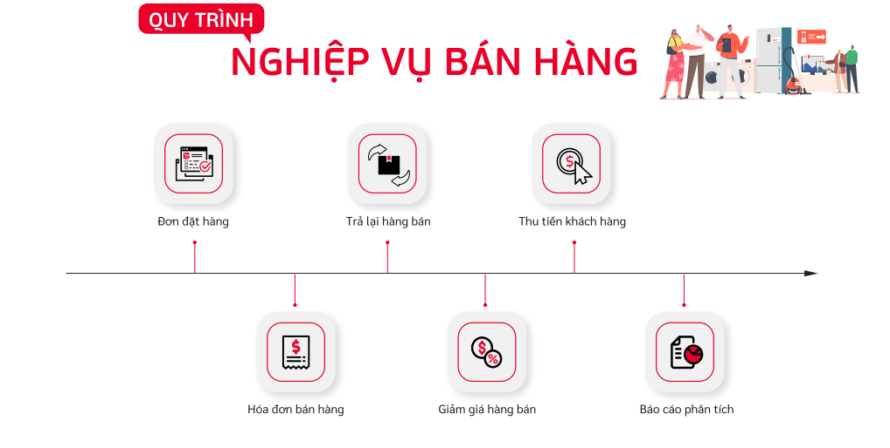

**Các luồng quy trình**

·     Lập đơn bán hàng gửi khách hàng. Chi tiết thao tác chức năng **[tại đây](#lap-on-ban-hang)**

·     Xuất kho đơn bán hàng. Chi tiết thao tác chức năng [**tại đây**](#xuat-kho-on-ban-hang)

·     Tạo hóa đơn bán hàng. Chi tiết thao tác chức năng **[tại đây](#hoa-on-ban-hang)**

·     Tạo hóa đơn bán hàng - Giảm thuế 20%. Chi tiết thao tác chức năng **[tại đây](#hoa-on-ban-hang-giam-thue-20)**

·     Ghi nhận thanh toán từ khách hàng. Chi tiết thao tác chức năng **[tại đây](ghi-nhan-thanh-toan-tu-khach-hang)**

·     Xuất hóa đơn điện tử. Chi tiết thao tác chức năng **[tại đây](xuat-hoa-on-ien-tu)**

·     Tạo hóa đơn giảm giá/Trả hàng. Chi tiết thao tác chức năng **[tại đây](hoa-on-giam-giatra-hang)**

## *Lập đơn bán hàng*

### Mô tả nghiệp vụ

**Nghiệp vụ**

Khi có nhu cầu mua sản phẩm, khách hàng sẽ liên hệ với hộ kinh doanh để đặt hàng. Người bán hàng thực hiện lập đơn hàng dựa trên nhu cầu của khách hàng

**Xem video hướng dẫn**

<iframe
    width="920"
    height="450"
    frameborder="0"
    allow="autoplay; encrypted-media; clipboard-write; gyroscope; picture-in-picture "
    allowfullscreen
    title="Lập đơn bán hàng" 
    src="https://www.youtube.com/embed/R__U1GqGegg"
></iframe>

### Hướng dẫn trên phần mềm

**Đối tượng thực hiện:** Người bán hàng

#### Lập đơn bán hàng gửi khách hàng

Có hai cách thực hiện tạo đơn bán hàng

*<u>Cách 1:</u>* Lập đơn bán hàng trực tiếp trên giao diện. Hướng dẫn cụ thể **[tại đây](#lap-on-ban-hang-tren-giao-dien)**

*<u>Cách 2:</u>* Lập đơn bán hàng từ việc import dữ liệu. Hướng dẫn cụ thể **[tại đây](#lap-on-ban-hang-tu-viec-import-du-lieu)**

##### Lập đơn bán hàng trên giao diện	

**Bước 1:** Vào phân hệ **Bán hàng**, Chọn **Đơn bán hàng**, chọn **Báo giá** 

Hoặc thực hiện **Tìm kiếm** trực tiếp chức năng trên ô tìm kiếm chung của hệ thống

**Bước 2:** Nhấn nút **Tạo** trên chức năng để thực hiện thêm một đơn hàng mới. Khai báo các thông tin chi tiết trên đơn bán hàng. 

**Lưu ý**: Các ô màu hồng là những thông tin cần bắt buộc nhập

·     Chọn thông tin ***khách hàng***. Nếu chưa có khách hàng thì có thể nhập bổ sung thêm bằng cách nhập tên khách hàng và chọn tạo mới 

hoặc vào đường dẫn **Danh mục/Khách hàng** và thực hiện thêm mới

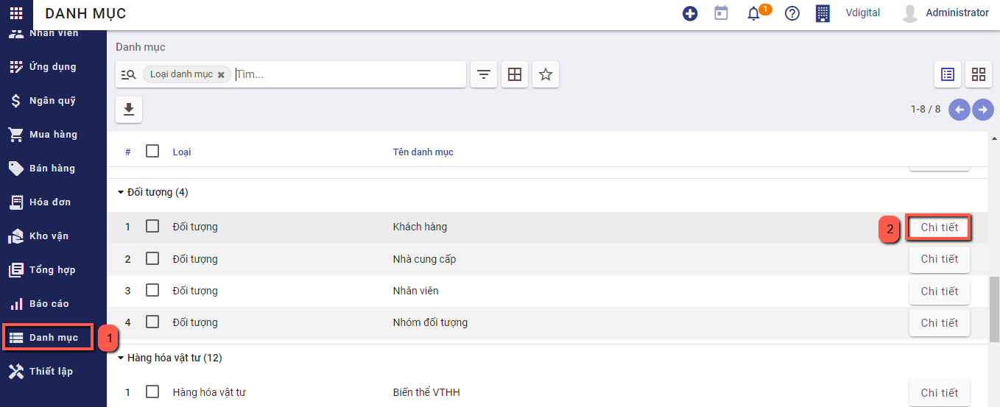

·     Chọn ***bảng giá***,  là tiền tệ giao dịch trong Đơn hàng

·     Khai báo thêm thông tin về ***Ngày đặt hàng, hiệu lực đến, điều khoản thanh toán*** (Xác định thời gian để thanh toán), ***nội dung*** chi tiết đơn hàng

Mục **Điều khoản thanh toán**: Nếu có thỏa thuận về điều kiện thanh toán với khách hàng, thực hiện chọn thông tin Điều khoản đã được khai báo trên Danh mục **Điều khoản thanh toán** . Trường hợp đã thiết lập điều khoản thanh toán cho từng khách hàng tại danh mục **Khách hàng** thì chương trình sẽ tự động hiển thị sẵn thông tin này theo nhà cung cấp được chọn

·     Khai báo thêm thông tin về Sản phẩm/dịch vụ tại chi tiết đơn hàng bằng cách nhấn chọn **Thêm sản phẩm**   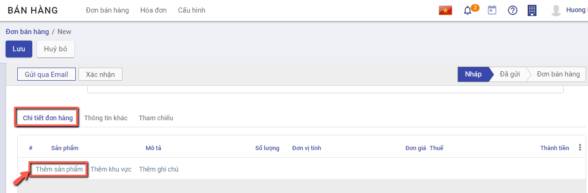

​			Chọn các sản phẩm bán hàng cho khách hàng

​			Nhập thông tin Số lượng, Đơn giá,  mức Thuế đối với từng Sản phẩm

​			Khi thực hiện Thêm ghi chú --> Thông tin nội dung sẽ được in trên file gửi khách hàng

**Bước 3**: Nhấn **Lưu**

##### Lập đơn bán hàng từ việc import dữ liệu

**Bước 1:** Vào phân hệ **Bán hàng**, Chọn **Đơn bán hàng**  hoặc **Đơn đặt hàng** trên quy trình

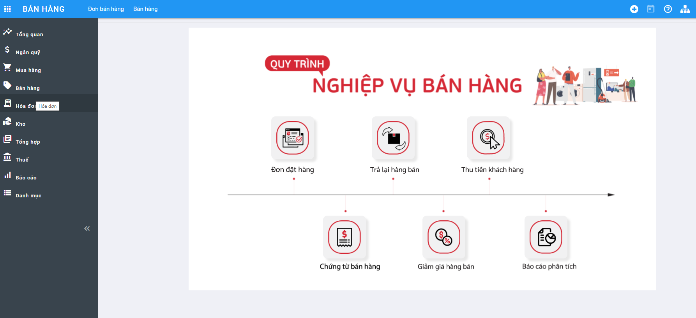

Hoặc thực hiện **Tìm kiếm** trực tiếp chức năng trên ô tìm kiếm chung của hệ thống

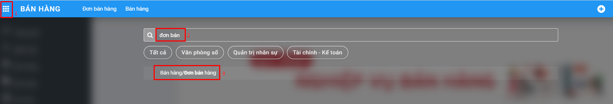

**Bước 2:** Trên danh sách đơn hàng, nhấn biểu tượng hình ngôi sao, chọn **Thêm bản ghi**

Sau khi mở màn hình import thông tin, thực hiện xuất file mẫu bằng cách chọn **Mẫu nhập khẩu đơn bán hàng** để thực hiện xuất file mẫu excel

Trên file excel vừa xuất, người dùng thực hiện nhập thông tin đơn hàng tương ứng tại các cột, hướng dẫn cụ thể có trong phần commnent tại hàng đầu tiên của mỗi cột

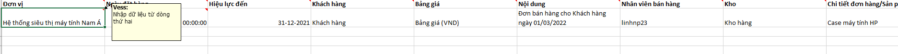

Đơn vị: Bắt buộc nhập, nhập tên đơn vị
Ngày đặt hàng: Nhập ngày theo định dạng ngày-tháng-năm	
Hiệu lực đến: Nhập ngày theo định dạng ngày-tháng-năm	
Khách hàng: Bắt buộc nhập, Nhập tên khách hàng	
Bảng giá: Bắt buộc chọn	
Nội dung: Nhập nội dung đơn hàng
Nhân viên bán hàng: Nhập tên nhân viên bán hàng	
Kho: Nhập tên kho của đơn vị
Chi tiết đơn hàng/Sản phẩm: Bắt buộc nhập, nhập tên hàng hóa cần bán	
Chi tiết đơn hàng/Đơn vị tính: Nhập tên đơn vị tính	
Chi tiết đơn hàng/Số lượng: Bắt buộc nhập, Nhập số lượng	
Chi tiết đơn hàng/Đơn giá: Bắt buộc nhập, 	nhập đơn giá
Chi tiết đơn hàng/Thuế: Nhập tên loại thuế

Sau khi nhập thông tin vào file, thực hiện nhập dữ liệu bằng cách nhấn chọn **Nạp tập tin**

Chọn file vừa nhập thông tin, đợi hệ thống tải file, sau đó nhấn nút **Kiểm thử** để kiểm tra thông tin trong file có chính xác không.

Nếu như có lỗi thì sẽ hiển thị thông báo lỗi cụ thể tại cột nào, dòng nào. 

Lưu ý: Những thông báo màu hồng là thông tin cần sửa lại, thông báo màu vàng có thể bỏ qua

Nếu như cần sửa chữa thông tin trong file nhập liệu thì người dùng chọn lại **Nạp tập tin** và chọn file vừa sửa

Nếu đã chính xác thì sẽ hiển thị thông báo màu xanh : "Mọi thứ dường như hợp lệ". Người dùng nhấn **Nhập** để bắt đầu import dữ liệu vào hệ thống

Nếu không muốn import thì nhấn **Hủy**	

Khi import thành công, hệ thống  sẽ tự động quay về màn hình danh sách và hiển thị thông báo số lượng bản ghi đã được import, các bản ghi được import thành công ở trạng thái báo giá

#### **Thực hiện gửi đơn hàng cho khách hàng**

**Bước 1**: Sau khi đã có đơn hàng để gửi khách hàng, Thực hiện **In đơn hàng** bằng cách chọn chức năng **In**

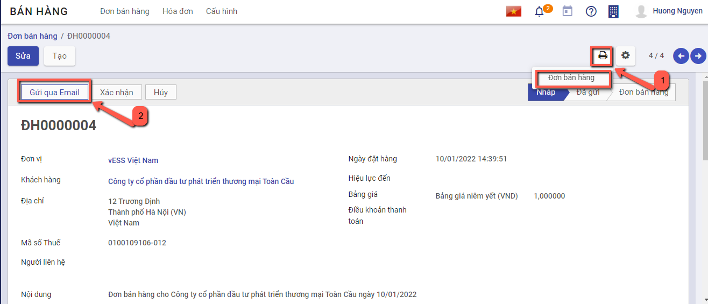

**Bước 2:** Thực hiện **Gửi qua Email** đến khách hàng sau khi hoàn thành  báo giá, có thể tùy chỉnh thông tin mẫu gửi báo giá theo yêu cầu

#### Xác nhận đơn bán hàng

Tại đơn hàng đã tạo, nếu khách hàng thực sự có nhu cầu mua hàng, người bán hàng nhấn nút **Xác nhận** để hoàn thành đơn hàng

Nếu không còn nhu cầu bán hàng, người bán nhấn **Hủy** hoặc thực hiện xóa đơn hàng đã tạo

Sau khi có đơn hàng, sản phẩm sẽ được giao cho khách hàng

## *Xuất kho đơn bán hàng*

### Mô tả nghiệp vụ

Sau khi thực hiện **Xác nhận đơn hàng**, chương trình tự động sinh ra một yêu cầu giao hàng. Người dùng có thể theo dõi tình trạng giao hàng của sản phẩm trên phiếu xuất kho đã sinh ra và xác nhận số lượng sản phẩm bàn giao theo đơn hàng 

**Xem video hướng dẫn**

<iframe
    width="920"
    height="450"
    frameborder="0"
    allow="autoplay; encrypted-media; clipboard-write; gyroscope; picture-in-picture "
    allowfullscreen
    title="Xuất kho đơn bán hàng" 
    src="https://www.youtube.com/embed/B6OEshsPSmU"
></iframe>

### **Hướng dẫn trên phần mềm**

**Bước 1**: Chọn **Phiếu xuất kho**, hệ thống chuyển sang chức năng phiếu xuất kho. 

**Bước 2**: Thực hiện nhập số lượng hàng đã hoàn thành giao cho khách hàng 

- Nếu Số lượng xuất kho đủ theo Số lượng của Đơn bán hàng: Thực hiện nhấn **Xác nhận** để xác nhận toàn bộ Đơn hàng

  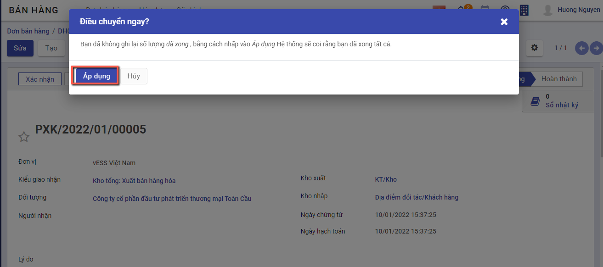

- Nếu Số lượng xuất kho Chưa đủ theo Số lượng của Đơn bán hàng: Thực hiện nhập số lượng theo thực tế bằng cách nhấn **Sửa**, vào nhóm **Vật tư, hàng hóa chi tiết**, nhập số lương **hoàn thành**, sau đó nhấn **Lưu**

  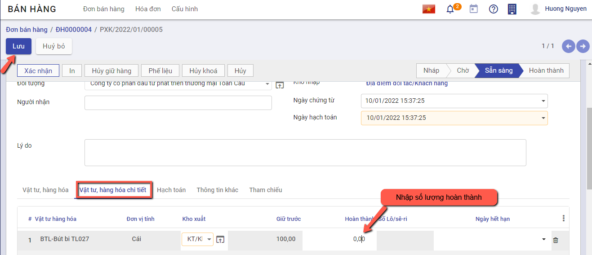

Nhấn **Xác nhận** để hoàn thành xuất hàng giao cho khách hàng

Khi đó có 2 hướng thực hiện :

- Nếu chọn **Tạo phần dở dang**: Với Số lượng còn thiếu, hệ thống tạo sẵn 1 chứng từ Phiếu xuất kho, để Khi nhập kho với Số lượng còn lại, bộ phận Kho tiếp tục vào Phiếu xuất kho (đã tạo phần dở dang) để thực hiện Xác nhận Số lượng xuất kho còn lại.
- Nếu chọn **Không tạo phần dở dang**: Khi đó hệ thống Tách Số lượng nhu cầu ban đầu Bằng đúng Số lượng thực xuất, còn Số lượng chênh chưa nhận được thì Số lượng hoàn thành = 0

Như vậy **Phiếu xuất kho** đã **Hoàn thành** .

## *Hóa đơn bán hàng*

### Mô tả nghiệp vụ

Sau khi giao hàng thành công, người dùng thực hiện kiểm tra dữ liệu và lập hóa đơn bán hàng và gửi hóa đơn cho khách hàng

### Hướng dẫn trên phần mềm

Người dùng có thể lập hóa đơn bán hàng theo hai cách khác nhau

**Cách 1**:Lập hóa đơn bán hàng từ đơn bán hàng. Chi tiết nghiệp vụ **[tại đây](#Lap-hoa-don-ban-hang-tu-don-ban-hang)**

**Cách 2**: Lập hóa đơn bán hàng không từ đơn bán hàng. Chi tiết nghiệp vụ **[tại đây](#Lap-hoa-don-ban-hang-khong-tu-don-ban-hang)**

#### Lập hóa đơn bán hàng từ đơn bán hàng

**Xem video hướng dẫn**

<iframe
    width="920"
    height="450"
    frameborder="0"
    allow="autoplay; encrypted-media; clipboard-write; gyroscope; picture-in-picture "
    allowfullscreen
    title="Lập hóa đơn bán hàng từ đơn bán hàng" 
    src="https://www.youtube.com/embed/p-VOJ1ilMms"
></iframe>

Đối tượng thực hiện: Người bán hàng

**Bước 1**: Vào phân hệ **Bán hàng**, Chọn **Đơn bán hàng** đã hoàn thành Giao hàng cho khách hàng và Nhấn **Tạo hóa đơn**

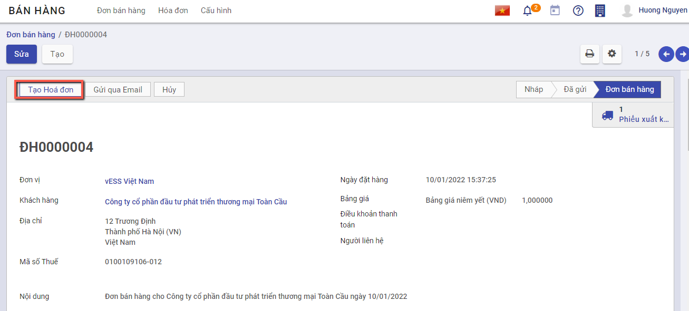

**Bước 2**: Trên màn hình **Tạo Hóa đơn**, kế toán thực hiện chọn loại hóa đơn thanh toán dựa trên số tiền khách hành thanh toán

- Hóa đơn thông thường: Hệ thống tạo 1 hóa đơn với số lượng, số tiền tương ứng với đơn bán hàng
- Tiền đặt cọc (Theo phần trăm): Hệ thống tạo 1 hóa đơn với số tiền thanh toán theo tỷ lệ phần trăm với số tiền bên đơn bán hàng
- Tiền đặt cọc (Số tiền cố định): Hệ thống tạo 1 hóa đơn với số tiền thanh toán bằng số tiền đã nhập sẵn trên giao diện

Chọn **Tạo & xem hóa đơn** hoặc **Tạo hóa đơn** để thực hiện sinh hóa đơn theo yêu cầu

**Bước 3**: Trên thông tin **Hóa đơn bán hàng** vừa được tạo , Nhân viên thực hiện nhập các dữ liệu về:

- Hóa đơn: **Ngày hóa đơn, Mẫu số hóa đơn,  Số hóa đơn**

  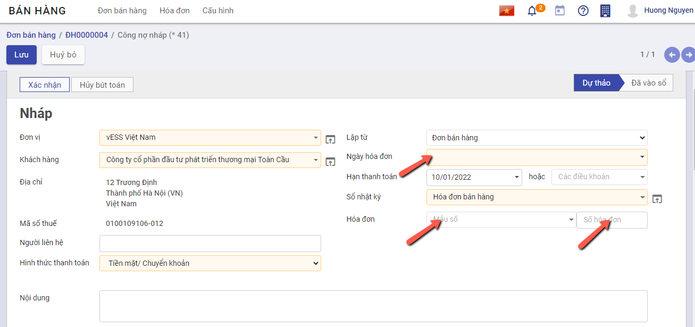

- Chọn và nhập thông tin về Thuế và Chiết khấu tương ứng của Đơn hàng (Nếu có)

  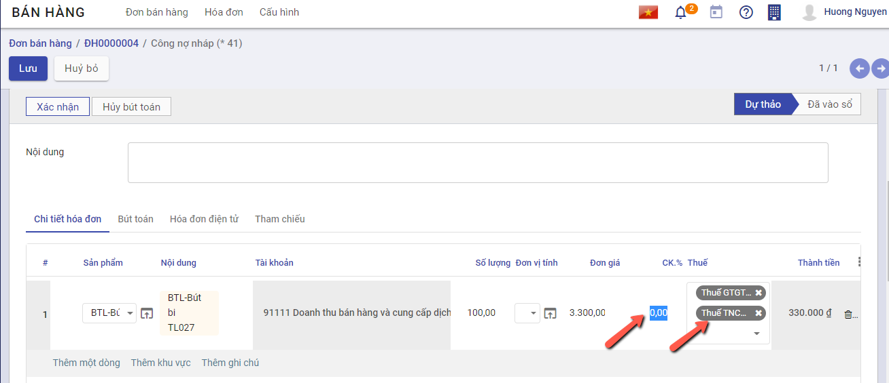

**Bước 4**: Nhân viên thực hiện nhấn **Xác nhận**

**Lưu ý:** Để nhìn lại tình trạng hóa đơn của đơn bán hàng, người dùng có thể vào chức năng đơn bán hàng, nhấn chọn **Hóa đơn** tại góc phải màn hình 

#### Lập hóa đơn bán hàng không từ đơn bán hàng

Đối tượng thực hiện: Người bán hàng

**Xem video hướng dẫn**

<iframe
    width="920"
    height="450"
    frameborder="0"
    allow="autoplay; encrypted-media; clipboard-write; gyroscope; picture-in-picture "
    allowfullscreen
    title="Lập hóa đơn bán hàng không từ đơn bán hàng" 
    src="https://www.youtube.com/embed/Sa1cBRDhPsc"
></iframe>
**Bước 1**: Vào phân hệ **Bán hàng**, Chọn **Hóa đơn** , chọn **Hóa đơn bán hàng** 

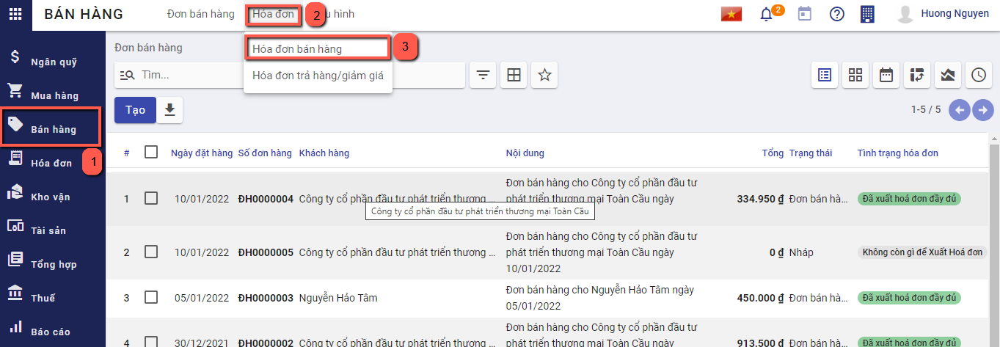

Hoặc thực hiện **Tìm kiếm** trực tiếp chức năng trên ô tìm kiếm chung của hệ thống

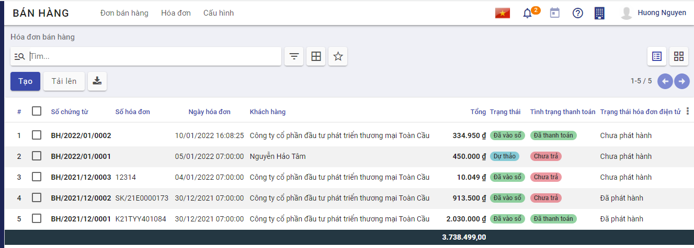

**Bước 2**: Nhấn nút **tạo**  để thêm hóa đơn. 

Trên thông tin Hóa đơn bán hàng, Nhân viên kế toán thực hiện nhập các dữ liệu về:

- Chọn thông tin ***khách hàng***. Nếu chưa có khách hàng thì có thể nhập bổ sung thêm bằng cách nhập tên khách hàng và chọn tạo mới 

hoặc vào đường dẫn **Danh mục/Khách hàng** và thực hiện thêm mới

- Nhập bổ sung thông tin gồm: Ngày hóa đơn, Mẫu số, Ký hiệu hóa đơn ,Số hóa đơn, hạn thanh toán

  

- Chọn và nhập thông tin về sản phẩm, số lượng, giá thành bán,Thuế và Chiết khấu của sản phẩm cần lập hóa đơn

  

**Bước 3**: Nhân viên Kế toán thực hiện nhấn **Lưu** . Hệ thống lưu thông tin chi tiết hóa đơn đã nhập và tự động sinh ra các chi tiết bút toán phát sinh

Thông tin dữ liệu bút toán phát sinh:

- Căn cứ thông tin Thuế  đã lựa chọn cùng với thông tin Chiết khấu, Đơn giá, Số lượng đã nhập bên chi tiết hóa đơn, hệ thống thực hiện mặc định thông tin các bút toán tương ứng

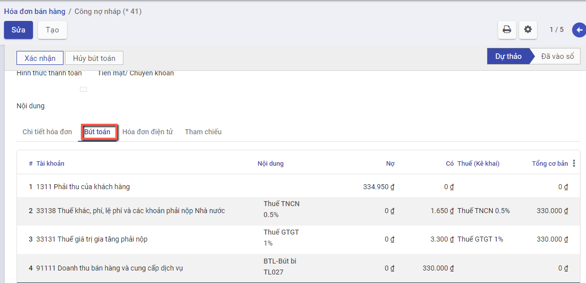

**Bước 4**: Nhân viên Kế toán thực hiện nhấn **Xác nhận** để hoàn thành xuất hóa đơn bán hàng

Sau khi xác nhận hóa đơn, hệ thống sẽ sinh dữ liệu vào chức năng "Thu tiền từ khách hàng", người dùng kiểm tra thông tin sẽ thanh toán bằng cách vào **Ngân quỹ/Tiền mặt/Thu tiền từ khách hàng** hoặc **Ngân quỹ/Tiền gửi/Thu tiền từ khách hàng** để kiểm tra lại số tiền sẽ được thanh toán

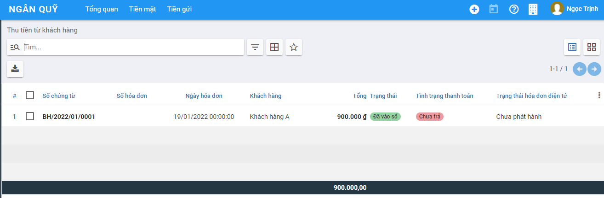

## *Hóa đơn bán hàng - Giảm thuế 20%*

### Mô tả nghiệp vụ

Sau khi giao hàng thành công, người dùng thực hiện kiểm tra dữ liệu và lập hóa đơn bán hàng cho những mặt hàng được quy định giảm thuế 20% theo Nghị quyết số 43/2022/QH15 và gửi hóa đơn cho khách hàng. 

**Giảm thuế 20%** Chỉ áp dụng với Công ty có **Thiết lập** tại nhóm **Kế toán** với **Phương pháp tính thuế GTGT** = **Trực tiếp trên doanh thu**

(Đối với Hộ kinh doanh cá thể: Thông tin thiết lập này được mặc định là  **Trực tiếp trên doanh thu**)

### Hướng dẫn trên phần mềm

#### Lập hóa đơn bán hàng có Giảm thuế 20%

**Xem video hướng dẫn**

<iframe
    width="920"
    height="450"
    frameborder="0"
    allow="autoplay; encrypted-media; clipboard-write; gyroscope; picture-in-picture "
    allowfullscreen
    title="Hóa đơn giảm thuế" 
    src="https://www.youtube.com/embed/jO_NiFQ5r_s"
></iframe>

Đối tượng thực hiện: Người bán hàng

**Bước 1**: Vào Màn hình qua 2 cách :

- **Cách 1**: Lập hóa đơn từ Đơn bán hàng bằng cách: Vào phân hệ **Bán hàng**, Chọn **Đơn bán hàng** đã hoàn thành Giao hàng cho khách hàng và Nhấn **Tạo hóa đơn**

Trên màn hình **Tạo Hóa đơn**, kế toán thực hiện chọn loại hóa đơn thanh toán dựa trên số tiền khách hành thanh toán

- Hóa đơn thông thường: Hệ thống tạo 1 hóa đơn với số lượng, số tiền tương ứng với đơn bán hàng

- Tiền đặt cọc (Theo phần trăm): Hệ thống tạo 1 hóa đơn với số tiền thanh toán theo tỷ lệ phần trăm với số tiền bên đơn bán hàng

- Tiền đặt cọc (Số tiền cố định): Hệ thống tạo 1 hóa đơn với số tiền thanh toán bằng số tiền đã nhập sẵn trên giao diện

  Chọn **Tạo & xem hóa đơn** hoặc **Tạo hóa đơn** để thực hiện sinh hóa đơn theo yêu cầu

- **Cách 2**: Lập Hóa đơn bán hàng không từ Đơn bán hàng (Lập trực tiếp) bằng cách: Vào phân hệ **Bán hàng**, Chọn **Hóa đơn** , chọn **Hóa đơn bán hàng** 

Hoặc thực hiện **Tìm kiếm** trực tiếp chức năng trên ô tìm kiếm chung của hệ thống

* Nhấn nút **tạo**  để thêm hóa đơn. 

**Bước 2**: Trên thông tin **Hóa đơn bán hàng** vừa được tạo , Nhân viên thực hiện nhập các dữ liệu về:

- Hóa đơn: **Ngày hóa đơn, Mẫu số hóa đơn,  Số hóa đơn** và **Tích chọn 'Giảm 20% thuế GTGT theo NQ 43** (Khi tích chọn giá trị này chương trình sẽ tự động tính phần giảm của Thuế GTGT )

  

  

- Chọn và nhập thông tin về Mặt hàng và Chiết khấu tương ứng của Đơn hàng (Nếu có), thông tin Thuế GTGT được giảm sẽ tính trực tiếp trên từng dòng mặt hàng

  

**Bước 3**: Nhân viên thực hiện nhấn **Xác nhận**

## *Ghi nhận thanh toán từ khách hàng*

### Mô tả nghiệp vụ

Người dùng thực hiện ghi nhận và theo dõi việc thanh toán của hóa đơn sau khi xác nhận xuất hóa đơn thành công

**Xem video hướng dẫn**

<iframe
    width="920"
    height="450"
    frameborder="0"
    allow="autoplay; encrypted-media; clipboard-write; gyroscope; picture-in-picture "
    allowfullscreen
    title="Ghi nhận thanh toán" 
    src="https://www.youtube.com/embed/wYLdUMfWHVQ"
></iframe>

### Hướng dẫn trên phần mềm

Đối tượng thực hiện: Người bán hàng

**Bước 1**: Vào phân hệ **Bán hàng**, chọn **Hóa đơn**, chọn **Hóa đơn bán hàng**. Trên danh sách hóa đơn bán hàng, kế toán tìm tới các hóa đơn đã được ghi sổ

**Bước 2**: Chọn hóa đơn cần thanh toán, Nhấn nút **Ghi nhận thanh toán**. 

Người dùng nhập và sửa thông tin Tài khoản ngân hàng người nhận, khách hàng, ngày thanh toán tiền, số tiền khách hàng đã trả

**Bước 3**: Nhấn **Tạo thanh toán**, hệ thống sinh phiếu thu tiền  để thu tiền khách hàng đã thực hiện trả

**Bước 4**: Để kiểm tra lại phiếu thu tiền, người dùng có thể tìm phiếu thu bằng cách:

Nếu Tại thông tin **Ghi nhận thanh toán**, **Sổ nhật ký** được chọn là **tiền mặt** thì người dùng vào chức năng **Ngân quỹ/Tiền mặt/Phiếu thu**. 

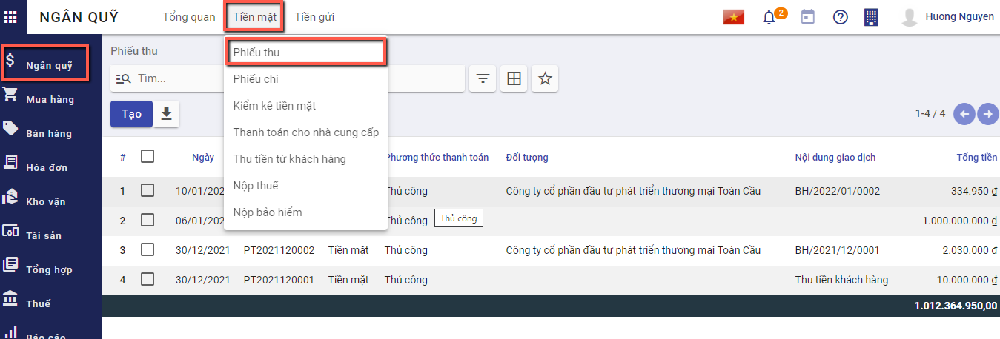

Nếu Tại thông tin **Ghi nhận thanh toán**, **Sổ nhật ký** được chọn là **tiền gửi** thì người dùng vào chức năng **Ngân quỹ/Tiền gửi/Báo có**. 

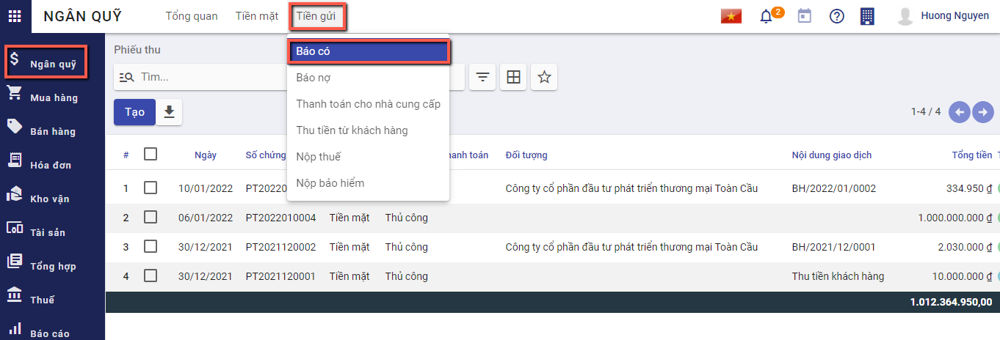

Người dùng có thể tìm thấy phiếu thu tiền dựa trên ngày thanh toán, đối tác thanh toán, tổng tiền, nội dung giao dịch

## *Hóa đơn giảm giá/trả hàng*

### Mô tả nghiệp vụ

Khi phát sinh nghiệp vụ giảm giá hàng bán hoặc trả lại hàng đã bán, thông thường sẽ có các hoạt động sau:

Nếu phát hiện hàng mua về không đúng quy cách, phẩm chất theo hợp đồng đã ký, khách hàng thoả thuận với doanh nghiệp trả lại hàng đã mua.

Cách 1: Người bán hàng lập hóa đơn giảm giá hàng bán để giao cho khách hàng và ghi sổ kế toán.Chi tiết nghiệp vụ **[tại đây](#tao-hoa-on-giam-gia)**

Cách 2: Người bán hàng chuyển đổi hóa đơn bán hàng thành khoản hoàn tiền/công nợ giảm. Chi tiết nghiệp vụ **[tại đây](#chuyen-oi-thanh-khoan-hoan-tiencong-no-giam)**

### Hướng dẫn trên phần mềm

Đối tượng thực hiện: Nhân viên kế toán

**Xem video hướng dẫn**

<iframe
    width="920"
    height="450"
    frameborder="0"
    allow="autoplay; encrypted-media; clipboard-write; gyroscope; picture-in-picture "
    allowfullscreen
    title="Tạo hóa đơn giảm giá" 
    src="https://www.youtube.com/embed/tQqF296qgGQ"
></iframe>

#### Tạo hóa đơn giảm giá

**Bước 1**: Vào phân hệ **Bán hàng**, chọn **Hóa đơn**, chọn **Hóa đơn bán hàng**. Trên danh sách hóa đơn bán hàng, kế toán tìm tới các hóa đơn đã được ghi sổ, nhấn chọn **Tạo HĐ giảm giá**

**Bước 2**: Nhập Lý do tạo hóa đơn, Nhấn **Đảo ngược**

Hệ thống tự sinh hóa đơn giảm giá với thông tin tương ứng với hóa đơn bán hàng. 

Trên hóa đơn giảm giá được sinh ra, kế toán khai báo  các thông tin trên chứng từ giảm giá hàng bán như: số lượng hàng được giảm, giá trị giảm

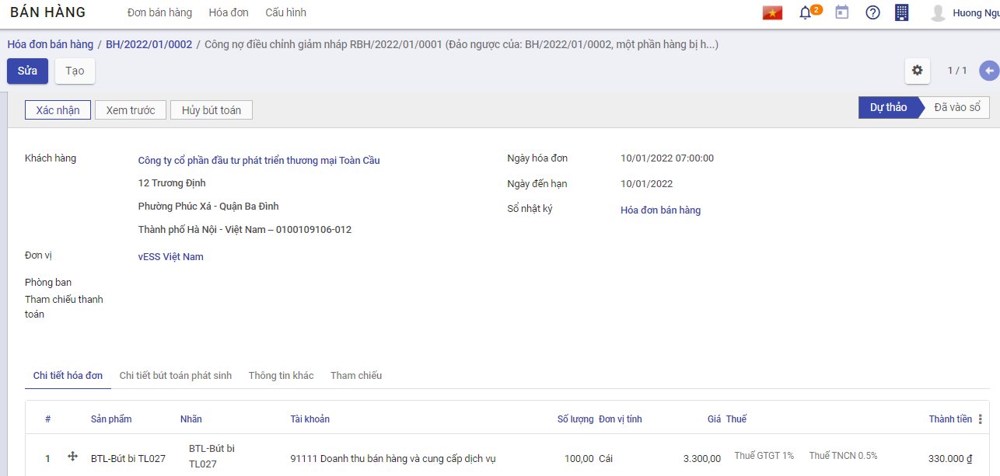

Nhấn **xác nhận** để ghi sổ thông tin hóa đơn. 

Sau đó, người dùng sẽ **xuất hóa đơn** để gửi lại cho khách hàng và **ghi nhận lại thanh toán**

#### Chuyển đổi thành khoản hoàn tiền/công nợ giảm

Bước 1: Vào phân hệ **Bán hàng**, chọn **Hóa đơn**, chọn **Hóa đơn bán hàng**. Trên danh sách hóa đơn bán hàng, kế toán tìm tới hóa đơn có nhu cầu hoàn hàng, nhấn chọn tiện ích/chuyển đổi thành khoản hoàn tiền/công nợ giảm

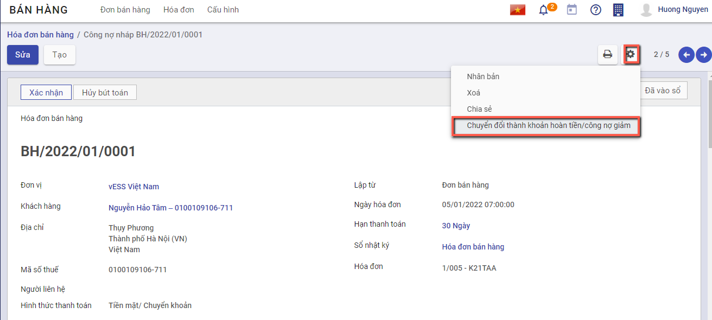

Hệ thống chuyển đổi từ hóa đơn bán hàng thành hóa đơn giảm giá/trả hàng, các thông tin được giữ nguyên

