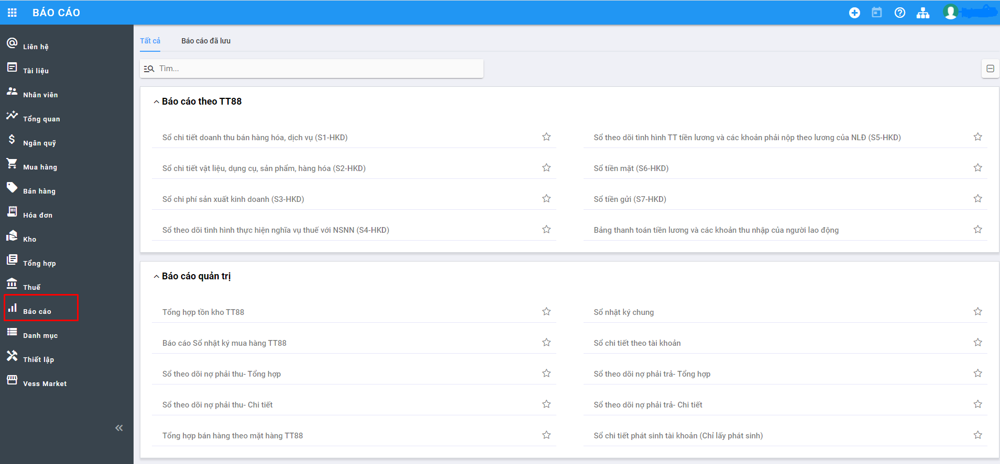
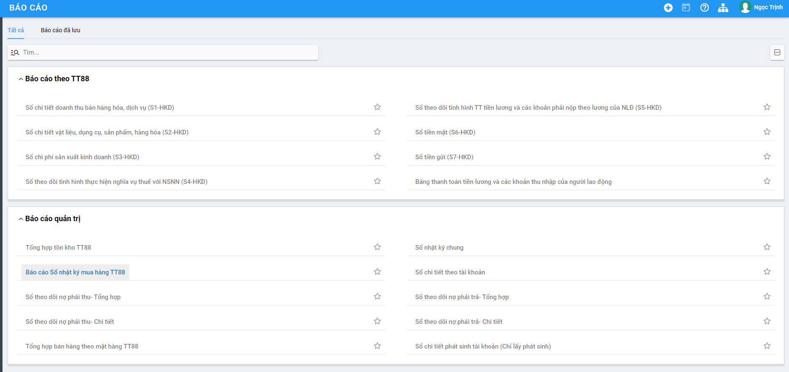
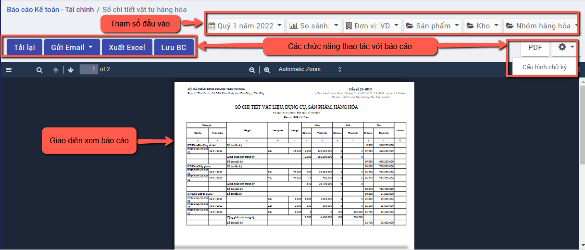
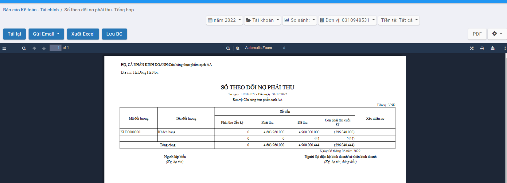
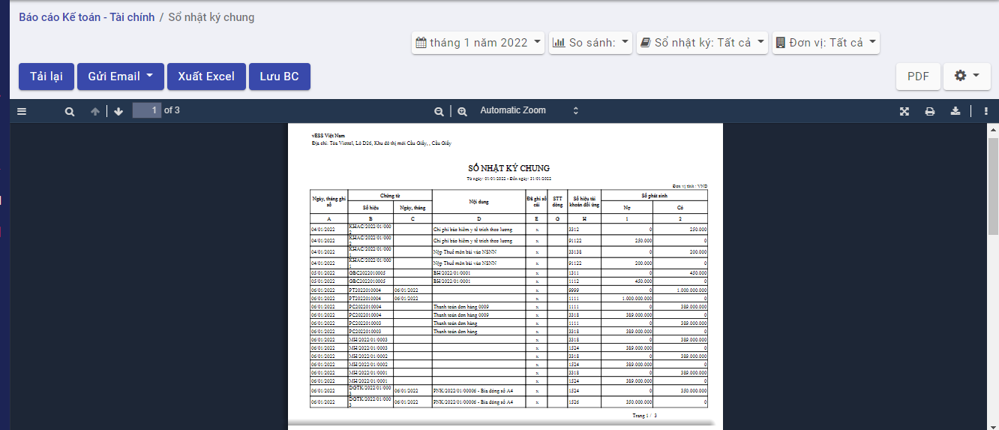
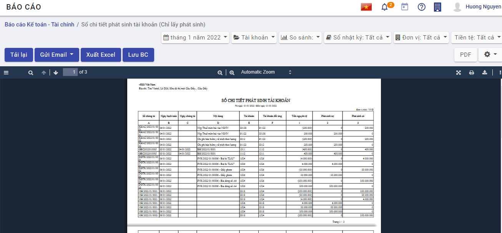
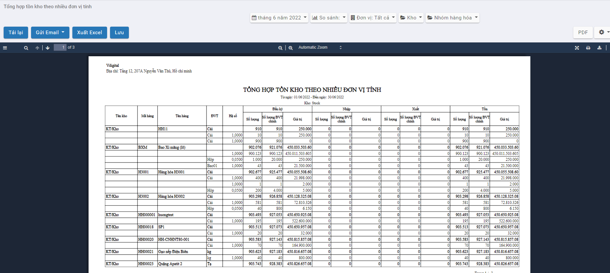

# *Quy trình nghiệp vụ*

Sau khi nhập chứng từ phát sinh, người dùng có thể xem được các báo cáo phân tích, thống kê dữ liệu và tùy chỉnh mẫu báo cáo theo nhu cầu

Danh sách báo cáo gồm có:

Báo cáo theo thông tư 88:

- Sổ chi tiết doanh thu bán hàng hóa, dịch vụ  (S1-HKD)
- Sổ chi tiết vật liệu, dụng cụ, sản phẩm, hàng hóa (S2-HKD)
- Sổ chi phí sản xuất kinh doanh (S3-HKD)
- Sổ theo dõi tình hình thực hiện nghĩa vụ thuế với NSNN  (S4-HKD)
- Sổ theo dõi tình hình TT tiền lương và các khoản phải nộp theo lương của NLĐ  (S5-HKD)
- Sổ tiền mặt  (S6-HKD)
- Sổ tiền gửi  (S7-HKD)
- Bảng thanh toán tiền lương và các khoản thu nhập của người lao động

Báo cáo quản trị:

- Tổng hợp tồn kho 
- Sổ nhật ký mua hàng
- Sổ theo dõi nợ phải thu - Tổng hợp
- Sổ theo dõi nợ phải thu - Chi tiết
- Tổng hợp bán hàng theo mặt hàng
- Sổ nhật ký chung
- Sổ chi tiết theo tài khoản
- Sổ theo dõi nợ phải trả - Tổng hợp
- Sổ theo dõi nợ phải trả - Chi tiết
- Sổ chi tiết phát sinh tài khoản
- Tổng hợp tồn kho theo nhiều đơn vị tính
- Báo cáo kết quả hoạt động kinh doanh
- Phụ lục giảm thuế GTGT theo nghị quyết số 43

## *Hướng dẫn xem báo cáo*

**Xem video hướng dẫn tại đây**

<iframe
    width="920"
    height="450"
    frameborder="0"
    allow="autoplay; encrypted-media; clipboard-write; gyroscope; picture-in-picture "
    allowfullscreen
    title="Báo cáo" 
    src="https://www.youtube.com/embed/2g9EPV_ZOv0?list=PLcdARb5pnnj8jeyvyhaptnwL3sxxT_QaK"
></iframe>

**Bước 1:** Vào phân hệ **Báo cáo**

Hoặc chọn biểu tượng  rồi chọn **Báo cáo**

**Bước 2**: Chọn một báo cáo muốn xem

**Bước 3**: Nhập thông tin tham số đầu vào tại góc phải  để xem báo cáo: Thời gian xuất báo cáo, đơn vị, ....

Sau khi chọn tham số, hệ thống tự động xuất ra báo cáo theo thông số đã chọn

**Bước 4**: trên cửa sổ báo cáo, người dùng có thể thực hiện thêm một số chức năng khác:

**Tải lại**: Xuất lại báo cáo theo tham số đang có

**Gửi email**: Cho phép gửi báo cáo này vào email

**Xuất excel**: Xuất báo cáo dưới dạng file excel (xls,xlsx)

**PDF**:  Xuất báo cáo dưới dạng file PDF(.pdf)

Tùy chọn **cấu hình chữ ký**: Bổ sung/xóa bỏ chân ký trên báo cáo. Người dùng nhấn nút  chọn cấu hình chữ ký --> Hiển thị thông tin các chân ký đang có thuộc báo cáo đang chọn

Người dùng có thể thay đổi chức danh, tiêu đề người ký, tên người ký cho phù hợp với biểu mẫu mong muốn

## *Sổ chi tiết doanh thu bán hàng hóa, dịch vụ  (S1-HKD)*

### Mô tả nghiệp vụ

**Nghiệp vụ**

Sổ chi tiết doanh thu bán hàng và cung cấp dịch vụ là mẫu sổ được lập ra để ghi chép về doanh thu bán hàng và cung cấp dịch vụ của hộ kinh doanh, cá thể

**Xem video hướng dẫn**

*[Xem video hướng dẫn cách xem báo cáo]*

### Hướng dẫn trên phần mềm

**Bước 1:** Vào phân hệ **Báo cáo**

Hoặc chọn biểu tượng  rồi chọn **Báo cáo**

**Bước 2**: Chọn báo cáo Sổ chi tiết doanh thu bán hàng hóa, dịch vụ  (S1-HKD)

**Bước 3**: Nhập thông tin tham số đầu vào tại góc phải  để xem báo cáo: Thời gian xuất báo cáo, đơn vị, ....

Sau khi chọn tham số, hệ thống tự động xuất ra báo cáo theo thông số đã chọn

Nhấn **Tải lại**: Xuất lại báo cáo theo tham số báo cáo đang hiển thị

Nhấn **Gửi email**: Mở màn hình gửi email có đính kèm theo báo cáo dạng PDF

Nhấn **Xuất excel**: Tải báo cáo xuống dưới dạng excel

Nhấn **Lưu BC**: Mở màn hình nhập thông tin để lưu lại báo cáo vào thư mục tài liệu chung của hệ thống

## *Sổ chi tiết vật liệu, dụng cụ, sản phẩm, hàng hóa (S2-HKD)*

### Mô tả nghiệp vụ

**Nghiệp vụ**

Sổ chi tiết vật liệu, dụng cụ, sản phẩm, hàng hóa (S2-HKD) dùng để theo dõi chi tiết tình hình nhập, xuất, tồn kho về cả số lượng và giá trị của từng nguyên liệu, hàng hóa, dụng cụ, sản phẩm ở từng kho

**Xem video hướng dẫn**

*[Xem video hướng dẫn cách xem báo cáo]*

### Hướng dẫn trên phần mềm

**Bước 1:** Vào phân hệ **Báo cáo**

Hoặc chọn biểu tượng  rồi chọn **Báo cáo**

**Bước 2**: Chọn báo cáo Sổ chi tiết vật liệu, dụng cụ, sản phẩm, hàng hóa (S2-HKD)

**Bước 3**: Nhập thông tin tham số đầu vào tại góc phải  để xem báo cáo: Thời gian xuất báo cáo, đơn vị, ....

Sau khi chọn tham số, hệ thống tự động xuất ra báo cáo theo thông số đã chọn

Nhấn **Tải lại**: Xuất lại báo cáo theo tham số báo cáo đang hiển thị

Nhấn **Gửi email**: Mở màn hình gửi email có đính kèm theo báo cáo dạng PDF

Nhấn **Xuất excel**: Tải báo cáo xuống dưới dạng excel

Nhấn **Lưu BC**: Mở màn hình nhập thông tin để lưu lại báo cáo vào thư mục tài liệu chung của hệ thống

## *Sổ chi phí sản xuất kinh doanh (S3-HKD)*

### Mô tả nghiệp vụ

**Nghiệp vụ**

Sổ chi phí sản xuất kinh doanh mở theo từng đối tượng tập hợp chi phí (theo khoản mục phí hoặc nội dung chi phí)

**Xem video hướng dẫn**

*[Xem video hướng dẫn cách xem báo cáo]*

### Hướng dẫn trên phần mềm

**Bước 1:** Vào phân hệ **Báo cáo**

Hoặc chọn biểu tượng  rồi chọn **Báo cáo**

**Bước 2**: Chọn báo cáo Sổ chi phí sản xuất kinh doanh (S3-HKD)

**Bước 3**: Nhập thông tin tham số đầu vào tại góc phải  để xem báo cáo: Thời gian xuất báo cáo, đơn vị, ....

Sau khi chọn tham số, hệ thống tự động xuất ra báo cáo theo thông số đã chọn

Nhấn **Tải lại**: Xuất lại báo cáo theo tham số báo cáo đang hiển thị

Nhấn **Gửi email**: Mở màn hình gửi email có đính kèm theo báo cáo dạng PDF

Nhấn **Xuất excel**: Tải báo cáo xuống dưới dạng excel

Nhấn **Lưu BC**: Mở màn hình nhập thông tin để lưu lại báo cáo vào thư mục tài liệu chung của hệ thống

## *Sổ theo dõi tình hình thực hiện nghĩa vụ thuế với NSNN  (S4-HKD)*

### Mô tả nghiệp vụ

**Nghiệp vụ**

Sổ theo dõi tình hình thực hiện nghĩa vụ thuế với NSNN là mẫu sổ được lập ra để thống kê tình hình nộp thuế vào ngân sách nhà nước

**Xem video hướng dẫn**

*[Xem video hướng dẫn cách xem báo cáo]*

### Hướng dẫn trên phần mềm

**Bước 1:** Vào phân hệ **Báo cáo**

Hoặc chọn biểu tượng  rồi chọn **Báo cáo**

**Bước 2**: Chọn báo cáo Sổ theo dõi tình hình thực hiện nghĩa vụ thuế với NSNN  (S4-HKD)

**Bước 3**: Nhập thông tin tham số đầu vào tại góc phải  để xem báo cáo: Thời gian xuất báo cáo, đơn vị, ....

Sau khi chọn tham số, hệ thống tự động xuất ra báo cáo theo thông số đã chọn

Nhấn **Tải lại**: Xuất lại báo cáo theo tham số báo cáo đang hiển thị

Nhấn **Gửi email**: Mở màn hình gửi email có đính kèm theo báo cáo dạng PDF

Nhấn **Xuất excel**: Tải báo cáo xuống dưới dạng excel

Nhấn **Lưu BC**: Mở màn hình nhập thông tin để lưu lại báo cáo vào thư mục tài liệu chung của hệ thống

## *Sổ theo dõi tình hình TT tiền lương và các khoản phải nộp theo lương của NLĐ  (S5-HKD)*

### Mô tả nghiệp vụ

**Nghiệp vụ**

Sổ theo dõi tình hình TT tiền lương và các khoản phải nộp theo lương của NLĐ là mẫu sổ được lập ra để theo dõi về tình hình thanh toán tiền lương và các khoản nộp theo lương

**Xem video hướng dẫn**

*[Xem video hướng dẫn cách xem báo cáo]*

### Hướng dẫn trên phần mềm

**Bước 1:** Vào phân hệ **Báo cáo**

Hoặc chọn biểu tượng  rồi chọn **Báo cáo**

**Bước 2**: Chọn báo cáo Sổ theo dõi tình hình TT tiền lương và các khoản phải nộp theo lương của NLĐ  (S5-HKD)

**Bước 3**: Nhập thông tin tham số đầu vào tại góc phải  để xem báo cáo: Thời gian xuất báo cáo, đơn vị, ....

Sau khi chọn tham số, hệ thống tự động xuất ra báo cáo theo thông số đã chọn

Nhấn **Tải lại**: Xuất lại báo cáo theo tham số báo cáo đang hiển thị

Nhấn **Gửi email**: Mở màn hình gửi email có đính kèm theo báo cáo dạng PDF

Nhấn **Xuất excel**: Tải báo cáo xuống dưới dạng excel

Nhấn **Lưu BC**: Mở màn hình nhập thông tin để lưu lại báo cáo vào thư mục tài liệu chung của hệ thống

## *Sổ tiền mặt  (S6-HKD)*

### Mô tả nghiệp vụ

**Nghiệp vụ**

Sổ tiền mặt là mẫu sổ được sử dụng khá thường xuyên để theo dõi tình hình thu chi và tồn quỹ bằng tiền mặt của một đơn vị, tổ chức, doanh nghiệp

**Xem video hướng dẫn**

*[Xem video hướng dẫn cách xem báo cáo]*

### Hướng dẫn trên phần mềm

**Bước 1:** Vào phân hệ **Báo cáo**

Hoặc chọn biểu tượng  rồi chọn **Báo cáo**

**Bước 2**: Chọn báo cáo Sổ tiền mặt  (S6-HKD)

**Bước 3**: Nhập thông tin tham số đầu vào tại góc phải  để xem báo cáo: Thời gian xuất báo cáo, đơn vị, ....

Sau khi chọn tham số, hệ thống tự động xuất ra báo cáo theo thông số đã chọn

Nhấn **Tải lại**: Xuất lại báo cáo theo tham số báo cáo đang hiển thị

Nhấn **Gửi email**: Mở màn hình gửi email có đính kèm theo báo cáo dạng PDF

Nhấn **Xuất excel**: Tải báo cáo xuống dưới dạng excel

Nhấn **Lưu BC**: Mở màn hình nhập thông tin để lưu lại báo cáo vào thư mục tài liệu chung của hệ thống

## *Sổ tiền gửi  (S7-HKD)*

### Mô tả nghiệp vụ

**Nghiệp vụ**

Sổ tiền gửi là mẫu sổ dùng để theo dõi chi tiết tiền Việt Nam của một cá thể gửi tại ngân hàng

**Xem video hướng dẫn**

*[Xem video hướng dẫn cách xem báo cáo]*

### Hướng dẫn trên phần mềm

**Bước 1:** Vào phân hệ **Báo cáo**

Hoặc chọn biểu tượng  rồi chọn **Báo cáo**

**Bước 2**: Chọn báo cáo Sổ tiền gửi  (S7-HKD)

**Bước 3**: Nhập thông tin tham số đầu vào tại góc phải  để xem báo cáo: Thời gian xuất báo cáo, đơn vị, ....

Sau khi chọn tham số, hệ thống tự động xuất ra báo cáo theo thông số đã chọn

Nhấn **Tải lại**: Xuất lại báo cáo theo tham số báo cáo đang hiển thị

Nhấn **Gửi email**: Mở màn hình gửi email có đính kèm theo báo cáo dạng PDF

Nhấn **Xuất excel**: Tải báo cáo xuống dưới dạng excel

Nhấn **Lưu BC**: Mở màn hình nhập thông tin để lưu lại báo cáo vào thư mục tài liệu chung của hệ thống

## *Bảng thanh toán tiền lương và các khoản thu nhập của người lao động*

### Mô tả nghiệp vụ

**Nghiệp vụ**

Bảng thanh toán tiền lương và các khoản thu nhập của người lao động là báo cáo hiển thị số tiền cần trả, phải trả tiền lương, phụ cấp, các khoản thanh toán cho bảo hiểm

**Xem video hướng dẫn**

*[Xem video hướng dẫn cách xem báo cáo]*

### Hướng dẫn trên phần mềm

**Bước 1:** Vào phân hệ **Báo cáo**

Hoặc chọn biểu tượng  rồi chọn **Báo cáo**

**Bước 2**: Chọn báo cáo Bảng thanh toán tiền lương và các khoản thu nhập của người lao động

**Bước 3**: Nhập thông tin tham số đầu vào tại góc phải  để xem báo cáo: Thời gian xuất báo cáo, đơn vị, ....

Sau khi chọn tham số, hệ thống tự động xuất ra báo cáo theo thông số đã chọn

Nhấn **Tải lại**: Xuất lại báo cáo theo tham số báo cáo đang hiển thị

Nhấn **Gửi email**: Mở màn hình gửi email có đính kèm theo báo cáo dạng PDF

Nhấn **Xuất excel**: Tải báo cáo xuống dưới dạng excel

Nhấn **Lưu BC**: Mở màn hình nhập thông tin để lưu lại báo cáo vào thư mục tài liệu chung của hệ thống

## *Tổng hợp tồn kho*

### Mô tả nghiệp vụ

**Nghiệp vụ**

Tổng hợp tồn kho là báo cáo kiểm soát số lượng hàng hóa vật tư còn tồn tại từng kho đơn vị đang có theo tháng

**Xem video hướng dẫn**

*[Xem video hướng dẫn cách xem báo cáo]*

### Hướng dẫn trên phần mềm

**Bước 1:** Vào phân hệ **Báo cáo**

Hoặc chọn biểu tượng  rồi chọn **Báo cáo**

**Bước 2**: Chọn báo cáo Tổng hợp tồn kho TT88

**Bước 3**: Nhập thông tin tham số đầu vào tại góc phải  để xem báo cáo: Thời gian xuất báo cáo, đơn vị, kho....

Sau khi chọn tham số, hệ thống tự động xuất ra báo cáo theo thông số đã chọn

Nhấn **Tải lại**: Xuất lại báo cáo theo tham số báo cáo đang hiển thị

Nhấn **Gửi email**: Mở màn hình gửi email có đính kèm theo báo cáo dạng PDF

Nhấn **Xuất excel**: Tải báo cáo xuống dưới dạng excel

Nhấn **Lưu BC**: Mở màn hình nhập thông tin để lưu lại báo cáo vào thư mục tài liệu chung của hệ thống

## *Sổ nhật ký mua hàng*

### Mô tả nghiệp vụ

**Nghiệp vụ**

Sổ nhật ký mua hàng là một loại sổ Nhật ký đặc biệt dùng để ghi chép các nghiệp vụ mua hàng theo từng loại hàng tồn kho của đơn vị, như: Nguyên liệu, vật liệu; công cụ, dụng cụ; hàng hoá

**Xem video hướng dẫn**

*[Xem video hướng dẫn cách xem báo cáo]*

### Hướng dẫn trên phần mềm

**Bước 1:** Vào phân hệ **Báo cáo**

Hoặc chọn biểu tượng  rồi chọn **Báo cáo**

**Bước 2**: Chọn báo cáo Sổ nhật ký mua hàng

**Bước 3**: Nhập thông tin tham số đầu vào tại góc phải  để xem báo cáo: Thời gian xuất báo cáo, đơn vị, ....

Sau khi chọn tham số, hệ thống tự động xuất ra báo cáo theo thông số đã chọn

Nhấn **Tải lại**: Xuất lại báo cáo theo tham số báo cáo đang hiển thị

Nhấn **Gửi email**: Mở màn hình gửi email có đính kèm theo báo cáo dạng PDF

Nhấn **Xuất excel**: Tải báo cáo xuống dưới dạng excel

Nhấn **Lưu BC**: Mở màn hình nhập thông tin để lưu lại báo cáo vào thư mục tài liệu chung của hệ thống

## *Sổ theo dõi nợ phải thu - Tổng hợp*

### Mô tả nghiệp vụ

**Nghiệp vụ**

Sổ theo dõi nợ phải thu là loại sổ kế toán được mở để theo dõi công nợ phải thu của khách hàng, hay nói cách khác là theo dõi các đối tượng chi tiết của tài khoản 131 - Phải thu của khách hàng

**Xem video hướng dẫn**

*[Xem video hướng dẫn cách xem báo cáo]*

### Hướng dẫn trên phần mềm

**Bước 1:** Vào phân hệ **Báo cáo**

Hoặc chọn biểu tượng  rồi chọn **Báo cáo**

**Bước 2**: Chọn báo cáo Sổ theo dõi nợ phải thu - tổng hợp

**Bước 3**: Nhập thông tin tham số đầu vào tại góc phải  để xem báo cáo: Thời gian xuất báo cáo, đơn vị,tài khoản, tiền tệ ....

Sau khi chọn tham số, hệ thống tự động xuất ra báo cáo theo thông số đã chọn

Nhấn **Tải lại**: Xuất lại báo cáo theo tham số báo cáo đang hiển thị

Nhấn **Gửi email**: Mở màn hình gửi email có đính kèm theo báo cáo dạng PDF

Nhấn **Xuất excel**: Tải báo cáo xuống dưới dạng excel

Nhấn **Lưu BC**: Mở màn hình nhập thông tin để lưu lại báo cáo vào thư mục tài liệu chung của hệ thống

## *Sổ theo dõi nợ phải thu - Chi tiết*

### Mô tả nghiệp vụ

**Nghiệp vụ**

Sổ theo dõi nợ phải thu là loại sổ kế toán được mở để theo dõi công nợ phải thu của khách hàng, hay nói cách khác là theo dõi các đối tượng chi tiết của tài khoản 131 - Phải thu của khách hàng

**Xem video hướng dẫn**

*[Xem video hướng dẫn cách xem báo cáo]*

### Hướng dẫn trên phần mềm

**Bước 1:** Vào phân hệ **Báo cáo**

Hoặc chọn biểu tượng  rồi chọn **Báo cáo**

**Bước 2**: Chọn báo cáo Sổ theo dõi nợ phải thu - chi tiết

**Bước 3**: Nhập thông tin tham số đầu vào tại góc phải  để xem báo cáo: Thời gian xuất báo cáo, đơn vị,tài khoản, tiền tệ ....

Sau khi chọn tham số, hệ thống tự động xuất ra báo cáo theo thông số đã chọn

Nhấn **Tải lại**: Xuất lại báo cáo theo tham số báo cáo đang hiển thị

Nhấn **Gửi email**: Mở màn hình gửi email có đính kèm theo báo cáo dạng PDF

Nhấn **Xuất excel**: Tải báo cáo xuống dưới dạng excel

Nhấn **Lưu BC**: Mở màn hình nhập thông tin để lưu lại báo cáo vào thư mục tài liệu chung của hệ thống

## *Tổng hợp bán hàng theo mặt hàng*

### Mô tả nghiệp vụ

**Nghiệp vụ**

Báo cáo tổng hợp bán hàng theo mặt hàng có ý nghĩa giúp người quản lý biết được số lượng sản phẩm đã bán được trong khoảng thời gian tìm kiếm

**Xem video hướng dẫn**

*[Xem video hướng dẫn cách xem báo cáo]*

### Hướng dẫn trên phần mềm

**Bước 1:** Vào phân hệ **Báo cáo**

Hoặc chọn biểu tượng  rồi chọn **Báo cáo**

**Bước 2**: Chọn báo cáo Tổng hợp bán hàng theo mặt hàng

**Bước 3**: Nhập thông tin tham số đầu vào tại góc phải  để xem báo cáo: Thời gian xuất báo cáo, đơn vị, ....

Sau khi chọn tham số, hệ thống tự động xuất ra báo cáo theo thông số đã chọn

Nhấn **Tải lại**: Xuất lại báo cáo theo tham số báo cáo đang hiển thị

Nhấn **Gửi email**: Mở màn hình gửi email có đính kèm theo báo cáo dạng PDF

Nhấn **Xuất excel**: Tải báo cáo xuống dưới dạng excel

Nhấn **Lưu BC**: Mở màn hình nhập thông tin để lưu lại báo cáo vào thư mục tài liệu chung của hệ thống

## *Sổ nhật ký chung*

### Mô tả nghiệp vụ

**Nghiệp vụ**

Sổ nhật ký chung dùng để ghi chép các nghiệp vụ kinh tế, tài chính phát sinh theo trình tự thời gian đồng thời phản ánh quan hệ đối ứng tài khoản

**Xem video hướng dẫn**

*[Xem video hướng dẫn cách xem báo cáo]*

### Hướng dẫn trên phần mềm

**Bước 1:** Vào phân hệ **Báo cáo**

Hoặc chọn biểu tượng  rồi chọn **Báo cáo**

**Bước 2**: Chọn báo cáo Sổ nhật ký chung

**Bước 3**: Nhập thông tin tham số đầu vào tại góc phải  để xem báo cáo: Thời gian xuất báo cáo, đơn vị, ....

Sau khi chọn tham số, hệ thống tự động xuất ra báo cáo theo thông số đã chọn

Nhấn **Tải lại**: Xuất lại báo cáo theo tham số báo cáo đang hiển thị

Nhấn **Gửi email**: Mở màn hình gửi email có đính kèm theo báo cáo dạng PDF

Nhấn **Xuất excel**: Tải báo cáo xuống dưới dạng excel

Nhấn **Lưu BC**: Mở màn hình nhập thông tin để lưu lại báo cáo vào thư mục tài liệu chung của hệ thống

## *Sổ chi tiết theo tài khoản*

### Mô tả nghiệp vụ

**Nghiệp vụ**

Sổ chi tiết theo tài khoản dùng cho một số tài khoản thuộc loại thanh toán nguồn vốn mà chưa có mẫu sổ riêng

**Xem video hướng dẫn**

*[Xem video hướng dẫn cách xem báo cáo]*

### Hướng dẫn trên phần mềm

**Bước 1:** Vào phân hệ **Báo cáo**

Hoặc chọn biểu tượng  rồi chọn **Báo cáo**

**Bước 2**: Chọn báo cáo Sổ chi tiết theo tài khoản

**Bước 3**: Nhập thông tin tham số đầu vào tại góc phải  để xem báo cáo: Thời gian xuất báo cáo, đơn vị, ....

Sau khi chọn tham số, hệ thống tự động xuất ra báo cáo theo thông số đã chọn

Nhấn **Tải lại**: Xuất lại báo cáo theo tham số báo cáo đang hiển thị

Nhấn **Gửi email**: Mở màn hình gửi email có đính kèm theo báo cáo dạng PDF

Nhấn **Xuất excel**: Tải báo cáo xuống dưới dạng excel

Nhấn **Lưu BC**: Mở màn hình nhập thông tin để lưu lại báo cáo vào thư mục tài liệu chung của hệ thống

## *Sổ theo dõi nợ phải trả - Tổng hợp*

### Mô tả nghiệp vụ

**Nghiệp vụ**

Sổ theo dõi nợ phải trả là loại sổ kế toán được mở để theo dõi công nợ phải trả cho người bán, hay nói cách khác là sổ theo dõi các đối tượng chi tiết của tài khoản 331 (Phải trả người bán).

**Xem video hướng dẫn**

*[Xem video hướng dẫn cách xem báo cáo]*

### Hướng dẫn trên phần mềm

**Bước 1:** Vào phân hệ **Báo cáo**

Hoặc chọn biểu tượng  rồi chọn **Báo cáo**

**Bước 2**: Chọn báo cáo Sổ theo dõi nợ phải trả - tổng hợp

**Bước 3**: Nhập thông tin tham số đầu vào tại góc phải  để xem báo cáo: Thời gian xuất báo cáo, đơn vị,tài khoản, tiền tệ ....

Sau khi chọn tham số, hệ thống tự động xuất ra báo cáo theo thông số đã chọn

Nhấn **Tải lại**: Xuất lại báo cáo theo tham số báo cáo đang hiển thị

Nhấn **Gửi email**: Mở màn hình gửi email có đính kèm theo báo cáo dạng PDF

Nhấn **Xuất excel**: Tải báo cáo xuống dưới dạng excel

Nhấn **Lưu BC**: Mở màn hình nhập thông tin để lưu lại báo cáo vào thư mục tài liệu chung của hệ thống

## *Sổ theo dõi nợ phải trả - Chi tiết*

### Mô tả nghiệp vụ

**Nghiệp vụ**

Sổ theo dõi nợ phải trả là loại sổ kế toán được mở để theo dõi công nợ phải trả cho người bán, hay nói cách khác là sổ theo dõi các đối tượng chi tiết của tài khoản 331 (Phải trả người bán).

**Xem video hướng dẫn**

*[Xem video hướng dẫn cách xem báo cáo]*

### Hướng dẫn trên phần mềm

**Bước 1:** Vào phân hệ **Báo cáo**

Hoặc chọn biểu tượng  rồi chọn **Báo cáo**

**Bước 2**: Chọn báo cáo Sổ theo dõi nợ phải trả - Chi tiết

**Bước 3**: Nhập thông tin tham số đầu vào tại góc phải  để xem báo cáo: Thời gian xuất báo cáo, đơn vị,tài khoản, tiền tệ ....

Sau khi chọn tham số, hệ thống tự động xuất ra báo cáo theo thông số đã chọn

Nhấn **Tải lại**: Xuất lại báo cáo theo tham số báo cáo đang hiển thị

Nhấn **Gửi email**: Mở màn hình gửi email có đính kèm theo báo cáo dạng PDF

Nhấn **Xuất excel**: Tải báo cáo xuống dưới dạng excel

Nhấn **Lưu BC**: Mở màn hình nhập thông tin để lưu lại báo cáo vào thư mục tài liệu chung của hệ thống

## *Sổ chi tiết phát sinh tài khoản*

### Mô tả nghiệp vụ

**Nghiệp vụ**

Sổ chi tiết phát sinh tài khoản dùng cho một số tài khoản thuộc loại thanh toán nguồn vốn mà chưa có mẫu sổ riêng

**Xem video hướng dẫn**

*[Xem video hướng dẫn cách xem báo cáo]*

### Hướng dẫn trên phần mềm

**Bước 1:** Vào phân hệ **Báo cáo**

Hoặc chọn biểu tượng  rồi chọn **Báo cáo**

**Bước 2**: Chọn báo cáo Sổ chi tiết phát sinh tài khoản

**Bước 3**: Nhập thông tin tham số đầu vào tại góc phải  để xem báo cáo: Thời gian xuất báo cáo, đơn vị, ....

Sau khi chọn tham số, hệ thống tự động xuất ra báo cáo theo thông số đã chọn

Nhấn **Tải lại**: Xuất lại báo cáo theo tham số báo cáo đang hiển thị

Nhấn **Gửi email**: Mở màn hình gửi email có đính kèm theo báo cáo dạng PDF

Nhấn **Xuất excel**: Tải báo cáo xuống dưới dạng excel

Nhấn **Lưu BC**: Mở màn hình nhập thông tin để lưu lại báo cáo vào thư mục tài liệu chung của hệ thống

## *Tổng hợp tồn kho theo nhiều đơn vị tính*

### Mô tả nghiệp vụ

**Nghiệp vụ**

Tổng hợp tồn kho theo nhiều đơn vị tính dùng kiểm soát số lượng hàng hóa vật tư còn tồn tại từng kho,chuyển đổi  theo đơn vị tính chính của vật tư hàng hóa

**Xem video hướng dẫn**

*[Xem video hướng dẫn cách xem báo cáo]*

### Hướng dẫn trên phần mềm

**Bước 1:** Vào phân hệ **Báo cáo**

Hoặc chọn biểu tượng  rồi chọn **Báo cáo**

**Bước 2**: Chọn báo cáo Tổng hợp tồn kho theo nhiều đơn vị tính

**Bước 3**: Nhập thông tin tham số đầu vào tại góc phải  để xem báo cáo: Thời gian xuất báo cáo, đơn vị, ....

Sau khi chọn tham số, hệ thống tự động xuất ra báo cáo theo thông số đã chọn

Nhấn **Tải lại**: Xuất lại báo cáo theo tham số báo cáo đang hiển thị

Nhấn **Gửi email**: Mở màn hình gửi email có đính kèm theo báo cáo dạng PDF

Nhấn **Xuất excel**: Tải báo cáo xuống dưới dạng excel

Nhấn **Lưu BC**: Mở màn hình nhập thông tin để lưu lại báo cáo vào thư mục tài liệu chung của hệ thống

## *Báo cáo kết quả hoạt động kinh doanh*

### Mô tả nghiệp vụ

**Nghiệp vụ**

Báo cáo kết quả hoạt động kinh doanh là một báo cáo tài chính được lập định kỳ nhằm mục đích tổng hợp số liệu kế toán, phản ánh kết quả hoạt động sản xuất kinh doanh của mỗi hộ kinh doanh thông qua các chỉ tiêu về Doanh thu, Chi phí, Lợi nhuận

**Xem video hướng dẫn**

*[Xem video hướng dẫn cách xem báo cáo]*

### Hướng dẫn trên phần mềm

**Bước 1:** Vào phân hệ **Báo cáo**

Hoặc chọn biểu tượng  rồi chọn **Báo cáo**

**Bước 2**: Chọn báo cáo Báo cáo kết quả hoạt động kinh doanh

**Bước 3**: Nhập thông tin tham số đầu vào tại góc phải  để xem báo cáo: Thời gian xuất báo cáo, đơn vị, ....

Sau khi chọn tham số, hệ thống tự động xuất ra báo cáo theo thông số đã chọn

Nhấn **Tải lại**: Xuất lại báo cáo theo tham số báo cáo đang hiển thị

Nhấn **Gửi email**: Mở màn hình gửi email có đính kèm theo báo cáo dạng PDF

Nhấn **Xuất excel**: Tải báo cáo xuống dưới dạng excel

Nhấn **Lưu BC**: Mở màn hình nhập thông tin để lưu lại báo cáo vào thư mục tài liệu chung của hệ thống

## *Phụ lục giảm thuế GTGT theo nghị quyết số 43*

### Mô tả nghiệp vụ

**Nghiệp vụ**

Phụ lục giảm thuế là phụ lục danh cho các cơ sở kinh doanh có nhóm hàng hoá, dịch vụ đang áp dụng mức thuế suất 10% được giảm xuống 8%

**Xem video hướng dẫn**

*[Xem video hướng dẫn cách xem báo cáo]*

### Hướng dẫn trên phần mềm

**Bước 1:** Vào phân hệ **Báo cáo**

Hoặc chọn biểu tượng  rồi chọn **Báo cáo**

**Bước 2**: Chọn báo cáo Phụ lục giảm thuế GTGT theo nghị quyết số 43

**Bước 3**: Nhập thông tin tham số đầu vào tại góc phải  để xem báo cáo: Thời gian xuất báo cáo, đơn vị, ....

Sau khi chọn tham số, hệ thống tự động xuất ra báo cáo theo thông số đã chọn

Nhấn **Tải lại**: Xuất lại báo cáo theo tham số báo cáo đang hiển thị

Nhấn **Gửi email**: Mở màn hình gửi email có đính kèm theo báo cáo dạng PDF

Nhấn **Xuất excel**: Tải báo cáo xuống dưới dạng excel

Nhấn **Lưu BC**: Mở màn hình nhập thông tin để lưu lại báo cáo vào thư mục tài liệu chung của hệ thống
