# **Khai báo danh mục**

Thực hiện hướng dẫn cách thức thực hiện về các Danh mục cần khai báo trên phần mềm Kế toán. Việc khai báo các Danh mục có thể được thực hiện tại bất kỳ thời điểm nào tùy thuộc người sử dụng: có thể trước thời điểm nhập chứng từ hay thực hiện được ngay tại thời điểm nhập chứng từ.

## ***Đối tượng***

### **Nhóm đối tượng**

**Mục đích**

Quản lý thông tin về các nhóm đối tượng khác nhau, phục vụ cho việc quản lý danh sách khách hàng và nhà cung cấp của doanh nghiệp.

Chức năng Danh mục **Nhóm đối tượng** được quản lý tập trung tại phần **Danh mục**

**Các bước thực hiện**

**Bước 1:** Vào **Danh mục**: chọn **Nhóm đối tượng** và nhấn nút **Chi tiết**

Thông tin **Danh mục Nhóm đối tượng** được hiển thị để người dùng khai báo

**Bước 2:** Để khai báo thêm Nhóm người dùng, người dùng nhấn nút **Tạo**Trên màn hình **Nhóm người dùng** và thực hiện Khai báo các thông tin: 

- Mã nhóm: Không trùng với Mã đã khai báo 
- Tên nhóm: Thông tin để quản lý

**Bước 3:** Nhấn nút **Lưu**

### **Khách hàng**

**Mục đích**

Chức năng này cho phép người dùng khai báo các Khách hàng của Công ty. Thực hiện Quản lý danh sách các khách hàng, phục vụ cho việc lập và hạch toán các chứng từ kế toán liên quan đến hoạt động bán hàng, hóa đơn.

Chức năng Danh mục **Khách hàng** được quản lý tập trung tại phần **Danh mục** của Phân hệ **Kế toán**

**Xem video hướng dẫn**

<iframe
    width="920"
    height="450"
    frameborder="0"
    allow="autoplay; encrypted-media; clipboard-write; gyroscope; picture-in-picture "
    allowfullscreen
    title="Khách hàng" 
    src="https://www.youtube.com/embed/8Vc3XBoIIdU"
></iframe>

**Hướng dẫn trên phần mềm**

**Bước 1**: Vào Danh mục/Đối tượng/Khách hàng. Nhấn **Chi tiết** để vào danh mục

**Bước 2**: Nhấn nút **tạo ** để thực hiên thêm mới khách hàng 

**Bước 3:** Nhập đủ thông tin cần thiết:

- Nếu khách hàng là một cá nhân thực hiện chọn **Cá nhân** nếu khách hàng là một công ty, thực hiện chọn **Công ty**

- Nhập tên khách hàng hoặc tên công ty

- Chọn công ty nếu khách hàng  thuộc một công ty bên ngoài

- Chọn kiểu đối tượng bổ sung nếu khách hàng đó vừa là khách hàng hoặc vừa là nhà cung cấp

- Nhập địa chỉ, mã số thuế. Nếu chọn **Công ty** thì địa chỉ và mã số thuế  mặc định bằng  địa chỉ, mã số thuế của công ty đã chọn

- Nhập thông tin chức vụ, số điện thoại, số di động , email, website, xưng hô

- Thay đổi ảnh đại diện của khách hàng bằng cách nhấn nút  và lựa chọn ảnh đại diện mong muốn

- Có thể bổ sung thêm địa chỉ liên lạc của khách hàng bằng cách vào nhóm **Các liên lạc & địa chỉ**, thêm mới địa chỉ

  
  
  Một cửa sổ mới hiện ra, nhập đủ thông tin địa chỉ và chọn **Lưu**

- Nội dung khai báo tại **Lên hóa đơn**: 
  - Thông tin **Ngân hàng và Số tài khoản**: Doanh nghiệp có giao dịch Mua hàng/Bán hàng với Khách hàng và thực hiện Thanh toán: thông tin Số tài khoản đã khai báo sẽ được hiển thị để Kế toán thực hiện chọn và Thanh toán

**Bước 3**: Nhấn nút **Lưu** để lưu lại thông tin nhân viên đã nhập

Sau khi lưu thành công, trên mỗi một khách hàng, người dùng có thể theo dõi được một số thông tin đi kèm như:

Số đơn bán hàng, đơn mua hàng được tạo

Thông tin giao hàng

Số hóa đơn đã xuất

Công nợ nhà cung cấp

Tài  liệu đính kèm

Khi nhấn vào các Đầu mục theo dõi, hệ thống tự động Truy vết các Giao dịch gắn đã thực hiện với Khách hàng

**Lưu ý**:

- Để sửa lại thông tin khách hàng đã khai báo, sử dụng chức năng **Sửa** trên thanh công cụ.

- Khách hàng đã được sử dụng tại các chứng từ kế toán khác sẽ không được xóa

### **Nhà cung cấp**

**Mục đích**

Quản lý danh sách các nhà cung cấp, phục vụ cho việc lập và hạch toán các chứng từ kế toán liên quan đến hoạt động mua hàng hoá, dịch vụ.

**Xem video hướng dẫn**

<iframe
    width="920"
    height="450"
    frameborder="0"
    allow="autoplay; encrypted-media; clipboard-write; gyroscope; picture-in-picture "
    allowfullscreen
    title="Nhà cung cấp" 
    src="https://www.youtube.com/embed/wp4FJTTlTus"
></iframe>

**Hướng dẫn trên phần mềm**

**Bước 1**: Vào Danh mục/Đối tượng/Nhà cung cấp. Nhấn **Chi tiết** để vào danh mục

**Bước 2**: Nhấn nút **tạo ** để thực hiên thêm mới nhà cung cấp

**Bước 3**: Nhập đủ thông tin cần thiết:

- Nếu nhà cung cấp là một cá nhân thực hiện chọn **Cá nhân** nếu khách hàng là một công ty, thực hiện chọn **Công ty**

- Nhập tên nhà cung cấp hoặc tên công ty

- Chọn công ty nếu nhà cung cấp  thuộc một công ty bên ngoài

- Chọn kiểu đối tượng bổ sung nếu nhà cung cấp đó vừa là khách hàng hoặc vừa là nhà cung cấp

- Nhập địa chỉ, mã số thuế. Nếu chọn **Công ty** thì địa chỉ và mã số thuế  mặc định bằng  địa chỉ, mã số thuế của công ty đã chọn

- Nhập thông tin chức vụ, số điện thoại, số di động , email, website, xưng hô

- Thay đổi ảnh đại diện của nhà cung cấp bằng cách nhấn nút  và lựa chọn ảnh đại diện mong muốn

- Có thể bổ sung thêm địa chỉ liên lạc của nhà cung cấp bằng cách vào nhóm **Các liên lạc & địa chỉ**, thêm mới địa chỉ

  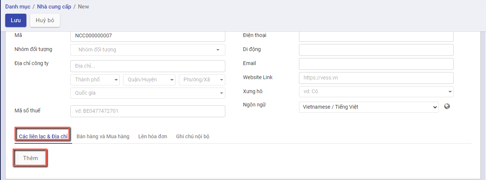
  
  Một cửa sổ mới hiện ra, nhập đủ thông tin địa chỉ và chọn **Lưu**

- Nội dung khai báo tại **Lên hóa đơn**: 
  - Thông tin **Ngân hàng và Số tài khoản**: Doanh nghiệp có giao dịch Mua hàng/Bán hàng với Khách hàng và thực hiện Thanh toán: thông tin Số tài khoản đã khai báo sẽ được hiển thị để Kế toán thực hiện chọn và Thanh toán

**Bước 3**: Nhấn nút **Lưu** để lưu lại thông tin nhân viên đã nhập

Sau khi lưu thành công, trên mỗi một khách hàng, người dùng có thể theo dõi được một số thông tin đi kèm như:

Số đơn bán hàng, đơn mua hàng được tạo

Thông tin giao hàng

Số hóa đơn đã xuất

Công nợ nhà cung cấp

Tài  liệu đính kèm

Khi nhấn vào các Đầu mục theo dõi, hệ thống tự động Truy vết các Giao dịch gắn đã thực hiện với Nhà cung cấp

**Lưu ý**:

- Để sửa lại thông tin nhà cung cấp đã khai báo, sử dụng chức năng **Sửa** trên thanh công cụ.

- Nhà cung cấp đã được sử dụng tại các chứng từ kế toán khác sẽ không được xóa

### Nhân viên

Danh mục nhân viên quản lý thông tin về các nhóm đối tượng khác nhau, phục vụ cho việc quản lý danh sách nhân viên của doanh nghiệp

**Xem video hướng dẫn**

<iframe
    width="920"
    height="450"
    frameborder="0"
    allow="autoplay; encrypted-media; clipboard-write; gyroscope; picture-in-picture "
    allowfullscreen
    title="Nhân viên" 
    src="https://www.youtube.com/embed/1xq8AI3ppo4"
></iframe>

**Hướng dẫn trên phần mềm**

**Bước 1**: Vào Danh mục/Đối tượng/Nhân viên. Nhấn **Chi tiết** để vào danh mục

**Bước 2**: Nhấn nút **tạo ** để thực hiên thêm mới nhân viên 

**Bước 3:** Nhập đủ thông tin cần thiết:

- Nhập tên nhân viên

- Chọn công ty nếu nhân viên thuộc công ty ngoài

- Chọn kiểu đối tượng nếu nhân viên đó vừa là khách hàng hoặc vừa là nhà cung cấp

- Nhập địa chỉ, mã số thuế. Nếu chọn **Công ty** thì địa chỉ và mã số thuế  mặc định bằng  địa chỉ, mã số thuế của công ty đã chọn

- Nhập thông tin chức vụ, số điện thoại, số di động , email, website, xưng hô

- Thay đổi ảnh đại diện của nhân viên bằng cách nhấn nút  và lựa chọn ảnh đại diện mong muốn

- Có thể bổ sung thêm địa chỉ liên lạc của nhân viên bằng cách vào nhóm **Các liên lạc & địa chỉ**, thêm mới địa chỉ

  
  
  Một cửa sổ mới hiện ra, nhập đủ thông tin địa chỉ và chọn **Lưu**

- Nội dung khai báo tại **Lên hóa đơn**: 
  - Thông tin **Ngân hàng và Số tài khoản**: Doanh nghiệp có giao dịch Mua hàng/Bán hàng với Khách hàng và thực hiện Thanh toán: thông tin Số tài khoản đã khai báo sẽ được hiển thị để Kế toán thực hiện chọn và Thanh toán

**Bước 3**: Nhấn nút **Lưu** để lưu lại thông tin nhân viên đã nhập

Sau khi lưu thành công, trên mỗi một khách hàng, người dùng có thể theo dõi được một số thông tin đi kèm như:

Số đơn bán hàng, đơn mua hàng được tạo

Thông tin giao hàng

Số hóa đơn đã xuất

Công nợ nhà cung cấp

Tài  liệu đính kèm

Khi nhấn vào các Đầu mục theo dõi, hệ thống tự động Truy vết các Giao dịch gắn đã thực hiện với Nhân viên

**Lưu ý**:

- Để sửa lại thông tin nhân viên đã khai báo, sử dụng chức năng **Sửa** trên thanh công cụ.

- Nhân viên đã được sử dụng tại các chứng từ kế toán khác sẽ không được xóa

## *Hàng hóa vật tư*

Nhóm **danh mục** **hàng hóa vật tư** cho phép người dùng:

- Thiết lập các đơn vị tính, phục vụ cho việc khai báo vật tư hàng hoá
- Thiết lập các nhóm phục vụ cho công tác quản lý vật tư, hàng hoá
- Quản lý các kho vật tư, hàng hoá của đơn vị
- Quản lý danh sách vật tư, hàng hoá, công cụ dụng cụ của đơn vị

### **Nhóm VTHH**

**Mục đích**

Hệ thống đã thiết lập sẵn danh sách một số danh mục nhóm vật tư, hàng hoá, phục vụ cho việc quản lý vật tư, hàng hoá của doanh nghiệp. Tuy nhiên, Kế toán của Doanh nghiệp vẫn có thể bổ sung, sửa đổi lại nhóm vật tư, hàng hoá sao cho phù hợp với nhu cầu quản lý thực tế tại doanh nghiệp.

Chức năng Danh mục **Nhóm Vật tư hàng hóa** được quản lý tập trung tại phần **Danh mục**

**Các bước thực hiện**

**Bước 1:** Vào Danh mục: chọn **Nhóm VTHH** và nhấn nút **Chi tiết**

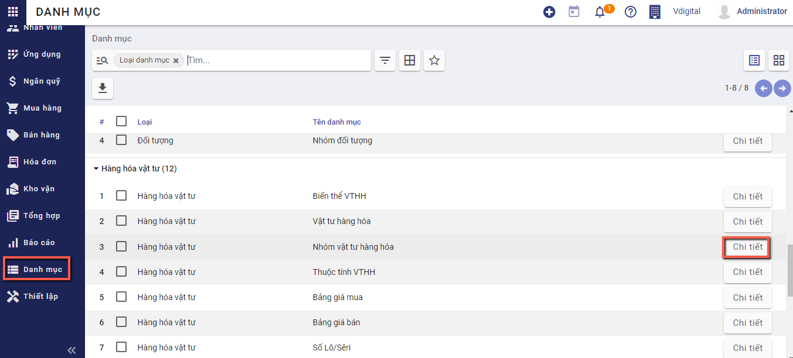

Thông tin **Nhóm VTHH** được hiển thị để người dùng khai báo

**Bước 2:** Để khai báo thêm Nhóm người dùng, người dùng nhấn nút **Tạo**Trên màn hình **Nhóm VTHH** và thực hiện Khai báo các thông tin: 

**Bước 3:** Nhấn nút **Lưu**

**Lưu ý:**

- Nhấn **Sửa**: Nếu muốn thay đổi thông tin Nhóm sản phẩm đã khai báo
- Với các Nhóm sản phẩm không có nhu cầu theo dõi tiếp, sử dụng chức năng **Sửa** và Bỏ chọn **'Có hiệu lực'**

### **Vật tư hàng hóa**

Danh mục vật tư, hàng hoá cho phép quản lý toàn bộ vật tư, hàng hoá, thành phẩm, dịch vụ của doanh nghiệp, phục vụ cho việc lập và hạch toán các chứng từ liên quan đến hoạt động mua, bán hàng hoá, nhập xuất kho vật tư, hàng hoá, công cụ dụng cụ

**Xem video hướng dẫn**

<iframe
    width="920"
    height="450"
    frameborder="0"
    allow="autoplay; encrypted-media; clipboard-write; gyroscope; picture-in-picture "
    allowfullscreen
    title="Vật tư hàng hóa" 
    src="https://www.youtube.com/embed/iP95ifOOT7s"
></iframe>

**Hướng dẫn trên phần mềm**

#### Khai báo vật tư, hàng hóa thông thường

Để khai báo được hàng hóa, vật tư, người dùng có thể thực hiện bằng hai cách:

**Cách 1: Tạo mới trực tiếp trên giao diện**

**Cách 2: Import dữ liệu**

##### Tạo mới hàng hóa trực tiếp trên giao diện

**Bước 1**: Vào Danh mục/Hàng hóa vật tư/Vật tư hàng hóa. Nhấn **Chi tiết** để vào danh mục

**Bước 2**: Tại màn hình danh sách, Nhấn nút **tạo ** để thực hiên thêm mới hàng hóa

**Bước 3**: Khai báo các thông tin chi tiết về vật tư, hàng hoá => với các thông tin có màu hồng,  phần mềm sẽ bắt buộc phải khai báo.

- Nhập **tên** hàng hóa đang sử dụng

- Chọn **loại hàng hóa** theo yêu cầu, có thể là hàng hóa, công cụ dụng cụ, nguyên vật liệu, thành phẩm

- Chọn **nhóm vật tư hàng hóa**. Tùy thuộc vào tính chất hàng hóa để chọn nhóm VTHH phù hợp. Thông tin nhóm VTHH sẽ ảnh hưởng đến cách hạch toán lên bút toán

​	Nếu hàng đang nhập thuộc loại hàng hóa, thành phẩm thì chọn nhóm VTHH là hàng hóa. 

​	Nếu hàng đang nhập thuộc loại nguyên vật liệu thì chọn nhóm VTHH là nguyên vật liệu.

- Chọn **ngành nghề kinh doanh** phù hợp với hàng hóa đang nhập. Sau khi chọn, phần mềm tự động hiển thị loại thuế áp dụng cho hàng hóa

- Nhập thông tin **giá bán, giá vốn** nếu có. Thông tin này sẽ được hiển thị tại đơn bán hàng, đơn mua hàng khi người dùng chọn tới sản phẩm có chứa giá bán, giá vốn. 

  Lưu ý: Giá vốn sẽ được thay đổi tùy theo cách thức xuất - nhập kho đang được sử dụng tại nhóm VTHH

- Chọn **đơn vị tính** phù hợp với hàng hóa đang nhập

**Bước 4:** Nhấn **Lưu** để lưu lại thông tin

##### Import vật tư, hàng hóa

Vào danh mục hàng hóa vật tư, thực hiện Import vật tư hàng hóa cần sử dụng

**Cách 1:** Tại màn hình danh sách vật tư hàng hóa, chuyển cách xem dạng danh sách bằng cách chọn nút **Xem bằng danh sách**

Tại màn hình danh sách, thực hiện tích chọn 1 bản ghi, nhấn biểu tượng Thiết lập hình bánh xe, chọn **Xuất** để xuất file mẫu bằng excel

Trên màn hình Xuất dữ liệu , người dùng có thể chọn mẫu **Vật tư, hàng hóa**

Hoặc người dùng có thể tự tạo một mẫu riêng cho  mình bằng cách trên giao diện các cột bên trái, nhập thông tin tại *Tìm kiếm* và nhấn *Enter*

Chọn dấu *Cộng* để thêm cột cần xuất dữ liệu sang bên phải

Sau khi có đầy đủ danh sách các trường thông tin cần xuất thì thực hiện lưu mẫu bằng cách chọn chức năng mẫu mới, nhập tên mẫu cần lưu và nhấn nút *Lưu*

Nhấn **Xuất** để thực hiện xuất file excel.

Trên file excel vừa xuất, người dùng thực hiện nhập các thông tin vật tư hàng hóa đầu kỳ tương ứng với các cột bắt đầu từ dòng thứ 2, sau khi nhập thông tin cần import thì thực hiện lưu lại file có định dạng .xls. Đây chính là file dữ liệu dùng để import

- Mã nội bộ: Bắt buộc nhập, nhập mã hàng hóa

- Tên: Bắt buộc nhập, nhập tên hàng hóa

- Đơn vị tính: Bắt buộc nhập, nhập tên đơn vị tính

- Đơn vị tính mua hàng: Bắt buộc nhập, nhập tên đơn vị tính

- Loại: Bắt buộc chọn, chọn một trong các giá trị sau:
  	Hàng hóa
  	Dịch vụ
  	Nguyên vật liệu
  	Thành phẩm
  	Công cụ dụng cụ - Tài sản

- Nhóm sản phẩm: Bắt buộc nhập, nhập tên nhóm sản phẩm hoặc có thể lựa chọn nhóm sản phẩm đang có s

  ​	Tất cả / Chi phí

  ​	Tất cả / Dịch vụ

  ​	Tất cả / Hàng hóa

  ​	Tất cả / Nguyên vật liệu

- Giá vốn: Không bắt buộc nhập, nhập giá vốn hàng hóa

- Giá bán: Không bắt buộc nhập, nhập giá bán hàng hóa

- Ngành nghề kinh doanh: Bắt buộc nhập, nhập mã ngành nghề kinh doanh

- Thuế bán hàng: Không bắt buộc nhập, nhập tên loại thuế

- Mô tả: Không bắt buộc nhập, nhập mô tả chung

Sau khi có file import, người dùng nhấn biểu tượng hình ngôi sao, chọn **Thêm bản ghi**

Nhấn nút **Nạp tập tin** để chọn file cần import, chọn file cần import

Sau khi file dữ liệu được tải lên, nhấn **Kiểm thử** để kiểm tra dữ liệu đã được nhập đúng chưa

Nếu ra thông báo màu đỏ: Dữ liệu đang bị lỗi, cần thực hiện sửa lại cho đến khi chính xác. Sau khi sửa dữ liệu thì cần nhấn **Nạp tập tin** để chọn lại file dữ liệu vừa sửa

Nếu ra thông báo màu vàng: Cảnh báo có thông tin sai xót nhưng vẫn có thể bỏ qua được

Nếu ra thông báo màu xanh: Dữ liệu đã hợp lệ và nhấn **Nhập** để import dữ liệu. Sau khi nhấn nhập, hệ thống sẽ thực hiện import, quay về màn hình danh sách vật tư hàng hóa  và hiển thị số lượng bản ghi import thành công

**Cách 2:** Nhấn biểu tượng hình ngôi sao, chọn **Thêm bản ghi**

Sau khi mở màn hình import thông tin, thực hiện xuất file mẫu bằng cách chọn **Mẫu nhập liệu VTHH** để thực hiện xuất file mẫu excel

Trên file excel vừa xuất, người dùng thực hiện nhập thông tin hàng hóa đầu kỳ. Với file được xuất hướng dẫn cụ thể có trong phần commnent tại hàng đầu tiên của mỗi cột

- Mã nội bộ: Bắt buộc nhập, nhập mã hàng hóa

- Tên: Bắt buộc nhập, nhập tên hàng hóa

- Đơn vị tính: Bắt buộc nhập, nhập tên đơn vị tính

- Đơn vị tính mua hàng: Bắt buộc nhập, nhập tên đơn vị tính

- Loại: Bắt buộc chọn, chọn một trong các giá trị sau:
  	Hàng hóa
  	Dịch vụ
  	Nguyên vật liệu
  	Thành phẩm
  	Công cụ dụng cụ - Tài sản

- Nhóm sản phẩm: Bắt buộc nhập, nhập tên nhóm sản phẩm hoặc có thể lựa chọn nhóm sản phẩm đang có s

  ​	Tất cả / Chi phí

  ​	Tất cả / Dịch vụ

  ​	Tất cả / Hàng hóa

  ​	Tất cả / Nguyên vật liệu

- Giá vốn: Không bắt buộc nhập, nhập giá vốn hàng hóa

- Giá bán: Không bắt buộc nhập, nhập giá bán hàng hóa

- Ngành nghề kinh doanh: Bắt buộc nhập, nhập mã ngành nghề kinh doanh

- Thuế bán hàng: Không bắt buộc nhập, nhập tên loại thuế

- Mô tả: Không bắt buộc nhập, nhập mô tả chung

- Theo vết: Bắt buộc nhập, chọn một trong các giá trị sau:
       Theo lô
    	 Theo số se-ri duy nhất
    	 Không theo dõi

  ​     Mặc định khi import là Theo lô

- Tuyến cung ứng: Bắt buộc nhập, chọn một trong các giá trị sau:
      Sản xuất
      Mua
      Sản xuất,mua

Sau khi có file import, người dùng nhấn nút **Nạp tập tin** để chọn file cần import, chọn file cần import

Sau khi file dữ liệu được tải lên, nhấn **Kiểm thử** để kiểm tra dữ liệu đã được nhập đúng chưa

Nếu ra thông báo màu đỏ: Dữ liệu đang bị lỗi, cần thực hiện sửa lại cho đến khi chính xác. Sau khi sửa dữ liệu thì cần nhấn **Nạp tập tin** để chọn lại file dữ liệu vừa sửa

Nếu ra thông báo màu vàng: Cảnh báo có thông tin sai xót nhưng vẫn có thể bỏ qua được

Nếu ra thông báo màu xanh: Dữ liệu đã hợp lệ và nhấn **Nhập** để import dữ liệu. Sau khi nhấn nhập, hệ thống sẽ thực hiện import, quay về màn hình danh sách vật tư hàng hóa  và hiển thị số lượng bản ghi import thành công

##### Export vật tư, hàng hóa

Để xuất thông tin hàng hóa, vật tư đang có trên hệ thống, người dùng có thể chọn chức năng **Xuất** để thực hiện lấy thông tin danh sách hàng hóa đang có

Tại màn hình danh sách vật tư hàng hóa, chuyển cách xem dạng danh sách bằng cách chọn nút **Xem bằng danh sách**

Tại màn hình danh sách, thực hiện tích chọn 1 bản ghi, nhấn biểu tượng Thiết lập hình bánh xe, chọn **Xuất** để xuất file mẫu bằng excel

Trên màn hình Xuất dữ liệu , người dùng có thể chọn mẫu **Vật tư, hàng hóa**

Hoặc người dùng có thể tự tạo một mẫu riêng cho  mình bằng cách trên giao diện các cột bên trái, nhập thông tin tại *Tìm kiếm* và nhấn *Enter*

Chọn dấu *Cộng* để thêm cột cần xuất dữ liệu sang bên phải

Sau khi có đầy đủ danh sách các trường thông tin cần xuất thì thực hiện lưu mẫu bằng cách chọn chức năng mẫu mới, nhập tên mẫu cần lưu và nhấn nút *Lưu*

Nhấn **Xuất** để thực hiện xuất file excel.

Trên file excel vừa xuất, người dùng sẽ xem được thông tin vật tư hàng hóa tương ứng với các cột đã chọn 

#### Khai báo các mặt hàng dịch vụ

Áp dụng với những hàng hoá không có nhu cầu quản lý số lượng tồn trên kho, nhưng vẫn phát sinh hoạt động mua, bán (VD: chi phí mua hàng, chi phí vận chuyển, chi phí hải quan...)

Khi đó, kế toán sẽ thực hiện khai báo tương tự như với VTHH thông thường ở trên nhưng khác biệt ở thông tin sau:

- **Loại** hàng hóa là Dịch vụ.

- **Nhóm VTHH** là chi phí hoặc dịch vụ

#### Khai báo tồn hàng đầu kỳ

Trước khi thực hiện sử dụng hệ thống, người dùng có thể khai báo số dư tồn đầu kỳ để quản lý thông tin hàng nhập xuất tồn kho

**Bước 1:** Vào danh mục đơn vị tính, xem đã có đơn vị tính từ file khách hàng gửi chưa, nếu chưa có thì thêm Đơn vị tính tương ứng

Lưu ý:  Hỏi KH có quản lý đơn vị tính quy đổi, thì khi cập nhật danh mục Đơn vị tính có cập nhật số lượng quy đổi theo đơn vị tính chính

**Bước 2:** Vào danh mục hàng hóa vật tư, thực hiện nhập hàng hóa đầu kỳ, với số lượng hàng hóa lớn thì sử dụng chức năng Import Danh mục vật tư hàng hóa 

Các bước làm cụ thể tại chức năng  [**Khai báo vật tư, hàng hóa thông thường**](#khai-bao-vat-tu-hang-hoa-thong-thuong)

**Bước 3:** Import 1 Đơn mua hàng, với n dòng chi tiết đơn mua hàng tương ứng với n bản ghi danh mục vật tư hàng hóa tồn kho

Lưu ý: Hỏi khách hàng số tồn kho này là số đến ngày nào, giả sử là số tồn kho đến 31/12/2021, thì tất cả các ngày tại file import Đơn mua hàng để hết ngày 31/12/2021

Các bước thực hiện import đơn mua hàng được mô tả chi tiết tại chức năng [**Lập đơn mua hàng gửi nhà cung cấp**](../../finance_TT88/fin-mua-hang-88/#lap-on-mua-hang-tu-viec-import-du-lieu) hoặc làm theo hướng dẫn dưới đây:

Vào phân hệ **Mua hàng**, Chọn **Đơn mua hàng** 

Hoặc thực hiện **Tìm kiếm** trực tiếp chức năng trên ô tìm kiếm chung của hệ thống

Trên danh sách đơn hàng, nhấn biểu tượng hình ngôi sao, chọn **Thêm bản ghi**

Sau khi mở màn hình import thông tin, thực hiện xuất file mẫu bằng cách chọn **Mẫu nhập khẩu đơn mua hàng** để thực hiện xuất file mẫu excel

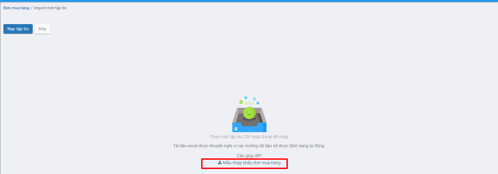

Trên file excel vừa xuất, người dùng thực hiện nhập thông tin đơn hàng tương ứng tại các cột, hướng dẫn cụ thể có trong phần commnent tại hàng đầu tiên của mỗi cột

Sau khi nhập thông tin vào file, thực hiện nhập dữ liệu bằng cách nhấn chọn **Nạp tập tin**

Chọn file vừa nhập thông tin, đợi hệ thống tải file, sau đó nhấn nút **Kiểm thử** để kiểm tra thông tin trong file có chính xác không.

Nếu như có lỗi thì sẽ hiển thị thông báo lỗi cụ thể tại cột nào, dòng nào. 

Lưu ý: Những thông báo màu hồng là thông tin cần sửa lại, thông báo màu cam có thể bỏ qua

Nếu như cần sửa chữa thông tin trong file nhập liệu thì người dùng chọn lại **Nạp tập tin** và chọn file vừa sửa

Nếu đã chính xác thì sẽ hiển thị thông báo màu xanh : "Mọi thứ dường như hợp lệ". Người dùng nhấn **Nhập** để bắt đầu import dữ liệu vào hệ thống

Khi import thành công, hệ thống  sẽ tự động quay về màn hình danh sách và hiển thị thông báo số lượng bản ghi đã được import, các bản ghi được import thành công ở trạng thái báo giá

**Bước 4:** Sau khi import Đơn mua hàng thành công ở bước 3, vào Đơn mua hàng, kích Xác nhận đơn mua hàng, hệ thống sẽ sinh phiếu nhập kho tương ứng

Các bước làm cụ thể được mô tả tại chức năng [**Xác nhận Đơn hàng từ Nhà cung cấp**](../../finance_TT88/fin-mua-hang-88/#xac-nhan-on-hang-tu-nha-cung-cap) hoặc làm theo hướng dẫn dưới đây:

Tại đơn hàng đã tạo, sau khi đã thỏa thuận được báo giá với nhà cung cấp và nhà cung cấp trả hàng theo đúng yêu cầu, người mua hàng nhấn nút **Xác nhận** để hoàn thành đơn hàng

Nếu không còn nhu cầu mua hàng, người bán nhấn **Hủy** hoặc thực hiện xóa đơn hàng đã tạo

Sau khi có đơn hàng, sản phẩm sẽ được nhận từ nhà cung cấp và nhập vào kho

**Bước 5:** Tại Đơn mua hàng vừa xác nhận ở bước 4, kích Nhận sản phẩm, hệ thống sẽ hiển thị phiếu nhập kho tương ứng,

Các bước làm cụ thể được mô tả tại chức năng **[Nhập kho đơn mua hàng](../../finance_TT88/fin-mua-hang-88/#nhap-kho-on-mua-hang)** hoặc làm theo hướng dẫn dưới đây:

Sau khi thực hiện Xác nhận đơn hàng, chương trình tự động sinh ra một phiếu nhập kho. Người dùng có thể theo dõi tình trạng nhận hàng của sản phẩm trên phiếu nhập kho đã sinh ra và xác nhận số lượng sản phẩm bàn giao theo đơn hàng 

**Xem video hướng dẫn**

<iframe
    width="920"
    height="450"
    frameborder="0"
    allow="autoplay; encrypted-media; clipboard-write; gyroscope; picture-in-picture "
    allowfullscreen
    title="Nhập kho đơn mua hàng" 
    src="https://www.youtube.com/embed/3fjLKbsF_-M"
></iframe>

Chọn **Nhận hàng** hoặc nhấn nút **Nhận sản phẩm**, hệ thống chuyển sang chức năng phiếu nhập kho. 

Nếu người dùng muốn sửa ngày chứng từ và ngày hạch toán, nhấn nút **Sửa**, sửa các ngày có trên tab Thông tin chung của phiếu nhập kho về 31/12/2021 (theo như ví dụ trên để nhập số tồn đầu kỳ)  và nhấn **Lưu**

Thực hiện nhập số lượng hàng đã hoàn thành nhận từ nhà cung cấp

- Nếu Số lượng nhận về kho đủ theo Số lượng của Đơn mua hàng: Thực hiện nhấn **Xác nhận** để xác nhận toàn bộ Đơn hàng

  

- Nếu Số lượng nhập kho Chưa đủ theo Số lượng của Đơn mua hàng: Thực hiện nhập số lượng theo thực tế bằng cách nhấn **Sửa**, vào nhóm **Vật tư, hàng hóa chi tiết**, nhập số lương **hoàn thành**, sau đó nhấn **Lưu**

  

Nhấn **Xác nhận** để hoàn thành nhập hàng về kho

Khi đó có 2 hướng thực hiện :

- Nếu chọn **Tạo phần dở dang**: Với Số lượng còn thiếu, hệ thống tạo sẵn 1 chứng từ Phiếu nhập kho, để Khi nhập kho với Số lượng còn lại, bộ phận Kho tiếp tục vào Phiếu nhập kho (đã tạo phần dở dang) để thực hiện Xác nhận Số lượng nhập kho còn lại.
- Nếu chọn **Không tạo phần dở dang**: Khi đó hệ thống Tách Số lượng nhu cầu ban đầu Bằng đúng Số lượng thực nhập, còn Số lượng chênh chưa nhận được thì Số lượng hoàn thành = 0

Như vậy **Phiếu nhập kho** đã **Hoàn thành** .

**Bước 6:** Kiểm tra báo cáo tồn kho bằng hai cách:

Cách 1: Vào ứng dụng **Báo cáo**, chọn báo cáo **Sổ chi tiết vật liệu, dụng cụ, sản phẩm, hàng hóa(S2-HKD)**

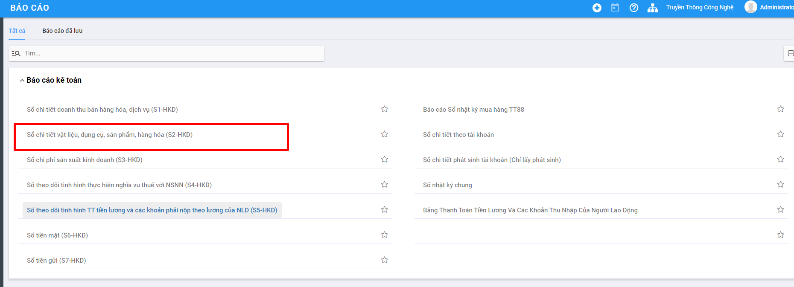

Cách 2: Vào ứng dụng **Kho vận**, chọn **Báo cáo**, chọn **Báo cáo tồn kho**

### **Kho hàng** 

**Mục đích**

Quản lý danh sách các kho vật tư, hàng hoá, phục vụ cho công tác khai báo vật tư, hàng hoá trong doanh nghiệp.

Chức năng Danh mục **Kho hàng** được quản lý tập trung tại phần **Danh mục** của Phân hệ **Kho vận**

**Các bước thực hiện**

**Bước 1:** Vào phân hệ **Kho vận**; chọn chức năng **Cấu hình**: chọn **Kho hàng** 

**Bước 2:** Để khai báo thêm **Kho hàng**, người dùng nhấn nút **Tạo**Trên màn hình **Kho hàng** và thực hiện Khai báo các thông tin: 

**Bước 3:** Nhấn nút **Lưu**

**Lưu ý:**

- Nhấn **Sửa**: Nếu muốn thay đổi thông tin kho hàng đã khai báo

- Sau khi kho hàng được tạo thành công, hệ thống tự động tạo  vị trí kho và các kiểu nhập xuất hàng hóa tương ứng với kho đó

### Kho

**Mục đích**

Quản lý danh sách các địa điểm kho vật tư, hàng hoá, phục vụ cho công tác khai báo vật tư, hàng hoá trong doanh nghiệp.

Chức năng Danh mục **Kho** được quản lý tập trung tại phần **Danh mục** của Phân hệ **Kho vận**

Kho có thể được tạo mặc định khi người dùng khai báo kho hàng mới tại **Danh mục/Kho hàng**

**Các bước thực hiện**

**Bước 1:** Vào phân hệ **Kho vận**; chọn chức năng **Cấu hình**: chọn **Kho** hoặc vào **Danh mục/hàng hóa vật tư/Kho**

**Bước 2:** Để khai báo thêm **Kho**, người dùng nhấn nút **Tạo**Trên màn hình **Kho** và thực hiện Khai báo các thông tin: 

Tên địa điểm kho

Đơn vị của kho

Chọn loại địa điểm kho

**Bước 3:** Nhấn nút **Lưu**

**Lưu ý:**

Nhấn **Sửa**: Nếu muốn thay đổi thông tin kho hàng đã khai báo

### Kiểu giao nhận

**Mục đích**

Quản lý danh sách các loại hình nhập/xuất hàng hóa,vật tư phục vụ cho việc quản lý, kiểm kê hàng trong kho.

Chức năng Danh mục **Kiểu giao nhận** được quản lý tập trung tại phần **Danh mục** của Phân hệ **Kho vận**

Kiểu giao nhận có thể được tạo mặc định khi người dùng khai báo kho hàng mới tại **Danh mục/Kho hàng** hoặc người dùng tự thêm mới

**Các bước thực hiện**

**Bước 1:** Vào phân hệ **Kho vận**; chọn chức năng **Cấu hình**: chọn **Kiểu giao nhận**  hoặc vào **Danh mục/hàng hóa vật tư/Loại hoạt động**

**Bước 2:** Để khai báo thêm **Kiểu giao nhận**, người dùng nhấn nút **Tạo**Trên màn hình  và thực hiện Khai báo các thông tin: 

- Kiểu hoạt động: Nhập tên kiểu nhập.xuất

- Đơn vị:  Đơn vị của kiểu hoạt động sẽ dùng

- Mã: Mã của loại nhập/xuất

- Loại hoạt động: Chọn loại Nhập hoặc loại Xuất

- Loại nhập/xuất: Chi tiết hình thức nhập hoặc xuất

- Tài khoản nợ: Chọn tài khoản hạch toán

- Tài khoản có: Chọn tài khoản hạch toán

- Điểm đi mặc định: Kho sẽ xuất hàng đi

- Điểm đích mặc định: Kho hàng sẽ nhập vào

**Bước 3:** Nhấn nút **Lưu**

**Lưu ý:**

- Nhấn **Sửa**: Nếu muốn thay đổi thông tin kho hàng đã khai báo

## ***Kế toán***

### **Hệ thống tài khoản**

**Mục đích**

Quản lý toàn bộ thông tin Tài khoản của Doanh nghiệp sử dụng hệ thống Kế toán.

Hệ thống đã thiết lập sẵn hệ thống tài khoản theo đúng chế độ kế toán đã được chọn khi Cài đặt và chọn Chế độ kế toán tại thời điểm đầu. Kế toán doanh nghiệp vẫn có thể bổ sung, sửa đổi hoặc xóa bỏ các tài khoản đã có để phù hợp với yêu cầu quản lý thực tế của doanh nghiệp. 

Chức năng Danh mục **Hệ thống tài khoản** được quản lý tập trung tại phần **Danh mục** của phân hệ **Kế toán**

**Các bước thực hiện**

**Bước 1:** Vào Danh mục: chọn **Hệ thống tài khoản** và nhấn nút **Chi tiết**

Thông tin **Hệ thống tài khoản** được hiển thị để người dùng khai báo

**Bước 2:** Để khai báo thêm Nhóm người dùng, người dùng nhấn nút **Tạo** trên màn hình **Hệ thống tài khoản** và thực hiện Khai báo các thông tin: 

- Sau khai báo về Mã và Tên tài khoản; người dùng thực hiện Thiết lập thông tin cho tài khoản đã khai
- Việc thiết lập sẽ liên quan đến toàn bộ luồng dữ liệu hạch toán về sau của 1 tài khoản

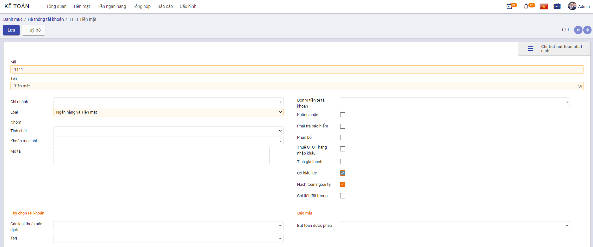

**Bước 3:** Nhấn nút **Lưu**

**Lưu ý:**

- Nhấn **Sửa**: Nếu muốn thay đổi thông tin Tài khoản đã khai báo
- Với các Tài khoản không có nhu cầu theo dõi tiếp, sử dụng chức năng **Sửa** và Bỏ chọn **'Có hiệu lực'**

### **Tiền tệ**

**Mục đích**

Quản lý toàn bộ thông tin Tiền tệ của Doanh nghiệp sử dụng hệ thống Kế toán.

Hệ thống đã thiết lập sẵn các Loại Tiền tệ trên thị trường. Muốn sử dụng Loại tiền nào thì Kế toán vào chuyển trạng thái Hiệu lực và khai báo thông tin Tỷ giá cho Loại tiền theo đúng thực tế.

Chức năng Danh mục **Tiền tệ** được quản lý tập trung tại phần **Danh mục** của phân hệ **Kế toán**

**Các bước thực hiện**

**Bước 1:** Vào Danh mục: chọn **Tiền tệ** và nhấn nút **Chi tiết**

Thông tin **Tiền tệ** được hiển thị để người dùng khai báo

**Bước 2:** Để đưa vào hoạt động Loại tiền tệ đã có, người dùng chọn thông tin Tiền tệ đó và nhấn nút **Sửa** trên màn hình **Tiền tệ** và thực hiện Cập nhật các thông tin: 

**Bước 3:** Nhấn nút **Lưu**

**Lưu ý:**

- Với các Tiền tệ không có nhu cầu theo dõi tiếp, sử dụng chức năng **Sửa** và Bỏ chọn **'Có hiệu lực'**

### **Định khoản tự động**

**Mục đích**

Quản lý toàn bộ thông tin Định khoản tự động của hệ thống.

Hệ thống đã thiết lập sẵn các Định khoản tự động cho các Loại chứng từ: Thu tiền gửi; Chi tiền gửi; Thu tiền mặt; Chi tiền mặt; Chi khác; Thu khác

Chức năng Danh mục **Định khoản tự động** được quản lý tập trung tại phần **Danh mục** của nhóm **Kế toán**

**Các bước thực hiện**

**Bước 1:** Vào Danh mục: chọn **Định khoản tự động** và nhấn nút **Chi tiết**

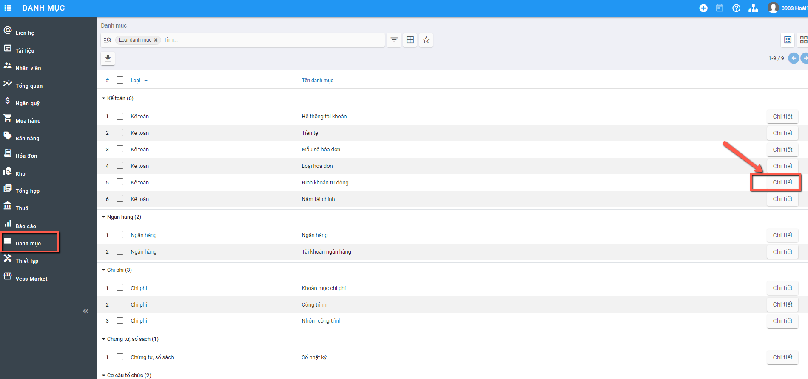

Thông tin **Định khoản tự động** được hiển thị để người dùng khai báo và quản lý

**Bước 2:** Khai báo/Cập nhật thông tin Định khoản

- Để khai báo: Người dùng nhấn nút : Hệ thống tạo 1 dòng dữ liệu trên Danh sách để người dùng nhập thông tin

- Để Sửa dữ liệu: Người dùng Nhấn chuột vào bản ghi cần sửa: Thông tin bản ghi ở trạng thái chỉnh sửa được

**Bước 3:** Nhấn nút **Lưu**: Để ghi nhận thông tin đã Tạo/Cập nhật

<u>**Lưu ý:**</u>

- Với các Định khoản tự động tạo ra của Hệ thống: **Người dùng hạn chế Chỉnh sửa thông tin**, để tránh gây lỗi khi lên các bút toán của các Phần hành khác nhau

### Mẫu số hóa đơn

**Bước 1**: Vào Danh mục/Kế toán/Mẫu số hóa đơn. Nhấn **Chi tiết** để vào danh mục

**Bước 2**: Tại màn hình danh sách, Nhấn nút **tạo ** để thực hiên thêm mới mẫu số

**Bước 3**: Khai báo các thông tin chi tiết về mẫu số hóa đơn

- Nhập đơn vị
- Chọn loại hóa đơn cần sử dụng
- Nhập mẫu số hóa đơn, ký hiệu hóa đơn theo yêu cầu

**Bước 4:** Nhấn nút **Lưu**: Để ghi nhận thông tin đã Tạo/Cập nhật

### Loại hóa đơn

Quản lý toàn bộ thông tin Loại hóa đơn hiện đang được áp dụng cho Kế toán.

Hệ thống tự động tạo sẵn các Loại hóa đơn đang tồn tại. Người dùng có thể quản lý và chỉnh sửa/bổ sung thông tin

**Bước 1:** Vào **Danh mục**: chọn **Loại hóa đơn** và nhấn nút **Chi tiết**

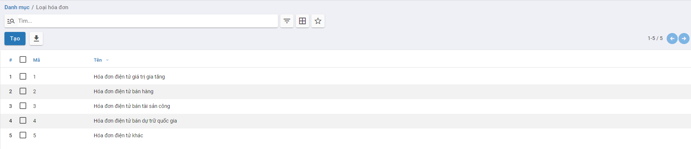

Thông tin **Loại tài khoản** được hiển thị để người dùng khai báo và quản lý

**Bước 2**: Tại màn hình danh sách, Nhấn nút **tạo ** để thực hiên thêm mới Loại hóa đơn

**Bước 3**: Khai báo các thông tin

- Nhập Mã
- Nhập Tên
- Thông tư: Hiển thị thông tư quản lý và phát hành hóa đơn theo Nghị định

**Bước 4:** Nhấn nút **Lưu**: Để ghi nhận thông tin đã Tạo/Cập nhật

### Năm tài chính

Quản lý toàn bộ thông tin Năm đang được thực hiện khai báo và nhập liệu sổ sách của Doanh nghiệp.

**Bước 1:** Vào **Danh mục**: chọn **Năm tài chính** và nhấn nút **Chi tiết**

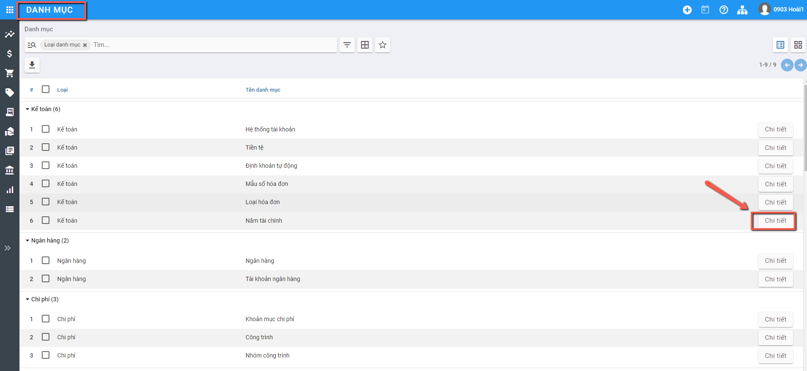

Thông tin **Năm tài chính** được hiển thị để người dùng khai báo và quản lý

**Bước 2**: Tại màn hình danh sách, Nhấn nút **tạo ** để thực hiên thêm mới Năm tài chính

**Bước 3**: Khai báo các thông tin

- Nhập Tên năm tài chính
- Nhập Năm
- Thông tin Từ ngày - Đến ngày của Năm áp dụng

**Bước 4:** Nhấn nút **Lưu**: Để ghi nhận thông tin đã Tạo/Cập nhật

## ***Ngân hàng***

### **Ngân hàng**

**Mục đích**

Hệ thống đã thiết lập sẵn danh sách các ngân hàng thường được các doanh nghiệp lựa chọn. Tuy nhiên, Kế toán của Doanh nghiệp vẫn có thể bổ sung, sửa đổi hoặc xóa bỏ các ngân hàng đã có sao cho phù hợp với yêu cầu quản lý thực tế của doanh nghiệp.

Chức năng Danh mục **Ngân hàng** được quản lý tập trung tại phần **Danh mục**

**Các bước thực hiện**

**Bước 1:** Vào  **Danh mục**: chọn **Ngân hàng** và nhấn nút **Chi tiết**

Thông tin **Ngân hàng** được hiển thị để người dùng khai báo

**Bước 2:** Để khai báo thêm Nhóm người dùng, người dùng nhấn nút **Tạo** trên màn hình **Ngân hàng** và thực hiện Khai báo các thông tin: 

- Mã Ngân hàng: Không trùng với Mã đã khai báo 
- Tên Ngân hàng: Thông tin để quản lý
- Địa chỉ Ngân hàng
- Đánh dấu Sổ quỹ hay Sổ tiền mặt

**Bước 3:** Nhấn nút **Lưu**

**Lưu ý:**

- Nhấn **Sửa**: Nếu muốn thay đổi thông tin Ngân hàng đã khai báo
- Với các ngân hàng không có nhu cầu theo dõi tiếp, sử dụng chức năng **Sửa** và Bỏ chọn **'Có hiệu lực'**

### **Tài khoản ngân hàng**

**Mục đích**

Quản lý danh sách các tài khoản ngân hàng, phục vụ cho việc lập và hạch toán các chứng từ kế toán liên quan đến tiền gửi ngân hàng..

Chức năng Danh mục **Tài khoản ngân hàng** được quản lý tập trung tại phần **Danh mục**

**Các bước thực hiện**

**Bước 1:** Vào Danh mục: chọn **Tài khoản ngân hàng** và nhấn nút **Chi tiết**

Thông tin **Tài khoản ngân hàng** được hiển thị để người dùng khai báo

**Bước 2:** Để khai báo thêm Nhóm người dùng, người dùng nhấn nút **Tạo**Trên màn hình **Tài khoản ngân hàng** và thực hiện Khai báo các thông tin: 

- Số tài khoản và Ngân hàng của Tài khoản
- Thông tin Loại tài khoản ngân hàng

**Bước 3:** Nhấn nút **Lưu**

**Lưu ý:**

- Nhấn **Sửa**: Nếu muốn thay đổi thông tin Tài khoản Ngân hàng đã khai báo
- Với các Tài khoản ngân hàng không có nhu cầu theo dõi tiếp, sử dụng chức năng **Sửa** và Bỏ chọn **'Có hiệu lực'**

## ***Chi phí***

### **Đối tượng tập hợp chi phí**

**Mục đích**

Quản lý danh sách đối tượng tập hợp chi phí, phục vụ cho công tác tập hợp chi phí sản xuất và tính giá thành..

Chức năng Danh mục **Đối tượng tập hợp chi phí** được quản lý tập trung tại phần **Danh mục** của Phân hệ **Kế toán**

**Các bước thực hiện**

**Bước 1:** Vào Danh mục: chọn **Đối tượng tập hợp chi phí** và nhấn nút **Chi tiết**

Thông tin **Đối tượng tập hợp chi phí** được hiển thị để người dùng khai báo

**Bước 2:** Để khai báo thêm Đối tượng tập hợp chi phí, người dùng nhấn nút **Tạo** trên màn hình **Đối tượng tập hợp chi phí** và thực hiện Khai báo các thông tin: 

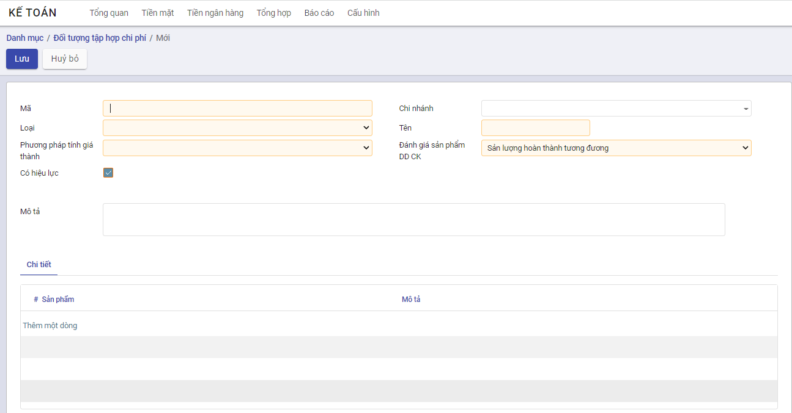

**Bước 3:** Nhấn nút **Lưu**

**Lưu ý:**

- Nhấn **Sửa**: Nếu muốn thay đổi thông tin Đối tượng tập hợp chi phí đã khai báo
- Với các Đối tượng tập hợp chi phí không có nhu cầu theo dõi tiếp, sử dụng chức năng **Sửa** và Bỏ chọn **'Có hiệu lực'**

### **Khoản mục chi phí**

**Mục đích**

Quản lý các khoản mục chi phí phục vụ cho công tác tập hợp chi phí sản xuất và tính giá thành theo Thông tư 133, đồng thời phục vụ cho việc xem báo cáo thống kê theo khoản mục chi phí.

Chức năng Danh mục **Khoản mục chi phí** được quản lý tập trung tại phần **Danh mục** của Phân hệ **Kế toán**

**Các bước thực hiện**

**Bước 1:** Vào Danh mục: chọn **Khoản mục chi phí** và nhấn nút **Chi tiết**

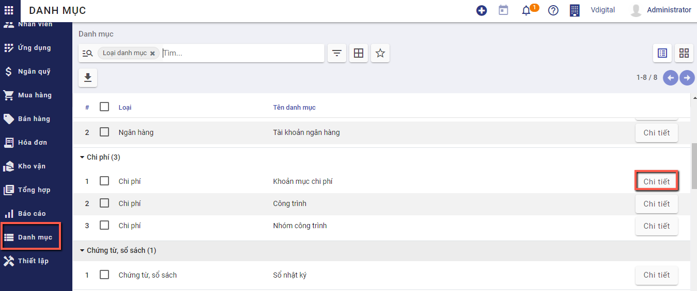

Thông tin **Khoản mục chi phí** được hiển thị để người dùng khai báo

**Bước 2:** Để khai báo thêm Khoản mục chi phí, người dùng nhấn nút **Tạo** trên màn hình **Khoản mục chi phí** và thực hiện Khai báo các thông tin: 

**Bước 3:** Nhấn nút **Lưu**

**Lưu ý:**

- Nhấn **Sửa**: Nếu muốn thay đổi thông tin Khoản mục chi phí phí đã khai báo
- Với các Khoản mục chi phí không có nhu cầu theo dõi tiếp, sử dụng chức năng **Sửa** và Bỏ chọn **'Có hiệu lực'**

### Nhóm công trình

Quản lý toàn bộ thông tin Nhóm công trình của Doanh nghiệp.

**Bước 1:** Vào **Danh mục**: chọn **Nhóm công trình** và nhấn nút **Chi tiết**

Thông tin **Nhóm công trình** được hiển thị để người dùng khai báo và quản lý

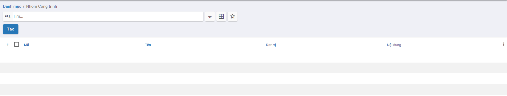

**Bước 2**: Tại màn hình danh sách, Nhấn nút **tạo ** để thực hiên thêm mới Nhóm công trình

**Bước 3**: Khai báo các thông tin

- Nhập Mã công trình
- Nhập Tên công trình

**Bước 4:** Nhấn nút **Lưu**: Để ghi nhận thông tin đã Tạo/Cập nhật

### Công trình

Quản lý toàn bộ thông tin Công trình của Doanh nghiệp.

**Bước 1:** Vào **Danh mục**: chọn **Công trình** và nhấn nút **Chi tiết**

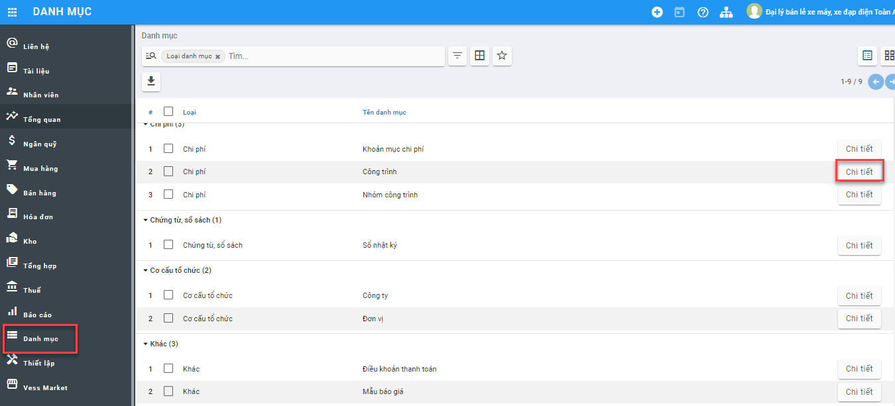

**Bước 2**: Tại màn hình danh sách, Nhấn nút **Tạo** để thực hiên thêm mới công trình

Khai báo các thông tin

- Nhập Mã công trình
- Nhập Tên công trình
- Từ ngày...Đến ngày
- Các thông tin khác Loại công trình, Điều khoản thanh toán, Nhà đầu tư, Địa chỉ,.....

**Bước 4:** Nhấn nút **Lưu**: Để ghi nhận thông tin đã Tạo/Cập nhật

## ***Chứng từ, sổ sách***

### **Sổ nhật ký**

**Mục đích**

Được tạo ra trong trường hợp Doanh nghiệp cần quản lý dữ liệu hạch toán trên nhiều Sổ

Tại mỗi chức năng liên quan đến Nghiệp vụ vào sổ hệ thống sẽ có thông tin để Người dùng chọn. Khi dữ liệu đã được gắn vào từng Sổ kế toán riêng biệt, Kế toán doanh nghiệp có thể quản trị được dữ liệu theo từng Sổ.

Chức năng Danh mục **Sổ nhật ký** được quản lý tập trung tại phần **Danh mục**

**Các bước thực hiện**

**Bước 1:** Vào **Danh mục**: chọn **Sổ nhật ký** và nhấn nút **Chi tiết**

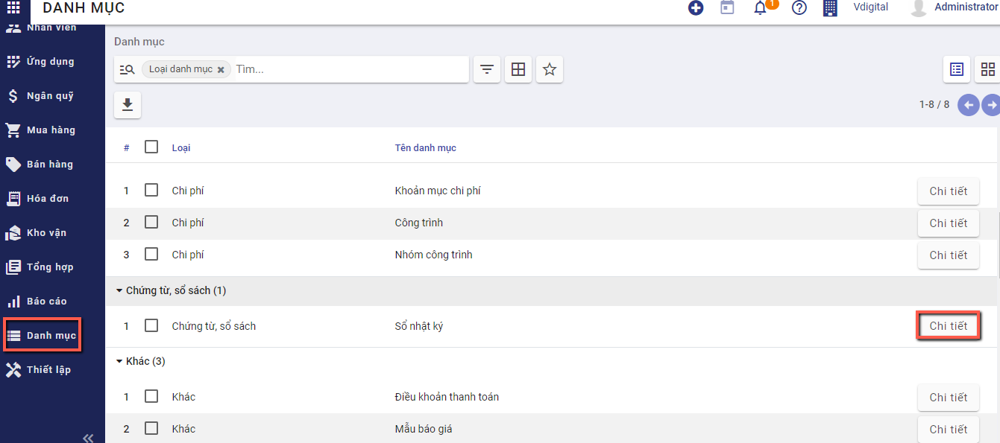

Thông tin **Danh mục Sổ kế toán** được hiển thị để người dùng khai báo

**Bước 2:** Để khai báo thêm Sổ, người dùng nhấn nút **Tạo**Trên màn hình **Sổ nhật ký** và thực hiện Khai báo các thông tin: 

- **Tên sổ nhật ký**: Nhập Tên sổ nhật ký
- **Loại**: Chọn Loại sổ nhật ký như Tiền mặt, Ngân hàng, Mua hàng,.....
- **Đơn vị**: Khai báo sổ nhật ký áp dụng cho đơn vị 
- **Mã viết tắt**: Nhập mã viết tắt của Sổ nhật ký

**Bước 3**: Nhấn **Lưu**

## Khác

### Nhóm bán hàng

**Mục đích**

Được tạo ra trong trường hợp Doanh nghiệp cần quản lý doanh số theo nhóm bán hàng

Chức năng Danh mục **Nhóm bán hàng** được quản lý tập trung tại phần **Danh mục**

**Các bước thực hiện**

**Bước 1:** Vào **Danh mục**: chọn **Nhóm bán hàng** và nhấn nút **Chi tiết**

**Bước 2**: Nhấn **Tạo**

**Bước 3**: Khai báo thông tin

- Tại mục **Đội ngũ bán hàng**(Tab chung): Nhập tên nhóm bán hàng
- Khai báo **Trưởng nhóm** và **Mục tiêu hóa đơn** (Tab chung)

- Tab Các thành viên trong đội nhấn **Thêm** để thực hiện thêm các thành viên trong nhóm bán hàng

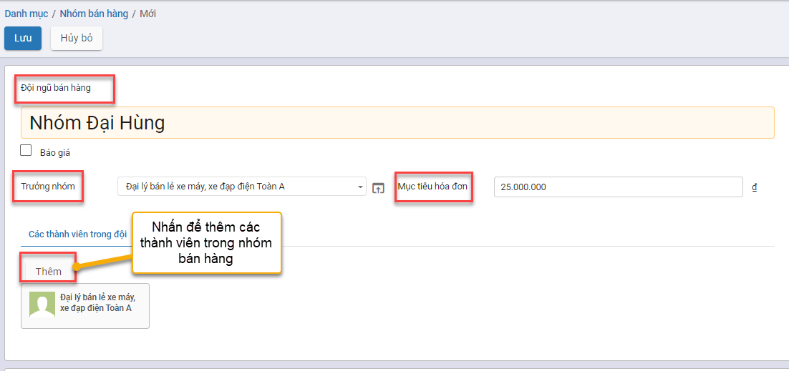

**Bước 4**: Nhấn **Lưu**

### Điều khoản thanh toán

**Mục đích**

Quản lý quy định cụ thể như thời hạn thanh toán,....cho từng hợp đồng, hóa đơn

Chức năng Danh mục **Điều khoản thanh toán** được quản lý tập trung tại phần **Danh mục**

**Các bước thực hiện**

**Bước 1:** Vào **Danh mục**: chọn **Điều khoản thanh toán** và nhấn nút **Chi tiết**

Hệ thống hiển thị Danh sách điều khoản mặc định

**Bước 2**: Nhấn **Tạo** và khai báo điều khoản thanh toán

Tab chung:

- **Điều khoản thanh toán**: Đặt tên điều khoản thanh toán
- **Đơn vị**: Chọn Đơn vị áp dụng cho điều khoản thanh toán

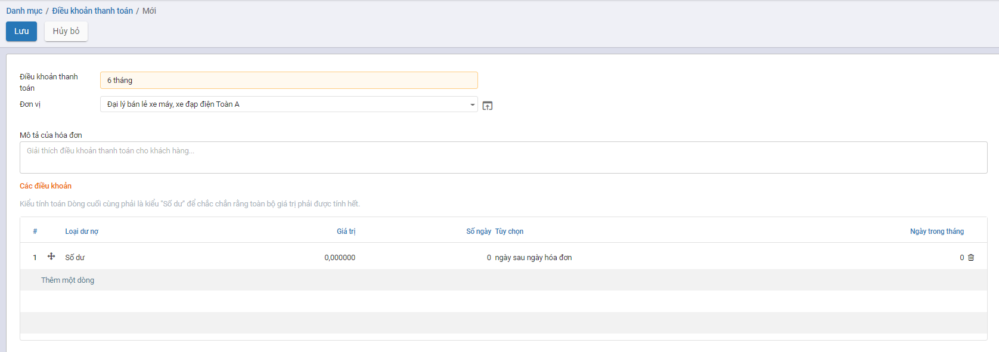

Tab các điều khoản: Nhấn **Thêm một dòng** Hoặc nhấn vào dòng đang mặc định sẵn để nhập thông tin điều khoản

- **Loại**: Chọn Loại điều khoản (Số dư, Phần trăm, Giá trị cố định)
- Khai báo các thông tin Tính số ngày đến hạn trả cho điều khoản thanh toán

Nhấn **Lưu & Đóng**

**Bước 3**: Nhấn **Lưu**

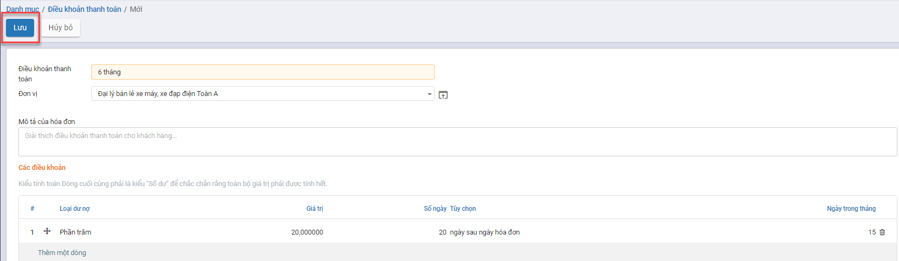

### Mẫu báo giá

**Mục đích**

Doanh nghiệp tạo mẫu báo giá cho từng sản phẩm để báo giá cho khách hàng

Chức năng Danh mục **Mẫu báo giá** được quản lý tập trung tại phần **Danh mục**

**Các bước thực hiện**

**Bước 1:** Vào **Danh mục**: chọn **Nhóm bán hàng** và nhấn nút **Chi tiết**

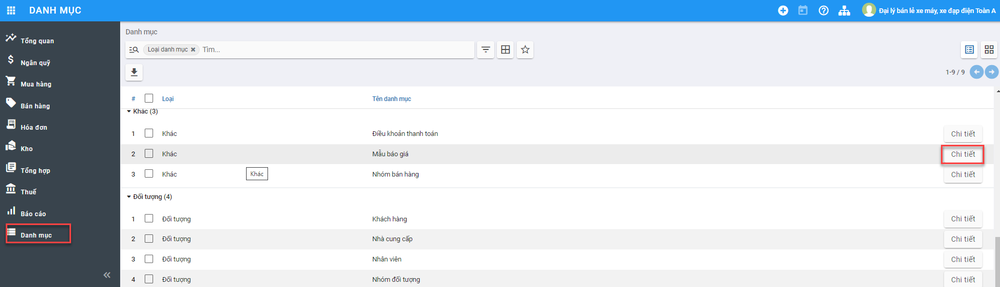

**Bước 2**: Nhấn **Tạo**

Khai báo thông tin

- Tại mục **Mẫu báo giá**(Tab chung): Nhập tên Mẫu báo giá
- Tại mục **Báo giá sẽ hết hạn sau**: Nhập số ngày hết hạn kể từ ngày báo giá
- Tại tab **Dòng** và tab **Sản phầm tùy chọn**: Tạo sản phẩm, số lượng, đơn vị tính cho mẫu báo giá

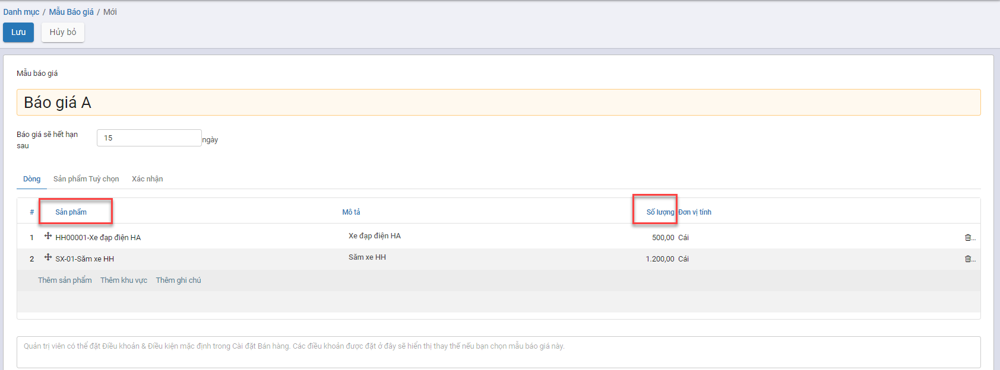

**Bước 4**: Nhấn **Lưu** để lưu lại dữ liệu đã khai báo mẫu báo giá

## *Thuế*

### Thuế

**Mục đích**

Hỗ trợ doanh nghiệp tính thuế theo chính sách của nhà nước. Hệ thống mặc định sinh sẵn các Thuế hiện hành theo quy định của Luật Thuế.                    

Chức năng Danh mục **Thuế** được quản lý tập trung tại phần **Danh mục**

**Các bước thực hiện**

**Bước 1:** Vào **Danh mục**: chọn **Thuế** và nhấn nút **Chi tiết**

Hiển thị danh sách **Thuế** mặc định của hệ thống

**Bước 2**: Nhấn **Tạo** để thêm mới **Thuế** và khai báo

- **Tên thuế**: Nhập Tên thuế
- **Tính thuế**: Nhập phương thức tính thuế
- **Loại thuế**: Chọn Loại thuế (Bán hàng, Mua hàng, Không dùng)
- **Tổng tiền**: Số phần trăm tính thuế

**Bước 3:** Nhấn **Lưu**

**Lưu ý**: Không cho sửa bản ghi mặc định của hệ thống tự động sinh ra.

### Nhóm Thuế

**Mục đích**

Giúp Doanh nghiệp phân loại theo đối tượng chịu thuế như: Thuế GTGT, Thuế thu nhập cá nhân, Thuế tiêu dùng, Thuế tài sản.......                     

Chức năng Danh mục **Nhóm Thuế** được quản lý tập trung tại phần **Danh mục**

**Các bước thực hiện**

**Bước 1:** Vào **Danh mục**: chọn **Nhóm thuế** và nhấn nút **Chi tiết**

Hiển thị danh sách nhóm thuế

**Bước 2**: Nếu có nhóm thuế phát sinh, nhấn **Tạo** để khai báo:

- Tại mục **Mã**: Nhập mã của nhóm thuế
- Tại mục **Tên**: Nhập tên của nhóm thuế
- Tại mục **Nhóm thuế**: Chọn nhóm thuế tương ứng

**Bước 3**: Nhấn **Lưu**

### Ngành nghề kinh doanh

**Mục đích**

Hiển thị hệ thống Ngành nghề kinh doanh theo quy định của chính phủ giúp doanh nghiệp quản lý được các ngành nghề đăng ký kinh doanh với cục thuế                     

Chức năng Danh mục **Ngành nghề kinh doanh** được quản lý tập trung tại phần **Danh mục**

**Các bước thực hiện**

**Bước 1:** Vào **Danh mục**: chọn **Ngành nghề kinh doanh** và nhấn nút **Chi tiết**

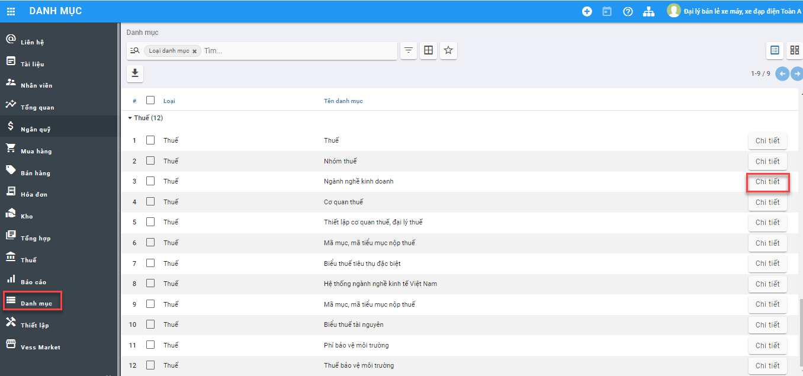

Hiển thị danh sách ngành nghề kinh doanh

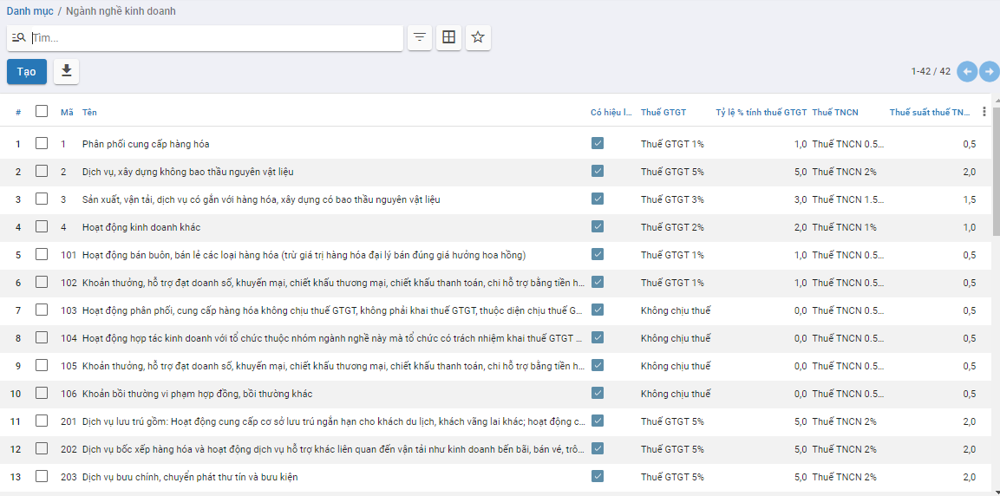

**Bước 2**: Nếu có ngành nghề kinh doanh phát sinh, nhấn **Tạo** để khai báo:

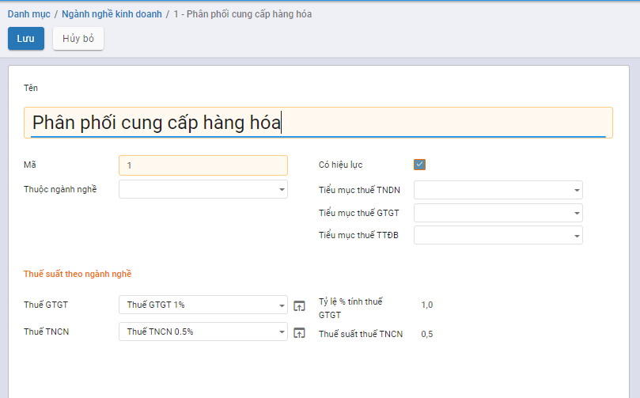

- Tại mục **Mã**: Nhập mã của ngành nghề
- Tại mục **Tên**: Nhập tên của ngành nghề
- Khai báo các trường Thuế GTGT, Thuế TNDN, Tỷ lệ % tính thuế GTGT và Thuế suất TNCN (Nếu có)

**Bước 3**: Nhấn **Lưu**

### Cơ quan thuế

**Mục đích**

Hiển thị hệ thống đầy đủ các cơ quan thuế hiện hành để giúp doanh nghiệp quản lý, khai báo các loại thuế doanh nghiệp nhanh chóng.                   

Chức năng Danh mục **Cơ quan thuế** được quản lý tập trung tại phần **Danh mục**

**Các bước thực hiện**

**Bước 1:** Vào **Danh mục**: chọn **Cơ quan thuế** và nhấn nút **Chi tiết**

Hiển thị danh sách cơ quan thuế

**Bước 2**: Nếu có cơ quan thuế phát sinh, nhấn **Tạo** để khai báo:

- Tại mục **Mã**: Nhập mã của cơ quan thuế
- Tại mục **Tên**: Nhập tên của cơ quan thuế
- Tại mục **Cấp**: Tích chọn cấp của cơ quan thuế

**Bước 3**: Nhấn **Lưu**

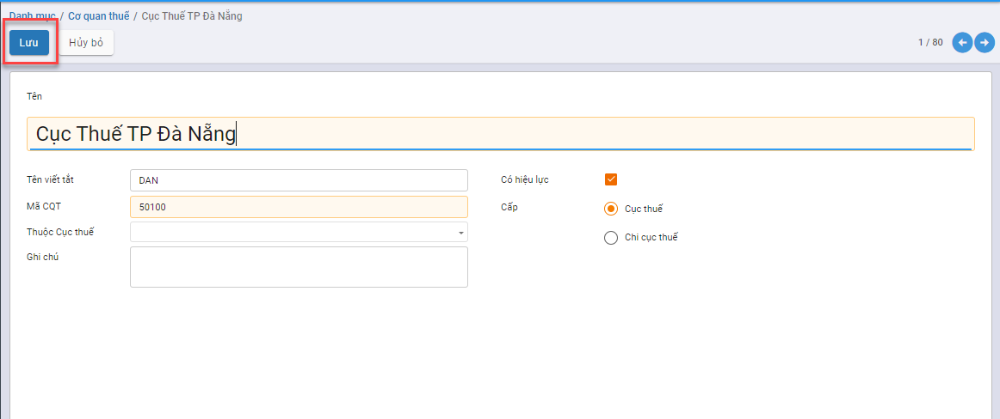

### Thiết lập cơ quan thuế, đại lý thuế

**Mục đích**

Nhân viên vào cấu hình cơ quan thuế, đại lý thuế đang quản lý doanh nghiệp          

Chức năng Danh mục **Cơ quan thuế** được quản lý tập trung tại phần **Danh mục**

**Các bước thực hiện**

**Bước 1:** Vào **Danh mục**: chọn **Thiết lập cơ quan thuế, đại lý thuế** và nhấn nút **Chi tiết**

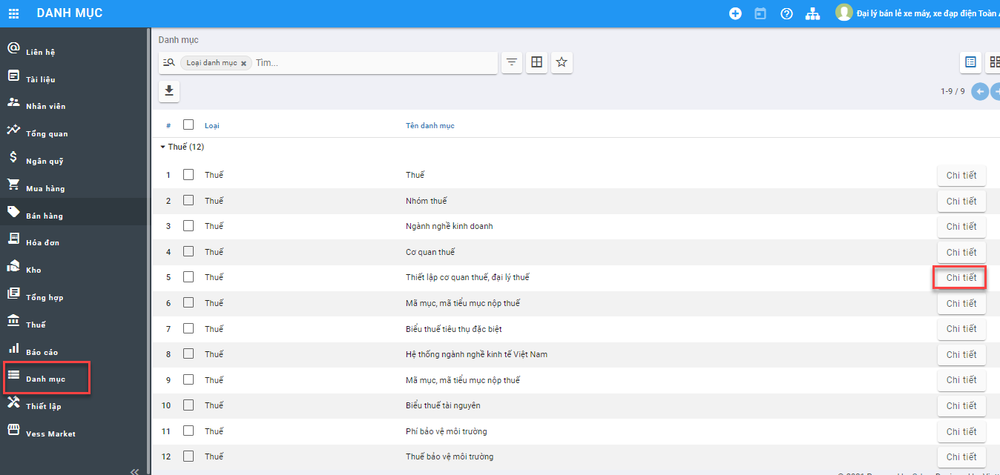

**Bước 2**: Nhấn **Tạo** để khai báo:

- Tại mục **Cơ quan thuế**: Khai báo cơ quan thuế cấp cục và cơ quan thuế quản lý
- Tại mục **Đại lý thuế**: Nhập thông tin Mã số thuế, Tên đại lý, Địa chỉ, Điện thoại,....

**Bước 3**: Nhấn **Lưu**

### Mã mục, mã tiểu mục nộp thuế

**Mục đích**

Hiển thị hệ thống hiển thị đầy đủ các mã mục cần nộp thuế theo quy định ban hành            

Chức năng Danh mục **Mã mục, mã tiểu mục nộp thuế** được quản lý tập trung tại phần **Danh mục**

**Các bước thực hiện**

**Bước 1:** Vào **Danh mục**: chọn **Mã mục, mã tiểu mục nộp thuế** và nhấn nút **Chi tiết**

Hiển thị danh sách mã mục, mã tiểu mục nộp thuế

**Bước 2**: Nếu có mã mục, mã tiểu mục nộp thuế phát sinh, nhấn **Tạo** để khai báo:

- Tại mục **Mã**: Nhập mã của mã mục, mã tiểu mục nộp thuế
- Tại mục **Tên**: Nhập tên của mã mục, mã tiểu mục nộp thuế
- Và khai báo các trường thông tin liên quan (Thuộc, Ghi chú, Nhóm, Mục, Tiểu mục)

**Bước 3**: Nhấn **Lưu**

### Biểu thuế tiêu thụ đặc biệt

**Mục đích**

Hệ thống hiển thị mặc định danh sách Biểu thuế tiêu thụ đặc biệt hỗ trợ người dùng quản lý thuế tiêu thụ đặc biệt theo  hàng hóa, dịch vụ

Chức năng Danh mục **Biểu thuế tiêu thụ đặc biệt** được quản lý tập trung tại phần **Danh mục**

**Các bước thực hiện**

**Bước 1:** Vào **Danh mục**: chọn **Biểu thuế tiêu thụ đặc biệt** và nhấn nút **Chi tiết**

Hiển thị danh sách Biểu thuế tiêu thụ đặc biệt

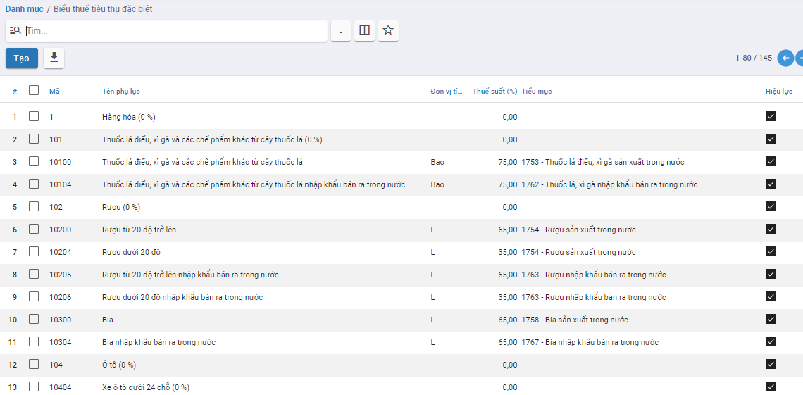

**Bước 2**: Nếu có mã mục, mã tiểu mục nộp thuế phát sinh, nhấn **Tạo** để khai báo:

- Tại mục **Tên phụ lục**: Nhập mã của mã mục, mã tiểu mục nộp thuế
- Tại mục **Mã**: Nhập tên của mã mục, mã tiểu mục nộp thuế
- Khai báo Thuộc, Loại, Thuế suất (%),.....

**Bước 3**: Nhấn **Lưu**

### Hệ thống ngành kinh tế Việt Nam

**Mục đích**

Hệ thống hiển thị mặc định danh sách Hệ thống ngành kinh tế Việt Nam hỗ trợ người dùng quản lý thuế theo từng ngành nghề

Chức năng Danh mục **Hệ thống ngành kinh tế Việt Nam** được quản lý tập trung tại phần **Danh mục**

**Các bước thực hiện**

**Bước 1:** Vào **Danh mục**: chọn **Hệ thống ngành kinh tế Việt Nam** và nhấn nút **Chi tiết**

Hiển thị danh sách Hệ thống ngành kinh tế Việt Nam

**Bước 2**: Nếu có ngành nghề kinh tế phát sinh, nhấn **Tạo** để khai báo:

- Tại mục **Tên** Nhập Tên ngành nghề
- Tại mục **Mã**: Nhập mã ngành nghề

**Bước 3**: Nhấn **Lưu**

### Biểu thuế tài nguyên

**Mục đích**

Hệ thống hiển thị mặc định danh sách Biểu thuế tài nguyên mà doanh nghiệp phải nộp cho nhà nước khi khai thác tài nguyên thiên nhiên

Chức năng Danh mục **Biểu thuế tài nguyên** được quản lý tập trung tại phần **Danh mục**

**Các bước thực hiện**

**Bước 1:** Vào **Danh mục**: chọn **Biểu thuế tài nguyên** và nhấn nút **Chi tiết**

Hiển thị danh sách Biểu thuế tài nguyên

**Bước 2**: Nếu có Biểu thuế tài nguyên phát sinh, nhấn **Tạo** để khai báo:

- Tại mục **Tên** Nhập tên Biểu thuế tài nguyên
- Tại mục **Mã**: Nhập mã Biểu thuế tài nguyên
- Khai báo Giá tính thuế tài nguyên của tỉnh, Giá tối thiểu, Giá tối đa tính thuế tài nguyên,....

**Bước 3**: Nhấn **Lưu**

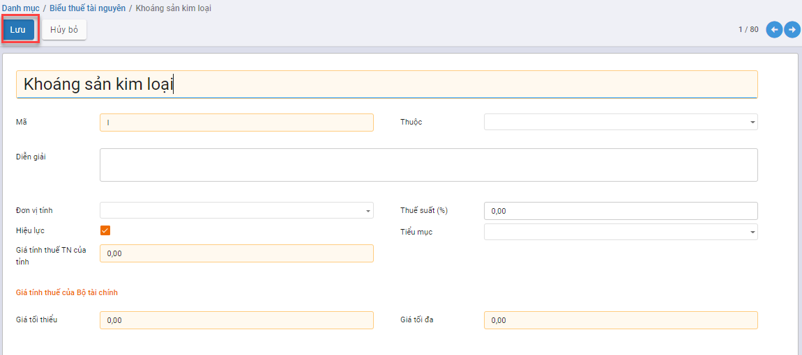

### Phí bảo vệ môi trường

**Mục đích**

Hệ thống hiển thị mặc định danh sách Phí bảo vệ môi trường mà doanh nghiệp phải nộp cho nhà nước

Chức năng Danh mục **Phí bảo vệ môi trường** được quản lý tập trung tại phần **Danh mục**

**Các bước thực hiện**

**Bước 1:** Vào **Danh mục**: chọn **Phí bảo vệ môi trường** và nhấn nút **Chi tiết**

Hiển thị danh sách các loại Phí bảo vệ môi trường

**Bước 2**: Nếu có Phí bảo vệ môi trường phát sinh, nhấn **Tạo** để khai báo:

- Tại mục **Tên** Nhập tên Phí bảo vệ môi trường
- Tại mục **Mã**: Nhập mã Phí bảo vệ môi trường
- Khai báo Đơn vị tính, Tiểu mục, Thuộc 

**Bước 3**: Nhấn **Lưu**

### Thuế bảo vệ môi trường

**Mục đích**

Hệ thống hiển thị mặc định danh sách Thuế bảo vệ môi trường mà doanh nghiệp phải nộp cho nhà nước

Chức năng Danh mục **Thuế bảo vệ môi trường** được quản lý tập trung tại phần **Danh mục**

**Các bước thực hiện**

**Bước 1:** Vào **Danh mục**: chọn **Thuế bảo vệ môi trường** và nhấn nút **Chi tiết**

Hiển thị danh sách các loại Thuế bảo vệ môi trường

**Bước 2**: Nếu có Thuế bảo vệ môi trường phát sinh, nhấn **Tạo** để khai báo:

- Tại mục **Tên** Nhập tên Thuế bảo vệ môi trường
- Tại mục **Mã**: Nhập mã Thuế bảo vệ môi trường
- Khai báo Đơn vị tính, Đơn giá, Thuộc 

**Bước 3**: Nhấn **Lưu**

