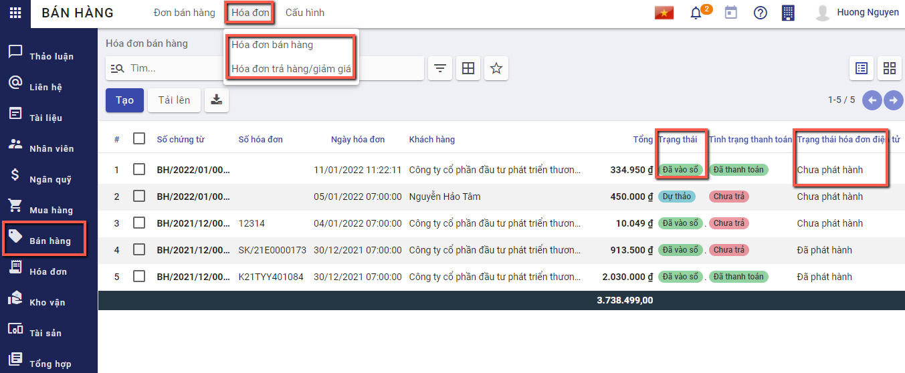
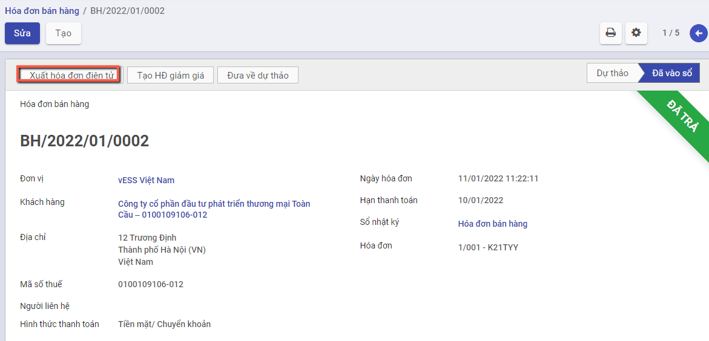
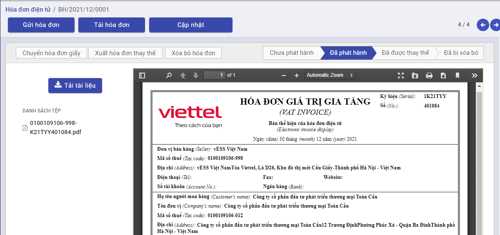

# *Xuất hóa đơn điện tử*

## Mô tả nghiệp vụ

Hóa đơn điện tử là các  dữ liệu điện tử về bán hàng hoá, cung ứng dịch vụ, được khởi tạo, lập, gửi, nhận, lưu trữ và quản lý bằng phương tiện điện tử. 

Sử dụng hóa đơn điện tử là một trong những phương tiện rất phù hợp với tổ chức, doanh nghiệp. Hóa đơn điện tử có thể làm giảm chi phí thấp hơn nhiều so với hóa đơn giấy bởi hóa đơn giấy cần chi phí vận chuyển và chi phí bảo quản. Hóa đơn điện tử có tính bảo mật cao, giúp tiết kiệm thời gian, làm giảm việc làm giả hóa đơn, chứng từ.

## Hướng dẫn trên phần mềm

Để phát hành được hóa đơn điện tử, người dùng cần:

- Khai báo mẫu hóa đơn trên sinvoice (https://vinvoice.viettel.vn)

- Khai báo mẫu hóa đơn trên hệ thống SME

**Xem video hướng dẫn**

<iframe
    width="920"
    height="450"
    frameborder="0"
    allow="autoplay; encrypted-media; clipboard-write; gyroscope; picture-in-picture "
    allowfullscreen
    title="Hóa đơn điện tử" 
    src="https://www.youtube.com/embed/q9Ok_vohBxQ"
></iframe>

### **Khai báo mẫu hóa đơn trên hệ thống SME**

**Bước 1**: Vào **Danh mục/Mẫu số hóa đơn**. Nhấn **Chi tiết** để vào danh mục

**Bước 2**: Nhấn nút **tạo ** để thực hiên thêm mới mẫu số hóa đơn

**Bước 3**: Khai báo các thông tin chi tiết về mẫu số hóa đơn

- Nhập đơn vị
- Chọn loại hóa đơn cần sử dụng
- Nhập mẫu số hóa đơn, ký hiệu hóa đơn theo yêu cầu

**Bước 4:** Nhấn **Lưu** để lưu lại thông tin

Lưu ý: Mẫu số hóa đơn cần phải trùng với mẫu số khai báo trên sinvoice

### **Xuất hóa đơn điện tử**

**Bước 1**: Chọn nghị định để xuất hóa đơn bằng cách vào **Hóa đơn**, chọn nghị định

**Bước 2**: Vào chức năng **Bán hàng/Hóa đơn/Hóa đơn bán hàng** hoặc **Bán hàng/Hóa đơn/Hóa đơn giảm giá/trả hàng** , tìm tới các hóa đơn **đã vào sổ** và **chưa phát hành** hóa đơn điện tử

**Bước 3**: Chọn hóa đơn, nhấn nút xuất hóa đơn điện tử. 

Nếu phần mềm hiển thị thông báo lỗi "Mẫu số hóa đơn băt buộc nhập!!!", người dùng nhấn Sửa và nhập bổ sung mẫu số hóa đơn

Nếu chưa đăng nhập Sinvoice, phần mềm sẽ mở ra cửa sổ đăng nhập hệ thống Sinvoice

Người dùng có thể tự đăng nhập hệ thống Sinvoice trước khi xuất hóa đơn điện tử bằng cách vào **Hóa đơn/Hóa đơn điện tử**, nhấn nút **Kết nối hóa đơn điện tử** 

Khi xuất hóa đơn điện thử thành công, hệ thống tự động sinh một hóa đơn điện tử ở trạng thái chưa phát hành.

**Bước 4**: Vào **Hóa đơn/Hóa đơn điện tử**. Chọn hóa đơn vừa được xuất từ hóa đơn bán hàng

Để hóa đơn được phép phát hành, chọn **Phát hành hóa đơn** , hệ thống mở lên cửa sổ nhập thông tin cần phát hành

 

Người dùng kiểm tra thông tin, Nếu đã chính xác thì thực hiện nhấn **Phát hành hóa đơn**. Khi đó hóa đơn điện tử sẽ chuyển sang trạng thái đã phát hành

- Chọn **Tải hóa đơn** , hệ thống xuất hóa đơn dưới dạng .xml

- Chọn **Cập nhât** , hệ thống tải lại thông tin hóa đơn

- Chọn **Tải tài liệu** , hệ thống xuất hóa đơn dưới dạng .pdf

- Chọn **Chuyển hóa đơn giấy** , hệ thống xuất hóa đơn dưới dạng .pdf

- Khi phát hiện hóa đơn hiện tại bị sai thông tin ví dụ như địa chỉ, số lượng, người dùng có thể thực hiện xóa bỏ hóa đơn đang có bằng cách chọn **Xóa bỏ hóa đơn** ,hệ thống mở một cửa sổ để nhập thông tin

Người dùng kiểm tra thông tin, nhập biên bản thỏa thuận xác nhận xóa bỏ hóa đơn và nhấn **Xóa bỏ hóa đơn**

- Khi phát hiện hóa đơn hiện tại bị sai thông tin ví dụ như địa chỉ, số lượng, người dùng có thể thực hiện xóa bỏ hóa đơn đang có đồng thời sinh lại một hóa đơn mới  bằng cách chọn chọn **Xuất hóa đơn thay thế** , hệ thống mở một cửa sổ để nhập thông tin

Người dùng kiểm tra thông tin, nhập biên bản thỏa thuận xác nhận xóa bỏ hóa đơn và nhấn **Xóa bỏ hóa đơn**

