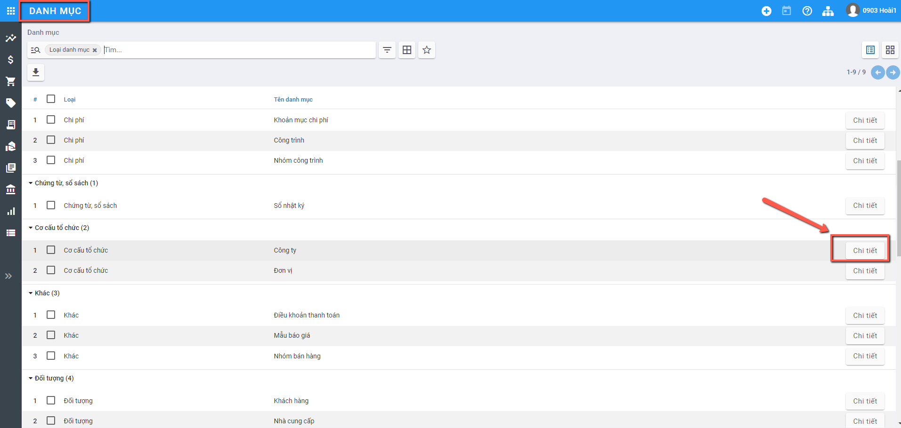
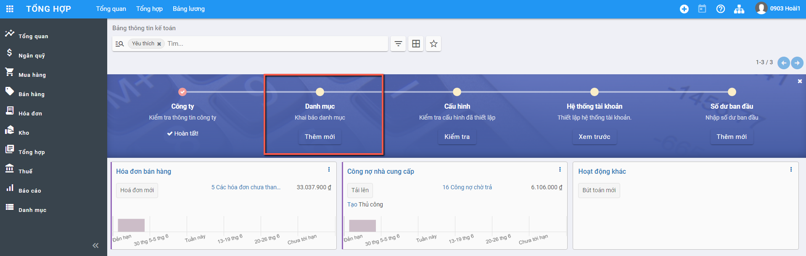
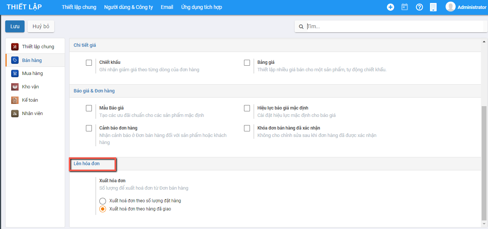
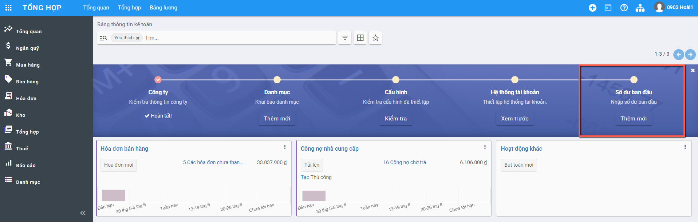
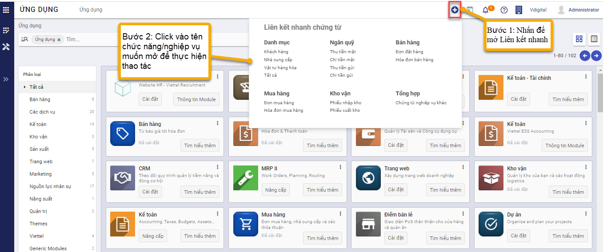

# **Thiết lập ban đầu**

Việc thiết lập ban đầu được thực hiện ngay tại thời điểm cài đặt xong Phân hệ kế toán: Đây là điều kiện cần có và bắt buộc để bắt đầu thực hiện các nghiệp vụ trên phân hệ Kế toán

Sau khi khai báo thiết lập ban đầu được Hoàn thành: hệ thống tài khoản và các chế độ kế toán cũng như biểu mẫu kế toán liên quan sẽ được áp dụng theo Thông tư và các thiết lập đã được lựa chọn 

## **Khai báo ban đầu**

Việc khai báo ban đầu được thực hiện tại thời điểm khai báo xong Thiết lập ban đầu hoặc trong quá trình thực hiện các nghiệp vụ kế toán, người dùng có thể bổ sung khai báo.

Các thông tin khai báo gồm 5 mục:

### **Thông tin công ty**

Khai báo dữ liệu về Công ty với đầy đủ thông tin về Tên, Địa chỉ, MST, email liên hệ, Trang web. 

Việc khai báo thông tin Công ty được tiến hành khi User được kích hoạt. Trong quá trình sử dụng: Người dùng có thể cập nhật/quản lý thông tin Công ty bằng 2 cách vào chức năng

**Cách 1:** Từ Thông tin User (Góc phải màn hình): Nhấn chuột ==> Chọn Thông tin Công ty

**Cách 2**: Vào **Danh mục**: Chọn **Công ty** và Nhấn Chi tiết

### **Khai báo danh mục**

Hiển thị các danh mục cơ bản để người dùng có thể khai báo thông tin trước khi bắt đầu thực hiện nghiệp vụ kế toán

Việc khai báo này có thể thực hiện tại bất kỳ thời điểm nào: trước khi tiến hành Nhập hay ngay tại Thời điểm đang nhập Chứng từ

Để phục vụ cho việc cập nhập số dư ban đầu của dữ liệu kế toán, Người dùng nên khai báo trước một số một số Danh mục về Đối tượng, Nhân viên, Hàng hóa, Nhà cung cấp... tại Module **Danh mục**

(Việc sử dụng khai báo/quản lý các Danh mục xem thêm thông tin hướng dẫn tại phần **Danh mục**)

### **Cấu hình kế toán**

Lựa chọn Đồng tiền hạch toán áp dụng cho Doanh nghiệp; Kỳ kế toán;  phương pháp thuế GTGT; Các thông tin này đều được thiết lập mặc định

Hiển thị lại Chế độ kế toán đã chọn và khai báo bổ sung thêm thông tin mặc định áp dụng cho phần hành kế toán liên quan đến thuế

![*[Bổ sung hình ảnh]*](images/thiet_lap.png)

### **Hệ thống tài khoản**

Hiển thị thông tin Hệ thống tài khoản theo Thông tư đã lựa chọn, có thể Chỉnh sửa, thay đổi để phù hợp với chế độ kế toán tại Doanh nghiệp

(Hướng dẫn chi tiết phần Quản lý/Khai báo thông tin Tài khoản xem tại hướng dẫn sử dụng của **Danh mục/Hệ thống tài khoản**)

### Khai báo số dư ban đầu

Để bắt đầu sử dụng các phần hành trong hệ thống: Ngoài các danh mục cần khai báo bổ sung; Người dùng thực hiện khai báo thông tin Số dư đầu kỳ cho các tài khoản tiền mặt; tiền ngân hàng; công nợ của các đối tượng (nếu có) và Tồn đầu kỳ của vật tư hàng hóa

(Hướng dẫn chi tiết phần Quản lý/Khai báo thông tin Số dư đầu kỳ xem tại hướng dẫn sử dụng của **Tổng hợp/Khai báo số dư ban đầu**)

## Liên kết nhanh

Hiển thị danh sách các danh mục,chức năng của hệ thống mà người dùng thường xuyên sử dụng để hỗ trợ người dùng mở danh mục, chức năng nhanh hơn mà không cần vào từng phân hệ và chọn chức năng nghiệp vụ.

