# *Quy trình nghiệp vụ*

Kế toán tổng hợp được sử dụng để  lưu trữ và phản ánh tổng quát dữ liệu kế toán của doanh nghiệp trên các hệ thống tài khoản, sổ kế toán và báo cáo tài chính theo các chỉ tiêu giá trị của doanh nghiệp, cập nhật các phiếu kế toán tổng quát, các bút toán điều chỉnh. Làm đầu vào cho các báo cáo Tài chính, báo cáo Tổng hợp và báo cáo Thuế.

Quy trình kế toán tổng hợp bao gồm:

- Tổng hợp thu thập thông tin, chứng từ kế toán và các số liệu thông qua các nghiệp vụ phát sinh thực tế  và xử lý những thông tin này
- Ghi chép các nghiệp vụ phát sinh của tài khoản và vào sổ sách kế toán của doanh nghiệp

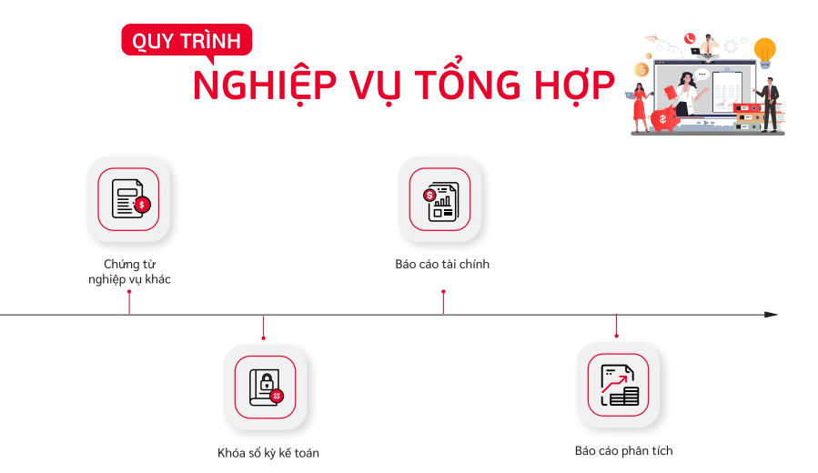

**Các luồng quy trình**

·     Lập chứng từ nghiệp vụ khác. Chi tiết nghiệp vụ **[tại đây](#chung-tu-nghiep-vu-khac)**

·     Danh sách bút toán. Chi tiết nghiệp vụ **[tại đây](#danh-sach-but-toan)**

·     Chi tiết bút toán. Chi tiết nghiệp vụ **[tại đây](#chi-tiet-but-toan)**

·     Bảng lương. Chi tiết nghiệp vụ **[tại đây](#bang-luong)**

·     Khai báo số dư ban đầu. Chi tiết nghiệp vụ **[tại đây](#khai-bao-so-du-ban-dau)**

·     Nhập tồn kho vật tư, hàng hóa. Chi tiết nghiệp vụ **[tại đây](#nhap-ton-kho-vat-tu-hang-hoa)**

## *Chứng từ nghiệp vụ khác*

### Mô tả nghiệp vụ

**Nghiệp vụ**

Chức năng cho phép người dùng hạch toán bút toán thủ công đối với những nghiệp vụ khác nằm ngoài luồng nghiệp vụ tự động của hệ thống

**Xem video hướng dẫn**

<iframe
    width="920"
    height="450"
    frameborder="0"
    allow="autoplay; encrypted-media; clipboard-write; gyroscope; picture-in-picture "
    allowfullscreen
    title="Chứng từ nghiệp vụ khác" 
    src="https://www.youtube.com/embed/gtdLHJmtKiA?list=PLcdARb5pnnj8jeyvyhaptnwL3sxxT_QaK"
></iframe>

### **Hướng dẫn trên phần mềm**

Đối tượng thực hiện: Người dùng phần mềm

**Bước 1**: Vào phân hệ **Kế toán**, Chọn **Tổng hợp**, chọn **Chứng từ nghiệp vụ khác** 

Hoặc thực hiện **Tìm kiếm** trực tiếp chức năng trên ô tìm kiếm chung của hệ thống

**Bước 2**: Nhấn nút **Tạo** trên chức năng để thực hiện thêm mới một chứng từ, thực hiện khai báo các thông tin cần thiết:

- Chọn Định khoản: Xác định ghi chép số tiền của một nghiệp vụ kinh tế phát sinh. Khoản ghi chép có thể là chi phí bả	o hiểm xã hội, chi phí tiền lương, ... Người dùng có thể bổ sung khoản ghi chép mới bằng cách vào **Danh mục/Định khoản tự động** 

  

  Thực hiện nhập bổ sung định khoản bằng cách Nhấn **Tạo**, nhập các thông tin cần thiết gồm Tên, Loại chứng từ = **Khác**, tài khoản nợ, tài khoản có. Nhấn **Lưu** để lưu định khoản mới

  

- Nhập đơn vị, ngày hạch toán (Ngày thực hiện ghi sổ), số tiền cần thiết (Số tiền cho nghiệp vụ đang tạo), nội dung (Mô tả thông tin cho nghiệp vụ phát sinh)

- Sau mỗi lần chọn định khoản, hệ thống sẽ tự động sinh 2 dòng thông tin chi tiết tương ứng với số tiền và định khoản đã chọn. Người dùng có thể chọn nhiều định khoản trên cùng một chứng từ, hệ thống sẽ sinh tương ứng bấy nhiêu dòng chi tiết

  

**Bước 3**: Nhấn **Lưu lại. ** 

Lưu ý:

- Người dùng có thể sửa lại số tiền theo từng định khoản bằng cách chọn lại từng định khoản trên thông tin chung và nhập lại số tiền
- Người dùng có thể xóa thông tin chi tiết bút toán phát sinh thừa bằng cách nhấn nút **Xóa**  tại góc phải trên mỗi dòng chi tiết 

**Bước 4**: Chọn **Vào sổ**  để ghi nhận đã hạch toán. 

Nếu không muốn ghi sổ một bút toán đã hạch toán thì chọn nút **đưa về dự thảo** 

**Bước 5** : Có thể in được chứng từ kế toán phản ánh nội dung nghiệp vụ kinh tế phát sinh bằng cách, chọn chứng từ cần in,  nhấn **In** và chọn mẫu chứng từ cần in.

**Bước 6**: Có thể tạo bút toán đảo ngược  bằng cách chọn chứng từ cần đảo ngược và đã ghi sổ, nhấn button **Bút toán đảo**

Một cửa sổ lựa chọn thông tin sẽ được hiện ra, chọn **Đảo ngược**

Hệ thống sẽ tự động sinh một chứng từ khác có thông tin giống với chứng từ gốc và thực hiện ghi sổ

## *Danh sách bút toán*

### Mô tả nghiệp vụ

**Nghiệp vụ**

Chức năng cho phép người dùng xem toàn bộ các giao dịch phát sinh đã ghi sổ hiện có trên hệ thống

**Xem video hướng dẫn**

*[Xây dựng video hướng dẫn trên phần mềm, gồm đủ các luồng chức năng được mô tả bên dưới]*

### **Hướng dẫn trên phần mềm**

Đối tượng thực hiện: Người dùng phần mềm

**Bước 1**: Vào phân hệ **Kế toán**, Chọn **Tổng hợp**, chọn **Danh sách bút toán** 

Hoặc thực hiện **Tìm kiếm** trực tiếp chức năng trên ô tìm kiếm chung của hệ thống

Thực hiện tải xuống toàn bộ bút toán bằng cách nhấn nút **Tải xuống**  trên danh sách

**Bước 2**: Thực hiện tìm kiếm một chứng từ bất kỳ bằng cách nhấn nút  **Tìm kiếm** 

Người dùng có thể lựa chọn tiêu chí để tìm kiếm có sẵn hoặc tự tạo cho mình một bộ tìm kiếm riêng biệt 

**Bước 3** : Có thể xem chi tiết bút toán của một chứng từ bằng cách kich chuột chọn vào chứng từ muốn xem.

## *Chi tiết bút toán*

### Mô tả nghiệp vụ

Chức năng cho phép người dùng xem toàn bộ các chi tiết bút toán ghi sổ hiện có trên hệ thống

**Xem video hướng dẫn**

*[Xây dựng video hướng dẫn trên phần mềm, gồm đủ các luồng chức năng được mô tả bên dưới]*

### Hướng dẫn trên phần mềm

**Bước 1**: Vào phân hệ **Kế toán**, Chọn **Tổng hợp**, chọn **Chi tiết bút toán** 

Hoặc thực hiện **Tìm kiếm** trực tiếp chức năng trên ô tìm kiếm chung của hệ thống

Thực hiện tải xuống toàn bộ bút toán bằng cách nhấn nút **Tải xuống**  trên danh sách

**Bước 2**: Thực hiện tìm kiếm một chứng từ bất kỳ bằng cách nhấn nút  **Tìm kiếm** 

Người dùng có thể lựa chọn tiêu chí để tìm kiếm có sẵn hoặc tự tạo cho mình một bộ tìm kiếm riêng biệt 

**Bước 3** : Có thể xem chi tiết bút toán của một chứng từ bằng cách kich chuột chọn vào chứng từ muốn xem.

## *Bảng lương*

### Mô tả nghiệp vụ

**Nghiệp vụ**

Hàng tháng, người dùng tự tính lương cho người lao động và nhập khẩu thông tin lương để lưu trữ trên hệ thống. 
Hệ thống sẽ tự động hạch toán lương và lên báo cáo theo dõi tình hình thanh toán lương (S5-HKD) 

### **Xem video hướng dẫn**

<iframe
    width="920"
    height="450"
    frameborder="0"
    allow="autoplay; encrypted-media; clipboard-write; gyroscope; picture-in-picture "
    allowfullscreen
    title="Module Tổng hợp - Bảng lương" 
    src="https://www.youtube.com/embed/mb_1aFz7oSY?list=PLcdARb5pnnj8jeyvyhaptnwL3sxxT_QaK"
></iframe>

### **Hướng dẫn trên phần mềm**

Đối tượng thực hiện: Người dùng phần mềm

**Bước 1**: Vào phân hệ **Kế toán**, Chọn **Tổng hợp**, chọn **Bảng lương** 

Hoặc thực hiện **Tìm kiếm** trực tiếp chức năng trên ô tìm kiếm chung của hệ thống

**Bước 2**: Nhấn nút **Tạo** trên chức năng để thực hiện thêm mới bảng lương của tháng, thực hiện khai báo các thông tin cần thiết:

- Chọn Kỳ lương cho Bảng lương: Hệ thống sẽ mặc định thông tin Kỳ lương của tháng hiện tại
- Hạch toán theo đối tượng: 
  - Nếu tích chọn: Tại chức năng **'Thanh toán lương cho nhân viên'**: Sẽ thực hiện thanh toán chi tiết theo từng Nhân viên đã được khai báo tại Bảng lương
  - Nếu không tích chọn: Tại chức năng **'Thanh toán lương cho nhân viên'**: Hệ thống sẽ thực hiện thanh toán theo Số tiền tổng, không theo từng đối tượng Nhân viên

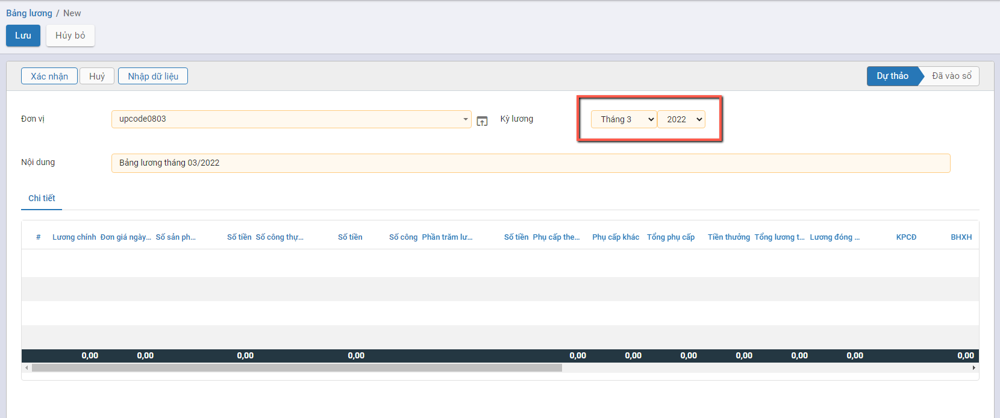

**Bước 3**: Nhấn nút **Nhập dữ liệu** trên chức năng để thực hiện Nhập thông tin dữ liệu lương tháng từ file Excel:

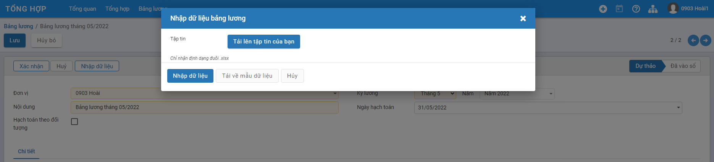

**Bước 4**: Để tải biểu mẫu của Bảng lương, Người dùng Nhấn nút **Tải về mẫu dữ liệu** Hệ thống sẽ tải file Biểu mẫu Import bảng lương và người dùng thực hiện Nhập thông tin theo dữ liệu trên Biểu mẫu

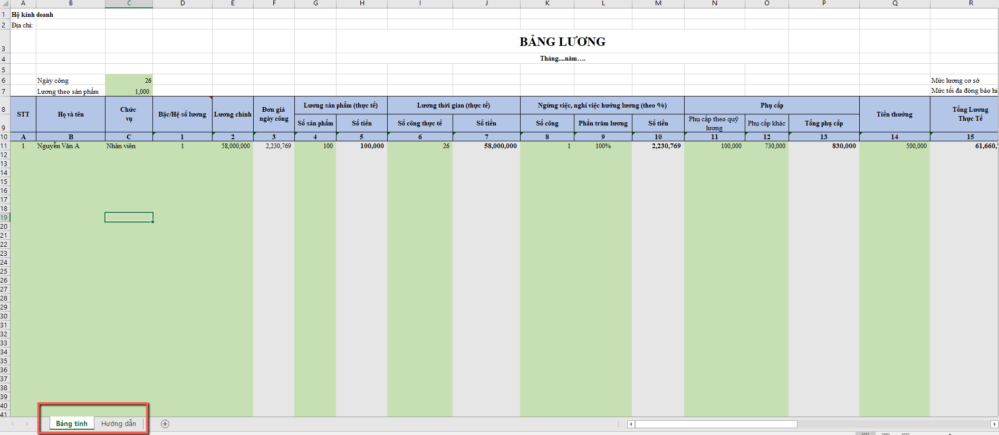

- Thông tin trên File excel gồm 2 Sheet dữ liệu

  - **Sheet Bảng tính:** Gồm toàn bộ các thông tin phải nhập dữ liệu đầu vào để tính lương cho toàn bộ Nhân viên của Đơn vị. Trên mỗi cột cần sử dụng tính toán hệ thống đã hỗ trợ mặc định công thức

  - **Sheet Hướng dẫn**: Giải thích từng cột giá trị và công thức tính đang được áp dụng bên Sheet Bảng tính

    

**Bước 5**: Để tải dữ liệu bảng lương đã được nhập đầy đủ dữ liệu từ File lên hệ thống, Người dùng Nhấn nút **Tải lên tập tin của bạn** : 

- Thực hiện chọn file Bảng lương

- Thông tin File Bảng lương sau khi được chọn: Người dùng nếu muốn thay đổi thông tin File đã chọn thì sử dụng nút: **Xóa** (Để chọn lại) hoặc **Chọn** (Để chọn lại file)

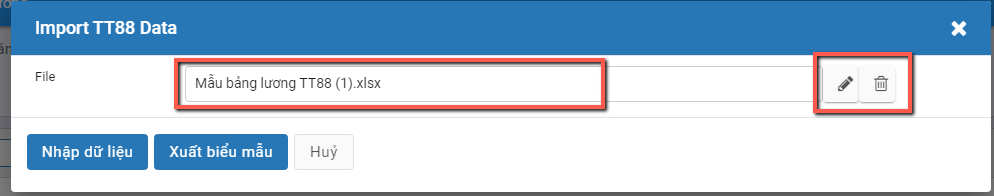

**Bước 6**: Người dùng Nhấn nút **Nhập dữ liệu**để hoàn tất phần chọn File

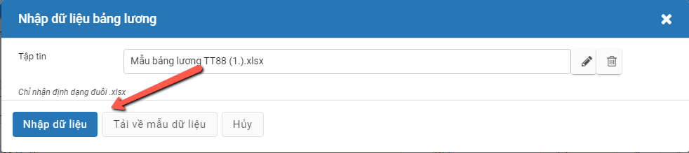

Thông tin đã nhập trên file Biểu mẫu được đẩy xuống tại Tab Chi tiết của chức năng

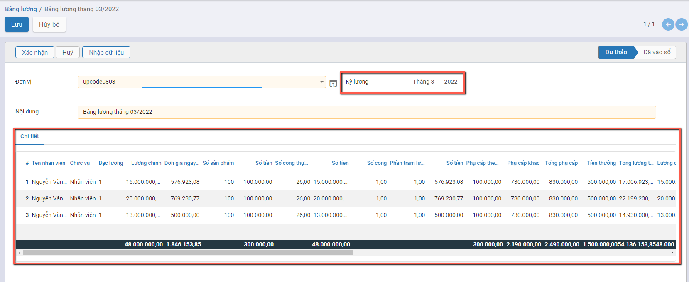

- Lưu ý: Thông tin Kỳ lương sau khi đã có dữ liệu sẽ không được thay đổi
- Người dùng muốn nhập lại dữ liệu sau khi thấy cần phải điều chỉnh: Thực hiện nhấn nút **Nhập dữ liệu** và thực hiện lại bước chọn file cần tải

**Bước 7**: Người dùng Nhấn nút **Xác nhận** để ghi nhận hạch toán dữ liệu Bảng lương

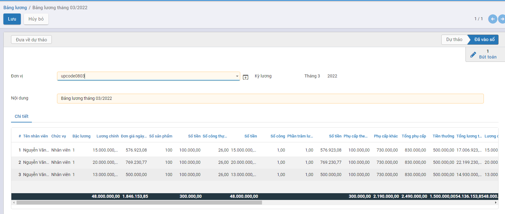

## **Cấu hình hạch toán lương**

**Mục đích**

Quản lý thông tin liên quan đến hạch toán lương bên Bảng lương. Hệ thống tự động thiết lập sẵn các Giá trị cấu hình cho phần hạch toán lương.

**<u>*Lưu ý:*</u>** **Người dùng hạn chế Chỉnh sửa thông tin**, để tránh gây lỗi khi lên các bút toán của phần Bảng lương

**Các bước thực hiện**

**Bước 1:** Vào **Tổng hợp**: chọn **Bảng lương/Cấu hình hạch toán lương**

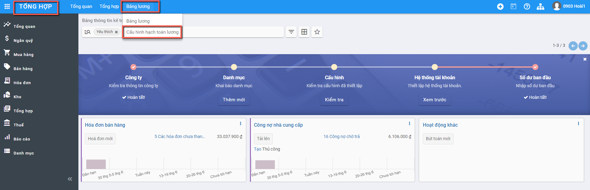

Thông tin **Cấu hình hạch toán lương** được hiển thị để người dùng khai báo và quản lý

**Bước 2:** Khai báo/Cập nhật thông tin Định khoản

- Để khai báo: Người dùng nhấn nút : Hệ thống tạo 1 dòng dữ liệu trên Danh sách để người dùng nhập thông tin

- Để Sửa dữ liệu: Người dùng Nhấn chuột vào bản ghi cần sửa: Thông tin bản ghi ở trạng thái chỉnh sửa được

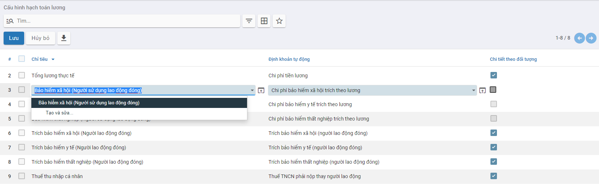

**Bước 3:** Nhấn nút **Lưu**: Để ghi nhận thông tin đã Tạo/Cập nhật

## *Khai báo số dư ban đầu*

### Mô tả nghiệp vụ

**Nghiệp vụ**

Hướng dẫn việc khai báo thông tin Số dư đầu kỳ của Tài khoản và Số dư đầu kỳ theo từng Đối tượng.

Việc khai báo Số dư ban đầu thực hiện cho:

- Số dư tiền mặt
- Số dư tài khoản ngân hàng
- Công nợ khách hàng
- Công nợ nhà cung cấp
- Công nợ nhân viên
- Số dư tài khoản đầu kỳ khác

### **Hướng dẫn trên phần mềm**

#### Số dư đầu kỳ của Tài khoản Tiền mặt/Tiền ngân hàng

Hướng dẫn việc khai báo Số dư đầu kỳ của Tiền mặt Tài khoản ngân hàng

Đối tượng thực hiện: Người dùng phần mềm

**Xem video hướng dẫn**

<iframe
    width="920"
    height="450"
    frameborder="0"
    allow="autoplay; encrypted-media; clipboard-write; gyroscope; picture-in-picture "
    allowfullscreen
    title="Module Tổng hợp - Khai báo số dư ban đầu - Số dư tiền mặt/Số dư tài khoản ngân hàng" 
    src="https://www.youtube.com/embed/L-yJgAFww_Q?list=PLcdARb5pnnj8jeyvyhaptnwL3sxxT_QaK"
></iframe>

**Bước 1**: Vào phân hệ **Tổng hợp**: Chọn tính năng tương ứng cần khai báo Số dư đầu kỳ cho Tài khoản

- **Số dư tiền mặt**: Khai báo Số dư đầu kỳ của Tài khoản Tiền mặt, theo Sổ kế toán

- **Số dư tài khoản ngân hàng**: Khai báo Số dư đầu kỳ của Tài khoản ngân hàng, theo Sổ kế toán

  

Thông tin màn hình của:

- **Số dư tiền mặt**

  

- **Số dư tài khoản ngân hàng**

  

**Bước 2**: Nhấn nút  để khai báo thông tin

Các trường dữ liệu trên chức năng:

- Ngày hạch toán: Mặc định thông tin Ngày thực hiện tạo, có thể thay đổi được
- Nút **Lấy dữ liệu**: Khi nhấn nút **Lấy dữ liệu** hệ thống sẽ mặc định view các Sổ nhật ký tiền mặt/tiền ngân hàng (đã được khai báo tại Danh mục Sổ nhật ký) lên **tab Số dư đầu kỳ**
- Thông tin Sổ nhật ký: Để người dùng tự động chọn thông tin để Thêm dòng dữ liệu

**Bước 3**: Thực hiện chọn và Nhập thông tin dữ liệu

- Chọn Sổ nhật ký: Hệ thống tự động hiển thị thông tin Tài khoản gắn với Sổ nhật ký cùng thông tin Tiền tệ. 
- Nhập thông tin Số tiền: Thực hiện nhập Số dư đầu kỳ của Tài khoản. 

<u>***Lưu ý:***</u> 

- Thông tin Cột Nợ/Có được hiển thị để nhập giá trị căn cứ vào Thiết lập của từng Tài khoản được cấu hình tại chức năng **'Hệ thống tài khoản'**
  - Tài khoản có tính chất Dư Nợ: Cột Nợ sẽ cho phép nhập giá trị; Cột Có không nhập được giá trị
  - Tài khoản có tính chất Dư Có: Cột Có sẽ cho phép nhập giá trị; Cột Nợ không nhập được giá trị
  - Tài khoản Có tính chất Lưỡng tính: Cả cột Nợ và Có đều cho phép nhập giá trị

**Phần Khai báo tài khoản**

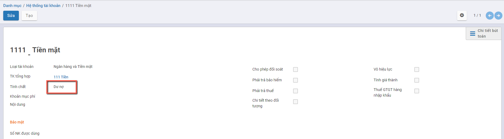

- **Với Số dư tiền mặt**

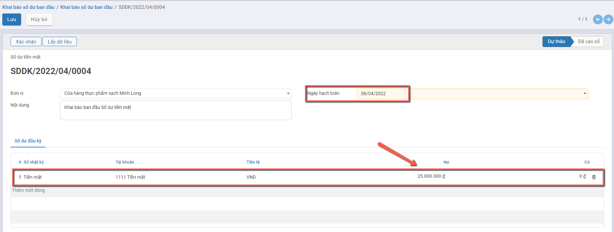

- **Với Số dư tài khoản ngân hàng**

***Lưu ý:*** Nếu Người dùng không thấy hiển thị thông tin **Số tài khoản ngân hàng** cần kiểm tra lại việc khai báo của Sổ nhập ký Tiền ngân hàng tại **Danh mục Sổ nhật ký** và thực hiện bổ sung thông tin tại 'Tài khoản Ngân hàng'

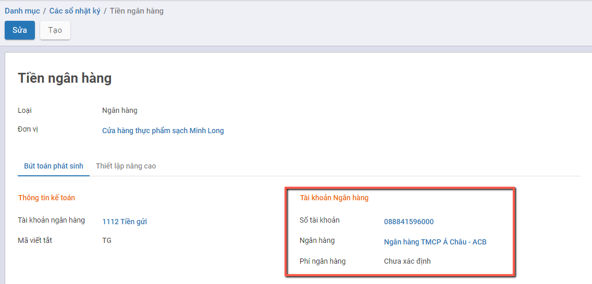

**Bước 4**: Người dùng Nhấn nút **Xác nhận** để ghi nhận thông tin Số dư đầu kỳ theo dữ liệu đã nhập.

Thông tin Dữ liệu đã nhập được vào Sổ và dữ liệu lên bút toán

Muốn xem thông tin Bút toán: Người dùng nhấn nút **'Bút toán'**

#### Số dư đầu kỳ của Tài khoản khác

Hướng dẫn việc khai báo Số dư đầu kỳ của Tài khoản khác

Đối tượng thực hiện: Người dùng phần mềm

**Xem video hướng dẫn**

<iframe
    width="920"
    height="450"
    frameborder="0"
    allow="autoplay; encrypted-media; clipboard-write; gyroscope; picture-in-picture "
    allowfullscreen
    title="Module Tổng hợp - Khai báo số dư ban đầu - Số dư tài khoản đầu kỳ khác" 
    src="https://www.youtube.com/embed/pzswpoQEoec?list=PLcdARb5pnnj8jeyvyhaptnwL3sxxT_QaK"
></iframe>

**Bước 1**: Vào phân hệ **Tổng hợp**: Chọn tính năng **Số dư tài khoản đầu kỳ khác**: Nhấn chọn thông tin **'Số dư tài khoản đầu kỳ khác'** trên Sơ đồ

Thông tin màn hình của: **Số dư tài khoản đầu kỳ khác**

**Bước 2**: Nhấn nút  để khai báo thông tin

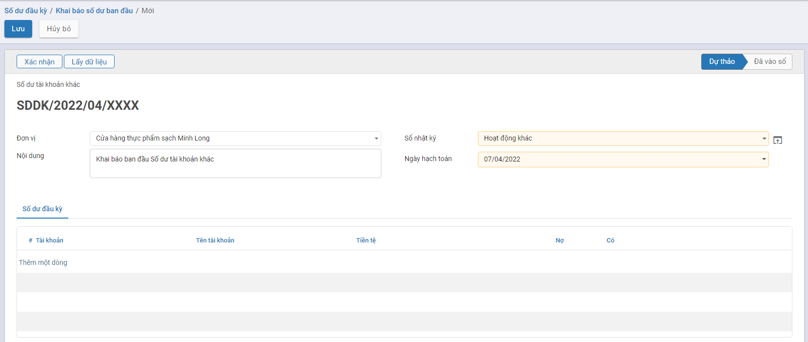

Các trường dữ liệu trên chức năng:

- Ngày hạch toán: Mặc định thông tin Ngày thực hiện tạo, có thể thay đổi được
- Nút **Lấy dữ liệu**: Khi nhấn nút **Lấy dữ liệu** hệ thống sẽ mặc định hiển thị các Tài khoản con được khai báo trên hệ thống tại danh mục **Hệ thống tài khoản**

**Bước 3**: Thực hiện chọn và Nhập thông tin dữ liệu

- Chọn Sổ nhật ký: Hệ thống view các Sổ nhật ký được khai báo tại danh mục **Sổ nhật ký với Loại = Khác**. 
- Thực hiện Nhấn nút Thêm một dòng để bổ sung các tài khoản cần khai báo
- Nhập thông tin Số tiền: Căn cứ vào tính chất của Tài khoản để nhập Số dư bên Nợ **hoặc** Số dư bên Có. 

***Lưu ý:*** 

- Thông tin Cột Nợ/Có được hiển thị để nhập giá trị căn cứ vào Thiết lập của từng Tài khoản được cấu hình tại chức năng **'Hệ thống tài khoản'**
  - Tài khoản có tính chất Dư Nợ: Cột Nợ sẽ cho phép nhập giá trị; Cột Có không nhập được giá trị
  - Tài khoản có tính chất Dư Có: Cột Có sẽ cho phép nhập giá trị; Cột Nợ không nhập được giá trị
  - Tài khoản Có tính chất Lưỡng tính: Cả cột Nợ và Có đều cho phép nhập giá trị

Phần Khai báo tài khoản

**Bước 4**: Người dùng Nhấn nút **Xác nhận** để ghi nhận thông tin Số dư đầu kỳ theo dữ liệu đã nhập.

Thông tin Dữ liệu đã nhập được vào Sổ và dữ liệu lên bút toán

#### Công nợ khách hàng/Công nợ nhà cung cấp

Hướng dẫn việc khai báo Số dư đầu kỳ của Công nợ khách hàng và Công nợ nhà cung cấp

Đối tượng thực hiện: Người dùng phần mềm

**Xem video hướng dẫn**

<iframe
    width="920"
    height="450"
    frameborder="0"
    allow="autoplay; encrypted-media; clipboard-write; gyroscope; picture-in-picture "
    allowfullscreen
    title="Module Tổng hợp - Khai báo số dư ban đầu - Công nợ khách hàng/nhà cung cấp" 
    src="https://www.youtube.com/embed/nf-2ajEVHlA?list=PLcdARb5pnnj8jeyvyhaptnwL3sxxT_QaK"
></iframe>

**Bước 1**: Vào phân hệ **Tổng hợp**: Chọn tính năng tương ứng cần khai báo Số dư đầu kỳ cho đối tượng Khách hàng/Nhà cung cấp

- **Công nợ khách hàng**: Khai báo Số dư đầu kỳ của đối tượng Khách hàng, theo Sổ kế toán

- **Công nợ nhà cung cấp**: Khai báo Số dư đầu kỳ của đối tượng Nhà cung cấp, theo Sổ kế toán

  

Thông tin màn hình của:

- **Công nợ khách hàng**

  

- **Công nợ nhà cung cấp**

  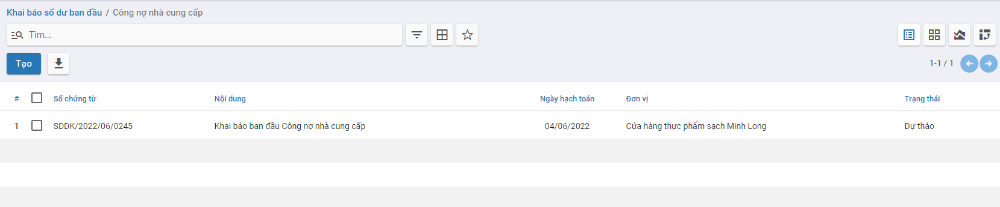

**Bước 2**: Nhấn nút  để khai báo thông tin

- **Màn hình khai báo Công nợ khách hàng**

  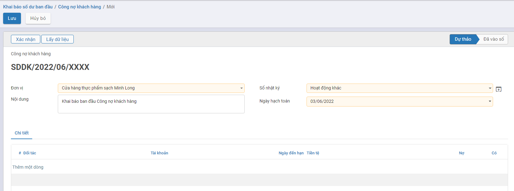

- **Màn hình khai báo Công nợ nhà cung cấp**

  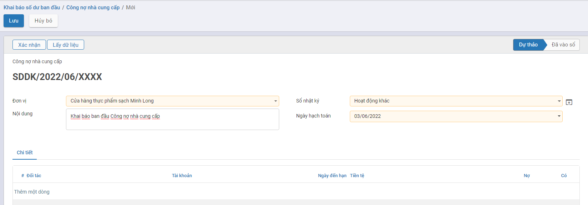

Các trường dữ liệu trên chức năng:

- Ngày hạch toán: Mặc định thông tin Ngày thực hiện tạo, có thể thay đổi được
- Nút **Lấy dữ liệu**: Khi nhấn nút **Lấy dữ liệu** hệ thống sẽ mặc định view các Đối tượng là Khách hàng/Nhà cung cấp đang có theo Đơn vị (đã được khai báo tại Danh mục Khách hàng và Danh mục Nhà cung cấp) lên **tab Chi tiết**
- Thông tin tại Tab Chi tiết: Để người dùng tự động chọn thông tin từng Khách hàng/Nhà cung cấp để Thêm dòng dữ liệu

**Bước 3**: Thực hiện chọn và Nhập thông tin dữ liệu

- Thêm đối tác: Hệ thống tự động hiển thị thông tin Tài khoản phải thu/Phải trả đã được khai báo cho Khách hàng/Nhà cung cấp và thông tin Tiền tệ mặc định đang được sử dụng của Đơn vị. Thông tin **Tài khoản phải thu****/Phải trả** được khai báo tại **Danh mục Khách hàng và Danh mục Nhà cung cấp**: Tab **Lên hóa đơn**
- Nhập thông tin Số tiền: Thực hiện nhập Số dư công nợ của Khách hàng/Nhà cung cấp.
- Ngày đến hạn: Ghi nhận thông tin Ngày đến hạn của từng Công nợ. Nếu không nhập mặc định lấy theo Ngày hạch toán 

**Thông tin tài khoản phải thu/Phải trả**

<u>***Lưu ý:***</u> 

- Thông tin Cột Nợ/Có được hiển thị để nhập giá trị căn cứ vào Thiết lập của từng Tài khoản được cấu hình tại chức năng **'Hệ thống tài khoản'**
  - Tài khoản có tính chất Dư Nợ: Cột Nợ sẽ cho phép nhập giá trị; Cột Có không nhập được giá trị
  - Tài khoản có tính chất Dư Có: Cột Có sẽ cho phép nhập giá trị; Cột Nợ không nhập được giá trị
  - Tài khoản Có tính chất Lưỡng tính: Cả cột Nợ và Có đều cho phép nhập giá trị

**Phần Khai báo tài khoản**

- **Dữ liệu được nhập cho Công nợ khách hàng**

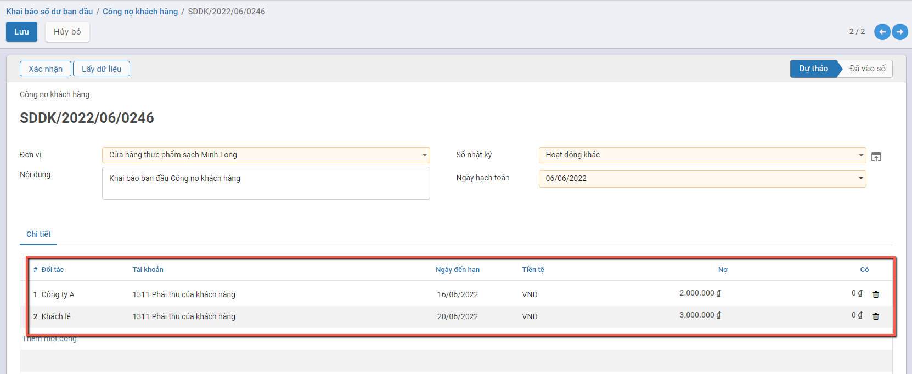

- **Dữ liệu được nhập cho Công nợ nhà cung cấp**

**Bước 4**: Người dùng Nhấn nút **Xác nhận** để ghi nhận thông tin Số dư đầu kỳ theo dữ liệu đã nhập.

Thông tin Dữ liệu đã nhập được vào Sổ và dữ liệu lên bút toán

Muốn xem thông tin Bút toán: Người dùng nhấn nút **'Bút toán'**

#### Công nợ Nhân viên

Hướng dẫn việc khai báo thông tin Công nợ nhân viên

Đối tượng thực hiện: Người dùng phần mềm

**Xem video hướng dẫn**

<iframe
    width="920"
    height="450"
    frameborder="0"
    allow="autoplay; encrypted-media; clipboard-write; gyroscope; picture-in-picture "
    allowfullscreen
    title="Module Tổng hợp - Khai báo số dư ban đầu - Công nợ nhân viên" 
    src="https://www.youtube.com/embed/vg5K_UOxfu4?list=PLcdARb5pnnj8jeyvyhaptnwL3sxxT_QaK"
></iframe>

**Bước 1**: Vào phân hệ **Tổng hợp**: Chọn tính năng tương ứng cần khai báo Số dư đầu kỳ: Chọn Công nợ nhân viên

Thông tin màn hình của: **Công nợ nhân viên**

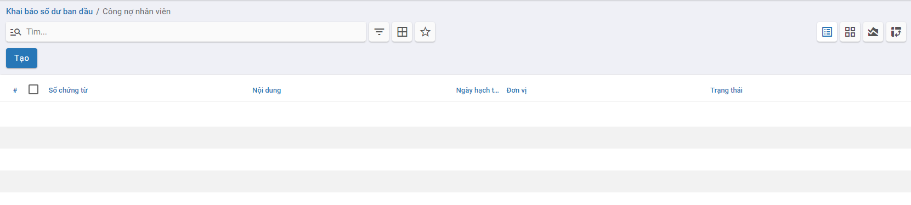

**Bước 2**: Nhấn nút  để khai báo thông tin

- **Màn hình khai báo Công nợ nhân viên**

Các trường dữ liệu trên chức năng:

- Ngày hạch toán: Mặc định thông tin Ngày thực hiện tạo, có thể thay đổi được
- Nút **Lấy dữ liệu**: Khi nhấn nút **Lấy dữ liệu** hệ thống sẽ mặc định view các Đối tượng là **Nhân viên** đang có theo Đơn vị (đã được khai báo tại Danh mục Nhân viên) lên **tab Chi tiết**
- Thông tin tại Tab Chi tiết: Để người dùng tự động chọn thông tin từng Nhân viên để Thêm dòng dữ liệu

**Bước 3**: Thực hiện chọn và Nhập thông tin dữ liệu

- Thêm đối tác: Hệ thống tự động hiển thị thông tin Tài khoản tương ứng là 1318 - Các khoản nợ phải thu khác. Người dùng có thể chọn lại thông tin Tài khoản khác.
- Nhập thông tin Số tiền: Thực hiện nhập Số dư công nợ của nhân viên.
- Ngày đến hạn: Ghi nhận thông tin Ngày đến hạn của từng Công nợ. Nếu không nhập mặc định lấy theo Ngày hạch toán 

<u>***Lưu ý:***</u> 

- Thông tin Cột Nợ/Có được hiển thị để nhập giá trị căn cứ vào Thiết lập của từng Tài khoản được cấu hình tại chức năng **'Hệ thống tài khoản'**
  - Tài khoản có tính chất Dư Nợ: Cột Nợ sẽ cho phép nhập giá trị; Cột Có không nhập được giá trị
  - Tài khoản có tính chất Dư Có: Cột Có sẽ cho phép nhập giá trị; Cột Nợ không nhập được giá trị
  - Tài khoản Có tính chất Lưỡng tính: Cả cột Nợ và Có đều cho phép nhập giá trị

**Phần Khai báo tài khoản**

- **Dữ liệu được nhập cho Công nợ Nhân viên**

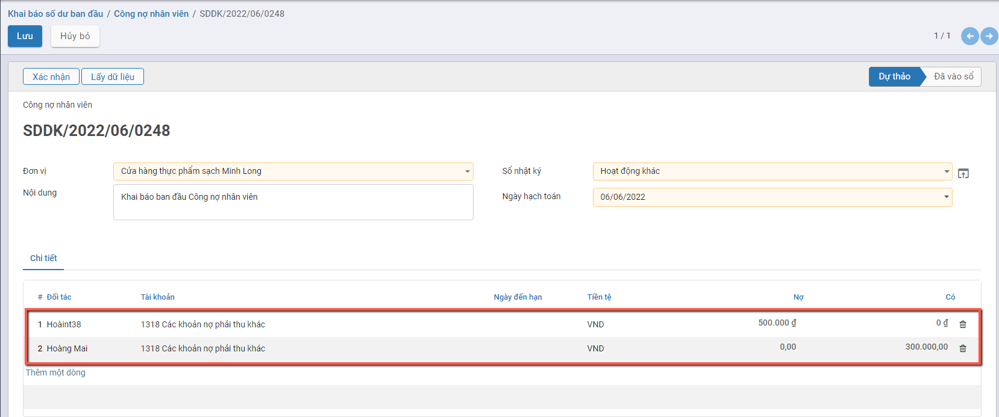

**Bước 4**: Người dùng Nhấn nút **Xác nhận** để ghi nhận thông tin Số dư đầu kỳ theo dữ liệu đã nhập.

Thông tin Dữ liệu đã nhập được vào Sổ và dữ liệu lên bút toán

Muốn xem thông tin Bút toán: Người dùng nhấn nút **'Bút toán'**

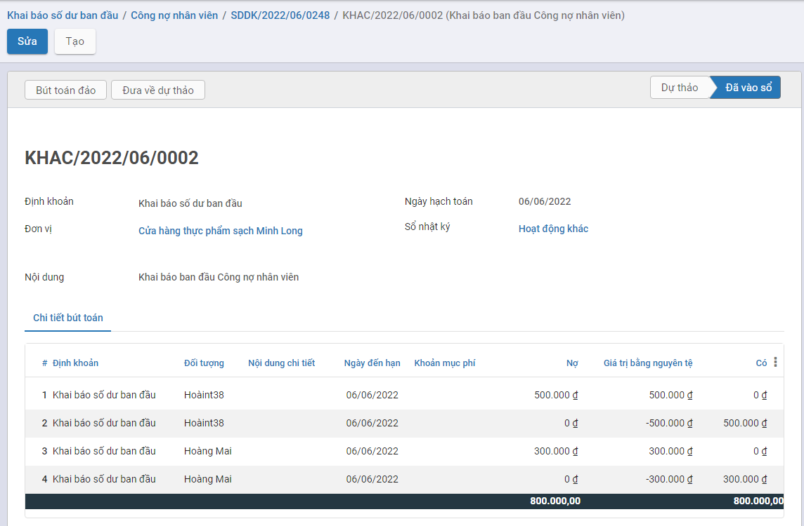

## *Nhập tồn kho vật tư, hàng hóa*

### Mô tả nghiệp vụ

Mục Tồn kho vật tư, hàng hóa cho phép người dùng quản lý tồn kho đầu kỳ của vật tư, hàng hóa của hộ kinh doanh theo từng kho

**Quy trình nghiệp vụ**

### **Xem video hướng dẫn**

<iframe
    width="920"
    height="450"
    frameborder="0"
    allow="autoplay; encrypted-media; clipboard-write; gyroscope; picture-in-picture "
    allowfullscreen
    title="Tồn kho vật tư, hàng hóa" 
    src="https://www.youtube.com/embed/GHKWU2ad0F4?list=PLcdARb5pnnj8jeyvyhaptnwL3sxxT_QaK"
></iframe>

### Hướng dẫn trên phần mềm

**Lưu ý:** Trước khi nhập tồn kho đầu kỳ cần khai báo: **Danh mục kho** và **Danh mục vật tư, hàng hóa** sử dụng tại đơn vị

**Bước 1**: Vào phân hệ **Tổng hợp**, Chọn **Tổng hợp**, Chọn **Khai báo số dư ban đầu**.

 Nhấn **Tồn kho vật tư, hàng hóa** trên quy trình

 Nhấn **Tạo**, Thực hiện khai báo thông tin Tab chung:

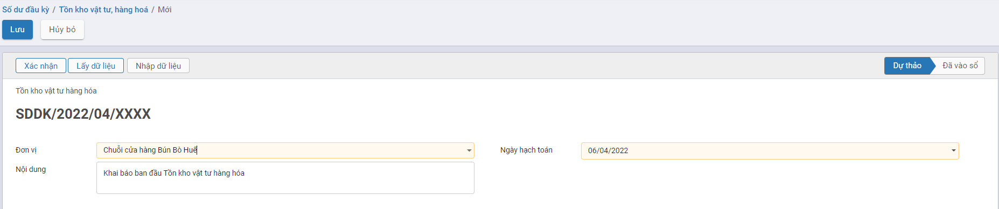

- **Đơn vị** : Chọn văn phòng, địa điểm kinh doanh của doanh nghiệp. Lưu ý: Một đơn vị chỉ được phép có một bản ghi tồn vật tư, hàng hóa
- **Ngày hạch toán**: Chọn ngày ghi nhận dư tồn vật tư hàng hóa đầu kỳ

**Bước 2**: Khai báo vật tư, hàng hóa tồn kho

#### **Cách 1:Nhập trực tiếp trên phần mềm**

Tại Tab **Số dư đầu kỳ**, Nhấn **Thêm một dòng**

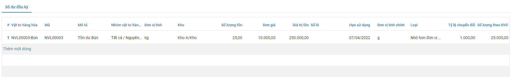

- **Vật tư hàng hóa**: Chọn vật tư hàng hóa còn tồn
- **Đơn vị tính**: Chọn đơn vị tính vật tư hàng hóa
- **Kho**: Chọn Kho thuộc đơn vị đang sử dụng
- **Số lượng tồn**: Nhập số lượng còn tồn của vật tư, hàng hóa
- **Giá trị tồn**: Nhập giá trị tiền của vật tư,hàng hóa còn tồn
- **Số lô**: Nhập số lô nhập của vật tư hàng hóa, nếu để trống hệ thống tự sinh
- **Hạn sử dụng**: Nhập hạn sử dụng của vật tư, hàng hóa còn tồn. 
- **Đơn giá**: Sau khi nhập số lượng tồn, giá trị tồn và lưu lại, đơn giá tự động tính= **Giá trị tồn/số lượng** 
- **Đơn vị tính chính**: Đơn vị tính được lấy tại danh mục hàng hóa
- **Tỷ lệ chuyển đổi**: Tỷ lệ quy đổi từ đơn vị tính sang đơn vị tính chính
- **Số lượng theo đơn vị tính chính**: = số lượng tồn * tỷ lệ chuyển đổi

Nhấn **Lưu** để lưu lại thông tin vào phần mềm

#### **Cách 2: Nhấn Chi tiết tồn kho**

Người dùng nhấn nút **Chi tiết tồn kho** để mở tab chi tiết

Sau khi mở thông tin chi tiết, người dùng nhấn **Tạo** để thực hiện nhập thêm mới từng dòng vật tư, hàng hóa còn tồn hoặc sửa lại trực tiếp thông tin đang sai xót và nhấn **Lưu**

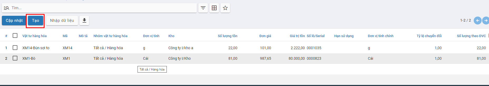

#### **Cách 3: Nhấn Lấy dữ liệu**

Trường hợp nếu toàn bộ hàng hóa đang có đều có tồn đầu kỳ, người dùng có thể nhấn nút **Lấy dữ liệu** ở tab **Thông tin chung** nằm tạo nhanh dữ liệu tab chi tiết. Sau khi nhấn nút này, tương ứng với mỗi hàng hóa, phần mềm  sẽ  tạo một dòng thông tin vật tư hàng hóa tại tab **Chi tiết** với số lượng tồn = 1, giá trị tồn = 0.

#### Cách 4: Nhập từ excel

Nhấn **Nhập dữ liệu**

Nhấn **Tải về mẫu dữ liệu** để thực hiện tải file mẫu excel để nhập thông tin

Thực hiện nhập thông tin tại file excel,nhấn Lưu file excel sau khi nhập thông tin vật tư hàng hóa tồn đầu kỳ tại file.

- **Mã hàng hóa**: Bắt buộc nhập, nhập mã nội bộ của vật tư,hàng hóa có tồn đầu kỳ
- **Mã kho**: Bắt buộc nhập, nhập địa điểm kho theo cú pháp Địa điểm cha/Tên địa điểm
- **Đơn vị tính**: Bắt buộc nhập,nhập Đơn vị tính của vật tư, hàng hóa
- **Số lượng tồn**: Bắt buộc nhập, nhập số lượng còn tồn của vật tư, hàng hóa, cần nhập số lượng > 0
- **Giá trị tồn**: Bắt buộc nhập, nhập giá trị tiền của vật tư,hàng hóa còn tồn, cần nhập giá trị > 0
- **Số lô**: Nhập số lô nhập của vật tư hàng hóa, nếu để trống hệ thống tự sinh
- **Hạn sử dụng**: Nhập hạn sử dụng của vật tư, hàng hóa còn tồn theo định dạng dd-mm-yyyy

Nhấn **Tải lên tập tin của bạn** ,chọn file excel vừa nhập vật tư, hàng hóa tồn đầu kỳ

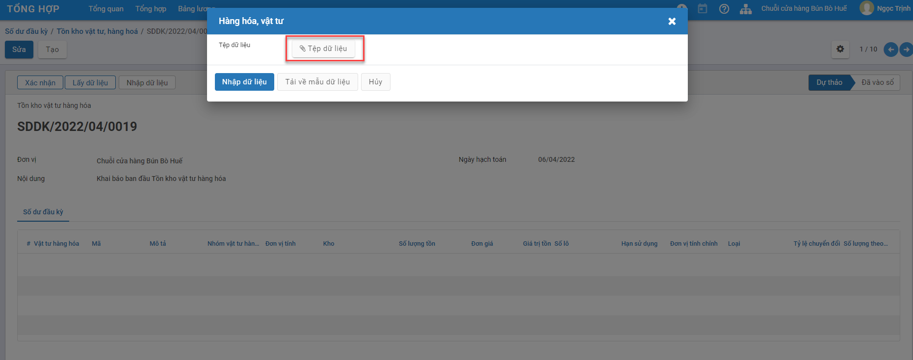

Nhấn **Nhập dữ liệu** để thực hiện nhập thông tin vật tư, hàng hóa tồn đầu kỳ từ file excel. Nếu dữ liệu lỗi, phần mềm sẽ trả lại kết quả lỗi cụ thể. Nếu dữ liệu hợp lệ, hệ thống sẽ thông báo thành công. Tương ứng với mỗi một dòng trên file excel sẽ sinh tương ứng một bản ghi tại tab chi tiết

**Bước 3**: Sau khi khai báo tồn kho vật tư, hàng hóa, nhấn **Xác nhận** để hoàn thành phiếu đầu kỳ 

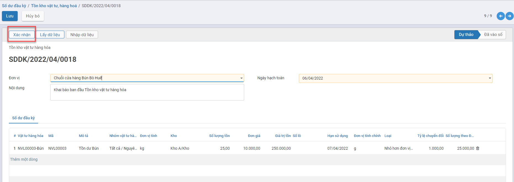

và sinh **Phiếu nhập kho** tương ứng ở trạng thái đã ghi sổ,  ghi nhận số lượng, giá trị tồn kho vào số dư đầu kỳ của kho.  Nhấn nút **Phiếu nhập kho** tại góc phải của chức năng số dư đầu kỳ để kiểm tra chứng từ nhập kho và bút toán ghi nhận tổng giá trị tồn kho theo từng vật tư,hàng hóa của từng kho

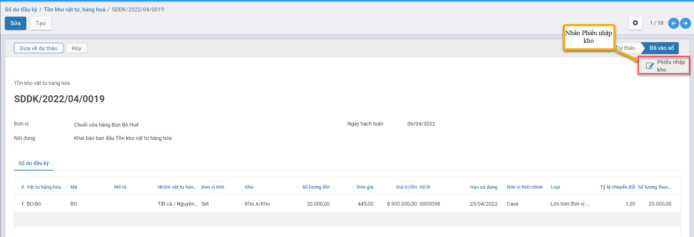

Chứng từ **Phiếu nhập kho** gắn với Phần khai báo Tồn kho vật tư, hàng hóa

Sau khi hoàn thành bản ghi số dư đầu kỳ, nếu phát hiện có sai xót thì người dùng có thể nhấn **Đưa về dự thảo** để đưa bản ghi về trạng thái nháp

Để chỉnh sửa lại thông tin tồn đầu kỳ vật tư, hàng hóa,nhấn **Sửa** để thực hiện sửa thông tin tồn đầu kỳ vật tư, hàng hóa. Nhấn **Cập nhật** để lưu lại dữ liệu, đưa chứng từ về trạng thái ghi sổ và cập nhật lại thông tin  vào chứng từ **Phiếu nhập kho**.

**Lưu ý:** 

- Không được sửa lại hàng hóa, kho sang một hàng hóa,kho khác khi đã tồn tại ít nhất một phiếu xuất kho có gắn với hàng hóa, kho đã sử dụng ở tồn đầu kỳ
- Không được sửa số lượng tồn nhỏ hơn số lượng đã xuất kho theo hàng hóa, kho đang sử dụng ở tồn đầu kỳ

## *Khóa sổ kỳ kế toán*

### Mô tả nghiệp vụ

**Nghiệp vụ**

Cuối tháng hoặc sang những Ngày đầu tháng của tháng tiếp theo, kế toán đơn vị sẽ khai báo thông tin Khóa sổ kỳ kế toán để chốt sổ kế toán theo tháng.

Sau khi Ngày khóa sổ được Khai báo: Trên toàn bộ hệ thống sẽ **không Vào sổ/Hoặc Đưa về Nháp** với các chứng từ có **Ngày hạch toán Nhỏ hơn hoặc Bằng Ngày khóa sổ**

(Đóng băng kỳ Kế toán)

### **Xem video hướng dẫn**

<iframe
    width="920"
    height="450"
    frameborder="0"
    allow="autoplay; encrypted-media; clipboard-write; gyroscope; picture-in-picture "
    allowfullscreen
    title="Module Tổng hợp - Khóa sổ kỳ kế toán" 
    src="https://www.youtube.com/embed/stQXpxY7kMg?list=PLcdARb5pnnj8jeyvyhaptnwL3sxxT_QaK"
></iframe>

### **Hướng dẫn trên phần mềm**

Đối tượng thực hiện: Người dùng phần mềm

**Bước 1**: Vào phân hệ **Tổng hợp**: Chọn **Tổng hợp**: Chọn chức năng **Khóa sổ kỳ kế toán**

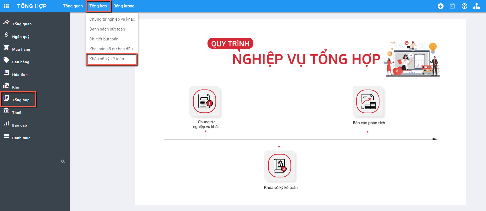

**Bước 2**: Hệ thống hiển thị thông tin màn hình chức năng:

Các trường dữ liệu trên chức năng:

- Ngày khóa sổ: là thông tin Ngày thực hiện Nhập vào để chốt ngày khóa sổ
- Danh sách Đơn vị: Hiển thị mặc định thông tin Đơn vị mà User Người thực hiện đang được phân quyền. Trường hợp trước đó đã khai báo thông tin Khóa sổ cho 1 kỳ kế toán nào đó, thông tin Ngày khóa sổ sẽ hiển thị Kỳ khóa sổ gần nhất với thời điểm khai báo

**Bước 3**: Nhấn nút **Sửa** để thông tin Ngày khóa sổ được view và nhập dữ liệu

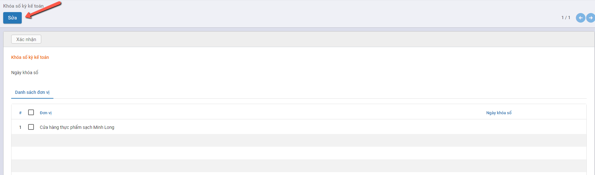

**Bước 4:** Thực hiện Nhập thông tin Ngày khóa sổ cho Kỳ kế toán và Đơn vị áp dụng

- Nhập Ngày khóa sổ
- Tích chọn Đơn vị áp dụng Ngày khóa sổ theo giá trị đã nhập

**Bước 5:** Nhấn nút **Xác nhận** để hoàn thành việc khai báo

- **Trường hợp vẫn tồn tại các chứng từ có Ngày hạch toán Nhỏ hơn hoặc Bằng Ngày khóa sổ đang có Trạng thái Dự thảo/Nháp**: hệ thống sẽ báo  thông tin Số lượng Chứng từ cần hoàn thành vào Sổ trước khi áp dụng Ngày khóa sổ

==> Nhấn nút **'Đồng ý'**: Hệ thống tự động view đủ các Chứng từ chưa vào sổ để Người dùng xử lý dữ liệu: Vào sổ hoặc Xóa bỏ dữ liệu (nếu kiểm tra là dữ liệu thừa)

- Trường hợp **KHÔNG** tồn tại các chứng từ có Ngày hạch toán Nhỏ hơn hoặc Bằng Ngày khóa sổ đang có Trạng thái Dự thảo/Nháp: Hệ thống sẽ thực hiện Ghi nhận thông tin Ngày khóa Sổ đã nhập

