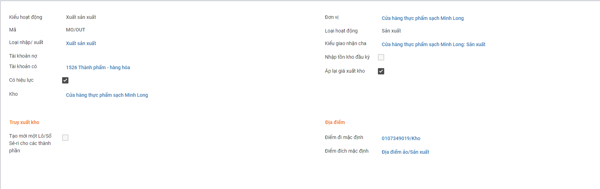
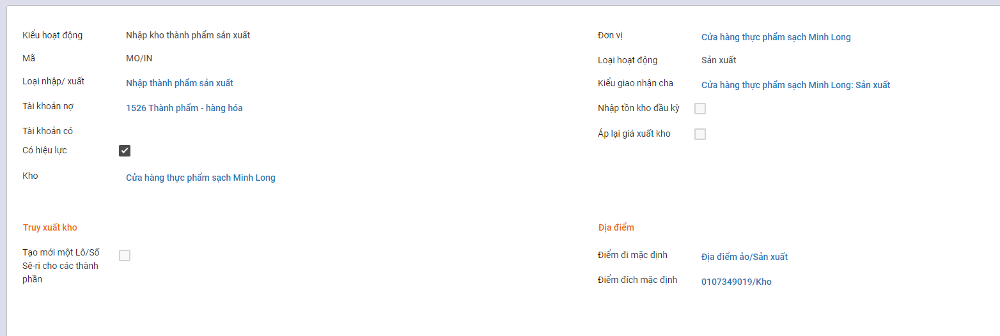
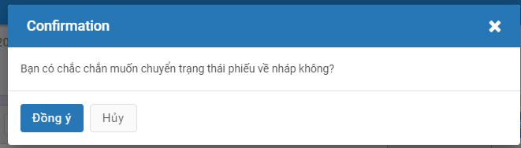
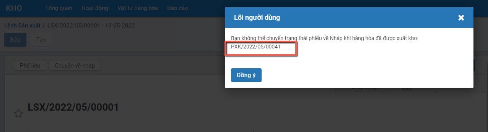
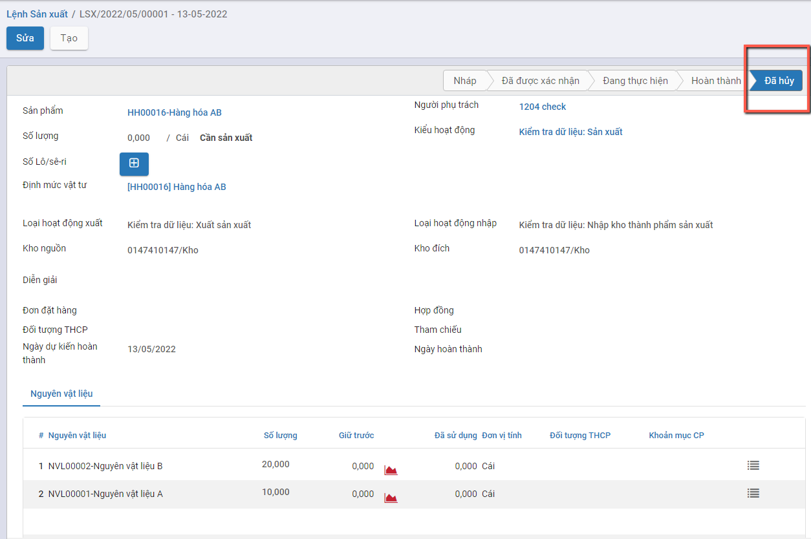

# *Quy trình nghiệp vụ*

Kế toán kho chịu trách nhiệm chính  trong việc lập hóa đơn chứng từ và theo dõi chi tiết hàng hóa trong kho, bao gồm cả tình hình hàng nhập – xuất – tồn; đối chiếu các hóa đơn, chứng từ sổ sách với số liệu thực tế khi kiểm kê, giúp hạn chế tối đa những rủi ro, thất thoát cho doanh nghiệp.

Kế toán kho thực hiện quản lý tình hình nhập, xuất, tồn kho theo chủng loại, nhóm, chi tiết vật tư, hàng hóa, thành phẩm. Ngoài ra còn quản lý chi tiết đến từng kho, hỗ trợ tự động xuất kho theo cách thức xuất kho Nhập trước xuất trước (FIFO),  Nhập sau xuất trước (LIFO) , thực hiện hỗ trợ tự động tính giá xuất kho theo 4 phương pháp: Bình quân tức thời, Bình quân cuối kỳ, Đích danh, Nhập trước xuât trước  và lên các báo cáo kho: Tồn kho, Nhập xuất tồn kho.

**Các luồng quy trình**

·     Lập lệnh sản xuất từ nguyên liệu ra thành phẩm. Chi tiết nghiệp vụ **[tại đây](#lap-lenh-san-xuat)**

·     Lập phiếu nhập kho hàng hóa, thành phẩm. Chi tiết nghiệp vụ **[tại đây](#lap-phieu-nhap-kho)**

·     Lập phiếu xuất kho hàng hóa, thành phẩm. Chi tiết nghiệp vụ **[tại đây](#lap-phieu-xuat-kho)**

·     Kiểm kê kho . Chi tiết nghiệp vụ **[tại đây](#kiem-ke-hang-ton-kho)**

·     Tính giá xuất kho. Chi tiết nghiệp vụ **[tại đây](#tinh-gia-xuat-kho)**

## *Lập lệnh sản xuất*

### Mô tả nghiệp vụ

Căn cứ vào đơn đặt hàng bán, người sử dụng thực hiện lập lệnh sản xuất theo số lượng thành phẩm đã được duyệt tại đơn đặt hàng bán

Đồng thời xác định nguyên liệu cần để sản xuất ra số lượng thành phẩm theo lệnh sản xuất

**Xem video hướng dẫn**

<iframe
    width="920"
    height="450"
    frameborder="0"
    allow="autoplay; encrypted-media; clipboard-write; gyroscope; picture-in-picture "
    allowfullscreen
    title="Lệnh sản xuất" 
    src="https://www.youtube.com/embed/SFO9JQs7cTk?list=PLcdARb5pnnj8jeyvyhaptnwL3sxxT_QaK"
></iframe>

### Lập lệnh sản xuất

Đối tượng thực hiện: Người sử dụng phần mềm

Bước 1: Vào phân hệ **Kho vận**, Chọn nhóm **Hoạt động** , chọn chức năng **Lệnh sản xuất** 

Hoặc thực hiện **Tìm kiếm** trực tiếp chức năng trên ô tìm kiếm chung của hệ thống

Bước 2: Người dùng nhập các thông tin trên tab chung

- **Kiểu hoạt động**: Chọn kiểu hoạt động sản xuất

- **Sản phẩm**: Lấy thông tin hàng hóa có chọn lựa sản xuất

  

- **Định mức vật tư**: Thực hiện chọn định mức vật tư

  Trường hợp Thành phẩm cần sản xuất chưa có Định mức NVL thì cần tạo định mức trước: Vào phân hệ **Kho Vận** chọn chức năng **Định mức nguyên vật liệu (BOM)**, điền các thông tin về Thành phẩm cần sản xuất, NVL cần thiết để tạo ra số lượng Thành phẩm nhất định.

​	Trường hợp Thành phẩm cần sản xuất đã có Định mức NVL: Khi nhập Số lượng và Định mức NVL thì hệ thống sẽ tự động đẩy dữ liệu xuống tab **Nguyên vật liệu** như hình:

Bước 3: Người dùng thực hiện lần lượt các thao tác nhấn **Xác nhận** để hoàn thành phiếu

 Nhấn **Kiểm tra tính khả dụng** (kiểm tra trong kho còn đủ NVL để sản xuất không), **Đánh dấu hoàn tất**. 

Như vậy Lệnh sản xuất đã được **Hoàn thành**.

**Lưu ý:** 

- Sau khi Lệnh sản xuất hoàn thành hệ thống tự động sinh Phiếu nhập kho (thành phẩm) và Phiếu xuất kho (NVL).

  

- Cấu hình **Kiểu hoạt động** dùng cho sản xuất:

  - **Loại hoạt động**: Sản xuất
  - **Địa điểm đích mặc định, Địa điểm đi mặc định**: Kho của đơn vị

  

- Cấu hình **Loại hoạt động xuất**:

  - Trường **Loại nhập xuất**: Chọn Xuất sản xuất
  - **Địa điểm đi mặc định**: Kho ccủa đơn vị
  - **Địa điểm đích mặc định**: Kho ảo sản xuất

- Cấu hình **Loại hoạt động nhập**:
  - Trường **Loại xuất/nhập**: Chọn Nhập thành phẩm sản xuất
  - **Điểm đi mặc định**: Kho ảo sản xuất
  - **ĐIểm đích mặc định**: Kho của đơn vị

### Chuyển về nháp hoặc Hủy Lệnh sản xuất

Trường hợp Người dùng phát hiện thông tin Lệnh sản xuất bị lập sai (Sai thông tin Sản phẩm, sai thông tin số lượng...) trong khi Lệnh sản xuất đã được Hoàn thành (Tức đã lên tạo ra Phiếu xuất kho và Phiếu nhập kho tương ứng): Khi đó người dùng sử dụng tính năng **Chuyển về nháp** để đưa thông tin Lệnh sản xuất về trạng thái Dự thảo trước khi thực hiện Hủy phiếu

Đối tượng thực hiện: Người dùng hệ thống

**Điều kiện bắt buộc để 'Chuyển về nháp' Lệnh sản xuất thành công:**

- Lệnh sản xuất chưa có phát sinh Luồng Phế liệu
- Sản phẩm thuộc Phiếu nhập kho được tạo ra từ Lệnh sản xuất: Chưa thuộc bất cứ một Lệnh xuất kho nào

**Bước 1**: Vào phân hệ **Kho vận**, Chọn nhóm **Hoạt động** , chọn chức năng **Lệnh sản xuất** (Hoặc thực hiện **Tìm kiếm** trực tiếp chức năng trên ô tìm kiếm chung của hệ thống)

**Bước 2**: Người dùng nhấn nút **'Chuyển về nháp'**

Khi đó hệ thống hiển thị thông báo xác nhận Chuyển Lệnh sản xuất về nháp

- **Trường hợp: Đã tồn tại Phiếu xuất kho** có Sản phẩm là sản phẩm nằm trong Danh sách các mặt hàng đang có của Phiếu nhập kho được tạo ra từ Lệnh sản xuất, khi nhấn 'Đồng ý' trên thông báo xác nhận hệ thống sẽ đưa ra thông báo lỗi
  - Để Tiếp tục luồng Chuyển về nháp Lệnh sản xuất: Người dùng vào thông tin Phiếu xuất kho theo thông báo lỗi tại màn hình 'Phiếu xuất kho': Thực hiện đưa Phiếu xuất về Dự thảo/Hủy (Theo hướng dẫn tại mục **Chuyển về nháp hoặc Hủy Phiếu xuất kho**)

- **Trường hợp: Lệnh sản xuất Đã tồn tại Phiếu xuất kho của phế liệu**: khi nhấn 'Đồng ý' trên thông báo xác nhận hệ thống sẽ đưa ra thông báo lỗi

- Khi đó Để Tiếp tục luồng Chuyển về nháp của Lệnh sản xuất: Người dùng vào tìm kiếm Phiếu xuất kho theo thông báo lỗi tại **màn hình 'Phiếu xuất kho':** Thực hiện Chuyển về nháp/Hủy Phiếu xuất kho này (Phần thực hiện Chuyển về nháp của Phiếu xuất kho xem mô tả tại mục **Chuyển về nháp hoặc Hủy Phiếu xuất kho**)

- **Trường hợp:** Không tồn tại Phiếu xuất các sản phẩm thuộc Phiếu nhập và Không tồn tại Lệnh sản xuất của Luồng Phế liệu, sau khi Nhấn nút 'Đồng ý' hệ thống thực hiện **Chuyển về nháp Lệnh sản xuất thành công. Khi đó:**
  - Hệ thống Hủy bỏ Phiếu nhập kho của Lệnh sản xuất: Tức không ghi nhận bút toán và Tồn kho Hàng hóa
  - Hủy bỏ Phiếu xuất kho các Nguyên vật liệu: Tức không ghi nhận bút toán của Phiếu xuất và Trả lại Hàng tồn cho Nguyên vật liệu
  - Chuyển Lệnh sản xuất về trạng thái **Nháp**

**Bước 3:** Nhấn nút **Hủy** để hoàn thành việc Hủy chứng từ Lệnh sản xuất

## *Lập phiếu nhập kho*

### Mô tả nghiệp vụ

Khi phát sinh các nghiệp vụ cần nhập mua mới từ nhà cung ứng, Nhập thành phẩm sản xuất, Nhập hàng bán bị trả lại hoặc Nhập kho nội bộ: người dùng thực hiện tại chức năng Lập phiếu nhập kho

**Xem video hướng dẫn**

<iframe
    width="920"
    height="450"
    frameborder="0"
    allow="autoplay; encrypted-media; clipboard-write; gyroscope; picture-in-picture "
    allowfullscreen
    title="Lập phiếu nhập kho" 
    src="https://www.youtube.com/embed/Pt3bzpzbYIM"
></iframe>

### Lập phiếu nhập kho

Căn cứ vào đơn mua hàng, hóa đơn mua hàng, phiếu xuất kho bên bán, và thực tế hàng về, Người dùng thực hiện Lập phiếu nhập kho (vật tư) tương ứng

Đối tượng thực hiện: Người dùng hệ thống

**Bước 1**: Vào phân hệ **Kho vận**, Chọn nhóm **Hoạt động** , chọn chức năng **Phiếu nhập kho** (Hoặc thực hiện **Tìm kiếm** trực tiếp chức năng trên ô tìm kiếm chung của hệ thống)

**Bước 2**: Người dùng nhập các thông tin ở tab chung. 

Lưu ý: Trường **Loại nhập** khi lựa chọn thì phải có Địa điểm đích mặc định chính là kho cần nhập hàng hóa, thành phẩm và được tự động đẩy xuống trường **Kho nhập** (Ở tab chung và tab VTHH). Tùy các trường hợp nhập kho khác nhau mà chọn Loại nhập và có Kho nhập khác nhau. Cụ thể:

- Nhập kho mua hàng hóa, vật tư
- Nhập kho hàng bán bị trả lại

**Bước 3**: Nhập thông tin vật tư, hàng hóa dùng nhập kho

- Trường hợp nhập kho mua hàng hóa, vật tư theo đơn hàng. Người dùng có thể tích vào trường **Chọn đơn mua hàng** (Có thể chọn cùng lúc nhiều đơn mua hàng) hệ thống sẽ tự động đẩy thông tin xuống tab **Vật tư hàng hóa (VTHH)** như hình dưới:

- Trường hợp khác, người dùng tự nhập tay các thông tin ở Tab VTHH.

**Bước 4**: Người dùng thao tác nhấn **Lưu**, nhấn **Đánh dấu cần làm:**

- Thực hiện nhập kho theo Nhu cầu thực tế.

- Nếu Số lượng nhập kho (Hoàn thành) đủ theo nhu cầu: Thực hiện nhấn **Xác nhận**.

- Nếu Số lượng nhập kho Chưa đủ theo Số lượng nhu cầu: Thực hiện nhập số lượng theo thực tế. Khi đó có 2 hướng thực hiện :

  - Nếu chọn **Tạo phần dở dang**: Với Số lượng còn thiếu, hệ thống tạo sẵn 1 chứng từ Phiếu nhập kho, để Khi nhập kho với Số lượng còn lại, bộ phận Kho tiếp tục vào Phiếu nhập kho (đã tạo phần dở dang) để thực hiện Xác nhận Số lượng nhập kho còn lại.
  - Nếu chọn **Không tạo phần dở dang**: Khi đó hệ thống Tách Số lượng nhu cầu ban đầu Bằng đúng Số lượng thực nhận, còn Số lượng chênh chưa nhận được thì Số lượng hoàn thành = 0

  Như vậy **Phiếu nhập kho** đã **Hoàn thành** .

 Đồng thời sinh bút toán ở tab **Hạch toán**.

### Chuyển về nháp hoặc Hủy Phiếu nhập kho

Trường hợp Người dùng phát hiện thông tin Phiếu nhập kho bị sai  (Dữ liệu sai này có thể xuất phát từ Đơn mua hàng, hoặc Từ chính Phiếu nhập kho) trong khi Phiếu Nhập kho đã được Hoàn thành (Tức đã lên Sổ và hàng đã xác nhận về kho): Khi đó người dùng sử dụng tính năng **Chuyển về nháp** để đưa thông tin Phiếu nhập kho về trạng thái Dự thảo trước khi thực hiện Hủy phiếu

Đối tượng thực hiện: Người dùng hệ thống

**Điều kiện bắt buộc để 'Chuyển về nháp' Phiếu nhập kho thành công:**

- Sản phẩm thuộc Phiếu nhập kho chưa được Xuất kho: **Tức chưa thuộc trong 1 Phiếu xuất kho nào**
- Chứng từ mua hàng được tạo ra cùng với Đơn mua của Phiếu nhập kho: Chưa được 'Vào sổ', **tức đang thuộc trạng thái 'Dự thảo'**

*<u>**Lưu ý:**</u>* Sau khi Chuyển về nháp/Hủy một Phiếu nhập kho: Với sản phẩm đã có 1 hoặc nhiều giao dịch Nhập/xuất trước đó thì Người dùng nên có thao tác chạy lại chức năng **'Tính lại giá xuất kho'** để phần thông tin 'Giá vốn' cho các phiếu xuất sau đó lên đúng và khớp giá trị

**Bước 1**: Vào phân hệ **Kho vận**, Chọn nhóm **Hoạt động** , chọn chức năng **Phiếu nhập kho** (Hoặc thực hiện **Tìm kiếm** trực tiếp chức năng trên ô tìm kiếm chung của hệ thống; Hoặc mở thông tin **Phiếu nhập kho** từ phần Đơn mua hàng của Phiếu nhập)

**Bước 2**: Người dùng nhấn nút **'Chuyển về nháp'**

Khi đó hệ thống hiển thị thông báo xác nhận Chuyển Phiếu nhập kho về nháp

- **Trường hợp**: **Chứng từ mua hàng** được tạo ra từ Đơn mua của Phiếu nhập kho đã **Vào sổ** khi nhấn 'Đồng ý' hệ thống sẽ báo lỗi
  - Để Tiếp tục luồng Chuyển về nháp Phiếu nhập kho: Người dùng vào thông tin Chứng từ mua hàng theo thông báo lỗi tại màn hình 'Chứng từ mua hàng': Thực hiện 'Đưa về dự thảo' thông tin Chứng từ mua

- **Trường hợp: Đã tồn tại Phiếu xuất kho** nằm trong Danh sách các mặt hàng đang có của Phiếu nhập kho, khi nhấn 'Đồng ý' trên thông báo xác nhận hệ thống sẽ đưa ra thông báo lỗi

- Để Tiếp tục luồng Chuyển về nháp Phiếu nhập kho: Người dùng vào tìm kiếm Phiếu xuất kho theo thông báo lỗi tại **màn hình 'Phiếu xuất kho':** Thực hiện Chuyển về nháp Phiếu xuất kho này (Phần thực hiện Chuyển về nháp của Phiếu xuất kho xem mô tả tại mục **Chuyển về nháp hoặc Hủy Phiếu xuất kho**)

- **Trường hợp:** Không tồn tại Chứng từ mua hàng chưa Vào sổ hoặc Phiếu xuất kho có gắn sản phẩm của Phiếu nhập kho, sau khi Nhấn nút 'Đồng ý' hệ thống thực hiện **Chuyển về nháp phiếu xuất kho thành công. Khi đó:**
  - Hệ thống Hủy bỏ các bút toán của Phiếu nhập kho
  - Không ghi nhận tồn kho số lượng của Sản phẩm của phiếu
  - Chuyển Phiếu nhập kho về trạng thái Nháp

**Bước 3:** Nhấn nút **Hủy** để hoàn thành việc Hủy chứng từ Phiếu nhập kho

**<u>*Lưu ý:*</u>** Nếu sau bước Chuyển về nháp Phiếu nhập kho, người dùng muốn Hủy cả Đơn mua hàng: Tại màn hình Đơn mua hàng nhấn nút Hủy và Xác nhận

**Kết quả:** Hệ thống thực hiện **<u>Hủy Đơn mua hàng</u>**, **<u>Hủy Phiếu nhập kho</u>** và <u>**Hủy cả Chứng từ mua hàng**</u> (nếu có và đang ở trạng thái Dự thảo)

## *Lập phiếu xuất kho*

### Mô tả nghiệp vụ

Khi phát sinh nghiệp vụ xuất nguyên vật liệu dùng cho sản xuất, bán hàng thông thường sẽ phát sinh các hoạt động sau:

- Người dùng lập Phiếu xuất kho
- Căn cứ vào Phiếu xuất kho, Thực hiện xuất kho hàng hoá
- Người dùng ghi sổ kho.

**Xem video hướng dẫn**

<iframe
    width="920"
    height="450"
    frameborder="0"
    allow="autoplay; encrypted-media; clipboard-write; gyroscope; picture-in-picture "
    allowfullscreen
    title="Lâp phiếu xuất kho" 
    src="https://www.youtube.com/embed/G471NXpxOFM"
></iframe>

### Lập phiếu xuất kho

Đối tượng thực hiện: Người dùng hệ thống

**Bước 1**: Vào phân hệ **Kho vận**, Chọn nhóm **Hoạt động** , chọn chức năng **Phiếu xuất kho** (Hoặc thực hiện **Tìm kiếm** trực tiếp chức năng trên ô tìm kiếm chung của hệ thống)

**Bước 2**: Người dùng nhập các thông tin ở tab chung. 

Lưu ý: Lựa chọn **Kiểu giao nhận** có Địa điểm đi mặc định chính là kho cần xuất vật tư, hàng hóa và được tự động đẩy xuống trường **Kho xuất** (ở tab chung và tab VTHH). Tùy các trường hợp xuất kho mà lựa chọn các **Loại nhập** và **Kho xuất** khác nhau. Cụ thể:

- Xuất kho hàng bán
- Xuất kho hàng trả lại hàng hóa cho NCC

**Bước 3**: Nhập thông tin hàng hóa chi tiết để xuất kho

- Trường hợp xuất kho theo đơn hàng bán, người dùng có thể tích vào trường **Chọn đơn hàng bán** (có thể cùng lúc chọn nhiều đơn hàng bán), hệ thống sẽ tự động đẩy thông tin xuống tab **Vật tư hàng hóa (VTHH)** như hình:

- Trường hợp khác, người dùng tự nhập tay các thông tin ở tab VTHH.

**Bước 4**: Người dùng thao tác nhấn **Lưu**, **Đánh dấu cần làm**, **Kiểm tra tính khả dụng** (kiểm tra trong kho có đủ số lượng hàng hóa để xuất không):

- Thực hiện xuất kho theo Nhu cầu thực tế.

- Nếu Số lượng xuất kho (Hoàn thành) đủ theo nhu cầu: Thực hiện nhấn **Xác nhận**.

- Nếu Số lượng xuất kho Chưa đủ theo Số lượng nhu cầu: Thực hiện xuất số lượng theo thực tế. Khi đó có 2 hướng thực hiện :

  - Nếu chọn **Tạo phần dở dang**: Với Số lượng còn thiếu, hệ thống tạo sẵn 1 chứng từ Phiếu xuất kho, để Khi nhập kho với Số lượng còn lại, bộ phận Kho tiếp tục vào Phiếu xuất kho (đã tạo phần dở dang) để thực hiện Xác nhận Số lượng xuất kho còn lại.
  - Nếu chọn **Không tạo phần dở dang**: Khi đó hệ thống Tách Số lượng nhu cầu ban đầu Bằng đúng Số lượng thực xuất, còn Số lượng chênh chưa nhận được thì Số lượng hoàn thành = 0

  Như vậy **Phiếu xuất kho** đã **Hoàn thành** .

 Đồng thời sinh bút toán ở tab **Hạch toán** (tương tự **Phiếu nhập kho**)

### Chuyển về nháp hoặc Hủy Phiếu xuất kho

Trường hợp Người dùng phát hiện thông tin Phiếu xuất kho bị sai  (Dữ liệu sai này có thể xuất phát từ Đơn bán hàng, hoặc Từ chính Phiếu xuất kho) trong khi **Phiếu xuất kho đã được Hoàn thành** (Tức đã lên Sổ và hàng đã xác nhận xuất ra khỏi): Khi đó người dùng sử dụng tính năng **Chuyển về nháp** để đưa thông tin Phiếu xuất kho về trạng thái Dự thảo trước khi thực hiện Hủy phiếu

Đối tượng thực hiện: Người dùng hệ thống

**Điều kiện bắt buộc để 'Chuyển về nháp' Phiếu xuất kho thành công:**

- Chứng từ bán hàng được tạo ra cùng với Đơn bán của Phiếu xuất kho: Chưa được 'Vào sổ', **tức đang thuộc trạng thái 'Dự thảo'**

*<u>**Lưu ý:**</u>* Sau khi Chuyển về nháp/Hủy một Phiếu xuất kho: Với sản phẩm đã có 1 hoặc nhiều giao dịch Nhập/xuất trước đó thì Người dùng nên có thao tác chạy lại chức năng **'Tính lại giá xuất kho'** để phần thông tin 'Giá vốn' cho các phiếu xuất sau đó lên đúng và khớp giá trị

**Bước 1**: Vào phân hệ **Kho vận**, Chọn nhóm **Hoạt động** , chọn chức năng **Phiếu xuất kho** (Hoặc thực hiện **Tìm kiếm** trực tiếp chức năng trên ô tìm kiếm chung của hệ thống; Hoặc mở thông tin **Phiếu xuất kho** từ phần Đơn bán hàng của Phiếu xuất)

**Bước 2**: Người dùng nhấn nút **'Chuyển về nháp'**

Khi đó hệ thống hiển thị thông báo xác nhận Chuyển Phiếu nhập kho về nháp

- **Trường hợp**: **Chứng từ bán hàng** được tạo ra từ Đơn bán của Phiếu Xuất kho đã **Vào sổ** khi nhấn 'Đồng ý' hệ thống sẽ báo lỗi
  - Để Tiếp tục luồng Chuyển về nháp Phiếu xuất kho: Người dùng vào thông tin Chứng từ bán hàng theo thông báo lỗi tại màn hình 'Chứng từ bán hàng': Thực hiện 'Đưa về dự thảo' thông tin Chứng từ bán

- Trường hợp: Không tồn tại Chứng từ bán hàng chưa Vào sổ , sau khi Nhấn nút 'Đồng ý' hệ thống thực hiện Chuyển về nháp phiếu xuất kho thành công. Khi đó:

- - Hệ thống Hủy bỏ các bút toán của Phiếu nhập kho
  - Hoàn trả lại Số lượng tồn kho của Sản phẩm
  - Chuyển Phiếu xuất kho về trạng thái

**Bước 3:** Nhấn nút **Hủy** để hoàn thành việc Hủy chứng từ Phiếu xuất kho

**<u>*Lưu ý:*</u>** Nếu sau bước Chuyển về nháp Phiếu xuất kho, người dùng muốn Hủy cả Đơn bán hàng: Tại màn hình Đơn bán hàng nhấn nút Hủy và Xác nhận

**Kết quả:** Hệ thống thực hiện **<u>Hủy Đơn bán hàng</u>**, **<u>Hủy Phiếu xuất kho</u>** và <u>**Hủy cả Chứng từ bán hàng**</u> (nếu có và đang ở trạng thái Dự thảo)

## *Kiểm kê hàng tồn kho*

### Mô tả nghiệp vụ

Khi có yêu cầu kiểm kê kho,  người dùng sẽ thực hiện:

- Kiểm kê hàng hóa thực tế trong từng kho, đối chiếu số dư thực tế kiểm kê với sổ kế toán kho
- Nếu có chênh lệch thì tiến hành tìm nguyên nhân xử lý
- Căn cứ và quyết định xử lý, người dùng thực hiện lập phiếu nhập kho, hoặc phiếu xuất kho. Đồng thời, hạch toán bút toán chênh lệch thừa, thiếu hàng hóa so với sổ kế toán.

**Xem video hướng dẫn**

<iframe
    width="920"
    height="450"
    frameborder="0"
    allow="autoplay; encrypted-media; clipboard-write; gyroscope; picture-in-picture "
    allowfullscreen
    title="Kiểm kê hàng tồn kho" 
    src="https://www.youtube.com/embed/bifgnNRvgVk"
></iframe>

### Kiểm kê kho

**Bước 1**: Vào phân hệ **Kho vận**, Chọn nhóm **Hoạt động** , chọn chức năng **Kiểm kê kho** (Hoặc thực hiện **Tìm kiếm** trực tiếp chức năng trên ô tìm kiếm chung của hệ thống)

**Bước 2**: Sau khi người dùng nhập các thông tin vào tab chung, nhấn **Bắt đầu kiểm kho**. Người dùng nhập các thông tin ở tab Kiểm kho, điền số lượng đã kiểm đếm được ở cột **Đã đếm**.

- Nhập thông tin thành viên tham gia kiểm đếm ở tab thành viên tham gia.

**Bước 3**: Nhấn **Xác nhận kiểm kho** , khi đó phiếu kiểm kê đã được **Hoàn thành.** Khi đó hệ thống tự động cập nhật kho theo số lượng kiểm đếm.

## *Tính giá xuất kho*

### Mô tả nghiệp vụ

Thực hiện tính và cập nhật giá xuất kho vào các phiếu xuất kho trong kỳ, căn cứ vào phương pháp tính giá xuất kho đã được xác định trên **Kho vận\Cấu hình\Nhóm sản phẩm**

**Xem video hướng dẫn**

<iframe
    width="920"
    height="450"
    frameborder="0"
    allow="autoplay; encrypted-media; clipboard-write; gyroscope; picture-in-picture "
    allowfullscreen
    title="Tính giá xuất kho" 
    src="https://www.youtube.com/embed/waajBhBycv8"
></iframe>

### Tính giá xuất kho

Đối tượng thực hiện: Người dùng hệ thống

**Bước 1**: Vào phân hệ **Kho vận**, Chọn nhóm **Hoạt động** , chọn chức năng **Tính giá xuất kho** (Hoặc thực hiện **Tìm kiếm** trực tiếp chức năng trên ô tìm kiếm chung của hệ thống)

**Bước 2**: Nhập thông tin để tính giá xuất kho: Vật tư hàng hóa cần tính giá, thời gian, kho nhập, kho xuất, kỳ tính giá

Với phương pháp bình quân cuối kỳ: 

·     Tích chọn **Tính theo kho**, giá xuất của vật tư hàng hoá sẽ được tự động tính bình quân trên từng kho.

·     Tích chọn **Tính giá không theo kho**, giá xuất của vật tư hàng hoá sẽ được tự động tính bình quân trên tất cả các kho.

Nhấn **Lưu**

Với phương pháp bình quân tức thời:

·     Tích chọn **Tính theo kho**, giá xuất của vật tư hàng hoá sẽ được tự động tính bình quân tức thời trên từng kho.

·     Tích chọn **Tính giá không theo kho**, giá xuất của vật tư hàng hoá sẽ được tự động tính bình quân tức thời trên tất cả các kho.

Nhấn **Lưu**

Với phương pháp tính giá đích danh:

·     Tích chọn **Tính theo kho**, giá xuất của vật tư hàng hoá sẽ được tự động tính theo phương pháp đích danh trên từng kho.

·     Tích chọn **Tính giá không theo kho**, giá xuất của vật tư hàng hoá sẽ được tự động tính theo phương pháp đích danh trên tất cả các kho.

Nhấn **Lưu**

Với phương pháp tính giá nhập trước xuất trước:

·     Tích chọn **Tính theo kho**, giá xuất của vật tư hàng hoá sẽ được tự động tính theo phương pháp nhập trước xuất trước trên từng kho.

·     Tích chọn **Tính giá không theo kho**, giá xuất của vật tư hàng hoá sẽ được tự động tính theo phương phápnhập trước xuất trước trên tất cả các kho.

Nhấn **Lưu**

Lưu ý: Trường hợp muốn tính giá xuất kho cho một hoặc một số vật tư hàng hoá, thực hiện như sau:

- Tích **Chọn vật tư, hàng hóa** khi thực hiện tính giá xuất kho.
- Nhấn vào biểu tượng : **Chọn**.. (như hình)

- Tích chọn các vật tư hàng hoá cần tính lại giá xuất kho, nhấn **Đồng ý**

Sau khi lưu thành công, hệ thống tự động tính lại đơn giá xuất kho cho các mặt hàng đã chọn. Đơn giá này sẽ được dùng cho các phiếu nhập,xuất sau thời điểm tính giá
