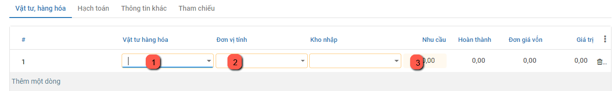
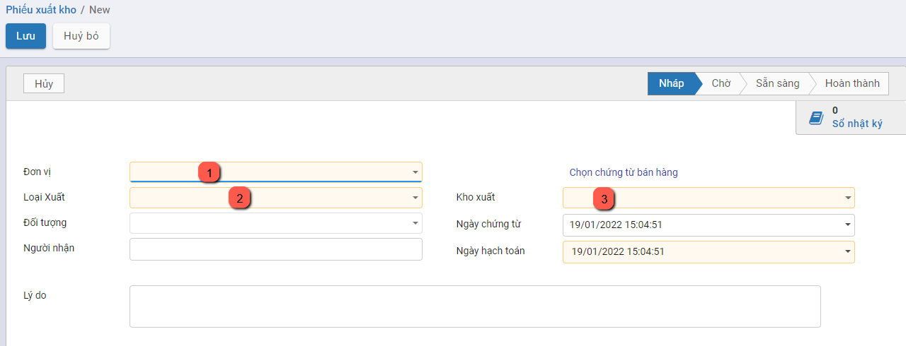

# *Quy trình nghiệp vụ*

Kế toán kho chịu trách nhiệm chính  trong việc lập hóa đơn chứng từ và theo dõi chi tiết hàng hóa trong kho, bao gồm cả tình hình hàng nhập – xuất – tồn; đối chiếu các hóa đơn, chứng từ sổ sách với số liệu thực tế do Thủ kho trình lên, giúp hạn chế tối đa những rủi ro, thất thoát cho doanh nghiệp.

Kế toán kho thực hiện quản lý tình hình nhập, xuất, tồn kho theo chủng loại, nhóm, chi tiết vật tư, hàng hóa, thành phẩm. Ngoài ra có  quản lý chi tiết đến từng kho, hỗ trợ tự động xuất kho theo cách thức xuất kho Nhập trước xuất trước (FIFO),  Nhập sau xuất trước (LIFO) , thực hiện hỗ trợ tự động tính giá xuất kho theo 4 phương pháp: Bình quân tức thời, Bình quân cuối kỳ, Đích danh, Nhập trước xuât trước  và lên các báo cáo kho: Tồn kho, Nhập xuất tồn kho

**Các luồng quy trình**

·     Lập phiếu nhập kho hàng hóa, thành phẩm. Chi tiết nghiệp vụ **[tại đây](#lap-phieu-nhap-kho)**

·     Lập phiếu xuất kho hàng hóa, thành phẩm. Chi tiết nghiệp vụ **[tại đây](#lap-phieu-xuat-kho)**

·     Kiểm kê kho . Chi tiết nghiệp vụ **[tại đây](#kiem-ke-hang-ton-kho)**

·     Tính giá xuất kho. Chi tiết nghiệp vụ **[tại đây](#tinh-gia-xuat-kho)**

## *Lập phiếu nhập kho*

### Mô tả nghiệp vụ

Đối với các đơn vị sản xuất sản phẩm hàng loạt hoặc theo đơn đặt hàng... sau khi sản phẩm hoàn thành thì sẽ chuyển về nhập kho. Khi đó, người dùng sẽ thực hiện các bước sau:

- Căn cứ và phiếu báo số lượng thành phẩm hoàn thành nhập kho của bộ phận sản xuất, thực hiện lập Phiếu nhập kho thành phẩm.
- Căn cứ vào phiếu nhập kho, Thực hiện kiểm tra, nhận hàng và tiến hành nhập kho
- Người dùng ghi sổ kho.

**Xem video hướng dẫn**

<iframe
    width="920"
    height="450"
    frameborder="0"
    allow="autoplay; encrypted-media; clipboard-write; gyroscope; picture-in-picture "
    allowfullscreen
    title="Lập phiếu nhập kho" 
    src="https://www.youtube.com/embed/Pt3bzpzbYIM"
></iframe>

### Lập phiếu nhập kho

Căn cứ vào đơn mua hàng, hóa đơn mua hàng, phiếu xuất kho bên bán, và thực tế hàng về, Người dùng thực hiện Lập phiếu nhập kho (vật tư) tương ứng

Đối tượng thực hiện: Người dùng hệ thống

**Bước 1**: Vào phân hệ **Kho vận**, Chọn nhóm **Hoạt động** , chọn chức năng **Phiếu nhập kho** (Hoặc thực hiện **Tìm kiếm** trực tiếp chức năng trên ô tìm kiếm chung của hệ thống)

**Bước 2**: Người dùng nhập các thông tin ở tab chung. 

Lưu ý: Trường **Loại nhập** khi lựa chọn thì phải có Địa điểm đích mặc định chính là kho cần nhập hàng hóa, thành phẩm và được tự động đẩy xuống trường **Kho nhập** (Ở tab chung và tab VTHH). Tùy các trường hợp nhập kho khác nhau mà chọn Loại nhập và có Kho nhập khác nhau. Cụ thể:

- Nhập kho mua hàng hóa, vật tư
- Nhập kho hàng bán bị trả lại

**Bước 3**: Nhập thông tin vật tư, hàng hóa dùng nhập kho

- Trường hợp nhập kho mua hàng hóa, vật tư theo đơn hàng. Người dùng có thể tích vào trường **Chọn đơn mua hàng** (Có thể chọn cùng lúc nhiều đơn mua hàng) hệ thống sẽ tự động đẩy thông tin xuống tab **Vật tư hàng hóa (VTHH)** như hình dưới:

- Trường hợp khác, người dùng tự nhập tay các thông tin ở Tab VTHH.

**Bước 4**: Người dùng thao tác nhấn **Lưu**, nhấn **Đánh dấu cần làm:**

- Thực hiện nhập kho theo Nhu cầu thực tế.

- Nếu Số lượng nhập kho (Hoàn thành) đủ theo nhu cầu: Thực hiện nhấn **Xác nhận**.

- Nếu Số lượng nhập kho Chưa đủ theo Số lượng nhu cầu: Thực hiện nhập số lượng theo thực tế. Khi đó có 2 hướng thực hiện :

  - Nếu chọn **Tạo phần dở dang**: Với Số lượng còn thiếu, hệ thống tạo sẵn 1 chứng từ Phiếu nhập kho, để Khi nhập kho với Số lượng còn lại, bộ phận Kho tiếp tục vào Phiếu nhập kho (đã tạo phần dở dang) để thực hiện Xác nhận Số lượng nhập kho còn lại.
  - Nếu chọn **Không tạo phần dở dang**: Khi đó hệ thống Tách Số lượng nhu cầu ban đầu Bằng đúng Số lượng thực nhận, còn Số lượng chênh chưa nhận được thì Số lượng hoàn thành = 0

  Như vậy **Phiếu nhập kho** đã **Hoàn thành** .

 Đồng thời sinh bút toán ở tab **Hạch toán**.

## *Lập phiếu xuất kho*

### Mô tả nghiệp vụ

Khi phát sinh nghiệp vụ xuất nguyên vật liệu dùng cho sản xuất, thông thường sẽ phát sinh các hoạt động sau:

- Người dùng lập Phiếu xuất kho
- Căn cứ vào Phiếu xuất kho, Thực hiện xuất kho hàng hoá
- Người dùng ghi sổ kho.

**Xem video hướng dẫn**

<iframe
    width="920"
    height="450"
    frameborder="0"
    allow="autoplay; encrypted-media; clipboard-write; gyroscope; picture-in-picture "
    allowfullscreen
    title="Lâp phiếu xuất kho" 
    src="https://www.youtube.com/embed/G471NXpxOFM"
></iframe>

### Lập phiếu xuất kho

Đối tượng thực hiện: Người dùng hệ thống

**Bước 1**: Vào phân hệ **Kho vận**, Chọn nhóm **Hoạt động** , chọn chức năng **Phiếu xuất kho** (Hoặc thực hiện **Tìm kiếm** trực tiếp chức năng trên ô tìm kiếm chung của hệ thống)

**Bước 2**: Người dùng nhập các thông tin ở tab chung. 

Lưu ý: Lựa chọn **Kiểu giao nhận** có Địa điểm đi mặc định chính là kho cần xuất vật tư, hàng hóa và được tự động đẩy xuống trường **Kho xuất** (ở tab chung và tab VTHH). Tùy các trường hợp xuất kho mà lựa chọn các **Loại nhập** và **Kho xuất** khác nhau. Cụ thể:

- Xuất kho hàng bán
- Xuất kho hàng trả lại hàng hóa cho NCC

**Bước 3**: Nhập thông tin hàng hóa chi tiết để xuất kho

- Trường hợp xuất kho theo đơn hàng bán, người dùng có thể tích vào trường **Chọn đơn hàng bán** (có thể cùng lúc chọn nhiều đơn hàng bán), hệ thống sẽ tự động đẩy thông tin xuống tab **Vật tư hàng hóa (VTHH)** như hình:

- Trường hợp khác, người dùng tự nhập tay các thông tin ở tab VTHH.

**Bước 4**: Người dùng thao tác nhấn **Lưu**, **Đánh dấu cần làm**, **Kiểm tra tính khả dụng** (kiểm tra trong kho có đủ số lượng hàng hóa để xuất không):

- Thực hiện xuất kho theo Nhu cầu thực tế.

- Nếu Số lượng xuất kho (Hoàn thành) đủ theo nhu cầu: Thực hiện nhấn **Xác nhận**.

- Nếu Số lượng xuất kho Chưa đủ theo Số lượng nhu cầu: Thực hiện xuất số lượng theo thực tế. Khi đó có 2 hướng thực hiện :

  - Nếu chọn **Tạo phần dở dang**: Với Số lượng còn thiếu, hệ thống tạo sẵn 1 chứng từ Phiếu xuất kho, để Khi nhập kho với Số lượng còn lại, bộ phận Kho tiếp tục vào Phiếu xuất kho (đã tạo phần dở dang) để thực hiện Xác nhận Số lượng xuất kho còn lại.
  - Nếu chọn **Không tạo phần dở dang**: Khi đó hệ thống Tách Số lượng nhu cầu ban đầu Bằng đúng Số lượng thực xuất, còn Số lượng chênh chưa nhận được thì Số lượng hoàn thành = 0

  Như vậy **Phiếu xuất kho** đã **Hoàn thành** .

 Đồng thời sinh bút toán ở tab **Hạch toán** (tương tự **Phiếu nhập kho**)

## *Kiểm kê hàng tồn kho*

### Mô tả nghiệp vụ

Khi có yêu cầu kiểm kê kho,  người dùng sẽ thực hiện:

- Kiểm kê hàng hóa thực tế trong từng kho, đối chiếu số dư thực tế kiểm kê với sổ kế toán kho
- Nếu có chênh lệch thì tiến hành tìm nguyên nhân xử lý
- Căn cứ và quyết định xử lý, Kế toán kho thực hiện lập phiếu nhập kho, hoặc phiếu xuất kho. Đồng thời, hạch toán bút toán chênh lệch thừa, thiếu hàng hóa so với sổ kế toán.
- Trường hợp tìm được nguyên nhân và yêu cầu bồi thường thì hạch toán phải thu hoặc phải trả cho đối tượng phải bồi thường. Trường hợp chưa tìm được nguyên nhân thì hạch toán vào tài sản thừa chờ xử lý hoặc tài sản thiếu chờ xử lý 

**Xem video hướng dẫn**

<iframe
    width="920"
    height="450"
    frameborder="0"
    allow="autoplay; encrypted-media; clipboard-write; gyroscope; picture-in-picture "
    allowfullscreen
    title="Kiểm kê hàng tồn kho" 
    src="https://www.youtube.com/embed/bifgnNRvgVk"
></iframe>

### Kiểm kê kho

**Bước 1**: Vào phân hệ **Kho vận**, Chọn nhóm **Hoạt động** , chọn chức năng **Kiểm kê kho** (Hoặc thực hiện **Tìm kiếm** trực tiếp chức năng trên ô tìm kiếm chung của hệ thống)

**Bước 2**: Sau khi người dùng nhập các thông tin vào tab chung, nhấn **Bắt đầu kiểm kho**. Người dùng nhập các thông tin ở tab Kiểm kho, điền số lượng đã kiểm đếm được ở cột **Đã đếm**.

- Nhập thông tin thành viên tham gia kiểm đếm ở tab thành viên tham gia.

**Bước 3**: Nhấn **Xác nhận kiểm kho** , khi đó phiếu kiểm kê đã được **Hoàn thành.** Khi đó hệ thống tự động cập nhật kho theo số lượng kiểm đếm.

## *Tính giá xuất kho*

### Mô tả nghiệp vụ

Thực hiện tính và cập nhật giá xuất kho vào các phiếu xuất kho trong kỳ, căn cứ vào phương pháp tính giá xuất kho đã được xác định trên **Kho vận\Cấu hình\Nhóm sản phẩm**

**Xem video hướng dẫn**

<iframe
    width="920"
    height="450"
    frameborder="0"
    allow="autoplay; encrypted-media; clipboard-write; gyroscope; picture-in-picture "
    allowfullscreen
    title="Tính giá xuất kho" 
    src="https://www.youtube.com/embed/waajBhBycv8"
></iframe>

### Tính giá xuất kho

Đối tượng thực hiện: Người dùng hệ thống

**Bước 1**: Vào phân hệ **Kho vận**, Chọn nhóm **Hoạt động** , chọn chức năng **Tính giá xuất kho** (Hoặc thực hiện **Tìm kiếm** trực tiếp chức năng trên ô tìm kiếm chung của hệ thống)

**Bước 2**: Nhập thông tin để tính giá xuất kho: Vật tư hàng hóa cần tính giá, thời gian, kho nhập, kho xuất, kỳ tính giá

Với phương pháp bình quân cuối kỳ: 

·     Tích chọn **Tính theo kho**, giá xuất của vật tư hàng hoá sẽ được tự động tính bình quân trên từng kho.

·     Tích chọn **Tính giá không theo kho**, giá xuất của vật tư hàng hoá sẽ được tự động tính bình quân trên tất cả các kho.

Nhấn **Lưu**

Với phương pháp bình quân tức thời:

·     Tích chọn **Tính theo kho**, giá xuất của vật tư hàng hoá sẽ được tự động tính bình quân tức thời trên từng kho.

·     Tích chọn **Tính giá không theo kho**, giá xuất của vật tư hàng hoá sẽ được tự động tính bình quân tức thời trên tất cả các kho.

Nhấn **Lưu**

Với phương pháp tính giá đích danh:

·     Tích chọn **Tính theo kho**, giá xuất của vật tư hàng hoá sẽ được tự động tính theo phương pháp đích danh trên từng kho.

·     Tích chọn **Tính giá không theo kho**, giá xuất của vật tư hàng hoá sẽ được tự động tính theo phương pháp đích danh trên tất cả các kho.

Nhấn **Lưu**

Với phương pháp tính giá nhập trước xuất trước:

·     Tích chọn **Tính theo kho**, giá xuất của vật tư hàng hoá sẽ được tự động tính theo phương pháp nhập trước xuất trước trên từng kho.

·     Tích chọn **Tính giá không theo kho**, giá xuất của vật tư hàng hoá sẽ được tự động tính theo phương phápnhập trước xuất trước trên tất cả các kho.

Nhấn **Lưu**

Lưu ý: Trường hợp muốn tính giá xuất kho cho một hoặc một số vật tư hàng hoá, thực hiện như sau:

- Tích **Chọn vật tư, hàng hóa** khi thực hiện tính giá xuất kho.
- Nhấn vào biểu tượng : Chọn.. (như hình)

- Tích chọn các vật tư hàng hoá cần tính lại giá xuất kho, nhấn **Đồng ý**
