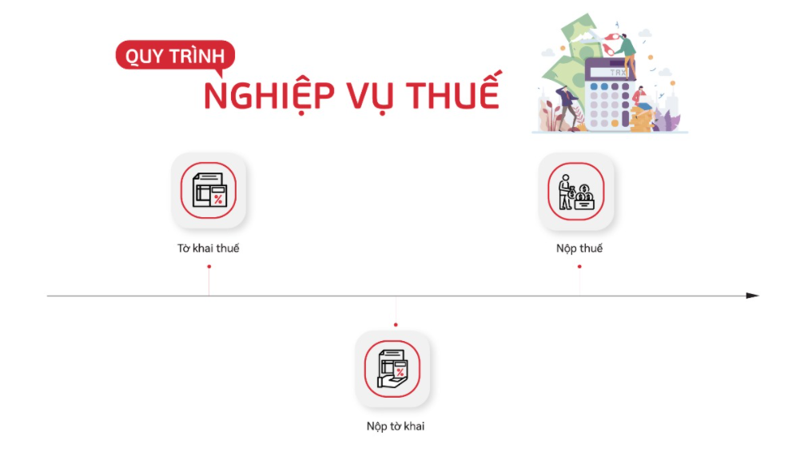
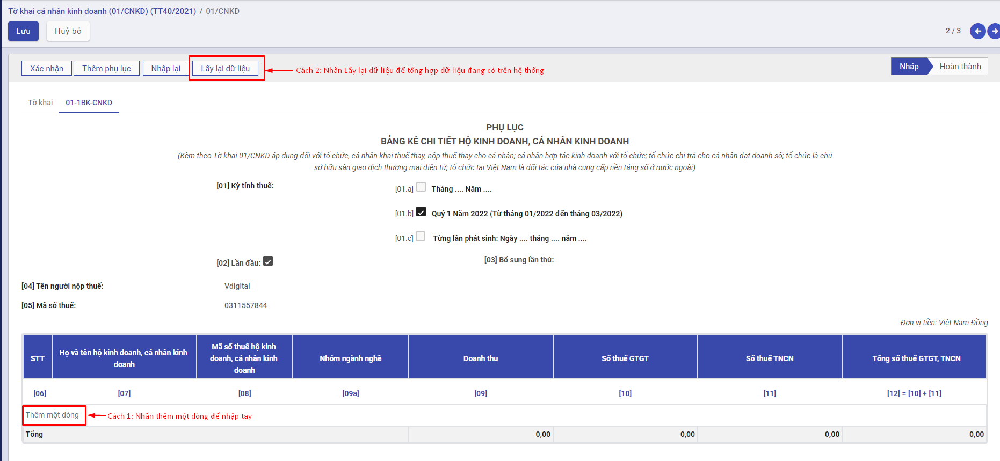
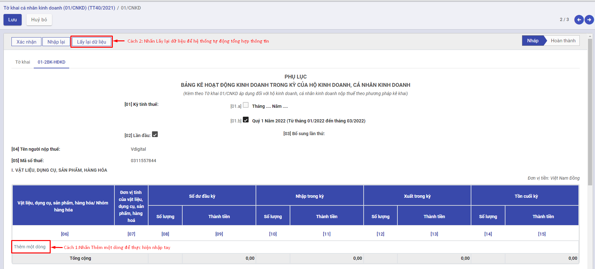

# Quy trình nghiệp vụ

Mục Thuế cho phép người dùng thực hiện kê khai thuế CNKD theo mẫu của Tổng cục thuế

Người dùng được sử dụng để  :

- Thiết lập cơ quan thuế, đại lý thuế
- Lập tờ khai thuế

Quy trình nghiệp vụ

**Các luồng quy trình**

·     Thiết lập cơ quan thuế, đại lý thuế. Chi tiết nghiệp vụ **[Thiết lập cơ quan thuế, đại lý thuế](#thiet-lap-co-quan-thueai-ly-thue)**

·     Lập tờ khai thuế. Chi tiết nghiệp vụ **[Tờ khai cá nhân kinh doanh (01/CNKD) (TT40/2021)](#to-khai-ca-nhan-kinh-doanh-01CNKD)**

## Thiết lập cơ quan thuế, đại lý thuế

### Mô tả nghiệp vụ

Giúp thiết lập các thông tin như thông tin đại lý thuế để in lên báo cáo thuế trong trường hợp đơn vị thuê đại lý thuế kê khai thuế; thông tin đơn vị cung cấp dịch vụ kế toán để in lên báo cáo tài chính trong trường hợp đơn vị thuê đơn vị cung cấp dịch vụ kế toán lập báo cáo tài chính; thông tin cơ quan thuế phục vụ cho việc in báo cáo thuế từ phần mềm và nộp cho cơ quan thuế qua phần mềm HTKK.

### Xem video hướng dẫn

### Hướng dẫn trên phần mềm

Bước 1: Vào phân hệ **Thuế**, Chọn **Danh mục**, Chọn **Thiết lập cơ quan thuế, đại lý thuế** (Hoặc thực hiện **Tìm kiếm** trực tiếp chức năng trên ô tìm kiếm chung của hệ thống), Nhấn **Tạo**

Bước 2: Khai báo các thông tin của **Thiết lập cơ quan thuế, đại lý thuế**

- Tại **Cơ quan thuế**: Khai báo thông tin quan thuế cấp cục và cơ quan thuế quản lý.

* Trường hợp thuê đại lý thuế kê khai thuế. Tại tab **Đại lý thuế:**
  - Khai báo thông tin của đại lý thuế.

Bước 3: Nhấn **Lưu**

## Tờ khai cá nhân kinh doanh (01/CNKD) (TT40/2021)

### Mô tả nghiệp vụ

Tờ khai cá nhân kinh doanh là văn bản theo mẫu do Bộ tài chính quy định được người nộp thuế sử dụng để kê khai các thông tin nhằm xác định số thuế phải nộp.Tờ khai thuế đối với cá nhân kinh doanh được sử dụng theo **Mẫu 01/CNKD** ban hành kèm theo[ Thông tư 40/2021/TT-BTC](https://download.vn/thong-tu-40-2021-tt-btc-50840) của Bộ Tài chính hướng dẫn về thuế GTGT, thuế TNCN và quản lý thuế đối với hộ kinh doanh, cá nhân kinh doanh.

### Xem video hướng dẫn

### Hướng dẫn trên phần mềm

#### Tờ khai thuế

Bước 1: Vào phân hệ **Thuế**, Chọn **Tờ khai cá nhân kinh doanh (01/CNKD) (TT40/2021)**, Nhấn **Tạo**

Bước 2: Tại **Chọn kỳ tính thuế** thực hiện nhập dữ liệu đầu vào của tờ khai thuế

Đối với hộ kinh doanh, cá nhân kinh doanh nộp thuế theo phương pháp khoán thì chọn loại kê khai là *Tờ khai năm* và chọn năm kê khai

Đối với hộ kinh doanh, cá nhân kinh doanh nộp thuế theo phương pháp kê khai hoặc tổ chức, cá nhân khai thuế thay, nộp thuế thay khai thuế theo tháng hoặc quý thì chọn loại *Tờ khai tháng* hoặc *Tờ khai quý*

Đối với hộ kinh doanh, cá nhân kinh doanh nộp thuế theo từng lần phát sinh thì chọn loại kê khai là *Tờ khai lần phát sinh*

Bước 3: Nhấn **Đồng ý** để tạo tờ khai

Bước 4: Tại Tab tờ khai Nhấn **Sửa** để thực hiện nhập thông tin tờ khai

Thực hiện nhập các thông tin còn thiếu

1. Tích chọn phương pháp kê khai đúng với hình thức của hộ kinh doanh

2. Chỉ tiêu [01] Kỳ tính thuế: Hệ thống tự động hiển thị thông tin theo loại tờ khai người dùng chọn
3. Chỉ tiêu [02] Lần đầu: Nếu khai thuế lần đầu thì hệ thống tự động đánh dấu “x” vào ô vuông.
4. Chỉ tiêu [03] Bổ sung lần thứ: Nếu khai sau lần đầu thì được xác định là khai bổ sung và đánh số lần khai bổ sung vào ô vuông.
5. Chỉ tiêu [04] Người nộp thuế: Mặc định tên của cá nhân đại diện nhóm kinh doanh trên Giấy chứng nhận đăng ký kinh doanh.
6. Chỉ tiêu [05] Tên cửa hàng/thương hiệu: Tên cửa hàng cần nộp thuế
7. Chỉ tiêu [06]  Tài khoản ngân hàng: Số tài khoản ngân hàng
8. Chỉ tiêu [07] Mã số thuế: Ghi rõ ràng, đầy đủ mã số thuế của cá nhân kinh doanh theo Giấy chứng nhận đăng ký thuế hoặc Thông báo mã số thuế hoặc Thẻ mã số thuế do cơ quan thuế cấp.
9. Chỉ tiêu [08] Ngành nghề kinh doanh: Chọn ngành nghề kinh doanh đã đăng ký với cơ quan thuế
10. Chỉ tiêu [08a] Thay đổi thông tin:  Chọn lựa nếu như thông tin có sự thay đổi so với đăng ký
11. Chỉ tiêu [09] Diện tích kinh doanh: Tổng diện tích (m2) cá nhân sử dụng cho mục đích sản xuất kinh doanh.
12. Chỉ tiêu [09a] Đi thuê: Nếu địa điểm sử dụng cho sản xuất kinh doanh là đi thuê thì cá nhân kinh doanh đánh dấu “x” vào ô vuông.
13. Chỉ tiêu [10] Số lượng lao động sử dụng thường xuyên: Ghi số lượng lao động cá nhân kinh doanh sử dụng thường xuyên tại cơ sở.
14. Chỉ tiêu [11] Thời gian hoạt động trong ngày: Cá nhân ghi thời gian “từ giờ” là thời gian bắt đầu kinh doanh và “đến giờ” là giờ kết thúc kinh doanh trong ngày.
15. Chỉ tiêu [12] Địa chỉ kinh doanh: Chọn đầy đủ địa chỉ trụ sở kinh doanh của cá nhân theo Giấy chứng nhận đăng ký kinh doanh  tại [12a],[12b],[12c],[12d],[12e]
16. Chỉ tiêu [12] Địa chỉ cư trú: Chọn đầy đủ địa chỉ nơi cư trú của hộ cá thể tại 13a],[13b],[13c],[13d]
17. Chỉ tiêu [14], [15], [16] Điện thoại, fax, email: Ghi rõ ràng, đầy đủ số điện thoại, số fax, địa chỉ email của cá nhân (nếu chỉ tiêu nào không có thì bỏ trống).
18. Chỉ tiêu [17] Văn bản uỷ quyền: Trường hợp cá nhân uỷ quyền khai thuế cho tổ chức, cá nhân khác thì phải ghi rõ ràng, đầy đủ số văn bản, ngày văn bản và tên của tổ chức, cá nhân được uỷ quyền trên Văn bản uỷ quyền.
19. Chỉ tiêu [19] Tên đại lý thuế: Trường hợp cá nhân uỷ quyền khai thuế cho Đại lý thuế thì phải ghi rõ ràng, đầy đủ tên của Đại lý thuế theo Quyết định thành lập hoặc Giấy chứng nhận đăng ký kinh doanh của Đại lý thuế.
20. Chỉ tiêu [20] Mã số thuế đại lý: mã số thuế của Đại lý thuế theo Giấy chứng nhận đăng ký thuế hoặc Thông báo mã số thuế hoặc thẻ mã số thuế do cơ quan thuế cấp.
21. Chỉ tiêu [21] Hợp đồng đại lý thuế: Số, ngày của Hợp đồng đại lý thuế đang thực hiện giữa cá nhân với Đại lý thuế.
22. Chỉ tiêu [22] Tên tổ chức khai thay: Ghi rõ ràng, đầy đủ tên của tổ chức khai thay theo Quyết định thành lập hoặc Giấy chứng nhận đăng ký kinh doanh trong trường hợp cá nhân kinh doanh theo hình thức hợp tác kinh doanh ủy quyền cho tổ chức khai, nộp thuế thay cho cá nhân.
23. Chỉ tiêu [23] Mã số thuế: Ghi rõ ràng, đầy đủ mã số thuế của tổ chức khai thay theo Giấy chứng nhận đăng ký thuế hoặc Thông báo mã số thuế do cơ quan thuế cấp.
24. Chỉ tiêu [24] Địa chỉ: Ghi rõ ràng, đầy đủ địa chỉ trụ sở của tổ chức khai thay theo Giấy chứng nhận đăng ký kinh doanh.
25. Chỉ tiêu [25], [26], [27] Điện thoại, fax, email: Ghi rõ ràng, đầy đủ số điện thoại, số fax, địa chỉ email của tổ chức khai thay.

**Mục A. KÊ KHAI THUẾ GIÁ TRỊ GIA TĂNG (GTGT), THUẾ THU NHẬP CÁ NHÂN (TNCN)**

1. Chỉ tiêu [28a]: Ghi doanh thu [tính thuế GTGT](https://kiemtoancalico.com/thue-gia-tri-gia-tang/phuong-phap-tinh-thue-gtgt) trung bình dự kiến 1 tháng của nhóm ngành nghề phân phối, cung cấp hàng hoá trong năm.
2. Chỉ tiêu [29a]: Ghi doanh thu [tính thuế GTGT](https://kiemtoancalico.com/thue-gia-tri-gia-tang/phuong-phap-tinh-thue-gtgt) trung bình dự kiến 1 tháng của nhóm ngành nghề dịch vụ, xây dựng không bao thầu nguyên vật liệu trong năm.
3. Chỉ tiêu [30a]: Ghi doanh thu tính thuế GTGT trung bình dự kiến 1 tháng của nhóm ngành nghề sản xuất, vận tải, dịch vụ có gắn với hàng hoá, xây dựng có bao thầu nguyên vật liệu trong năm.
4. Chỉ tiêu [31a]: Ghi doanh thu tính thuế GTGT trung bình dự kiến 1 tháng của nhóm ngành nghề hoạt động sản xuất khác trong năm.

Trường hợp tổ chức khai thay cho cá nhân hợp tác kinh doanh: ghi doanh thu tính thuế GTGT trung bình dư kiến 1 tháng là tổng doanh thu tính thuế GTGT của các cá nhân hợp tác kinh doanh khai trên Phụ lục 01-1/BK-CNKD đến mức chịu thuế tương ứng với nhóm ngành các cá nhân kinh doanh.

30. Chỉ tiêu [32a]: Ghi tổng cộng doanh thu tính thuế GTGT: [34a] = [30a] + [31a] + [32a] + [33a].

31. Chỉ tiêu [28b], [29b], [30b], [31b]: Ghi số thuế GTGT phát sinh tương ứng theo thuế suất thuế GTGT của từng nhóm ngành nghề. Số thuế phát sinh = Doanh thu x thuế suất.

    Trường hợp tổ chức khai thay cho cá nhân hợp tác kinh doanh: Số thuế phát sinh = Doanh thu x thuế suất tương ứng.

32. Chỉ tiêu [32b]: Ghi tổng cộng số thuế GTGT phát sinh: [32b] = [28b] + [29b] + [30b] + [31b]

    Trường hợp tổ chức khai thay cho cá nhân hợp tác kinh doanh thì chỉ tiêu [32b] = chỉ tiêu [10] Phụ lục 01-1/BK-CNKD .

33. Chỉ tiêu [28c]: Ghi doanh thu [tính thuế TNCN](https://kiemtoancalico.com/thue-thu-nhap-ca-nhan/cach-tinh-thue-tncn) trung bình dự kiến 1 tháng của nhóm ngành nghề phân phối, cung cấp hàng hoá trong năm.

34. Chỉ tiêu [29c]: Ghi doanh thu [tính thuế TNCN](https://kiemtoancalico.com/thue-thu-nhap-ca-nhan/cach-tinh-thue-tncn) trung bình dự kiến 1 tháng của nhóm ngành nghề dịch vụ, xây dựng không bao thầu nguyên vật liệu trong năm.

35. Chỉ tiêu [30c]: Ghi doanh thu tính thuế TNCN trung bình dự kiến 1 tháng của nhóm ngành nghề sản xuất, vận tải, dịch vụ có gắn với hàng hoá, xây dựng có bao thầu nguyên vật liệu trong năm.

36. Chỉ tiêu [31c]: Ghi doanh thu tính thuế TNCN trung bình dự kiến 1 tháng của nhóm ngành nghề hoạt động sản xuất khác trong năm.
    Trường hợp tổ chức khai thay cho cá nhân hợp tác kinh doanh: ghi doanh thu tính thuế TNCN trung bình dư kiến 1 tháng là tổng doanh thu tính thuế TNCN của các cá nhân hợp tác kinh doanh khai trên Phụ lục 01-1/BK-CNKD đến mức chịu thuế tương ứng với nhóm ngành các cá nhân kinh doanh*.*

37. Chỉ tiêu [32c]: Ghi tổng cộng doanh thu tính thuế TNCN: [32c]= [28c] + [29c] + [30c] + [31c]

    Trường hợp tổ chức khai thay cho cá nhân hợp tác kinh doanh: chỉ tiêu [32c] = chỉ tiêu [11] Phụ lục 01-1/BK-CNKD.

38. Chỉ tiêu [28d], [29d], [30d], [31d]: Ghi số thuế TNCN phát sinh tương ứng theo thuế suất thuế TNCN của từng nhóm ngành nghề.

Số thuế phát sinh = Doanh thu x thuế suất.

39. Chỉ tiêu [32d]: [32d] = [28d] + [29d] + [30d] + [31d]
    Trường hợp tổ chức khai thay cho cá nhân hợp tác kinh doanh: chỉ tiêu [32d] = chỉ tiêu [11] Phụ lục 01-1/BK-CNKD.

**Mục B. KÊ KHAI THUẾ TIÊU THỤ ĐẶC BIỆT (TTĐB)**

40. Chỉ tiêu cột (1): STT: Ứng dụng hỗ trợ tự tăng.
41. Chỉ tiêu cột (2): Hàng hoá, dịch vụ chịu thuế tiêu thụ đặc biệt: Hàng hoá, dịch vụ chịu [thuế tiêu thụ đặc biệt](https://kiemtoancalico.com/thue-va-phi-khac/thue-tieu-thu-dac-biet). Chọn từ trong combobox
42. Chỉ tiêu cột (3): Mã chỉ tiêu: Mặc định Mã chỉ tiêu theo hàng hóa đã chọn.
43. Chỉ tiêu cột (4): Đơn vị tính: Mặc định đơn vị tính theo hàng hóa đã chọn.
44. Chỉ tiêu cột (5): Doanh thu tính thuế TTĐB: Ghi doanh thu tính thuế TTĐB trung bình dự kiến 1 tháng trong năm tương ứng với từng loại hàng hoá
45. Chỉ tiêu cột (6): Thuế suất: Ghi thuế suất thuế TTĐB tương ứng với từng loại hàng hoá, dịch vụ chịu thuế TTĐB
46. Chỉ tiêu cột (7): Số thuế phải nộp: Ghi số thuế TTĐB phải nộp tương ứng với từng loại hàng hoá, dịch vụ.

  Cột (7)= cột (5) x cột (6).

**Mục C. KÊ KHAI THUẾ/PHÍ BẢO VỆ MÔI TRƯỜNG HOẶC THUẾ TÀI NGUYÊN**

Với loại **Khai thuế tài nguyên**:

47. Chỉ tiêu cột (1): STT: Ứng dụng hỗ trợ tự tăng.

48. Chỉ tiêu cột (2): Tài nguyên, hàng hóa, sản phẩm: Chọn tên loại chỉ tiêu chọn trong combobox
49. Chỉ tiêu cột (3): Mã chỉ tiêu: Mã chỉ tiêu
50. Chỉ tiêu cột (4): Đơn vị tính. Mặc định đơn vị tính theo mã chỉ tiêu đã chọn
51. Chỉ tiêu cột (5): Sản lượng/ Số lượng: Ghi sản lượng khai thác tài nguyên, khoáng sản trung bình dự kiến 1 tháng trong năm.
52. Chỉ tiêu cột (6): Giá tính thuế tài nguyên/ mức thuế hoặc phí BVMT: Ghi giá tính thuế tài nguyên, khoáng sản tương ứng (cách xác định giá tính thuế tài nguyên, khoáng sản theo quy định của [Luật thuế](https://kiemtoancalico.com/luat-quan-ly-thue) tài nguyên và các văn bản hướng dẫn).
53. Chỉ tiêu cột (7): Thuế suất(%): Ghi thuế suất thuế tài nguyên tương ứng với từng loại tài nguyên, khoáng sản chịu thuế Tài nguyên.
54. Chỉ tiêu cột (8): Số thuế: Ghi số thuế Tài nguyên phải nộp tương ứng với từng loại tài nguyên, khoáng sản.

Cột (8)= cột (5) x cột (6) x cột (7)

Với loại **Khai thuế bảo vệ môi trường**:

55. Chỉ tiêu cột (1): STT: Ứng dụng hỗ trợ tự tăng.

56. Chỉ tiêu cột (2): Tài nguyên, hàng hóa, sản phẩm: Chọn tên loại chỉ tiêu chọn trong combobox

57. Chỉ tiêu cột (3): Mã chỉ tiêu: Mã chỉ tiêu

58. Chỉ tiêu cột (4): Đơn vị tính. Mặc định đơn vị tính theo mã chỉ tiêu đã chọn

59. Chỉ tiêu cột (5): Sản lượng/ Số lượng: Ghi đơn vị tính theo số lượng, trọng lượng, khối lượng của hàng hóa chịu thuế bảo vệ môi trường

60. Chỉ tiêu cột (6): Giá tính thuế tài nguyên/ mức thuế hoặc phí BVMT: Ghi mức thuế BVMT tương ứng với hàng hóa chịu thuế BVMT.

61. Chỉ tiêu cột (7): Thuế suất(%)

62. Chỉ tiêu cột (8): Số thuế: Ghi số thuế BVMT phải nộp tương ứng với từng loại hàng hóa chịu thuế BVMT

Cột (8)= cột (5) x cột (6) x cột (7)

Với loại **Khai phí bảo vệ môi trường**:

63. Chỉ tiêu cột (1): STT: Ứng dụng hỗ trợ tự tăng.

64. Chỉ tiêu cột (2): Tài nguyên, hàng hóa, sản phẩm: Chọn tên loại chỉ tiêu chọn trong combobox

65. Chỉ tiêu cột (3): Mã chỉ tiêu: Mã chỉ tiêu

66. Chỉ tiêu cột (4): Đơn vị tính. Mặc định đơn vị tính theo mã chỉ tiêu đã chọn

67. Chỉ tiêu cột (5): Sản lượng/ Số lượng: Ghi sản lượng khai thác tài nguyên, khoáng sản trung bình dự kiến 1 tháng trong năm

68. Chỉ tiêu cột (6): Giá tính thuế tài nguyên/ mức thuế hoặc phí BVMT: Căn cứ vào mức phí tương ứng của từng loại tài nguyên, khoáng sản khai thác trong kỳ theo quy định tại Quyết định của HĐND tỉnh, TP trực thuộc TW và Luật thuế tài nguyên và các văn bản hướng dẫn.

69. Chỉ tiêu cột (7): Thuế suất(%)

70. Chỉ tiêu cột (8): Số thuế: Ghi tổng cộng số phí BVMT phải nộp của các loại tài nguyên khoáng sản theo từng loại tài nguyên tương ứng.

Cột (8)= cột (5) x cột (6) x cột (7)

**Mục Nhân viên đại lý thuế**

71. Nhập họ tên, người ký, chứng chỉ hành nghề số, ngày ký

Bước 5: Sau khi nhập dữ liệu thành công, nhấn **Xác nhận** để hoàn thành tờ khai thuế

Nếu muốn nhập lại dữ liệu, nhấn **Nhập lại** để xóa hết thông tin đang có và thực hiện nhập lại từ đầu

Bước 6: Khi xác nhận thành công, nhấn **Xuất xml** để xuất file xml và đẩy lên HTKK

Nếu phát hiện sai xót sau khi hoàn thành thì nhấn nút **Đưa về nháp** để hủy hoàn thành và thực hiện sửa lại

#### Phụ lục 01-11BK-CNKD

**Phụ lục Bảng kê cá nhân kinh doanh** được sử dụng trong trường hợp tổ chức khai thay cho cá nhân hợp tác kinh doanh 

Để thêm mới phụ lục, người sử dụng có thể chọn loại **Tổ chức, cá nhân khai thuế thay, nộp thuế thay** tại mục **Tờ khai** hoặc chọn chức năng **Thêm phụ lục** và chọn phụ lục 01-11BK-CNKD

Sau khi thêm được phụ lục, nhấn vào tab phụ lục 01-11BK-CNKD và thực hiện nhập thông tin bằng hai cách:

Cách 1:  Nhấn **Thêm một dòng** để thực hiện nhập tay các thông tin cần kê khai

Cách 2: Nhấn nút **Lấy lại dữ liệu** để hệ thống tự động tổng hợp dữ liệu doanh thu bán hàng đang có theo thời gian tính thuế

1. Các chỉ tiêu  [01], [01.a],[01.b],[01.c],[02],[03],[04],[05] sẽ mặc định thông tin giống với màn hình tờ khai

2. Chỉ tiêu [06]: STT: Ứng dụng hỗ trợ tự tăng.

3. Chỉ tiêu [07]: Họ và tên hộ kinh doanh, cá nhân kinh doanh: Nhập tên hộ kinh doanh hoặc cá nhân kinh doanh cần kê khai thuế

4. Chỉ tiêu [08]: Mã số thuế hộ kinh doanh, cá nhân kinh doanh: Nhập mã số thuế của hộ kinh doanh

5. Chỉ tiêu [09a]: Nhóm ngành nghề: Chọn nhóm ngành nghề

6. Chỉ tiêu [09]: Doanh thu: Nhập doanh thu bán hàng theo từng ngành nghề và từng kỳ

7. Chỉ tiêu [10]: Số thuế GTGT: = Doanh thu x thuế suất tương ứng.

8. Chỉ tiêu [11]: Số thuế TNCN: = Doanh thu x thuế suất tương ứng.

9.  Chỉ tiêu [12]: Tổng số thuế GTGT, TNCN: = [10] + [11]

Nhấn **Lưu** sau khi đã kê khai xong

#### Phụ lục 01-2/BK-HĐKD

**Phụ lục Bảng kê hoạt động kinh doanh** trong kỳ của hộ kinh doanh, cá nhân kinh doanh (áp dụng đối với hộ kinh doanh, cá nhân kinh doanh nộp thuế theo phương pháp kê khai) theo **mẫu số 01-2/BK-HĐKD** ban hành kèm theo Thông tư 40/2021/TT-BTC. 

Trong bảng kê này phải báo cáo về **nhập – xuất – tồn** vật liệu, dụng cụ, sản phẩm, hàng hóa/nhóm hàng hóa trong kỳ; **các khoản chi phí phát sinh** liên quan đến doanh thu kinh doanh trong kỳ để làm căn cứ cho cơ quan thuế quản lý doanh thu kinh doanh trong kỳ theo rủi ro.

Trường hợp hộ kinh doanh, cá nhân kinh doanh nộp thuế theo phương pháp kê khai trong lĩnh vực, ngành nghề **nếu có căn cứ xác định được doanh thu theo xác nhận của cơ quan chức năng** thì không phải thực hiện chế độ kế toán và **không phải nộp** Phụ lục Bảng kê mẫu số 01-2/BK-HĐKD

Để thêm mới phụ lục thì người sử dụng có thể chọn loại **HKD, CNKD nộp thuế theo phương pháp kê khai** hoặc chọn chức năng **Thêm phụ lục** và chọn phụ lục 01-2/BK-HĐKD

Sau khi thêm được phụ lục, nhấn vào tab phụ lục 01-2/BK-HĐKD và thực hiện nhập thông tin bằng hai cách:

Cách 1:  Nhấn **Thêm một dòng** để thực hiện nhập tay các thông tin cần kê khai

Cách 2: Nhấn nút **Lấy lại dữ liệu** để hệ thống tự động tổng hợp dữ liệu doanh thu bán hàng đang có theo thời gian tính thuế

1. Các chỉ tiêu  [01], [01.a],[01.b],[01.c],[02],[03],[04],[05] sẽ mặc định thông tin giống với màn hình tờ khai

2. Chỉ tiêu [06]: Vật liệu, dụng cụ, sản phẩm, hàng hóa/ Nhóm hàng hóa: Nhập tên hàng hóa cần kê khai

3. Chỉ tiêu [07]: Đơn vị tính của vật liệu, dụng cụ, sản phẩm, hàng hoá: Nhập đơn vị tính của hàng hóa cần kê khai

4. Chỉ tiêu [08]: Số dư đầu kỳ- Số lượng: Nhập số lượng tồn đầu kỳ theo từng mặt hàng

5. Chỉ tiêu [09]: Số dư đầu kỳ- Thành tiền: Nhập thành tiền tồn đầu kỳ theo từng mặt hàng

6. Chỉ tiêu [10]: Nhập trong kỳ - Số lượng: Nhập số lượng nhập theo từng mặt hàng trong kỳ kê khai

7. Chỉ tiêu [11]: Nhập trong kỳ - Thành tiền: Nhập thành tiền nhập theo từng mặt hàng trong kỳ kê khai

8. Chỉ tiêu [12]: Xuất trong kỳ - Số lượng: Nhập số lượng xuất theo từng mặt hàng trong kỳ kê khai

9. Chỉ tiêu [13]: Xuất trong kỳ - Thành tiền: Nhập thành tiền xuất theo từng mặt hàng trong kỳ kê khai
10. Chỉ tiêu [14]: Tồn cuối kỳ - Số lượng: = [08]+[10]-[12]
11. Chỉ tiêu [15]: Tồn cuối kỳ - Thành tiền: =[09]+[11]-[13]

12. Chỉ tiêu [24]: Chi phí nhân công: Nhập số tiền phát sinh trong kỳ
13. Chỉ tiêu [25]: Chi phí điện: Nhập số tiền phát sinh trong kỳ
14. Chỉ tiêu [26]: Chi phí nước: Nhập số tiền phát sinh trong kỳ
15. Chỉ tiêu [27]: Chi phí viễn thông: Nhập số tiền phát sinh trong kỳ
16. Chỉ tiêu [28]: Chi phí thuê kho bãi, mặt bằng kinh doanh: Nhập số tiền phát sinh trong kỳ
17. Chỉ tiêu [29]: Chi phí quản lý (chi phí văn phòng phẩm, công cụ, dụng cụ,...): Nhập số tiền phát sinh trong kỳ
18. Chỉ tiêu [30]: Chi phí khác (hội nghị, công tác phí, thanh lý, nhượng bán tài sản cố định, thuê ngoài khác, ...): Nhập số tiền phát sinh trong kỳ
19. Chỉ tiêu [31]: Tổng cộng: =[24]+[25]+[26]+[27]+[28]+[29]+[30]

Nhấn **Lưu** sau khi đã kê khai xong

#### Tờ khai bổ sung

Sau khi đã hoàn thành kê khai thuế theo kỳ, nếu như phát hiện có sai xót hoặc thiếu, thừa thông tin kê khai, người sử dụng có thể thực hiện tạo tờ khai bổ sung. Để tạo được tờ khai bổ sung, người dùng cần hoàn thành tờ khai lần đầu

Bước 1: Vào phân hệ **Thuế**, Chọn **Tờ khai cá nhân kinh doanh (01/CNKD) (TT40/2021)**, Nhấn **Tạo**

Bước 2: Tại **Chọn kỳ tính thuế** thực hiện nhập lại dữ liệu đầu vào của tờ khai thuế. Hệ thống sẽ tự mặc định hiển thị thông tin bổ sung theo số lần được bổ sung

Nhấn **Đồng ý** để tạo tờ khai

Bước 3: Tại Tab tờ khai Nhấn **Sửa** để thực hiện nhập thông tin tờ khai

Các thông tin trên màn hình tờ khai, phụ lục sẽ mặc định giống với thông tin tờ khai lần đầu. Người dùng thực hiện nhập thêm các thông tin bổ sung hoặc sửa lại thông tin đang sai xót, cách thức nhập các chỉ tiêu giống với nhập tờ khai, phụ lục

*Lưu ý:* Với tờ khai bổ sung, chỉ tiêu [02] sẽ không được tích chọn, chỉ tiêu [03] hiển thị số lần bổ sung

Sau khi sửa đổi thành công, người dùng cần tổng hợp lại các nội dung cần sửa. Nhấn nút **Tổng hợp KHBS** để thực hiện tổng hợp toàn bộ nội dung đã thay đổi vào 2 tab **01-KHBS** và **01-1/KHBS**

##### Phụ lục tờ khai bổ sung 01-KHBS

Phụ lục 01-KHBS sẽ tổng hợp các thông tin chỉ tiêu bị thay đổi theo từng tiểu mục, hiển thị số tiền thay đổi theo tiểu mục.

Các chỉ tiêu  [01], [02],[03],[04,[05],[06],[07],[08] sẽ mặc định thông tin giống với màn hình tờ khai

Mục 1. Số thuế phải nộp trên tờ khai điều chỉnh tăng/giảm:

Chỉ tiêu cột (1): STT: Ứng dụng hỗ trợ tự tăng.

Chỉ tiêu cột (2): Tên tiểu mục. Hiển thị tên tiểu mục theo các thông tin thay đổi tại màn hình tờ khai

Chỉ tiêu cột (3): Tăng/giảm số thuế phải nộp(tăng ghi (+), giảm ghi (-)): Hiển thị số tiền thay đổi theo từng tiểu mục

Chỉ tiêu [10]: Tổng cộng: Tổng cộng số tiền đã thay đổi

Nhập thông tin số ngày chậm nộp, thời gian chậm nộp, và số tiền chậm nộp tăng/giảm. Hệ thống tự động tổng hợp các cột còn lại

##### Phụ lục tờ khai bổ sung 01-1/KHBS

Phụ lục 01-1/KHBS sẽ liệt kê chi tiết toàn bộ các chỉ tiêu đã được thay đổi và số tiền bị thay đổi

Các chỉ tiêu  [01], [02],[03],[04,[05],[06] sẽ mặc định thông tin giống với màn hình tờ khai

Mục A. Thông tin khai bổ sung:

Chỉ tiêu cột (1): STT: Ứng dụng hỗ trợ tự tăng.

Chỉ tiêu cột (2): Tên chỉ tiêu điều chỉnh/ Tên hàng hóa, dịch vụ: Tên chỉ tiêu đã thay đổi

Chỉ tiêu cột (3): Mã số chỉ tiêu: Mã chỉ tiêu bị thay đổi

Chỉ tiêu cột (4): Số đã kê khai: Số tiền kê khai ban đầu

Chỉ tiêu cột (5): Số điều chỉnh: Số tiền đã điều chỉnh

Chỉ tiêu cột (6):  Chênh lệch/ thay đổi giữa số điều chỉnh với số đã kê khai = (5)-(4)

Chỉ tiêu cột (7): Điều chỉnh tăng/ giảm nghĩa vụ thuế

Chỉ tiêu cột (8): Lý do

Chỉ tiêu [10]: Tổng cộng số tiền điều chỉnh

Nhập thông tin tài liệu kèm theo

Sau khi sửa đổi và  tổng hợp xong, người dùng nhấn **Lưu** để lưu lại thông tin, nhấn **Xác nhận** để hoàn thành kê khai thuế

Nhấn **Xuất XML** để thực hiện xuất file xml theo yêu cầu

