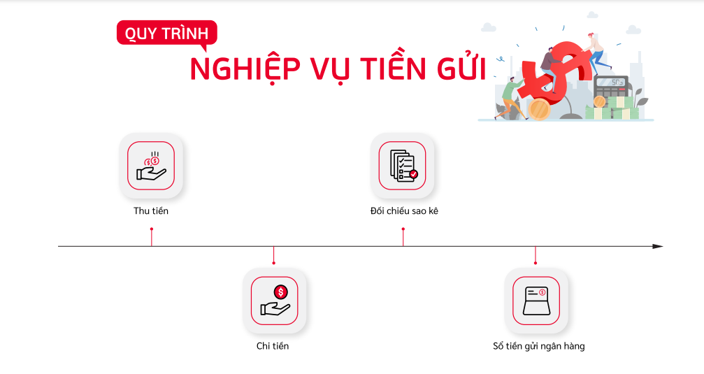
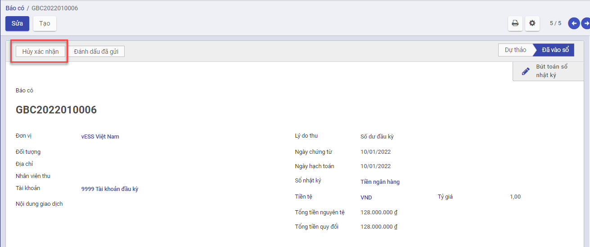
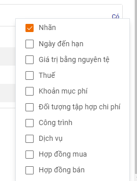
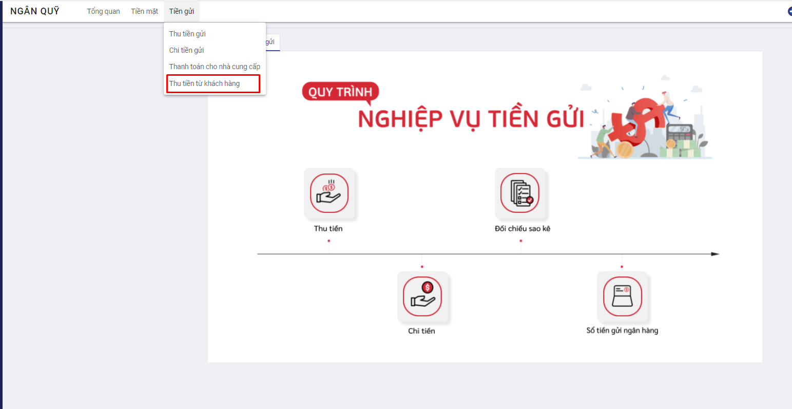
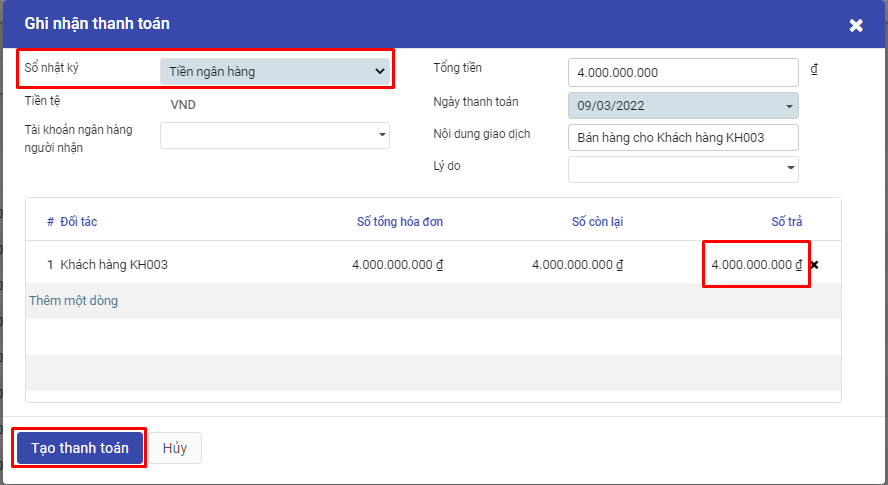
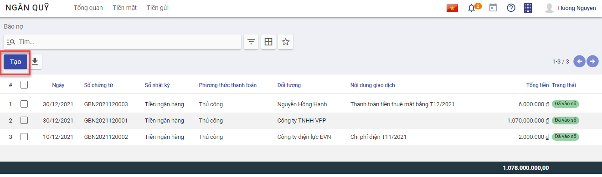
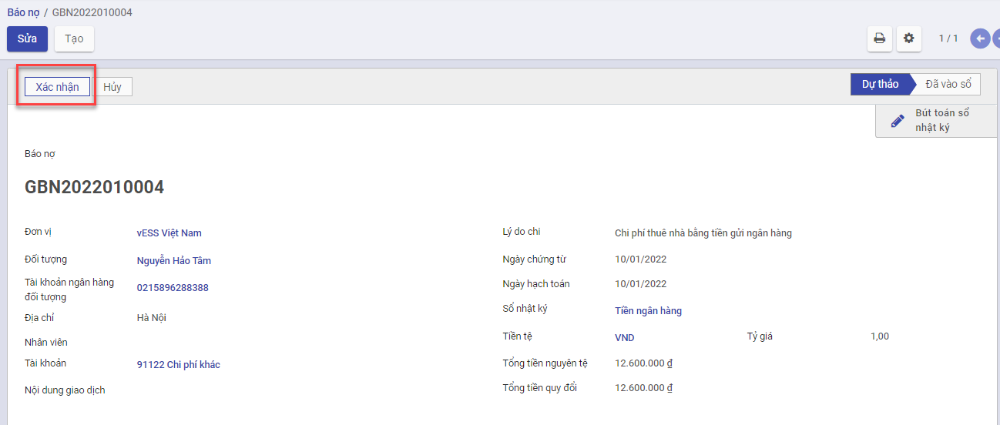
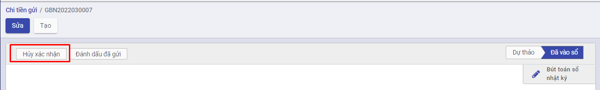
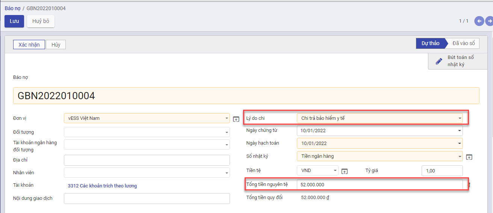
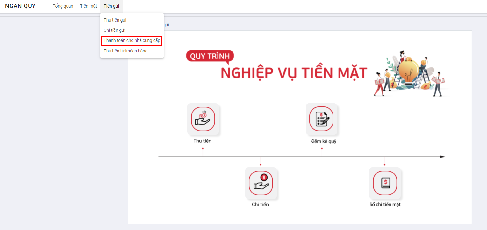

# Quy trình nghiệp vụ

Kế toán được sử dụng để  :

- Quản lý tình hình thu, chi, tồn tiền gửi ngân hàng
- Hỗ trợ phiếu in theo mẫu TT88
- Lên các báo cáo sổ quỹ tiền ngân hàng, báo cáo kế toán

Quy trình nghiệp vụ

**Các luồng quy trình**

·     Lập chứng từ Thu tiền gửi. Chi tiết nghiệp vụ **[Thu tiền gửi](#thu-tien-gui)**

·     Lập chứng từ Chi tiền gửi. Chi tiết nghiệp vụ **[Chi tiền gửi](#chi-tien-gui)**

·     Thanh toán cho nhà cung cấp. Chi tiết nghiệp vụ **[Thanh toán cho nhà cung cấp](#thanh-toan-cho-nha-cung-cap)**

·     Thanh toán lương cho nhân viên. Chi tiết nghiệp vụ **[Thanh toán lương cho nhân viên](#thanh-toan-luong-cho-nhan-vien)**

## Thu tiền gửi

### *Xem video hướng dẫn*

<iframe
    width="920"
    height="450"
    frameborder="0"
    allow="autoplay; encrypted-media; clipboard-write; gyroscope; picture-in-picture "
    allowfullscreen
    title="Module Ngân quỹ - Thu tiền gửi" 
    src="https://www.youtube.com/embed/XkxqxxZPms8"
></iframe>

### Thu tiền gửi

#### Mô tả nghiệp vụ

Cho phép nhập số tiền thu được từ khách hàng sau quá trình mua bán hàng hóa

#### Hướng dẫn trên phần mềm

**Bước 1:** Vào phân hệ **Ngân quỹ**, Chọn **Tiền gửi**,Chọn **Thu tiền gửi**

Nhấn **Tạo** để thêm mới phiếu thu

**Bước 2:** Khai báo các thông tin của **Thu tiền gửi**

- Tại mục **Lý do thu** (Tab chung) : Chọn Lý do thu phù hợp với mục đích thu tiền

  

- Tại mục **Sổ nhật ký** (Tab chung): Chọn **Tiền ngân hàng**

- Tại mục **Tổng tiền nguyên tệ** (Tab chung): Nhập số tiền dư đầu kỳ

**Bước 3:** Nhấn **Lưu**

Nhấn **Xác nhận**

**Lưu ý:**

-  Muốn chuyển trạng thái từ Hoàn thành về Nháp thì Nhấn **Hủy xác nhận**

- Trường hợp có nhu cầu theo dõi chi phí chi tiết theo Khoản mục chi phí, Công trình, Đơn hàng, Hợp đồng...

  

  - Nhấn thêm cột dữ liệu ở Tab **Bút toán**

  

  - Chọn thông tin **Khoản mục chi phí**, **Công trình**, **Đơn hàng**, **Hợp đồng**... muốn theo dõi chi tiết

### Thu tiền từ khách hàng

#### Mô tả nghiệp vụ

Khi khách hàng mang tiền mặt đến trả nợ hoặc cá nhân thu tiền khách hàng bằng tiền ngân hàng , cá nhân kinh doanh thực hiện  lập Phiếu thu để lưu trữ,  đồng thời ghi sổ quỹ.

#### *Xem video hướng dẫn*

<iframe
    width="920"
    height="450"
    frameborder="0"
    allow="autoplay; encrypted-media; clipboard-write; gyroscope; picture-in-picture "
    allowfullscreen
    title="Module Ngân quỹ - Thu tiền khách hàng bằng tiền gửi" 
    src="https://www.youtube.com/embed/N58oFjuNbcM"
></iframe>

#### Hướng dẫn trên phần mềm

**Bước 1:** Vào phân hệ **Ngân quỹ**, Chọn **Tiền gửi**, Chọn **Thu tiền từ khách hàng** (Hoặc thực hiện **Tìm kiếm** trực tiếp chức năng trên ô tìm kiếm chung của hệ thống)

Tích chọn chứng từ khách hàng thanh toán tiền nợ, nhấn **Ghi nhận thanh toán**

Bước 2: Tại mục Sổ nhật ký: Chọn **Tiền ngân hàng**

Trường hợp số tiền khách hàng thanh toán nhỏ hơn số nợ thực tế trên chứng từ, cần nhập lại số tiền khách hàng trả nợ vào cột **Số trả**. 

Nhấn **Tạo Thanh toán** để tạo Phiếu thu tiền gửi. Một phiếu thu được tự động tạo ra và hạch toán

Để kiểm tra phiếu thu, thực hiện vào chức năng **Ngân quỹ/Tiền gửi/Thu tiền gửi**, Kiểm tra và khai báo bổ sung các thông tin của **Thu tiền gửi** vừa được tạo

## Chi tiền gửi

### *Xem video hướng dẫn*

<iframe
    width="920"
    height="450"
    frameborder="0"
    allow="autoplay; encrypted-media; clipboard-write; gyroscope; picture-in-picture "
    allowfullscreen
    title="Module Ngân quỹ - Chi tiền gửi" 
    src="https://www.youtube.com/embed/DhfKqIjUMzI"
></iframe>

### Thanh toán tiền điện nước, tiền internet, tiền thuê mặt bằng..

#### Mô tả nghiệp vụ

Hộ kinh doanh thực hiện tạo Phiếu chi tiền ngân hàng cho các dịch vụ phát sinh hàng tháng như : Điện, nước,internet. mặt bằng,......

#### Hướng dẫn trên phần mềm

**Bước 1:** Vào phân hệ **Ngân quỹ**, Chọn **Tiền gửi**, Chọn **Chi tiền gửi** (Hoặc thực hiện **Tìm kiếm** trực tiếp chức năng trên ô tìm kiếm chung của hệ thống)

Nhấn **Tạo** để thêm mới phiếu chi tiền

**Bước 2:** Khai báo các thông tin của **Chi tiền gửi**

- Tại mục **Lý do chi**: Thực hiện chọn Lý do chi như **Chi tiền điện bằng ngân hàng**, **Chi tiền mua văn phòng phẩm**,.... (nhấn **Tìm kiếm thêm** để tìm thêm Lý do chi tiền)

- Tại **Tổng tiền nguyên tệ**: Nhập số tiền cần thanh toán

**Bước 3:** Nhấn **Lưu** để ghi lại thông tin đã nhập

Nhấn **Xác nhận** để hoàn thành phiếu và thực hiện ghi bút toán lên sổ

Lưu ý:

-  Muốn chuyển trạng thái từ Hoàn thành về Nháp thì Nhấn **Hủy xác nhận**

- Trường hợp có nhu cầu theo dõi chi phí chi tiết theo Khoản mục chi phí, Công trình, Đơn hàng, Hợp đồng...

  

  - Nhấn thêm cột dữ liệu ở Tab **Bút toán**

  

  - Chọn thông tin **Khoản mục chi phí**, **Công trình**, **Đơn hàng**, **Hợp đồng**... muốn theo dõi chi tiết

### Thanh toán các chi phí: BHXH, BHYT, BH thất nghiệp

#### Mô tả nghiệp vụ

Căn cứ vào Bảng lương của nhân viên, chủ hộ kinh doanh sẽ lập yêu cầu chi tiền để kê khai nộp bảo hiểm

#### Hướng dẫn trên phần mềm

**Bước 1:** Vào phân hệ **Ngân quỹ**, Chọn **Tiền gửi**, Chọn **Chi tiền gửi** (Hoặc thực hiện **Tìm kiếm** trực tiếp chức năng trên ô tìm kiếm chung của hệ thống) 

Nhấn **Tạo** để thêm mới bản ghi

**Bước 2:** Khai báo các thông tin của **Chi tiền gửi**

- Tại mục **Lý do chi**: Chọn **Chi trả bảo hiểm xã hội** hoặc **Chi trả bảo hiểm y tế** hoặc **Chi trả bảo hiểm thất nghiệp**
- Tại **Tổng tiền nguyên tệ**: Nhập số tiền cần thanh toán

**Bước 3:** Nhấn **Lưu**

Nhấn **Xác nhận** để hoàn thành phiếu và thực hiện ghi bút toán lên sổ

Lưu ý: Muốn chuyển trạng thái từ Hoàn thành về Nháp thì Nhấn **Hủy xác nhận**

## Thanh toán cho nhà cung cấp

### Mô tả nghiệp vụ

Sau khi hoàn thành hóa đơn mua hàng từ nhà cung cấp, một phiếu chi ghi nhận thanh toán sẽ được tự động tạo ra. Chủ hộ kinh doanh thực hiện ghi nhận thanh toán cho nhà cung cấp,  yêu cầu người nhận tiền ký vào và đồng thời ghi sổ quỹ

### *Xem video hướng dẫn*

<iframe
    width="920"
    height="450"
    frameborder="0"
    allow="autoplay; encrypted-media; clipboard-write; gyroscope; picture-in-picture "
    allowfullscreen
    title="Module Ngân quỹ - Thanh toán cho nhà cung cấp bằng tiền gửi" 
    src="https://www.youtube.com/embed/IKuUk5UwFwc"
></iframe>

### Hướng dẫn trên phần mềm

**Bước 1:** Tại phân hệ **Ngân quỹ**, Chọn **Tiền gửi**, Chọn **Thanh toán cho nhà cung cấp** (Hoặc thực hiện tìm kiếm trức tiếp chức năng trên ô tìm kiếm chung của hệ thống)

**Bước 2:** Tích chọn chứng từ khách hàng thanh toán tiền nợ, nhấn **Ghi nhận thanh toán**

Tại mục Sổ nhật ký: Chọn **Tiền ngân hàng**

Trường hợp số tiền khách hàng thanh toán nhỏ hơn số nợ thực tế trên chứng từ, cần nhập lại số tiền khách hàng trả nợ vào cột **Số trả**. 

Nhấn **Tạo Thanh toán** để tạo Phiếu chi tiền ngân hàng. Một phiếu chi được tự động tạo ra và hạch toán luôn

Để kiểm tra phiếu chi, thực hiện vào chức năng **Ngân quỹ/Tiền gửi/Chi tiền gửi**, Kiểm tra và khai báo bổ sung các thông tin của **Chi tiền gửi** vừa được tạo

## *Thanh toán lương cho nhân viên*

### Mô tả nghiệp vụ

**Nghiệp vụ**

Hàng tháng, sau khi Doanh nghiệp chốt thông tin lương sẽ thực hiện thanh toán tiền lương cho Nhân viên theo Bảng lương đã chốt.

Việc thanh toán được thực hiện thanh toán theo **Tiền mặt** hoặc **Tiền gửi**

**Xem video hướng dẫn**

*[Xây dựng video hướng dẫn trên phần mềm, gồm đủ các luồng chức năng được mô tả bên dưới]*

### **Hướng dẫn trên phần mềm**

Đối tượng thực hiện: Người dùng phần mềm

**Bước 1**: Vào phân hệ **Ngân quỹ**, 

- Chọn **Tiền mặt**, chọn **Thanh toán lương cho nhân viên**: Nếu muốn chi trả lương bằng **Tiền mặt**

  

- Chọn **Tiền gửi**, chọn **Thanh toán lương cho nhân viên**: Nếu muốn chi trả lương bằng **Tiền gửi ngân hàng** 

  

**Bước 2**: Hệ thống hiển thị thông tin màn hình chức năng:

Các trường dữ liệu trên chức năng:

- Thông tin Nhân viên: Đã được hiển thị mặc định danh sách các nhân viên đã được khai báo tại **Danh mục Nhân viên**
- Bảng lương: Thỏa mãn là Bảng lương đã được Xác nhận hoàn thành
- Thông tin Sổ nhật ký: Xác định Sổ nhật ký dùng để chi trả và lên các bút toán chi tiền lương cho nhân viên
- Thông tin Tổng số tiền phải trả: Là thông tin Số tiền của Bảng lương còn phải trả. Nếu là lần chi trả ban đầu thông tin 'Tổng tiền phải trả' chính là thông tin Tiền của Bảng lương. Với lần trả tiếp theo: Số tiền phải trả là giá trị còn lại của Bảng lương sau khi đã thanh toán lương lần đầu

**Bước 3**: Thực hiện chọn và Nhập thông tin dữ liệu

- Chọn Bảng lương
- Nhập thông tin Số tiền tương ứng cần thanh toán cho Nhân viên. Trường hợp không thanh toán giữ nguyên thông tin Số tiền thanh toán = 0

***Lưu ý:*** Hệ thống sẽ báo lỗi khi 'Tổng tiền trả lần này' vượt quá 'Tổng tiền phải trả' và Báo lỗi khi Số tiền còn lại trong Sổ nhật ký không đủ để thanh toán khoản tiền phải chi trả

**Bước 4**: Người dùng Nhấn nút **Xác nhận** để ghi nhận thanh toán lương theo dữ liệu đã nhập.

Hệ thống tự động tạo ra các phiếu chi lương với các bút toán tương ứng với từng đối tượng

Thông tin chi tiết của Phiếu chi thanh toán lương

***Lưu ý:*** Với các Bảng lương đã được thanh toán Chi trả, hệ thống thể hiện thông tin Số lượng Phiếu chi tương ứng đã được thanh toán của Bảng lương

