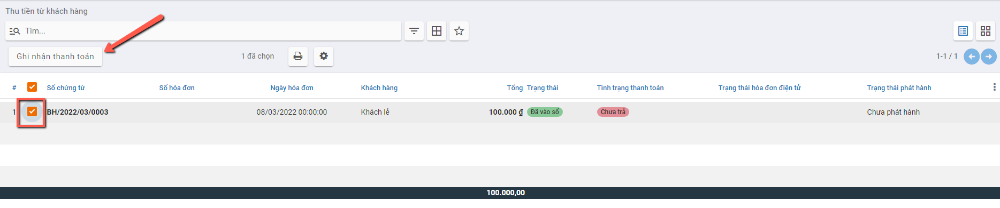
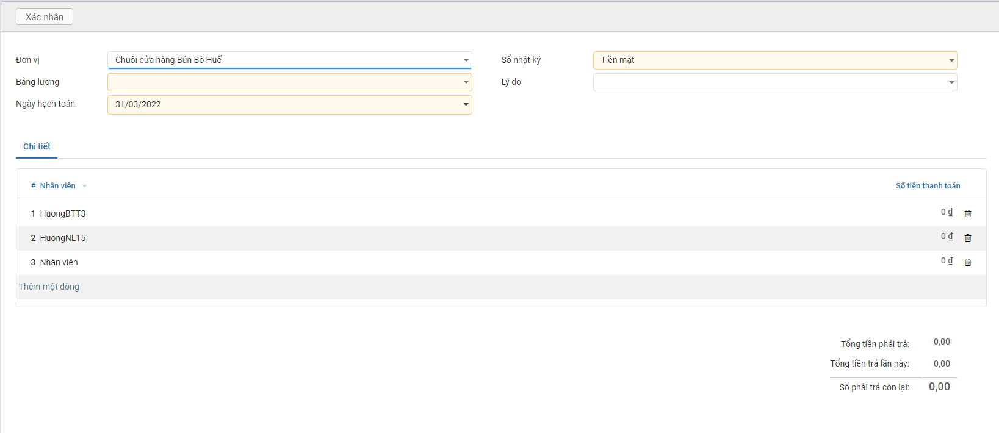
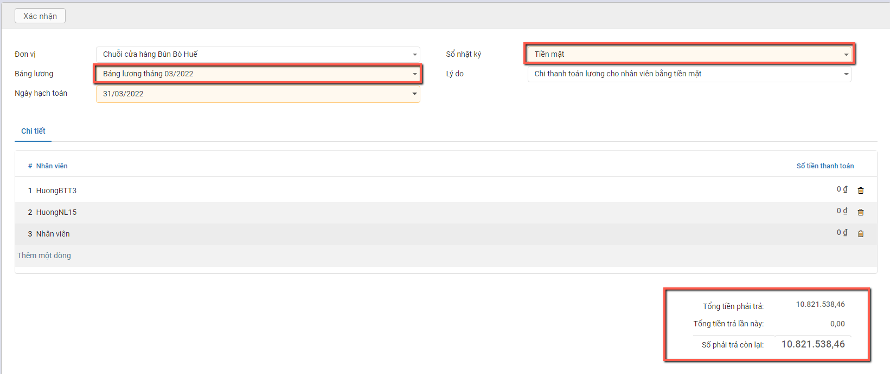
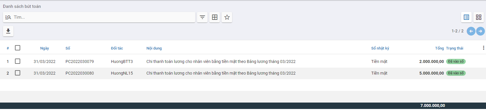

# Quy trình nghiệp vụ

Phân hệ **Ngân quỹ** quản lý tình hình thu/chi tiền mặt và tiền gửi ngân hàng của doanh nghiệp, giúp kế toán hạn chế ghi nhận sai và chi âm tiền. Hỗ trợ kiểm soát những hóa đơn bán hàng/ hóa đơn mua hàng chưa thanh toán hoặc đã thanh toán một phần

**Quy trình**

**Các luồng quy trình**

·     Lập chứng từ Thu tiền mặt. Chi tiết nghiệp vụ **[Thu tiền mặt](#thu-tien-mat)**

·     Lập chứng từ Chi tiền mặt. Chi tiết nghiệp vụ **[Chi tiền mặt](#chi-tien-mat)**

·     Kiểm kê tiền mặt. Chi tiết nghiệp vụ **[Kiểm kê tiền mặt](#kiem-ke-tien-mat)**

·     Thanh toán lương cho nhân viên. Chi tiết nghiệp vụ **[Thanh toán lương cho nhân viên](#thanh-toan-luong-cho-nhan-vien)**

## Thu tiền mặt

### *Xem video hướng dẫn*

<iframe
    width="920"
    height="450"
    frameborder="0"
    allow="autoplay; encrypted-media; clipboard-write; gyroscope; picture-in-picture "
    allowfullscreen
    title="Module Ngân quỹ - Thu tiền mặt" 
    src="https://www.youtube.com/embed/3nqQMly5KGY"
></iframe>
### Thu tiền mặt

#### Mô tả nghiệp vụ

Khi phát sinh các nghiệp vụ thu tiền mặt từ những nguồn thu ngoài các luồng nghiệp vụ đang có như Thu tiền nhượng bán TSCĐ, Thu tiền thanh lý TSCĐ hoặc từ một nguồn thu tiền mặt khác, người dùng sử dụng tính năng Thu tiền mặt để nhập dữ liệu

#### Hướng dẫn trên phần mềm

**Bước 1:** Vào phân hệ **Ngân quỹ**, Chọn **Tiền mặt**, Chọn **Thu tiền mặt ** (Hoặc thực hiện **Tìm kiếm** trực tiếp chức năng trên ô tìm kiếm chung của hệ thống), Nhấn **Tạo**

**Bước 2:** Khai báo các thông tin của phiếu **Thu tiền mặt**

- Tại mục **Lý do thu**(Tab chung) : Chọn lý do tương ứng với Nghiệp vụ đang phát sinh
- Tại mục **Tổng tiền nguyên tệ** (Tab chung): Nhập số tiền
- Chọn và nhập các thông tin về: Đối tượng, Người nộp tiền, Nhân viên thu ngân, Chứng từ kèm theo và Nội dung giao dịch (Nếu có)

**Bước 3:** Nhấn **Lưu**

Sau khi Lưu lại thông tin: Hệ thống tự động hiển thị thông tin bút toán với số tiền tương ứng đã nhập

Để sửa lại dữ liệu: Người dùng nhấn nút **Sửa**

**Bước 4:** Nhấn **Xác nhận**: Sau khi dữ liệu đã nhập đúng và đủ. Hệ thống đưa các bút toán vào sổ và chuyển trạng thái chứng từ thành **Đã vào sổ**

Để sửa lại thông tin đã nhập Người dùng phải nhấn nút **Hủy xác nhận** 

### Thu tiền từ khách hàng

#### Mô tả nghiệp vụ

Với những giao dịch khách hàng thanh toán bằng tiền mặt cho các đơn hàng, người dùng thực hiện nghiệp vụ thu tiền từ khách hàng và nhập vào hệ thống để ghi nhận thông tin.

#### *Xem video hướng dẫn*

<iframe
    width="920"
    height="450"
    frameborder="0"
    allow="autoplay; encrypted-media; clipboard-write; gyroscope; picture-in-picture "
    allowfullscreen
    title="Module Ngân quỹ - Thu tiền từ khách hàng bằng tiền mặt" 
    src="https://www.youtube.com/embed/6WTwBVg52ag"
></iframe>

#### Hướng dẫn trên phần mềm

**Bước 1:** Vào phân hệ **Ngân quỹ**, Chọn **Tiền mặt**, Chọn **Thu tiền từ khách hàng** (Hoặc thực hiện **Tìm kiếm** trực tiếp chức năng trên ô tìm kiếm chung của hệ thống)

- Tích chọn chứng từ khách hàng thanh toán tiền nợ
- Nhấn **Ghi nhận thanh toán**

**Bước 2:** Nhập các thông tin trên màn hình Ghi nhận thanh toán

- Tại mục Sổ nhật ký: Chọn **Tiền mặt**

- Với thông tin Số tiền:

  Nếu Khách hàng trả toàn bộ số tiền theo Hóa đơn: Giữ nguyên thông tin **Số trả**

  

  Nếu Khách hàng chưa trả đủ số tiền theo Hóa đơn: Thực hiện Sửa thông tin Số trả theo giá trị tiền thực tế. Với Số tiền còn lại có 2 lựa chọn

  - **Giữ vẫn mở**: Khi đó hệ thống Ghi nhận theo đúng giá trị đã trả trong đợt đầu, và đánh dấu chưa thanh toán đủ
  - **Đánh dấu đã trả đủ**: Hệ thống ghi nhận theo giá trị **Số trả** và đánh dấu đã thanh toán đủ cho Hóa đơn

  

**Bước 3**: Nhấn **Tạo Thanh toán** để tạo Phiếu thu tiền mặt

- Thông tin Phiếu thu tiền mặt được tạo với các thông tin đã chọn trên phần Ghi nhận thanh toán
- Hệ thống tự động hạch toán và lên bút toán 

- Hệ thống Ghi nhận Thanh toán 1 phần cho các Hóa đơn chưa thanh toán đủ

## Chi tiền mặt

### *Xem video hướng dẫn*

<iframe
    width="920"
    height="450"
    frameborder="0"
    allow="autoplay; encrypted-media; clipboard-write; gyroscope; picture-in-picture "
    allowfullscreen
    title="Module Ngân quỹ - Chi tiền mặt" 
    src="https://www.youtube.com/embed/8uhV4xRhBq8"
></iframe>

### Thanh toán tiền điện nước, tiền internet, tiền thuê mặt bằng..

#### Mô tả nghiệp vụ

Kế toán thực hiện tạo Phiếu chi tiền mặt cho các dịch vụ phát sinh hàng tháng như : Điện, nước,internet. mặt bằng,......

#### Hướng dẫn trên phần mềm

**Bước 1:** Vào phân hệ **Ngân quỹ**, Chọn **Tiền mặt**, Chọn **Chi tiền mặt** (Hoặc thực hiện **Tìm kiếm** trực tiếp chức năng trên ô tìm kiếm chung của hệ thống), Nhấn **Tạo**

**Bước 2:** Khai báo các thông tin của **Chi tiền mặt**

- Tại mục **Đối tượng**: Chọn Khách hàng/Nhà cung cấp.
- Tại mục **Tài khoản ngân hàng đối tượng** : Chọn tài khoản nhận tiền (Nếu có)
- Tại mục **Người nhận**: Nhập người nhận tiền (Nếu có)
- Tại **Tổng tiền nguyên tệ**: Nhập số tiền cần thanh toán
- Tại mục **Lý do chi**: Thực hiện chọn Lý do chi như **Chi tiền điện bằng tiền mặt**, **Chi tiền mua văn phòng phẩm**,.... (nhấn **Tìm kiếm thêm** để tìm thêm Lý do chi tiền)

**Bước 3:** Nhấn **Lưu**

**Bước 4:** Sau khi kiểm tra thông tin đã đầy đủ và chính xác , Nhấn **Xác nhận**: Khi đó thông tin bút toán được Hạch toán vào sổ

**Lưu ý:**

-  Muốn chuyển trạng thái từ Hoàn thành về Nháp thì Nhấn **Hủy xác nhận**

- Trường hợp có nhu cầu theo dõi chi phí chi tiết theo Khoản mục chi phí, Công trình, Đơn hàng, Hợp đồng...
  - Nhấn thêm cột dữ liệu ở Tab **Bút toán**
  - Chọn thông tin **Khoản mục chi phí**, **Công trình**, **Đơn hàng**, **Hợp đồng**... muốn theo dõi chi tiết

### Thanh toán các chi phí: BHXH, BHYT, BH thất nghiệp

#### Mô tả nghiệp vụ

Thực hiện chi trả các khoản liên quan đến Bảo hiểm xã hội, bảo hiểm y tế hoặc Chi trả thất nghiệp cho nhân viên

#### Hướng dẫn trên phần mềm

**Bước 1:** Vào phân hệ **Ngân quỹ**, Chọn **Tiền mặt**, Chọn **Chi tiền mặt** (Hoặc thực hiện **Tìm kiếm** trực tiếp chức năng trên ô tìm kiếm chung của hệ thống), Nhấn **Tạo**

**Bước 2:** Khai báo các thông tin của **Chi tiền mặt**

- Tại mục **Lý do chi**: Chọn **Chi trả bảo hiểm xã hội** hoặc **Chi trả bảo hiểm y tế** hoặc **Chi trả bảo hiểm thất nghiệp**
- Tại **Tổng tiền nguyên tệ**: Nhập số tiền cần thanh toán

**Bước 3:** Nhấn **Lưu**

**Bước 4:** Nhấn **Xác nhận**: Ghi nhận thông tin các bút toán được Hạch toán vào Sổ

Lưu ý: Muốn chuyển trạng thái từ Hoàn thành về Nháp thì Nhấn **Hủy xác nhận**	

### Thanh toán cho nhà cung cấp

#### Mô tả nghiệp vụ

Với những giao dịch chi trả đơn hàng cho nhà cung cấp bằng tiền mặt, người dùng thực hiện nghiệp vụ Chi trả tiền cho nhà cung cấp và nhập vào hệ thống để ghi nhận thông tin

#### *Xem video hướng dẫn*

<iframe
    width="920"
    height="450"
    frameborder="0"
    allow="autoplay; encrypted-media; clipboard-write; gyroscope; picture-in-picture "
    allowfullscreen
    title="Module Ngân quỹ - Thanh toán cho nhà cung cấp bằng tiền mặt" 
    src="https://www.youtube.com/embed/CGYLfRXPUlM"
></iframe>

#### Hướng dẫn trên phần mềm

**Bước 1:** Tại phân hệ **Ngân quỹ**, Chọn **Tiền mặt**, Chọn **Thanh toán cho nhà cung cấp** (Hoặc thực hiện tìm kiếm trức tiếp chức năng trên ô tìm kiếm chung của hệ thống)

**Bước 2:** Tích chọn chứng từ khách hàng thanh toán tiền nợ: Nhấn **Ghi nhận thanh toán**

**Bước 3:** Trên thông tin Ghi nhận thanh toán Chọn/Nhập một số thông tin:

- Tại mục Sổ nhật ký: Chọn **Tiền mặt**

- Thực hiện chi trả số tiền đủ theo Hóa đơn hoặc chỉ chi trả một phần: Người dùng điều chỉnh thông tin tiền tại cột **'Số trả'**

**Bước 4:** Nhấn **Tạo Thanh toán** để tạo Phiếu chi tiền mặt: Hệ thống tự động Tạo phiếu chi và ghi nhận thông tin thanh toán: Đã trả đủ hoặc Đã trả 1 phần

## Kiểm kê tiền mặt

### Mô tả nghiệp vụ

Định kỳ theo quy định hoặc khi có phát sinh yêu cầu kiểm kê quỹ từ Ban lãnh đạo công ty, sẽ phát sinh một số hoạt động sau:

- Thành lập hội đồng kiểm kê gồm: Kế toán hoặc Giám đốc.
- Đếm thực tế số tiền mặt tồn quỹ theo từng loại tiền về mặt số lượng và mệnh giá.
- Đối chiếu số dư thực tế kiểm kê với sổ kế toán tiền mặt tại quỹ, nếu có sự chênh lệch thì thực hiện tìm nguyên nhân bằng cách đối chiếu sổ quỹ với sổ kế toán tiền mặt tìm ra những giao dịch thu, chi tiền mặt không khớp giữa 2 sổ.
- Sau khi tìm nguyên nhân thì Giám đốc hoặc Kế toán sẽ ra quyết định xử lý.

### *Xem video hướng dẫn*

<iframe
    width="920"
    height="450"
    frameborder="0"
    allow="autoplay; encrypted-media; clipboard-write; gyroscope; picture-in-picture "
    allowfullscreen
    title="Module Ngân quỹ - Kiểm kê tiền mặt" 
    src="https://www.youtube.com/embed/pBUkkO050ho"
></iframe>

### Hướng dẫn trên phần mềm

**Bước 1:** Vào phân hệ **Ngân quỹ**, Chọn **Tiền mặt**, Chọn **Kiểm kê tiền mặt** (Hoặc thực hiện Tìm kiếm** trực tiếp chức năng trên ô tìm kiếm chung của hệ thống), Nhấn **Tạo**

**Bước 2:** Khai báo các thông tin **Kiểm kê tiền mặt**

- Tại mục **Đơn vị** : Chọn Chi nhánh kiểm kê
- Tại mục **Kiểm kê đến ngày**: Chọn Ngày kiểm kê
- Tại mục **Sổ nhật ký**: Chọn Tiền mặt
- Tại mục **Tiền tệ**: Chọn Tiền tệ kiểm kê

- Tại Tab **Kiểm kê** : Thực hiện nhập số lượng từng mệnh giá còn tồn trong Quỹ

- Tại Tab **Thành viên tham gia**: Thực hiện chọn nhân viên tham gia kiểm kê

**Bước 3:** Nhấn **Xử lý chênh lệch**

- Căn cứ vào thực tế kiểm kê thừa hay thiếu, hệ thống tự động sinh ra Phiếu thu/Phiếu chi tương ứng. Cụ thể:
  - Trường hợp Số kiểm kê thực tế < Số dư trên sổ kế toán, hệ thống sẽ tự động sinh ra **Phiếu chi** để xử lý giá trị thừa.
  - Trường hợp Số kiểm kê thực tế > Số dư trên sổ kế toán, hệ thống sẽ tự động sinh ra **Phiếu thu** để xử lý giá trị thiếu.

## *Thanh toán lương cho nhân viên*

### Mô tả nghiệp vụ

**Nghiệp vụ**

Hàng tháng, sau khi Doanh nghiệp chốt thông tin lương sẽ thực hiện thanh toán tiền lương cho Nhân viên theo Bảng lương đã chốt.

Việc thanh toán được thực hiện thanh toán theo **Tiền mặt** hoặc **Tiền gửi**

**Xem video hướng dẫn**

*[Xây dựng video hướng dẫn trên phần mềm, gồm đủ các luồng chức năng được mô tả bên dưới]*

### **Hướng dẫn trên phần mềm**

Đối tượng thực hiện: Người dùng phần mềm

**Bước 1**: Vào phân hệ **Ngân quỹ**, 

- Chọn **Tiền mặt**, chọn **Thanh toán lương cho nhân viên**: Nếu muốn chi trả lương bằng **Tiền mặt**

  

- Chọn **Tiền gửi**, chọn **Thanh toán lương cho nhân viên**: Nếu muốn chi trả lương bằng **Tiền gửi ngân hàng** 

  

**Bước 2**: Hệ thống hiển thị thông tin màn hình chức năng:

Các trường dữ liệu trên chức năng:

- Bảng lương: Thỏa mãn là Bảng lương đã được Xác nhận hoàn thành. Trường hợp Bảng lương không có thông tin, Người dùng vào chức năng **Tổng hợp/Bảng lương/Bảng lương** để khai báo
- Thông tin Sổ nhật ký: Xác định Sổ nhật ký dùng để chi trả và lên các bút toán chi tiền lương cho nhân viên.

**Bước 3**: Thực hiện chọn và Nhập thông tin dữ liệu

- Chọn Bảng lương:

**Trường hợp:** Bảng lương được khai báo Không hạch toán theo đối tượng (Tức thông tin **Hạch toán theo đối tượng** ***<u>không được tích chọn</u>***): Trên giao diện chỉ hiển thị thông tin Tổng tiền để người dùng nhập và Thanh toán theo tổng, không lên bút toán theo từng đối tượng

**Trường hợp**:  Bảng lương được khai báo Hạch toán theo đối tượng (Tức thông tin **Hạch toán theo đối tượng** ***<u>được tích chọn</u>***): Trên giao diện hiển thị mặc định thông tin Nhân viên cùng Số tiền lương nhận được đã được khai báo bên Bảng lương

- Thông tin **Tổng số tiền phải trả**: Là thông tin Số tiền của Bảng lương còn phải trả. Nếu là lần chi trả ban đầu thông tin 'Tổng tiền phải trả' chính là thông tin Tiền của Bảng lương. Với lần trả tiếp theo: Số tiền phải trả là giá trị còn lại của Bảng lương sau khi đã thanh toán lương lần đầu
- Thông tin **Tổng tiền trả lần này**: Ghi nhận Số tiền sẽ thanh toán cho lần chi trả lương đang thực hiện
  - Với Bảng lương thanh toán không theo đối tượng thì Tổng tiền trả lần này = Số tiền được nhập thanh toán tại trường **'Số tiền'**
  - Với Bảng lương thanh toán theo Đối tượng thì Tổng tiền trả lần này = **Tổng giá trị tại cột 'Số tiền thanh toán'** của nhân viên (Thông tin cột **'Số tiền thanh toán'** ứng với từng nhân viên có thể **Sửa đổi**)

<u>***Lưu ý:***</u> Hệ thống sẽ báo lỗi khi 'Tổng tiền trả lần này' vượt quá 'Tổng tiền phải trả' và Báo lỗi khi Số tiền còn lại trong Sổ nhật ký không đủ để thanh toán khoản tiền phải chi trả

**Bước 4**: Người dùng Nhấn nút **Xác nhận** để ghi nhận thanh toán lương theo dữ liệu đã nhập.

**Trường hợp: Thanh toán theo Số tổng**

==> Sau khi Xác nhận thanh toán Hệ thống tạo 1 Phiếu chi lương tương ứng theo hình thức chi trả lương bằng **Tiền mặt hay Tiền gửi ngân hàng**

**Trường hợp thanh toán theo Đối tượng**

==> Hệ thống tự động tạo ra các phiếu chi lương với các bút toán tương ứng với từng đối tượng

Thông tin chi tiết của Phiếu chi thanh toán lương

***Lưu ý:*** Với các Bảng lương đã được thanh toán Chi trả, hệ thống thể hiện thông tin Số lượng Phiếu chi tương ứng đã được thanh toán của Bảng lương

