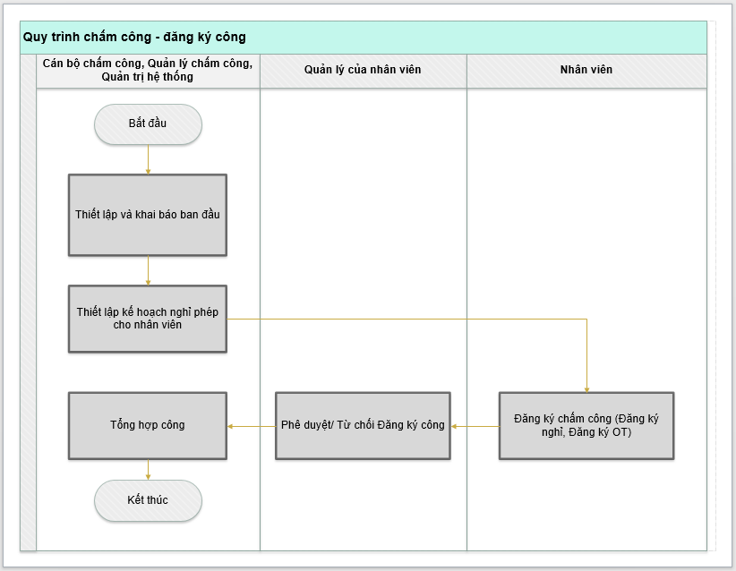
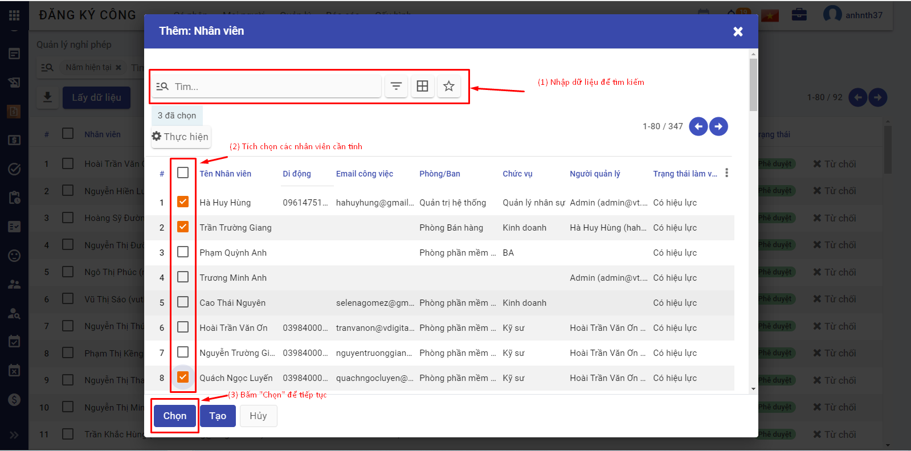
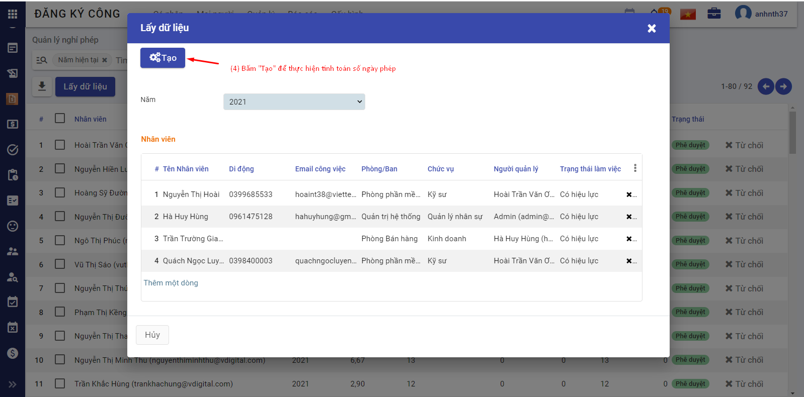
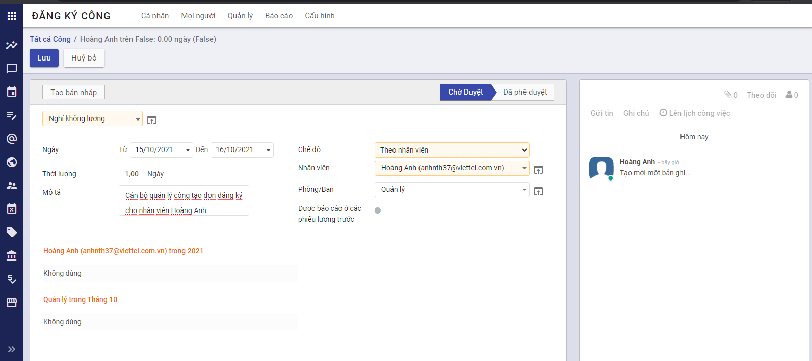
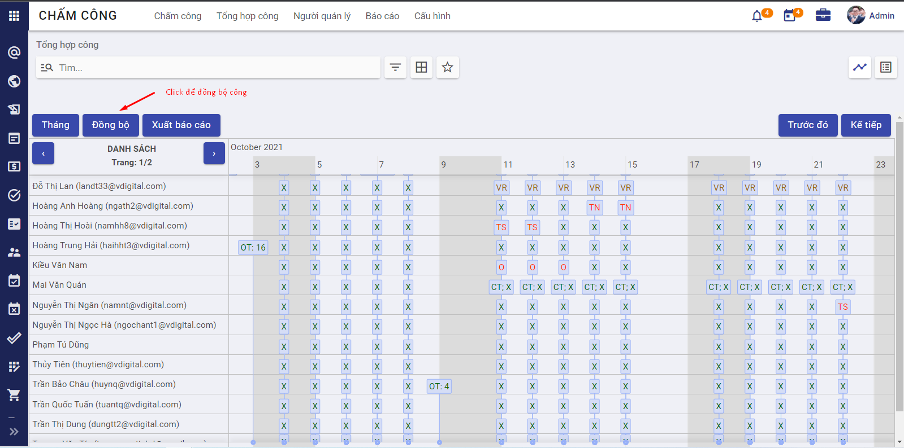

# Giới thiệu chức năng Chấm công - Đăng ký công

Chấm công, Đăng ký công là 2 phân hệ con mở rộng của phân hệ Nhân sự. Đây là nơi lưu trữ, tổng hợp tất cả dữ liệu đăng ký chấm công và chấm công của các nhân viên trong công ty. Hai phân hệ cung cấp cái nhìn toàn cảnh, bao quát và trực quan về thông tin chấm công của nhân viên; từ đó giúp các công ty/ doanh nghiệp quản lý chấm công một cách hiệu quả và chuẩn xác.

Phân hệ Chấm công - Đăng ký công đáp ứng được các yêu cầu nghiệp vụ như:

- Quản lý hiệu quả kế hoạch nghỉ phép cho tất cả nhân viên bằng cách tự động tính toán số ngày nghỉ phép theo Luật lao động hiện hành.
- Quản lý ngày nghỉ phép, làm thêm giờ của nhân viên linh hoạt.
- Công cụ báo cáo, thống đơn giản và trực quan
- Tự động đồng bộ, chấm công cho nhân viên trên hệ thống dựa theo đơn đăng ký nghỉ, đăng ký làm thêm giờ.

# Mô tả nghiệp vụ

Phân hệ Chấm công - Đăng ký công cho phép người dùng thực hiện đăng ký chấm công - tổng hợp bảng công theo quy trình như sau

Các luồng quy trình:

- Thiết lập và khai báo ban đầu. Xem hướng dẫn chi tiết 

  [Tại đây]: #khaibaobandau

- Thiết lập kế hoạch nghỉ phép cho nhân viên. Xem hướng dẫn chi tiết 

  [Tại đây]: #kehoachnghiphep

- Nhân viên đăng ký công. Xem hướng dẫn chi tiết 

  [Tại đây]: #dangkychamcong

- Quản lý trực tiếp của nhân viên phê duyệt/ từ chối đăng ký công. Xem hướng dẫn chi tiết 

  [Tại đây]: #pheduyetcong

- Cán bộ chấm công tổng hợp công. Xem hướng dẫn chi tiết 

  [Tại đây]: #tonghopcong

# Thiết lập và khai báo ban đầu 

Việc thiết lập và khai báo ban đầu của phân hệ chấm công -  đăng ký công nên được thực hiện ngay khi lần đầu cài đặt hệ thống, giúp khởi tạo dữ liệu và bắt đầu sử dụng nghiệp vụ chấm công. 

## Thiết lập phân quyền người dùng

***Đối tượng thực hiện: Người quản trị hệ thống***

Để đảm bảo tất cả người dùng đăng nhập vào miền ứng dụng của doanh nghiệp đảm nhận đúng vai trò, quản trị viên hệ thống cần thiết lập phân quyền phù hợp. Cụ thể như sau:

- Đối với phân hệ Chấm công, gồm 4 mức phân quyền
  - Không chọn gì (bỏ trống): Người dùng không có phân sự gì với phân hệ chấm công
  - Chọn "Điểm danh thủ công": Người dùng chỉ có quyền điểm danh thủ công trên mobile hoặc máy chấm công. Có thể hiểu phân quyền này cho nhân viên bình thường trong công ty
  - Chọn "Cán bộ": Người dùng là cán bộ chấm công, có quyền tổng hợp và theo dõi báo cáo công của tất cả các nhân viên
  - Chọn "Người quản trị": Người quản trị phân hệ Chấm công.
- Đối với phân hệ Đăng ký công, phân hệ này dùng để nhân viên đăng ký, quản lý trực tiếp của nhân viên phê duyệt/ từ chối đăng ký, cán bộ nhân sự phê duyệt/ từ chối và theo dõi báo cáo đăng ký công. Có 3 mức phân quyền cho phân hệ này như sau:
  - Không chọn gì (bỏ trống): Người dùng nội bộ (nhân viên) có thể đăng ký công (đăng ký nghỉ/OT)
  - Chọn "Người phụ trách": Thiết lập cho người dùng là quản lý của nhân viên, có quyền đăng ký công và chỉ phê duyệt/ từ chối đơn đăng ký công của nhân viên mình phụ trách, quản lý
  - Chọn "Quản lý công": Thiết lập cho người dùng là cán bộ duyệt công, có quyền đăng ký công, xem và phê duyệt/ từ chối tất cả các đơn đăng ký công, KHÔNG có quyền tự phê duyệt/ từ chối đơn đăng ký của cá nhân người dùng đó
  - Chọn "Người quản trị": Thiết lập cho người quản trị phân hệ Đăng ký công, có quyền xem và phê duyệt tất cả các đơn đăng ký công bao gồm cả đơn của bản thân. 

## Thiết lập ký hiệu công

***Đối tượng thực hiện: Người quản trị hệ thống hoặc người quản trị phân hệ Chấm công*** 

Ký hiệu công (hay còn gọi là "Loại ngày làm"), là danh sách các ký hiệu hiển thị lên bảng chấm công tương ứng cho các loại ngày làm, ví dụ như công đi làm (X), công nghỉ phép (P), công làm tăng ca (OT),...

Dữ liệu ký hiệu công (loại ngày làm) này được sử dụng để thiết lập các loại đăng ký công thì thiết lập tương ứng. 

Hiện tại, khi người dùng cài đặt thành công phân hệ Chấm công, hệ thống đã tạo sẵn bộ dữ liệu các ký hiệu công phổ biến, thường dùng cho tất cả các doanh nghiệp. Người dùng kiểm tra dữ liệu trên hệ thống và điều chỉnh dữ liệu phù hợp bằng cách thao tác như sau:

- Vào menu **Chấm công** >> Chọn **Cấu hình** >> Ký hiệu công. Hệ thống hiển thị màn hình sau

*Lưu ý: Các dữ liệu có sẵn này không được phép xoá. Người dùng có thể tạo thêm ký hiệu công mới bằng cách bấm **Tạo** và nhập dữ liệu phù hợp, sau đó thực hiện **Lưu**.*

## Thiết lập loại đăng ký công

***Đối tượng thực hiện: Người quản lý công hoặc Người quản trị phân hệ Đăng ký công.*** 

***Mục đích:*** Thiết lập các loại đăng ký công tương ứng với các ký hiệu công, để khi nhân viên đăng ký công thuộc loại đăng ký công nào thì khi cán bộ chấm công tổng hợp công, hệ thống tự động hiển thị đúng loại ký hiệu công tương ứng lên bảng công.

***Thực hiện trên hệ thống:*** Người dùng vào menu **Đăng ký công** >> Chọn **Cấu hình** >> **Loại đăng ký**. Hệ thống hiển thị màn hình sau

Ngay khi người dùng cài đặt thành công phân hệ "Đăng ký công", hệ thống tự động tạo sẵn bộ dữ liệu các loại đăng ký với bộ ký hiệu công khởi tạo. Người dùng có thể thêm loại đăng ký mới bằng cách bấm nút **Tạo**, nhập các thông tin yêu cầu, bấm **Lưu** để hoàn tất.

***Lưu ý 1:** Các thông tin cần nhập*

- Loại ngày làm: Chọn 1 trong số các loại ngày làm đã khai báo ở bước **Thiết lập đăng ký công**
- Ngày xác nhận: Nhập khoảng thời gian cho phép đăng ký công với loại đăng ký này
- Công trong: Chọn Ngày/Nửa ngày/Giờ tương ứng với đơn vị thời gian nghỉ cho loại đăng ký này. Ví dụ như hình trên, thì với loại đăng ký công là "Nghỉ dưỡng năm 2021", nhân viên được phép đăng ký nghỉ theo ngày (1 ngày, 2 ngày, ...)
- Đăng ký phân bổ: Tích chọn chế độ đăng ký phân bổ phù hợp, cụ thể
  - Không giới hạn: Tức là với phân bổ kế hoạch đăng ký công thuộc loại đăng ký này thì không cần người phê duyệt. Có thể hiểu là nhân viên có thể tuỳ ý đăng ký kế hoạch cho loại đăng ký này.
  - Thiết lập bởi người quản lý công: Tức là người quản lý công mới có quyền cấp phát phân bổ thời gian cho loại đăng ký công này
- Đăng ký công: Tích chọn chế độ phê duyệt đăng ký công phù hợp, cụ thể
  - Không phê duyệt: Tức là các đơn đăng ký công thuộc loại đăng ký công này thì không cần phê duyệt, tự động có hiệu lực
  - Người quản lý công: Tức là đơn đăng ký công thuộc loại này phải được phê duyệt bởi người quản lý công mới có tính hiệu lực
  - Quản lý nhân viên: Tức là đơn đăng ký công thuộc loại này phải được phê duyệt bởi quản lý cấp trên trực tiếp của nhân viên
  - Quản lý nhân viên và quản lý công: Tức là đơn đăng ký công thuộc loại này phải được phê duyệt lần 1 bởi quản lý nhân viên, và phê duyệt lần 2 bởi người quản lý công mới có hiệu lực.

***Lưu ý 2:** Các loại đăng ký có sẵn trên hệ thống thì không cho phép người dùng xoá.*  

## Thiết lập loại hợp đồng tính phép

***Đối tượng thực hiện: Người quản lý công hoặc người quản trị phân hệ Đăng ký công*** 

- Theo quy định của Luật lao động nói chung và quy định của công ty nói riêng, để tính và quản lý số ngày phép cho nhân viên thì cần xác định được danh sách hợp đồng được hưởng phép và danh sách loại hợp đồng được tính thời gian là thời gian làm việc trong năm.

- Các bước thực hiện trên hệ thống: Người dùng vào menu **Đăng ký công** >> Chọn **Cấu hình** >> Chọn **Thiết lập**

Người dùng điều chỉnh dữ liệu phù hợp với doanh nghiệp, bấm **Lưu** để hoàn tất.

## Thiết lập loại hoạt động

***Đối tượng thực hiện: Người quản lý công hoặc người quản trị phân hệ Đăng ký công***

- Tại bước này, người dùng thiết lập các hoạt động để định nghĩa rằng: loại hoạt động này bắt buộc phải thực hiện hành động gì? Người mặc định thực hiện là ai? Hoạt động này có là tiền điều kiện có hoạt động nào khác không? Sau hoạt động này thì nên thực hiện hoạt động nào? Thời gian dự kiến phải hoàn thành hoạt động trong bao lâu?

- Việc thiết lập này chính là định nghĩa cho các thông báo cảnh báo khi quá thời gian thực hiện cho phép.

- Các bước thực hiện trên hệ thống: 

  - Người dùng vào menu **Đăng ký công** >> Chọn **Cấu hình** >> **Hoạt động**. Hệ thống hiển thị lên màn hình danh sách các hoạt động được định nghĩa sẵn. 

  - Người dùng có thể thiết lập thêm hoạt động bằng cách bấm nút **Tạo**, nhập các thông tin yêu cầu và bấm **Lưu** để hoàn tất.

    *Lưu ý: Các bản ghi hệ thống tạo sẵn thì không được phép xoá.*

# Thiết lập kế hoạch nghỉ phép cho nhân viên 

***Đối tượng thực hiện: cán bộ quản lý công hoặc người quản trị phân hệ Đăng ký công***

- Thường hàng kỳ, hàng năm hoặc khi nhân viên có sự thay đổi liên quan đến tính tổng số ngày được phép đăng ký nghỉ phép trong năm (ví dụ như khi nhân viên thay đổi diện đối tượng từ thử việc lên hợp đồng lao động, khi nhân viên nghỉ việc,...), cán bộ quản lý công sẽ thực hiện tính toán lại tổng số ngày phép cho nhân viên. 

  Mục đích của bước này là để cấp phát số ngày phép cho nhân viên theo đúng quy định.

- Hướng dẫn thực hiện trên hệ thống: 

  - ***Tính toán số ngày phép***: Khi cần tính lại số ngày phép cho nhân viên, người dùng vào menu **Đăng ký công** >> Chọn **Quản lý** >> Chọn **Quản lý nghỉ phép** >> Bấm nút **Lấy dữ liệu** >> Tại đây người dùng bấm **Thêm một dòng** để tìm kiếm và tích chọn 1 hoặc nhiều nhân viên cần tính phép >> Bấm **Chọn** để tiếp tục

  

   Người dùng bấm **Tạo** để thực hiện tính toán số ngày phép

  
  Hệ thống tự động tính toán, hiển thị dữ liệu lên danh sách Quản lý nghỉ phép

  

  Đối với những dòng dữ liệu vừa được tính toán, chưa được phê duyệt (tức là ở trạng thái **Nháp**) thì người dùng có thể nhập thêm số liệu vào cột Số ngày phép công thêm (Tức là ví dụ theo quy định riêng của công ty, nhân viên Hoài được cộng thêm 1 ngày phép vì có thành tích xuất sắc thì người dùng nhập dữ liệu như trên ảnh), Số ngày kỳ trước (Tức là số ngày phép của năm trước còn dư được phép cộng thêm vào tổng số ngày phép cho năm sau) phù hợp. 

  - ***Phê duyệt dữ liệu***: Đối với các dòng dữ liệu hiển thị ở trạng thái **Nháp** thì nhân viên đó chưa được đăng ký nghỉ phép. Để hệ thống tự động cấp phát số ngày nghỉ phép này tới nhân viên tương ứng, người dùng cần thực hiện Phê duyệt để dữ liệu có hiệu lực bằng cách bấm **Phê duyệt** cho từng dòng hoặc tích chọn nhiều nhân viên để phê duyệt 1 lần

  

# Đăng ký chấm công 

Đăng ký chấm công ở đây bao gồm cả đăng ký ngày nghỉ và đăng ký OT (Đăng ký công cho loại ngày làm đã được thiết lập).

***Hệ thống chỉ cho phép đăng ký công cho tháng hiện tại hoặc thời điểm trong tương lai.***

Luồng thực hiện đăng ký chấm công được chia thành 2 trường hợp:

***Trường hợp 1***: *Nhân viên* chủ động đăng ký chấm công trên app mobile (trên điện thoại), hoặc trên ứng dụng web (trên máy tính)

Khi nhân viên có yêu cầu đăng ký chấm công (có thể là đăng ký nghỉ, đăng ký công tác, hoặc đăng ký làm thêm giờ) thì sẽ chủ động tạo đơn đăng ký lên hệ thống theo 2 cách:

- *Cách 1: Đăng ký trên ứng dụng web*

Nhân viên vào menu **Đăng ký công** >> Hệ thống hiển thị bảng lịch có các ngày đăng ký nghỉ/OT. Nhân viên bấm **Đăng ký công** >> Nhập thông tin theo yêu cầu >> Bấm **Lưu** để hoàn tất. Lúc này hệ thống ghi nhận đăng ký công ở trạng thái *Chờ duyệt.* 

Hoặc nhân viên vào menu Đăng ký công >> Chọn **Cá nhân** >> Chọn **Đăng ký công** >> Hệ thống hiển thị lên màn hình danh sách đăng ký công >> Nhân viên bấm **Tạo**, nhập các thông tin yêu cầu và bấm **Lưu** để hoàn tất việc gửi đơn đăng ký công. 

***Lưu ý:*** 

- Nhân viên không thể tạo nhiều đơn đăng ký công trong cùng thời gian. Trong trường hợp nhân viên tạo đơn đăng ký nhưng chưa muốn trình cấp trên duyệt ngay thì có thể thực hiện lưu đơn nháp bằng cách bấm *Tạo bản nháp*. Khi muốn trình cấp trên duyệt, nhân viên vào đơn đăng ký công ở trạng thái "Nháp" (Để trình) >> Chỉnh sửa thông tin phù hợp và bấm **Xác nhận** để hoàn tất
- Đối với các đơn đăng ký nghỉ phép: nhân viên chỉ được đăng ký trong số ngày được cho phép (Người quản lý công đã tính cho nhân viên tại bước trên)

- Thời lượng nghỉ được tính dựa trên lịch làm việc, tức là không tính thời lượng nghỉ cho các ngày nghỉ (Thứ 7, Chủ nhật) của nhân viên và không tính thời lượng làm thêm giờ đối với các khoảng thời gian thuộc khung làm việc cố định. (*Khung giờ làm việc của nhân viên được thiết lập trong hồ sơ nhân viên*)

- *Cách 2: Đăng ký trên app mobile*

Để thuận tiện hơn cho nhân viên, hệ thống hỗ trợ đăng ký công trên app mobile (sử dụng điện thoại smartphone). Nhân viên truy cập app, đăng nhập tài khoản cá nhân, bấm vào menu **Đăng ký công** >> Bấm nút "+" để tạo đơn đăng ký công >> Nhân viên nhập đầy đủ thông tin và bấm **Hoàn tất** để trình cấp trên duyệt (hiển thị với trạng thái Chờ duyệt) hoặc bấm **Lưu nháp** để lưu đơn đăng ký ở trạng thái Nháp.

Ở trên app mobile, muốn chuyển đơn đăng ký từ trạng thái Nháp thành Chờ duyệt, nhân viên bấm vào đơn đăng ký, kiểm tra lại thông tin và bấm **Hoàn tất**.

***Trường hợp 2***: Nhân viên có vấn đề về kỹ thuật, hoặc sức khoẻ không thể tự đăng ký được, nhờ *cán bộ quản lý công* thực hiện đăng ký công cho nhân viên

Người quản lý công vào menu **Đăng ký công** >> Chọn **Quản lý** >> Chọn **Đăng ký công** >> Bấm **Tạo**, nhập liệu và bấm **Lưu** để hoàn tất (chờ người có thẩm quyền duyệt) hoặc bấm **Tạo bản nháp** để lưu đơn với trạng thái Nháp

*Lưu ý: Người quản lý công có thể thực hiện tạo đơn đăng ký công cho từng nhân viên, cả công ty, cả 1 phòng/ban, theo nhóm nhân viên chung nhãn bằng cách lựa chọn phù hợp chế độ đăng ký ở hình trên.*

# Phê duyệt/ Từ chối đăng ký công 

Đối với các loại đăng ký công cần phê duyệt thì quản lý của nhân viên hoặc quản lý công hoặc người quản trị phân hệ Đăng ký công có quyền vào duyệt tương ứng. 

Hướng dẫn các bước thực hiện trên hệ thống theo các đối tượng như sau:

- Người phụ trách: Đối tượng này được phép duyệt đơn đăng ký công của nhân viên mình quản lý

  - Người dùng vào menu **Đăng ký công** >> Chọn **Quản lý** >> Chọn **Đăng ký công** >> Hệ thống hiển thị danh sách đơn đăng ký công của nhân viên do người dùng phụ trách quản lý trực tiếp
  - Người dùng tìm thực hiện bấm **Duyệt** nếu chấp thuận đơn đăng ký công, hoặc ngược lại thì bấm **Từ chối**. Người dùng có thể tích chọn nhiều đơn để duyệt/ từ chối 1 lần

  

- Quản lý công: Đối tượng này được phép duyệt tất cả đơn đăng ký công của nhân viên trừ đơn của bản thân

  - Người dùng vào menu **Đăng ký công** >> Chọn **Quản lý** >> Chọn **Đăng ký công** >> Hệ thống hiển thị mặc danh sách đơn đăng ký công của nhân viên do người dùng phụ trách quản lý trực tiếp, người dùng có thể xoá bộ lọc trên thanh tìm kiếm để xem đơn đăng ký của tất cả các nhân viên trong công ty
  - Người dùng tìm thực hiện bấm **Duyệt** nếu chấp thuận đơn đăng ký công, hoặc ngược lại thì bấm **Từ chối**

- Người quản trị phân hệ Đăng ký công: Đối tượng này được duyệt tất cả đơn đăng ký công, kể cả đơn của bản thân

  - Người dùng vào menu **Đăng ký công** >> Chọn **Quản lý** >> Chọn **Đăng ký công** >> Hệ thống hiển thị mặc danh sách đơn đăng ký công của nhân viên do người dùng phụ trách quản lý trực tiếp, người dùng có thể xoá bộ lọc trên thanh tìm kiếm để xem đơn đăng ký của tất cả các nhân viên trong công ty
  - Người dùng tìm thực hiện bấm **Duyệt** nếu chấp thuận đơn đăng ký công, hoặc ngược lại thì bấm **Từ chối**
  - Ngoài ra, người quản trị phân hệ Đăng ký công có thể chuyển 1 đơn đăng ký ở trạng thái từ "Bị từ chối" về "Nháp" để nhân viên đó có thể kiểm tra, chỉnh sửa lại thông tin và trình người có thẩm quyền duyệt lại. Thực hiện bằng cách bấm **Tạo bản nháp** tại màn hình chi tiết đơn đăng ký công có trạng thái *Bị từ chối*.

# Tổng hợp công 

***Đối tượng sử dụng: Cán bộ chấm công (Người dùng được phân quyền Cán bộ trong phân hệ Chấm công)***

Hằng ngày, hệ thống sẽ tự động đồng bộ và chấm công cho nhân viên dựa trên các đơn đăng ký nghỉ, đơn đăng ký OT đã được duyệt của nhân viên. Thông tin chấm công sẽ hiển thị lên bảng công cho tất cả nhân viên. 

Người dùng xem bảng tổng hợp công trên hệ thống bằng cách vào menu **Chấm công** >> Chọn **Tổng hợp công** >> Hệ thống hiển thị dữ liệu chấm công của tất cả nhân viên tại tháng hiện tại. 

***Lưu ý:*** 

- *Để chấm công được cho nhân viên, thì bắt buộc cán bộ nhân sự phải thiết lập quá trình làm việc cho nhân viên tại bước Quản lý hồ sơ nhân viên.*
- *Hệ thống tự động chấm công hàng đêm, nên nhân viên bắt đầu làm việc ngày n thì ngày n + 1 có dữ liệu chấm công.*
- *Trong trường hợp ngày n, cán bộ chấm công muốn chốt công luôn; để lấy được cả dữ liệu chấm công ngày hiện tại, người dùng thực hiện đồng bộ công bằng cách bấm **Đồng bộ** >> Chọn thời gian cần đồng bộ >> Hệ thống hiển thị cảnh báo sẽ xoá toàn bộ dữ liệu trên bảng công trong khoảng thời gian được chọn và tự động đồng bộ lại >> Người dùng xác nhận **Đồng ý** >> Hệ thống thực hiện đồng bộ và hiển thị lại bảng công.*
- *Cán bộ chấm công có thể thực hiện xuất dữ liệu bảng công bằng cách bấm **Xuất báo cáo***
