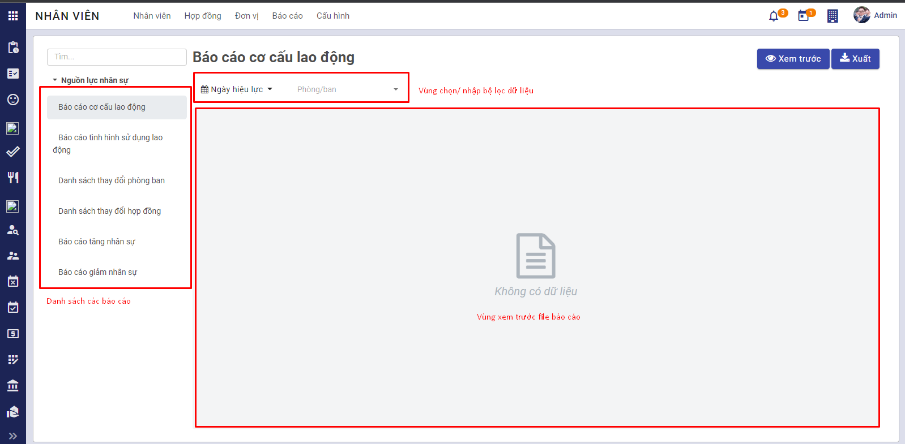
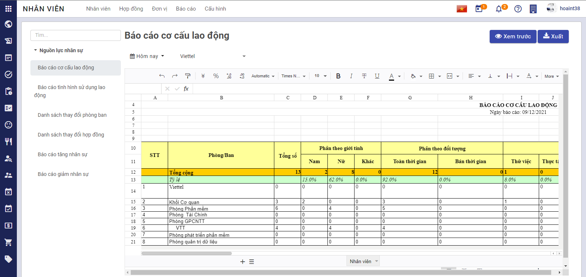

# Managing employee records

## Process description

### Procedure

- A new employee is recruited, being approved by the HR manager and the Board of Directors
- The HR assistant updates the employee's status from *Candidate* to *Employee*
- The HR assistant creates an account for the employee with personal record and proposes a new contract
- Onboarding process is carried out, the new employee update his/her personal record
- The HR assistant reviews and completes the employee record, then updates his/her work history
- The HR assistant exports necessary HR reports

### Process flows

<!-- - Recruiting. More details [here](../../saas/saas/#bat-dau-su-dung-he-thong-vess) -->
- Creating accounts. More details [here](#creating-accounts)
- Creating employee records. More details [here](#creating-employee-records).
- Updating information in employee records. More details [here](#updating-employee-records).
- Exporting HR reports. More details [here](#exporting-hr-reports)

## Creating accounts

**Procedure**

**Step 1:** Select **Settings**>**Users & Companies**>**Users**.

**Step 2:** Enter account information

- In **User types** select **Internal User**
- In **Human Resources>Employees** select:
    - **Officer:** If this account belongs to a HR assistant
    - **Administrator:** If this account belongs to the HR manager or a member of the Board of Directors
    - **Empty:** If this account belongs to a normal employee with no authorization in **Employee** module

**Note:** In order to be able to use **Employee** module, an account must be properly authorized depending on the employee's job postion.

**Step 3**: After registering successfully, the employee needs to get login credentials from the mail address registered with the account. Use the credentials to log in to the system

**Step 4**: Select **Employees** submodule.

## Creating employee records

**User:** HR assistant.

**Step 1:** Select **Employees>Create**

Enter information for an employee record:

- Personal information such as:
    - Full name
    - Gender
    - Date of birth
    - Place of birth
    - Place of origin
    - Place of permanent residence
    - National ID: date of issue, place of issue
    - Marital status
    - Ethnicity
    - Religion
    - Educational level
    - ...

- Job information:
    - Job position
    - Department/division
    - Line manager
    - Login account

**Note:** The employee code will be automatically generated after an employee record is successfully created.

**Updating multiple records:**

The **Import records** allows updating multiple employee records at the same time. The procedure is as follows:

- Select **Employees** module > **Employees** tab: A list of employees will be displayed. Select  **Favorites** > **Import records**
  
- Click **Import Template for Employees** to download the template for data entry 
- Enter employee data into this template. 
- Click  >> the following screen will be displayed  In this screen, the HR assistant can review the input data and perform data validation by clicking **Test** >> Errors will appear if there is something wrong with the input data >> The HR assistant needs to correct these errors in the template then click  to reupload the file >> Continue clicking **Test** and correcting the file until this notification  shows up.
- Click  to import all data to the system >> This notification **Thêm bản ghi thành công** will be displayed

**Step 2:** In **Contracts** tab, select **Create** to create new contracts for employees. New contracts after being created and approved will be added to **Job History** tab

A new employee will be created without a contract, so the HR assistant needs to select **Propose** to propose a new contract for that employee.

- In **Employees**, select an employee to create contracts, information such as the employee's job position or department will be automatically imported

- In **Contract Infos** section, enter contract information for the employee, and enter information about position salary and base salary in **Salaries Info** section

- Contracts after being created and approved will be displayed in **Job History** tab

**Step 3:** Enter family information in **Family Information** and **Family Allowances** tabs

- In **Family Information** tab, enter information about the employee's family members. A family member can be registered as a dependent for PIT deduction.
  Select **Add a line** and enter family information for the employee

Information about the employee's family members will also be used in **Family Allowances** tab.

- In **Family Allowances** tab, select **Edit>Add a line** to register a dependent. A dependent has to be one of the previously created family members.

  

**Step 4:** Enter the allowances that the employee is eligible for in their job, if any

- In **Allowances** tab, select **Edit>Add a line**, create allowances and the periods in which the employee is eligible for each respective allowance.

**Note:** An employee is eligible for several allowances in a period, however, the periods of a particular type of an allowance must not overlap.

- Example: An employee is eligible for a mobile allowance of 120.000 VND from 01/01/2021 to 31/12/2021, he/she can still be eligible for other allowances such as lunch/fuel/housing allowances, but he/she won't be eligible for another mobile allowance.

**Step 5:** Enter information about social insurance in **Insurance Infos** tab

Click **Edit>Add a line**, enter information about the employee's base salary

The amount of social insurance contributions that the employer and the employee need to make will be automatically calculated. This can be changed by selecting **Add a line**.

Click **Save** after finishing entering information.

The **Digital Workplace** module allows employees to update their records themselves via a smartphone app, making it easier for the work of HR assistants.

If employees are allowed to edit their records, follow **Step 1b**

**Step 1b:** The HR assistant creates a new account for the employee in **Settings>Users & Companies>Companies**

Select **Create Employee** to create a new employee record, enter information about job position, department/division and line manager of the employee, and click **Save**

The employee will need to log in to the system with the account created by the HR assistant to update his/her record. Data in the record will be reviewed by the HR assistant and the employee still can make changes to his/her record in the future.

[Return to **Step 2**](#step-2) to continue.

## Updating employee records

Throughout an employee's work history in the company, his/her record will have several changes about personal information, contracts, pay, achievements, ... These changes will all be recorded by the HR assistant in **Employee** module.

### Updating employee achievements

**User**: HR assistant

**Procedure**

**Step 1:** Search for an employee in **List of employee** screen

**Step 2:** In **Achievement** tab, select **Edit>Add a line**, and update the employee's achievements in his/her job.

### Transfer, appointment and dismissal decisions

**User**: HR assistant

**Procedure**

**Step 1:** Search for an employee in **List of employee** screen

**Step 2:** In **Job History** tab, select **Edit>ADD**, update information about position changes of the employee such as: Appointment, dismissal, transfer, reception

- Appointment: Information about job position and department can be changed
- Reception: Information about contracts is NOT to be changed
- Transfer: Information about job position, department, position salary and base salary can be changed

### Pay raise decisions

**User**: HR assistant

**Procedure**

**Step 1:** Search for an employee in **List of employee** screen

**Step 2:** In **Job History** tab, select **Edit>ADD**, update information about pay such as: Periodical pay raise, unexpected pay raise, base salary raise.

- Periodical pay raise: Information about position pay and base salary can be changed
- Unexpected pay raise: Information about position pay and base salary can be changed
- Base salary raise: Information about position pay and base salary can be changed

### Work history, business travel, maternity leaves, long leaves

**User**: HR assistant

**Procedure**

**Step 1:** Search for an employee in **List of employee** screen

**Step 2:** In **Job History** tab, select **Edit>ADD**, update information about the employee's long leaves such as: Maternity leaves, long sick leaves, pre-retirement leaves, temporary contract suspensions.

- Maternity leaves: Information about contracts is NOT to be changed
- Long sick leaves: Information about contracts is NOT to be changed
- Pre-retirement leaves: Information about contracts is NOT to be changed
- Temporary contract suspensions: Information about contracts is NOT to be changed

### Updating family allowances

**User**: HR assistant

**Procedure**

**Step 1:** Search for an employee in **List of employee**

**Step 2:** In **Family Allowance** tab, select **Edit>Add a line** and update information about the employee's dependents

### Updating employee experience & skills

**User**: HR assistant

**Procedure**

**Step 1:** Search for an employee in **List of employee**

**Step 2:** In **Resumé Page** tab, select **Edit>CREATE A NEW ENTRY**, update information about the employee's experience (outside of the company), certifications and skills that the employee has acquired when working for the company

- Experience: Experience before recruitment, degrees, certifications
    - Type: Experience, education (degrees) and certifications
    - Start date
    - End date
  

- Skills: Hard skills and soft skills
    - Type: Categorized into types such as Music, Languages, Marketing, ...
    - Skill: Particular skills in a type
    - Level
  

### Updating attendances

Attendance records will be stored and synchronized in **Time Off** tab, including approved/declined/draft requests.

### Updating contracts and work history

When an employee's contract is reaching its end date, the system will send notices to the employee so that another contract can be proposed should he/she want to continue working for the company.

​**Procedure:**

- The HR assistant will propose another contract for an employee whose contract is expiring.
- The HR manager approves/declines the proposed contracts. If the contract is approved, it will be update into the employee's work history.
- If the employee wants to stop working for the company, the HR assistant needs to update the employee's work status to **Departed**

#### Proposing contracts

**User**: HR assistant

**Step 1:** Select **Employees>Contract alerts**

**Step 2:** A list of employees without contracts or with expiring contracts will be displayed here.

- Click **Propose** to propose new contracts.

- New contracts are created, awaiting approval from the HR manager

#### Approving/Declining proposed contracts

**User:** HR manager

**Procedure**

**Step 1:** Log in to the system, select **Employees>Contracts**

**Step 2:**

- The HR manager reviews contracts in **New** columns and approves by clicking **Approve** or declines by clicking **Cancel**.
- Approved contracts will be moved to **Approved** column.
    - If the date of approval is the start date of the contract, the contract will be moved to **Running** column.
    - If the date of approval is prior to the start date of the contract, the contract will be moved to **Running** column on the start date.
- Declined contracts will be moved to **Cancelled** column.

#### Contract termination (Voluntary)

If an employee with an expiring contract or an employee with an indefinite contract wants to stop working for the company, the HR assistant needs to update his/her work status in **Job History**

**User**: HR assistant

**Procedure**

**Step 1:** Search for an employee in **List of employees** screen

**Step 2**: Select **Edit>Job History>ADD**, enter information about contract termination for the employee

**Step 3:** Select **Save & Close**, the employee's work status will be updated to **Departed**, the employee record will be added to archive. In case the employee returns to work for the company again, the record can be restored so that the HR assistant doesn't have to create another record, only needs to update the existed record should there be any changes.

## Exporting HR reports

- **Purpose:** Preview and export HR reports

- **User:** HR assistant

- **Procedure:**

    - Select **Employees** > **Report** > The following screen will be displayed

    

    - Select a report > Apply filter > Click **Preview** to preview the report or click **Export** to download the report file. Below is an example of a report on the company's labor force structure.

    

- **Details of reports:**
    - *Report on labor force structure:* Shows statistics for labor force structure of each department/division in the company at a time selected by the user. Statistics depends on employees' work history.
    - *Report on labor utilization:* Shows labor utilization, changes in salary, number of labourers in a period.
    - *Report on department changes:* Shows changes about personnel of a department/division in a period selected by the user.
    - *Report on contract changes:* Shows employees of a department/division whose contracts have changed in the period selected by the user.
    - *Report on changes in the number of staff:* Show changes in the number of staff of a department/division in a period selected by the user.
