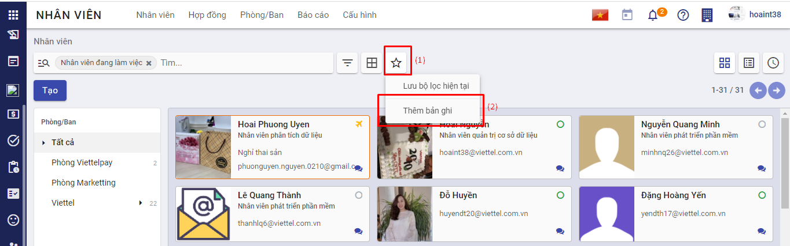
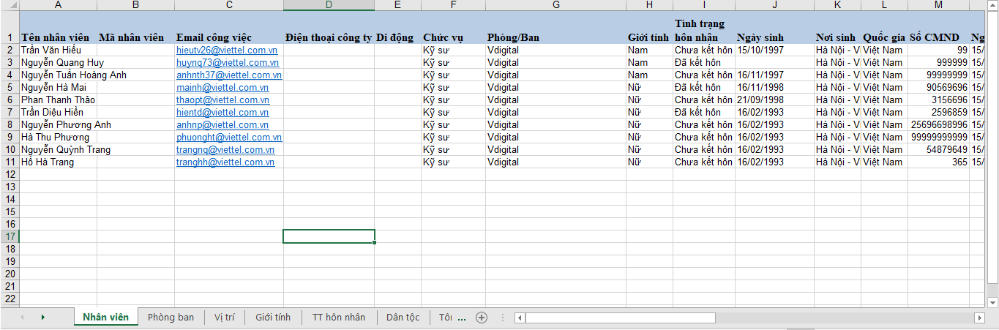
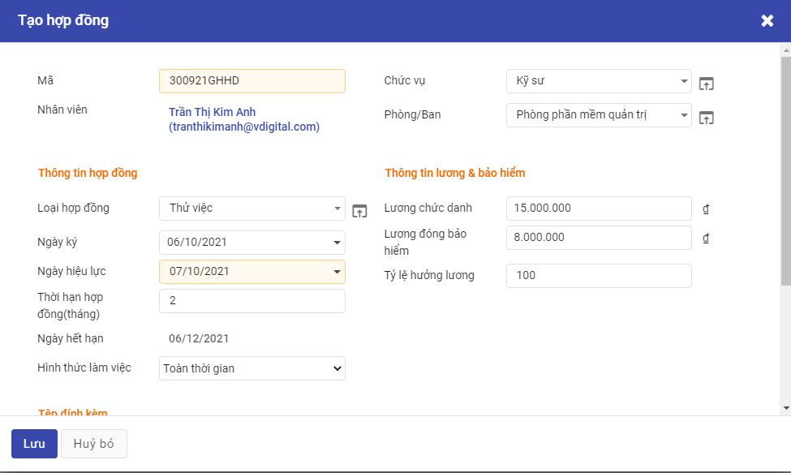
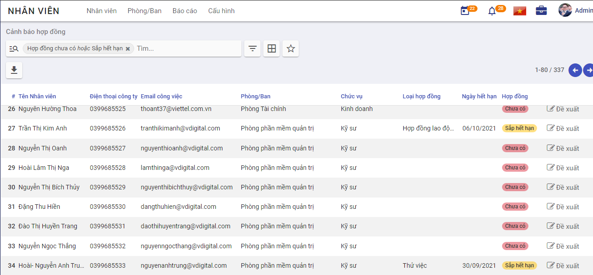

# Quản lý hồ sơ nhân viên

## Mô tả nghiệp vụ

### Quy trình nghiệp vụ

- Công ty có nhân sự mới, đã được Trưởng bộ phận quản lý nhân sự cùng Ban Giám đốc phê duyệt đồng ý tuyển dụng.
- Nhân viên nhân sự thực hiện việc chuyển trạng thái từ Ứng viên sang Nhân viên công ty.
- Nhân viên nhân sự thực hiện tạo tài khoản đăng nhập cho nhân viên mới, tạo hợp đồng, nhập các thông tin liên quan đến nhân sự mới.
- Nhân viên mới thực hiện quy trình Onboarding, cập nhật thông tin cá nhân vào ngày đầu làm việc.
- Nhân viên nhân sự kiểm tra và hoàn thiện hồ sơ nhân viên mới, thực hiện cập nhật thông tin trong quá trình làm việc của nhân viên.

### Luồng chức năng chính

- Tuyển dụng nhân viên mới. Chi tiết [tại đây](../../saas/saas/#bat-dau-su-dung-he-thong-vess)
- Tạo tài khoản đăng nhập. Chi tiết [tại đây](#tao-tai-khoan)
- Thêm mới hồ sơ nhân viên. Chi tiết [tại đây](#them-moi-ho-so-nhan-vien).
- Cập nhật thông tin trong quá trình làm việc của nhân viên. Chi tiết [tại đây](#cap-nhat-ho-so-nhan-vien).

## Tạo tài khoản

**Các bước thực hiện**

**Bước 1:** Vào phân hệ **Thiết lập**>**Người dùng & công ty**>**Người dùng**.

**Bước 2:** Khai báo thông tin tài khoản đăng nhập

- Tại mục **Loại người dùng** chọn **Người sử dụng nội bộ**

- Tại **Nguồn lực nhân sự>Nhân viên** chọn:
  - **Cán bộ:** Nếu tài khoản là của nhân viên quản lý nhân sự
  - **Người quản trị:** Nếu tài khoản là của trưởng phòng quản lý nhân sự hoặc Ban Giám đốc
  - **Bỏ trống:** Nếu tài khoản của nhân viên không có phận sự liên quan đến phân hệ Nhân viên.

**Lưu ý:** Để sử dụng được phân hệ Nhân viên, tài khoản đăng nhập vào hệ thống phải được cấp quyền truy cập, tùy thuộc vào vị trí công việc của nhân viên mà tài khoản đăng nhập của họ được gán quyền tương ứng.

**Bước 3**: Sau khi “Đăng ký sử dụng thành công”, khách hàng mở hòm thư được khai báo khi đăng ký để lấy thông tin tài khoản truy cập. Khách hàng sử dụng thông tin này để đăng nhập vào chương trình (hướng dẫn đăng ký tại đây)

**Bước 4**: Chọn ứng dụng **Nhân viên**.

## Thêm mới hồ sơ nhân viên

**Đối tượng thực hiện:** Nhân viên nhân sự.

**Bước 1:** Nhân viên quản trị nhân lực vào phân hệ **Nhân viên>Tạo**

Sau đó thực hiện khai báo thông tin của nhân viên:

- Khai báo thông tin cá nhân cơ bản về nhân viên (căn cứ vào Sơ yếu lý lịch) như: họ tên, giới tính, ngày sinh, nơi sinh, nguyên quán, hộ khẩu thường trú, số CMND, ngày cấp, nơi cấp, trình trạng hôn nhân, dân tộc, tôn giáo, trình độ văn hóa, trình độ đào tạo, trường đào tạo…
- Khai báo thông tin công việc của nhân viên: chức danh, phòng ban, người quản lý, tài khoản đăng nhập của nhân viên.  

**Lưu ý :** Mã nhân viên sẽ được hệ thống tự sinh sau khi người dùng hoàn thành thao tác thêm mới hồ sơ nhân viên.

**Hướng dẫn nhập nhiều bản ghi:** 

Trong trường hợp người dùng muốn thực hiện nhập nhiều nhân viên thì sử dụng tính năng "Thêm bản ghi" trên hệ thống. Các bước thực hiện như sau:

- Vào menu Nhân viên >> Nhân viên: Hệ thống hiển thị màn hình danh sách nhân viên. Người dùng chọn  Yêu thích >> Thêm bản ghi 

   

- Tại đây, người dùng bấm "Tải biểu mẫu danh sách nhân viên" để tải xuống file mẫu nhập dữ liệu 
- Người dùng nhập dữ liệu thông tin nhân viên vào file excel. 
- Trên giao diện phần mềm, người dùng bấm nút  >> hệ thống hiển thị màn hình như sau  Tại đây người dùng kiểm tra thông tin dữ liệu, và bấm nút **Kiểm thử** để hệ thống kiểm tra dữ liệu trước khi nhập >> Hệ thống tự động kiểm tra và thông báo kết quả lỗi dữ liệu lên màn hình >> Người dùng đọc thông báo và điều chỉnh dữ liệu trên file excel để chính xác, sau đó bấm  để tải lại file sau khi chỉnh sửa dữ liệu >> Tiếp tục bấm **Kiểm thử** để kiểm tra cho đến khi kết quả hệ thống kiểm tra thông báo là  
- Người dùng bấm nút  để thực hiện nạp dữ liệu vào hệ thống >> Hệ thống ghi nhận dữ liệu và hiển thị thông báo Thêm bản ghi thành công

**Bước 2:** Tại tab **Hợp đồng**, người dùng chọn **Tạo** để thêm mới hợp đồng cho nhân viên. Hợp đồng sau khi tạo và duyệt tại đây sẽ được tự động sinh dữ liệu ở tab **Quá trình làm việc**

Nhân viên mới sau khi được thêm sẽ được sinh dữ liệu tại màn hình Hợp đồng, trạng thái là **Chưa có**, nhân viên nhân sự chọn **Đề xuất**, hệ thống chuyển đến màn hình tạo hợp đồng mới.

- Tại mục **Nhân viên** chọn nhân viên cần tạo hợp đồng, sau khi chọn nhân viên, hệ thống sẽ tự động lấy các thông tin đi kèm của nhân viên như **Chức vụ, Phòng ban**

- Tại phần **Thông tin hợp đồng**, nhập các thông tin về hợp đồng với nhân viên đó, các thông tin về lương và bảo hiểm nhập tại phần **Thông tin hợp đồng**

- Hợp đồng sau khi tạo và duyệt tại đây sẽ được tự động sinh dữ liệu ở tab **Quá trình làm việc**

**Bước 3:** Khai báo thông tin về gia đình tại tab **Quan hệ gia đình** và **Giảm trừ gia cảnh**

- Tại tab **Quan hệ gia đình** , cho phép khai báo thông tin những người thân của nhân viên. Đồng thời theo dõi được những đối tượng thuộc diện giảm trừ gia cảnh của nhân viên để phục vụ cho công tác tạm tính thuế TNCN hàng tháng của nhân viên.

  Người dùng chọn **Thêm một dòng**, và thực hiện khai báo thông tin

​		Sau khi người dùng chọn **Lưu**, các thông tin này được lưu và sẽ được sử dụng tiếp tại tab **Giảm trừ gia cảnh**

- Tại tab **Giảm trừ gia cảnh**, người dùng bấm **Sửa>Thêm một dòng**, để thêm người phụ thuộc, người sử dụng chọn dữ liệu có sẵn đã được khai báo trước đó trong thanh dữ liệu. 

  

**Bước 4:** Khai báo các khoản phụ cấp mà nhân viên có thể được nhận trong quá trình công tác tại Công ty. Nếu không có phụ cấp, nhân viên nhân sự có thể bỏ trống không nhập dữ liệu

- Tại tab **Phụ cấp**, người dùng bấm **Sửa>Thêm một dòng**, khai báo các khoản phụ cấp và khoảng thời gian nhân viên được nhận phụ cấp.

**Lưu ý:** Một nhân viên trong một quá trình có thể được nhận nhiều loại phụ cấp, tuy nhiên, một loại phụ cấp không được trùng lặp quá trình. 

- Ví dụ: Nhân viên được nhận phụ cấp điện thoại từ ngày 01/01/2021 - 31/12/2021 là 120.000 VNĐ, thì trong khoảng thời gian này nhân viên có thể nhận phụ cấp khác (ăn trưa, xăng xe, nhà ở) nhưng không được nhận thêm khoản phụ cấp điện thoại nào nữa. 

**Bước 5:** Khai báo thông tin liên quan đến BHXH tại tab **Thông tin BHXH**

Người dùng bấm **Sửa>Thêm một dòng**, khai báo các thông tin lương BHXH của nhân viên

Hệ thống tự động tính ra khoản NSDLD đóng cho nhân viên và NLD đóng, các trường thông tin này có thể được cập nhật trong quá trình nhân viên làm việc có sự biến đổi về mức lương cơ bản bằng cách chọn **Thêm một dòng**.

Sau khi hoàn thiện, người dùng bấm **Lưu** để hệ thống lưu lại toàn bộ dữ liệu về nhân viên đã được khai báo.

Với doanh nghiệp có sử dụng nền tảng Digital Workplace, việc tạo hồ sơ nhân viên sẽ nhanh hơn, chuẩn xác nếu các thông tin cá nhân do chính nhân viên tự nhập thông qua điện thoại thông minh. 

Nhân viên chủ động nhập hồ sơ của mình, thì làm theo **Bước 1b**

**Bước 1b:** Nhân viên quản trị nhân lực vào phân hệ **Thiết lập>Người dùng & công ty>Công ty** để tạo tài khoản đăng nhập cho nhân viên mới, cách làm tương tự như **Tạo tài khoản** 

Nhân viên nhân sự tiếp tục chọn **Tạo nhân viên** để thực hiện tạo mới một hồ sơ nhân viên trên hệ thống, nhập các thông tin về chức vụ, phòng/ban, người quản lý của nhân viên mới và bấm **Lưu**

Đến đây, nhân viên sẽ dùng tài khoản được cấp, và thực hiện đăng nhập lên phần mềm VESS trên điện thoại, và thực hiện nhập các thông tin cá nhân của mình. Sau khi nhân viên ấn **Cập nhật** hệ thống sẽ tự động đồng bộ vào hồ sơ nhân viên. Các dữ liệu này sẽ được nhân viên nhân sự kiểm tra và có thể chỉnh sửa nếu sau này nhân viên có nhu cầu thay đổi về thông tin cá nhân.

Các bước tiếp theo vui lòng [quay lại **Bước 2**](#Bước 2)

## Cập nhật hồ sơ nhân viên

Trong quá trình công tác tại Công ty, nhân viên sẽ có các thông tin thay đổi và cần cập nhật trên hệ thống như biến động về Thông tin cá nhân, Hợp đồng, Lương, Thành tích, Quá trình làm việc. Những sự thay đổi này đều được nhân viên nhân sự ghi lại bằng cách cập nhật thông tin hồ sơ nhân viên trong phân hệ Nhân viên.

### Cập nhật thành tích của nhân viên

**Đối tượng thực hiện**: Nhân viên nhân sự

**Các bước thực hiện**

**Bước 1:** Tìm kiếm nhân viên cần cập nhật thông tin tại màn hình **Danh sách nhân viên**

**Bước 2:** Tại tab **Thành tích** chọn **Sửa>Thêm một dòng**, thực hiện cập nhật thông tin thành tích mà nhân viên đó đã đạt được trong quá trình công tác.

### Các quyết định điều chuyển, bổ nhiệm, miễn nhiệm

**Đối tượng thực hiện**: Nhân viên nhân sự

**Các bước thực hiện**

**Bước 1:** Tìm kiếm nhân viên cần cập nhật thông tin tại màn hình **Danh sách nhân viên**

**Bước 2:** Tại tab **Quá trình làm việc** chọn **Sửa>Thêm mới**, thực hiện cập nhật thông tin về sự thay đổi về chức danh của nhân viên trong quá trình làm việc như: Bổ nhiệm, Miễn nhiệm, Điều chuyển, Tiếp nhận

- Bổ nhiệm: Nhân viên nhân sự được phép thay đổi thông tin về Chức danh - đơn vị
- Tiếp nhận: Nhân viên nhân sự không được phép thay đổi thông tin trong hợp đồng
-  Điều chuyển: Nhân viên nhân sự được phép thay đổi thông tin về Chức danh - đơn vị, Lương và bảo hiểm

### Các quyết định nâng lương

**Đối tượng thực hiện**: Nhân viên nhân sự

**Các bước thực hiện**

**Bước 1:** Tìm kiếm nhân viên cần cập nhật thông tin tại màn hình **Danh sách nhân viên**

**Bước 2:** Tại tab **Quá trình làm việc** chọn **Sửa>Thêm mới**, thực hiện cập nhật thông tin về lương của nhân viên như: Nâng lương hàng kỳ, Nâng lương đột xuất, Nâng lương bảo hiểm.

- Nâng lương hàng kỳ: Nhân viên nhân sự được phép thay đổi thông tin về Lương và bảo hiểm
- Nâng lương đột xuất: Nhân viên nhân sự được phép thay đổi thông tin về Lương và bảo hiểm
- Nâng lương bảo hiểm: Nhân viên nhân sự được phép thay đổi thông tin về Lương và bảo hiểm

### Quá trình làm việc, công tác, nghỉ thai sản, nghỉ dài ngày

**Đối tượng thực hiện**: Nhân viên nhân sự

**Các bước thực hiện**

**Bước 1:** Tìm kiếm nhân viên cần cập nhật thông tin tại màn hình **Danh sách nhân viên**

**Bước 2:** Tại tab **Quá trình làm việc** chọn **Sửa>Thêm mới**, thực hiện cập nhật thông tin về quá trình nghỉ dài ngày của nhân viên như: Nghỉ thai sản, Nghỉ ốm dài ngày, Nghỉ chờ hưu, Nghỉ tạm hoãn hợp đồng

- Nghỉ thai sản: Nhân viên nhân sự không được phép thay đổi thông tin trong hợp đồng
- Nghỉ ốm dài ngày: Nhân viên nhân sự không được phép thay đổi thông tin trong hợp đồng
- Nghỉ chờ hưu: Nhân viên nhân sự không được phép thay đổi thông tin trong hợp đồng
- Nghỉ tạm hoãn hợp đồng: Nhân viên nhân sự không được phép thay đổi thông tin trong hợp đồng

### Cập nhật giảm trừ gia cảnh

**Đối tượng thực hiện**: Nhân viên nhân sự

**Các bước thực hiện**

**Bước 1:** Tìm kiếm nhân viên cần cập nhật thông tin tại màn hình **Danh sách nhân viên**

Bước 2: Tại tab **Giảm trừ gia cảnh** chọn **Sửa>Thêm một dòng**, thực hiện thay đổi thông tin người phụ thuộc của nhân viên

### Cập nhật kinh nghiệm và kỹ năng

**Đối tượng thực hiện**: Nhân viên nhân sự

**Các bước thực hiện**

**Bước 1:** Tìm kiếm nhân viên cần cập nhật thông tin tại màn hình **Danh sách nhân viên**

**Bước 2:** Tại tab **Kinh nghiệm và kỹ năng** chọn **Sửa>Thêm mới**, thực hiện cập nhật thông tin về kinh nghiệm (ngoài công ty), chứng chỉ mà nhân viên đã đạt được trong quá trình làm việc, các kỹ năng bên cạnh kỹ năng liên quan đến công việc mà còn kỹ năng mềm của nhân viên

- Kinh nghiệm: lưu trữ các thông tin về kinh nghiệm trước khi được tuyển dụng vào công ty, nhân viên đã học qua trường, chứng chỉ, đạt được bằng cấp nào.

  - Loại: gồm có 3 loại Kinh nghiệm (Experiance), Trình độ (Education), Chứng chỉ (Certification)
  - Ngày bắt đầu: ngày bắt đầu làm việc/học tập
  - Ngày kết thúc: ngày kết thúc làm việc/học tập

  

- Kỹ năng: lưu trữ thông tin về kỹ năng phục vụ cho công việc, kỹ năng mềm (hát, đàn, ngoại ngữ)

  

  + Loại kỹ năng: các nhóm loại kỹ năng về Âm nhạc, Ngoại ngữ, Marketing, .....
  + Kỹ năng: tên kỹ năng 
  + Cấp kỹ năng: lựa chọn cấp kỹ năng 

### Cập nhật đăng ký công

Các đăng ký công (xin nghỉ phép, tăng ca, nghỉ việc riêng, nghỉ không lương,...) của nhân viên thực hiện đăng ký trên điện thoại cá nhân sẽ được đồng bộ và ghi lại trong tab Đăng ký công, kể cả các đơn được duyệt, bị từ chối, đơn nháp.

### Cập nhật hợp đồng, quá trình làm việc của nhân viên

Nhân viên ký hợp đồng có thời hạn trước khi đến hạn kết thúc hợp đồng cũ, hệ thống sẽ đưa ra cảnh báo các hợp đồng sắp hết hạn để nhân viên nhân sự thực hiện đề xuất hợp đồng lên cấp trên nếu nhân viên có ý định ký tiếp hợp đồng với công ty.

​		**Quy trình nghiệp vụ:**

- Nhân viên có hợp đồng sắp đến ngày hết hạn, nhân viên nhân sự sẽ thực hiện đề xuất hợp đồng.
- Trưởng phòng nhân sự vào thực hiện phê duyệt/từ chối hợp đồng đề xuất. Sau khi hợp đồng được phê duyệt, dữ liệu sẽ được cập nhật vào quá trình làm việc của nhân viên.
- Nhân viên không muốn ký tiếp hợp đồng với công ty hoặc nhân viên có hợp đồng vô thời hạn muốn nghỉ việc, nhân viên nhân sự thực hiện cập nhật trạng thái là nghỉ việc.

#### Đề xuất hợp đồng

**Đối tượng thực hiện**: Nhân viên nhân sự

**Bước 1:** Vào phân hệ **Nhân viên>Cảnh báo hợp đồng**

**Bước 2:** Tại đây hệ thống sẽ hiển thị toàn bộ danh sách các nhân viên chưa có hợp đồng hoặc hợp đồng sắp đến hạn kết thúc hợp đồng hiện tại. 

- Nhân viên nhân sự thực hiện đề xuất hợp đồng mới, bằng cách chọn nút **Đề xuất**. 

- Hợp đồng sau khi Lưu sẽ chuyển sang trạng thái **Mới**, chờ Trưởng phòng nhân sự vào duyệt.

#### Phê duyệt/Từ chối hợp đồng được đề xuất

**Đối tượng thực hiện:** Trưởng phòng nhân sự

**Các bước thực hiện**

**Bước 1:** Đăng nhập hệ thống, vào phân hệ **Nhân viên>Hợp đồng**

**Bước 2:** 

- Tại cột **Mới**, Trưởng phòng nhân sự thực hiện review hợp đồng, nếu đồng ý phê duyệt thì chọn **Phê duyệt**, nếu không đồng ý thì chọn **Hủy**
  - Hợp đồng được phê duyệt sẽ chuyển sang cột **Đã duyệt**.
    - Nếu ngày phê duyệt là ngày hợp đồng có hiệu lực thì hợp đồng sẽ chuyển sang cột **Đang chạy** luôn.
    - Nếu ngày phê duyệt < ngày hợp đồng có hiệu lực thì hợp đồng sẽ tự động chuyển sang cột **Đang chạy** vào ngày hợp đồng có hiệu lực.
  - Hợp đồng không được duyệt sẽ chuyển vào cột **Đã hủy**

#### Kết thúc hợp đồng (Nhân viên nghỉ việc)

Nếu nhân viên không có ý định ý tiếp với công ty, khi hợp đồng đến ngày hết hạn, hoặc nhân viên có hợp đồng vô thời hạn muốn nghỉ việc, nhân viên nhân sự sẽ thực hiện cập nhật trạng thái nghỉ việc của nhân viên trong màn hình **Quá trình làm việc**

**Đối tượng thực hiện**: Nhân viên nhân sự

**Các bước thực hiện**

**Bước 1:** Tìm kiếm nhân viên muốn cập nhật trạng thái **Nghỉ việc**

**Bước 2**: Chọn nhân viên và chọn **Sửa>Quá trình làm việc>Thêm mới** sau đó nhập các thông tin về quyết định chấm dứt hợp đồng với nhân viên

**Bước 3:** Chọn **Lưu và đóng**, nhân viên này sẽ có trạng thái là Nghỉ việc, nhân viên nhân sự thực hiện Lưu trữ nhân viên nghỉ việc. Việc lưu trữ hoàn toàn có thể khôi phục được lại hồ sơ nhân viên, trong trường hợp nhân viên quay trở lại làm việc cho công ty, khi đó nhân viên nhân sự sẽ không tốn nỗ lực nhập lại hồ sơ thông tin mà chỉ cần thay đổi các thông tin cần thiết (nếu có).
