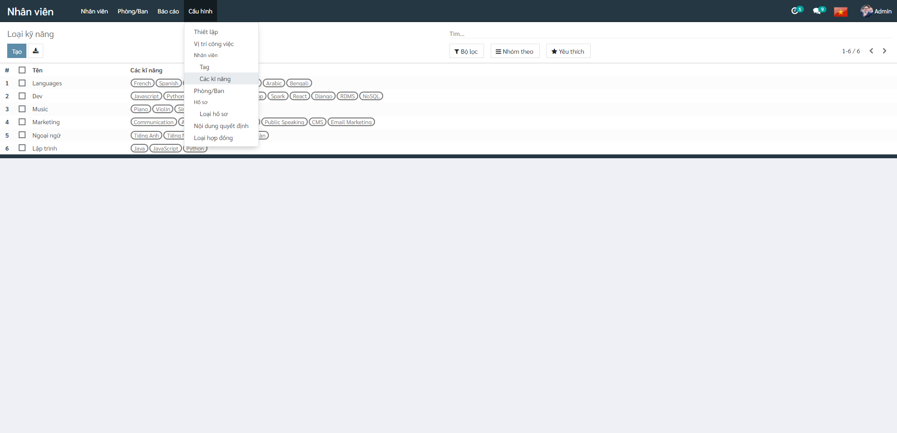

# Job positions

Users can create job positions in this section.

**Procedure**

**Step 1:** Select **Configuration**, select **Job Positions**, click ***Create***

**Step 2:** Enter detailed information for the position

- Position name
- Job description
- Department
- Expected number of employees for the position

# Experience & Skills

Users can create skills and types of skills in this section.

**Procedure**

**Step 1:** Select **Configuration**, select **Skills**, click ***Create***

**Step 2:** Enter detailed information for the type of skills

At **Levels** section, enter a level for the skill (as a percentage or as a score)

