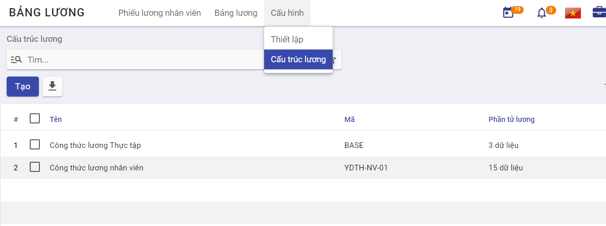
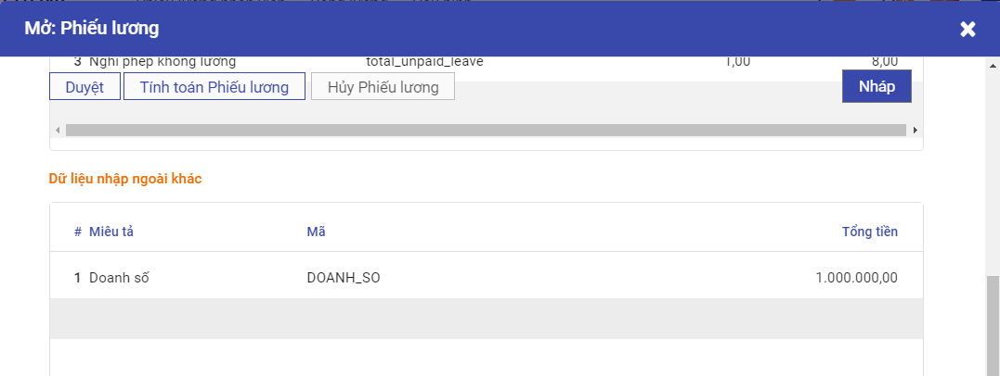
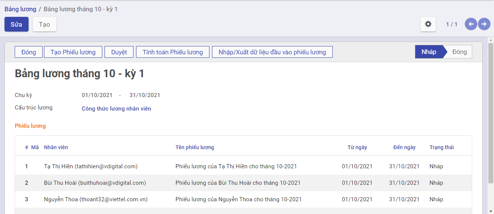

# Quản lý Tính lương

## **Mô tả nghiệp vụ**

**Quy trình tổng quan** 

- Nhân viên phụ trách tính lương thực hiện nhập các dữ liệu đầu vào cấu thành bảng lương như: dữ liệu chấm công nhật, dữ liệu tính công làm thêm, công theo ca, các khoản phụ cấp, các khoản khấu trừ,...Bên cạnh đó, nhân viên phụ trách cần tạo các thông số mặc định liên quan đến bảng lương như: Lương chức danh, lương bảo hiểm, thuế TNCN, người phụ thuộc, ... ở trong phân hệ Quản lý Nhân viên
- Nhân viên tính lương xây dựng dữ liệu phần tử lương, cấu trúc lương áp dụng cho toàn công ty hoặc áp dụng cho từng bộ phận nhân viên của công ty. Mỗi cấu trúc lương thì bao gồm các thành phần (phần tử) lương khác nhau, phụ thuộc vào từng vị trí công việc.
- Hàng tháng, nhân viên tính lương tạo bảng lương (áp dụng cho toàn bộ công ty hoặc từng bộ phận nhân viên của công ty). Bảng lương là thang bảng được lập ra để tập hợp và phân bổ tiền lương thực tế phải trả gồm tiền lương, tiền công, tiền thưởng, các loại phụ cấp và các khoản bảo hiểm.
- Nhân viên tính lương thực hiện gửi bảng lương cho các nhân viên khác để họ xác nhận và phản hồi. Sau đó, nhân viên tính lương thực hiện gửi bảng lương đã được xác nhận đến bộ phận kế toán để thực hiện chi trả lương cho nhân sự công ty.

**Luồng quy trình**

- Quy trình tạo dữ liệu đầu vào.
- Quy trình tạo cấu trúc lương. 
- Quy trình tạo bảng lương.

## Tạo dữ liệu lương

Để lập được bảng lương, nhân viên phụ trách cần tạo dữ liệu tính lương trước, các dữ liệu này bao gồm dữ liệu đầu vào và thông số mặc định.

**Đối tượng thực hiện:** Nhân viên phụ trách tính lương.

### Tạo thông số mặc định

Các thông số mặc định của một nhân viên bao gồm: Lương chức danh, lương bảo hiểm, người phụ thuộc. Những thông tin này đã được khai báo tại Hồ sơ nhân viên trước đó, nếu chưa được bổ sung, nhân viên phụ trách vào phân hệ Nhân viên để bổ sung đầy đủ thông số. Quy trình nghiệp vụ, xem tại đây.

### Tạo dữ liệu chấm công đầu vào

Các dữ liệu về chấm công sẽ được lấy từ phân hệ Chấm công (quy trình nghiệp vụ xem tại đây), bao gồm các loại công như sau:

- Công tiêu chuẩn: Số ngày công tiêu chuẩn đi làm trong tháng
- Công đi làm: Số ngày công đi làm thực tế trên công ty
- Công làm online: Số ngày công đi làm online đã được ghi nhận
- Công tăng ca: Số ngày công tăng ca đã được phê duyệt
- Công tăng ca đêm: Số ngày công làm tăng ca đêm
- Công tăng ca lễ: Số ngày công làm tăng ca ngày lễ
- Công công tác: Số ngày công đi công tác
- Công nghỉ dưỡng: Số ngày công nghỉ dưỡng
- Công nghỉ không lương: Số ngày công nghỉ không lương
- Công nghỉ lễ: Số ngày công nghỉ lễ
- Công nghỉ ốm: Số ngày công nghỉ ốm
- Công nghỉ phép: Số ngày công nghỉ phép
- Công nghỉ tai nạ: Số ngày công nghỉ tai nạn
- Công nghỉ thai sản: Số ngày công nghỉ thai sản
- Công nghỉ việc riêng hưởng lương: Số ngày công nghỉ việc riêng hưởng lương

## Tạo cấu trúc tính lương

**Đối tượng thực hiện:** Nhân viên phụ trách tính lương.

**Các bước thực hiện:***

**Bước 1:** Người dùng truy cập vào hệ thống, chọn phân hệ **Tính lương > Cấu hình > Cấu trúc lương**

**Bước 2**: Người dùng thực hiện nhập các thông tin chung về cấu trúc lương

- Tên: Tên cấu trúc lương

- Mã: Mã cấu trúc lương

  Tại bảng phần tử lương, người dùng thực hiện khai báo các phần tử cấu thành nên cấu trúc lương, dựa trên công thức tính lương của công ty và sử dụng các từ khóa tham số ở bảng bên cạnh

  

    - Cột tên: nhập tên phần tử lương sao cho dễ gợi nhớ
    - Cột mã: nhập mã tương ứng với mỗi phần tử, sao cho các phần tử không bị lặp lại mã, và đảm bảo tính chất dễ hiểu, dễ ghi nhớ trong quá trình tạo phần tử và tạo công thức
    - Cột mã Python: là cột lưu giá trị của phần tử lương, hệ thống cung cấp các hàm tính toán đảm bảo việc tính lương bao gồm: 
      + Các phép tính toán: cộng, trừ, nhân, chia
      + Round
      + If
      + ......
  - Nút mũi tên 4 chiều: dùng để di chuyển các phần tử lương sao cho đảm bảo các phần tử thỏa mãn điều kiện: Phần tử sau là kết quả phép tính của các phần tử trước.

## Tạo bảng lương

**Đối tượng thực hiện:** Nhân viên phụ trách tính lương.

Nhân viên phụ trách tính lương tạo xong các dữ liệu tính lương cho nhân sự công ty, thì mới có thể tạo được bảng lương hàng tháng dựa trên các dữ liệu đã tạo.

**Các bước thực hiện:** 

**Bước 1:** Người dùng truy cập vào hệ thống, chọn phân hệ **Tính lương > Bảng lương > Tạo**

- Tên: Nhập tên bảng lương cần tạo.
- Chu kỳ: Chọn thời gian để thực hiện tính toán. 
- Cấu trúc lương: Chọn một cấu trúc lương đã cấu hình sẵn.

**Bước 2:** Chọn **Tạo phiếu lương**, lúc này sẽ mở ra một cửa sổ chọn nhân viên.

- Nếu chọn 1 hoặc 1 nhóm nhân viên thì thực hiện tích chọn vào các ô đầu dòng, hệ thống sẽ chỉ tạo phiếu lương cho các nhóm nhân viên này

  

- Sau đó click **Chọn**

- Nếu chọn toàn bộ nhân viên thì thực hiện chọn vào ô trống trên cùng, hệ thống sẽ thực hiện tạo phiếu lương cho toàn bộ nhân viên

- Sau đó click **Tạo**

  

- Hệ thống sẽ hiển thị các phiếu lương của các nhân viên đã chọn 

  

- Người dùng thực hiện chọn **Tính toán phiếu lương**, khi chọn vào 1 phiếu lương, hệ thống hiển thị phiếu lương chi tiết của nhân viên, lúc này phiếu lương ở trạng thái **Nháp**.

  

**Bước 3:** Người dùng có thể thực hiện Nhập/xuất dữ liệu đầu vào của phiếu lương, dữ liệu đầu vào có thể là lương doanh số, thưởng sinh nhật,...Người dùng chọn **Nhập/xuất dữ liệu đầu vào của phiếu lương>Xuất mẫu**

​	Người dùng thực hiện nhập dữ liệu vào file biểu mẫu, thực hiện Tải tệp đã nhập lên, chọn **Nhập tệp**, dữ liệu được import sẽ được chuyển vào **Chi tiết phiếu lương>Bảng Dữ liệu nhập ngoài khác**.

**Bước 4**: Người dùng chuyển sang tab **Phiếu lương nhân viên** ở đây hiển thị các phiếu lương mà đã thực hiện gửi các phiếu lương cho nhân viên để thực hiện kiểm tra lại thông tin lương trước khi **Duyệt**.

**Bước 5:** Nếu có phản ảnh về thông tin lương, người dùng vào **Phiếu lương nhân viên > Thực hiện chọn phiếu lương được phản ánh > Sửa**

​	Nếu không có phản ánh nào, người dùng vào **Bảng lương > Chọn bảng lương > Chọn Duyệt**

​	Bảng lương sau khi duyệt sẽ được công ty thực hiện chi trả lương cho nhân viên.

​	
