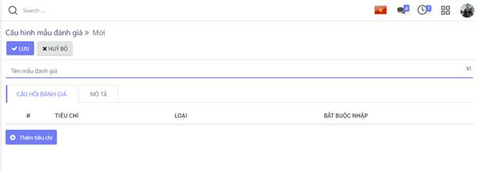

# Hướng dẫn thiết lập và khai báo dữ liệu ban đầu

Việc thiết lập và khai báo ban đầu được thực hiện khi lần đầu cài đặt ứng dụng, giúp khởi tạo dữ liệu và bắt đầu cho việc thực hiện các nghiệp tuyển dụng. 

## Mẫu đánh giá

Chức năng cho phép tạo ra các mẫu đánh giá với các tiêu chí đánh giá ứng viên cho các vị trí tuyển dụng. 

Các vị trí công việc khác nhau thường sẽ có thể có những tiêu chí đánh giá ứng viên khi phỏng vấn tuyển dụng khác nhau. 

**Đối tượng thực hiện**: Quản trị hệ thống , Người phụ trách tuyển dụng

**Các bước thực hiện:**

1. Vào **Cấu hình** > kích**Mẫu đánh giá**

2. Kích **Tạo**: vào màn hình tạo mới mẫu đánh giá 

3. Kích nút **Thêm tiêu chí** để khai báo chi tiết các tiêu chí cho đánh giá

   Ứng dụng hỗ trợ các loại tiêu chí đánh giá gồm: 
   * Số: khi đánh giá sẽ nhập số điểm đánh giá trong giới hạn [giá trị tối thiểu - giá trị tối đa]

     

   * Lựa chọn một: sử dụng với các đánh giá lựa chọn một trong danh sách các kết quả được cấu hình.

     ·     

   * Lựa chọn nhiều: sử dụng với các tiêu chí đánh giá cho phép chọn nhiều phương án.

   * Văn bản: sử dụng với các tiêu chí đánh giá yêu cầu người đánh giá nhập các nội dung đánh giá dạng văn bản như ghi chú, nhận xét ...

4.  Kích **Lưu** để lưu lại dữ liệu mẫu đánh giá. 

## Thiết lập chu trình tuyển dụng

Cho phép thiết lập sẵn các trạng thái có thể của hồ sơ ứng viên trong quá trình tuyển dụng. 

**Đối tượng thực hiện**: Quản trị hệ thống tuyển dụng

**Các bước thực hiện:**

1. Vào **Ứng viên** > kích**Hồ sơ ứng viên**

2. Kích nút **+ Thêm một cột**: để tạo mới một trạng thái 

   

3. Nhập thông tin trạng thái hồ sơ ứng viên 

   

   ***Lưu ý***

   * Các trạng thái hồ sơ ứng viên sẽ tương ứng với chu trình tuyển dụng của công ty, đơn vị áp dụng. 

     Ví dụ một chu trình tuyển dụng, hồ sơ ứng viên trải qua các trạng thái sau:

     - Mới tạo: các hồ sơ ứng viên mới được tạo ra sẽ được đặt ở trạng thái này
     - Thẩm định ban đầu: Hồ sơ ứng viên được sàng lọc, đánh giá sơ bộ đạt sẽ được chuyển sang trạng thái này.
     - Vòng thi tuyển
     - Phỏng vấn 1
     - Phỏng vấn 2
     - Đề xuất ký hợp đồng: với các ứng viên có kết quả tuyển dụng đạt
     - Hợp đồng được ký: với trường hợp tuyển dụng thành công và hoàn thành ký hợp đồng lao động với ứng viên. 
     - Lưu trữ: chuyển hồ sơ ứng viên có kết quả tuyển dụng không đạt hoặc bị từ chối sang trạng thái này để cho các lần tuyển dụng sau. 

