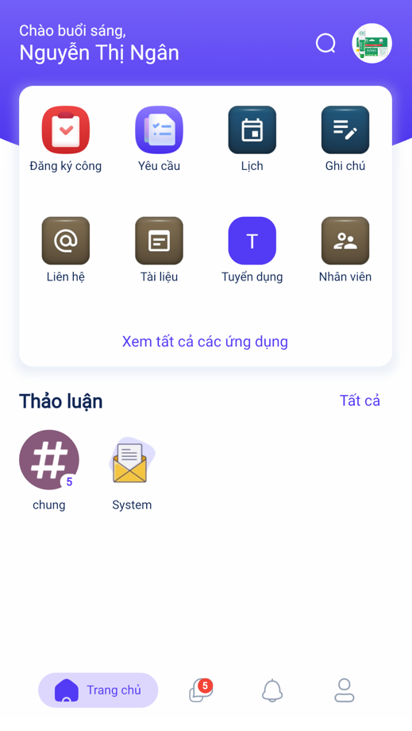
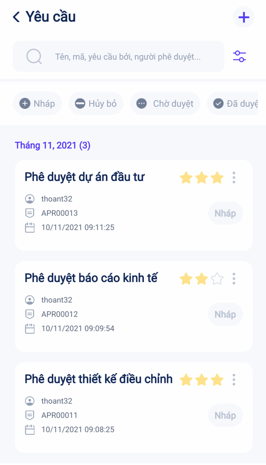
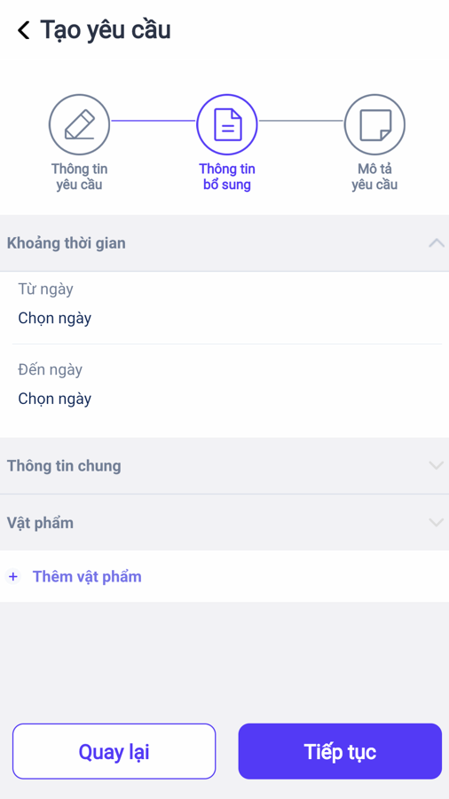
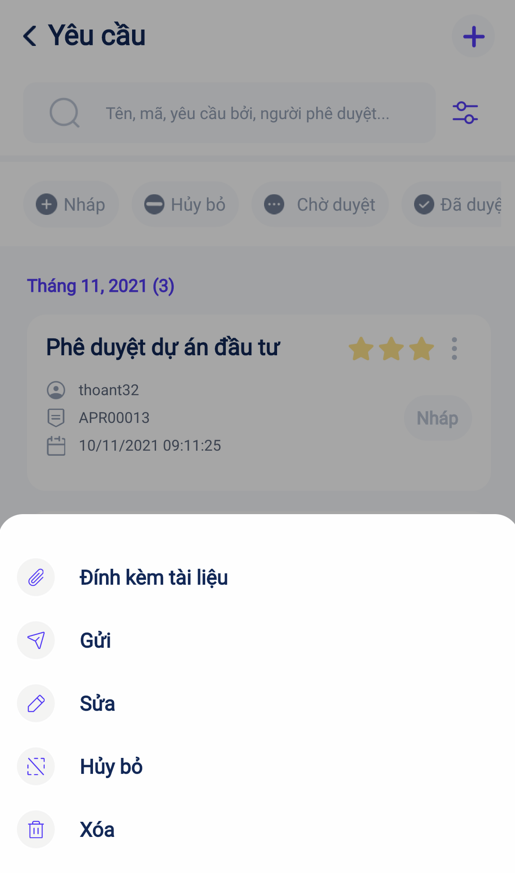
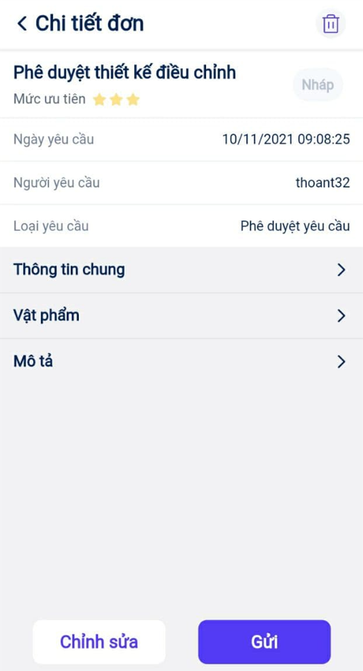
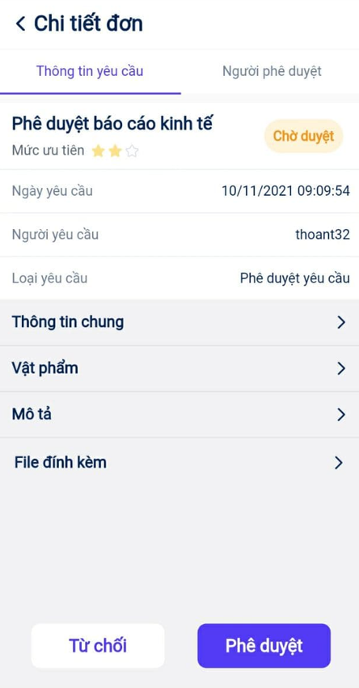

# Quy trình nghiệp vụ

Chức năng **Phê duyệt** hỗ trợ người dùng có thể tạo và gửi phê duyệt các nhiệm vụ, yêu cầu của cán bộ nhân viên đến người có thẩm quyền quyết định một cách dễ dàng. Giúp doanh nghiệp quản lý và nắm bắt đầy đủ các thông tin nhiệm vụ, đồng thời có thể giải quyết các vấn đề trong công việc một cách hiệu quả nhất.

Quy trình Phê duyệt bao gồm 2 phần:

1. **Phê duyệt trên Website**: Quản trị viên thiết lập trường thông tin và tạo các loại phê duyệt. Chi tiết nghiệp vụ <u>[tại đây](https://guide.vess.store/digitalworkplace/Addon-PheDuyet-Web/)</u>.

2. **Phê duyệt trên Mobile**: Cá nhân tạo yêu cầu phê duyệt và các yêu cầu được phê duyệt bởi người được chọn. Chi tiết nghiệp vụ <u>[tại đây](https://guide.vess.store/vESS_mobile/Addon-phe-duyet/)</u>.

**Quy trình**

**Các luồng quy trình**

* Lập yêu cầu phê duyệt. Chi tiết nghiệp vụ <u>[tại đây](#lap-yeu-cau-phe-duyet)</u>.

* Yêu cầu phê duyệt. Chi tiết nghiệp vụ <u>[tại đây](#yeu-cau-phe-duyet)</u>.

* Xử lý yêu cầu phê duyệt. Chi tiết nghiệp vụ <u>[tại đây](#xu-ly-yeu-cau-phe-duyet)</u>.

## **Lập yêu cầu phê duyệt**

**Mục đích**

Người dùng thực hiện lập yêu cầu phê duyệt

**Luồng chức năng chính**

* Lập yêu cầu phê duyệt. Chi tiết nghiệp vụ <u>[tại đây](#lap-yeu-cau-phe-duyet)</u>.

**Đối tượng thực hiện:** Người dùng có quyền sử dụng phân hệ Yêu cầu

### **Lập yêu cầu phê duyệt**

1. Thực hiện truy cập vào app mobile, chọn phân hệ **Yêu cầu**
    
    

2. Để tạo mới yêu cầu phê duyệt người dùng có thể thực hiện bằng một trong hai cách:
    
    * Chọn **Tạo mới** từ màn hình danh sách loại yêu cầu
    
    
    
    * Người dùng cũng có thể nhấn vào loại yêu cầu rồi chọn **icon +** (icon Tạo phê duyệt) để tạo mới yêu cầu
    
    
     
3.  Tiến hành nhập các nội dung cho yêu cầu

    * Người dùng thực hiện nhập **Thông tin yêu cầu**
    
    
    
    * Nhấn **Tiếp tục** để di chuyển đến màn hình **Thông tin bổ sung**
    
    * Nhập thông tin bổ sung cho yêu cầu phê duyệt
    
    
    
    * Nhấn **Tiếp tục** để di chuyển đến màn hình **Mô tả yêu cầu**
    
    * Nhập mô tả cho yêu cầu phê duyệt
    
    
   
4. Nhấn **Lưu**.

    * **Lưu ý:** Sau khi lưu, trạng thái của yêu cầu là **Nháp**

## **Yêu cầu phê duyệt**

**Mô tả**

Gửi yêu cầu đến cán bộ có quyền phê duyệt loại yêu cầu đó.

**Luồng chức năng chính**

* Gửi yêu cầu phê duyệt. Chi tiết nghiệp vụ <u>[tại đây](#gui-yeu-cau-phe-duyet)</u>.

### **Gửi yêu cầu phê duyệt**

Người dùng thực hiện gửi yêu cầu phê duyệt. 

**Đối tượng thực hiện:** Người dùng đã tạo yêu cầu phê duyệt

1. Thực hiện truy cập vào app mobile, chọn phân hệ **Yêu cầu**

2. Để gửi yêu cầu phê duyệt người dùng có thể thực hiện bằng một trong các cách:
    
    * Khi tạo yêu cầu phê duyệt, chọn **Gửi** để gửi luôn yêu cầu
    
    
    
    * Hoặc sau khi đã tạo mới yêu cầu, tại màn hình danh sách thực hiện nhấn vào **icon Menu**, chọn **Gửi**
    
    
    
    * Người dùng cũng có thể truy cập vào chi tiết yêu cầu từ màn hình danh sách rồi nhấn **Gửi**
    
    

3. Sau khi gửi yêu cầu, trạng thái của yêu cầu chuyển thành **Chờ duyệt**
    
    * **Lưu ý:**
        
        * Nếu loại yêu cầu được cấu hình **Tài liệu** là bắt buộc thì khi nhấn **Gửi** sẽ hiển thị thông báo yêu cầu đính kèm tài liệu. Người dùng cần đính kèm tài liệu mới có thế gửi yêu cầu đi.
        
        * Nếu loại yêu cầu được cấu hình **Tài liệu** là tùy chọn thì khi nhấn **Gửi** yêu cầu sẽ được gửi đi luôn.

### **Hủy yêu cầu phê duyệt** 

Người dùng sau khi tạo xong yêu cầu phê duyệt có thể hủy yêu cầu nếu không muốn gửi đi

**Đối tượng thực hiện:** Người dùng đã tạo yêu cầu phê duyệt và trạng thái yêu cầu là nháp

**Điều kiện sử dụng:** Chỉ có thể hủy khi yêu cầu khi phê duyệt ở trạng thái **Nháp**

1. Thực hiện truy cập vào app mobile, chọn phân hệ **Yêu cầu**

2. Chọn loại yêu cầu phê duyệt

3. Chọn **Nháp** tại màn hình danh sách yêu cầu

4. Tại yêu cầu muốn hủy, nhấn **icon Menu**, chọn **Hủy bỏ**

    
    
5. Sau khi hủy yêu cầu, trạng thái của yêu cầu chuyển thành **Hủy bỏ**

### **Xử lý yêu cầu phê duyệt**

**Mô tả**

Người được cấp quyền phê duyệt loại yêu cầu thực hiện chấp thuận, từ chối yêu cầu.

**Luồng chức năng chính**

* Phê duyệt yêu cầu. Chi tiết nghiệp vụ <u>[tại đây](#phe-duyet-yeu-cau)</u>.

* Từ chối yêu cầu. Chi tiết nghiệp vụ <u>[tại đây](#tu-choi-yeu-cau)</u>.

### **Phê duyệt yêu cầu**

Người dùng thực hiện phê duyệt yêu cầu

**Đối tượng thực hiện:** Người dùng được cấp quyền phê duyệt loại yêu cầu

1. Thực hiện truy cập vào app mobile, phân hệ **Yêu cầu**

2. Để đi đến danh sách yêu cầu phê duyệt người dùng có thể thực hiện bằng một trong hai cách:
    
    * Nhấn nút **Chờ duyệt** từ màn hình danh sách loại yêu cầu để di chuyển trực tiếp đến màn hình danh sách yêu cầu cần duyệt
    
    
    
    * Hoặc nhấn vào loại yêu cầu phê duyệt rồi chọn **Chờ duyệt**
    
    
      
3. Người dùng thực hiện phê duyệt yêu cầu
    
    * Tại yêu cầu muốn phê duyệt thực hiện nhấn vào **icon Menu**, chọn **Duyệt**
    
    
    
    * Người dùng cũng có thể truy cập vào chi tiết yêu cầu rồi nhấn **Phê duyệt**
    
    
    
    * **Lưu ý:**
        
        * Nếu loại yêu cầu chỉ có một người phê duyệt thì trạng thái yêu cầu sẽ đổi thành **Đã duyệt** sau khi người đó phê duyệt
        
        * Nếu loại yêu cầu có nhiều người phê duyệt thì trạng thái yêu cầu chỉ đổi thành **Đã duyệt** khi tất cả những người thuộc danh sách phê duyệt đã phê duyệt yêu cầu đó

### **Từ chối yêu cầu**
    
Người dùng thực hiện từ chối yêu cầu phê duyệt

**Đối tượng thực hiện:** Người dùng được cấp quyền phê duyệt loại yêu cầu

1. Thực hiện truy cập vào app mobile, chọn phân hệ **Yêu cầu**

2. Để di chuyển đến danh sách yêu cầu phê duyệt người dùng có thể thực hiện bằng một trong hai cách:

    * Nhấn nút **Chờ duyệt** từ màn hình danh sách loại yêu cầu
    
    
    
    * Hoặc nhấn vào loại yêu cầu phê duyệt rồi chọn **Chờ duyệt**
    
    
      
3. Người dùng thực hiện từ chối yêu cầu phê duyệt
    
    * Tại yêu cầu muốn từ chối thực hiện nhấn vào **icon Menu** chọn **Từ chối**
    
    
    
    * Người dùng cũng có thể truy cập vào chi tiết yêu cầu rồi nhấn **Từ chối**
    
    
    
    * **Lưu ý:**
        
        * Nếu loại yêu cầu chỉ có một người phê duyệt thì trạng thái yêu cầu sẽ đổi thành **Từ chối** sau khi người đó từ chối yêu cầu phê duyệt.
        
        * Nếu loại yêu cầu có nhiều người phê duyệt thì trạng thái yêu cầu sẽ đổi thành **Từ chối** khi một trong những người thuộc danh sách bắt buộc **Từ chối** yêu cầu đó.

