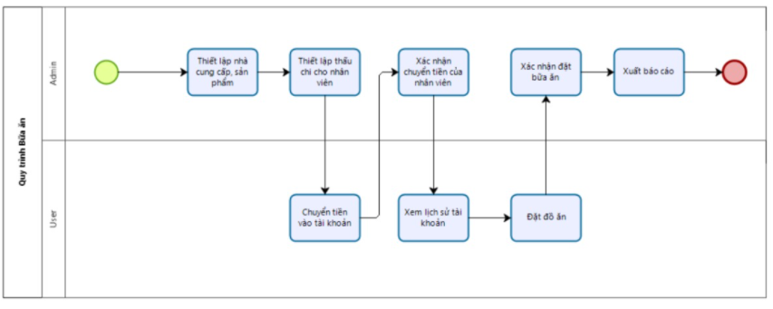
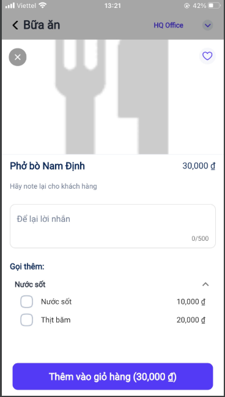

# QUY TRÌNH NGHIỆP VỤ 
Cho phép người dùng thiết lập các thông tin bữa ăn trên app như danh sách món ăn, lịch sử đặt hàng,Lịch sử tài khoản, đặt món ăn. Đưa ra các cảnh báo nhắc nhở người dùng nhằm hỗ trợ người dùng trong việc đặt cơm mỗi ngày.

**Quy trình**

**Các luồng quy trình**

* **Đặt món ăn**. Chi tiết nghiệp vụ <u>[tại đây](#danh_sach_mon_an)</u>.

* **Lịch sử đặt hàng**. Chi tiết nghiệp vụ <u>[tại đây](#lich_su_dat_hang)</u>

* **Lịch sử tài khoản**. Chi tiết nghiệp vụ <u>[tại đây](#lich_su_tai_khoan)</u>

**Mô tả nghiệp vụ**

Khi người sử dụng muốn đặt món ăn thì quy trình thực hiện như sau:

1. Người dùng thực hiện thêm sản phẩm món ăn vào giỏ hàng và thực hiện đặt món

2. Người dùng xem  lịch sử đặt hàng, các giao dịch trong tài khoản và thông tin đơn hàng của các nhà cung cấp.

**Luồng chức năng chính**

* **Đặt món ăn**. Chi tiết nghiệp vụ <u>[tại đây](#danh_sach_mon_an)</u>.

* **Lịch sử đặt hàng**. Chi tiết nghiệp vụ <u>[tại đây](#lich_su_dat_hang)</u>

* **Lịch sử tài khoản**. Chi tiết nghiệp vụ <u>[tại đây](#lich_su_tai_khoan)</u>

 **Video hướng dẫn**
 
 ## **Đặt Món Ăn**
 
**Đối tượng thực hiện:** Người dùng hệ thống

1. Người dùng thực hiện đặt món:

    * Vào chức năng Bữa trưa của tôi/Đơn mới
    
    
    * Chọn món cần đặt:
    
        
    * Món đã thêm vào giỏ hàng, nhấn Đặt món ngay để tạo đơn

    * Lưu ý: Khi thêm món vào giỏ hàng, tài khoản của người dùng phải lớn hơn số tiền của món hoặc tổng tài khoản của người và mức thấu chi tối đa phải lớn hơn giá trị của món. Nếu không sẽ không cho phép đặt món.
    
 ## **Lịch sử cá nhân**
 
**Đối tượng thực hiện:** Người dùng hệ thống

1. Người dùng kiểm tra lại lịch sử đặt hàng của mình bằng cách vào Lịch sử đặt hàng của tôi

    * **Tab Lịch sử**:
    
    * **Trạng thái đặt món**
    
   * Lưu ý: Khi chọn trạng thái là huỷ đơn đổi trạng thái đơn hàng và sẽ hoàn tiền lại đơn hàng vào lịch sử tài khoản. Với trạng thái đã đặt hoặc đã nhận trạng thái được cập nhật tại màn hình danh sách lịch sử  đơn hàng
  
  ## **Lịch sử tài khoản**
 
**Đối tượng thực hiện:** Người dùng hệ thống
   
1.  Người dùng thống kê số tiền đã chuyển vào và mức chi tiêu cá nhân bằng cách vào Lịch sử tài khoản của tôi

    

* **Lưu ý**: Khi huỷ đặt đơn hàng tại màn lịch sử của tôi, hệ thống sẽ tự động hoàn lại tiền món ăn đã đặt 
