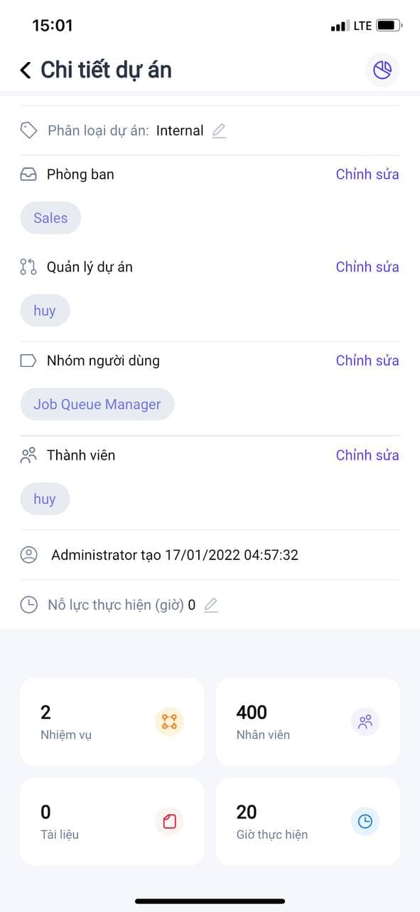
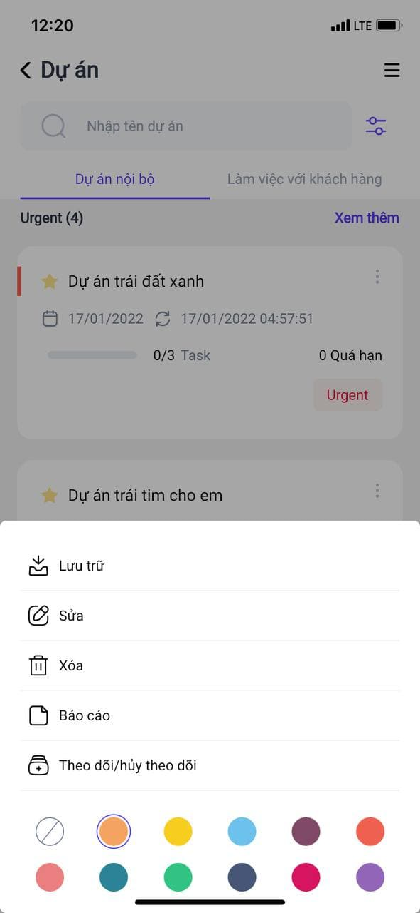

# Quy trình nghiệp vụ

Chức năng này được sử dụng để quản lý danh sách dự án và các nhiệm vụ của dự án trên app như: thêm mới các dự án, xem danh sách các dự án mà mình tạo bao gồm thông tin về dự án, nhiệm vụ của dự án. Cho phép người dùng tạo và phân công nhiệm vụ.

**Quy trình**

**Các luồng quy trình**

* Quản lý dự án. Chi tiết nghiệp vụ <u>[tại đây](#quan-ly-du-an)</u>.

* Quản lý nhiệm vụ của dự án. Chi tiết nghiệp vụ <u>[tại đây](#quan-ly-nhiem-vu-cua-du-an)</u>.

**Mô tả nghiệp vụ**

Khi người sử dụng muốn quản lý thông tin dự án thì quy trình thực hiện như sau:

1. Quản trị viên và Nhân viên đăng nhập vào hệ thống, thực hiện theo dõi các dự án 

2. Quản trị viên thêm mới các dự án 

3. Với mỗi dự án, Quản trị hoặc nhân viên thực hiện thêm nhiệm vụ cho dự án đó 

4. Cập nhật nhiệm vụ và theo dõi lịch sử thay đổi của nhiệm vụ 

**Luồng chức năng chính**

* Quản lý dự án. Chi tiết nghiệp vụ <u>[tại đây](#quan-ly-du-an)</u>.

* Quản lý nhiệm vụ của tôi. Chi tiết nghiệp vụ <u>[tại đây](#quan-ly-nhiem-vu-cua-toi)</u>.

* Quản lý nhiệm vụ trong dự án. Chi tiết nghiệp vụ <u>[tại đây](#quan-ly-nhiem-vu-trong-du-an)</u>.

**Video hướng dẫn**

## **Quản lý dự án**

Chức năng này được sử dụng để quản lý danh sách dự án trên app, cho phép người dùng: thêm mới dự án và xem danh sách các dự án mà mình tạo.

**Đối tượng thực hiện:** Quản trị hệ thống

1. Người dùng đăng nhập vào hệ thống, tại màn hình giao diện nhấn vào biểu tượng  và chọn **Dự án**

2. Tại màn hình danh sách dự án, người dùng thực hiện:

* Tìm kiếm dự án bằng cách nhập giá trị vào ô tìm kiếm  hoặc sử dụng bộ lọc 

* Nhấn **Dự án nội bộ** hoặc **Làm việc với khách hàng** để theo dõi dự án theo phân loại dự án 

3. Dự án được nhóm theo **Độ ưu tiên**, mỗi độ ưu tiên chỉ hiển thị tối đa hai dự án mới nhất. Khi độ ưu tiên có nhiều hơn 2 dự án, người dùng thực hiện nhấn vào **Xem thêm** để xem toàn bộ dự án của độ ưu tiên đó

4. Nhấn vào dự án bất kỳ để xem chi tiết dự án 

* Tại màn hình chi tiết dự án, người dùng nhấn vào **Nhiệm vụ, Nhân viên, Tài liệu, Giờ thực hiện** để xem các thông tin tương ứng của dự án

    
5. Màn hình danh sách dự án, nhấn  tại dự án bất kỳ để thực hiện các thao tác khác:

* Nhấn **Lưu trữ** để thực hiện chuyển dự án vào danh sách lưu trữ

    * **Ghi chú:** khi đã lưu trữ, mặc định ở màn hình danh sách sẽ không nhìn thấy dự án, thực hiện lọc theo dự án đã lưu sẽ thấy bản ghi vừa lưu trữ

* Nhấn **Sửa** để chuyến đến màn hình chi tiết thông tin dự án và thực hiện cập nhật thông tin của dự án 

* Nhấn **Xóa** để xóa dự án (Chỉ xóa được dự án chưa có tồn tại **Nhiệm vụ, Timesheets**)

* Nhấn **Báo cáo**, hiển thị màn hình báo cáo theo dự án

* Nhấn **Theo dõi/Hủy theo dõi** để chuyển dự án vào danh sách theo dõi (nếu chưa theo dõi dự án) hoặc chuyển dự án ra khỏi danh sách theo dõi (nếu đang theo dõi dự án)

* Nhấn màu mong muốn bất kì tại bảng màu để đổi màu cho dự án 

6. Nhấn biểu tượng  tại màn hình danh sách để thêm dự án mới

* **Ghi chú:** chỉ hiển thị biểu tượng thêm mới dự án khi người đăng nhập hệ thống là Quản trị viên 

* Khai báo các thông tin chi tiết của dự án: 

    * Khai báo các thông tin bắt buộc Tên dự án và Quản lý dự án 
    
    * Khai báo hợp lệ các thông tin khác

* Nhấn **Tạo** để thêm mới dự án thành công

    * Sau khi tạo thành công dự án, hệ thống quay trở về màn hình Danh sách dự án

    * **Ghi chú**: Người sử dụng có thể nhấn biểu tượng **<** để thực hiện quay trở về màn hình danh sách nếu không muốn tiếp tục thực hiện thêm mới dự án.

## **Quản lý nhiệm vụ**

### **Quản lý nhiệm vụ của tôi**

Chức năng này được sử dụng để quản lý danh sách nhiệm vụ chung của chính mình trên app, cho phép người dùng: xem danh sách các nhiệm vụ mà mình tạo hoặc được phân công làm nhiệm vụ.

**Đối tượng thực hiện:** Người dùng hệ thống

1. Người dùng đăng nhập vào hệ thống, mặc định sẽ hiển thị màn hình quản lý **Nhiệm vụ** hoặc tại màn hình giao diện nhấn vào biểu tượng  và chọn **Nhiệm vụ**

2. Tại màn hình danh sách, nhiệm vụ được nhóm theo **Trạng thái**, mỗi trạng thái chỉ hiển thị tối đa 5 nhiệm vụ mới nhất. 

* Khi trạng thái đó có nhiều hơn 5 nhiệm vụ, người dùng thực hiện nhấn vào **Xem thêm** để xem toàn bộ nhiệm vụ của trạng thái đó

* Người dùng thực hiện tìm kiếm nhiệm vụ bằng cách nhập giá trị vào ô tìm kiếm  hoặc sử dụng bộ lọc 

3. Nhấn  tại nhiệm vụ bất kỳ để thực hiện các thao tác khác:

* Nhấn **Xuất** để thực hiện xuất thông tin nhiệm vụ

* Nhấn **Lưu trữ** để thực hiện chuyển nhiệm vụ vào danh sách lưu trữ

    * **Ghi chú:** khi nhiệm vụ đã lưu trữ, mặc định ở màn hình danh sách sẽ không nhìn thấy nhiệm vụ, thực hiện lọc theo nhiệm vụ đã lưu sẽ thấy bản ghi vừa lưu trữ

* Nhấn **Xóa** để xóa nhiệm vụ (Chỉ xóa được nhiệm vụ chưa có tồn tại **Timesheets**)

* Nhấn **Theo dõi/Hủy theo dõi** để chuyển nhiệm vụ vào danh sách theo dõi (nếu chưa theo dõi) hoặc chuyển nhiệm vụ ra khỏi danh sách theo dõi (nếu đang theo dõi)

4. Nhấn biểu tượng  ở phía cuối màn hình danh sách nhiệm vụ để thêm mới **Nhiệm vụ**

* Khai báo các thông tin bắt buộc: **Tiêu đề nhiệm vụ**, **Dự án**

    * **Ghi chú:** Với nhiệm vụ được thêm mới từ đây, người sử dụng phải tự khai báo thông tin **Dự án**
* Khai báo các thông tin còn lại hợp lệ 

* Nhấn **Tạo** để thêm nhiệm vụ thành công

    * Sau khi tạo thành công nhiệm vụ, hệ thống quay trở về màn hình Danh sách nhiệm vụ

    * **Ghi chú**: Người sử dụng có thể nhấn biểu tượng **<** để thực hiện quay trở về màn hình danh sách nếu không muốn tiếp tục thực hiện thêm mới nhiệm vụ.

5. Tại màn hình danh sách, nhấn vào nhiệm vụ bất kỳ để xem chi tiết nhiệm vụ

* Tại mục **Thông tin**

    * Nhấn **Lên công việc** để tạo mới việc cần làm của nhiệm vụ 

    * Nhấn **Lên timesheets** để tạo timesheets cho nhiệm vụ 
    
    * Tại mục **Việc cần làm** và **Timesheets**, khi có nhiều hơn 5 bản ghi, nhấn **Xem tất cả** để xem toàn bộ bản ghi
    
    * Nhấn biểu tượng  tại mỗi bản ghi để thực hiện thao tác **Sửa** hoặc **Xóa** bản ghi **Việc cần làm**, **Timesheets**
    
* Nhấn mục **Nhiệm vụ con** hoặc **Trao đổi** để xem các tin khác của nhiệm vụ 

* Nhấn biểu tượng  để xem lịch sử thay đổi của nhiệm vụ 
  

### **Quản lý nhiệm vụ trong dự án**

Chức năng này được sử dụng để quản lý danh sách nhiệm vụ của chính mình trên app theo dự án, cho phép người dùng: xem danh sách các nhiệm vụ mà mình tạo hoặc được phân công làm nhiệm vụ.

**Đối tượng thực hiện:** Người dùng hệ thống

1. Người dùng đăng nhập vào hệ thống, tại màn hình giao diện nhấn vào biểu tượng  và chọn **Dự án**

2. Tại màn hình danh sách dự án, người dùng thực hiện nhấn vào dự án bất kỳ để xem chi tiết dự án

3. Tại màn hình chi tiết dự án, người dùng nhấn vào **Nhiệm vụ** để xem danh sách các nhiệm vụ của dự án

* Nhiệm vụ sẽ được nhóm theo **Trạng thái**, mỗi trạng thái chỉ hiển thị tối đa 5 nhiệm vụ mới nhất. 

* Khi trạng thái đó có nhiều hơn 5 nhiệm vụ, người dùng thực hiện nhấn vào **Xem thêm** để xem toàn bộ nhiệm vụ của trạng thái đó

* Người dùng thực hiện tìm kiếm nhiệm vụ bằng cách nhập giá trị vào ô tìm kiếm  hoặc sử dụng bộ lọc 

4. Người dùng nhấn  để chọn kiểu hiển thị danh sách nhiệm vụ dưới dạng **Danh sách, Bảng** hoặc **Lịch biểu**

5. Nhấn  tại nhiệm vụ bất kỳ để thực hiện các thao tác khác:

* Nhấn **Xuất** để thực hiện xuất thông tin nhiệm vụ

* Nhấn **Lưu trữ** để thực hiện chuyển nhiệm vụ vào danh sách lưu trữ

    * **Ghi chú:** khi nhiệm vụ đã lưu trữ, mặc định ở màn hình danh sách sẽ không nhìn thấy nhiệm vụ, thực hiện lọc theo nhiệm vụ đã lưu sẽ thấy bản ghi vừa lưu trữ

* Nhấn **Xóa** để xóa nhiệm vụ (Chỉ xóa được nhiệm vụ chưa có tồn tại **Timesheets**)

* Nhấn **Theo dõi/Hủy theo dõi** để chuyển nhiệm vụ vào danh sách theo dõi (nếu chưa theo dõi) hoặc chuyển nhiệm vụ ra khỏi danh sách theo dõi (nếu đang theo dõi)

6. Nhấn  tại cuối màn hình danh sách để thêm mới **Nhiệm vụ**

* Khai báo các thông tin bắt buộc: **Tiêu đề nhiệm vụ**, **Dự án**

    * **Ghi chú:** Với nhiệm vụ được thêm mới từ **Dự án**, người sử dụng không phải tự khai báo thông tin **Dự án**, dữ liệu sẽ tự động lấy là tên dự án người dùng chọn từ màn hình danh sách dự án
    
    * Người dùng có thể chọn lại dự án khác, khi đó nhiệm vụ được tạo sẽ thuộc dự án vừa được chọn
    
* Khai báo các thông tin còn lại hợp lệ 

* Nhấn **Tạo** để thêm nhiệm vụ thành công

    * Sau khi tạo thành công nhiệm vụ, hệ thống quay trở về màn hình Danh sách nhiệm vụ

    * **Ghi chú**: Người sử dụng có thể nhấn biểu tượng **<** để thực hiện quay trở về màn hình danh sách nếu không muốn tiếp tục thực hiện thêm mới nhiệm vụ.

7. Tại màn hình danh sách nhiệm vụ, nhấn vào nhiệm vụ bất kỳ để xem chi tiết nhiệm vụ

* Tại mục **Thông tin**

    * Nhấn **Lên công việc** để tạo mới việc cần làm của nhiệm vụ 

    * Nhấn **Lên timesheets** để tạo timesheets cho nhiệm vụ 
    
    * Tại mục **Việc cần làm** và **Timesheets**, khi có nhiều hơn 5 bản ghi, nhấn **Xem tất cả** để xem toàn bộ bản ghi
    
    * Nhấn biểu tượng  tại mỗi bản ghi để thực hiện thao tác **Sửa** hoặc **Xóa** bản ghi **Việc cần làm**, **Timesheets**
    
* Nhấn mục **Nhiệm vụ con** hoặc **Trao đổi** để xem các tin khác của nhiệm vụ 

* Nhấn biểu tượng  để xem lịch sử thay đổi của nhiệm vụ 
  
    
  
    
  
    
  
    
  
    
  
    

