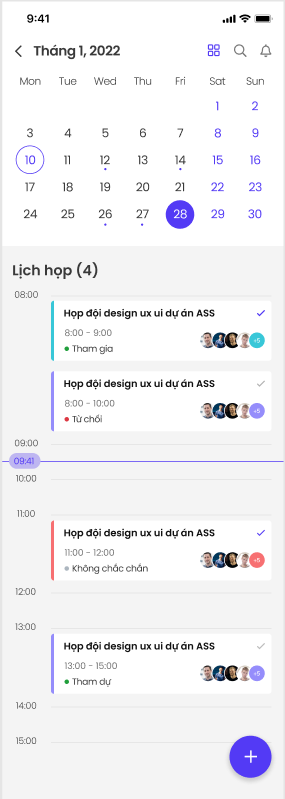
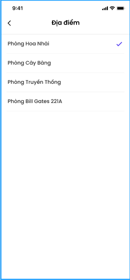
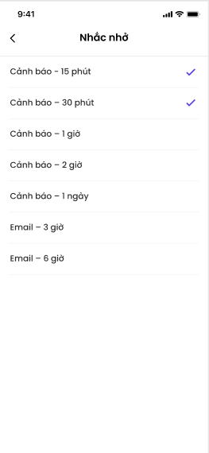
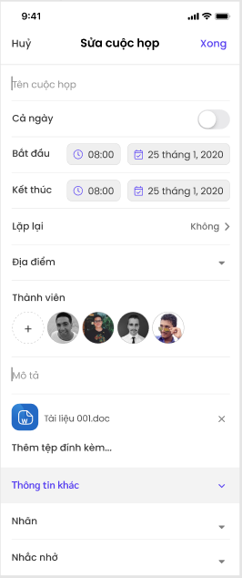
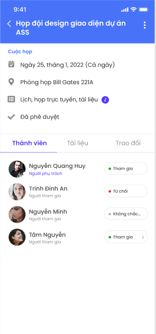

# Quy trình nghiệp vụ
Chức năng Lịch hỗ trợ người dùng xem các lịch theo ngày, tuần, tháng, năm,... Người dùng có thể chủ động tạo lịch họp, sự kiện cá nhân, cuộc họp trực tuyến. Người dùng được cấp quyền sẽ vào phê duyệt lịch (nếu có)

## Quy trình

## Các luồng quy trình
  * Xem lịch tuần. Chi tiết nghiệp vụ tại <u>[tai đây](#xem-lich-tuan)</u>
  * Xem lịch tháng. Chi tiết nghiệp vụ tại <u>[tai đây](#xem-lich-thang)</u>
  * Xem lịch theo danh sách. Chi tiết nghiệp vụ tại <u>[tai đây](#xem-lich-theo-danh-sach)</u>
  * Tạo cuộc họp. Chi tiết nghiệp vụ tại <u>[tai đây](#tao-cuoc-hop)</u>
  * Tạo sự kiện cá nhân. Chi tiết nghiệp vụ tại <u>[tai đây](#tao-su-kien-ca-nhan)</u>
  * Tạo cuộc họp trực tuyến. Chi tiết nghiệp vụ tại <u>[tai đây](#tao-cuoc-hop-truc-tuyen)</u>
   * Phê duyệt cuộc họp. Chi tiết nghiệp vụ tại <u>[tai đây](#phe-duyet-cuoc-hop)</u>
## Mô tả nghiệp vụ

Người dùng tạo cuộc họp/sự kiện cá nhân/ cuộc họp trực tuyến; người phê duyệt sẽ phê duyệt cuộc họp (đối với cuộc họp có sử dụng phòng họp). Sau khi phê duyệt, thông báo lịch họp sẽ được gửi cho các thành viên tham dự. 

## Luồng chức năng chính

  * Xem lịch tuần. Chi tiết nghiệp vụ tại <u>[tai đây](#xem-lich-tuan)</u>
  * Xem lịch tháng. Chi tiết nghiệp vụ tại <u>[tai đây](#xem-lich-thang)</u>
  * Xem lịch theo danh sách. Chi tiết nghiệp vụ tại <u>[tai đây](#xem-lich-theo-danh-sach)</u>
  * Tìm kiếm lịch. Chi tiết nghiệp vụ tại <u>[tai đây](#tim-kiem-lich)</u>
  * Tạo cuộc họp. Chi tiết nghiệp vụ tại <u>[tai đây](#tao-cuoc-hop)</u>
  * Tạo sự kiện cá nhân. Chi tiết nghiệp vụ tại <u>[tai đây](#tao-su-kien-ca-nhan)</u>
  * Tạo cuộc họp trực tuyến. Chi tiết nghiệp vụ tại <u>[tai đây](#tao-cuoc-hop-truc-tuyen)</u>
  * Gửi Email. Chi tiết nghiệp vụ tại <u>[tai đây](#gui-email)</u>
  * Gửi tin/gửi ghi chú. Chi tiết nghiệp vụ tại <u>[tai đây](#gui-tin-gui-ghi-chu)</u>
  * Chỉnh sửa/Xóa cuộc họp. Chi tiết nghiệp vụ tại <u>[tai đây](#chinh-sua-xoa-cuoc-hop)</u>
  * Thay đổi trạng thái tham dự. Chi tiết nghiệp vụ tại <u>[tai đây](#thay-doi-trang-thai-tham-du)</u>
  * Phê duyệt cuộc họp. Chi tiết nghiệp vụ tại <u>[tai đây](#phe-duyet-cuoc-hop)</u>
  
## Xem lịch tuần

Người dùng xem các lịch họp trong tuần. 

**Đối tượng thực hiện:** Người dùng có quyền sử dụng phân hệ **Lịch**.

1. Người dùng truy cập hệ thống, chọn phân hệ **Lịch**

2. Người dùng chọn ngày trong tuần muốn xem lịch, chọn ngày bất kỳ trong tuần. 

*Ghi chú:* Nếu người dùng muốn xem lịch tuần trước đó hoặc tuần kế tiếp, tại vùng lịch tuần có thể vuốt qua phải để xem lịch tuần kế tiếp hoặc vuốt qua trái để xem lịch tuần trước đó

## Xem lịch tháng

Người dùng xem các lịch họp trong tháng. 

**Đối tượng thực hiện:** Người dùng có quyền sử dụng phân hệ **Lịch**.

 

1. Người dùng truy cập hệ thống, người dùng chọn phân hệ **Lịch**

2. Tại giao diện lịch Tuần, người dùng chọn   hiển thị giao diện lịch tháng

 - Để chọn tháng khác, tại danh sách lịch tháng người dùng chọn    tháng đang hiển thị, sau đó chọn tháng mình muốn xem trong danh sách tháng hiển thị.
 
 
 
*Ghi chú:* Để chọn tháng khác tại năm khác, tại danh sách tháng người dùng chọn năm đang hiển thị, sau đó chọn bất kì một ngày trong tháng mà mình muốn trong danh sách năm.

## Xem lịch theo danh sách

Người dùng xem danh sách lịch trong 1 tháng. 

**Đối tượng thực hiện:** Người dùng có quyền sử dụng phân hệ **Lịch**.

1.  Người dùng truy cập hệ thống, chọn phân hệ **Lịch**

2. Tại lịch Tuần, người dùng chọn  , hệ thống hiển thị Lịch dạng danh sách

*Ghi chú:* Để chọn tháng khác, người dùng quay lại giao diện lịch tháng dạng bảng, chọn tháng cần xem sau đó xem lịch tuần của tháng và thao tác tương tự dạng danh sách.

## Tìm kiếm lịch

Người dùng tìm lịch trong danh sách lịch 

**Đối tượng thực hiện:** Người dùng có quyền sử dụng phân hệ **Lịch**.

1. Người dùng truy cập hệ thống, chọn phân hệ **Lịch**

2. Tại giao diện xem lịch theo tuần, theo tháng, danh sách. Người dùng chọn tại vùng nhập ký tự tìm kiếm

3. Người dùng nhập tên cuộc họp muốn tìm kiếm

4. Tại danh sách kết quả tìm kiếm, người dùng chọn tại 1 vùng của cuộc họp để xem chi tiết cuộc họp đó.

## Tạo cuộc họp 

Người dùng có thể tạo cuộc họp có hoặc không có sử dụng phòng họp. Nếu cuộc họp có sử dụng phòng họp sẽ cần chờ phê duyệt. 

**Thời gian thực hiện**: Không giới hạn.

**Đối tượng thực hiện:** Người dùng có quyền sử dụng phân hệ **Lịch**.

1. Người dùng truy cập vào ứng dụng, chọn phân hệ **Lịch.**

2. Người dùng chọn  để tạo cuộc họp, chọn phân loại: **Tạo cuộc họp**

3. Ứng dụng mở ra giao diện màn hình thêm mới thông tin cuộc họp:

- Nhập thông tin tên cuộc họp (trường bắt buộc)

- Nếu cuộc họp diễn ra cả ngày, chọn Cả ngày "ON". Khi đó thời gian cuộc họp sẽ được mặc định từ 00:00-24:00 ngày hiện tại.

- Bắt đầu: chọn thời gian bắt đầu cuộc họp 

- Kết thúc: chọn thời gian kết thúc cuộc họp

- Lặp lại: người dùng có thể cấu hình lặp lại cuộc họp theo ngày/theo tuần/theo tháng hoặc chọn không lặp lại

*Lưu ý:*

*- Khi người dùng chọn lặp lại Hàng ngày, hàng tháng, hệ thống cho phép người dùng chọn ngày kết thúc lặp lại* 

*- Nếu người dùng chọn lặp lại Hàng tuần, cho phép người dùng chọn lặp lại các thứ trong tuần và ngày kết thúc lặp lại*

*- Nếu không chọn ngày kết thúc lặp lại, cuộc họp sẽ được lặp lại mãi mãi theo lựa chọn đã được chọn.*

- Người dùng có thể chọn địa điểm cho cuộc họp hoặc không. Với những cuộc họp chọn địa điểm, sẽ cần chờ phê duyệt của người dùng được phân quyền. 

 
 
- Người phụ trách: khi tạo cuộc họp, người phụ trách sẽ mặc định là người dùng đang đăng nhập, tuy nhiên người dùng có thể thay đổi người phụ trách phù hợp khi chọn 

- Người chuẩn bị: người dùng có thể chọn người chuẩn bị cho cuộc họp tương ứng

- Thành viên: người dùng chọn ở mục **Thành viên** để thêm thành viên tham gia cuộc họp, có thể chọn nhiều thành viên. Người dùng có thể thực hiện tìm kiếm 

- Mô tả: người dùng nhập nội dung mô tả cho cuộc họp 

- Thêm tệp đính kèm: người dùng chọn vào  **Thêm tệp đính kèm** để đính kèm file cho thông tin cuộc họp, Chọn **(X)** để xoá tệp muốn tải lên 

- Thông tin khác

 * Nhãn: người dùng chọn **Nhãn** để chọn nhãn hiển thị tương ứng cho cuộc họp, có thể chọn 1 hoặc nhiều nhãn. 
 
 

 * Nhắc nhở: người dùng chọn nhắc nhở khi muốn thông báo về lịch của cuộc họp theo tuỳ chọn tương ứng
 
 

 * Hiển thị thời gian: cho phép người dùng tùy chọn hiển thị thời gian của mình để có thể tham gia cuộc họp khác

    * Rảnh: tất cả người tham dự được chọn là rảnh trong thời gian đó và vẫn tham gia vào được cuộc họp khác nếu trùng giờ

    * Bận: tất cả người tham dự được chọn là bận trong thời gian đó, không tham gia được cuộc họp trùng giờ khác.
    

* Tính riêng tư: cho phép người dùng chọn tính riêng tư cho cuộc họp, khi tạo cuộc họp xong, những người tham gia sẽ nhận được email thông báo xác nhận tham gia cuộc họp kèm đường dẫn

   * Mọi người: mọi người chọn vào đuờng dẫn đều xem được thông tin cuộc họp

   * Chỉ mình tôi: chỉ người tạo xem được thông tin cuộc họp

   * Người dùng nội bộ: chỉ những người dùng trong hệ thống mới nhìn thấy thông tin cuộc họp
 

4. Người dùng chọn **Thêm** để thêm mới thông tin cuộc họp, hoặc chọn  **Huỷ** nếu muốn huỷ tạo mới cuộc họp, quay về màn hình danh sách cuộc họp trước đó.

## Tạo sự kiện cá nhân 

Cho phép người dùng tạo sự kiện cá nhân cho mình, không cần phê duyệt. 

**Thời gian thực hiện:** Không giới hạn.

**Đối tượng thực hiện:** Người dùng có quyền sử dụng phân hệ **Lịch**.

1. Người dùng truy cập vào ứng dụng, chọn phân hệ **Lịch.**

2. Người dùng chọn  để tạo cuộc họp, chọn phân loại: **Tạo sự kiện cá nhân**

3. Ứng dụng mở ra giao diện màn hình thêm mới thông tin sự kiện cá nhân:

- Tên cuộc họp: Nhập thông tin tên cuộc họp (trường bắt buộc)

- Nếu sự kiện diễn ra cả ngày, chọn Cả ngày ON. Khi đó thời gian sự kiện sẽ được mặc định từ 00:00-24:00 ngày hiện tại.

- Bắt đầu: chọn thời gian bắt đầu sự kiện 

- Kết thúc: chọn thời gian kết thúc sự kiện, lưu ý thời gian kết thúc không được sớm hơn thời gian bắt đầu

- Mô tả: người dùng nhập nội dung mô tả cho sự kiện 

- Thông tin khác *(Tương tự thao tác tạo mới cuộc họp. Xem chi tiết tại <u>[tai đây](#tao-cuoc-hop)</u> )*

4. Người dùng chọn **Thêm** để thêm mới thông tin sự kiện cá nhân, hoặc chọn  **Huỷ** nếu muốn huỷ tạo mới sự kiện cá nhân, quay về màn hình danh sách cuộc họp trước đó.

## Tạo cuộc họp trực tuyến

Cho phép người dùng tạo cuộc họp trực tuyến, nếu cuộc họp có sử dụng phòng hợp thì cần được phê duyệt. 

**Thời gian thực hiện:** Không giới hạn.

**Đối tượng thực hiện:** Người dùng có quyền sử dụng phân hệ **Lịch**.

1. Người dùng truy cập vào ứng dụng, chọn phân hệ **Lịch.**

2. Người dùng chọn  để tạo cuộc họp, chọn phân loại: **Tạo sự cuộc trực tuyến**, sau đó người dùng chọn tạo cuộc họp **"Zoom"** hoặc **"Google meet"**

3. Ứng dụng mở ra giao diện màn hình thêm mới thông tin cuộc họp trực tuyến:

- Tên cuộc họp: Nhập thông tin tên cuộc họp (trường bắt buộc)

- Nếu cuộc họp diễn ra cả ngày, chọn Cả ngày ON. Khi đó thời gian cuộc họp sẽ được mặc định từ 00:00-24:00 ngày hiện tại.

- Bắt đầu: chọn thời gian bắt đầu cuộc họp 

- Kết thúc: chọn thời gian kết thúc cuộc họp, lưu ý không được kết thúc sớm hơn thời gian bắt đầu

- Lặp lại: người dùng có thể cấu hình lặp lại cuộc họp theo ngày/theo tuần/theo tháng hoặc chọn không lặp lại (tương tự tạo cuộc họp)

- Địa điểm: người dùng có thể chọn địa điểm cho cuộc họp hoặc không. Với những cuộc họp chọn địa điểm, sẽ cần chờ phê duyệt của người được phân quyền

- Người phụ trách: khi tạo cuộc họp, người phụ trách sẽ mặc định là người dùng đang đăng nhập, tuy nhiên người dùng có thể thay đổi người phụ trách phụ hợp khi chọn 

- Người chuẩn bị: người dùng có thể chọn người chuẩn bị cho cuộc họp tương ứng

- Thành viên: người dùng chọn  ở mục Thành viên để thêm thành viên tham gia cuộc họp, có thể chọn nhiều thành viên. Người dùng có thể thực hiện tìm kiếm tên thành viên ở ô tìm kiếm.

- Gửi thêm email: cho phép người dùng nhập email của người tham dự ngoài danh sách người tham dự đã chọn

- Mô tả: người dùng nhập nội dung mô tả cho cuộc họp 

- Thêm tệp đính kèm: người dùng chọn **Thêm tệp đính kèm** để đính kèm tệp cho thông tin cuộc họp, chọn **(X)** để xoá tệp muốn tải lên 

- Thông tin khác *(Tương tự thao tác tạo mới cuộc họp. Xem chi tiết tại <u>[tai đây](#tao-cuoc-hop)</u> )*

4. Người dùng chọn **Thêm** để thêm mới thông tin cuộc họp trực tuyến, hoặc chọn  **Huỷ** nếu muốn huỷ tạo mới cuộc họp trực tuyến, quay về màn hình danh sách cuộc họp trước đó.

## Gửi Email

Người dùng gửi Email mời tham gia cuộc họp

**Đối tượng thực hiện:** Người dùng có quyền sử dụng phân hệ **Lịch**. 

1. Người dùng truy cập ứng dụng, chọn phân hệ **Lịch** -> **Tạo mới cuộc họp trực tuyến**

2. Tại giao diện tạo mới cuộc họp trực tuyến, người dùng chọn **Gửi thêm Email**

3. 
-	NSD tìm kiếm và chọn danh sách người nhận tại mục nhận nhận

-	NSD nhập tên địa chỉ emai muốn mời họp, các email được ngăn cách bởi dấu (,)

-	NSD nhập nội dung cho email, nếu người muốn sử dụng mẫu Email, người dùng chọn  
 và chọn mẫu Email
 

4.  Sau khi hoàn tất, người dùng chọn  để gửi Email cho danh sách người nhận đã chọn.

## Gửi tin/Gửi ghi chú

Người dùng thực hiện thao tác bình luận, trao đổi cho Lịch và  các hành động có liên quan

**Đối tượng thực hiện:** Người dùng có quyền sử dụng phân hệ **Lịch**.

1. Người dùng truy cập ứng dụng, chọn phân hệ **Lịch**

2. Tại giao diện chi tiết cuộc họp, người dùng chọn **"Trao đổi".** Người dùng nhập nội dung cho tin nhắn/bình luận muốn trao đổi

3.  Sau khi nhập nội dung xong, người dùng chọn  để thực hiện gửi tin/ghi chú. 

## Chỉnh sửa/Xóa Lịch

Người dùng có nhu cầu chỉnh sửa hoặc xóa cuộc họp đã tạo

1. Người dùng truy cập ứng dụng, chọn phân hệ **Lịch** -> **Chi tiết cuộc họp**

2. Tại giao diện chi tiết cuộc họp, người dùng chọn  sau đó lựa chọn thao tác Sửa/Xóa

3.  Người dùng lựa chọn thao tác muốn thức hiện với cuộc họp

-	Nếu người dùng chọn **"Sửa"**, tại màn hình chỉnh sửa cuộc họp. Người dùng nhập các thông tin cần chỉnh sửa cho cuộc họp sau đó chọn **“ Xong”** để tiến hành lưu thông tin chỉnh sửa của cuộc họp. Để hủy thao tác sửa cuộc họp, Người dùng chọn  **“Hủy”**

*Ghi chú: Đối với cuộc họp có lặp lại, người dùng có thể chọn loại áp dụng chỉnh sửa cho cuộc họp, gồm:*

*+ Cuộc họp này: áp dụng sửa cho cuộc họp hiện tại*

*+ Cuộc họp này và các cuộc họp tiếp theo: áp dụng cho cuộc họp hiện tại và tương lại*

*+ Tất cả sự kiện: Tất cả các cuộc họp, bao gồm cuộc họp trong quá khứ*

-	Nếu Người dùng chọn  **"Xóa"**, thực hiện xóa cuộc họp. Người dùng có thể hoàn tác việc xóa trong 3(s)

## Thay đổi trạng thái tham dự

Người dùng có thể thay đổi trạng thái tham dự cuộc họp

**Đối tượng thực hiện:** Người dùng có quyền sử dụng phân hệ **Lịch**. 

1. Người dùng truy cập ứng dụng, chọn phân hệ **Lịch** -> **Chi tiết cuộc họp**

2. Tại giao diện xem chi tiết cuộc họp cuộc họp, phần **Thành viên**

 

3.  Người dùng lựa chọn trạng thái muốn thay đổi. Sau khi chọn xong, hệ thống lưu lại trạng thái mới của người dùng

## Phê duyệt cuộc họp

Cho phép người dùng được phân quyền phê duyệt cuộc họp có sử dụng phòng họp

**Thời gian thực hiện:** Không giới hạn.

**Đối tượng thực hiện:** Người dùng có quyền sử dụng phân hệ **Lịch**, người dùng được cấp quyền phê duyệt

1. Người dùng xem thông báo có cuộc họp cần phê duyệt và chọn cuộc họp muốn phê duyệt

2. Ứng dụng mở ra giao diện màn hình danh sách cuộc họp đang chờ phê duyệt

Người dùng có thể xem danh sách **Chờ phê duyệt/ Đã phê duyệt/ Từ chối** khi chọn  vào trạng thái tương ứng

3. Người dùng chọn **Phê duyệt** hoặc **Từ chối** cho cuộc họp

4.  Nếu cuộc họp được thiết lập định kỳ, người phê duyệt có thể chọn
**Phê duyệt/từ chối** cho **Cuộc họp này/ Cuộc họp này và các cuộc họp tiếp/ Tất cả các sự kiện**.

