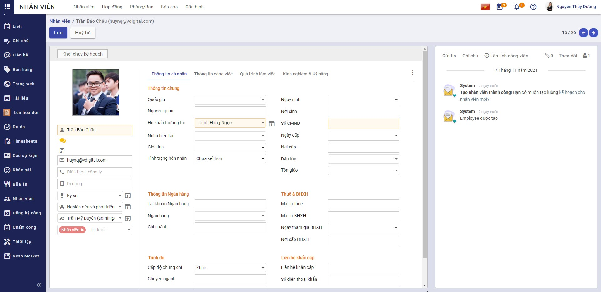

## Thiết lập và khai báo ban đầu

Việc thiết lập và khai báo ban đầu được thực hiện khi lần đầu cài đặt hệ thống, giúp khởi tạo dữ liệu và bắt đầu cho việc thực hiện các nghiệp vụ vESS mobile

#### Thiết lập ban đầu

**Đối tượng thực hiện:** Quản trị hệ thống

Việc thiết lập ban đầu được thực hiện ngay tại thời điểm tạo tài khoản cho nhân viên: Đây là điều kiện cần có và bắt buộc để có thể đăng nhập được vào ứng dụng trên mobile

**Luồng nghiệp vụ chính**

* Cài đặt ứng dụng Nhân viên, Tài liệu. Chi tiết <u>[tại đây](../../saas/saas/#ang-ky-va-cai-at-cac-ung-dung)</u>

* Tạo tài khoản cá nhân. Chi tiết <u>[tại đây](../../hrm/employee/#tao-tai-khoan)</u>.

* Khai báo thông tin nhân viên. Chi tiết <u>[tại đây](../../hrm/employee/#them-moi-ho-so-nhan-vien)</u>.

* Gán tài khoản cá nhân với nhân viên. Chi tiết <u>[tại đây](#gan-tai-khoan-ca-nhan-voi-nhan-vien)</u>.

* Thiết lập số điện thoại nhận mã OTP. Chi tiết <u>[tại đây](#thiet-lap-so-ien-thoai-nhan-ma-oyt)</u>.

#### Gán tài khoản cá nhân với nhân viên

Các bước thực hiện

1. Vào phân hệ Nhân viên, tìm kiếm nhân viên cần cập nhật thông tin tại màn hình Danh sách nhân viên

2. Tại phần Thông tin công việc, nhấn nút **Sửa**

3. Tại Tài khoản hệ thống/ Tên đăng nhập: chọn tài khoản cá nhân tương ứng

Sau đó nhấn **Lưu**

#### Thiết lập số điện thoại nhận mã OTP

Các bước thực hiện 

1. Vào phân hệ Nhân viên, tìm kiếm nhân viên cần cập nhật thông tin tại màn hình Danh sách nhân viên

2. Tại phần Thông tin cá nhân, nhấn nút **Sửa**

3. Tại Điện thoại công ty và Di động: khai báo thông tin số điện thoại sẽ nhận mã OTP được gửi đến 

Sau đó nhấn **Lưu**

* **Lưu ý:** Khi người dùng đăng nhập hệ thống trên mobile, mặc định mã OTP sẽ gửi đến số điện thoại Di động. Nếu số điện thoại Di động không được khai báo, mã OTP sẽ được gửi tới số Điện thoại công ty.